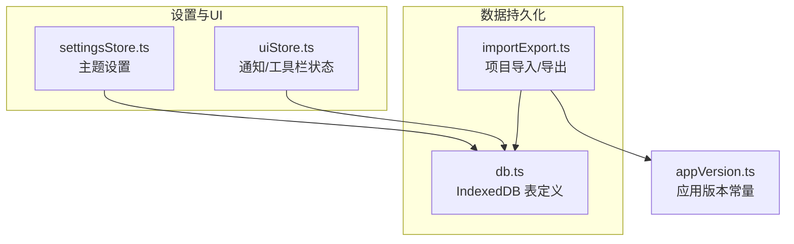
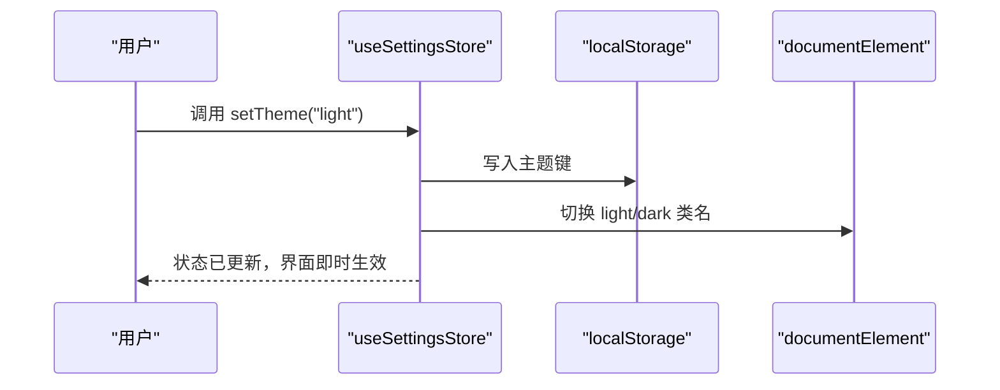
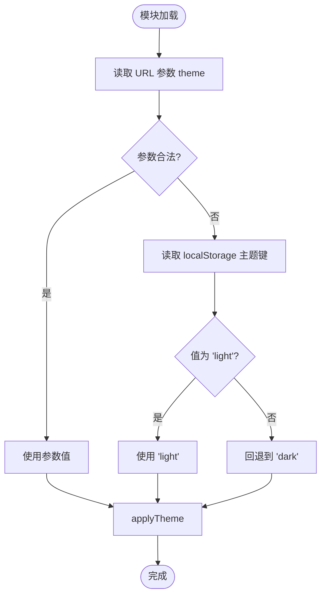
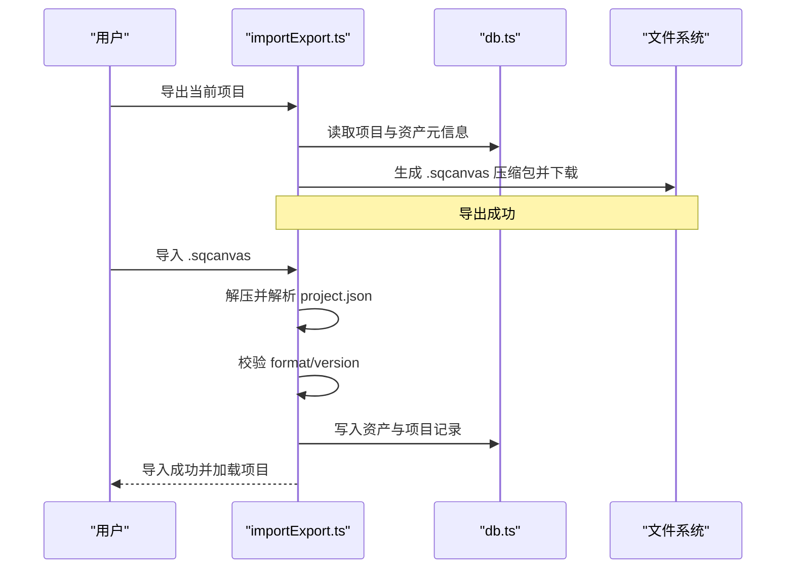
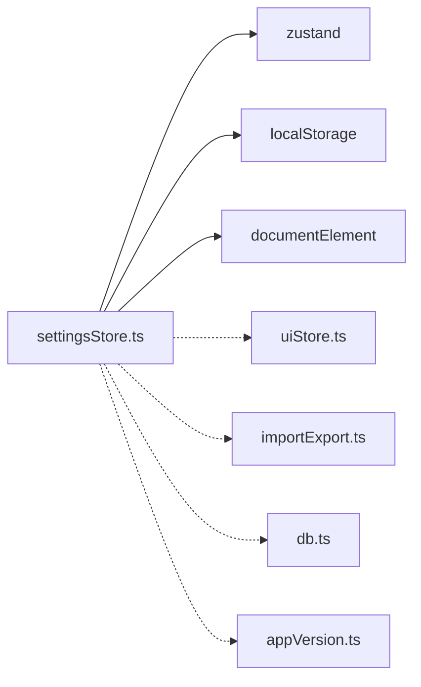

# 设置状态管理（SettingsStore）

<cite>
**本文引用的文件**
- [settingsStore.ts](file://src/store/settingsStore.ts)
- [uiStore.ts](file://src/store/uiStore.ts)
- [importExport.ts](file://src/io/importExport.ts)
- [db.ts](file://src/db/db.ts)
- [appVersion.ts](file://src/appVersion.ts)
</cite>

## 目录
1. [简介](#简介)
2. [项目结构](#项目结构)
3. [核心组件](#核心组件)
4. [架构总览](#架构总览)
5. [详细组件分析](#详细组件分析)
6. [依赖关系分析](#依赖关系分析)
7. [性能考虑](#性能考虑)
8. [故障排查指南](#故障排查指南)
9. [结论](#结论)
10. [附录](#附录)

## 简介
本文件聚焦于应用“设置状态管理”，以 SettingsStore 为核心，说明其如何管理用户偏好与应用选项（当前为主题模式），并阐述设置的读取、保存、默认值处理与验证逻辑。同时结合项目的导入导出能力与本地存储机制，给出扩展设置项、版本兼容与迁移策略的建议，并提供自定义、重置、导入/导出的操作示例路径，帮助读者在现有架构上安全地扩展更多设置。

## 项目结构
- 设置状态由 Zustand store 管理，当前实现包含主题设置及其持久化。
- UI 状态由独立 store 管理，提供通知等通用能力。
- 导入导出模块负责项目数据的序列化与反序列化，具备格式与版本校验。
- 数据库层使用 IndexedDB（Dexie）持久化项目与素材。
- 应用版本常量集中管理，便于未来做兼容性判断。

**图示来源**
- [settingsStore.ts:1-39](file://src/store/settingsStore.ts#L1-L39)
- [uiStore.ts:1-121](file://src/store/uiStore.ts#L1-L121)
- [db.ts:25-33](file://src/db/db.ts#L25-L33)
- [importExport.ts:13-15](file://src/io/importExport.ts#L13-L15)
- [appVersion.ts:1-3](file://src/appVersion.ts#L1-L3)

**章节来源**
- [settingsStore.ts:1-39](file://src/store/settingsStore.ts#L1-L39)
- [uiStore.ts:1-121](file://src/store/uiStore.ts#L1-L121)
- [db.ts:25-33](file://src/db/db.ts#L25-L33)
- [importExport.ts:13-15](file://src/io/importExport.ts#L13-L15)
- [appVersion.ts:1-3](file://src/appVersion.ts#L1-L3)

## 核心组件
- SettingsStore：基于 Zustand 创建，维护 theme 状态，提供 setTheme/toggleTheme 方法；启动时从 URL 参数或 localStorage 读取初始值，并立即应用到 DOM。
- applyTheme：将主题类名切换至根节点，驱动样式系统。
- uiStore：提供 toast 通知等通用 UI 能力，可被设置相关交互复用。
- importExport：提供项目导出/导入能力，具备格式与版本校验，可作为设置迁移的参考范式。
- db：定义 IndexedDB 表结构与清理策略，体现本地持久化的组织方式。
- appVersion：集中声明应用版本，便于后续做设置/数据结构的版本兼容判断。

**章节来源**
- [settingsStore.ts:7-39](file://src/store/settingsStore.ts#L7-L39)
- [uiStore.ts:49-121](file://src/store/uiStore.ts#L49-L121)
- [importExport.ts:35-109](file://src/io/importExport.ts#L35-L109)
- [importExport.ts:111-203](file://src/io/importExport.ts#L111-L203)
- [db.ts:25-33](file://src/db/db.ts#L25-L33)
- [appVersion.ts:1-3](file://src/appVersion.ts#L1-L3)

## 架构总览
设置状态管理的职责边界清晰：
- 读取优先级：URL 查询参数 > 本地存储 > 默认值。
- 写入流程：调用 setTheme 后，同步更新本地存储、DOM 类名与 Zustand 状态。
- 扩展点：可在同一 store 中新增设置项，遵循相同的读取/写入/默认值/验证模式；也可通过导入导出机制进行批量迁移。

**图示来源**
- [settingsStore.ts:13-39](file://src/store/settingsStore.ts#L13-L39)

## 详细组件分析

### SettingsStore 主题设置
- 状态与接口
  - 状态字段：theme（dark/light）。
  - 方法：setTheme(theme)、toggleTheme()。
- 初始化与默认值
  - 优先从 URL 查询参数 theme 解析，若合法则采用。
  - 其次检查 localStorage 中的主题键，若为 light 则采用。
  - 否则回退到 dark。
  - 初始化后立即调用 applyTheme 应用主题。
- 读取与保存机制
  - 读取：模块加载时执行一次，按优先级确定 initial 值。
  - 保存：每次 setTheme 都写入 localStorage 并应用 DOM 类名，再更新 Zustand 状态。
- 验证逻辑
  - 对 URL 参数进行白名单校验，仅接受 light/dark。
  - 对 localStorage 值进行严格比较，避免非法值污染。
- 复杂度与性能
  - 时间复杂度 O(1)，空间复杂度 O(1)。
  - 读写均为轻量操作，无阻塞渲染。

**图示来源**
- [settingsStore.ts:16-27](file://src/store/settingsStore.ts#L16-L27)

**章节来源**
- [settingsStore.ts:7-39](file://src/store/settingsStore.ts#L7-L39)

### UI 通知能力（辅助设置交互）
- 提供 pushToast/removeToast 等方法，用于设置操作的反馈提示。
- 可与设置变更联动，例如切换主题后提示“主题已切换”。

**章节来源**
- [uiStore.ts:49-121](file://src/store/uiStore.ts#L49-L121)

### 导入导出与配置迁移（参考范式）
- 导出
  - 将项目数据与资源打包为 zip，包含 project.json 与 assets。
  - 通过 Blob 下载触发浏览器下载。
- 导入
  - 解压 zip，校验 format/version，确保向后兼容。
  - 将资产与项目记录写入本地数据库，必要时上传云端。
- 迁移策略建议
  - 在 settingsStore 中引入 version 字段，读取时根据版本执行迁移脚本。
  - 迁移失败应保留旧值并提示用户，避免破坏体验。

**图示来源**
- [importExport.ts:35-109](file://src/io/importExport.ts#L35-L109)
- [importExport.ts:111-203](file://src/io/importExport.ts#L111-L203)
- [db.ts:25-33](file://src/db/db.ts#L25-L33)

**章节来源**
- [importExport.ts:35-109](file://src/io/importExport.ts#L35-L109)
- [importExport.ts:111-203](file://src/io/importExport.ts#L111-L203)
- [db.ts:25-33](file://src/db/db.ts#L25-L33)

### 本地存储与版本管理
- 本地存储
  - 主题设置使用 localStorage 键 suqcanvas:theme。
  - 其他设置可沿用相同键命名规范，避免冲突。
- 版本管理
  - 应用版本集中在 appVersion.ts，便于统一展示与兼容判断。
  - 导入导出模块内置 format/version 校验，可作为设置迁移的模板。

**章节来源**
- [settingsStore.ts:5-27](file://src/store/settingsStore.ts#L5-L27)
- [appVersion.ts:1-3](file://src/appVersion.ts#L1-L3)
- [importExport.ts:13-15](file://src/io/importExport.ts#L13-L15)
- [importExport.ts:123-131](file://src/io/importExport.ts#L123-L131)

## 依赖关系分析
- SettingsStore 依赖：
  - zustand：状态容器。
  - window.localStorage：持久化。
  - document.documentElement：应用主题类名。
- 与其他模块的关系：
  - uiStore：提供通知能力，可用于设置操作反馈。
  - importExport：提供导入导出能力，可作为设置迁移的参考实现。
  - db：提供本地持久化能力，适合复杂设置的落库。
  - appVersion：提供应用版本常量，便于兼容判断。

**图示来源**
- [settingsStore.ts:1-39](file://src/store/settingsStore.ts#L1-L39)
- [uiStore.ts:1-121](file://src/store/uiStore.ts#L1-L121)
- [importExport.ts:1-203](file://src/io/importExport.ts#L1-L203)
- [db.ts:25-33](file://src/db/db.ts#L25-L33)
- [appVersion.ts:1-3](file://src/appVersion.ts#L1-L3)

**章节来源**
- [settingsStore.ts:1-39](file://src/store/settingsStore.ts#L1-L39)
- [uiStore.ts:1-121](file://src/store/uiStore.ts#L1-L121)
- [importExport.ts:1-203](file://src/io/importExport.ts#L1-L203)
- [db.ts:25-33](file://src/db/db.ts#L25-L33)
- [appVersion.ts:1-3](file://src/appVersion.ts#L1-L3)

## 性能考虑
- 主题切换为 O(1) 操作，无重排重绘瓶颈。
- 建议在新增设置项时保持读写原子性，避免中间态导致 UI 不一致。
- 对于大量设置项，可考虑分批迁移与懒加载，减少首屏开销。

[本节为通用指导，不直接分析具体文件]

## 故障排查指南
- 主题未生效
  - 检查 URL 参数是否合法，确认读取优先级。
  - 检查 localStorage 键是否存在且值正确。
  - 检查 applyTheme 是否正确切换类名。
- 导入失败
  - 检查文件格式是否为 .sqcanvas，project.json 是否完整。
  - 检查版本是否高于当前支持版本。
  - 检查资产文件是否缺失。
- 本地存储异常
  - 检查浏览器是否禁用 localStorage。
  - 检查存储空间配额与权限。

**章节来源**
- [settingsStore.ts:16-27](file://src/store/settingsStore.ts#L16-L27)
- [importExport.ts:111-131](file://src/io/importExport.ts#L111-L131)

## 结论
SettingsStore 在当前项目中实现了简洁可靠的主题设置管理，具备明确的读取优先级、安全的默认值与验证逻辑，并通过本地存储实现跨会话持久化。结合导入导出与版本常量，可在此基础上扩展更多设置项，并建立完善的迁移与兼容策略。建议遵循现有模式，保持设置项的单一职责与高内聚，确保用户体验一致性与可维护性。

[本节为总结，不直接分析具体文件]

## 附录

### 设置项分类与扩展建议
- 分类建议
  - 外观类：主题、字体大小、语言等。
  - 行为类：自动保存间隔、快捷键映射等。
  - 数据类：本地存储策略、缓存上限等。
- 扩展步骤
  - 在 settingsStore 中新增状态与方法，遵循 set/get/validate 模式。
  - 如需持久化，使用 localStorage 或 IndexedDB（db.ts）。
  - 如需迁移，参考 importExport.ts 的版本校验与迁移流程。

[本节为概念性内容，不直接分析具体文件]

### 设置操作示例（路径指引）
- 自定义设置
  - 在 settingsStore 中添加新字段与方法，并在 UI 中调用。
  - 参考路径：[settingsStore.ts:7-39](file://src/store/settingsStore.ts#L7-L39)
- 重置设置
  - 提供 resetSettings 方法，恢复默认值并重新应用。
  - 参考路径：[settingsStore.ts:16-27](file://src/store/settingsStore.ts#L16-L27)
- 导入/导出设置
  - 复用 importExport.ts 的压缩/解压与版本校验逻辑，导出/导入设置快照。
  - 参考路径：[importExport.ts:35-109](file://src/io/importExport.ts#L35-L109), [importExport.ts:111-203](file://src/io/importExport.ts#L111-L203)

**章节来源**
- [settingsStore.ts:7-39](file://src/store/settingsStore.ts#L7-L39)
- [importExport.ts:35-109](file://src/io/importExport.ts#L35-L109)
- [importExport.ts:111-203](file://src/io/importExport.ts#L111-L203)