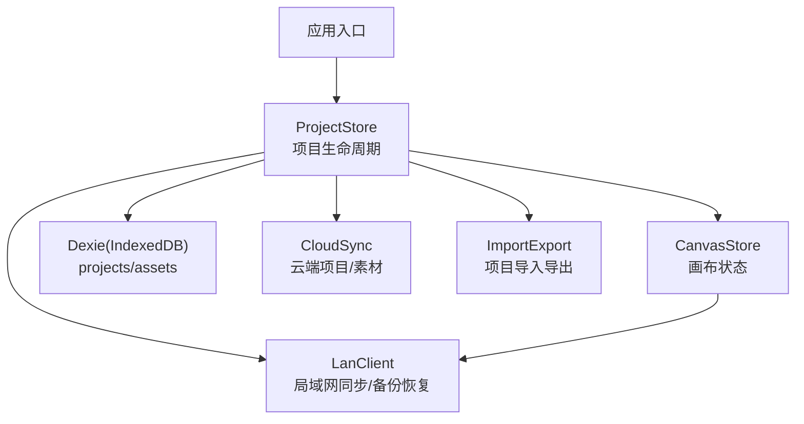
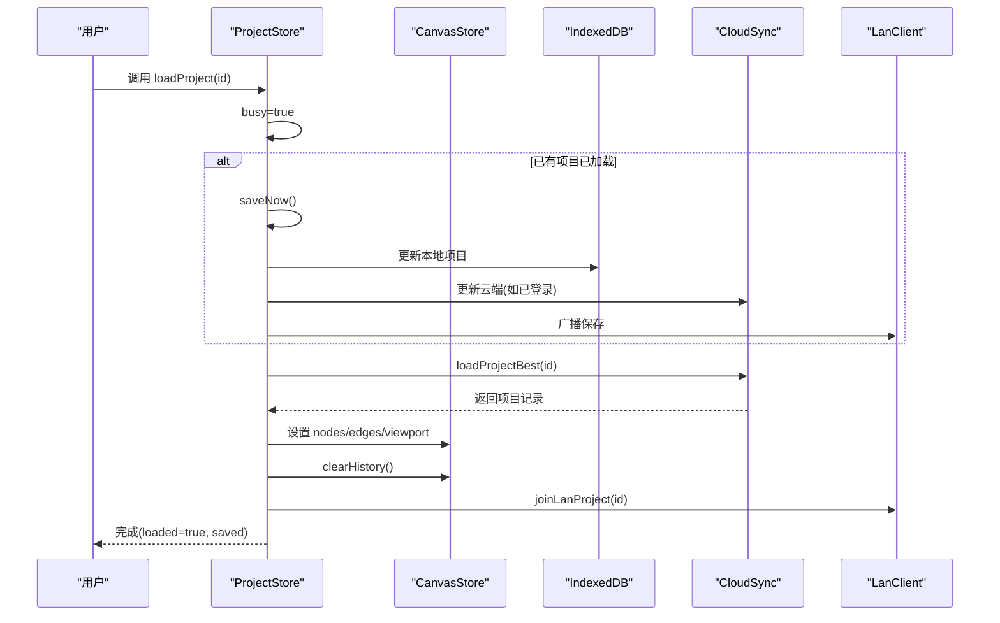
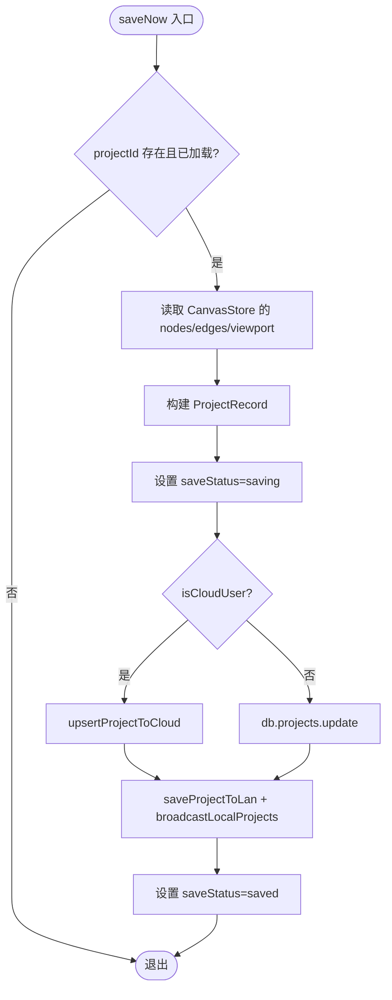
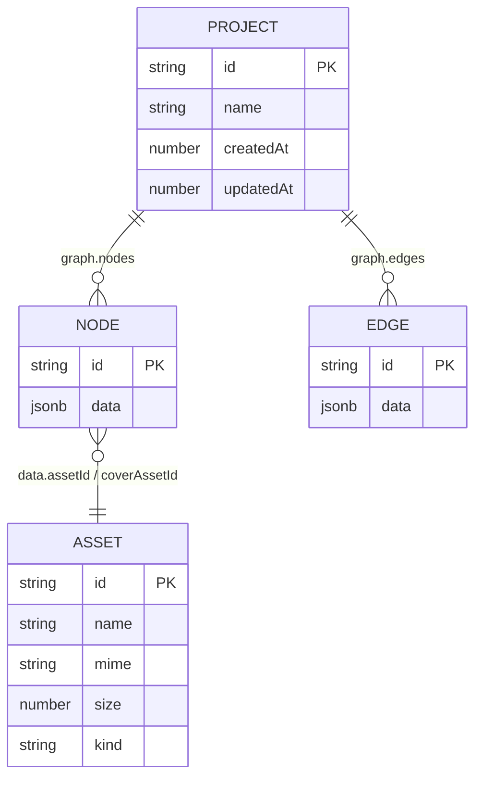
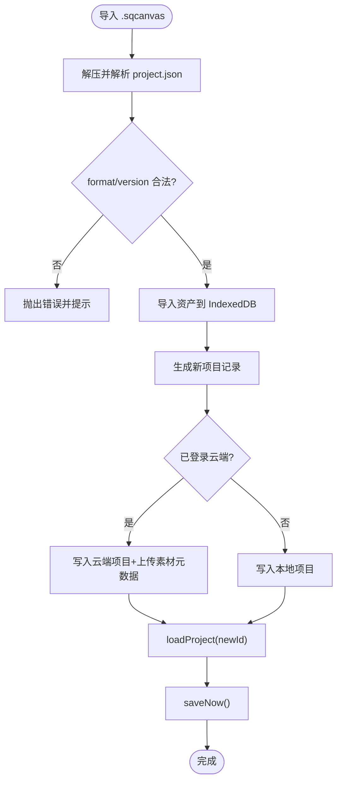
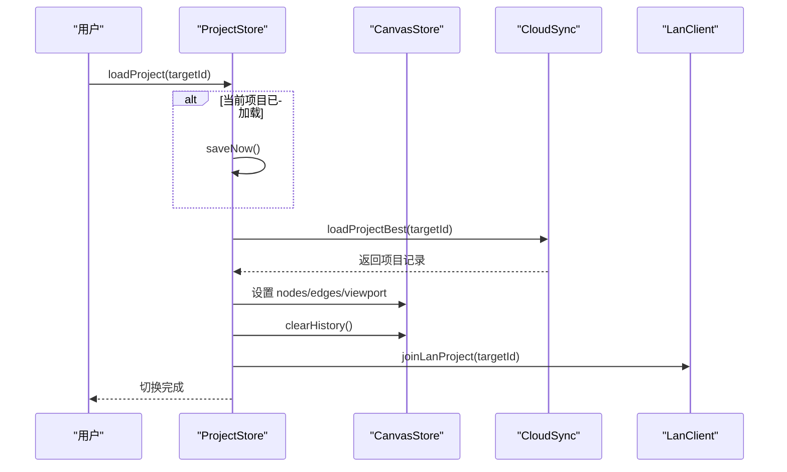
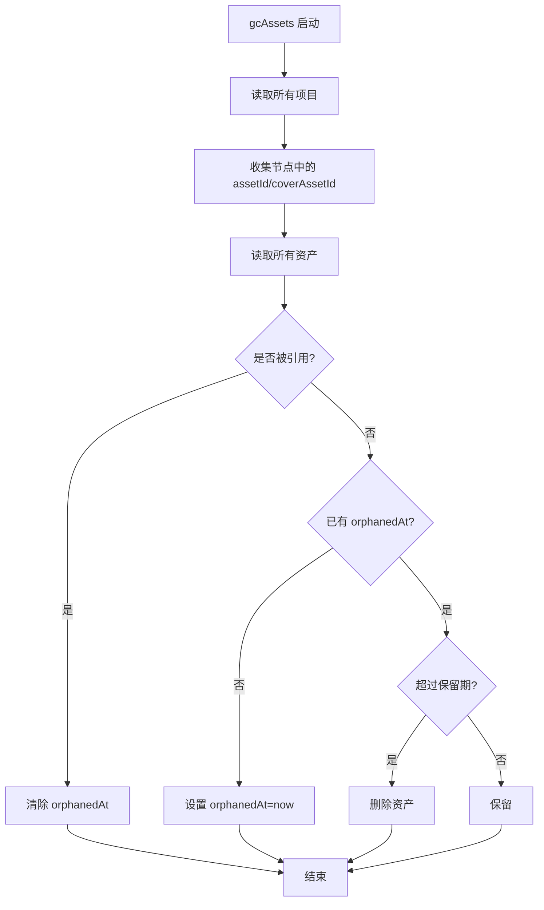
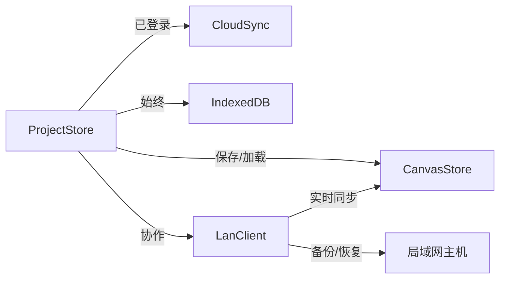
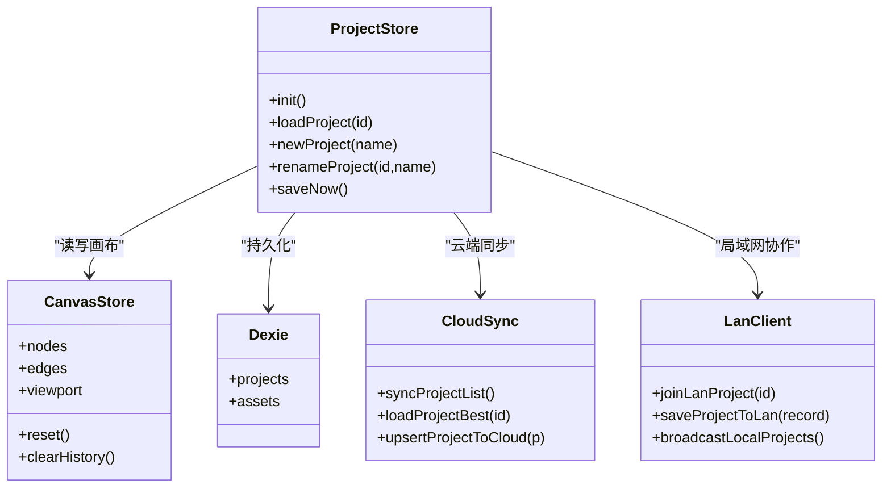

# 项目管理状态 (ProjectStore)

<cite>
**本文引用的文件**
- [projectStore.ts](file://src/store/projectStore.ts)
- [db.ts](file://src/db/db.ts)
- [types.ts](file://src/types.ts)
- [importExport.ts](file://src/io/importExport.ts)
- [canvasStore.ts](file://src/store/canvasStore.ts)
- [cloudSync.ts](file://src/sync/cloudSync.ts)
- [lanClient.ts](file://src/sync/lanClient.ts)
- [authStore.ts](file://src/store/authStore.ts)
- [lanStore.ts](file://src/store/lanStore.ts)
</cite>

## 目录
1. [简介](#简介)
2. [项目结构](#项目结构)
3. [核心组件](#核心组件)
4. [架构总览](#架构总览)
5. [详细组件分析](#详细组件分析)
6. [依赖关系分析](#依赖关系分析)
7. [性能考量](#性能考量)
8. [故障排查指南](#故障排查指南)
9. [结论](#结论)
10. [附录：操作示例与最佳实践](#附录：操作示例与最佳实践)

## 简介
本项目通过 ProjectStore 统一管理项目的生命周期，包括创建、保存、加载、重命名、删除（由协作层触发）等。数据持久化采用 IndexedDB（本地优先），并在已登录云端账号时同步至云端；未登录或局域网模式下仅本地存储。项目间切换会先保存当前项目，再加载目标项目并清理历史栈，确保画布状态一致。版本管理通过导入导出格式的版本号控制兼容性，备份恢复机制在局域网协作中提供临时保留与恢复能力。

## 项目结构
围绕项目管理的关键模块如下：
- 状态与生命周期：ProjectStore（项目状态）、CanvasStore（画布状态）
- 持久化：IndexedDB（Dexie）
- 云端同步：CloudSync（Supabase）
- 局域网协作：LanClient（WebSocket 实时同步、备份恢复）
- 类型定义：Types（节点、边、视图等）
- 导入导出：ImportExport（项目打包/解包）

图表来源
- [projectStore.ts:1-230](file://src/store/projectStore.ts#L1-L230)
- [db.ts:1-69](file://src/db/db.ts#L1-L69)
- [cloudSync.ts:1-165](file://src/sync/cloudSync.ts#L1-L165)
- [lanClient.ts:1-800](file://src/sync/lanClient.ts#L1-L800)
- [importExport.ts:1-203](file://src/io/importExport.ts#L1-L203)

章节来源
- [projectStore.ts:1-230](file://src/store/projectStore.ts#L1-L230)
- [db.ts:1-69](file://src/db/db.ts#L1-L69)

## 核心组件
- ProjectStore：维护当前项目 id、名称、是否已加载、初始化标志、保存状态、忙碌标志；提供 init/load/new/rename/saveNow 等方法；内置自动保存监听。
- CanvasStore：维护 nodes/edges/viewport、撤销/重做历史、视口变化；被 ProjectStore 用于读写画布内容。
- Dexie 数据库：定义 projects 与 assets 表结构，提供增删改查；包含资源垃圾回收逻辑。
- CloudSync：根据登录态选择云端或本地；提供项目列表同步、单项目加载、更新、重命名、删除等。
- LanClient：局域网协作通道，负责项目加入/离开、画布同步、删除广播、备份列表与恢复、断线重连等。
- ImportExport：将项目与引用素材打包为 .sqcanvas 文件，支持导入合并到本地或云端。

章节来源
- [projectStore.ts:1-230](file://src/store/projectStore.ts#L1-L230)
- [canvasStore.ts:1-399](file://src/store/canvasStore.ts#L1-L399)
- [db.ts:1-69](file://src/db/db.ts#L1-L69)
- [cloudSync.ts:1-165](file://src/sync/cloudSync.ts#L1-L165)
- [lanClient.ts:1-800](file://src/sync/lanClient.ts#L1-L800)
- [importExport.ts:1-203](file://src/io/importExport.ts#L1-L203)

## 架构总览
ProjectStore 作为项目状态中枢，协调以下子系统：
- 初始化：拉取项目列表（云端或本地），加载最新项目或重置空画布，安装自动保存。
- 保存：读取当前画布状态，写入 IndexedDB 或云端，同时广播到局域网。
- 加载：先保存当前项目，再加载目标项目到画布，清空历史栈，加入局域网房间。
- 切换：loadProject 前若已有 loaded 项目则先 saveNow，保证不丢失编辑。
- 版本与兼容：导入导出使用固定 format/version，防止高版本项目无法打开。
- 备份恢复：局域网主机定期备份，客户端可请求恢复，服务器校验权限与过期时间后重建项目。

图表来源
- [projectStore.ts:119-147](file://src/store/projectStore.ts#L119-L147)
- [cloudSync.ts:157-165](file://src/sync/cloudSync.ts#L157-L165)
- [lanClient.ts:766-776](file://src/sync/lanClient.ts#L766-L776)

## 详细组件分析

### ProjectStore：项目生命周期管理
- 状态字段
  - projectId：当前项目 id
  - projectName：当前项目名
  - loaded：是否已加载项目
  - initialized：是否已完成初始化
  - saveStatus：保存状态 idle/saving/saved/error
  - busy：是否处于忙碌状态
- 关键方法
  - init：同步项目列表，加载最新项目或重置空画布，安装自动保存
  - loadProject：加载指定项目，先保存当前项目，再切换到目标项目
  - newProject：创建新项目，生成 id 和时间戳，写入本地或云端，加入局域网房间
  - renameProject：更新云端或本地项目名称，必要时广播局域网
  - saveNow：从 CanvasStore 读取画布数据，持久化到本地/云端，并广播局域网
- 自动保存
  - 订阅 CanvasStore 变更，防抖 500ms 后触发 saveNow
  - 仅在 loaded 且非正在保存时执行
- 云端策略
  - isCloudUser 判断是否已登录，决定写本地还是云端
  - 项目列表与加载均走 cloudSync 的“最佳源”逻辑

图表来源
- [projectStore.ts:196-228](file://src/store/projectStore.ts#L196-L228)
- [projectStore.ts:38-41](file://src/store/projectStore.ts#L38-L41)

章节来源
- [projectStore.ts:19-229](file://src/store/projectStore.ts#L19-L229)

### 数据结构设计
- ProjectRecord（持久化模型）
  - id、name、createdAt、updatedAt
  - graph：{ nodes, edges }
  - viewport：画布视口
- SuqNode/SuqEdge（画布元素）
  - Node 扩展 data 字段，支持多种媒体类型与样式
  - Edge 支持样式与播放顺序
- AssetRecord（媒体资源）
  - id、name、mime、size、kind、blob、thumbnail、orphanedAt

图表来源
- [db.ts:5-23](file://src/db/db.ts#L5-L23)
- [types.ts:66-112](file://src/types.ts#L66-L112)

章节来源
- [db.ts:5-23](file://src/db/db.ts#L5-L23)
- [types.ts:1-112](file://src/types.ts#L1-L112)

### 版本管理机制
- 导入导出格式
  - format: 'sqcanvas'
  - version: 当前支持的版本号
  - 导入时校验 format 与 version，拒绝高于当前版本的项目
- 云端/本地一致性
  - 登录后项目列表与加载来自云端；游客/未登录来自本地
  - 导入时根据登录态决定写入本地或云端

图表来源
- [importExport.ts:13-33](file://src/io/importExport.ts#L13-L33)
- [importExport.ts:111-203](file://src/io/importExport.ts#L111-L203)
- [cloudSync.ts:148-165](file://src/sync/cloudSync.ts#L148-L165)

章节来源
- [importExport.ts:13-33](file://src/io/importExport.ts#L13-L33)
- [importExport.ts:111-203](file://src/io/importExport.ts#L111-L203)

### 项目间切换逻辑
- 切换前保存：loadProject 若检测到当前有 loaded 项目，会先 saveNow，避免丢失
- 切换过程：
  - 加载目标项目记录
  - 将 nodes/edges/viewport 注入 CanvasStore
  - 清空历史栈，避免跨项目误用历史
  - 设置项目状态为 loaded/saved
  - 加入局域网房间，开始协作同步
- 自动保存：installAutosave 在 init 时安装，监听画布变更并延迟保存

图表来源
- [projectStore.ts:119-147](file://src/store/projectStore.ts#L119-L147)
- [projectStore.ts:46-67](file://src/store/projectStore.ts#L46-L67)

章节来源
- [projectStore.ts:119-147](file://src/store/projectStore.ts#L119-L147)
- [projectStore.ts:46-67](file://src/store/projectStore.ts#L46-L67)

### 与 IndexedDB 的集成
- 表结构
  - projects：id、updatedAt 索引
  - assets：id、kind、name 索引
- 数据持久化策略
  - 新建项目：新增记录
  - 保存项目：更新记录（含 graph、viewport、updatedAt）
  - 资源回收：gcAssets 扫描所有项目引用的 assetId，标记孤立资源，超过保留期删除
- 备份恢复机制（局域网）
  - 主机侧定时备份项目快照，按时间戳命名
  - 客户端可请求备份列表与恢复，服务器校验权限与过期时间后重建项目
  - 恢复成功后删除备份文件并广播项目列表

图表来源
- [db.ts:46-69](file://src/db/db.ts#L46-L69)
- [server/lan-server.mjs:107-146](file://server/lan-server.mjs#L107-L146)

章节来源
- [db.ts:46-69](file://src/db/db.ts#L46-L69)

### 云端与局域网协同
- 云端
  - 登录状态下，项目列表与加载来自云端；保存时 upsert 到云端
  - 素材元数据与 OSS key 同步，便于多端访问
- 局域网
  - 项目加入/离开房间，实时同步画布与视口
  - 删除通过 sync-del 显式传播，避免并集合并导致的复活问题
  - 备份列表与恢复流程，保障数据安全

图表来源
- [projectStore.ts:196-228](file://src/store/projectStore.ts#L196-L228)
- [cloudSync.ts:148-165](file://src/sync/cloudSync.ts#L148-L165)
- [lanClient.ts:766-800](file://src/sync/lanClient.ts#L766-L800)

章节来源
- [projectStore.ts:196-228](file://src/store/projectStore.ts#L196-L228)
- [cloudSync.ts:148-165](file://src/sync/cloudSync.ts#L148-L165)
- [lanClient.ts:766-800](file://src/sync/lanClient.ts#L766-L800)

## 依赖关系分析
- ProjectStore 依赖
  - CanvasStore：读写画布数据
  - Dexie：本地持久化
  - CloudSync：云端同步
  - LanClient：局域网协作
  - AuthStore：判断登录态
- 耦合与内聚
  - ProjectStore 聚焦项目生命周期，职责单一
  - 通过 cloudSync/lanClient 抽象外部存储与协作，降低耦合
- 潜在循环依赖
  - 无直接循环；通过函数调用与事件订阅解耦

图表来源
- [projectStore.ts:1-230](file://src/store/projectStore.ts#L1-L230)
- [canvasStore.ts:1-399](file://src/store/canvasStore.ts#L1-L399)
- [db.ts:1-69](file://src/db/db.ts#L1-L69)
- [cloudSync.ts:1-165](file://src/sync/cloudSync.ts#L1-L165)
- [lanClient.ts:1-800](file://src/sync/lanClient.ts#L1-L800)

章节来源
- [projectStore.ts:1-230](file://src/store/projectStore.ts#L1-L230)
- [canvasStore.ts:1-399](file://src/store/canvasStore.ts#L1-L399)
- [db.ts:1-69](file://src/db/db.ts#L1-L69)
- [cloudSync.ts:1-165](file://src/sync/cloudSync.ts#L1-L165)
- [lanClient.ts:1-800](file://src/sync/lanClient.ts#L1-L800)

## 性能考量
- 自动保存防抖：500ms 延迟，避免频繁写入
- 历史栈限制：最多保留一定数量的历史条目，减少内存占用
- 局域网同步节流：画布同步与视口广播使用定时器合并，降低网络压力
- 资源回收：gcAssets 定期清理孤立资源，释放存储空间
- 大文件传输：局域网分片传输，支持断点续传与 HTTP Range 流式拉取（视频）

[本节为通用指导，不直接分析具体文件]

## 故障排查指南
- 打开项目失败
  - 检查 loadProjectBest 返回值是否为 null
  - 查看 toast 提示与控制台错误
- 自动保存失败
  - 检查 saveNow 捕获的错误与 saveStatus 是否为 error
  - 确认 IndexedDB 可用性与权限
- 云端同步失败
  - 检查 isCloudAuthed 与 supabase 连接
  - 查看云端接口返回的错误信息
- 局域网协作异常
  - 检查 lanClient 连接状态与重连逻辑
  - 确认项目房间加入成功与消息收发正常

章节来源
- [projectStore.ts:119-147](file://src/store/projectStore.ts#L119-L147)
- [projectStore.ts:196-228](file://src/store/projectStore.ts#L196-L228)
- [cloudSync.ts:148-165](file://src/sync/cloudSync.ts#L148-L165)
- [lanClient.ts:254-362](file://src/sync/lanClient.ts#L254-L362)

## 结论
ProjectStore 以项目为中心，整合了本地持久化、云端同步与局域网协作，提供了完整的项目生命周期管理能力。通过自动保存、版本兼容、备份恢复等机制，确保了数据的安全性与可用性。在实际使用中，建议遵循“先保存再切换”的原则，充分利用自动保存与导入导出功能，保障项目数据的完整性。

[本节为总结性内容，不直接分析具体文件]

## 附录：操作示例与最佳实践
- 创建项目
  - 调用 newProject(name)，自动生成 id 与时间戳，写入本地或云端，加入局域网房间
  - 参考路径：[projectStore.ts:149-182](file://src/store/projectStore.ts#L149-L182)
- 编辑与保存
  - 编辑过程中无需手动保存，自动保存会在 500ms 后触发
  - 如需立即保存，调用 saveNow()
  - 参考路径：[projectStore.ts:46-67](file://src/store/projectStore.ts#L46-L67), [projectStore.ts:196-228](file://src/store/projectStore.ts#L196-L228)
- 加载项目
  - 调用 loadProject(id)，先保存当前项目，再加载目标项目
  - 参考路径：[projectStore.ts:119-147](file://src/store/projectStore.ts#L119-L147)
- 重命名项目
  - 调用 renameProject(id, name)，更新云端或本地名称
  - 参考路径：[projectStore.ts:184-194](file://src/store/projectStore.ts#L184-L194)
- 导入导出
  - 导出：exportCurrentProject() 生成 .sqcanvas 文件
  - 导入：importProjectFile(file) 解析并合并资产，创建新项目
  - 参考路径：[importExport.ts:96-203](file://src/io/importExport.ts#L96-L203)
- 备份恢复（局域网）
  - 请求备份列表与恢复，服务器校验权限与过期时间后重建项目
  - 参考路径：[lanClient.ts:494-526](file://src/sync/lanClient.ts#L494-L526), [server/lan-server.mjs:763-824](file://server/lan-server.mjs#L763-L824)

章节来源
- [projectStore.ts:119-194](file://src/store/projectStore.ts#L119-L194)
- [importExport.ts:96-203](file://src/io/importExport.ts#L96-L203)
- [lanClient.ts:494-526](file://src/sync/lanClient.ts#L494-L526)
- [server/lan-server.mjs:763-824](file://server/lan-server.mjs#L763-L824)