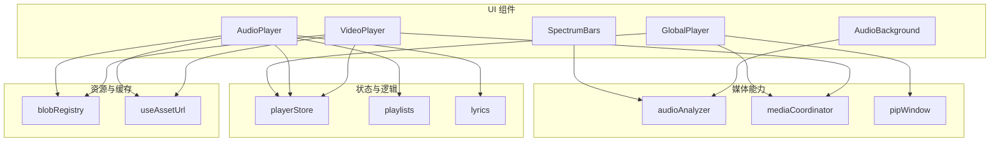
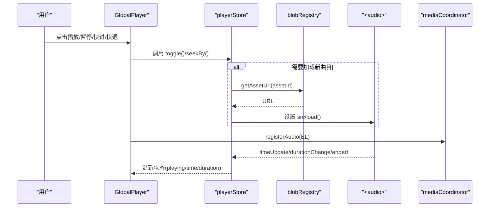
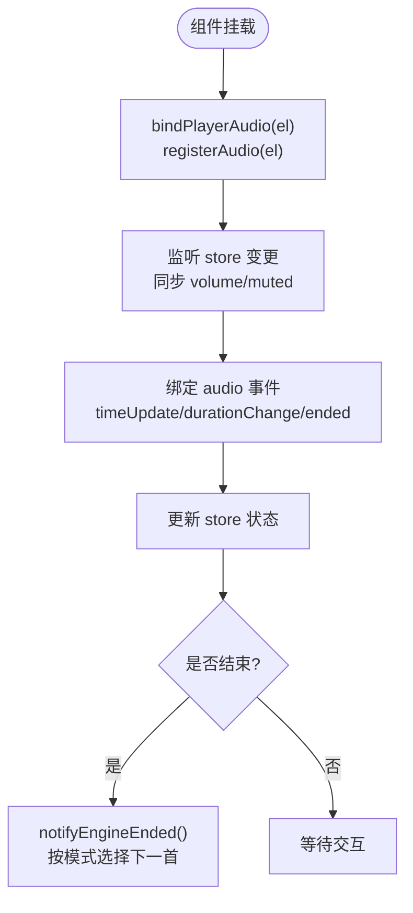
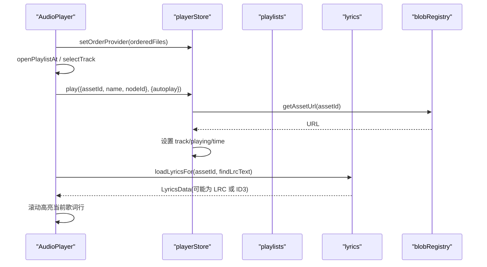
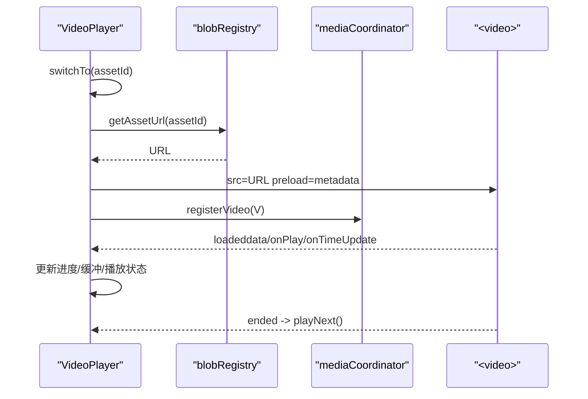
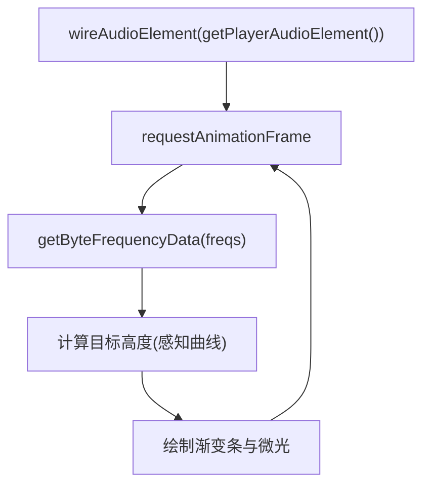
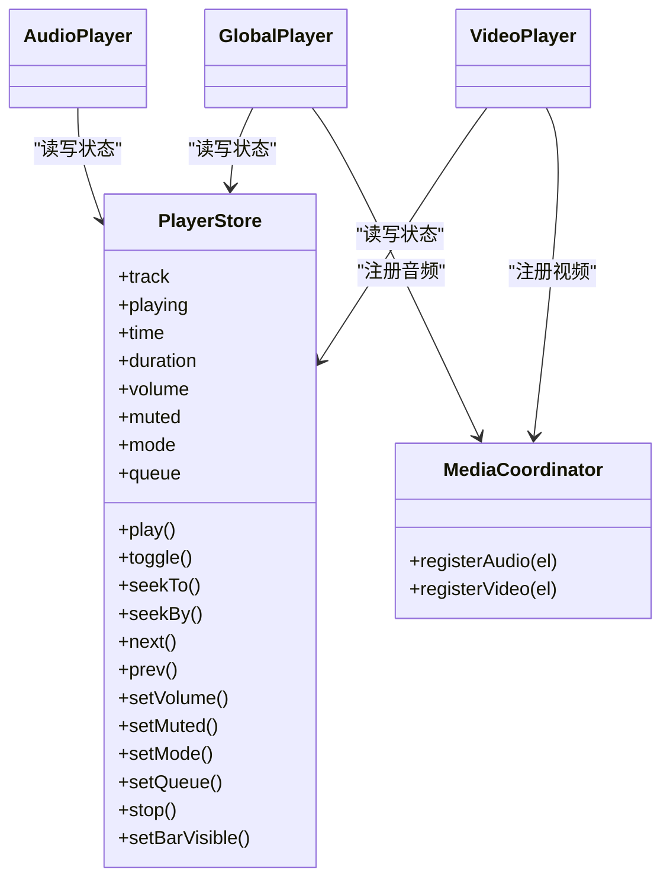
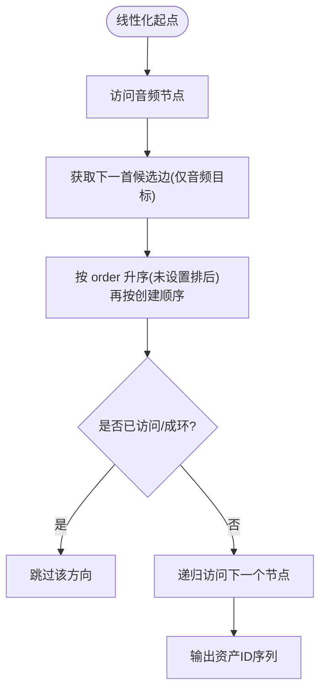
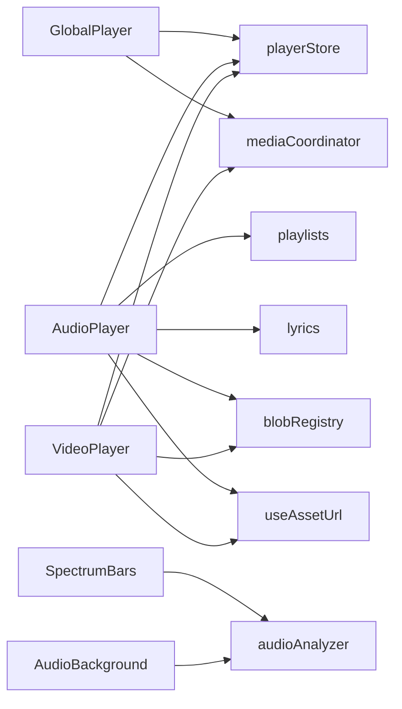

# 媒体播放器

<cite>
**本文引用的文件**
- [GlobalPlayer.tsx](file://src/components/GlobalPlayer.tsx)
- [AudioPlayer.tsx](file://src/components/AudioPlayer.tsx)
- [VideoPlayer.tsx](file://src/components/VideoPlayer.tsx)
- [SpectrumBars.tsx](file://src/components/SpectrumBars.tsx)
- [audioAnalyzer.ts](file://src/media/audioAnalyzer.ts)
- [mediaCoordinator.ts](file://src/media/mediaCoordinator.ts)
- [playerStore.ts](file://src/store/playerStore.ts)
- [playlists.ts](file://src/media/playlists.ts)
- [lyrics.ts](file://src/media/lyrics.ts)
- [blobRegistry.ts](file://src/media/blobRegistry.ts)
- [pipWindow.ts](file://src/media/pipWindow.ts)
- [AudioBackground.tsx](file://src/components/AudioBackground.tsx)
- [useAssetUrl.ts](file://src/media/useAssetUrl.ts)
</cite>

## 目录
1. [简介](#简介)
2. [项目结构](#项目结构)
3. [核心组件](#核心组件)
4. [架构总览](#架构总览)
5. [详细组件分析](#详细组件分析)
6. [依赖关系分析](#依赖关系分析)
7. [性能考量](#性能考量)
8. [故障排查指南](#故障排查指南)
9. [结论](#结论)
10. [附录：自定义与扩展](#附录自定义与扩展)

## 简介
本仓库实现了一套完整的媒体播放体系，包含全局音频悬浮控制、沉浸式音频播放器（含频谱可视化、歌词显示、播放列表）、视频播放器（全屏、画中画、倍速、进度拖拽）以及统一的媒体协调器。系统通过单一音频元素作为“唯一播放引擎”，配合状态管理、歌单解析、资源加载与缓存机制，提供稳定且可扩展的媒体体验。

## 项目结构
媒体相关代码主要分布在以下模块：
- 组件层：GlobalPlayer、AudioPlayer、VideoPlayer、SpectrumBars、AudioBackground
- 媒体能力：audioAnalyzer（Web Audio 分析器）、mediaCoordinator（互斥播放）、pipWindow（桌面级小窗）
- 数据与状态：playerStore（播放状态与引擎）、playlists（画布图结构派生歌单）、lyrics（LRC/ID3 歌词解析）
- 资源与缓存：blobRegistry（URL/缩略图缓存与生成）、useAssetUrl（资源 URL 获取 Hook）

图表来源
- [GlobalPlayer.tsx:1-234](file://src/components/GlobalPlayer.tsx#L1-L234)
- [AudioPlayer.tsx:1-800](file://src/components/AudioPlayer.tsx#L1-L800)
- [VideoPlayer.tsx:1-800](file://src/components/VideoPlayer.tsx#L1-L800)
- [SpectrumBars.tsx:1-120](file://src/components/SpectrumBars.tsx#L1-L120)
- [audioAnalyzer.ts:1-59](file://src/media/audioAnalyzer.ts#L1-L59)
- [mediaCoordinator.ts:1-25](file://src/media/mediaCoordinator.ts#L1-L25)
- [playerStore.ts:1-298](file://src/store/playerStore.ts#L1-L298)
- [playlists.ts:1-179](file://src/media/playlists.ts#L1-L179)
- [lyrics.ts:1-206](file://src/media/lyrics.ts#L1-L206)
- [blobRegistry.ts:1-389](file://src/media/blobRegistry.ts#L1-L389)
- [pipWindow.ts:1-134](file://src/media/pipWindow.ts#L1-L134)
- [AudioBackground.tsx:1-140](file://src/components/AudioBackground.tsx#L1-L140)
- [useAssetUrl.ts:1-157](file://src/media/useAssetUrl.ts#L1-L157)

章节来源
- [GlobalPlayer.tsx:1-234](file://src/components/GlobalPlayer.tsx#L1-L234)
- [AudioPlayer.tsx:1-800](file://src/components/AudioPlayer.tsx#L1-L800)
- [VideoPlayer.tsx:1-800](file://src/components/VideoPlayer.tsx#L1-L800)
- [SpectrumBars.tsx:1-120](file://src/components/SpectrumBars.tsx#L1-L120)
- [audioAnalyzer.ts:1-59](file://src/media/audioAnalyzer.ts#L1-L59)
- [mediaCoordinator.ts:1-25](file://src/media/mediaCoordinator.ts#L1-L25)
- [playerStore.ts:1-298](file://src/store/playerStore.ts#L1-L298)
- [playlists.ts:1-179](file://src/media/playlists.ts#L1-L179)
- [lyrics.ts:1-206](file://src/media/lyrics.ts#L1-L206)
- [blobRegistry.ts:1-389](file://src/media/blobRegistry.ts#L1-L389)
- [pipWindow.ts:1-134](file://src/media/pipWindow.ts#L1-L134)
- [AudioBackground.tsx:1-140](file://src/components/AudioBackground.tsx#L1-L140)
- [useAssetUrl.ts:1-157](file://src/media/useAssetUrl.ts#L1-L157)

## 核心组件
- 全局播放器 GlobalPlayer：挂载唯一的 <audio> 元素，提供悬浮迷你控制栏（播放/暂停、快退/快进、时间显示、最小化到桌面级小窗），并同步音量、静音、进度等状态。
- 音频播放器 AudioPlayer：沉浸式界面，支持频谱条、歌词显示（LRC/ID3）、专辑背景轮换、播放模式（顺序/循环/随机/单曲/流式）、队列与搜索、键盘快捷键。
- 视频播放器 VideoPlayer：全屏切换、画中画、倍速、进度拖拽、缓冲指示、音量控制、上一集/下一集、右侧列表、主题切换。
- 频谱条 SpectrumBars：基于 Web Audio AnalyserNode 的频率可视化，颜色随封面主色变化，具备基线保持与微光效果。
- 媒体协调器 mediaCoordinator：保证同一时刻仅一个音频或一个视频在播放，避免冲突。
- 播放状态 playerStore：集中管理 track、playing、time、duration、volume、muted、mode、queue 等，并提供 play/toggle/seek/next/prev 等方法。
- 歌单 playlists：从画布节点与连线解析出歌单顺序，支持分叉排序、环检测、去重。
- 歌词 lyrics：解析 LRC 与 ID3（SYLT/USLT），支持 offset 与本地缓存。
- 资源 blobRegistry：URL/缩略图缓存、局域网/云端拉取、视频抓帧生成封面、并发控制与降级策略。
- 桌面级小窗 pipWindow：利用 Document Picture-in-Picture API 创建独立小窗，实时同步播放状态与控制。

章节来源
- [GlobalPlayer.tsx:1-234](file://src/components/GlobalPlayer.tsx#L1-L234)
- [AudioPlayer.tsx:1-800](file://src/components/AudioPlayer.tsx#L1-L800)
- [VideoPlayer.tsx:1-800](file://src/components/VideoPlayer.tsx#L1-L800)
- [SpectrumBars.tsx:1-120](file://src/components/SpectrumBars.tsx#L1-L120)
- [mediaCoordinator.ts:1-25](file://src/media/mediaCoordinator.ts#L1-L25)
- [playerStore.ts:1-298](file://src/store/playerStore.ts#L1-L298)
- [playlists.ts:1-179](file://src/media/playlists.ts#L1-L179)
- [lyrics.ts:1-206](file://src/media/lyrics.ts#L1-L206)
- [blobRegistry.ts:1-389](file://src/media/blobRegistry.ts#L1-L389)
- [pipWindow.ts:1-134](file://src/media/pipWindow.ts#L1-L134)

## 架构总览
系统采用“单一音频引擎 + 多视图控制器”的模式：
- GlobalPlayer 持有唯一 <audio> 元素，并通过 playerStore 暴露统一状态；其他 UI（悬浮窗、沉浸式播放器）只读状态并触发操作。
- 媒体互斥由 mediaCoordinator 保障，避免多个媒体同时播放。
- 歌单顺序由 playlists 根据画布图结构解析，确保“流式播放”与“自动切歌”一致。
- 资源加载由 blobRegistry 统一管理，优先本地 IndexedDB，其次局域网 HTTP 流式地址，最后云端下载；缩略图批量抓取并缓存。
- 歌词解析由 lyrics 处理 LRC/ID3，支持 offset 与本地缓存。
- 可视化由 audioAnalyzer 提供频率/波形数据，供 SpectrumBars 与背景渲染使用。

图表来源
- [GlobalPlayer.tsx:86-179](file://src/components/GlobalPlayer.tsx#L86-L179)
- [playerStore.ts:174-209](file://src/store/playerStore.ts#L174-L209)
- [blobRegistry.ts:84-105](file://src/media/blobRegistry.ts#L84-L105)
- [mediaCoordinator.ts:7-24](file://src/media/mediaCoordinator.ts#L7-L24)

章节来源
- [GlobalPlayer.tsx:86-179](file://src/components/GlobalPlayer.tsx#L86-L179)
- [playerStore.ts:174-209](file://src/store/playerStore.ts#L174-L209)
- [blobRegistry.ts:84-105](file://src/media/blobRegistry.ts#L84-L105)
- [mediaCoordinator.ts:7-24](file://src/media/mediaCoordinator.ts#L7-L24)

## 详细组件分析

### 全局播放器 GlobalPlayer
- 功能要点
  - 挂载唯一 <audio> 元素，绑定事件（play/pause/timeUpdate/loadedMetadata/durationChange/ended）。
  - 悬浮控制栏可拖动、展开/收起、快退/快进、最小化到桌面级小窗（PiP）。
  - 与 playerStore 双向同步：音量、静音、进度、播放状态。
  - 通过 mediaCoordinator 注册音频元素，参与互斥播放。
  - 暴露 __pipCtrl 给 PiP 窗口进行远程控制。
- 关键流程
  - 初始化时 bindPlayerAudio(el) 并将 el 注入 store；监听 store 变化同步 el.volume/muted。
  - onEnded 调用 notifyEngineEnded() 触发自动续播逻辑。
  - 打开 PiP 时关闭悬浮栏，并在 PiP 中定时同步状态。

图表来源
- [GlobalPlayer.tsx:86-179](file://src/components/GlobalPlayer.tsx#L86-L179)
- [playerStore.ts:132-161](file://src/store/playerStore.ts#L132-L161)

章节来源
- [GlobalPlayer.tsx:1-234](file://src/components/GlobalPlayer.tsx#L1-L234)
- [playerStore.ts:132-161](file://src/store/playerStore.ts#L132-L161)

### 音频播放器 AudioPlayer
- 功能要点
  - 沉浸式界面：封面背景、频谱条、歌词显示、专辑图轮换、播放模式切换、队列管理、搜索与排序。
  - 歌词来源：优先查找与当前 MP3 连线的 .lrc 文本节点，否则读取内嵌 ID3 歌词；支持 offset 调整与本地缓存。
  - 播放模式：顺序、列表循环、单曲循环、随机、流式（沿画布连线 DFS 先序）。
  - 键盘快捷键：空格播放/暂停、方向键快退/快进、上下音量、L 喜欢。
- 关键流程
  - 打开时 setOrderProvider 提供歌曲列表顺序；initialFlow 决定初始模式。
  - 歌词加载：loadLyricsFor 异步获取 LRC/ID3，结果缓存并按当前时间高亮行。
  - 专辑图收集：扫描与当前 MP3 关联的图片节点，批量获取缩略图并每 5 秒轮换。
  - 流式顺序：buildFlowOrder 基于 linearizeFrom 计算连线顺序。

图表来源
- [AudioPlayer.tsx:241-271](file://src/components/AudioPlayer.tsx#L241-L271)
- [AudioPlayer.tsx:461-515](file://src/components/AudioPlayer.tsx#L461-L515)
- [playerStore.ts:174-209](file://src/store/playerStore.ts#L174-L209)
- [blobRegistry.ts:84-105](file://src/media/blobRegistry.ts#L84-L105)
- [lyrics.ts:181-205](file://src/media/lyrics.ts#L181-L205)

章节来源
- [AudioPlayer.tsx:1-800](file://src/components/AudioPlayer.tsx#L1-L800)
- [playlists.ts:71-112](file://src/media/playlists.ts#L71-L112)
- [lyrics.ts:16-46](file://src/media/lyrics.ts#L16-L46)
- [lyrics.ts:129-167](file://src/media/lyrics.ts#L129-L167)
- [lyrics.ts:181-205](file://src/media/lyrics.ts#L181-L205)

### 视频播放器 VideoPlayer
- 功能要点
  - 全屏切换、画中画、倍速、进度拖拽、缓冲指示、音量控制、上一集/下一集、右侧列表、主题切换。
  - 批量预加载缩略图与时长探测（仅元数据），提升列表体验。
  - 注册到 mediaCoordinator，与其他视频互斥播放。
  - 全屏时控制栏自动隐藏，鼠标移动显示。
- 关键流程
  - 切换视频时重置状态并自动播放；onEnded 自动下一集。
  - 进度条支持指针拖拽，实时更新 dragTime 并在释放时 seekTo。
  - 全屏/PiP 状态通过事件监听同步 UI。

图表来源
- [VideoPlayer.tsx:196-250](file://src/components/VideoPlayer.tsx#L196-L250)
- [VideoPlayer.tsx:321-340](file://src/components/VideoPlayer.tsx#L321-L340)
- [blobRegistry.ts:84-105](file://src/media/blobRegistry.ts#L84-L105)
- [mediaCoordinator.ts:7-24](file://src/media/mediaCoordinator.ts#L7-L24)

章节来源
- [VideoPlayer.tsx:1-800](file://src/components/VideoPlayer.tsx#L1-L800)

### 频谱条 SpectrumBars
- 功能要点
  - 使用 Web Audio AnalyserNode 获取频率数据，绘制 44 根圆头条，颜色随封面主色变化。
  - 感知曲线增强中小频段可见度；上升快回落慢，静音/暂停保留低矮基线。
  - 通过 wireAudioElement 将当前音频源接入分析器，WeakSet 保证每个元素只接一次。
- 关键流程
  - 初始化时获取 AnalyserNode，resize 监听容器尺寸变化。
  - requestAnimationFrame 循环读取频率数据并绘制渐变条与微光。

图表来源
- [SpectrumBars.tsx:28-112](file://src/components/SpectrumBars.tsx#L28-L112)
- [audioAnalyzer.ts:26-47](file://src/media/audioAnalyzer.ts#L26-L47)

章节来源
- [SpectrumBars.tsx:1-120](file://src/components/SpectrumBars.tsx#L1-L120)
- [audioAnalyzer.ts:1-59](file://src/media/audioAnalyzer.ts#L1-L59)

### 媒体协调器与状态同步
- 媒体互斥：mediaCoordinator 维护音频/视频元素集合，任一元素触发 play 时暂停同类型其他元素。
- 状态同步：playerStore 集中管理播放状态，GlobalPlayer 与 AudioPlayer/VideoPlayer 通过 store 方法驱动引擎。
- 自动续播：onEnded 触发 handleEnded，按模式选择下一首（顺序/循环/随机/单曲/流式）。

图表来源
- [playerStore.ts:25-50](file://src/store/playerStore.ts#L25-L50)
- [mediaCoordinator.ts:1-25](file://src/media/mediaCoordinator.ts#L1-L25)
- [GlobalPlayer.tsx:86-179](file://src/components/GlobalPlayer.tsx#L86-L179)
- [VideoPlayer.tsx:321-340](file://src/components/VideoPlayer.tsx#L321-L340)

章节来源
- [playerStore.ts:132-161](file://src/store/playerStore.ts#L132-L161)
- [mediaCoordinator.ts:1-25](file://src/media/mediaCoordinator.ts#L1-L25)

### 歌单与流式播放
- 规则：命名文本节点指向音频节点作为歌单首节点；沿“音频→音频”边做 DFS 先序遍历；分叉处按边 order 升序，未设置 order 的排在后面；环/重复节点只遍历一次；同一 assetId 只保留第一次出现。
- 应用：AudioPlayer 的“流式播放”与“自动切歌”均消费 playlists 的输出，保证一致性。

图表来源
- [playlists.ts:56-112](file://src/media/playlists.ts#L56-L112)

章节来源
- [playlists.ts:1-179](file://src/media/playlists.ts#L1-L179)

### 歌词显示与缓存
- 来源优先级：先查找与当前 MP3 连线的 .lrc 文本节点，否则读取内嵌 ID3（SYLT/USLT）。
- 特性：支持 offset 调整、本地缓存、按当前时间高亮行、倒影与正像对齐。
- 存储：offset 与“喜欢”状态持久化至 localStorage。

章节来源
- [lyrics.ts:16-46](file://src/media/lyrics.ts#L16-L46)
- [lyrics.ts:129-167](file://src/media/lyrics.ts#L129-L167)
- [lyrics.ts:181-205](file://src/media/lyrics.ts#L181-L205)
- [AudioPlayer.tsx:461-515](file://src/components/AudioPlayer.tsx#L461-L515)

### 媒体文件加载策略与缓存机制
- 资源 URL：优先本地 IndexedDB Blob，其次局域网 HTTP 流式地址（支持 Range 边下边播），最后云端下载；URL 缓存避免重复创建。
- 缩略图：批量抓取视频封面，限制并发（最多 2 个），黑帧检测与重试，失败时一次性拉取全量素材兜底；缩略图缓存并推送至服务器。
- 资源 Hook：useAssetUrl/useThumbnailUrl 提供重试与轮询机制，适配局域网传输延迟。

章节来源
- [blobRegistry.ts:84-126](file://src/media/blobRegistry.ts#L84-L126)
- [blobRegistry.ts:128-268](file://src/media/blobRegistry.ts#L128-L268)
- [blobRegistry.ts:310-379](file://src/media/blobRegistry.ts#L310-L379)
- [useAssetUrl.ts:10-44](file://src/media/useAssetUrl.ts#L10-L44)
- [useAssetUrl.ts:52-99](file://src/media/useAssetUrl.ts#L52-L99)

### 桌面级小窗（PiP）
- 能力：利用 Document Picture-in-Picture API 创建独立小窗，展示播放控制与进度条。
- 同步：主页面暴露 __pipCtrl，小窗通过定时器读取状态并更新 UI。
- 兼容性：isPipSupported 检测，不支持时静默降级。

章节来源
- [pipWindow.ts:1-134](file://src/media/pipWindow.ts#L1-L134)
- [GlobalPlayer.tsx:106-123](file://src/components/GlobalPlayer.tsx#L106-L123)

## 依赖关系分析
- 组件耦合
  - GlobalPlayer 与 playerStore 强耦合（唯一音频引擎），与 mediaCoordinator 弱耦合（互斥播放）。
  - AudioPlayer 依赖 playlists、lyrics、blobRegistry、useAssetUrl，形成“内容+体验”组合。
  - VideoPlayer 依赖 blobRegistry、useAssetUrl、mediaCoordinator，侧重“播放控制”。
- 外部依赖
  - Web Audio API（AnalyserNode、AudioContext）用于频谱可视化。
  - HTMLMediaElement（<audio>/<video>）提供原生播放能力。
  - Document Picture-in-Picture API 用于桌面级小窗。
  - IndexedDB（db.assets）用于本地资源与缩略图缓存。
  - 局域网/云端服务（OSS/LAN）用于资源拉取与缩略图同步。

图表来源
- [GlobalPlayer.tsx:1-234](file://src/components/GlobalPlayer.tsx#L1-L234)
- [AudioPlayer.tsx:1-800](file://src/components/AudioPlayer.tsx#L1-L800)
- [VideoPlayer.tsx:1-800](file://src/components/VideoPlayer.tsx#L1-L800)
- [SpectrumBars.tsx:1-120](file://src/components/SpectrumBars.tsx#L1-L120)
- [audioAnalyzer.ts:1-59](file://src/media/audioAnalyzer.ts#L1-L59)
- [mediaCoordinator.ts:1-25](file://src/media/mediaCoordinator.ts#L1-L25)
- [playerStore.ts:1-298](file://src/store/playerStore.ts#L1-L298)
- [playlists.ts:1-179](file://src/media/playlists.ts#L1-L179)
- [lyrics.ts:1-206](file://src/media/lyrics.ts#L1-L206)
- [blobRegistry.ts:1-389](file://src/media/blobRegistry.ts#L1-L389)
- [useAssetUrl.ts:1-157](file://src/media/useAssetUrl.ts#L1-L157)

章节来源
- [GlobalPlayer.tsx:1-234](file://src/components/GlobalPlayer.tsx#L1-L234)
- [AudioPlayer.tsx:1-800](file://src/components/AudioPlayer.tsx#L1-L800)
- [VideoPlayer.tsx:1-800](file://src/components/VideoPlayer.tsx#L1-L800)
- [SpectrumBars.tsx:1-120](file://src/components/SpectrumBars.tsx#L1-L120)
- [audioAnalyzer.ts:1-59](file://src/media/audioAnalyzer.ts#L1-L59)
- [mediaCoordinator.ts:1-25](file://src/media/mediaCoordinator.ts#L1-L25)
- [playerStore.ts:1-298](file://src/store/playerStore.ts#L1-L298)
- [playlists.ts:1-179](file://src/media/playlists.ts#L1-L179)
- [lyrics.ts:1-206](file://src/media/lyrics.ts#L1-L206)
- [blobRegistry.ts:1-389](file://src/media/blobRegistry.ts#L1-L389)
- [useAssetUrl.ts:1-157](file://src/media/useAssetUrl.ts#L1-L157)

## 性能考量
- 单一音频引擎：减少资源竞争与状态分散，便于统一管理与优化。
- 资源加载优化
  - URL/缩略图缓存避免重复请求与对象 URL 泄漏。
  - 视频缩略图抓取限制并发，防止连接池阻塞。
  - 局域网流式地址直接播放，避免整份下载到本地造成内存压力。
- 可视化性能
  - 频谱条使用 requestAnimationFrame 与 ResizeObserver，按需重绘。
  - 背景封面切换使用交叉淡入，静态时零开销。
- 状态同步
  - playerStore 集中管理，避免多处状态不一致导致的重复渲染。
  - 歌词与专辑图按当前曲目懒加载，减少无关计算。

[本节提供通用指导，不直接分析具体文件]

## 故障排查指南
- 无法播放
  - 检查浏览器是否支持所需 API（如 PiP、Web Audio）。
  - 确认资源是否存在于本地/局域网/云端，查看 blobRegistry 的日志提示。
- 频谱无响应
  - 确认已调用 wireAudioElement 并成功创建 AnalyserNode。
  - 检查音频元素是否正确注册到 mediaCoordinator。
- 歌词不同步
  - 检查 LRC/ID3 是否有效，offset 是否正确。
  - 确认当前时间计算包含 offset，且歌词行按时间排序。
- 缩略图缺失
  - 检查视频是否支持跨源抓帧（crossOrigin 设置）。
  - 查看并发限制与重试逻辑，必要时强制拉取全量素材兜底。

章节来源
- [blobRegistry.ts:128-268](file://src/media/blobRegistry.ts#L128-L268)
- [blobRegistry.ts:310-379](file://src/media/blobRegistry.ts#L310-L379)
- [audioAnalyzer.ts:26-47](file://src/media/audioAnalyzer.ts#L26-L47)
- [lyrics.ts:16-46](file://src/media/lyrics.ts#L16-L46)
- [lyrics.ts:129-167](file://src/media/lyrics.ts#L129-L167)

## 结论
本媒体播放器体系以“单一音频引擎 + 多视图控制器”为核心，结合歌单解析、歌词显示、频谱可视化、资源缓存与互斥播放，提供了完整且可扩展的媒体体验。通过清晰的职责划分与模块化设计，开发者可轻松定制 UI、扩展功能或集成新的媒体源。

[本节总结性内容，不直接分析具体文件]

## 附录：自定义与扩展
- 自定义配置
  - 播放模式：可在 AudioPlayer 中切换 sequential/loop/single/random/flow，或通过 playerStore.setMode 动态设置。
  - 歌词偏移：通过 AudioPlayer 的 lyricOffset 调整，持久化至 localStorage。
  - 频谱样式：修改 SpectrumBars 的 BAR_COUNT、颜色渐变与微光强度。
- 扩展开发
  - 新增媒体源：在 blobRegistry 中扩展 getAssetUrl/getAssetBlob 逻辑，支持新协议或存储后端。
  - 新增可视化：基于 audioAnalyzer 的 AnalyserNode 添加波形/频谱图，复用 SpectrumBars 的渲染模式。
  - 新增控制项：在 GlobalPlayer/AudioPlayer/VideoPlayer 中添加按钮与快捷键，调用 playerStore 方法驱动引擎。
  - 歌单规则：在 playlists 中调整线性化算法，支持更多图结构语义（如条件跳转、权重排序）。

[本节提供通用指导，不直接分析具体文件]