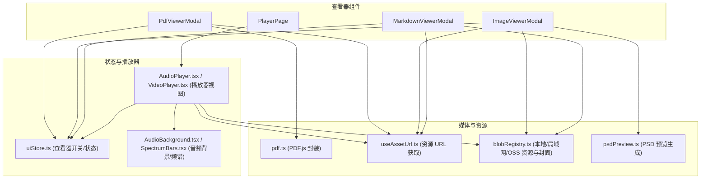
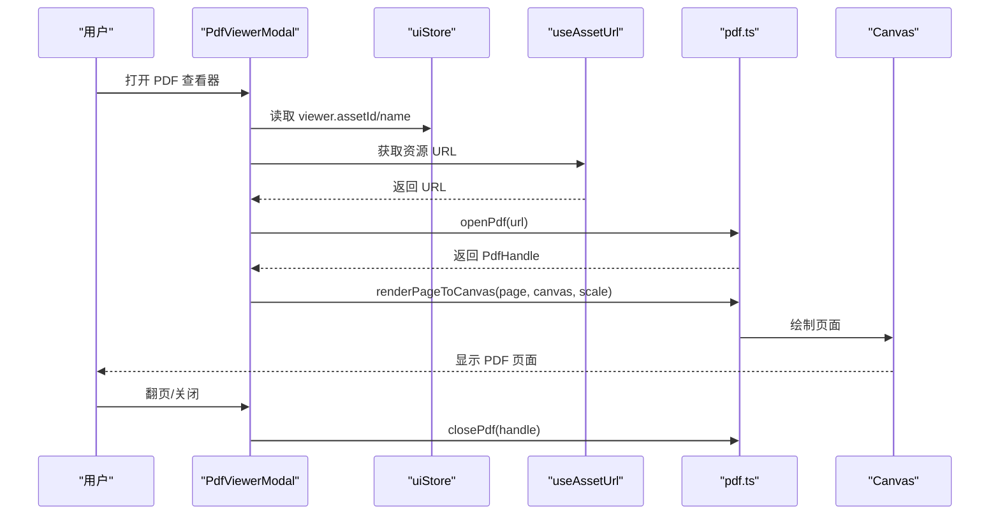
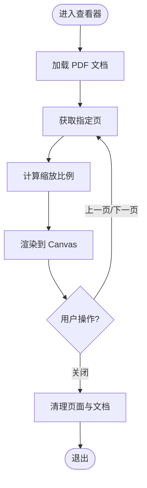
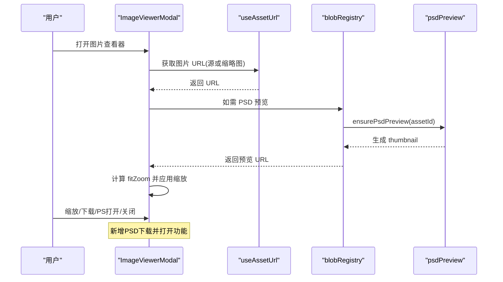
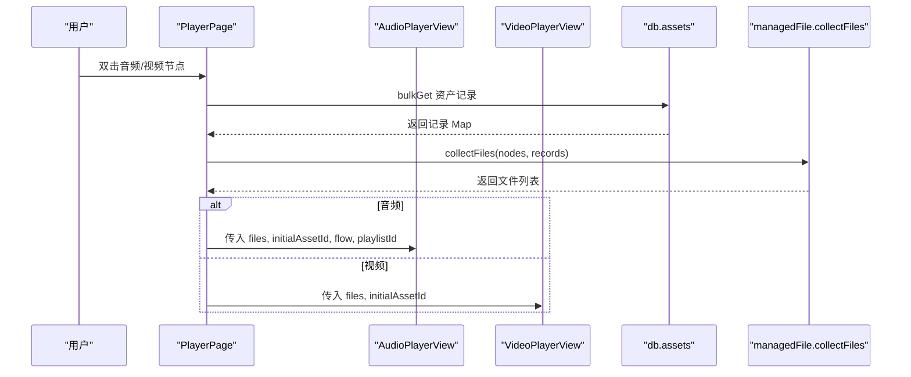
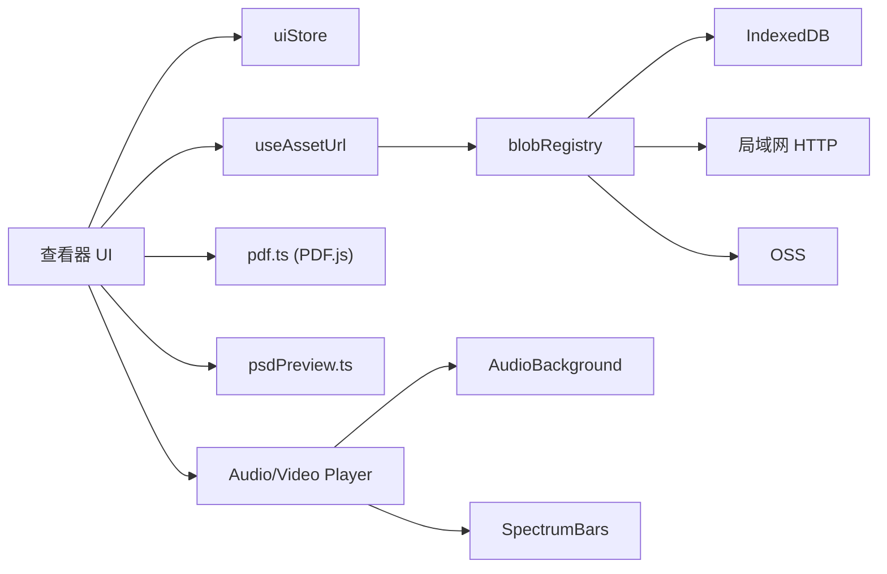

# 查看器组件

<cite>
**本文引用的文件**
- [PdfViewerModal.tsx](file://src/components/PdfViewerModal.tsx)
- [ImageViewerModal.tsx](file://src/components/ImageViewerModal.tsx)
- [MarkdownViewerModal.tsx](file://src/components/MarkdownViewerModal.tsx)
- [PlayerPage.tsx](file://src/components/PlayerPage.tsx)
- [pdf.ts](file://src/media/pdf.ts)
- [useAssetUrl.ts](file://src/media/useAssetUrl.ts)
- [blobRegistry.ts](file://src/media/blobRegistry.ts)
- [uiStore.ts](file://src/store/uiStore.ts)
- [AudioPlayer.tsx](file://src/components/AudioPlayer.tsx)
- [VideoPlayer.tsx](file://src/components/VideoPlayer.tsx)
- [AudioBackground.tsx](file://src/components/AudioBackground.tsx)
- [SpectrumBars.tsx](file://src/components/SpectrumBars.tsx)
- [psdPreview.ts](file://src/media/psdPreview.ts)
</cite>

## 更新摘要
**变更内容**
- 增强了图片查看器组件的PSD文件下载功能
- 新增了"下载PSD并在Photoshop中打开"按钮
- 支持直接获取原始PSD文件进行外部编辑
- 更新了图片查看器的下载交互流程

## 目录
1. [简介](#简介)
2. [项目结构](#项目结构)
3. [核心组件](#核心组件)
4. [架构总览](#架构总览)
5. [详细组件分析](#详细组件分析)
6. [依赖关系分析](#依赖关系分析)
7. [性能与优化](#性能与优化)
8. [故障排查指南](#故障排查指南)
9. [结论](#结论)
10. [附录：扩展与自定义指南](#附录扩展与自定义指南)

## 简介
本章节面向"查看器组件"的整体说明，涵盖 PDF 查看器、图片查看器、Markdown 查看器以及播放器页面的设计目标与能力边界。重点包括：
- PDF.js 集成渲染、页面导航、缩放控制
- 图片查看器的加载、缩放、旋转（通过外部工具）、下载与 PSD 预览及在 Photoshop 中打开
- Markdown 查看器的渲染引擎选择、编辑保存、样式定制
- 播放器页面的沉浸式多媒体播放控制界面
- 响应式设计与性能优化策略
- 错误处理与用户体验保障
- 如何扩展自定义查看器

## 项目结构
查看器相关代码主要分布在 components 与 media 两个目录：
- components：UI 层组件，负责交互、布局、状态绑定
- media：资源加载、媒体协调、PDF/PSD 等专用逻辑
- store：全局 UI 状态管理，驱动各查看器开关与参数

图表来源
- [PdfViewerModal.tsx:1-146](file://src/components/PdfViewerModal.tsx#L1-L146)
- [ImageViewerModal.tsx:1-165](file://src/components/ImageViewerModal.tsx#L1-L165)
- [MarkdownViewerModal.tsx:1-116](file://src/components/MarkdownViewerModal.tsx#L1-L116)
- [PlayerPage.tsx:1-101](file://src/components/PlayerPage.tsx#L1-L101)
- [pdf.ts:1-50](file://src/media/pdf.ts#L1-L50)
- [useAssetUrl.ts:1-157](file://src/media/useAssetUrl.ts#L1-L157)
- [blobRegistry.ts:1-389](file://src/media/blobRegistry.ts#L1-L389)
- [psdPreview.ts:1-62](file://src/media/psdPreview.ts#L1-L62)
- [uiStore.ts:1-121](file://src/store/uiStore.ts#L1-L121)
- [AudioPlayer.tsx:142-800](file://src/components/AudioPlayer.tsx#L142-L800)
- [VideoPlayer.tsx:58-800](file://src/components/VideoPlayer.tsx#L58-L800)
- [AudioBackground.tsx:1-140](file://src/components/AudioBackground.tsx#L1-L140)
- [SpectrumBars.tsx:1-120](file://src/components/SpectrumBars.tsx#L1-L120)

章节来源
- [PdfViewerModal.tsx:1-146](file://src/components/PdfViewerModal.tsx#L1-L146)
- [ImageViewerModal.tsx:1-165](file://src/components/ImageViewerModal.tsx#L1-L165)
- [MarkdownViewerModal.tsx:1-116](file://src/components/MarkdownViewerModal.tsx#L1-L116)
- [PlayerPage.tsx:1-101](file://src/components/PlayerPage.tsx#L1-L101)
- [pdf.ts:1-50](file://src/media/pdf.ts#L1-L50)
- [useAssetUrl.ts:1-157](file://src/media/useAssetUrl.ts#L1-L157)
- [blobRegistry.ts:1-389](file://src/media/blobRegistry.ts#L1-L389)
- [uiStore.ts:1-121](file://src/store/uiStore.ts#L1-L121)

## 核心组件
- PdfViewerModal：基于 PDF.js 的 PDF 文档查看器，支持动态加载、页面导航、键盘快捷键、自适应缩放与内存清理。
- ImageViewerModal：图片查看器，支持缩放、滚轮缩放、适应窗口、下载、PSD 缩略图预览与在 Photoshop 中打开。
- MarkdownViewerModal：Markdown 查看与编辑器，使用 react-markdown 渲染，支持在线编辑、保存、版本刷新与局域网协作标记。
- PlayerPage：播放器入口页，根据类型路由到 AudioPlayerView 或 VideoPlayerView，提供沉浸式播放体验。

章节来源
- [PdfViewerModal.tsx:1-146](file://src/components/PdfViewerModal.tsx#L1-L146)
- [ImageViewerModal.tsx:1-165](file://src/components/ImageViewerModal.tsx#L1-L165)
- [MarkdownViewerModal.tsx:1-116](file://src/components/MarkdownViewerModal.tsx#L1-L116)
- [PlayerPage.tsx:1-101](file://src/components/PlayerPage.tsx#L1-L101)

## 架构总览
查看器组件遵循"状态驱动 + 资源抽象 + 渲染解耦"的架构：
- uiStore 集中管理查看器开关与当前上下文（assetId、name、thumbnail 等）
- useAssetUrl 统一获取资源 URL，内置重试与失败提示
- blobRegistry 负责本地 IndexedDB、局域网流式地址、OSS 拉取与封面生成
- pdf.ts 封装 PDF.js 初始化、文档打开、页面渲染与销毁
- 播放器页面复用沉浸式 Audio/Video 视图，结合背景与频谱增强体验

图表来源
- [PdfViewerModal.tsx:20-83](file://src/components/PdfViewerModal.tsx#L20-L83)
- [pdf.ts:23-49](file://src/media/pdf.ts#L23-L49)
- [useAssetUrl.ts:10-44](file://src/media/useAssetUrl.ts#L10-L44)
- [uiStore.ts:69-75](file://src/store/uiStore.ts#L69-L75)

## 详细组件分析

### PDF 查看器（PdfViewerModal）
- 渲染实现
  - 动态导入 pdf.ts，调用 openPdf 加载文档，记录 doc.numPages
  - 使用 getViewport({ scale }) 计算缩放，renderPageToCanvas 将页面绘制到 Canvas，考虑 devicePixelRatio 提升清晰度
  - 每次切换页面先 cleanup 旧页面，避免内存泄漏
- 页面导航
  - 支持上一页/下一页按钮与键盘左右方向键
  - 顶部显示当前页码与总页数
- 缩放控制
  - 根据页面原始宽度与容器宽度自动计算 scale，上限为 2，保证移动端可读性
- 错误处理
  - 打开失败与渲染失败均捕获并 toast 提示
- 生命周期与清理
  - 组件卸载时关闭 PDF 文档、释放页面与状态

图表来源
- [PdfViewerModal.tsx:24-83](file://src/components/PdfViewerModal.tsx#L24-L83)
- [pdf.ts:23-49](file://src/media/pdf.ts#L23-L49)

章节来源
- [PdfViewerModal.tsx:1-146](file://src/components/PdfViewerModal.tsx#L1-L146)
- [pdf.ts:1-50](file://src/media/pdf.ts#L1-L50)

### 图片查看器（ImageViewerModal）
- 图片加载
  - 优先使用 useAssetSourceUrl 获取源图或缩略图；若为 PSD 则通过 usePsdPreviewUrl 生成预览
  - 监听 onLoad 获取自然尺寸，用于自适应缩放
- 缩放与交互
  - 支持放大/缩小按钮、滚轮缩放、键盘 +/- 缩放、0 键适应窗口
  - 缩放范围限制在 MIN_ZOOM 与 MAX_ZOOM 之间
- **更新** 下载与 PS 打开
  - 下载原始图片或 PSD
  - **新增** PSD 可下载后直接在 Photoshop 中打开，提供一键下载并打开功能
  - 支持区分普通图片和 PSD 文件的下载行为
- 错误处理
  - 下载失败 toast 提示

图表来源
- [ImageViewerModal.tsx:14-165](file://src/components/ImageViewerModal.tsx#L14-L165)
- [useAssetUrl.ts:101-157](file://src/media/useAssetUrl.ts#L101-L157)
- [psdPreview.ts:49-62](file://src/media/psdPreview.ts#L49-L62)

章节来源
- [ImageViewerModal.tsx:1-165](file://src/components/ImageViewerModal.tsx#L1-L165)
- [useAssetUrl.ts:101-157](file://src/media/useAssetUrl.ts#L101-L157)
- [blobRegistry.ts:310-379](file://src/media/blobRegistry.ts#L310-L379)
- [psdPreview.ts:1-62](file://src/media/psdPreview.ts#L1-L62)

### Markdown 查看器（MarkdownViewerModal）
- 渲染引擎
  - 使用 react-markdown 进行渲染，外层包裹 article.sq-markdown 便于样式定制
- 内容加载与编辑
  - 打开时 fetch 资源文本，限制最大长度防止卡顿
  - 支持编辑模式，保存时更新资产文本并刷新版本，触发重新渲染
- 协作与状态
  - 打开时设置局域网编辑标记，关闭时清除
- 错误处理
  - 加载失败与保存失败均有 toast 提示

图表来源
- [MarkdownViewerModal.tsx:11-116](file://src/components/MarkdownViewerModal.tsx#L11-L116)

章节来源
- [MarkdownViewerModal.tsx:1-116](file://src/components/MarkdownViewerModal.tsx#L1-L116)

### 播放器页面（PlayerPage）
- 路由与复用
  - 根据 page.kind 路由到 AudioPlayerView 或 VideoPlayerView
- 数据准备
  - 收集画布节点中的音频/视频 assetId，批量查询数据库记录，构建文件列表
- 沉浸式体验
  - 音频：背景水波纹、唱片封面、频谱条、歌词同步、队列管理
  - 视频：氛围背景、全屏/画中画、进度拖拽、倍速、音量、列表侧栏

图表来源
- [PlayerPage.tsx:14-101](file://src/components/PlayerPage.tsx#L14-L101)
- [AudioPlayer.tsx:142-800](file://src/components/AudioPlayer.tsx#L142-L800)
- [VideoPlayer.tsx:58-800](file://src/components/VideoPlayer.tsx#L58-L800)

章节来源
- [PlayerPage.tsx:1-101](file://src/components/PlayerPage.tsx#L1-L101)
- [AudioPlayer.tsx:142-800](file://src/components/AudioPlayer.tsx#L142-L800)
- [VideoPlayer.tsx:58-800](file://src/components/VideoPlayer.tsx#L58-L800)

## 依赖关系分析
- 查看器与状态
  - 所有查看器通过 uiStore 的 open/close 方法控制显隐与上下文
- 资源获取链
  - useAssetUrl -> blobRegistry -> 本地 IndexedDB / 局域网 HTTP / OSS
  - 封面生成：blobRegistry 对视频抓帧，PSD 通过 psdPreview 生成缩略图
- PDF 渲染链
  - PdfViewerModal -> pdf.ts -> PDF.js worker/cmaps/wasm
- 播放器依赖
  - AudioPlayer/VideoPlayer 依赖 blobRegistry 获取资源与封面，AudioBackground/SpectrumBars 提供视觉与频谱效果

图表来源
- [uiStore.ts:18-121](file://src/store/uiStore.ts#L18-L121)
- [useAssetUrl.ts:10-157](file://src/media/useAssetUrl.ts#L10-L157)
- [blobRegistry.ts:84-389](file://src/media/blobRegistry.ts#L84-L389)
- [pdf.ts:1-50](file://src/media/pdf.ts#L1-L50)
- [psdPreview.ts:1-62](file://src/media/psdPreview.ts#L1-L62)
- [AudioBackground.tsx:1-140](file://src/components/AudioBackground.tsx#L1-L140)
- [SpectrumBars.tsx:1-120](file://src/components/SpectrumBars.tsx#L1-L120)

章节来源
- [uiStore.ts:1-121](file://src/store/uiStore.ts#L1-L121)
- [useAssetUrl.ts:1-157](file://src/media/useAssetUrl.ts#L1-L157)
- [blobRegistry.ts:1-389](file://src/media/blobRegistry.ts#L1-L389)
- [pdf.ts:1-50](file://src/media/pdf.ts#L1-L50)
- [psdPreview.ts:1-62](file://src/media/psdPreview.ts#L1-L62)
- [AudioBackground.tsx:1-140](file://src/components/AudioBackground.tsx#L1-L140)
- [SpectrumBars.tsx:1-120](file://src/components/SpectrumBars.tsx#L1-L120)

## 性能与优化
- PDF 渲染
  - 使用 devicePixelRatio 提升清晰度，同时限制最大缩放避免过大 Canvas
  - 页面切换前 cleanup，及时释放内存
- 图片查看器
  - 缩放范围限制，避免极端缩放导致重绘开销
  - 滚动事件防抖（preventDefault 阻止默认滚动），减少抖动
  - **更新** PSD 下载功能优化，使用 Blob URL 和对象 URL 管理确保内存效率
- Markdown 查看器
  - 限制最大文本长度，避免大文档渲染卡顿
  - 保存时失效 URL 缓存并递增版本，确保最新内容
- 资源加载
  - useAssetUrl 内置重试机制，应对局域网传输延迟
  - blobRegistry 并发抓帧限制，避免阻塞浏览器连接池
  - 本地优先、HTTP 流式优先，减少大文件下载到内存
- 播放器
  - 音频背景使用 ResizeObserver 与 requestAnimationFrame，仅在变化时重绘
  - 频谱条按感知曲线调整可见度，暂停/静音保留基线，降低 CPU 占用
  - 视频预加载 metadata，批量探测时长，减少主线程压力

[本节为通用性能讨论，不直接分析具体文件]

## 故障排查指南
- PDF 打开失败
  - 检查 PDF.js worker/cmaps/wasm 路径配置是否正确
  - 查看控制台错误与 toast 提示
- 页面渲染失败
  - 确认页面存在且可访问，检查网络与跨域策略
- 图片加载失败
  - 检查资源是否存在，useAssetUrl 重试次数与失败提示
- **更新** PSD 下载失败
  - 检查网络连接和资源权限
  - 确认 blobRegistry 能正确获取原始 PSD 文件
  - 查看 toast 提示信息了解具体错误原因
- Markdown 保存失败
  - 检查网络连接与权限，查看 toast 提示
- 播放器无法播放
  - 检查音视频格式与编码，确认局域网/服务器 CORS 配置
  - 视频封面抓取失败时，blobRegistry 会尝试兜底方案

章节来源
- [PdfViewerModal.tsx:24-83](file://src/components/PdfViewerModal.tsx#L24-L83)
- [useAssetUrl.ts:10-44](file://src/media/useAssetUrl.ts#L10-L44)
- [blobRegistry.ts:128-239](file://src/media/blobRegistry.ts#L128-L239)
- [MarkdownViewerModal.tsx:21-58](file://src/components/MarkdownViewerModal.tsx#L21-L58)
- [VideoPlayer.tsx:284-293](file://src/components/VideoPlayer.tsx#L284-L293)

## 结论
查看器组件以清晰的职责划分与统一的资源抽象实现了多类型内容的查看与播放。PDF 查看器借助 PDF.js 完成高质量渲染与导航；图片查看器提供灵活的缩放与下载能力，**现已增强支持 PSD 文件的一键下载并在 Photoshop 中打开**；Markdown 查看器兼顾阅读与编辑；播放器页面提供沉浸式的多媒体体验。整体架构具备良好的可扩展性与健壮性，适合进一步定制与扩展。

[本节为总结，不直接分析具体文件]

## 附录：扩展与自定义指南
- 自定义查看器
  - 在 uiStore 中添加新的查看器状态与 open/close 方法
  - 新建组件，使用 useUiStore 订阅状态，实现资源加载与渲染逻辑
  - 复用 useAssetUrl 与 blobRegistry 获取资源与封面
- 扩展 PDF 功能
  - 在 pdf.ts 中增加书签、搜索、批注等功能接口
  - 在 PdfViewerModal 中集成新 API，提供 UI 控制
- 扩展图片查看器
  - 添加旋转、裁剪、标注等功能，保持缩放与性能平衡
  - **参考现有 PSD 下载功能**，可以添加更多外部工具集成功能
- 扩展 Markdown 查看器
  - 替换渲染引擎或插件，增强语法支持与导出能力
- 播放器扩展
  - 新增播放模式、字幕、多音轨、画质切换等特性
  - 优化后台播放与系统通知

[本节为概念性指导，不直接分析具体文件]