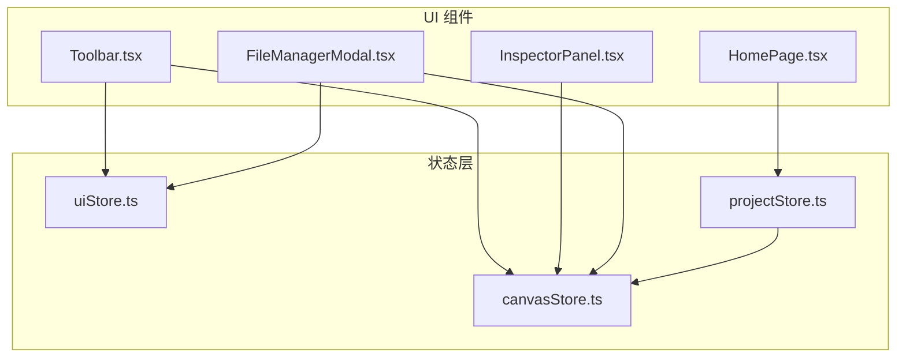
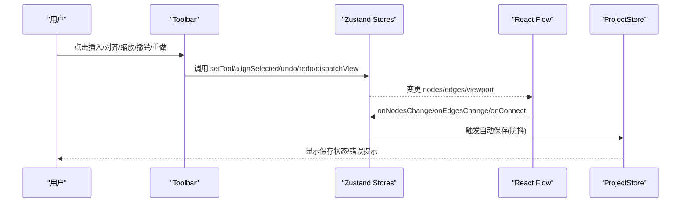
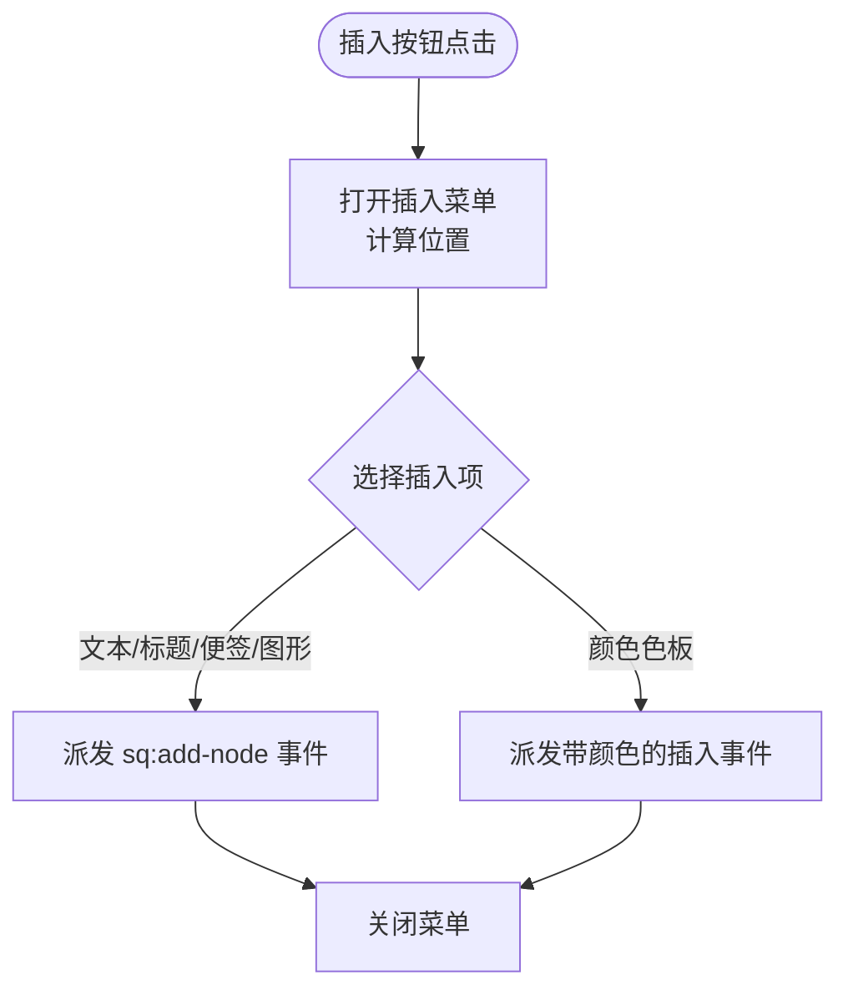
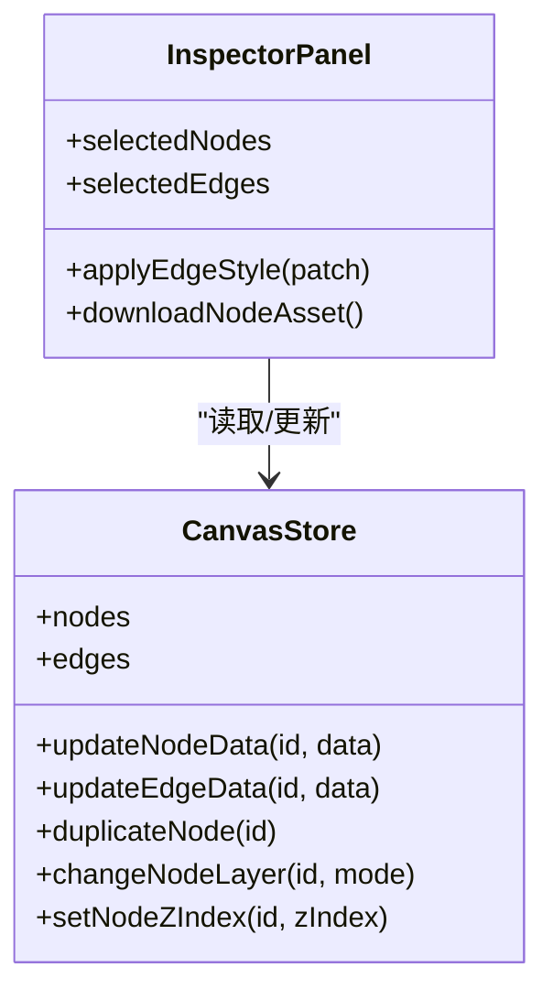
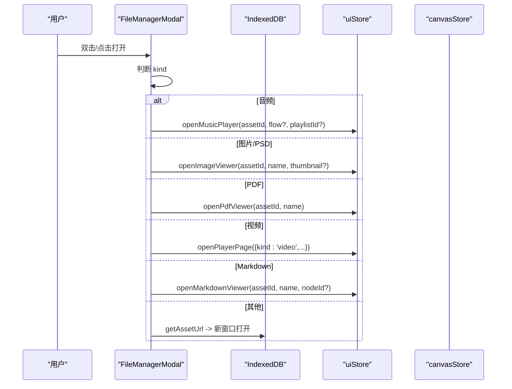
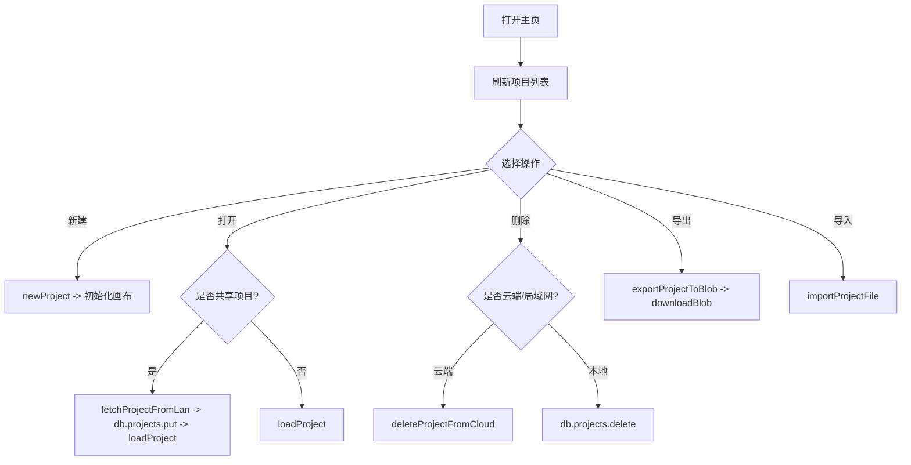
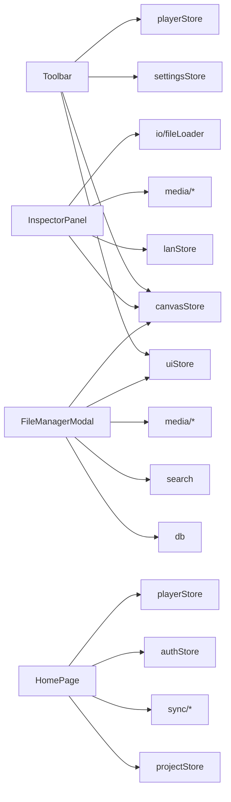

# 核心组件

<cite>
**本文引用的文件**
- [Toolbar.tsx](file://src/components/Toolbar.tsx)
- [InspectorPanel.tsx](file://src/components/InspectorPanel.tsx)
- [FileManagerModal.tsx](file://src/components/FileManagerModal.tsx)
- [HomePage.tsx](file://src/components/HomePage.tsx)
- [uiStore.ts](file://src/store/uiStore.ts)
- [canvasStore.ts](file://src/store/canvasStore.ts)
- [projectStore.ts](file://src/store/projectStore.ts)
</cite>

## 目录
1. [简介](#简介)
2. [项目结构](#项目结构)
3. [核心组件](#核心组件)
4. [架构总览](#架构总览)
5. [详细组件分析](#详细组件分析)
6. [依赖关系分析](#依赖关系分析)
7. [性能考量](#性能考量)
8. [故障排查指南](#故障排查指南)
9. [结论](#结论)
10. [附录：使用示例与扩展指南](#附录使用示例与扩展指南)

## 简介
本文件聚焦于画布应用的核心 UI 组件，系统性解析工具栏（Toolbar）、属性面板（InspectorPanel）、文件管理器（FileManagerModal）以及主页（HomePage）的实现原理与交互流程。重点覆盖以下能力：
- 工具栏：插入菜单、工具模式切换、对齐操作、撤销重做、缩放控制、主题切换、导入导出等
- 属性面板：根据选中节点/连线动态渲染并编辑属性
- 文件管理器：浏览、搜索、打开、下载、删除资源，支持音频播放器入口
- 主页：项目列表、新建/打开/删除/导出/导入、局域网恢复备份、状态指示
- 跨组件状态共享：基于 Zustand store 的集中式状态管理
- 事件处理模式：自定义事件、store 订阅、React Flow 变更回调
- 用户交互流程：从界面到状态再到持久化的完整链路

## 项目结构
核心 UI 组件位于 src/components，状态管理位于 src/store，数据与同步逻辑在 src/db、src/sync、src/io 等模块中。UI 组件通过 Zustand store 读写全局状态，并通过 React Flow 提供的 onNodesChange/onEdgesChange/onConnect 等回调驱动画布变化。

图表来源
- [Toolbar.tsx:97-403](file://src/components/Toolbar.tsx#L97-L403)
- [InspectorPanel.tsx:288-800](file://src/components/InspectorPanel.tsx#L288-L800)
- [FileManagerModal.tsx:63-417](file://src/components/FileManagerModal.tsx#L63-L417)
- [HomePage.tsx:415-943](file://src/components/HomePage.tsx#L415-L943)
- [uiStore.ts:1-121](file://src/store/uiStore.ts#L1-L121)
- [canvasStore.ts:1-200](file://src/store/canvasStore.ts#L1-L200)
- [projectStore.ts:1-200](file://src/store/projectStore.ts#L1-L200)

章节来源
- [Toolbar.tsx:97-403](file://src/components/Toolbar.tsx#L97-L403)
- [InspectorPanel.tsx:288-800](file://src/components/InspectorPanel.tsx#L288-L800)
- [FileManagerModal.tsx:63-417](file://src/components/FileManagerModal.tsx#L63-L417)
- [HomePage.tsx:415-943](file://src/components/HomePage.tsx#L415-L943)
- [uiStore.ts:1-121](file://src/store/uiStore.ts#L1-L121)
- [canvasStore.ts:1-200](file://src/store/canvasStore.ts#L1-L200)
- [projectStore.ts:1-200](file://src/store/projectStore.ts#L1-L200)

## 核心组件
- Toolbar：提供插入元素、工具模式、对齐、撤销/重做、缩放、主题切换、导入导出、文件管理等入口；通过自定义事件与 store 协同工作
- InspectorPanel：监听选中节点/连线，动态展示可编辑属性，调用 canvasStore 更新数据
- FileManagerModal：聚合资源浏览、搜索、打开、下载、删除，支持音频播放入口
- HomePage：项目管理中心，负责新建、打开、删除、导出、导入、局域网恢复备份、状态提示

章节来源
- [Toolbar.tsx:97-403](file://src/components/Toolbar.tsx#L97-L403)
- [InspectorPanel.tsx:288-800](file://src/components/InspectorPanel.tsx#L288-L800)
- [FileManagerModal.tsx:63-417](file://src/components/FileManagerModal.tsx#L63-L417)
- [HomePage.tsx:415-943](file://src/components/HomePage.tsx#L415-L943)

## 架构总览
整体采用“组件 + Zustand Store”的架构：
- 组件只负责 UI 与交互，不直接持有复杂状态
- 所有状态集中在 uiStore、canvasStore、projectStore 中
- 组件通过 useXxxStore 订阅所需切片，触发 action 修改状态
- 画布变更通过 React Flow 的变更回调进入 canvasStore，再触发自动保存与历史快照

图表来源
- [Toolbar.tsx:86-92](file://src/components/Toolbar.tsx#L86-L92)
- [Toolbar.tsx:105-125](file://src/components/Toolbar.tsx#L105-L125)
- [canvasStore.ts:126-158](file://src/store/canvasStore.ts#L126-L158)
- [projectStore.ts:46-67](file://src/store/projectStore.ts#L46-L67)

## 详细组件分析

### 工具栏（Toolbar）
功能要点
- 插入菜单：通过 createPortal 将下拉菜单挂载到 body，避免层级问题；点击后派发 sq:add-node 自定义事件，由画布侧监听并创建对应节点类型
- 工具模式切换：select/connect/drag 三种模式，切换时写入 uiStore.tool
- 对齐操作：当选中节点数≥2 时显示对齐按钮，调用 canvasStore.alignSelected 执行左/右/水平居中/顶/底/垂直居中/水平分布/垂直分布
- 撤销/重做：读取 canvasStore.past/future 长度决定禁用态，调用 undo/redo 实现
- 缩放控制：dispatchView('zoom-in'|'zoom-out'|'reset'|'fit') 派发视图动作，由画布或父级监听处理
- 主题切换：调用 settingsStore.toggleTheme
- 导入/导出：导入通过隐藏 input[type=file] 触发选择，调用 uiStore.requestImport；导出调用 importExport.exportCurrentProject
- 文件管理：打开 FileManagerModal

关键实现路径
- 插入菜单定位与关闭：监听 mousedown 与窗口滚动/resize，计算菜单位置
- 工具模式与对齐：直接调用 store 方法，无副作用
- 缩放：通过 window.dispatchEvent 派发统一视图事件，解耦具体实现

图表来源
- [Toolbar.tsx:127-156](file://src/components/Toolbar.tsx#L127-L156)
- [Toolbar.tsx:218-283](file://src/components/Toolbar.tsx#L218-L283)
- [Toolbar.tsx:86-92](file://src/components/Toolbar.tsx#L86-L92)

章节来源
- [Toolbar.tsx:97-403](file://src/components/Toolbar.tsx#L97-L403)

### 属性面板（InspectorPanel）
功能要点
- 动态显示：根据 selectedEditableNodes 与 selectedEdges 判断当前编辑上下文
- 连线属性：线型、路径、箭头、颜色、粗细、播放顺序（音频分叉场景）
- 节点属性：名称、边框颜色、文字对齐（水平/垂直）、字体样式（加粗/斜体/下划线）、字号、行距、字体族、填充色、形状、层级、复制/删除、音频专辑图设置与下载
- 并发编辑保护：结合 lanStore.editing/selfId 过滤被他人编辑的节点

关键实现路径
- 连线批量更新：applyEdgeStyle 对选中的多条边进行 style patch
- 节点属性更新：updateNodeData 逐个字段更新
- 专辑图：优先缩略图，缺失回退原图；本地上传通过 putAsset 入库
- 下载：getAssetUrl + IndexedDB 记录名生成下载链接

图表来源
- [InspectorPanel.tsx:288-800](file://src/components/InspectorPanel.tsx#L288-L800)
- [canvasStore.ts:176-200](file://src/store/canvasStore.ts#L176-L200)

章节来源
- [InspectorPanel.tsx:288-800](file://src/components/InspectorPanel.tsx#L288-L800)
- [canvasStore.ts:176-200](file://src/store/canvasStore.ts#L176-L200)

### 文件管理器（FileManagerModal）
功能要点
- 资源聚合：收集项目中所有 assetId，批量获取 IndexedDB 记录，按类型分组（媒体/文档/其他）
- 搜索：模糊匹配文件名、MIME、类型、中文标签、插入者
- 打开：音频进入内置播放器；图片/PSD 进入图片查看器；PDF 进入 PDF 查看器；视频进入播放器页；Markdown 进入编辑器；其他尝试新窗口打开
- 下载：批量下载，间隔避免浏览器拦截
- 删除：校验是否被他人锁定，确认后移除关联资产并清理 URL 引用
- 键盘快捷键：Ctrl+P 打开，Esc 关闭

关键实现路径
- 打开流程：openFile 分支处理不同 kind
- 批量下载：triggerDownload 封装 a.download 行为
- 删除流程：removeAssets + bulkDelete + invalidateAllAssetUrls

图表来源
- [FileManagerModal.tsx:160-194](file://src/components/FileManagerModal.tsx#L160-L194)
- [uiStore.ts:25-44](file://src/store/uiStore.ts#L25-L44)

章节来源
- [FileManagerModal.tsx:63-417](file://src/components/FileManagerModal.tsx#L63-L417)
- [uiStore.ts:1-121](file://src/store/uiStore.ts#L1-L121)

### 主页（HomePage）
功能要点
- 项目列表：合并本地与局域网远端项目，去重并按更新时间排序
- 新建/打开/删除/导出/导入：支持云端/本地双模式
- 局域网恢复备份：列出已删除项目，仅创建者可恢复
- 状态指示：云同步/OSS 连接状态、登录/游客模式、局域网协作标识
- 缩略图预览：Canvas 绘制节点预览，含媒体缩略图叠加

关键实现路径
- 列表刷新：syncProjectList 拉取最新项目
- 打开项目：若为共享项目则先 fetchProjectFromLan 再 loadProject
- 删除项目：区分云端/本地删除，必要时 gcAssets，清空画布历史
- 缩略图：计算边界框与缩放比例，绘制节点与连线，加载媒体缩略图

图表来源
- [HomePage.tsx:438-479](file://src/components/HomePage.tsx#L438-L479)
- [HomePage.tsx:500-516](file://src/components/HomePage.tsx#L500-L516)
- [HomePage.tsx:518-561](file://src/components/HomePage.tsx#L518-L561)
- [HomePage.tsx:595-621](file://src/components/HomePage.tsx#L595-L621)

章节来源
- [HomePage.tsx:415-943](file://src/components/HomePage.tsx#L415-L943)

## 依赖关系分析
- Toolbar 依赖 uiStore（工具模式、文件管理开关、导入队列）、canvasStore（对齐、撤销/重做、视口）、settingsStore（主题）、playerStore（CD 徽标）
- InspectorPanel 依赖 canvasStore（节点/边数据、层级、复制）、lanStore（并发编辑锁）、media 模块（缩略图、URL）、io/fileLoader（上传）
- FileManagerModal 依赖 uiStore（打开各类查看器）、canvasStore（删除资产）、db（IndexedDB 查询/删除）、search（模糊匹配）、media（格式识别、URL）
- HomePage 依赖 projectStore（项目 CRUD）、sync（云/局域网同步）、authStore（登录态）、playerStore（停止播放）

图表来源
- [Toolbar.tsx:105-125](file://src/components/Toolbar.tsx#L105-L125)
- [InspectorPanel.tsx:288-350](file://src/components/InspectorPanel.tsx#L288-L350)
- [FileManagerModal.tsx:63-135](file://src/components/FileManagerModal.tsx#L63-L135)
- [HomePage.tsx:415-479](file://src/components/HomePage.tsx#L415-L479)

章节来源
- [Toolbar.tsx:105-125](file://src/components/Toolbar.tsx#L105-L125)
- [InspectorPanel.tsx:288-350](file://src/components/InspectorPanel.tsx#L288-L350)
- [FileManagerModal.tsx:63-135](file://src/components/FileManagerModal.tsx#L63-L135)
- [HomePage.tsx:415-479](file://src/components/HomePage.tsx#L415-L479)

## 性能考量
- 历史快照防抖：canvasStore 使用 HISTORY_DEBOUNCE 合并多次变更，减少快照数量，降低内存占用
- 自动保存节流：projectStore 使用 AUTOSAVE_DELAY 延迟保存，避免频繁写盘
- 缩略图绘制：HomePage 使用 Canvas 按需绘制，媒体缩略图异步加载并缓存
- 批量操作：FileManagerModal 批量下载/删除，减少网络与存储往返
- 资源去重：InspectorPanel 专辑图选择时对 nodes 中的 assetId 去重，避免重复渲染

[本节为通用性能建议，无需特定文件引用]

## 故障排查指南
- 无法打开文件管理器：检查 Ctrl+P 快捷键是否被占用；确认 uiStore.fileManagerOpen 状态
- 插入元素无效：确认 sq:add-node 事件是否被画布监听；检查 INSERT_ITEMS 配置
- 对齐按钮不可用：确保选中节点数≥2；检查 alignSelected 是否生效
- 撤销/重做不可用：检查 past/future 是否为空；确认 onNodesChange/onEdgesChange 是否正确触发 snapshot
- 属性面板未显示：检查 selectedEditableNodes 是否为空或被 lanStore.editing 锁定
- 文件下载失败：确认 getAssetUrl 返回有效 URL；检查 IndexedDB 记录是否存在
- 主页项目不同步：检查云同步/OSS 配置；确认 syncProjectList 成功

章节来源
- [FileManagerModal.tsx:107-117](file://src/components/FileManagerModal.tsx#L107-L117)
- [Toolbar.tsx:86-92](file://src/components/Toolbar.tsx#L86-L92)
- [canvasStore.ts:66-107](file://src/store/canvasStore.ts#L66-L107)
- [InspectorPanel.tsx:298-305](file://src/components/InspectorPanel.tsx#L298-L305)
- [FileManagerModal.tsx:196-244](file://src/components/FileManagerModal.tsx#L196-L244)

## 结论
该核心 UI 组件体系以 Zustand 为中心，实现了高度解耦的状态管理与丰富的交互能力。工具栏提供高效的操作入口，属性面板精准响应选中对象，文件管理器整合资源生命周期，主页完成项目级管理。通过事件总线与 store 订阅，各组件间通信清晰、可扩展性强。建议在新增功能时遵循“组件只负责 UI，状态集中于 store”的原则，保持架构一致性。

[本节为总结性内容，无需特定文件引用]

## 附录：使用示例与扩展指南

### 使用示例
- 插入文本节点：点击工具栏“插入 > 文本”，画布监听 sq:add-node 事件并创建文本节点
- 对齐多个节点：多选节点后点击对齐按钮，调用 alignSelected 完成布局
- 编辑连线样式：选中连线后在属性面板调整线型、路径、箭头、颜色、粗细
- 打开文件管理器：Ctrl+P 打开，搜索并双击打开媒体/PDF/视频/Markdown
- 主页新建项目：点击“新建项目”，初始化空白画布并加入局域网协作

### 扩展指南
- 新增插入项：在 INSERT_ITEMS 中添加条目，并在 sq:add-node 监听处处理新增 kind
- 新增对齐方式：在 ALIGN_BUTTONS 添加 mode，并在 canvasStore.alignSelected 实现逻辑
- 新增属性字段：在 InspectorPanel 增加输入控件，调用 updateNodeData 更新
- 新增文件类型：在 TYPE_GROUPS 与 KIND_LABELS 中注册，完善 openFile 分支
- 新增主页功能：在 HomePage 添加按钮与 handler，必要时集成 sync 与 auth

章节来源
- [Toolbar.tsx:59-84](file://src/components/Toolbar.tsx#L59-L84)
- [Toolbar.tsx:218-336](file://src/components/Toolbar.tsx#L218-L336)
- [InspectorPanel.tsx:366-473](file://src/components/InspectorPanel.tsx#L366-L473)
- [FileManagerModal.tsx:21-39](file://src/components/FileManagerModal.tsx#L21-L39)
- [FileManagerModal.tsx:160-194](file://src/components/FileManagerModal.tsx#L160-L194)
- [HomePage.tsx:746-761](file://src/components/HomePage.tsx#L746-L761)