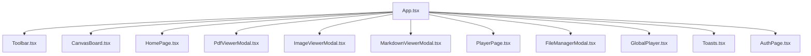
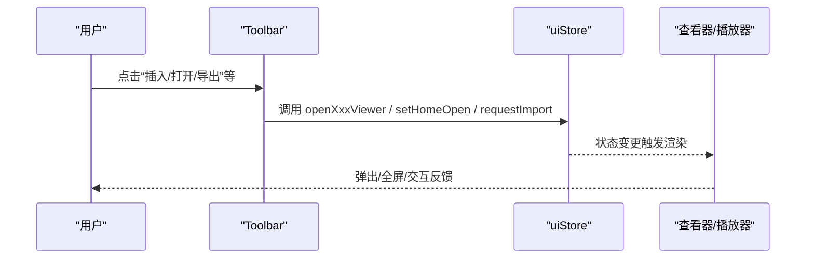
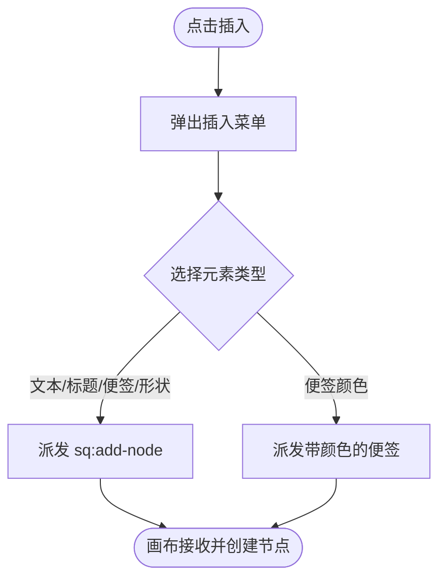
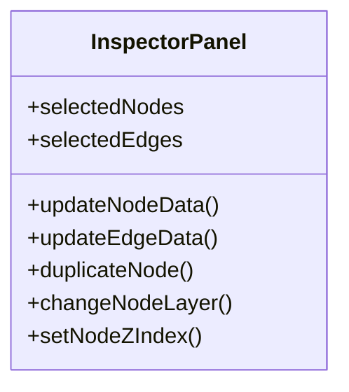
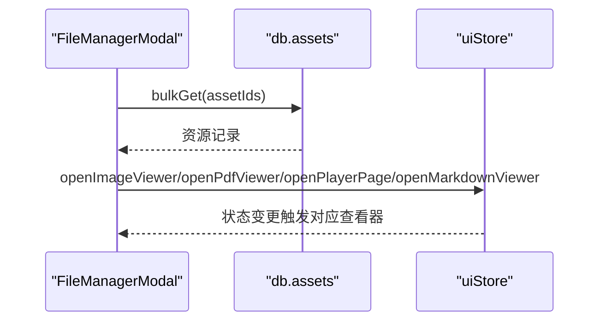
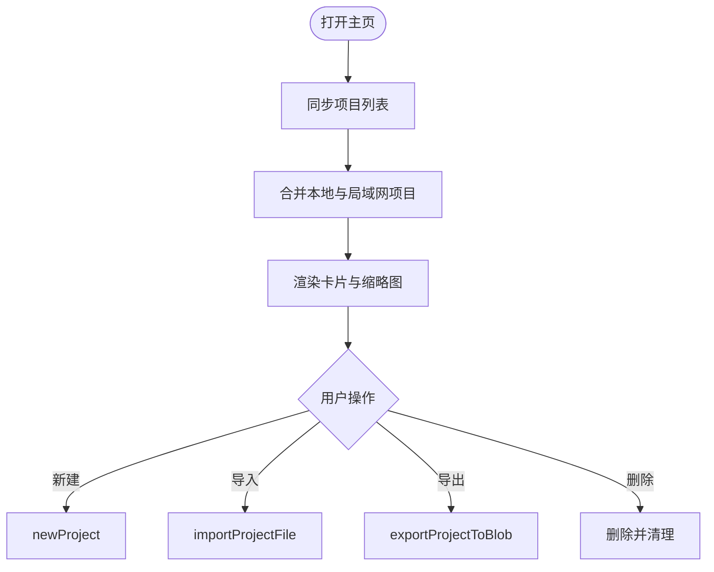
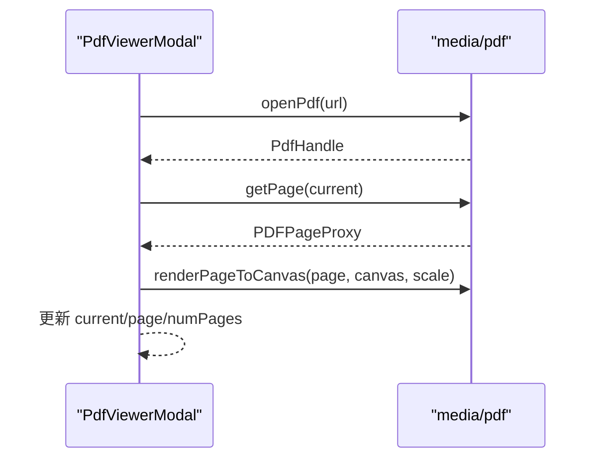
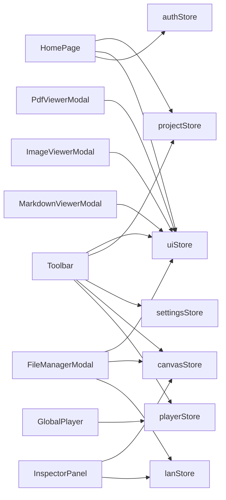

# 用户界面组件

<cite>
**本文引用的文件**
- [App.tsx](file://src/App.tsx)
- [Toolbar.tsx](file://src/components/Toolbar.tsx)
- [InspectorPanel.tsx](file://src/components/InspectorPanel.tsx)
- [FileManagerModal.tsx](file://src/components/FileManagerModal.tsx)
- [HomePage.tsx](file://src/components/HomePage.tsx)
- [PdfViewerModal.tsx](file://src/components/PdfViewerModal.tsx)
- [ImageViewerModal.tsx](file://src/components/ImageViewerModal.tsx)
- [MarkdownViewerModal.tsx](file://src/components/MarkdownViewerModal.tsx)
- [PlayerPage.tsx](file://src/components/PlayerPage.tsx)
- [GlobalPlayer.tsx](file://src/components/GlobalPlayer.tsx)
- [AuthPage.tsx](file://src/components/AuthPage.tsx)
- [LanPanel.tsx](file://src/components/LanPanel.tsx)
- [Toasts.tsx](file://src/components/Toasts.tsx)
- [uiStore.ts](file://src/store/uiStore.ts)
</cite>

## 目录
1. [简介](#简介)
2. [项目结构](#项目结构)
3. [核心组件](#核心组件)
4. [架构总览](#架构总览)
5. [详细组件分析](#详细组件分析)
6. [依赖关系分析](#依赖关系分析)
7. [性能与可访问性](#性能与可访问性)
8. [故障排查指南](#故障排查指南)
9. [结论](#结论)
10. [附录：使用示例与扩展指南](#附录：使用示例与扩展指南)

## 简介
本文件面向 SuQCanvas 的用户界面层，系统性梳理并解释以下 UI 组件的功能、实现与协作方式：工具栏（Toolbar）、属性面板（InspectorPanel）、文件管理器（FileManagerModal）、主页（HomePage），以及查看器组件（PDF、图片、Markdown、播放器页面）。同时覆盖全局播放器、通知系统、认证页面、局域网面板等辅助能力。文档重点说明组件间通信机制、状态共享、事件处理模式，并提供响应式、无障碍与性能优化实践建议。

## 项目结构
应用以 React + Zustand 为核心，UI 组件集中在 src/components，状态管理通过多个 store（如 uiStore、projectStore、canvasStore、playerStore、lanStore）进行解耦。顶层 App 负责装配各模块与路由级视图切换。

图表来源
- [App.tsx:19-74](file://src/App.tsx#L19-L74)

章节来源
- [App.tsx:19-74](file://src/App.tsx#L19-L74)

## 核心组件
- 工具栏（Toolbar）：提供项目导航、导入导出、插入元素、工具模式切换、撤销重做、对齐分布、缩放适配、主题切换、CD 悬浮入口、局域网面板入口等。
- 属性面板（InspectorPanel）：针对选中的节点或连线，提供名称、边框颜色、文字样式、层级、删除等操作；音频节点支持专辑图设置与下载。
- 文件管理器（FileManagerModal）：集中展示与管理所有资源（媒体/文档/其他），支持搜索、分类筛选、批量下载/删除、打开对应查看器或播放器。
- 主页（HomePage）：项目列表、新建/导入/导出、云同步状态、局域网恢复已删除项目、主题切换、登录/游客模式切换。
- 查看器：
  - PDF 查看器：动态加载 pdfjs，渲染当前页到 Canvas，支持翻页与键盘操作。
  - 图片查看器：支持缩放、适应窗口、PSD 预览与下载。
  - Markdown 查看器：在线编辑与保存，支持锁定协作编辑。
  - 播放器页面：根据类型进入沉浸式音频或视频播放视图。
- 全局播放器：常驻右上角可拖拽迷你条，统一音频引擎，支持最小化小窗、快进快退、显示歌单名。
- 通知系统：基于 uiStore 的 Toast 队列，自动消失与手动关闭。
- 认证页面：支持登录/注册（云端）与局域网连接登录，或游客模式。
- 局域网面板：连接/断开中继、跟随协作者、查看编辑中成员与活动日志。

章节来源
- [Toolbar.tsx:97-403](file://src/components/Toolbar.tsx#L97-L403)
- [InspectorPanel.tsx:288-800](file://src/components/InspectorPanel.tsx#L288-L800)
- [FileManagerModal.tsx:63-417](file://src/components/FileManagerModal.tsx#L63-L417)
- [HomePage.tsx:415-943](file://src/components/HomePage.tsx#L415-L943)
- [PdfViewerModal.tsx:7-146](file://src/components/PdfViewerModal.tsx#L7-L146)
- [ImageViewerModal.tsx:14-165](file://src/components/ImageViewerModal.tsx#L14-L165)
- [MarkdownViewerModal.tsx:11-116](file://src/components/MarkdownViewerModal.tsx#L11-L116)
- [PlayerPage.tsx:14-101](file://src/components/PlayerPage.tsx#L14-L101)
- [GlobalPlayer.tsx:19-234](file://src/components/GlobalPlayer.tsx#L19-L234)
- [Toasts.tsx:3-24](file://src/components/Toasts.tsx#L3-L24)
- [AuthPage.tsx:11-238](file://src/components/AuthPage.tsx#L11-L238)
- [LanPanel.tsx:17-199](file://src/components/LanPanel.tsx#L17-L199)
- [uiStore.ts:18-121](file://src/store/uiStore.ts#L18-L121)

## 架构总览
整体采用“组件 + Store”的单向数据流：
- 组件通过 useXxxStore 订阅状态变化，触发更新。
- 跨组件通信通过：
  - 全局事件（如 window.dispatchEvent('sq:add-node'/'sq:view')）
  - 共享 Store（uiStore、canvasStore、playerStore、lanStore 等）
  - 子组件回调（如 onBack/onClose）
- 查看器与播放器通过 uiStore 的 viewer/playerPage 状态驱动挂载与卸载。

图表来源
- [Toolbar.tsx:86-92](file://src/components/Toolbar.tsx#L86-L92)
- [uiStore.ts:69-115](file://src/store/uiStore.ts#L69-L115)
- [App.tsx:49-62](file://src/App.tsx#L49-L62)

## 详细组件分析

### 工具栏（Toolbar）
- 功能要点
  - 项目导航与导出：返回主页、导出 .sqcanvas。
  - 导入：触发本地文件选择，调用 requestImport。
  - 插入菜单：通过 createPortal 将下拉菜单挂载至 body，避免 z-index 问题；点击后派发 sq:add-node 自定义事件。
  - 工具模式：选择/连线/拖动三种模式，受 uiStore.tool 控制。
  - 撤销/重做：读取 canvasStore 历史栈。
  - 多选对齐：当选中节点数≥2时显示对齐/分布按钮，调用 alignSelected。
  - 全局播放器入口：当有音频且播放器条隐藏时显示 CD 图标，点击恢复播放器条。
  - 缩放与适配：通过 dispatchView 派发 sq:view 事件，由画布监听处理。
  - 主题切换：调用 settingsStore.toggleTheme。
  - 局域网面板：在 LAN 构建下显示 LanPanel。
- 关键交互流程
  - 插入元素：点击菜单项 → 派发 sq:add-node → 画布侧监听并创建节点。
  - 视图操作：点击缩放/适配 → 派发 sq:view → 画布侧调整 viewport。

图表来源
- [Toolbar.tsx:218-283](file://src/components/Toolbar.tsx#L218-L283)
- [Toolbar.tsx:86-92](file://src/components/Toolbar.tsx#L86-L92)

章节来源
- [Toolbar.tsx:97-403](file://src/components/Toolbar.tsx#L97-L403)

### 属性面板（InspectorPanel）
- 功能要点
  - 连线编辑：线型、路径、箭头、颜色、粗细；音频分叉处可设置播放顺序 order。
  - 节点编辑：名称、边框颜色、文字对齐、字体、字号、行距、加粗/斜体/下划线、填充色、层级移动、复制/删除。
  - 音频节点：专辑图设置（从项目图片选择或本地上传）、下载资产。
  - 协作保护：若节点正被他人编辑（editing），则不可编辑。
- 数据流
  - 通过 updateNodeData/updateEdgeData 直接修改 canvasStore 中的节点/连线数据。
  - 删除通过 useReactFlow.deleteElements 执行。

图表来源
- [InspectorPanel.tsx:288-800](file://src/components/InspectorPanel.tsx#L288-L800)

章节来源
- [InspectorPanel.tsx:288-800](file://src/components/InspectorPanel.tsx#L288-L800)

### 文件管理器（FileManagerModal）
- 功能要点
  - 资源聚合：收集画布中所有 assetId，批量获取 db.assets 记录，按类型分组展示。
  - 搜索与筛选：模糊匹配文件名、类型、插入者；支持按组/类型过滤。
  - 打开行为：MP3 进入播放器；图片/PSD 进入图片查看器；PDF 进入 PDF 查看器；视频进入播放器页面；Markdown 进入编辑器；其他尝试新窗口打开。
  - 批量操作：全选、下载、删除（含引用检查与 URL 失效刷新）。
  - 协作锁定：若 Markdown 正在被他人编辑，提示无法打开。
  - 快捷键：Ctrl+P 打开，Esc 关闭。
- 与播放器联动：通过 uiStore.playerTarget 将目标歌曲传入，并在关闭时清理残留状态。

图表来源
- [FileManagerModal.tsx:101-185](file://src/components/FileManagerModal.tsx#L101-L185)
- [uiStore.ts:69-115](file://src/store/uiStore.ts#L69-L115)

章节来源
- [FileManagerModal.tsx:63-417](file://src/components/FileManagerModal.tsx#L63-L417)

### 主页（HomePage）
- 功能要点
  - 项目列表：合并本地与局域网远端项目，按更新时间排序。
  - 新建/导入/导出：新建空白项目；导入 .sqcanvas；导出为文件。
  - 云/局域网状态：显示 Supabase/OSS 配置状态；局域网版显示“局域网版”。
  - 恢复已删除：列出局域网备份，仅创建者可恢复。
  - 主题切换与登录态：支持切换主题、退出登录或返回局域网登录。
- 缩略图生成：使用 Canvas 绘制节点预览，包含文本、图形、媒体占位与真实图片叠加。

图表来源
- [HomePage.tsx:438-479](file://src/components/HomePage.tsx#L438-L479)
- [HomePage.tsx:595-621](file://src/components/HomePage.tsx#L595-L621)

章节来源
- [HomePage.tsx:415-943](file://src/components/HomePage.tsx#L415-L943)

### PDF 查看器（PdfViewerModal）
- 实现原理
  - 动态 import media/pdf，调用 openPdf(sourceUrl) 获取 PdfHandle。
  - 渲染当前页到 Canvas，限制最大缩放比例，避免过大内存占用。
  - 键盘支持：Esc 关闭，左右方向键翻页。
  - 生命周期：关闭时清理 page 与 pdf 实例，释放资源。
- 错误处理：加载失败或渲染失败时 toast 提示。

图表来源
- [PdfViewerModal.tsx:24-83](file://src/components/PdfViewerModal.tsx#L24-L83)

章节来源
- [PdfViewerModal.tsx:7-146](file://src/components/PdfViewerModal.tsx#L7-L146)

### 图片查看器（ImageViewerModal）
- 功能要点
  - 自适应缩放：计算自然尺寸，支持放大/缩小/适应窗口。
  - PSD 预览：优先使用 thumbnail，缺失回退原图；支持下载原始 PSD 并在 Photoshop 中打开。
  - 键盘快捷键：Esc 关闭，+/- 缩放，0 适应。
  - 滚轮缩放：阻止默认滚动，按滚轮缩放。
- 资源获取：useAssetSourceUrl/useAssetUrl 获取预览/原图地址。

章节来源
- [ImageViewerModal.tsx:14-165](file://src/components/ImageViewerModal.tsx#L14-L165)

### Markdown 查看器（MarkdownViewerModal）
- 功能要点
  - 在线编辑：textarea 编辑，最大长度限制；保存时调用 updateAssetText 并刷新 URL 版本。
  - 协作锁定：进入时 setLanEditing(nodeId, name)，离开时 clearLanEditing。
  - 下载：提供下载链接。
  - 渲染：使用 react-markdown 渲染内容。
- 错误处理：加载失败 toast 提示。

章节来源
- [MarkdownViewerModal.tsx:11-116](file://src/components/MarkdownViewerModal.tsx#L11-L116)

### 播放器页面（PlayerPage）
- 功能要点
  - 根据 uiStore.playerPage.kind 决定进入音频或视频播放器。
  - 音频：复用 AudioPlayerView，支持封面背景、唱片动画、频谱、歌词、队列。
  - 视频：复用 VideoPlayerView，支持氛围背景、居中视频、自定义控制栏与列表。
  - 数据准备：收集画布中所有 assetId，批量获取 db.assets 记录，构造 files 列表。

章节来源
- [PlayerPage.tsx:14-101](file://src/components/PlayerPage.tsx#L14-L101)

### 全局播放器（GlobalPlayer）
- 功能要点
  - 单一音频元素：绑定到 playerStore 的 track/time/duration/volume/muted。
  - 悬浮条：可拖拽、收起/展开、最小化小窗（PiP）、快进快退、打开完整播放器。
  - 歌单信息：解析画布节点与连线，计算当前曲目所属歌单名。
  - 生命周期：挂载时 bindPlayerAudio 并 registerAudio；卸载时清理。
- 与画布联动：工具栏 CD 图标可重新打开播放器条。

章节来源
- [GlobalPlayer.tsx:19-234](file://src/components/GlobalPlayer.tsx#L19-L234)

### 通知系统（Toasts）
- 实现原理
  - 基于 uiStore.toasts 队列，pushToast 自动 3.2s 后移除。
  - 支持多种类型（info/success/error），点击可手动关闭。
- 使用方式：任意组件调用 toast(message, kind)。

章节来源
- [Toasts.tsx:3-24](file://src/components/Toasts.tsx#L3-L24)
- [uiStore.ts:49-58](file://src/store/uiStore.ts#L49-L58)

### 认证页面（AuthPage）
- 功能要点
  - 云端模式：登录/注册（未开放注册时提示联系管理员），游客模式。
  - 局域网模式：输入中继地址与协作名称，连接成功后进入应用。
  - 状态反馈：连接中/错误提示，记住设备配置。
- 与 App 集成：App 初始化 authStore，LAN 构建下自动重连。

章节来源
- [AuthPage.tsx:11-238](file://src/components/AuthPage.tsx#L11-L238)
- [App.tsx:25-30](file://src/App.tsx#L25-L30)

### 局域网面板（LanPanel）
- 功能要点
  - 连接/断开：维护 lanStore.status/name/selfId/users/followId。
  - 跟随协作者：点击“跟随”聚焦某协作者的视口。
  - 编辑中成员与活动日志：实时显示谁在编辑什么及最近活动。
  - 提示：宝塔部署默认反代 /lan-ws，直连可用 ws://IP:8790。

章节来源
- [LanPanel.tsx:17-199](file://src/components/LanPanel.tsx#L17-L199)

## 依赖关系分析
- 组件与 Store
  - Toolbar 依赖 uiStore/projectStore/settingsStore/canvasStore/playerStore。
  - InspectorPanel 依赖 canvasStore/lanStore/db/media。
  - FileManagerModal 依赖 uiStore/canvasStore/lanStore/db/search/media。
  - HomePage 依赖 projectStore/uiStore/settingsStore/authStore/lanStore/sync。
  - 查看器依赖 uiStore 与 media/useAssetUrl。
  - GlobalPlayer 依赖 playerStore/canvasStore/media/pipWindow。
- 事件与回调
  - 自定义事件：sq:add-node、sq:view。
  - 回调传递：PlayerPage 向父级传递 onBack/onClose。

图表来源
- [Toolbar.tsx:105-125](file://src/components/Toolbar.tsx#L105-L125)
- [InspectorPanel.tsx:288-304](file://src/components/InspectorPanel.tsx#L288-L304)
- [FileManagerModal.tsx:63-79](file://src/components/FileManagerModal.tsx#L63-L79)
- [HomePage.tsx:415-436](file://src/components/HomePage.tsx#L415-L436)
- [PdfViewerModal.tsx:7-11](file://src/components/PdfViewerModal.tsx#L7-L11)
- [ImageViewerModal.tsx:14-20](file://src/components/ImageViewerModal.tsx#L14-L20)
- [MarkdownViewerModal.tsx:11-15](file://src/components/MarkdownViewerModal.tsx#L11-L15)
- [GlobalPlayer.tsx:20-27](file://src/components/GlobalPlayer.tsx#L20-L27)

章节来源
- [uiStore.ts:18-121](file://src/store/uiStore.ts#L18-L121)

## 性能与可访问性
- 性能优化
  - 动态导入：PDF 查看器按需加载 pdfjs，减少首屏体积。
  - 资源缓存与失效：删除资源后调用 invalidateAllAssetUrl/invalidateAssetUrl 确保 URL 失效，避免脏读。
  - 批量查询：FileManagerModal 与 PlayerPage 使用 bulkGet 减少数据库往返。
  - 渲染限制：PDF 渲染限制最大缩放，防止大页面导致卡顿。
  - 缩略图绘制：HomePage 使用 Canvas 绘制缩略图，避免大量 DOM 开销。
- 可访问性
  - 语义化标签与 aria-label：文件管理器、属性面板中对关键控件添加 aria-label。
  - 键盘支持：PDF/图片查看器支持 Esc、方向键、缩放快捷键；文件管理器支持 Ctrl+P/Esc。
  - 焦点管理：弹窗打开时 autoFocus 输入框，关闭时恢复焦点。
- 响应式设计
  - 工具栏横向滚动隐藏滚动条；移动端隐藏部分按钮。
  - 文件管理器侧边栏在小屏隐藏，改用顶部选择器。
  - 图片查看器根据视口计算 fitZoom，保证不同屏幕尺寸体验一致。

[本节为通用指导，不直接分析具体文件]

## 故障排查指南
- PDF 打开失败/渲染失败
  - 现象：toast 提示“PDF 打开失败”或“页面渲染失败”。
  - 排查：确认资源 URL 有效；检查网络与权限；查看控制台错误。
  - 参考：[PdfViewerModal.tsx:24-39](file://src/components/PdfViewerModal.tsx#L24-L39)、[PdfViewerModal.tsx:58-76](file://src/components/PdfViewerModal.tsx#L58-L76)
- Markdown 保存失败
  - 现象：toast 提示“Markdown 保存失败”。
  - 排查：检查网络连接与存储后端；确认 nodeId 存在；查看 updateAssetText 返回值。
  - 参考：[MarkdownViewerModal.tsx:43-58](file://src/components/MarkdownViewerModal.tsx#L43-L58)
- 图片查看器下载失败
  - 现象：toast 提示“下载失败”。
  - 排查：确认 getAssetUrl 成功；检查浏览器下载策略。
  - 参考：[ImageViewerModal.tsx:42-60](file://src/components/ImageViewerModal.tsx#L42-L60)
- 文件管理器删除失败
  - 现象：toast 提示删除失败或被锁定。
  - 排查：确认无他人编辑；检查是否被其他项目引用；确认 db.assets.bulkDelete 成功。
  - 参考：[FileManagerModal.tsx:214-244](file://src/components/FileManagerModal.tsx#L214-L244)
- 全局播放器无声音
  - 现象：悬浮条可见但无声音。
  - 排查：确认 audioRef 已绑定；检查 volume/muted；确认 track.url 有效。
  - 参考：[GlobalPlayer.tsx:86-104](file://src/components/GlobalPlayer.tsx#L86-L104)

章节来源
- [PdfViewerModal.tsx:24-76](file://src/components/PdfViewerModal.tsx#L24-L76)
- [MarkdownViewerModal.tsx:43-58](file://src/components/MarkdownViewerModal.tsx#L43-L58)
- [ImageViewerModal.tsx:42-60](file://src/components/ImageViewerModal.tsx#L42-L60)
- [FileManagerModal.tsx:214-244](file://src/components/FileManagerModal.tsx#L214-L244)
- [GlobalPlayer.tsx:86-104](file://src/components/GlobalPlayer.tsx#L86-L104)

## 结论
SuQCanvas 的 UI 层以清晰的职责划分与解耦的状态管理为基础，通过 uiStore 统一管理弹窗与播放器入口，结合自定义事件与回调完成跨组件通信。查看器与播放器具备完善的错误处理与资源生命周期管理。整体设计兼顾了可扩展性与用户体验，适合进一步扩展新的查看器与交互模式。

[本节为总结，不直接分析具体文件]

## 附录：使用示例与扩展指南
- 新增一个查看器
  - 在 uiStore 中添加 viewer 状态与 open/close 方法。
  - 在 App 中挂载对应 Modal 组件。
  - 在需要打开的地方调用 openXxxViewer(assetId, name)。
  - 参考：[uiStore.ts:69-96](file://src/store/uiStore.ts#L69-L96)、[App.tsx:56-60](file://src/App.tsx#L56-L60)
- 在工具栏增加新操作
  - 定义按钮与 title/shortcut。
  - 通过 uiStore 或 canvasStore 触发相应动作。
  - 如需跨组件通信，使用 window.dispatchEvent 派发自定义事件。
  - 参考：[Toolbar.tsx:86-92](file://src/components/Toolbar.tsx#L86-L92)、[Toolbar.tsx:287-317](file://src/components/Toolbar.tsx#L287-L317)
- 扩展属性面板
  - 在 InspectorPanel 中新增 Section，读取 firstNode.data 并调用 updateNodeData。
  - 注意协作锁定判断（editing）。
  - 参考：[InspectorPanel.tsx:475-796](file://src/components/InspectorPanel.tsx#L475-L796)
- 自定义通知
  - 调用 toast(message, kind) 即可显示。
  - 参考：[uiStore.ts:49-58](file://src/store/uiStore.ts#L49-L58)
- 响应式与无障碍最佳实践
  - 使用 Tailwind 断点控制布局（如 hidden md:block）。
  - 为关键控件添加 aria-label/title。
  - 提供键盘快捷键与焦点管理。
  - 参考：[FileManagerModal.tsx:250-277](file://src/components/FileManagerModal.tsx#L250-L277)、[ImageViewerModal.tsx:30-38](file://src/components/ImageViewerModal.tsx#L30-L38)

章节来源
- [uiStore.ts:69-96](file://src/store/uiStore.ts#L69-L96)
- [App.tsx:56-60](file://src/App.tsx#L56-L60)
- [Toolbar.tsx:86-92](file://src/components/Toolbar.tsx#L86-L92)
- [InspectorPanel.tsx:475-796](file://src/components/InspectorPanel.tsx#L475-L796)
- [FileManagerModal.tsx:250-277](file://src/components/FileManagerModal.tsx#L250-L277)
- [ImageViewerModal.tsx:30-38](file://src/components/ImageViewerModal.tsx#L30-L38)