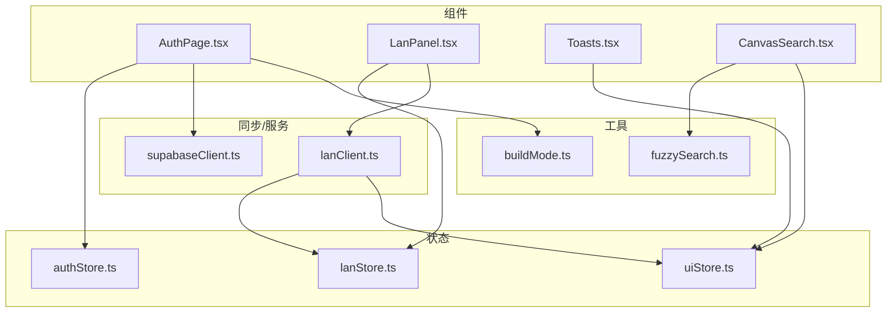
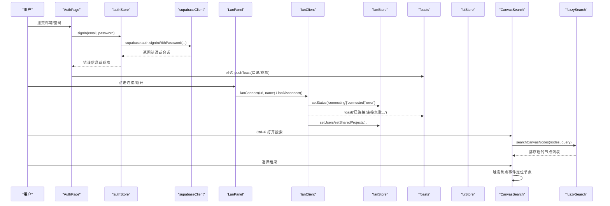
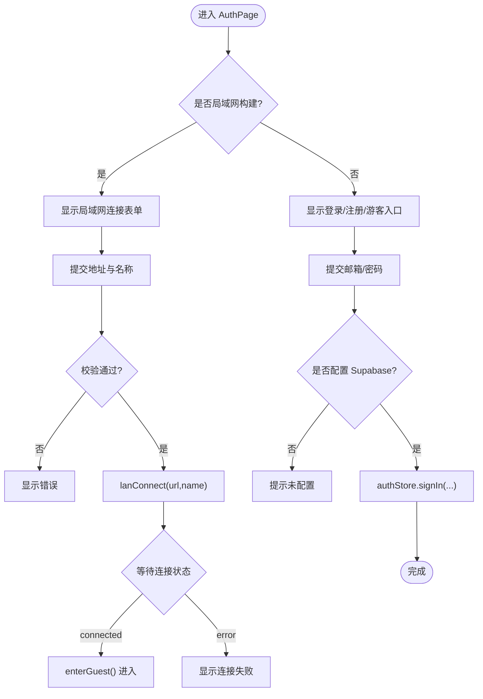
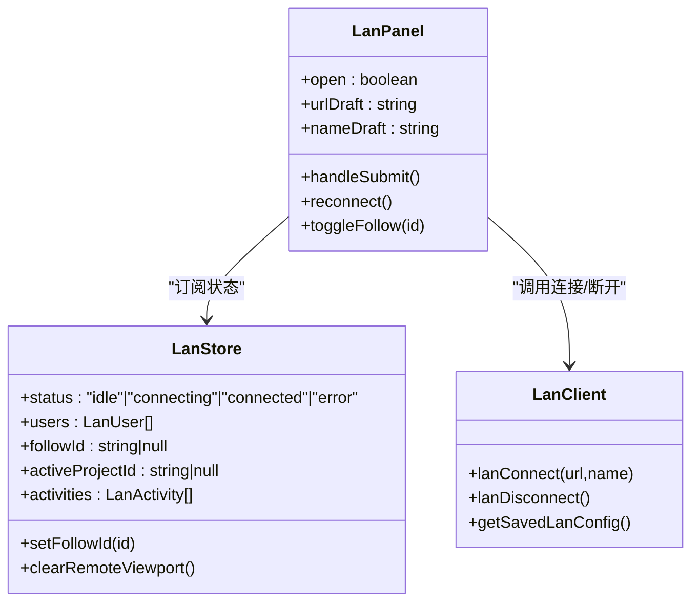
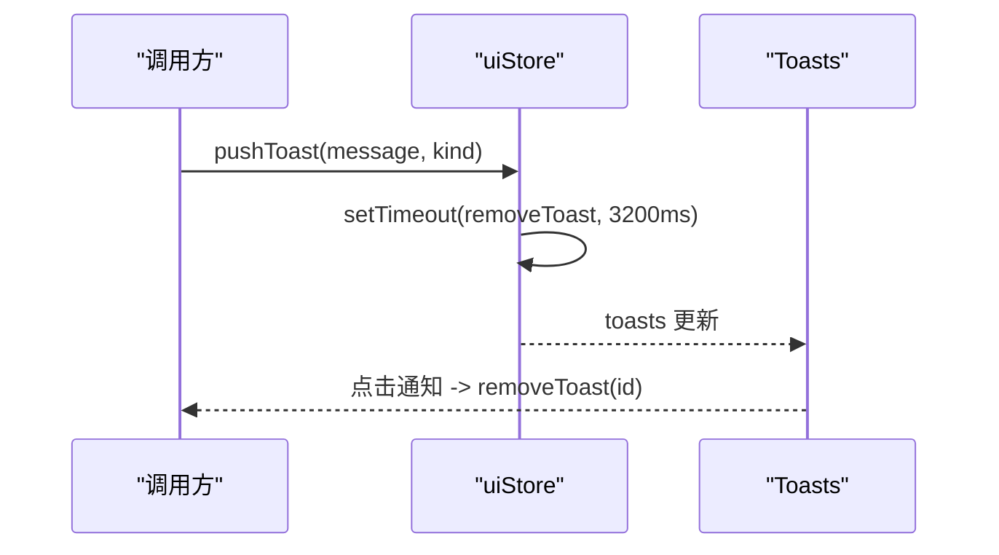
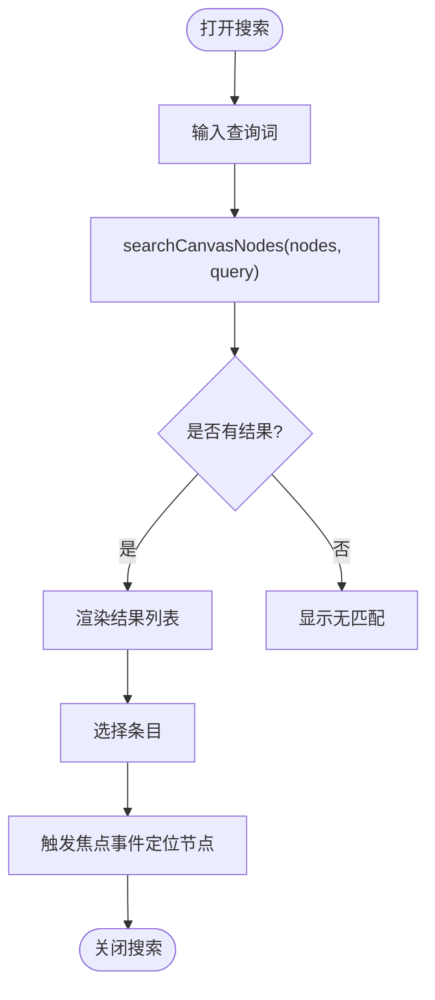
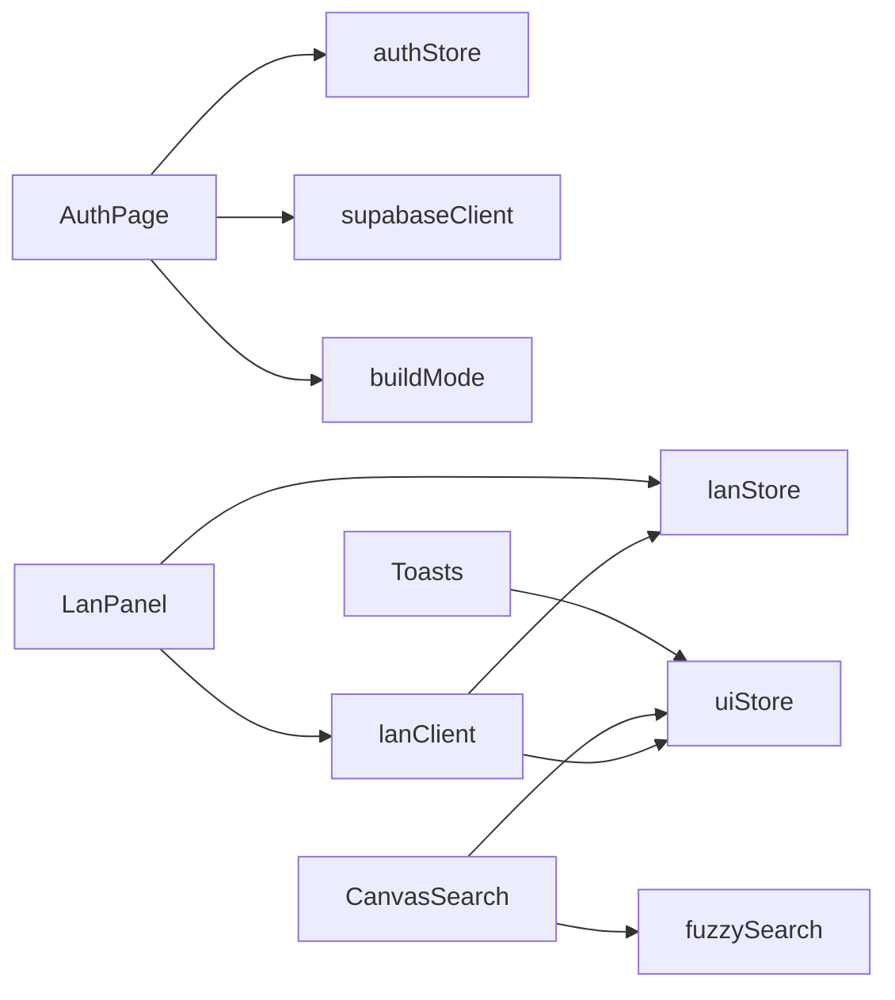

# 辅助组件

<cite>
**本文引用的文件**
- [AuthPage.tsx](file://src/components/AuthPage.tsx)
- [LanPanel.tsx](file://src/components/LanPanel.tsx)
- [Toasts.tsx](file://src/components/Toasts.tsx)
- [CanvasSearch.tsx](file://src/components/CanvasSearch.tsx)
- [authStore.ts](file://src/store/authStore.ts)
- [lanStore.ts](file://src/store/lanStore.ts)
- [uiStore.ts](file://src/store/uiStore.ts)
- [supabaseClient.ts](file://src/sync/supabaseClient.ts)
- [lanClient.ts](file://src/sync/lanClient.ts)
- [fuzzySearch.ts](file://src/search/fuzzySearch.ts)
- [buildMode.ts](file://src/buildMode.ts)
</cite>

## 目录
1. [简介](#简介)
2. [项目结构](#项目结构)
3. [核心组件](#核心组件)
4. [架构总览](#架构总览)
5. [详细组件分析](#详细组件分析)
6. [依赖关系分析](#依赖关系分析)
7. [性能与体验优化](#性能与体验优化)
8. [故障排查指南](#故障排查指南)
9. [结论](#结论)
10. [附录：配置与使用示例](#附录配置与使用示例)

## 简介
本章节聚焦四个辅助组件的实现与协作方式：认证页面（AuthPage）、局域网面板（LanPanel）、通知系统（Toasts）、画布搜索（CanvasSearch）。文档将深入说明各组件的状态管理、事件通信、错误处理、用户体验优化，并给出可操作的自定义配置与使用建议。

## 项目结构
这些组件位于 src/components 下，状态集中在 store 目录，网络与同步逻辑在 sync 目录，搜索算法在 search 目录。构建模式通过 buildMode.ts 控制不同产物分支（局域网版/在线版），从而决定登录流程与默认连接策略。

图表来源
- [AuthPage.tsx:1-238](file://src/components/AuthPage.tsx#L1-L238)
- [LanPanel.tsx:1-199](file://src/components/LanPanel.tsx#L1-L199)
- [Toasts.tsx:1-24](file://src/components/Toasts.tsx#L1-L24)
- [CanvasSearch.tsx:1-198](file://src/components/CanvasSearch.tsx#L1-L198)
- [authStore.ts:1-104](file://src/store/authStore.ts#L1-L104)
- [lanStore.ts:1-160](file://src/store/lanStore.ts#L1-L160)
- [uiStore.ts:1-121](file://src/store/uiStore.ts#L1-L121)
- [supabaseClient.ts:1-18](file://src/sync/supabaseClient.ts#L1-L18)
- [lanClient.ts:1-800](file://src/sync/lanClient.ts#L1-L800)
- [fuzzySearch.ts:1-67](file://src/search/fuzzySearch.ts#L1-L67)
- [buildMode.ts:1-8](file://src/buildMode.ts#L1-L8)

章节来源
- [buildMode.ts:1-8](file://src/buildMode.ts#L1-L8)

## 核心组件
- 认证页面（AuthPage）：根据构建目标切换“局域网协作入口”或“Supabase 登录/游客模式”，负责表单校验、错误提示、进入协作或本地会话。
- 局域网面板（LanPanel）：提供中继地址输入、连接/断开、用户列表、跟随视口、编辑状态与活动日志展示。
- 通知系统（Toasts）：全局消息提示，支持自动消失与手动关闭，用于连接状态、错误与成功反馈。
- 画布搜索（CanvasSearch）：支持 Ctrl+F 快捷打开、模糊匹配、结果高亮定位、按类型过滤显示，快速跳转到节点。

章节来源
- [AuthPage.tsx:1-238](file://src/components/AuthPage.tsx#L1-L238)
- [LanPanel.tsx:1-199](file://src/components/LanPanel.tsx#L1-L199)
- [Toasts.tsx:1-24](file://src/components/Toasts.tsx#L1-L24)
- [CanvasSearch.tsx:1-198](file://src/components/CanvasSearch.tsx#L1-L198)

## 架构总览
以下序列图展示了关键交互流程：认证登录、局域网连接、通知推送、画布搜索定位。

图表来源
- [AuthPage.tsx:61-73](file://src/components/AuthPage.tsx#L61-L73)
- [authStore.ts:84-88](file://src/store/authStore.ts#L84-L88)
- [supabaseClient.ts:1-18](file://src/sync/supabaseClient.ts#L1-L18)
- [LanPanel.tsx:41-50](file://src/components/LanPanel.tsx#L41-L50)
- [lanClient.ts:254-362](file://src/sync/lanClient.ts#L254-L362)
- [uiStore.ts:51-55](file://src/store/uiStore.ts#L51-L55)
- [CanvasSearch.tsx:47-60](file://src/components/CanvasSearch.tsx#L47-L60)
- [fuzzySearch.ts:41-65](file://src/search/fuzzySearch.ts#L41-L65)

## 详细组件分析

### 认证页面（AuthPage）
- 构建分支：当为局域网构建时，渲染“连接局域网协作主机”表单；否则渲染“邮箱+密码”登录与游客模式入口。
- Supabase 集成：检查是否配置了云端环境变量，未配置则直接提示无法登录；调用 authStore 的 signIn 完成登录。
- 表单验证与错误处理：必填字段校验、busy 防重复提交、错误信息统一在 UI 中展示。
- 局域网协作入口：在局域网构建模式下，收集中继地址与协作名称，调用 lanConnect 建立连接，等待 lanStore 状态变为 connected 后进入游客模式。
- 游客模式：enterGuest 写入本地标记并重置项目/画布状态，避免数据串写。

图表来源
- [AuthPage.tsx:75-130](file://src/components/AuthPage.tsx#L75-L130)
- [AuthPage.tsx:132-238](file://src/components/AuthPage.tsx#L132-L238)
- [authStore.ts:49-102](file://src/store/authStore.ts#L49-L102)
- [supabaseClient.ts:15-17](file://src/sync/supabaseClient.ts#L15-L17)
- [buildMode.ts:1-8](file://src/buildMode.ts#L1-L8)

章节来源
- [AuthPage.tsx:1-238](file://src/components/AuthPage.tsx#L1-L238)
- [authStore.ts:1-104](file://src/store/authStore.ts#L1-L104)
- [supabaseClient.ts:1-18](file://src/sync/supabaseClient.ts#L1-L18)
- [buildMode.ts:1-8](file://src/buildMode.ts#L1-L8)

### 局域网面板（LanPanel）
- 连接管理：支持输入中继地址与昵称，连接成功后按钮切换为“断开连接”；提供“重新连接”快捷操作，读取上次保存的配置。
- 用户列表与状态：显示当前项目协作者数量、自身与其他用户头像颜色、IP 信息；支持“跟随”某用户视口。
- 编辑状态与活动日志：展示其他成员正在编辑的节点与最近活动记录（创建、删除、移动、编辑等），便于协作感知。
- 持久化与自动重连：保存 url/name 到本地存储，刷新后可自动尝试重连；断线自动重试并提示。

图表来源
- [LanPanel.tsx:17-59](file://src/components/LanPanel.tsx#L17-L59)
- [lanStore.ts:53-89](file://src/store/lanStore.ts#L53-L89)
- [lanClient.ts:254-396](file://src/sync/lanClient.ts#L254-L396)

章节来源
- [LanPanel.tsx:1-199](file://src/components/LanPanel.tsx#L1-L199)
- [lanStore.ts:1-160](file://src/store/lanStore.ts#L1-L160)
- [lanClient.ts:1-800](file://src/sync/lanClient.ts#L1-L800)

### 通知系统（Toasts）
- 消息队列：uiStore 维护 toasts 数组，pushToast 自动添加并在 3.2 秒后移除。
- 展示与交互：Toasts 组件渲染固定底部居中列表，点击任意通知即可立即移除。
- 类型支持：info/error/success 三类，样式由 CSS 类名区分（如 sq-toast-info 等）。
- 使用场景：连接成功/失败、错误提示、操作反馈等。

图表来源
- [uiStore.ts:47-58](file://src/store/uiStore.ts#L47-L58)
- [Toasts.tsx:1-24](file://src/components/Toasts.tsx#L1-L24)

章节来源
- [uiStore.ts:1-121](file://src/store/uiStore.ts#L1-L121)
- [Toasts.tsx:1-24](file://src/components/Toasts.tsx#L1-L24)

### 画布搜索（CanvasSearch）
- 快捷键与展开：Ctrl/Cmd+F 打开搜索框并自动聚焦；支持 Escape 关闭。
- 模糊搜索：基于 fuzzySearch 对节点的 label/text/kind/mime/createdByName 进行多词匹配与评分排序，限制最大结果数。
- 定位跳转：选择结果后通过自定义事件触发画布聚焦到对应节点。
- 位置计算与可见性：下拉菜单通过 createPortal 挂载到 body，监听滚动/调整窗口大小动态计算位置，点击外部区域关闭。

图表来源
- [CanvasSearch.tsx:32-103](file://src/components/CanvasSearch.tsx#L32-L103)
- [CanvasSearch.tsx:105-198](file://src/components/CanvasSearch.tsx#L105-L198)
- [fuzzySearch.ts:1-67](file://src/search/fuzzySearch.ts#L1-L67)

章节来源
- [CanvasSearch.tsx:1-198](file://src/components/CanvasSearch.tsx#L1-L198)
- [fuzzySearch.ts:1-67](file://src/search/fuzzySearch.ts#L1-L67)

## 依赖关系分析
- AuthPage 依赖 authStore 与 supabaseClient，并根据 buildMode 决定渲染分支。
- LanPanel 依赖 lanStore 与 lanClient，读取本地配置并驱动连接生命周期。
- Toasts 仅依赖 uiStore，作为纯展示层。
- CanvasSearch 依赖 fuzzySearch 与 canvasStore（通过 useCanvasStore 获取节点），并通过自定义事件与画布交互。
- lanClient 内部广泛使用 lanStore 与 uiStore，实现状态同步、活动广播与通知。

图表来源
- [AuthPage.tsx:1-238](file://src/components/AuthPage.tsx#L1-L238)
- [LanPanel.tsx:1-199](file://src/components/LanPanel.tsx#L1-L199)
- [Toasts.tsx:1-24](file://src/components/Toasts.tsx#L1-L24)
- [CanvasSearch.tsx:1-198](file://src/components/CanvasSearch.tsx#L1-L198)
- [authStore.ts:1-104](file://src/store/authStore.ts#L1-L104)
- [lanStore.ts:1-160](file://src/store/lanStore.ts#L1-L160)
- [uiStore.ts:1-121](file://src/store/uiStore.ts#L1-L121)
- [supabaseClient.ts:1-18](file://src/sync/supabaseClient.ts#L1-L18)
- [lanClient.ts:1-800](file://src/sync/lanClient.ts#L1-L800)
- [fuzzySearch.ts:1-67](file://src/search/fuzzySearch.ts#L1-L67)
- [buildMode.ts:1-8](file://src/buildMode.ts#L1-L8)

章节来源
- [lanClient.ts:1-800](file://src/sync/lanClient.ts#L1-L800)

## 性能与体验优化
- 连接与重连：lanClient 采用指数退避自动重连，减少频繁重试带来的资源消耗；断线后保留分片以便续传大文件。
- 批量同步与去抖：画布变更通过定时器合并发送，避免高频同步造成带宽压力；活动广播也进行合并，防止刷屏。
- 墓碑机制：显式删除传播配合墓碑时间窗，避免晚到快照误复活已删除节点，提升一致性。
- 素材传输：分片传输与空闲超时保护，HTTP Range 流式拉取视频，降低内存占用与下载耗时。
- 搜索性能：模糊评分与多词匹配，限制结果上限，保证响应速度。
- 用户体验：Toasts 自动消失与手动关闭；搜索框键盘导航与滚动定位；连接状态可视化指示。

[本节为通用性能讨论，不直接分析具体文件]

## 故障排查指南
- 登录失败
  - 现象：提示“邮箱或密码错误”、“邮箱尚未验证”、“该账号无权登录”、“操作过于频繁”。
  - 可能原因：凭据错误、邮箱未确认、权限限制、频率限制。
  - 处理：核对凭据、检查邮箱验证邮件、联系管理员、稍后再试。
  - 参考路径
    - [authStore.ts:18-25](file://src/store/authStore.ts#L18-L25)
    - [authStore.ts:84-88](file://src/store/authStore.ts#L84-L88)

- 未配置 Supabase
  - 现象：提示“未配置 Supabase 环境变量，无法登录”。
  - 处理：部署时设置 VITE_SUPABASE_URL 与 VITE_SUPABASE_ANON_KEY。
  - 参考路径
    - [supabaseClient.ts:4-13](file://src/sync/supabaseClient.ts#L4-L13)
    - [AuthPage.tsx:65-68](file://src/components/AuthPage.tsx#L65-L68)

- 局域网连接失败
  - 现象：提示“无法连接局域网中继，请检查地址和反向代理配置”或“连接失败，请检查局域网地址和中继服务”。
  - 处理：确认 ws/wss 协议正确、HTTPS 页面需 wss、宝塔反代路径 /lan-ws、端口可达。
  - 参考路径
    - [lanClient.ts:19-45](file://src/sync/lanClient.ts#L19-L45)
    - [lanClient.ts:345-350](file://src/sync/lanClient.ts#L345-L350)
    - [AuthPage.tsx:24-35](file://src/components/AuthPage.tsx#L24-L35)

- 自动重连异常
  - 现象：断线后未恢复或反复失败。
  - 处理：检查网络、服务器状态、localStorage 保存配置是否正确；查看 toast 提示。
  - 参考路径
    - [lanClient.ts:119-152](file://src/sync/lanClient.ts#L119-L152)
    - [lanClient.ts:321-343](file://src/sync/lanClient.ts#L321-L343)

- 搜索无结果
  - 现象：输入关键词后无匹配。
  - 处理：检查节点 label/text/kind/mime/createdByName 是否包含关键词；尝试更短或更通用的词。
  - 参考路径
    - [fuzzySearch.ts:31-65](file://src/search/fuzzySearch.ts#L31-L65)

章节来源
- [authStore.ts:18-25](file://src/store/authStore.ts#L18-L25)
- [authStore.ts:84-88](file://src/store/authStore.ts#L84-L88)
- [supabaseClient.ts:4-13](file://src/sync/supabaseClient.ts#L4-L13)
- [AuthPage.tsx:65-68](file://src/components/AuthPage.tsx#L65-L68)
- [lanClient.ts:19-45](file://src/sync/lanClient.ts#L19-L45)
- [lanClient.ts:345-350](file://src/sync/lanClient.ts#L345-L350)
- [AuthPage.tsx:24-35](file://src/components/AuthPage.tsx#L24-L35)
- [lanClient.ts:119-152](file://src/sync/lanClient.ts#L119-L152)
- [lanClient.ts:321-343](file://src/sync/lanClient.ts#L321-L343)
- [fuzzySearch.ts:31-65](file://src/search/fuzzySearch.ts#L31-L65)

## 结论
四个辅助组件围绕“认证—协作—通知—搜索”形成完整闭环：AuthPage 负责身份与会话入口，LanPanel 提供协作连接与实时状态，Toasts 贯穿全链路反馈，CanvasSearch 提升画布内检索效率。通过 zustand 状态管理与清晰的模块边界，组件间耦合度低、扩展性强，适合在不同构建目标下灵活复用。

[本节为总结性内容，不直接分析具体文件]

## 附录：配置与使用示例
- 构建目标与环境变量
  - 局域网构建：设置 VITE_BUILD_TARGET=lan，默认中继地址可通过 VITE_LAN_WS_URL 覆盖。
  - 在线构建：设置 VITE_SUPABASE_URL 与 VITE_SUPABASE_ANON_KEY 以启用 Supabase 登录。
  - 参考路径
    - [buildMode.ts:1-8](file://src/buildMode.ts#L1-L8)
    - [supabaseClient.ts:4-13](file://src/sync/supabaseClient.ts#L4-L13)
    - [lanClient.ts:47-57](file://src/sync/lanClient.ts#L47-L57)

- 自定义通知样式
  - 通过 CSS 类名 sq-toast、sq-toast-info、sq-toast-error、sq-toast-success 定制外观。
  - 参考路径
    - [uiStore.ts:10-16](file://src/store/uiStore.ts#L10-L16)
    - [Toasts.tsx:10-20](file://src/components/Toasts.tsx#L10-L20)

- 自定义搜索行为
  - 修改 fuzzySearch 的评分规则或 searchableFields 以适配更多字段。
  - 调整 MAX_RESULTS 控制结果数量。
  - 参考路径
    - [fuzzySearch.ts:1-67](file://src/search/fuzzySearch.ts#L1-L67)
    - [CanvasSearch.tsx:22-45](file://src/components/CanvasSearch.tsx#L22-L45)

- 局域网协作配置
  - 首次连接后自动保存 url/name，下次可直接“重新连接”。
  - 若使用宝塔反向代理，默认走同域名 /lan-ws；直连局域网可使用 ws://IP:8790。
  - 参考路径
    - [lanClient.ts:290-311](file://src/sync/lanClient.ts#L290-L311)
    - [LanPanel.tsx:188-193](file://src/components/LanPanel.tsx#L188-L193)

章节来源
- [buildMode.ts:1-8](file://src/buildMode.ts#L1-L8)
- [supabaseClient.ts:4-13](file://src/sync/supabaseClient.ts#L4-L13)
- [lanClient.ts:47-57](file://src/sync/lanClient.ts#L47-L57)
- [uiStore.ts:10-16](file://src/store/uiStore.ts#L10-L16)
- [Toasts.tsx:10-20](file://src/components/Toasts.tsx#L10-L20)
- [fuzzySearch.ts:1-67](file://src/search/fuzzySearch.ts#L1-L67)
- [CanvasSearch.tsx:22-45](file://src/components/CanvasSearch.tsx#L22-L45)
- [lanClient.ts:290-311](file://src/sync/lanClient.ts#L290-L311)
- [LanPanel.tsx:188-193](file://src/components/LanPanel.tsx#L188-L193)