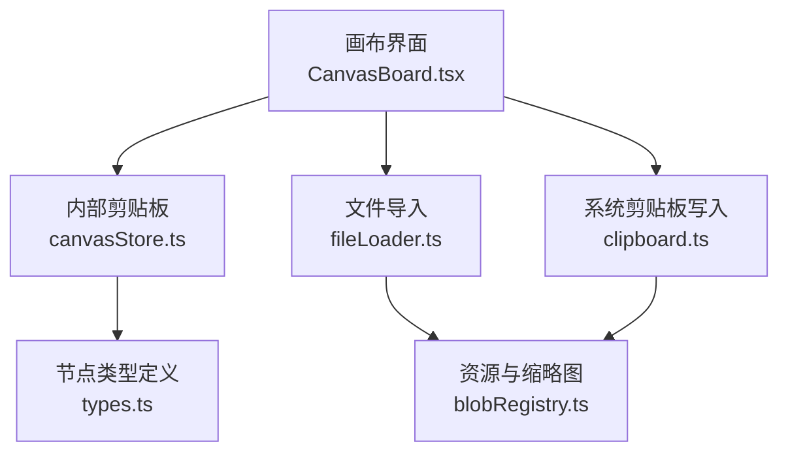
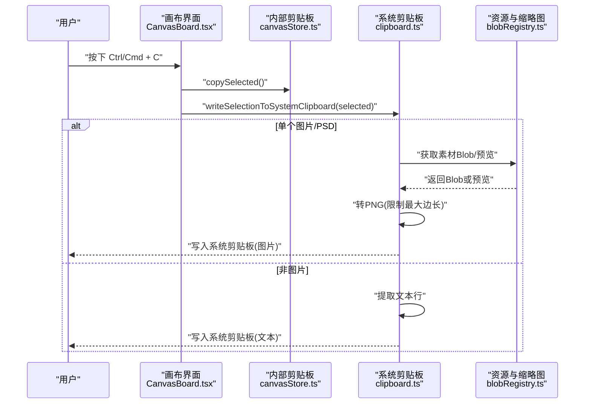
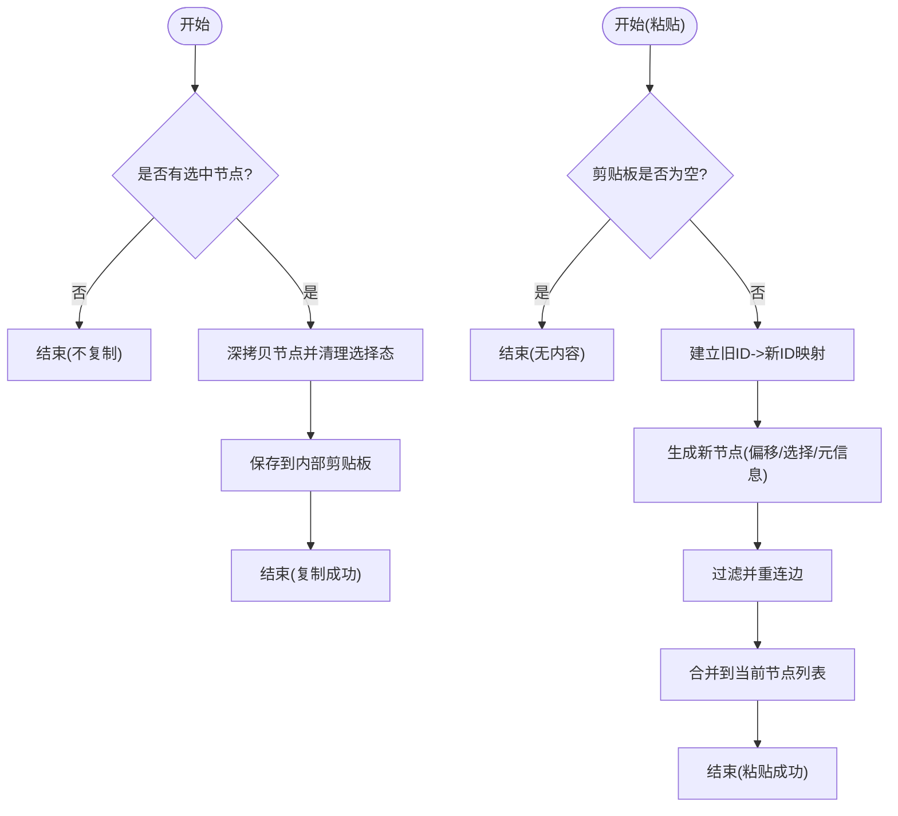
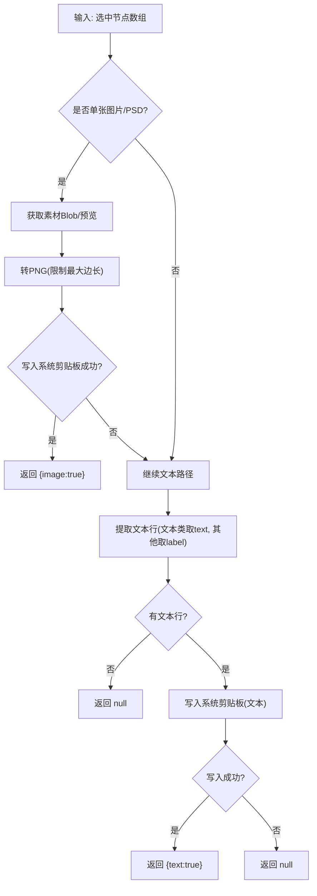
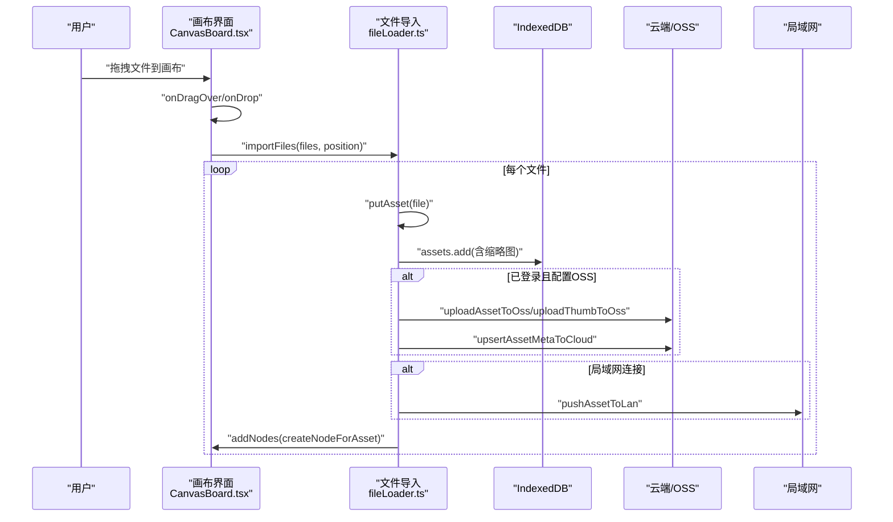
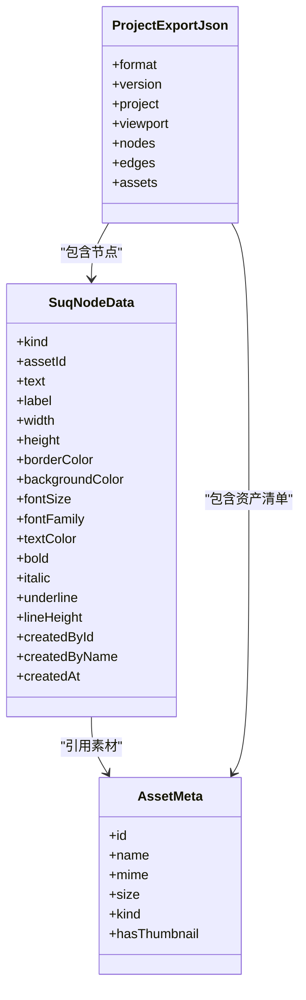
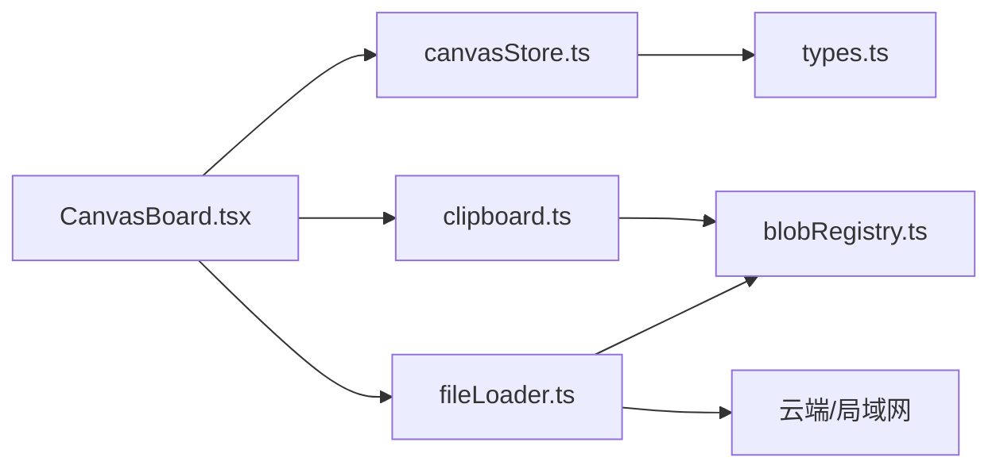

# 剪贴板操作

<cite>
**本文引用的文件**
- [clipboard.ts](file://src/canvas/clipboard.ts)
- [CanvasBoard.tsx](file://src/canvas/CanvasBoard.tsx)
- [canvasStore.ts](file://src/store/canvasStore.ts)
- [types.ts](file://src/types.ts)
- [fileLoader.ts](file://src/io/fileLoader.ts)
- [importExport.ts](file://src/io/importExport.ts)
- [blobRegistry.ts](file://src/media/blobRegistry.ts)
- [clipboard.test.ts](file://src/canvas/clipboard.test.ts)
</cite>

## 目录
1. [简介](#简介)
2. [项目结构](#项目结构)
3. [核心组件](#核心组件)
4. [架构总览](#架构总览)
5. [详细组件分析](#详细组件分析)
6. [依赖关系分析](#依赖关系分析)
7. [性能考量](#性能考量)
8. [故障排查指南](#故障排查指南)
9. [结论](#结论)
10. [附录：使用示例与最佳实践](#附录使用示例与最佳实践)

## 简介
本技术文档围绕画布应用的“剪贴板操作”进行系统化说明，覆盖系统剪贴板与内部剪贴板的区别、复制粘贴流程、拖拽上传、数据序列化/反序列化、格式转换、跨浏览器兼容策略、错误处理与用户体验优化建议。目标是帮助开发者快速理解并正确使用剪贴板能力，同时为后续扩展提供清晰的参考。

## 项目结构
与剪贴板相关的代码主要分布在以下模块：
- 画布交互层：负责快捷键监听、拖拽事件、调用内部剪贴板与系统剪贴板写入
- 内部剪贴板：基于状态管理保存选中节点副本，支持复制/粘贴及连线重连
- 系统剪贴板：将选中的图片/PSD转换为 PNG 写入系统剪贴板，或将文本内容写入系统剪贴板
- 资源与导入：文件拖拽/粘贴导入、素材元数据生成、缩略图生成与缓存
- 类型定义：统一节点数据类型与媒体种类

**图示来源**
- [CanvasBoard.tsx:127-135](file://src/canvas/CanvasBoard.tsx#L127-L135)
- [canvasStore.ts:205-243](file://src/store/canvasStore.ts#L205-L243)
- [clipboard.ts:114-131](file://src/canvas/clipboard.ts#L114-L131)
- [fileLoader.ts:186-205](file://src/io/fileLoader.ts#L186-L205)
- [blobRegistry.ts:107-126](file://src/media/blobRegistry.ts#L107-L126)

**章节来源**
- [CanvasBoard.tsx:127-135](file://src/canvas/CanvasBoard.tsx#L127-L135)
- [canvasStore.ts:205-243](file://src/store/canvasStore.ts#L205-L243)
- [clipboard.ts:114-131](file://src/canvas/clipboard.ts#L114-L131)
- [fileLoader.ts:186-205](file://src/io/fileLoader.ts#L186-L205)
- [blobRegistry.ts:107-126](file://src/media/blobRegistry.ts#L107-L126)

## 核心组件
- 内部剪贴板（canvasStore）
  - 职责：维护 clipboard 字段，实现 copySelected/pasteClipboard，复制时深拷贝节点并重置选择态；粘贴时重新分配 ID、偏移位置、更新创建信息，并重连被复制节点之间的边。
  - 关键点：structuredClone 保证数据隔离；插入元信息包含创建者、时间等。
- 系统剪贴板（clipboard.ts）
  - 职责：将选中的单个图片/PSD转为 PNG 写入系统剪贴板；否则提取文本行写入系统剪贴板；提供 HTML 与文本提取工具函数。
  - 关键点：优先使用现代 Clipboard API，失败回退到 execCommand；PSD 需先生成预览再转 PNG；图片尺寸限制与 Canvas 编码。
- 画布交互（CanvasBoard.tsx）
  - 职责：监听 Ctrl/Cmd + C/V/A 等快捷键；在复制时调用内部剪贴板与系统剪贴板；处理拖拽与粘贴文件导入；双击空白处添加文本节点。
- 文件导入（fileLoader.ts）
  - 职责：putAsset 存储文件与缩略图；createNodeForAsset 根据素材类型创建节点；importFiles 批量导入并落库。
- 类型定义（types.ts）
  - 职责：统一 MediaKind、SuqNodeData、SuqEdgeData 等类型，确保剪贴板与导入导出的一致性。

**章节来源**
- [canvasStore.ts:205-243](file://src/store/canvasStore.ts#L205-L243)
- [clipboard.ts:8-22](file://src/canvas/clipboard.ts#L8-L22)
- [clipboard.ts:24-70](file://src/canvas/clipboard.ts#L24-L70)
- [clipboard.ts:90-131](file://src/canvas/clipboard.ts#L90-L131)
- [CanvasBoard.tsx:127-135](file://src/canvas/CanvasBoard.tsx#L127-L135)
- [fileLoader.ts:77-117](file://src/io/fileLoader.ts#L77-L117)
- [fileLoader.ts:165-205](file://src/io/fileLoader.ts#L165-L205)
- [types.ts:66-107](file://src/types.ts#L66-L107)

## 架构总览
剪贴板功能由“内部剪贴板 + 系统剪贴板 + 导入导出”三部分协同完成：
- 内部剪贴板：用于应用内复制/粘贴，保持节点与边的拓扑关系，支持多次粘贴与撤销/重做历史。
- 系统剪贴板：用于跨应用共享，图片类节点输出 PNG，其他节点输出纯文本。
- 导入导出：项目级序列化/反序列化，支持版本校验与云端/局域网同步。

**图示来源**
- [CanvasBoard.tsx:127-135](file://src/canvas/CanvasBoard.tsx#L127-L135)
- [canvasStore.ts:205-213](file://src/store/canvasStore.ts#L205-L213)
- [clipboard.ts:114-131](file://src/canvas/clipboard.ts#L114-L131)
- [blobRegistry.ts:107-126](file://src/media/blobRegistry.ts#L107-L126)

## 详细组件分析

### 内部剪贴板：复制与粘贴
- 复制逻辑
  - 收集选中节点，深拷贝并清除 selected/dragging 标志，存入 store.clipboard。
  - 通过 structuredClone 避免引用污染。
- 粘贴逻辑
  - 为新节点分配新 ID，整体偏移（x+28, y+28），设置 selected=true，注入创建元信息。
  - 对边进行重映射：仅当源与目标均在被复制集合中时才复制边，并更新 source/target 到新 ID。
  - 合并到现有 nodes，保留原有节点的选择态。

**图示来源**
- [canvasStore.ts:205-243](file://src/store/canvasStore.ts#L205-L243)

**章节来源**
- [canvasStore.ts:205-243](file://src/store/canvasStore.ts#L205-L243)

### 系统剪贴板：图片与文本写入
- 图片路径
  - 若选中节点为 image/psd 且数量为 1，则尝试获取素材 Blob 或 PSD 预览，转换为 PNG（最大边长限制），写入系统剪贴板。
  - 使用 navigator.clipboard.write 的 ClipboardItem 接口，不支持时直接返回失败。
- 文本路径
  - 对文本类节点（text/heading/sticky/shape）取 text，其他节点取 label，过滤空行后拼接为多行文本写入系统剪贴板。
  - 优先使用 navigator.clipboard.writeText，失败回退到 document.execCommand('copy')。
- HTML 辅助
  - selectionHtml 将文本行转义后包裹为 div 结构，便于富文本粘贴场景。

**图示来源**
- [clipboard.ts:24-70](file://src/canvas/clipboard.ts#L24-L70)
- [clipboard.ts:90-131](file://src/canvas/clipboard.ts#L90-L131)

**章节来源**
- [clipboard.ts:8-22](file://src/canvas/clipboard.ts#L8-L22)
- [clipboard.ts:24-70](file://src/canvas/clipboard.ts#L24-L70)
- [clipboard.ts:90-131](file://src/canvas/clipboard.ts#L90-L131)

### 拖拽上传与粘贴导入
- 拖拽检测
  - onDragOver：检测 dataTransfer.types 包含 Files，阻止默认行为并设置 dropEffect=copy，显示拖拽提示。
  - onDragLeave：离开区域时隐藏提示。
  - onDrop：读取 files，计算放置位置（screenToFlowPosition），调用 importFiles。
- 粘贴导入
  - window paste 事件：若存在文件且不在输入框/可编辑元素中，则在画布中心位置导入。
- 导入流程
  - putAsset：识别文件类型、生成缩略图（视频/PSD）、持久化到 IndexedDB、可选推送至局域网/云端。
  - createNodeForAsset：根据 kind 设置默认宽高与边框样式。
  - importFiles：逐个导入，超过大小阈值跳过，失败 toast 提示。

**图示来源**
- [CanvasBoard.tsx:210-232](file://src/canvas/CanvasBoard.tsx#L210-L232)
- [CanvasBoard.tsx:307-323](file://src/canvas/CanvasBoard.tsx#L307-L323)
- [fileLoader.ts:77-117](file://src/io/fileLoader.ts#L77-L117)
- [fileLoader.ts:165-205](file://src/io/fileLoader.ts#L165-L205)

**章节来源**
- [CanvasBoard.tsx:210-232](file://src/canvas/CanvasBoard.tsx#L210-L232)
- [CanvasBoard.tsx:307-323](file://src/canvas/CanvasBoard.tsx#L307-L323)
- [fileLoader.ts:77-117](file://src/io/fileLoader.ts#L77-L117)
- [fileLoader.ts:165-205](file://src/io/fileLoader.ts#L165-L205)

### 数据模型与版本兼容性
- 节点数据模型
  - SuqNodeData 包含 kind、assetId、text、label、尺寸、样式、字体、颜色、创建信息等字段，支撑不同节点类型的属性映射。
- 项目导出/导入
  - 导出：收集节点/边/视口与资产元数据，打包为 ZIP 的 .sqcanvas 文件，包含 project.json 与 assets/*.bin/.thumb。
  - 导入：解压、校验 format/version、解析 JSON、恢复 assets 到本地数据库、按权限同步到云端/局域网，加载项目并保存。
- 版本兼容
  - 导入时检查 json.version <= VERSION，防止高版本项目无法打开。

**图示来源**
- [types.ts:66-107](file://src/types.ts#L66-L107)
- [importExport.ts:25-33](file://src/io/importExport.ts#L25-L33)
- [importExport.ts:35-78](file://src/io/importExport.ts#L35-L78)
- [importExport.ts:111-149](file://src/io/importExport.ts#L111-L149)

**章节来源**
- [types.ts:66-107](file://src/types.ts#L66-L107)
- [importExport.ts:25-33](file://src/io/importExport.ts#L25-L33)
- [importExport.ts:35-78](file://src/io/importExport.ts#L35-L78)
- [importExport.ts:111-149](file://src/io/importExport.ts#L111-L149)

### 跨浏览器兼容性处理
- 系统剪贴板
  - 文本：navigator.clipboard.writeText 失败时回退到 document.execCommand('copy')。
  - 图片：ClipboardItem 不存在时直接返回失败；支持时写入 image/png。
- 资源与缩略图
  - 视频封面抓取考虑跨域与同源限制，必要时拉取全量 blob 兜底；并发抓帧限流避免阻塞播放。
- 拖拽/粘贴
  - 通过 dataTransfer.types 判断文件类型；在输入框/可编辑元素中忽略粘贴，避免干扰文本编辑。

**章节来源**
- [clipboard.ts:90-107](file://src/canvas/clipboard.ts#L90-L107)
- [blobRegistry.ts:128-239](file://src/media/blobRegistry.ts#L128-L239)
- [CanvasBoard.tsx:307-323](file://src/canvas/CanvasBoard.tsx#L307-L323)

## 依赖关系分析
- 画布界面依赖内部剪贴板与系统剪贴板写入，以及文件导入模块。
- 内部剪贴板依赖类型定义与局域网用户信息以注入创建元信息。
- 系统剪贴板依赖资源与缩略图模块获取素材 Blob/预览。
- 导入模块依赖数据库、局域网与云端同步能力。

**图示来源**
- [CanvasBoard.tsx:127-135](file://src/canvas/CanvasBoard.tsx#L127-L135)
- [canvasStore.ts:205-243](file://src/store/canvasStore.ts#L205-L243)
- [clipboard.ts:114-131](file://src/canvas/clipboard.ts#L114-L131)
- [fileLoader.ts:77-117](file://src/io/fileLoader.ts#L77-L117)
- [blobRegistry.ts:107-126](file://src/media/blobRegistry.ts#L107-L126)

**章节来源**
- [CanvasBoard.tsx:127-135](file://src/canvas/CanvasBoard.tsx#L127-L135)
- [canvasStore.ts:205-243](file://src/store/canvasStore.ts#L205-L243)
- [clipboard.ts:114-131](file://src/canvas/clipboard.ts#L114-L131)
- [fileLoader.ts:77-117](file://src/io/fileLoader.ts#L77-L117)
- [blobRegistry.ts:107-126](file://src/media/blobRegistry.ts#L107-L126)

## 性能考量
- 图片转 PNG：限制最大边长为 4096，避免超大图导致内存与编码耗时过高。
- 缩略图抓取：并发上限为 2，队列等待，避免同一主机连接池占满影响播放。
- 资源访问：优先使用本地 blob URL 或 HTTP 流式地址，减少整份下载；URL 缓存与失效机制降低重复开销。
- 导入大文件：超过 1.5GB 直接跳过，避免卡顿与存储压力。

[本节为通用性能讨论，无需具体文件分析]

## 故障排查指南
- 复制失败
  - 图片复制：检查 ClipboardItem 是否存在；确认素材 Blob/预览可用；查看图片解码与 Canvas 编码异常。
  - 文本复制：确认文本行提取结果非空；检查 execCommand 回退是否生效。
- 导入失败
  - 文件过大：检查文件大小阈值提示。
  - 缩略图生成失败：视频/PSD 缩略图生成失败不影响主文件，但会提示错误；可重试或检查文件格式。
  - 云端/局域网同步失败：网络或权限问题，日志记录但不阻断导入。
- 粘贴导入未触发
  - 检查是否在输入框/可编辑元素中；确认 paste 事件未被其他逻辑拦截。

**章节来源**
- [clipboard.ts:90-131](file://src/canvas/clipboard.ts#L90-L131)
- [fileLoader.ts:77-117](file://src/io/fileLoader.ts#L77-L117)
- [fileLoader.ts:186-205](file://src/io/fileLoader.ts#L186-L205)
- [CanvasBoard.tsx:307-323](file://src/canvas/CanvasBoard.tsx#L307-L323)

## 结论
本项目实现了完善的剪贴板能力：内部剪贴板保障应用内复制粘贴与拓扑关系维护；系统剪贴板支持图片与文本跨应用共享；拖拽与粘贴导入提供便捷的文件接入方式；类型与版本控制确保数据一致性与兼容性。结合性能优化与错误处理，整体体验稳定可靠。

[本节为总结性内容，无需具体文件分析]

## 附录：使用示例与最佳实践
- 复制节点
  - 选中节点后按下 Ctrl/Cmd + C，内部剪贴板保存副本，系统剪贴板写入图片或文本。
  - 参考路径：[CanvasBoard.tsx:127-135](file://src/canvas/CanvasBoard.tsx#L127-L135)、[canvasStore.ts:205-213](file://src/store/canvasStore.ts#L205-L213)、[clipboard.ts:114-131](file://src/canvas/clipboard.ts#L114-L131)
- 粘贴到指定位置
  - 按下 Ctrl/Cmd + V，内部剪贴板粘贴并偏移位置；如需精确位置，可在业务层计算坐标后调用 addNodes。
  - 参考路径：[canvasStore.ts:214-243](file://src/store/canvasStore.ts#L214-L243)
- 处理不同类型的数据
  - 图片/PSD：自动转 PNG 写入系统剪贴板；文本类节点输出多行文本。
  - 参考路径：[clipboard.ts:24-70](file://src/canvas/clipboard.ts#L24-L70)、[clipboard.ts:90-131](file://src/canvas/clipboard.ts#L90-L131)
- 拖拽上传
  - 将文件拖入画布，自动在放置位置导入；支持批量导入与进度提示。
  - 参考路径：[CanvasBoard.tsx:210-232](file://src/canvas/CanvasBoard.tsx#L210-L232)、[fileLoader.ts:186-205](file://src/io/fileLoader.ts#L186-L205)
- 最佳实践
  - 在输入框/可编辑元素中忽略粘贴，避免干扰文本编辑。
  - 对超大文件进行阈值判断与友好提示。
  - 利用结构化克隆与 ID 映射确保数据一致性与拓扑正确性。
  - 关注跨域与同源限制，必要时采用 blob 兜底方案。

**章节来源**
- [CanvasBoard.tsx:210-232](file://src/canvas/CanvasBoard.tsx#L210-L232)
- [canvasStore.ts:205-243](file://src/store/canvasStore.ts#L205-L243)
- [clipboard.ts:24-70](file://src/canvas/clipboard.ts#L24-L70)
- [clipboard.ts:90-131](file://src/canvas/clipboard.ts#L90-L131)
- [fileLoader.ts:186-205](file://src/io/fileLoader.ts#L186-L205)