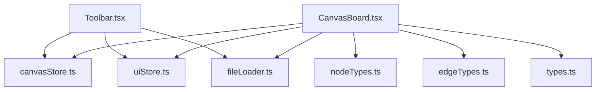
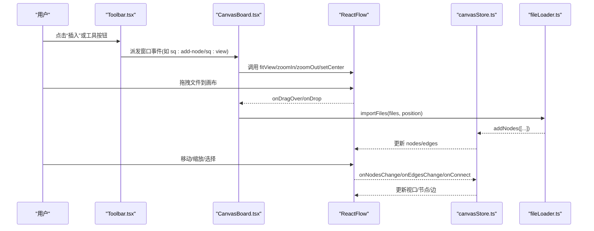
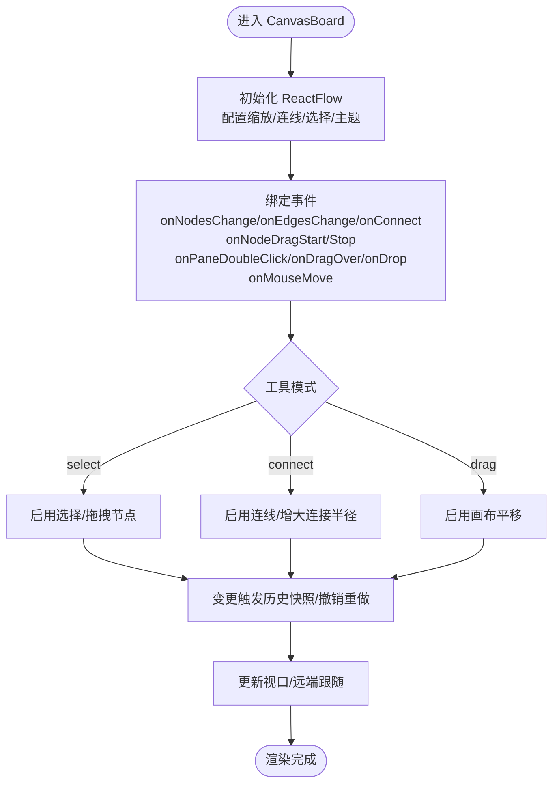
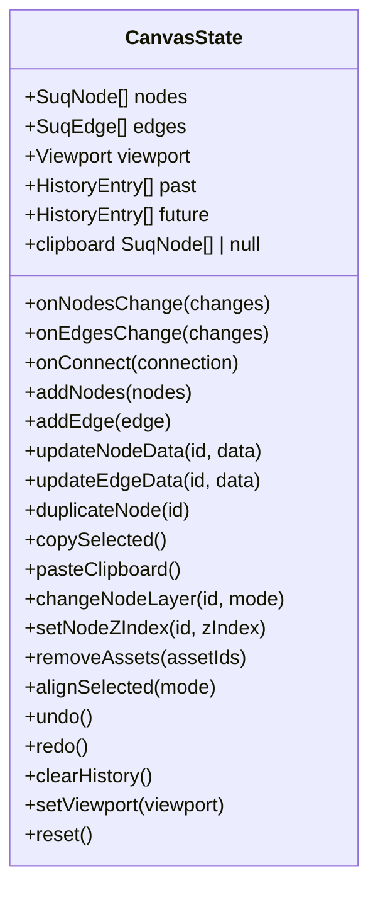
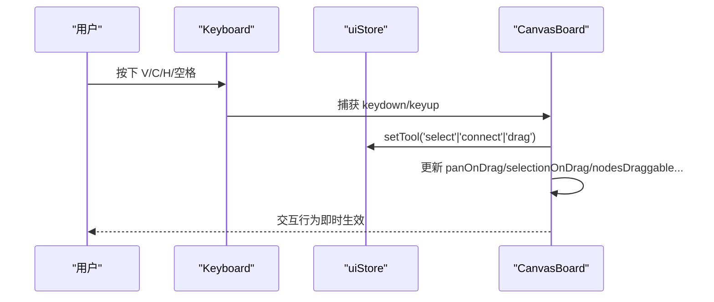
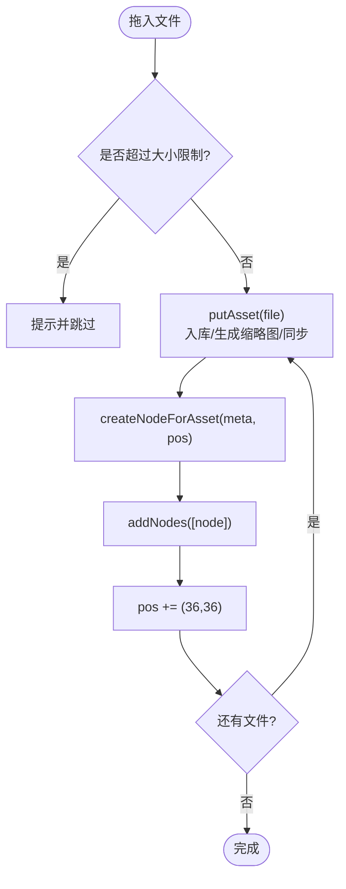
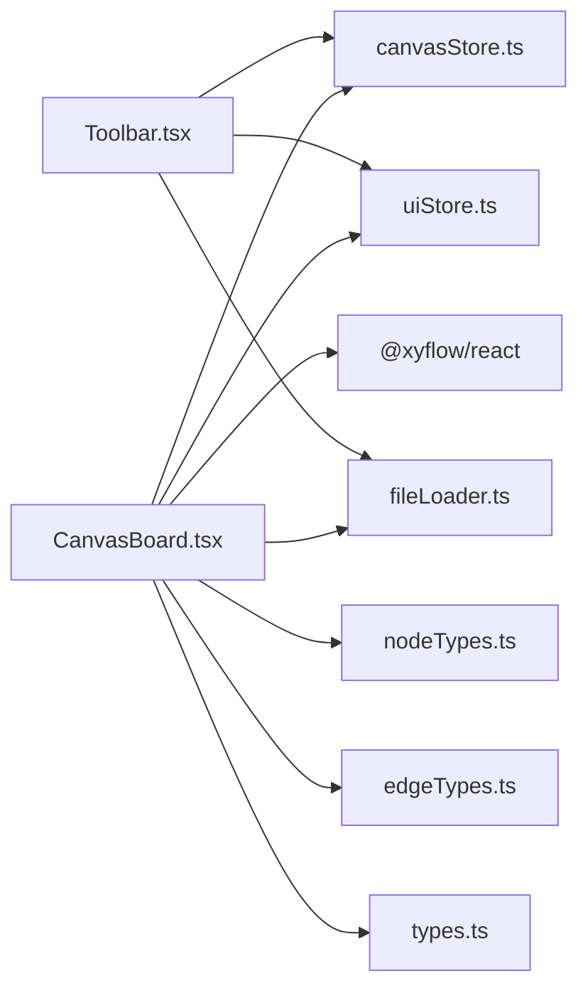

# 画布核心组件

<cite>
**本文引用的文件**
- [CanvasBoard.tsx](file://src/canvas/CanvasBoard.tsx)
- [canvasStore.ts](file://src/store/canvasStore.ts)
- [uiStore.ts](file://src/store/uiStore.ts)
- [Toolbar.tsx](file://src/components/Toolbar.tsx)
- [nodeTypes.ts](file://src/canvas/nodes/nodeTypes.ts)
- [edgeTypes.ts](file://src/canvas/edges/edgeTypes.ts)
- [fileLoader.ts](file://src/io/fileLoader.ts)
- [types.ts](file://src/types.ts)
</cite>

## 目录
1. [简介](#简介)
2. [项目结构](#项目结构)
3. [核心组件](#核心组件)
4. [架构总览](#架构总览)
5. [详细组件分析](#详细组件分析)
6. [依赖关系分析](#依赖关系分析)
7. [性能考量](#性能考量)
8. [故障排查指南](#故障排查指南)
9. [结论](#结论)
10. [附录：扩展示例与最佳实践](#附录：扩展示例与最佳实践)

## 简介
本技术文档聚焦于画布核心组件 CanvasBoard，基于 @xyflow/react 的 ReactFlow 构建，提供节点编辑、连线、视图操作（缩放、平移、框选）、工具模式切换（选择/连线/拖动）、键盘快捷键（撤销重做、复制粘贴、全选等）以及局域网协作光标同步等功能。文档从系统架构、数据流、事件处理、生命周期管理到性能优化进行系统化阐述，并给出可操作的扩展示例与最佳实践。

## 项目结构
画布核心由以下关键模块组成：
- 画布容器与交互：CanvasBoard 负责 ReactFlow 初始化、事件绑定、工具模式控制、主题与视口同步、拖拽导入、双击创建文本等。
- 状态管理：canvasStore 维护节点、边、视口、历史栈（撤销/重做）、剪贴板、对齐与层级等；uiStore 管理工具模式、导入队列、各类查看器开关等。
- 类型与渲染：types 定义节点/边数据结构；nodeTypes/edgeTypes 注册自定义节点与边渲染。
- 文件与素材：fileLoader 负责文件导入、缩略图生成、云端/局域网同步、节点工厂方法。
- 工具栏：Toolbar 提供插入元素、工具切换、对齐、缩放、主题切换等操作入口。

图表来源
- [CanvasBoard.tsx:1-459](file://src/canvas/CanvasBoard.tsx#L1-L459)
- [canvasStore.ts:1-399](file://src/store/canvasStore.ts#L1-L399)
- [uiStore.ts:1-121](file://src/store/uiStore.ts#L1-L121)
- [nodeTypes.ts:1-27](file://src/canvas/nodes/nodeTypes.ts#L1-L27)
- [edgeTypes.ts:1-7](file://src/canvas/edges/edgeTypes.ts#L1-L7)
- [fileLoader.ts:1-297](file://src/io/fileLoader.ts#L1-L297)
- [types.ts:1-112](file://src/types.ts#L1-L112)

章节来源
- [CanvasBoard.tsx:1-459](file://src/canvas/CanvasBoard.tsx#L1-L459)
- [canvasStore.ts:1-399](file://src/store/canvasStore.ts#L1-L399)
- [uiStore.ts:1-121](file://src/store/uiStore.ts#L1-L121)
- [Toolbar.tsx:1-403](file://src/components/Toolbar.tsx#L1-L403)
- [nodeTypes.ts:1-27](file://src/canvas/nodes/nodeTypes.ts#L1-L27)
- [edgeTypes.ts:1-7](file://src/canvas/edges/edgeTypes.ts#L1-L7)
- [fileLoader.ts:1-297](file://src/io/fileLoader.ts#L1-L297)
- [types.ts:1-112](file://src/types.ts#L1-L112)

## 核心组件
- CanvasBoard：ReactFlow 的承载与编排层，集中处理：
  - 初始化配置：最小/最大缩放、贝塞尔连线样式、选择模式、缩放/捏合、拖放、主题色等。
  - 事件处理：节点变化、边变化、连接、拖拽开始/结束、面板双击、拖入文件、鼠标移动上报光标等。
  - 工具模式：根据 uiStore.tool 动态启用/禁用选择、连线、拖动能力。
  - 视图同步：初始视口恢复、远端视口跟随、适应视图、缩放控制。
  - 快捷键：撤销/重做、复制/粘贴、全选、焦点定位、临时平移（空格）。
  - 协作：锁定节点、远程光标显示、编辑中状态广播。
- canvasStore：统一的状态机，包含：
  - 节点/边变更应用、连接创建、复制粘贴、层级调整、对齐、历史快照与撤销重做、视口持久化。
- uiStore：UI 状态与工具模式，支持导入队列、弹窗/查看器开关、工具切换。
- fileLoader：文件导入、缩略图生成、云端/局域网同步、节点工厂方法（文本、标题、便签、形状）。
- Toolbar：用户操作入口，触发插入、工具切换、对齐、缩放、主题切换等。

章节来源
- [CanvasBoard.tsx:1-459](file://src/canvas/CanvasBoard.tsx#L1-L459)
- [canvasStore.ts:1-399](file://src/store/canvasStore.ts#L1-L399)
- [uiStore.ts:1-121](file://src/store/uiStore.ts#L1-L121)
- [fileLoader.ts:1-297](file://src/io/fileLoader.ts#L1-L297)
- [Toolbar.tsx:1-403](file://src/components/Toolbar.tsx#L1-L403)

## 架构总览
CanvasBoard 作为 ReactFlow 的容器，通过 Zustand store 驱动数据与行为，结合工具模式与快捷键实现丰富的交互。文件导入与节点创建通过 fileLoader 完成，节点与边的渲染由 nodeTypes/edgeTypes 注册。

图表来源
- [Toolbar.tsx:86-92](file://src/components/Toolbar.tsx#L86-L92)
- [CanvasBoard.tsx:234-305](file://src/canvas/CanvasBoard.tsx#L234-L305)
- [CanvasBoard.tsx:336-379](file://src/canvas/CanvasBoard.tsx#L336-L379)
- [fileLoader.ts:186-205](file://src/io/fileLoader.ts#L186-L205)
- [canvasStore.ts:126-158](file://src/store/canvasStore.ts#L126-L158)

## 详细组件分析

### CanvasBoard 组件
- ReactFlow 初始化与配置
  - 缩放范围：最小/最大缩放限制。
  - 连线样式：贝塞尔曲线与默认边样式。
  - 选择模式：Partial 多选。
  - 交互开关：panOnDrag、selectionOnDrag、nodesDraggable、elementsSelectable、nodesConnectable、connectOnClick、connectionRadius 等随工具模式动态切换。
  - 主题：colorMode 跟随设置。
- 事件处理机制
  - 节点/边变更：过滤被他人锁定的节点变更，避免冲突。
  - 连接校验：禁止自连。
  - 拖拽导入：识别 Files 类型，计算放置位置并导入。
  - 双击空白：在屏幕中心位置创建文本节点。
  - 鼠标移动：将光标坐标转换为 Flow 坐标并上报给局域网。
- 视图操作
  - 初始视口恢复：根据项目 ID 恢复上次视口。
  - 远端视口跟随：订阅局域网远端视口变化并平滑过渡。
  - 视图控制：fitView、zoomIn、zoomOut、setCenter。
- 工具模式
  - select/connect/drag 三种模式，影响选择、连线、拖动等行为。
  - 快捷键：V/C/H 切换模式；空格临时进入拖动模式。
- 键盘快捷键系统
  - 撤销/重做：Ctrl+Z / Ctrl+Shift+Z 或 Ctrl+Y。
  - 复制/粘贴：Ctrl+C / Ctrl+V。
  - 全选：Ctrl+A。
  - 适配视图：F。
- 协作与锁定
  - 节点锁定：若节点被其他用户编辑，则不可拖拽/选择。
  - 编辑广播：拖拽开始时标记编辑，结束时清除。
  - 光标同步：实时上报与展示远端光标。
- 生命周期管理
  - 监听窗口事件：添加/移除节点、视图控制、聚焦节点。
  - 监听剪贴板：支持粘贴文件到画布。
  - 监听导入队列：消费 UI 层的导入请求。

图表来源
- [CanvasBoard.tsx:38-40](file://src/canvas/CanvasBoard.tsx#L38-L40)
- [CanvasBoard.tsx:66-86](file://src/canvas/CanvasBoard.tsx#L66-L86)
- [CanvasBoard.tsx:88-102](file://src/canvas/CanvasBoard.tsx#L88-L102)
- [CanvasBoard.tsx:113-150](file://src/canvas/CanvasBoard.tsx#L113-L150)
- [CanvasBoard.tsx:153-193](file://src/canvas/CanvasBoard.tsx#L153-L193)
- [CanvasBoard.tsx:210-242](file://src/canvas/CanvasBoard.tsx#L210-L242)
- [CanvasBoard.tsx:336-379](file://src/canvas/CanvasBoard.tsx#L336-L379)

章节来源
- [CanvasBoard.tsx:1-459](file://src/canvas/CanvasBoard.tsx#L1-L459)

### 状态管理与历史（canvasStore）
- 节点/边变更应用：使用 applyNodeChanges/applyEdgeChanges 高效更新。
- 连接创建：自动生成边 id、类型与默认样式。
- 历史快照与撤销重做：
  - 防抖合并：HISTORY_DEBOUNCE 内多次变更合并为一次快照。
  - 删除立即落盘：flushPending 确保删除操作立即记录。
  - 限制长度：HISTORY_LIMIT 控制历史栈大小。
- 剪贴板：复制选中节点，粘贴时重新分配 id、偏移位置、保留关联边。
- 对齐与层级：支持多种对齐方式与分布，层级前移/后移/置顶/置底。
- 视口持久化：setViewport 保存当前视口供下次加载恢复。

图表来源
- [canvasStore.ts:25-59](file://src/store/canvasStore.ts#L25-L59)
- [canvasStore.ts:118-399](file://src/store/canvasStore.ts#L118-L399)

章节来源
- [canvasStore.ts:1-399](file://src/store/canvasStore.ts#L1-L399)

### 工具模式与快捷键（uiStore + CanvasBoard）
- 工具模式：select/connect/drag，影响 ReactFlow 的选择、连线、拖动行为。
- 快捷键：
  - V：选择模式
  - C：连线模式
  - H：拖动模式
  - 空格：临时进入拖动模式，松开恢复原模式
- 工具栏按钮：直接切换工具模式，并高亮当前模式。

图表来源
- [uiStore.ts:3-44](file://src/store/uiStore.ts#L3-L44)
- [CanvasBoard.tsx:153-193](file://src/canvas/CanvasBoard.tsx#L153-L193)
- [CanvasBoard.tsx:336-379](file://src/canvas/CanvasBoard.tsx#L336-L379)

章节来源
- [uiStore.ts:1-121](file://src/store/uiStore.ts#L1-L121)
- [CanvasBoard.tsx:153-193](file://src/canvas/CanvasBoard.tsx#L153-L193)
- [Toolbar.tsx:287-304](file://src/components/Toolbar.tsx#L287-L304)

### 文件导入与节点创建（fileLoader）
- 文件导入流程：
  - 检测文件大小上限，跳过过大文件。
  - 写入本地数据库，生成缩略图（视频/PSD）。
  - 可选上传至云端与局域网分发。
  - 创建对应类型的节点并添加到画布。
- 节点工厂方法：
  - createTextNode/createHeadingNode/createStickyNode/createShapeNode：按预设尺寸与样式创建节点。
  - createNodeForAsset：根据素材元信息创建节点。

图表来源
- [fileLoader.ts:186-205](file://src/io/fileLoader.ts#L186-L205)
- [fileLoader.ts:77-117](file://src/io/fileLoader.ts#L77-L117)
- [fileLoader.ts:165-182](file://src/io/fileLoader.ts#L165-L182)

章节来源
- [fileLoader.ts:1-297](file://src/io/fileLoader.ts#L1-L297)

### 节点与边渲染（nodeTypes/edgeTypes）
- 节点类型映射：image/video/audio/text/markdown/pdf/psd/heading/sticky/shape。
- 边类型映射：styled 自定义边样式。
- 这些类型在 CanvasBoard 中注入 ReactFlow，使不同媒体与内容以统一方式渲染。

章节来源
- [nodeTypes.ts:1-27](file://src/canvas/nodes/nodeTypes.ts#L1-L27)
- [edgeTypes.ts:1-7](file://src/canvas/edges/edgeTypes.ts#L1-L7)
- [CanvasBoard.tsx:195-196](file://src/canvas/CanvasBoard.tsx#L195-L196)

### 工具栏（Toolbar）
- 插入元素：通过窗口事件向 CanvasBoard 发送指令，创建文本、标题、便签、形状。
- 工具切换：选择/连线/拖动模式。
- 对齐与分布：对选中节点执行对齐与分布。
- 视图控制：放大/缩小/重置/适应视图。
- 主题切换：深色/浅色主题。
- 导出项目：导出当前项目为 .sqcanvas 文件。

章节来源
- [Toolbar.tsx:1-403](file://src/components/Toolbar.tsx#L1-L403)

## 依赖关系分析
- CanvasBoard 依赖：
  - @xyflow/react：ReactFlow 核心 API 与样式。
  - Zustand stores：canvasStore、uiStore、settingsStore、projectStore、lanStore。
  - 文件导入：fileLoader。
  - 类型定义：types。
  - 节点/边类型：nodeTypes、edgeTypes。
- 数据流向：
  - 用户操作 → CanvasBoard → store → ReactFlow 渲染。
  - 文件导入 → fileLoader → store → ReactFlow 渲染。
  - 工具栏 → 窗口事件/直接调用 store → CanvasBoard/ReactFlow。

图表来源
- [CanvasBoard.tsx:1-36](file://src/canvas/CanvasBoard.tsx#L1-L36)
- [Toolbar.tsx:1-12](file://src/components/Toolbar.tsx#L1-L12)

章节来源
- [CanvasBoard.tsx:1-459](file://src/canvas/CanvasBoard.tsx#L1-L459)
- [Toolbar.tsx:1-403](file://src/components/Toolbar.tsx#L1-L403)

## 性能考量
- 历史快照防抖：HISTORY_DEBOUNCE 合并频繁变更，减少存储与重绘开销。
- 删除立即落盘：flushPending 保证删除操作及时记录，避免丢失。
- 节点锁定：避免多人编辑冲突导致的无效重算。
- 视口更新节流：远端视口跟随使用短动画时长，提升流畅度。
- 节点/边变更应用：使用 applyNodeChanges/applyEdgeChanges 增量更新，降低复杂度。
- 资源导入限制：单文件大小上限防止内存溢出。
- 建议：
  - 大量节点场景下，考虑虚拟化或分页加载。
  - 复杂节点渲染尽量使用 memo/useMemo 缓存计算结果。
  - 避免在高频事件中执行重型计算，必要时使用 requestAnimationFrame。

[本节为通用性能指导，不直接分析具体文件]

## 故障排查指南
- 无法拖拽/选择节点
  - 检查工具模式是否为 select。
  - 检查节点是否被其他用户锁定（isNodeLockedByOther）。
- 连线失败
  - 检查 isValidConnection 是否拒绝自连。
  - 检查 connectionRadius 是否过小导致难以命中。
- 撤销/重做无效
  - 确认是否有历史快照（past/future 非空）。
  - 检查是否在输入框中触发了快捷键（已屏蔽）。
- 文件导入失败
  - 检查文件大小是否超过限制。
  - 检查本地存储权限与云端/局域网同步状态。
- 视图异常
  - 检查初始视口恢复逻辑与远端视口跟随是否冲突。
  - 检查 zoomOnScroll/zoomOnPinch 是否被禁用。

章节来源
- [CanvasBoard.tsx:66-86](file://src/canvas/CanvasBoard.tsx#L66-L86)
- [CanvasBoard.tsx:113-150](file://src/canvas/CanvasBoard.tsx#L113-L150)
- [CanvasBoard.tsx:336-379](file://src/canvas/CanvasBoard.tsx#L336-L379)
- [fileLoader.ts:186-205](file://src/io/fileLoader.ts#L186-L205)
- [canvasStore.ts:362-391](file://src/store/canvasStore.ts#L362-L391)

## 结论
CanvasBoard 基于 ReactFlow 提供了完整的画布能力，结合 Zustand 状态管理与工具模式、快捷键、协作功能，实现了高效、可扩展的可视化编辑体验。通过合理的性能优化与清晰的依赖关系，系统具备良好的可维护性与扩展性。

[本节为总结，不直接分析具体文件]

## 附录：扩展示例与最佳实践

- 自定义事件监听
  - 在 CanvasBoard 中监听窗口事件（如 sq:add-node、sq:view、sq:focus-node），实现外部组件对画布的操控。
  - 参考路径：[CanvasBoard.tsx:244-305](file://src/canvas/CanvasBoard.tsx#L244-L305)
- 节点创建
  - 使用 fileLoader 提供的工厂方法创建文本、标题、便签、形状节点。
  - 参考路径：[fileLoader.ts:207-297](file://src/io/fileLoader.ts#L207-L297)
- 视图控制
  - 通过 useReactFlow 提供的 fitView、zoomIn、zoomOut、setCenter 等方法控制视图。
  - 参考路径：[CanvasBoard.tsx:234-305](file://src/canvas/CanvasBoard.tsx#L234-L305)
- 工具模式切换
  - 通过 uiStore.setTool 切换选择/连线/拖动模式，并在 CanvasBoard 中响应行为变化。
  - 参考路径：[uiStore.ts:43-44](file://src/store/uiStore.ts#L43-L44)、[CanvasBoard.tsx:153-193](file://src/canvas/CanvasBoard.tsx#L153-L193)
- 键盘快捷键扩展
  - 在 CanvasBoard 的 keydown 监听中添加新快捷键，注意区分输入框场景。
  - 参考路径：[CanvasBoard.tsx:113-150](file://src/canvas/CanvasBoard.tsx#L113-L150)
- 性能优化建议
  - 使用 useMemo/useCallback 缓存回调与计算结果。
  - 合理使用历史记录防抖与限制。
  - 大文件导入时提示用户并限制大小。
  - 参考路径：[canvasStore.ts:30-92](file://src/store/canvasStore.ts#L30-L92)、[fileLoader.ts:184-205](file://src/io/fileLoader.ts#L184-L205)

章节来源
- [CanvasBoard.tsx:113-150](file://src/canvas/CanvasBoard.tsx#L113-L150)
- [CanvasBoard.tsx:244-305](file://src/canvas/CanvasBoard.tsx#L244-L305)
- [fileLoader.ts:207-297](file://src/io/fileLoader.ts#L207-L297)
- [uiStore.ts:43-44](file://src/store/uiStore.ts#L43-L44)
- [canvasStore.ts:30-92](file://src/store/canvasStore.ts#L30-L92)