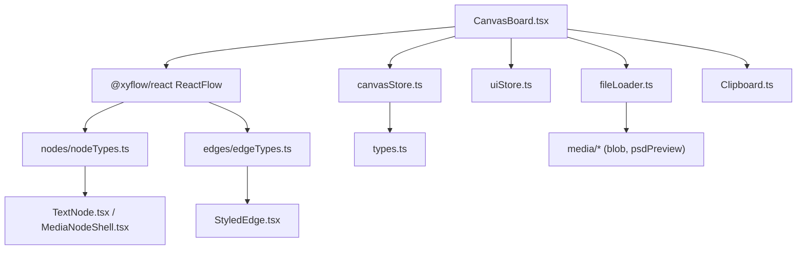
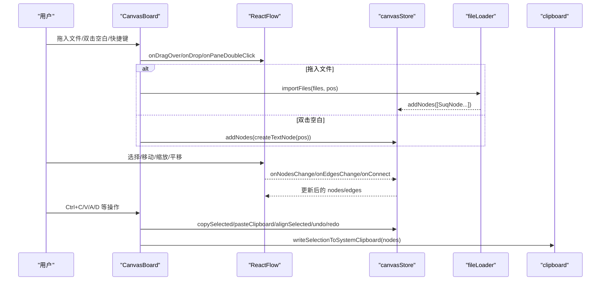
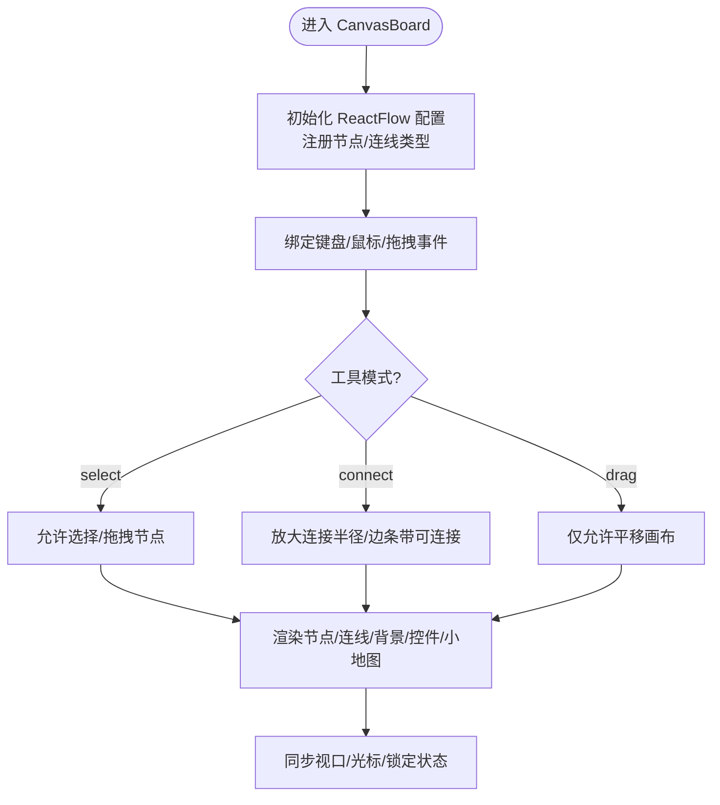
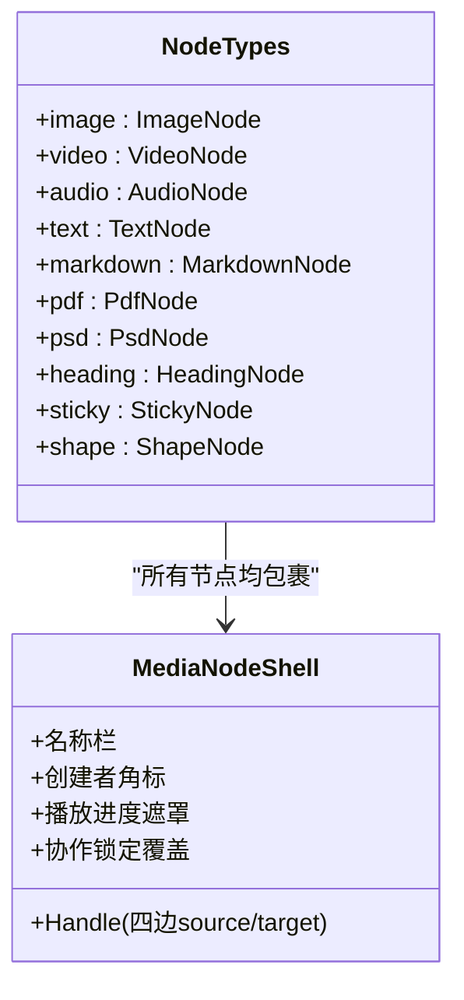
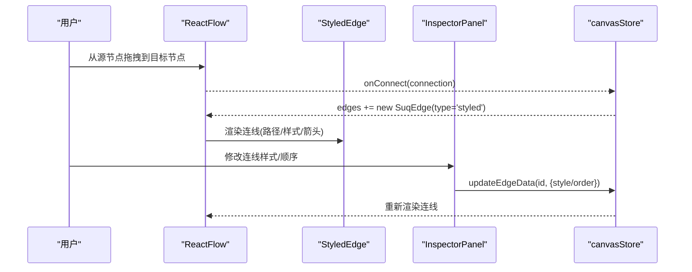
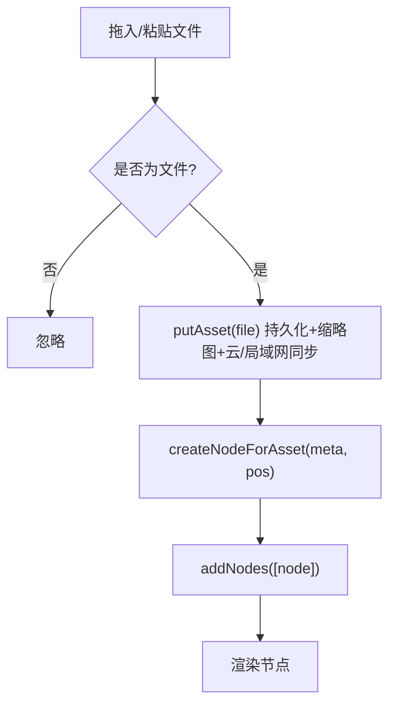
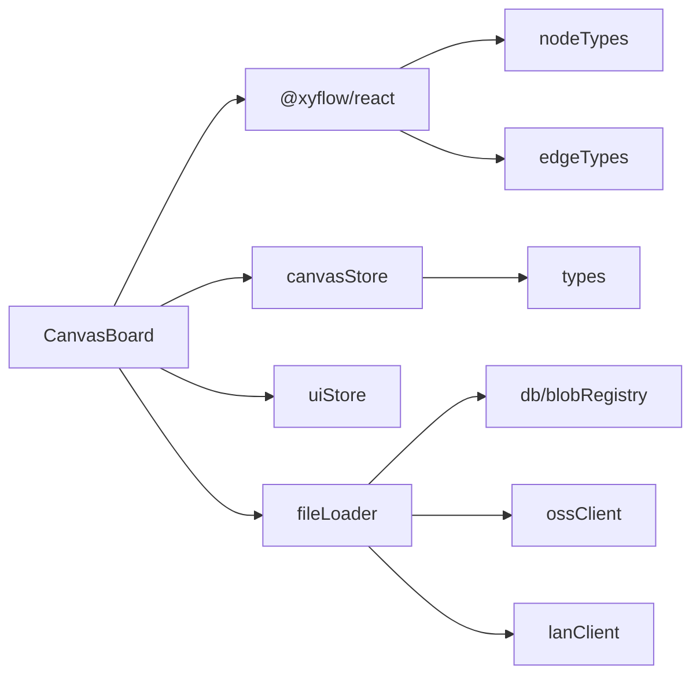

# 画布编辑器

<cite>
**本文引用的文件**
- [CanvasBoard.tsx](file://src/canvas/CanvasBoard.tsx)
- [nodeTypes.ts](file://src/canvas/nodes/nodeTypes.ts)
- [edgeTypes.ts](file://src/canvas/edges/edgeTypes.ts)
- [clipboard.ts](file://src/canvas/clipboard.ts)
- [canvasStore.ts](file://src/store/canvasStore.ts)
- [types.ts](file://src/types.ts)
- [fileLoader.ts](file://src/io/fileLoader.ts)
- [TextNode.tsx](file://src/canvas/nodes/TextNode.tsx)
- [StyledEdge.tsx](file://src/canvas/edges/StyledEdge.tsx)
- [MediaNodeShell.tsx](file://src/canvas/nodes/MediaNodeShell.tsx)
- [InspectorPanel.tsx](file://src/components/InspectorPanel.tsx)
- [uiStore.ts](file://src/store/uiStore.ts)
</cite>

## 目录
1. [简介](#简介)
2. [项目结构](#项目结构)
3. [核心组件](#核心组件)
4. [架构总览](#架构总览)
5. [详细组件分析](#详细组件分析)
6. [依赖关系分析](#依赖关系分析)
7. [性能考虑](#性能考虑)
8. [故障排查指南](#故障排查指南)
9. [结论](#结论)
10. [附录：常用操作示例](#附录：常用操作示例)

## 简介
本技术文档围绕画布编辑器的核心实现展开，重点解释基于 @xyflow/react 的 CanvasBoard 组件、节点类型系统、连线系统、剪贴板与拖拽上传等关键能力。同时提供性能优化建议与最佳实践，帮助开发者快速理解并扩展该画布编辑器。

## 项目结构
本项目采用按功能域划分的目录组织方式：
- src/canvas：画布核心（CanvasBoard）、节点与连线组件、剪贴板工具
- src/store：状态管理（画布、UI、局域网同步等）
- src/io：文件导入导出、素材处理
- src/media：媒体资源管理（音频、视频、PDF、PSD 预览等）
- src/components：通用 UI 面板（属性检查器、播放器等）
- src/sync：云端与局域网同步客户端
- src/utils：工具函数（UUID、设备 ID）

图表来源
- [CanvasBoard.tsx:1-459](file://src/canvas/CanvasBoard.tsx#L1-L459)
- [nodeTypes.ts:1-27](file://src/canvas/nodes/nodeTypes.ts#L1-L27)
- [edgeTypes.ts:1-7](file://src/canvas/edges/edgeTypes.ts#L1-L7)
- [canvasStore.ts:1-399](file://src/store/canvasStore.ts#L1-L399)
- [fileLoader.ts:1-297](file://src/io/fileLoader.ts#L1-L297)
- [types.ts:1-112](file://src/types.ts#L1-L112)

章节来源
- [CanvasBoard.tsx:1-459](file://src/canvas/CanvasBoard.tsx#L1-L459)
- [nodeTypes.ts:1-27](file://src/canvas/nodes/nodeTypes.ts#L1-L27)
- [edgeTypes.ts:1-7](file://src/canvas/edges/edgeTypes.ts#L1-L7)
- [canvasStore.ts:1-399](file://src/store/canvasStore.ts#L1-L399)
- [fileLoader.ts:1-297](file://src/io/fileLoader.ts#L1-L297)
- [types.ts:1-112](file://src/types.ts#L1-L112)

## 核心组件
- CanvasBoard：基于 ReactFlow 的画布容器，负责初始化、事件绑定、视图控制、工具模式切换、拖拽上传、快捷键、局域网协作等。
- 节点系统：通过 nodeTypes 注册内置节点类型；每个节点由 MediaNodeShell 统一包裹，提供连接点、选中态、创建者信息、播放进度遮罩等。
- 连线系统：自定义 StyledEdge，支持多种路径类型、线型、箭头、颜色与粗细，并在属性面板中可实时调整。
- 剪贴板：支持复制粘贴文本/图片到系统剪贴板，以及画布内复制粘贴元素（含关联边）。
- 状态管理：使用 Zustand 维护 nodes、edges、viewport、历史栈、对齐、层级等。

章节来源
- [CanvasBoard.tsx:1-459](file://src/canvas/CanvasBoard.tsx#L1-L459)
- [nodeTypes.ts:1-27](file://src/canvas/nodes/nodeTypes.ts#L1-L27)
- [MediaNodeShell.tsx:1-151](file://src/canvas/nodes/MediaNodeShell.tsx#L1-L151)
- [StyledEdge.tsx:1-130](file://src/canvas/edges/StyledEdge.tsx#L1-L130)
- [clipboard.ts:1-132](file://src/canvas/clipboard.ts#L1-L132)
- [canvasStore.ts:1-399](file://src/store/canvasStore.ts#L1-L399)

## 架构总览
CanvasBoard 作为入口，组合 ReactFlow、背景、控件、小地图、光标、提示层等子组件。数据流通过 canvasStore 集中管理，UI 行为通过 uiStore 协调，文件导入通过 fileLoader 完成，节点与连线渲染由 nodeTypes/edgeTypes 注入。

图表来源
- [CanvasBoard.tsx:210-334](file://src/canvas/CanvasBoard.tsx#L210-L334)
- [fileLoader.ts:186-205](file://src/io/fileLoader.ts#L186-L205)
- [canvasStore.ts:126-158](file://src/store/canvasStore.ts#L126-L158)
- [clipboard.ts:114-132](file://src/canvas/clipboard.ts#L114-L132)

## 详细组件分析

### CanvasBoard 组件
- 画布初始化与配置
  - 使用 ReactFlow 并设置最小/最大缩放、连线样式、选择模式、缩放/捏合、拖拽平移、连接半径等。
  - 注入 nodeTypes 与 edgeTypes，启用贝塞尔连线默认样式。
- 事件处理机制
  - 键盘快捷键：撤销/重做、全选、复制/粘贴、重复元素、适应视图、工具切换（V/C/H）、空格临时平移。
  - 鼠标与拖拽：onDragOver/Leave/Drop 实现文件拖入画布；onPaneDoubleClick 在空白处添加文本节点。
  - 视图联动：监听项目变更恢复视口；订阅局域网远端视口同步本地视图。
  - 协作锁定：根据 editing 列表将其他用户正在编辑的节点设为不可拖拽/选择。
- 工具模式
  - select/connect/drag 三种模式，影响是否可选择、可连接、可拖拽、连接热区大小等。
- 局域网协作
  - 发送/接收光标位置；标记当前编辑中的节点；显示远程用户光标。

图表来源
- [CanvasBoard.tsx:38-102](file://src/canvas/CanvasBoard.tsx#L38-L102)
- [CanvasBoard.tsx:104-193](file://src/canvas/CanvasBoard.tsx#L104-L193)
- [CanvasBoard.tsx:336-379](file://src/canvas/CanvasBoard.tsx#L336-L379)

章节来源
- [CanvasBoard.tsx:1-459](file://src/canvas/CanvasBoard.tsx#L1-L459)
- [uiStore.ts:1-121](file://src/store/uiStore.ts#L1-L121)

### 节点类型系统
- 注册机制
  - mediaNodeTypes 将字符串类型映射到具体 React 组件，供 ReactFlow 渲染。
  - 所有节点通过 MediaNodeShell 统一包装，提供四边连接点、名称栏、创建者角标、播放进度遮罩、协作锁定覆盖层等。
- 内置节点
  - image/video/audio/fileCard/text/markdown/pdf/psd/heading/sticky/shape。
- 自定义扩展
  - 新增节点类型只需：
    1) 创建 Node 组件（建议使用 MediaNodeShell 包裹）
    2) 在 nodeTypes.ts 中注册 type -> Component 映射
    3) 在 types.ts 的 MediaKind 中添加新 kind（如需）
    4) 在 fileLoader.ts 的 KIND_TO_TYPE 与 PLACEHOLDER_SIZE 中补充映射与默认尺寸（如从文件导入）
    5) 在 InspectorPanel 中增加对应属性的编辑 UI（可选）

图表来源
- [nodeTypes.ts:1-27](file://src/canvas/nodes/nodeTypes.ts#L1-L27)
- [MediaNodeShell.tsx:1-151](file://src/canvas/nodes/MediaNodeShell.tsx#L1-L151)

章节来源
- [nodeTypes.ts:1-27](file://src/canvas/nodes/nodeTypes.ts#L1-L27)
- [MediaNodeShell.tsx:1-151](file://src/canvas/nodes/MediaNodeShell.tsx#L1-L151)
- [types.ts:1-112](file://src/types.ts#L1-L112)
- [fileLoader.ts:137-182](file://src/io/fileLoader.ts#L137-L182)
- [InspectorPanel.tsx:475-796](file://src/components/InspectorPanel.tsx#L475-L796)

### 连线系统
- 锚点连接
  - 每个节点四边提供 source/target Handle；连接模式下四条边也暴露为连接热区，便于快速连线。
- 路径计算与样式
  - 自定义 StyledEdge 支持 bezier/straight/step/smoothstep 路径；实线/虚线/点线；箭头位置；颜色与粗细；选中高亮。
- 属性定制
  - 通过 InspectorPanel 对选中连线批量修改线型、路径、箭头、颜色、粗细；音频分叉处支持设置播放顺序 order。

图表来源
- [canvasStore.ts:146-158](file://src/store/canvasStore.ts#L146-L158)
- [StyledEdge.tsx:1-130](file://src/canvas/edges/StyledEdge.tsx#L1-L130)
- [InspectorPanel.tsx:311-471](file://src/components/InspectorPanel.tsx#L311-L471)

章节来源
- [StyledEdge.tsx:1-130](file://src/canvas/edges/StyledEdge.tsx#L1-L130)
- [canvasStore.ts:146-158](file://src/store/canvasStore.ts#L146-L158)
- [InspectorPanel.tsx:311-471](file://src/components/InspectorPanel.tsx#L311-L471)

### 剪贴板与拖拽上传
- 系统剪贴板
  - 单个图片/PSD 节点复制时尝试写入 PNG 图片到系统剪贴板；否则回退为多行文本。
  - 文本节点/标题/便签/形状优先复制其可见文本。
- 画布内复制粘贴
  - 复制选中节点（含 data），粘贴时生成新 ID、偏移位置、保留选中状态，并重建内部连线。
- 拖拽上传
  - 拖入文件时检测 Files，调用 importFiles 持久化存储、生成缩略图、同步到云端/局域网，并创建对应节点。
  - 粘贴事件拦截文件粘贴，同样走 importFiles。

图表来源
- [clipboard.ts:114-132](file://src/canvas/clipboard.ts#L114-L132)
- [canvasStore.ts:205-246](file://src/store/canvasStore.ts#L205-L246)
- [fileLoader.ts:77-117](file://src/io/fileLoader.ts#L77-L117)
- [fileLoader.ts:186-205](file://src/io/fileLoader.ts#L186-L205)

章节来源
- [clipboard.ts:1-132](file://src/canvas/clipboard.ts#L1-L132)
- [canvasStore.ts:205-246](file://src/store/canvasStore.ts#L205-L246)
- [fileLoader.ts:77-117](file://src/io/fileLoader.ts#L77-L117)
- [fileLoader.ts:186-205](file://src/io/fileLoader.ts#L186-L205)

### 文本节点与编辑
- 文本节点支持自动编辑、双击编辑、失焦提交、快捷键提交；支持文字对齐、字体、字号、颜色、行距等。
- 若文本节点命名了歌单（文本→单条出边→音频首节点），则显示“歌单”按钮，点击可打开播放器。

章节来源
- [TextNode.tsx:1-107](file://src/canvas/nodes/TextNode.tsx#L1-L107)
- [InspectorPanel.tsx:516-655](file://src/components/InspectorPanel.tsx#L516-L655)

## 依赖关系分析
- CanvasBoard 依赖 @xyflow/react 提供的 ReactFlow、Background、Controls、MiniMap、useReactFlow、useStoreApi 等。
- 节点与连线通过 nodeTypes/edgeTypes 注入到 ReactFlow。
- 状态集中在 canvasStore，使用 applyNodeChanges/applyEdgeChanges 高效更新。
- 文件导入依赖 fileLoader，结合 db、ossClient、lanClient 进行本地/云端/局域网同步。
- 剪贴板依赖 blobRegistry、psdPreview 获取图片 Blob 并转换为 PNG。

图表来源
- [CanvasBoard.tsx:1-459](file://src/canvas/CanvasBoard.tsx#L1-L459)
- [canvasStore.ts:1-399](file://src/store/canvasStore.ts#L1-L399)
- [fileLoader.ts:1-297](file://src/io/fileLoader.ts#L1-L297)

章节来源
- [CanvasBoard.tsx:1-459](file://src/canvas/CanvasBoard.tsx#L1-L459)
- [canvasStore.ts:1-399](file://src/store/canvasStore.ts#L1-L399)
- [fileLoader.ts:1-297](file://src/io/fileLoader.ts#L1-L297)

## 性能考虑
- 历史记录节流与去重
  - 使用防抖合并多次变更，避免频繁写历史；删除操作立即落盘快照，防止丢失。
- 节点渲染优化
  - 使用 memo 包裹节点组件（如 TextNode），减少不必要的重渲染。
  - MediaNodeShell 仅在工具变化时触发 useUpdateNodeInternals，保证连接热区正确测量。
- 大文件与媒体处理
  - 限制文件大小上限；视频/PSD 生成缩略图失败时降级处理，不影响主流程。
- 剪贴板图片转换
  - 对超大图片进行缩放后再转 PNG，避免内存占用过高。
- 视图同步
  - 局域网远端视口同步使用短动画时长，提升流畅度。

[本节为通用指导，不直接分析具体文件]

## 故障排查指南
- 无法复制图片到系统剪贴板
  - 浏览器不支持 ClipboardItem 或权限不足；已回退为文本复制。
  - PSD 预览生成失败会抛出错误；请检查资源是否存在且可解码。
- 拖拽上传无响应
  - 确认 onDragOver 阻止默认行为并设置 dropEffect；检查 onDrop 是否正确解析 files。
- 连线无效
  - 检查 isValidConnection 是否拒绝自连；确保节点四边 Handle 存在且 isConnectable 条件满足。
- 节点被锁定无法编辑
  - 检查局域网编辑状态，其他用户正在编辑时会禁用交互。

章节来源
- [clipboard.ts:99-132](file://src/canvas/clipboard.ts#L99-L132)
- [CanvasBoard.tsx:347-364](file://src/canvas/CanvasBoard.tsx#L347-L364)
- [MediaNodeShell.tsx:44-66](file://src/canvas/nodes/MediaNodeShell.tsx#L44-L66)

## 结论
该画布编辑器以 ReactFlow 为基础，结合 Zustand 状态管理与丰富的节点/连线组件，提供了完整的可视化编辑体验。通过统一的节点外壳、灵活的连线样式、健壮的剪贴板与文件导入机制，以及局域网协作能力，满足了复杂多媒体编排需求。遵循本文档的扩展指南与性能建议，可高效地新增节点类型、定制连线样式、优化大规模场景下的渲染性能。

[本节为总结性内容，不直接分析具体文件]

## 附录：常用操作示例
以下示例均以代码片段路径形式给出，便于定位实现位置：
- 在空白处添加文本节点
  - [CanvasBoard.tsx:234-242](file://src/canvas/CanvasBoard.tsx#L234-L242)
- 拖拽文件到画布并创建节点
  - [CanvasBoard.tsx:210-232](file://src/canvas/CanvasBoard.tsx#L210-L232)
  - [fileLoader.ts:186-205](file://src/io/fileLoader.ts#L186-L205)
- 复制选中元素到画布内
  - [canvasStore.ts:205-213](file://src/store/canvasStore.ts#L205-L213)
  - [canvasStore.ts:214-246](file://src/store/canvasStore.ts#L214-L246)
- 复制选中元素到系统剪贴板（图片/文本）
  - [CanvasBoard.tsx:128-135](file://src/canvas/CanvasBoard.tsx#L128-L135)
  - [clipboard.ts:114-132](file://src/canvas/clipboard.ts#L114-L132)
- 修改节点属性（如文本对齐、字体、颜色）
  - [InspectorPanel.tsx:516-655](file://src/components/InspectorPanel.tsx#L516-L655)
- 修改连线样式（路径、线型、箭头、颜色、粗细）
  - [InspectorPanel.tsx:311-471](file://src/components/InspectorPanel.tsx#L311-L471)
- 新建连线
  - [canvasStore.ts:146-158](file://src/store/canvasStore.ts#L146-L158)
- 撤销/重做
  - [CanvasBoard.tsx:113-122](file://src/canvas/CanvasBoard.tsx#L113-L122)
  - [canvasStore.ts:362-383](file://src/store/canvasStore.ts#L362-L383)
- 全选/重复元素/适应视图
  - [CanvasBoard.tsx:122-146](file://src/canvas/CanvasBoard.tsx#L122-L146)

[本节为操作指引，不直接分析具体文件]