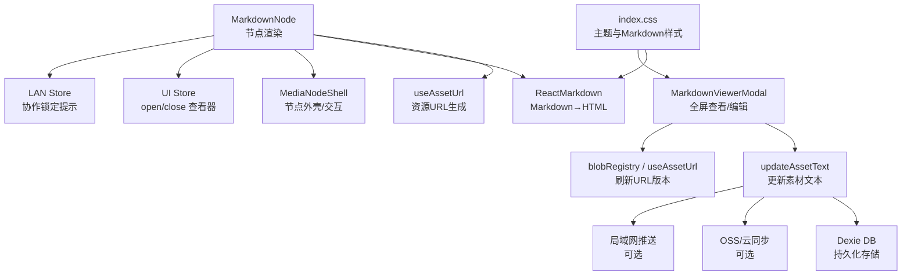
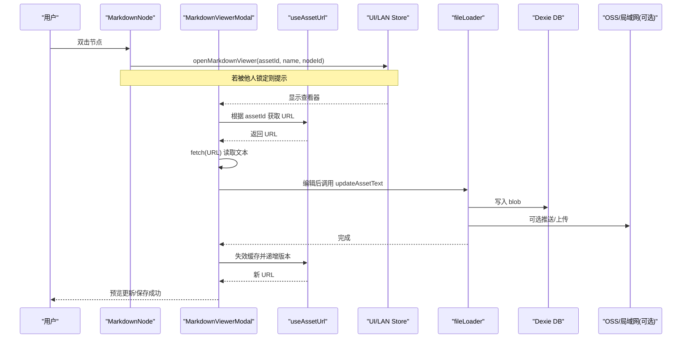
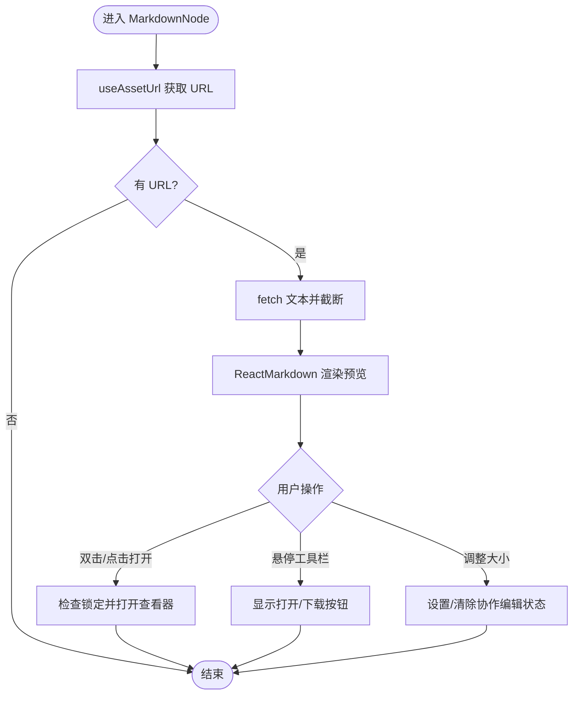
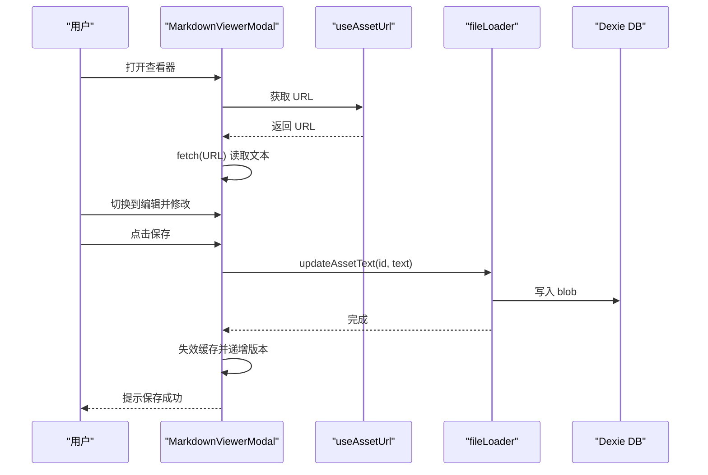
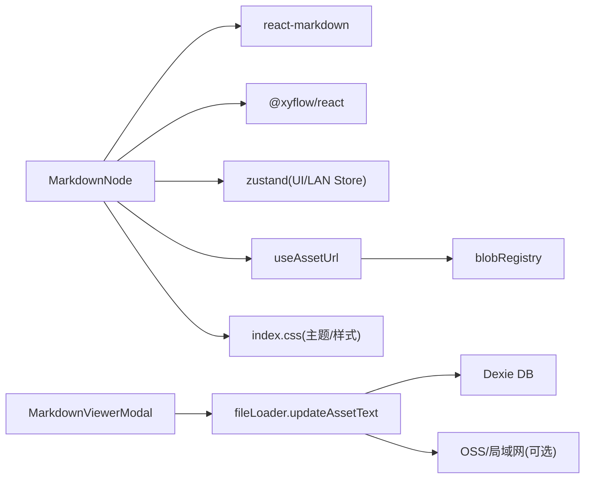

# Markdown 节点 (MarkdownNode)

<cite>
**本文引用的文件**
- [src/canvas/nodes/MarkdownNode.tsx](file://src/canvas/nodes/MarkdownNode.tsx)
- [src/components/MarkdownViewerModal.tsx](file://src/components/MarkdownViewerModal.tsx)
- [src/types.ts](file://src/types.ts)
- [src/media/useAssetUrl.ts](file://src/media/useAssetUrl.ts)
- [src/io/fileLoader.ts](file://src/io/fileLoader.ts)
- [src/index.css](file://src/index.css)
- [package.json](file://package.json)
</cite>

## 目录
1. [简介](#简介)
2. [项目结构](#项目结构)
3. [核心组件](#核心组件)
4. [架构总览](#架构总览)
5. [详细组件分析](#详细组件分析)
6. [依赖关系分析](#依赖关系分析)
7. [性能考量](#性能考量)
8. [故障排查指南](#故障排查指南)
9. [结论](#结论)
10. [附录：配置与扩展示例](#附录：配置与扩展示例)

## 简介
本技术文档聚焦于 SuQCanvas 中的 Markdown 节点（MarkdownNode）实现，系统阐述其解析渲染、HTML 转换机制、样式定制体系，以及与查看器、存储同步、协作编辑的集成方式。内容覆盖 Markdown 语法支持范围、渲染能力（预览、高亮、链接、图片）、全屏编辑与导出、主题与响应式样式，并提供可操作的扩展点与最佳实践。

## 项目结构
Markdown 功能由“节点渲染 + 查看器 + 资源加载 + 样式主题”四部分构成：
- 节点渲染：在画布中以缩略形式展示 Markdown 内容，并支持打开查看器与下载。
- 查看器：提供全屏编辑/预览、保存、下载等完整工作流。
- 资源加载：通过本地 IndexedDB 与可选的局域网/云端同步获取 Markdown 文本。
- 样式主题：基于 CSS 变量与 Tailwind 类名实现明暗主题与 Markdown 排版样式。

图表来源
- [src/canvas/nodes/MarkdownNode.tsx:12-104](file://src/canvas/nodes/MarkdownNode.tsx#L12-L104)
- [src/components/MarkdownViewerModal.tsx:11-115](file://src/components/MarkdownViewerModal.tsx#L11-L115)
- [src/media/useAssetUrl.ts:10-44](file://src/media/useAssetUrl.ts#L10-L44)
- [src/io/fileLoader.ts:120-135](file://src/io/fileLoader.ts#L120-L135)
- [src/index.css:518-556](file://src/index.css#L518-L556)

章节来源
- [src/canvas/nodes/MarkdownNode.tsx:12-104](file://src/canvas/nodes/MarkdownNode.tsx#L12-L104)
- [src/components/MarkdownViewerModal.tsx:11-115](file://src/components/MarkdownViewerModal.tsx#L11-L115)
- [src/media/useAssetUrl.ts:10-44](file://src/media/useAssetUrl.ts#L10-L44)
- [src/io/fileLoader.ts:120-135](file://src/io/fileLoader.ts#L120-L135)
- [src/index.css:518-556](file://src/index.css#L518-L556)

## 核心组件
- MarkdownNode：画布中的 Markdown 节点，负责加载素材、渲染缩略预览、打开查看器、下载素材、协作锁定提示。
- MarkdownViewerModal：全屏查看器，提供编辑模式、预览模式、保存、下载、关闭等操作。
- useAssetUrl：统一资源 URL 管理，含重试与错误处理。
- fileLoader.updateAssetText：将文本写入 IndexedDB，并触发局域网/云端同步。
- index.css：定义 Markdown 排版样式与明暗主题变量。

章节来源
- [src/canvas/nodes/MarkdownNode.tsx:12-104](file://src/canvas/nodes/MarkdownNode.tsx#L12-L104)
- [src/components/MarkdownViewerModal.tsx:11-115](file://src/components/MarkdownViewerModal.tsx#L11-L115)
- [src/media/useAssetUrl.ts:10-44](file://src/media/useAssetUrl.ts#L10-L44)
- [src/io/fileLoader.ts:120-135](file://src/io/fileLoader.ts#L120-L135)
- [src/index.css:518-556](file://src/index.css#L518-L556)

## 架构总览
Markdown 节点采用“轻量预览 + 全屏编辑”的分层架构：
- 节点层：使用 ReactMarkdown 直接渲染少量内容作为预览；通过 useAssetUrl 拉取文本；通过 UI Store 打开查看器；通过 LAN Store 检测协作锁定。
- 查看器层：提供编辑/预览切换；保存时调用 updateAssetText 更新 IndexedDB，并触发版本失效与 UI 刷新；同时支持下载。
- 数据层：以 Dexie 为本地存储，可选地推送到局域网或云端 OSS。
- 样式层：通过 CSS 变量与 Tailwind 类名实现主题与 Markdown 排版。

图表来源
- [src/canvas/nodes/MarkdownNode.tsx:20-43](file://src/canvas/nodes/MarkdownNode.tsx#L20-L43)
- [src/components/MarkdownViewerModal.tsx:21-58](file://src/components/MarkdownViewerModal.tsx#L21-L58)
- [src/media/useAssetUrl.ts:14-43](file://src/media/useAssetUrl.ts#L14-L43)
- [src/io/fileLoader.ts:120-135](file://src/io/fileLoader.ts#L120-L135)

## 详细组件分析

### MarkdownNode 组件
- 职责
  - 通过 useAssetUrl 获取 Markdown 文本 URL，fetch 文本并限制最大长度，避免大文件阻塞渲染。
  - 使用 ReactMarkdown 渲染预览内容。
  - 双击或点击按钮打开 MarkdownViewerModal。
  - 提供下载入口，直接下载原始 Markdown 文件。
  - 结合 LAN Store 检测协作锁定，防止多人同时编辑冲突。
  - 使用 NodeResizer 支持节点尺寸调整，并在调整开始/结束时设置/清除协作编辑状态。
- 关键流程
  - 资源加载：url 变化 → fetch → 设置 content（截断至 200KB）。
  - 打开查看器：检查锁定 → 调用 UI Store 打开查看器。
  - 协作锁定：当其他用户正在编辑该节点时，显示遮罩与提示。
- 复杂度与性能
  - 预览仅渲染前 200KB 文本，降低 DOM 压力。
  - 使用 memo 包裹组件减少重渲染。
  - 资源加载失败时通过 toast 提示。

图表来源
- [src/canvas/nodes/MarkdownNode.tsx:12-104](file://src/canvas/nodes/MarkdownNode.tsx#L12-L104)

章节来源
- [src/canvas/nodes/MarkdownNode.tsx:12-104](file://src/canvas/nodes/MarkdownNode.tsx#L12-L104)

### MarkdownViewerModal 组件
- 职责
  - 全屏展示 Markdown 内容，支持编辑/预览切换。
  - 编辑模式下，实时绑定 textarea 内容，限制最大长度。
  - 保存时调用 updateAssetText 更新 IndexedDB，并触发 URL 失效与节点数据更新。
  - 支持下载原始 Markdown。
  - 进入查看器即标记当前节点为“正在编辑”，退出时清理。
- 关键流程
  - 初始化：根据 viewer.assetId 获取 URL，fetch 文本。
  - 编辑保存：更新资产文本 → 失效缓存 → 递增版本 → 更新节点时间戳 → 提示保存结果。
  - 协作锁定：进入查看器时设置编辑锁，离开时清理。
- 复杂度与性能
  - 文本截断至 200KB，避免超大内容导致卡顿。
  - 保存成功后立即刷新 URL 版本，确保预览一致性。

图表来源
- [src/components/MarkdownViewerModal.tsx:21-58](file://src/components/MarkdownViewerModal.tsx#L21-L58)
- [src/io/fileLoader.ts:120-135](file://src/io/fileLoader.ts#L120-L135)

章节来源
- [src/components/MarkdownViewerModal.tsx:11-115](file://src/components/MarkdownViewerModal.tsx#L11-L115)
- [src/io/fileLoader.ts:120-135](file://src/io/fileLoader.ts#L120-L135)

### 资源加载与存储
- useAssetUrl：封装 getAssetUrl，具备重试机制与错误提示，适配局域网传输延迟场景。
- fileLoader.updateAssetText：将文本转为 Blob 写入 IndexedDB，并触发局域网/云端同步。
- 类型定义：SuqNodeData 包含 kind=markdown、assetId、label、assetUpdatedAt 等字段，用于节点数据与视图联动。

章节来源
- [src/media/useAssetUrl.ts:10-44](file://src/media/useAssetUrl.ts#L10-L44)
- [src/io/fileLoader.ts:120-135](file://src/io/fileLoader.ts#L120-L135)
- [src/types.ts:66-98](file://src/types.ts#L66-L98)

### 样式定制系统
- 主题变量：通过 html.light 与默认深色主题切换 CSS 变量，控制代码块、引用、链接、边框等颜色。
- Markdown 排版：.sq-markdown 下对 pre/code、blockquote、a、hr、img、table 等元素进行样式定义，保证可读性与一致性。
- 响应式：Tailwind 类名配合 CSS 变量，使不同屏幕尺寸下的排版自适应。

章节来源
- [src/index.css:74-121](file://src/index.css#L74-L121)
- [src/index.css:518-556](file://src/index.css#L518-L556)

## 依赖关系分析
- 外部库
  - react-markdown：Markdown→HTML 渲染引擎。
  - @xyflow/react：节点框架（NodeResizer、NodeProps 等）。
  - zustand：状态管理（UI Store、LAN Store）。
  - dexie：IndexedDB 封装（通过 fileLoader 间接使用）。
- 内部模块
  - useAssetUrl：资源 URL 管理。
  - fileLoader：素材导入/更新与同步。
  - types：节点数据类型定义。
  - index.css：主题与 Markdown 样式。

图表来源
- [package.json:22-34](file://package.json#L22-L34)
- [src/canvas/nodes/MarkdownNode.tsx:1-10](file://src/canvas/nodes/MarkdownNode.tsx#L1-L10)
- [src/components/MarkdownViewerModal.tsx:1-9](file://src/components/MarkdownViewerModal.tsx#L1-L9)
- [src/media/useAssetUrl.ts:1-5](file://src/media/useAssetUrl.ts#L1-L5)
- [src/io/fileLoader.ts:1-18](file://src/io/fileLoader.ts#L1-L18)

章节来源
- [package.json:22-34](file://package.json#L22-L34)
- [src/canvas/nodes/MarkdownNode.tsx:1-10](file://src/canvas/nodes/MarkdownNode.tsx#L1-L10)
- [src/components/MarkdownViewerModal.tsx:1-9](file://src/components/MarkdownViewerModal.tsx#L1-L9)
- [src/media/useAssetUrl.ts:1-5](file://src/media/useAssetUrl.ts#L1-L5)
- [src/io/fileLoader.ts:1-18](file://src/io/fileLoader.ts#L1-L18)

## 性能考量
- 预览截断：节点与查看器均对文本进行上限截断（约 200KB），避免大文档导致渲染卡顿。
- 懒加载与重试：useAssetUrl 内置重试逻辑，适应局域网传输延迟。
- 组件优化：MarkdownNode 使用 memo 包裹，减少不必要重渲染。
- 版本失效：保存后主动失效缓存并递增版本，确保最新内容即时呈现。
- 建议
  - 如需支持超长文档，可在查看器中引入虚拟滚动或分页加载。
  - 对复杂 Markdown（大量图片/表格）可考虑按需加载与懒加载策略。

[本节为通用性能讨论，不直接分析具体文件]

## 故障排查指南
- Markdown 加载失败
  - 现象：节点或查看器提示“Markdown 加载失败”。
  - 可能原因：资源未就绪、网络异常、权限问题。
  - 处理：检查 useAssetUrl 重试逻辑；确认 IndexedDB 记录存在；必要时重新导入素材。
- 保存失败
  - 现象：查看器保存时报错或无提示。
  - 可能原因：IndexedDB 写入失败、同步服务不可用。
  - 处理：检查 fileLoader.updateAssetText 执行路径；确认局域网/云端同步是否启用且可用。
- 协作冲突
  - 现象：打开查看器时被提示“某用户正在操作此元素”。
  - 可能原因：LAN Store 检测到其他用户锁定。
  - 处理：等待对方退出编辑；或在多端协调编辑顺序。

章节来源
- [src/canvas/nodes/MarkdownNode.tsx:29-43](file://src/canvas/nodes/MarkdownNode.tsx#L29-L43)
- [src/components/MarkdownViewerModal.tsx:21-58](file://src/components/MarkdownViewerModal.tsx#L21-L58)
- [src/media/useAssetUrl.ts:14-43](file://src/media/useAssetUrl.ts#L14-L43)
- [src/io/fileLoader.ts:120-135](file://src/io/fileLoader.ts#L120-L135)

## 结论
MarkdownNode 以“轻量预览 + 全屏编辑”为核心设计，借助 react-markdown 实现 Markdown→HTML 渲染，结合 useAssetUrl 与 fileLoader 完成资源的加载与持久化，并通过 CSS 变量与 Tailwind 实现主题与排版定制。该方案在保证性能的同时，提供了完整的编辑、保存、下载与协作体验。未来可扩展数学公式、语法高亮插件与更丰富的 Markdown 扩展。

[本节为总结性内容，不直接分析具体文件]

## 附录：配置与扩展示例

### Markdown 语法支持现状
- 基础语法：标题、段落、列表、加粗/斜体、链接、图片、引用、分割线、表格、代码块等，均由 react-markdown 默认支持。
- 数学公式：当前未显式引入 math 插件；如需支持 LaTeX，可在查看器中引入 remark-math 与 rehype-katex，并在 ReactMarkdown 中配置相应处理器。
- 语法高亮：当前未引入 highlight 插件；如需代码高亮，可引入 rehype-highlight 或自定义 highlighter。

章节来源
- [package.json:32](file://package.json#L32)
- [src/components/MarkdownViewerModal.tsx:98-109](file://src/components/MarkdownViewerModal.tsx#L98-L109)
- [src/canvas/nodes/MarkdownNode.tsx:64-69](file://src/canvas/nodes/MarkdownNode.tsx#L64-L69)

### 样式定制要点
- 主题切换：通过 html.light 类切换 CSS 变量，影响代码块、引用、链接、边框等颜色。
- Markdown 排版：.sq-markdown 下对 pre/code、blockquote、a、hr、img、table 等进行样式定义。
- 响应式：使用 Tailwind 类名与 CSS 变量组合，适配不同屏幕尺寸。

章节来源
- [src/index.css:74-121](file://src/index.css#L74-L121)
- [src/index.css:518-556](file://src/index.css#L518-L556)

### 与查看器的集成
- 全屏编辑：MarkdownViewerModal 提供编辑/预览切换，保存后更新 IndexedDB 并触发 URL 失效与版本递增。
- 导出功能：节点与查看器均提供下载入口，直接下载原始 Markdown 文件。
- 版本历史：当前实现通过 assetUpdatedAt 与 URL 版本失效保证最新内容；如需完整历史，可在 IndexedDB 中增加版本记录与回滚能力。

章节来源
- [src/components/MarkdownViewerModal.tsx:43-58](file://src/components/MarkdownViewerModal.tsx#L43-L58)
- [src/components/MarkdownViewerModal.tsx:65-72](file://src/components/MarkdownViewerModal.tsx#L65-L72)
- [src/canvas/nodes/MarkdownNode.tsx:84-93](file://src/canvas/nodes/MarkdownNode.tsx#L84-L93)

### 自定义渲染扩展点
- 自定义组件：可通过 ReactMarkdown 的 components 属性注入自定义组件，替换默认渲染行为（如自定义链接、图片、代码块）。
- 插件链：可在查看器中引入 remark/rehype 插件链，扩展语法与 HTML 处理（如数学公式、高亮、脚注等）。
- 样式隔离：通过 .sq-markdown 选择器限定样式作用域，避免污染全局样式。

章节来源
- [src/components/MarkdownViewerModal.tsx:98-109](file://src/components/MarkdownViewerModal.tsx#L98-L109)
- [src/canvas/nodes/MarkdownNode.tsx:64-69](file://src/canvas/nodes/MarkdownNode.tsx#L64-L69)
- [src/index.css:518-556](file://src/index.css#L518-L556)