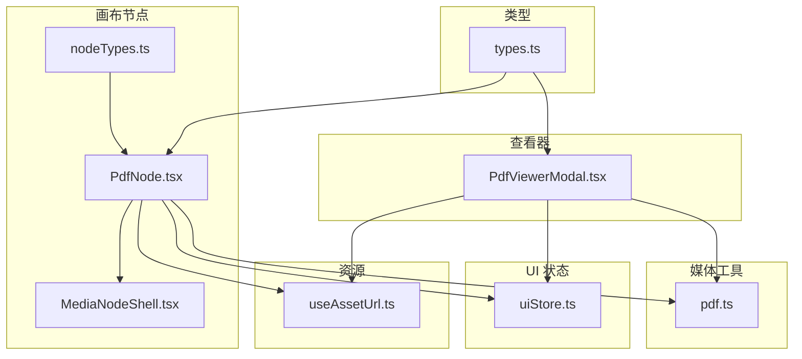
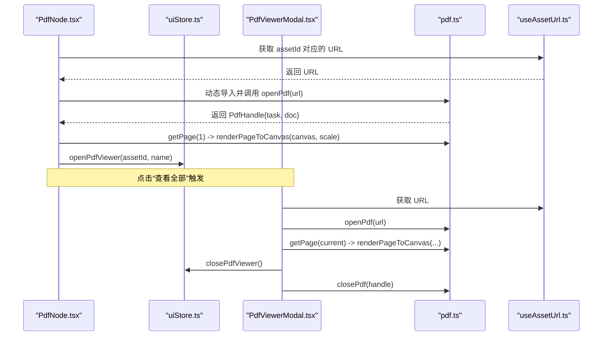
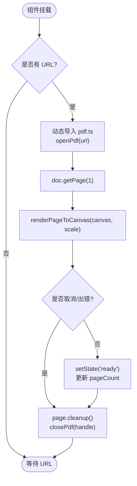
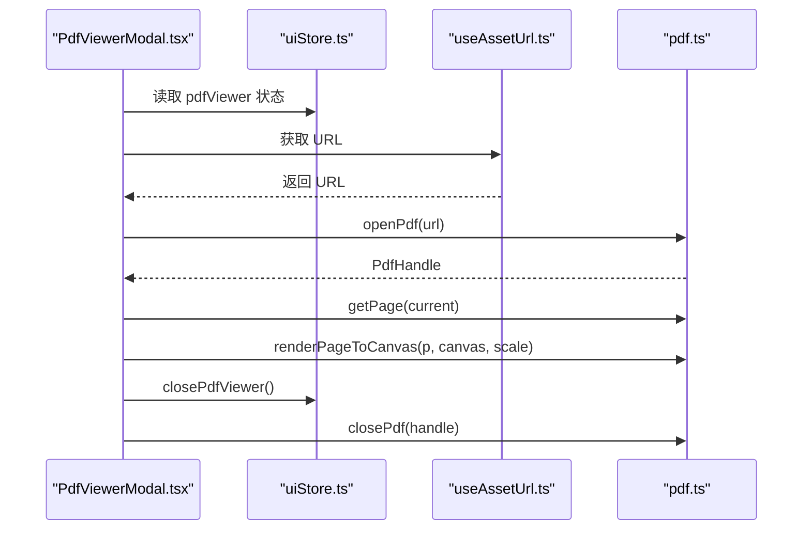
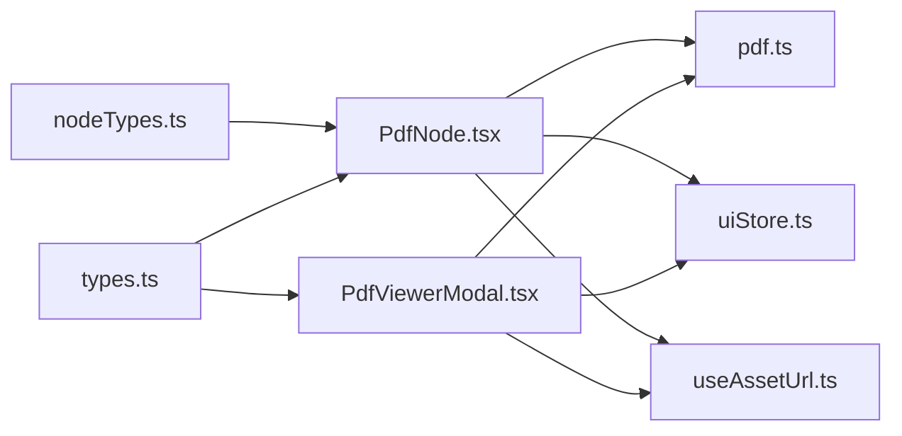

# PDF 节点 (PdfNode)

<cite>
**本文引用的文件**
- [src/canvas/nodes/PdfNode.tsx](file://src/canvas/nodes/PdfNode.tsx)
- [src/media/pdf.ts](file://src/media/pdf.ts)
- [src/components/PdfViewerModal.tsx](file://src/components/PdfViewerModal.tsx)
- [src/store/uiStore.ts](file://src/store/uiStore.ts)
- [src/media/useAssetUrl.ts](file://src/media/useAssetUrl.ts)
- [src/canvas/nodes/MediaNodeShell.tsx](file://src/canvas/nodes/MediaNodeShell.tsx)
- [src/canvas/nodes/nodeTypes.ts](file://src/canvas/nodes/nodeTypes.ts)
- [src/types.ts](file://src/types.ts)
</cite>

## 目录
1. [简介](#简介)
2. [项目结构](#项目结构)
3. [核心组件](#核心组件)
4. [架构总览](#架构总览)
5. [详细组件分析](#详细组件分析)
6. [依赖关系分析](#依赖关系分析)
7. [性能与内存优化](#性能与内存优化)
8. [故障排查指南](#故障排查指南)
9. [结论](#结论)
10. [附录：配置与扩展示例](#附录：配置与扩展示例)

## 简介
本技术文档聚焦于画布中的 PDF 节点（PdfNode）及其配套能力，涵盖以下方面：
- PDF.js 集成方式、页面渲染机制与资源路径配置
- 文件解析、页面导航、缩放控制、搜索等功能的现状与扩展点
- PDF 预览能力：缩略图生成、页面跳转、打印支持
- 与查看器的集成：全屏浏览、标注、书签的当前实现与可拓展方向
- 缓存机制：页面级渲染缓存、资源预加载、内存管理策略
- 具体代码示例：通过“片段路径”展示如何配置 PdfNode 以及自定义 PDF 功能

## 项目结构
PDF 相关能力分布在以下模块中：
- 画布节点层：PdfNode 负责在画布中渲染第一页缩略图并提供“查看全部”入口
- 媒体工具层：pdf.ts 封装 PDF.js 打开/关闭/渲染接口，并配置 cMap/标准字体/WASM 资源路径
- UI 状态层：uiStore.ts 提供 pdfViewer 状态与 open/close 方法
- 查看器组件：PdfViewerModal.tsx 实现弹窗式单页阅读器（翻页、键盘导航）
- 资源 URL：useAssetUrl.ts 提供稳定的资源地址获取与重试逻辑
- 节点外壳：MediaNodeShell.tsx 提供统一的节点边框、连接手柄、底部信息栏等
- 类型定义：types.ts 定义了 SuqNodeData.pageCount 等字段

图表来源
- [src/canvas/nodes/PdfNode.tsx:11-89](file://src/canvas/nodes/PdfNode.tsx#L11-L89)
- [src/media/pdf.ts:1-50](file://src/media/pdf.ts#L1-L50)
- [src/components/PdfViewerModal.tsx:7-146](file://src/components/PdfViewerModal.tsx#L7-L146)
- [src/store/uiStore.ts:18-75](file://src/store/uiStore.ts#L18-L75)
- [src/media/useAssetUrl.ts:10-44](file://src/media/useAssetUrl.ts#L10-L44)
- [src/canvas/nodes/MediaNodeShell.tsx:32-151](file://src/canvas/nodes/MediaNodeShell.tsx#L32-L151)
- [src/canvas/nodes/nodeTypes.ts:14-26](file://src/canvas/nodes/nodeTypes.ts#L14-L26)
- [src/types.ts:66-98](file://src/types.ts#L66-L98)

章节来源
- [src/canvas/nodes/PdfNode.tsx:11-89](file://src/canvas/nodes/PdfNode.tsx#L11-L89)
- [src/media/pdf.ts:1-50](file://src/media/pdf.ts#L1-L50)
- [src/components/PdfViewerModal.tsx:7-146](file://src/components/PdfViewerModal.tsx#L7-L146)
- [src/store/uiStore.ts:18-75](file://src/store/uiStore.ts#L18-L75)
- [src/media/useAssetUrl.ts:10-44](file://src/media/useAssetUrl.ts#L10-L44)
- [src/canvas/nodes/MediaNodeShell.tsx:32-151](file://src/canvas/nodes/MediaNodeShell.tsx#L32-L151)
- [src/canvas/nodes/nodeTypes.ts:14-26](file://src/canvas/nodes/nodeTypes.ts#L14-L26)
- [src/types.ts:66-98](file://src/types.ts#L66-L98)

## 核心组件
- PdfNode：在画布中异步加载 PDF 并渲染第一页到 Canvas，更新节点数据中的 pageCount，并提供“查看全部”按钮。
- pdf.ts：统一封装 PDF.js 的打开、关闭、渲染到 Canvas 的方法，并设置 workerSrc 与 cMap/标准字体/WASM 资源路径。
- PdfViewerModal：弹窗式 PDF 阅读器，支持上一页/下一页、键盘导航、错误提示。
- uiStore：集中管理 pdfViewer 的打开/关闭状态，供 PdfNode 和 PdfViewerModal 共享。
- useAssetUrl：为节点和查看器提供稳定可靠的资源 URL，包含重试与失败提示。
- MediaNodeShell：为所有媒体节点提供统一外壳（边框、连接手柄、底部信息栏、锁定态）。

章节来源
- [src/canvas/nodes/PdfNode.tsx:11-89](file://src/canvas/nodes/PdfNode.tsx#L11-L89)
- [src/media/pdf.ts:1-50](file://src/media/pdf.ts#L1-L50)
- [src/components/PdfViewerModal.tsx:7-146](file://src/components/PdfViewerModal.tsx#L7-L146)
- [src/store/uiStore.ts:18-75](file://src/store/uiStore.ts#L18-L75)
- [src/media/useAssetUrl.ts:10-44](file://src/media/useAssetUrl.ts#L10-L44)
- [src/canvas/nodes/MediaNodeShell.tsx:32-151](file://src/canvas/nodes/MediaNodeShell.tsx#L32-L151)

## 架构总览
PdfNode 作为画布中的一个节点，职责是“轻量预览 + 跳转”。它不直接持有完整文档对象，而是按需动态导入 pdf.ts，打开文档后仅渲染第一页到 Canvas，并在完成后释放页面资源。PdfViewerModal 则承载完整的阅读体验，包括翻页、键盘操作、错误提示等。两者通过 uiStore 的状态进行解耦协作。

图表来源
- [src/canvas/nodes/PdfNode.tsx:19-62](file://src/canvas/nodes/PdfNode.tsx#L19-L62)
- [src/components/PdfViewerModal.tsx:24-56](file://src/components/PdfViewerModal.tsx#L24-L56)
- [src/media/pdf.ts:23-49](file://src/media/pdf.ts#L23-L49)
- [src/media/useAssetUrl.ts:10-44](file://src/media/useAssetUrl.ts#L10-L44)
- [src/store/uiStore.ts:69-75](file://src/store/uiStore.ts#L69-L75)

## 详细组件分析

### PdfNode 组件
- 生命周期与状态
  - 使用 useEffect 监听 url 变化，进入 loading 状态，动态导入 pdf.ts，打开文档并获取第一页，渲染到 Canvas 后切换为 ready；异常时切换为 error。
  - 清理阶段确保 page.cleanup() 与 closePdf(handle) 被调用，避免内存泄漏。
- 数据同步
  - 若 doc.numPages 与 data.pageCount 不一致，调用 updateNodeData 更新节点数据，便于后续显示页数。
- 交互
  - 提供“查看全部”按钮，调用 openPdfViewer 打开 PdfViewerModal。
- 渲染
  - 使用 MediaNodeShell 包裹，内部 canvas 仅在 ready 时显示，loading/error 分别有占位与提示。

图表来源
- [src/canvas/nodes/PdfNode.tsx:19-62](file://src/canvas/nodes/PdfNode.tsx#L19-L62)
- [src/media/pdf.ts:23-49](file://src/media/pdf.ts#L23-L49)

章节来源
- [src/canvas/nodes/PdfNode.tsx:11-89](file://src/canvas/nodes/PdfNode.tsx#L11-L89)
- [src/media/pdf.ts:23-49](file://src/media/pdf.ts#L23-L49)

### pdf.ts 工具模块
- 初始化
  - 设置 GlobalWorkerOptions.workerSrc 指向打包后的 worker 文件。
  - 配置 cMapUrl、standardFontDataUrl、wasmUrl，解决 CJK 字体与标准字体、图片解码问题。
- API
  - openPdf(url)：返回 PdfHandle，包含 task 与 doc。
  - closePdf(handle)：安全销毁任务，避免重复销毁。
  - renderPageToCanvas(page, canvas, scale)：根据设备像素比设置 canvas 尺寸并渲染页面。

章节来源
- [src/media/pdf.ts:1-50](file://src/media/pdf.ts#L1-L50)

### PdfViewerModal 查看器
- 功能
  - 打开 PDF 文档，记录页数，渲染当前页到 Canvas。
  - 上一页/下一页按钮与键盘左右箭头导航。
  - 错误时通过 toast 提示用户。
- 生命周期
  - 组件卸载或关闭时，清理当前 page 并关闭 PdfHandle。
- 缩放
  - 基于页面基础视口宽度计算 scale，限制最大缩放倍率，保证清晰度与性能平衡。

图表来源
- [src/components/PdfViewerModal.tsx:24-94](file://src/components/PdfViewerModal.tsx#L24-L94)
- [src/media/pdf.ts:23-49](file://src/media/pdf.ts#L23-L49)
- [src/media/useAssetUrl.ts:10-44](file://src/media/useAssetUrl.ts#L10-L44)
- [src/store/uiStore.ts:69-75](file://src/store/uiStore.ts#L69-L75)

章节来源
- [src/components/PdfViewerModal.tsx:7-146](file://src/components/PdfViewerModal.tsx#L7-L146)
- [src/media/pdf.ts:23-49](file://src/media/pdf.ts#L23-L49)
- [src/media/useAssetUrl.ts:10-44](file://src/media/useAssetUrl.ts#L10-L44)
- [src/store/uiStore.ts:69-75](file://src/store/uiStore.ts#L69-L75)

### MediaNodeShell 外壳
- 提供统一的节点外观：边框、四边连接手柄、底部名称栏、创建者角标、进度遮罩、锁定态提示。
- 对 PdfNode 而言，主要承担布局与交互外壳，使 PDF 节点与其他媒体节点保持一致的视觉与行为。

章节来源
- [src/canvas/nodes/MediaNodeShell.tsx:32-151](file://src/canvas/nodes/MediaNodeShell.tsx#L32-L151)

### 类型与注册
- types.ts 中 SuqNodeData 包含 pageCount 字段，用于存储 PDF 页数。
- nodeTypes.ts 将 pdf 节点类型映射到 PdfNode 组件，使其可在画布中使用。

章节来源
- [src/types.ts:66-98](file://src/types.ts#L66-L98)
- [src/canvas/nodes/nodeTypes.ts:14-26](file://src/canvas/nodes/nodeTypes.ts#L14-L26)

## 依赖关系分析
- 耦合度
  - PdfNode 与 pdf.ts 低耦合，通过动态 import 减少首屏体积。
  - PdfNode 与 uiStore 通过 openPdfViewer 解耦查看器生命周期。
  - PdfViewerModal 同样通过 uiStore 管理自身显隐，降低与 PdfNode 的直接依赖。
- 外部依赖
  - pdfjs-dist：PDF 解析与渲染核心。
  - @xyflow/react：画布节点框架。
- 潜在循环依赖
  - 当前未见循环引用；各模块职责清晰，依赖方向单向。

图表来源
- [src/canvas/nodes/PdfNode.tsx:11-89](file://src/canvas/nodes/PdfNode.tsx#L11-L89)
- [src/components/PdfViewerModal.tsx:7-146](file://src/components/PdfViewerModal.tsx#L7-L146)
- [src/media/pdf.ts:1-50](file://src/media/pdf.ts#L1-L50)
- [src/store/uiStore.ts:18-75](file://src/store/uiStore.ts#L18-L75)
- [src/media/useAssetUrl.ts:10-44](file://src/media/useAssetUrl.ts#L10-L44)
- [src/canvas/nodes/nodeTypes.ts:14-26](file://src/canvas/nodes/nodeTypes.ts#L14-L26)
- [src/types.ts:66-98](file://src/types.ts#L66-L98)

章节来源
- [src/canvas/nodes/PdfNode.tsx:11-89](file://src/canvas/nodes/PdfNode.tsx#L11-L89)
- [src/components/PdfViewerModal.tsx:7-146](file://src/components/PdfViewerModal.tsx#L7-L146)
- [src/media/pdf.ts:1-50](file://src/media/pdf.ts#L1-L50)
- [src/store/uiStore.ts:18-75](file://src/store/uiStore.ts#L18-L75)
- [src/media/useAssetUrl.ts:10-44](file://src/media/useAssetUrl.ts#L10-L44)
- [src/canvas/nodes/nodeTypes.ts:14-26](file://src/canvas/nodes/nodeTypes.ts#L14-L26)
- [src/types.ts:66-98](file://src/types.ts#L66-L98)

## 性能与内存优化
- 动态导入
  - PdfNode 与 PdfViewerModal 均使用动态 import('../media/pdf')，避免未使用时加载 PDF.js 体积。
- 页面级清理
  - 每次渲染前调用 page.cleanup()，防止旧页面残留占用内存。
- 任务销毁
  - 关闭查看器或组件卸载时调用 closePdf(handle)，确保底层任务被销毁。
- 渲染缩放
  - 查看器按页面基础宽度计算 scale，并限制最大倍率，兼顾清晰度与性能。
- 资源路径
  - 配置 cMap/标准字体/WASM，避免因缺失资源导致的解码失败与回退开销。
- 建议的进一步优化
  - 引入页面级缓存：以 pageNum 为键缓存已渲染的 Canvas 图像，切换页时优先命中缓存。
  - 预加载相邻页：在翻页时预加载下一页，提升流畅度。
  - 虚拟滚动：当页数较多时，仅渲染可视区域附近的页面。
  - 并发控制：限制同时渲染的页面数量，避免峰值内存过高。

[本节为通用性能讨论，无需特定文件来源]

## 故障排查指南
- PDF 打开失败
  - 现象：查看器弹出“PDF 打开失败”提示。
  - 可能原因：URL 不可用、网络错误、资源路径配置不正确。
  - 处理：检查 useAssetUrl 返回的 URL 是否有效；确认 pdf.ts 中 cMap/标准字体/WASM 路径正确。
- 页面渲染失败
  - 现象：查看器弹出“页面渲染失败”提示。
  - 可能原因：页面索引越界、PDF 内容损坏、WASM 解码失败。
  - 处理：校验 pageNum 范围；尝试重新加载文档；检查浏览器控制台错误日志。
- 资源加载失败
  - 现象：useAssetUrl 多次重试后仍失败，并提示“资源加载失败”。
  - 可能原因：局域网传输未完成、服务端资源未就绪。
  - 处理：等待传输完成或检查服务状态；必要时增加重试次数或超时时间。
- 内存泄漏
  - 现象：长时间使用后内存持续增长。
  - 可能原因：未调用 page.cleanup() 或 closePdf(handle)。
  - 处理：确保组件卸载或关闭查看器时执行清理逻辑。

章节来源
- [src/components/PdfViewerModal.tsx:24-56](file://src/components/PdfViewerModal.tsx#L24-L56)
- [src/media/useAssetUrl.ts:10-44](file://src/media/useAssetUrl.ts#L10-L44)
- [src/media/pdf.ts:23-49](file://src/media/pdf.ts#L23-L49)

## 结论
PdfNode 实现了画布内 PDF 的轻量预览与跳转能力，配合 PdfViewerModal 提供基础的翻页与键盘导航。通过动态导入、页面清理与任务销毁，系统在保证可用性的同时控制了内存占用。未来可在页面缓存、相邻页预加载、并发控制等方面进一步增强性能与用户体验。

[本节为总结性内容，无需特定文件来源]

## 附录：配置与扩展示例
以下为“片段路径”，用于定位关键配置与扩展点，避免直接粘贴代码内容：

- 配置 PDF.js 资源路径与 Worker
  - 参考：[src/media/pdf.ts:7-16](file://src/media/pdf.ts#L7-L16)
- 打开与关闭 PDF 文档
  - 参考：[src/media/pdf.ts:23-33](file://src/media/pdf.ts#L23-L33)
- 渲染页面到 Canvas（含 DPR 适配）
  - 参考：[src/media/pdf.ts:35-49](file://src/media/pdf.ts#L35-L49)
- 在 PdfNode 中动态导入并渲染第一页
  - 参考：[src/canvas/nodes/PdfNode.tsx:19-62](file://src/canvas/nodes/PdfNode.tsx#L19-L62)
- 在 PdfViewerModal 中翻页与键盘导航
  - 参考：[src/components/PdfViewerModal.tsx:58-94](file://src/components/PdfViewerModal.tsx#L58-L94)
- 通过 uiStore 打开/关闭查看器
  - 参考：[src/store/uiStore.ts:69-75](file://src/store/uiStore.ts#L69-L75)
- 获取资源 URL（含重试逻辑）
  - 参考：[src/media/useAssetUrl.ts:10-44](file://src/media/useAssetUrl.ts#L10-L44)
- 节点类型注册
  - 参考：[src/canvas/nodes/nodeTypes.ts:14-26](file://src/canvas/nodes/nodeTypes.ts#L14-L26)
- 节点数据结构（包含 pageCount）
  - 参考：[src/types.ts:66-98](file://src/types.ts#L66-L98)

章节来源
- [src/media/pdf.ts:7-49](file://src/media/pdf.ts#L7-L49)
- [src/canvas/nodes/PdfNode.tsx:19-62](file://src/canvas/nodes/PdfNode.tsx#L19-L62)
- [src/components/PdfViewerModal.tsx:58-94](file://src/components/PdfViewerModal.tsx#L58-L94)
- [src/store/uiStore.ts:69-75](file://src/store/uiStore.ts#L69-L75)
- [src/media/useAssetUrl.ts:10-44](file://src/media/useAssetUrl.ts#L10-L44)
- [src/canvas/nodes/nodeTypes.ts:14-26](file://src/canvas/nodes/nodeTypes.ts#L14-L26)
- [src/types.ts:66-98](file://src/types.ts#L66-L98)