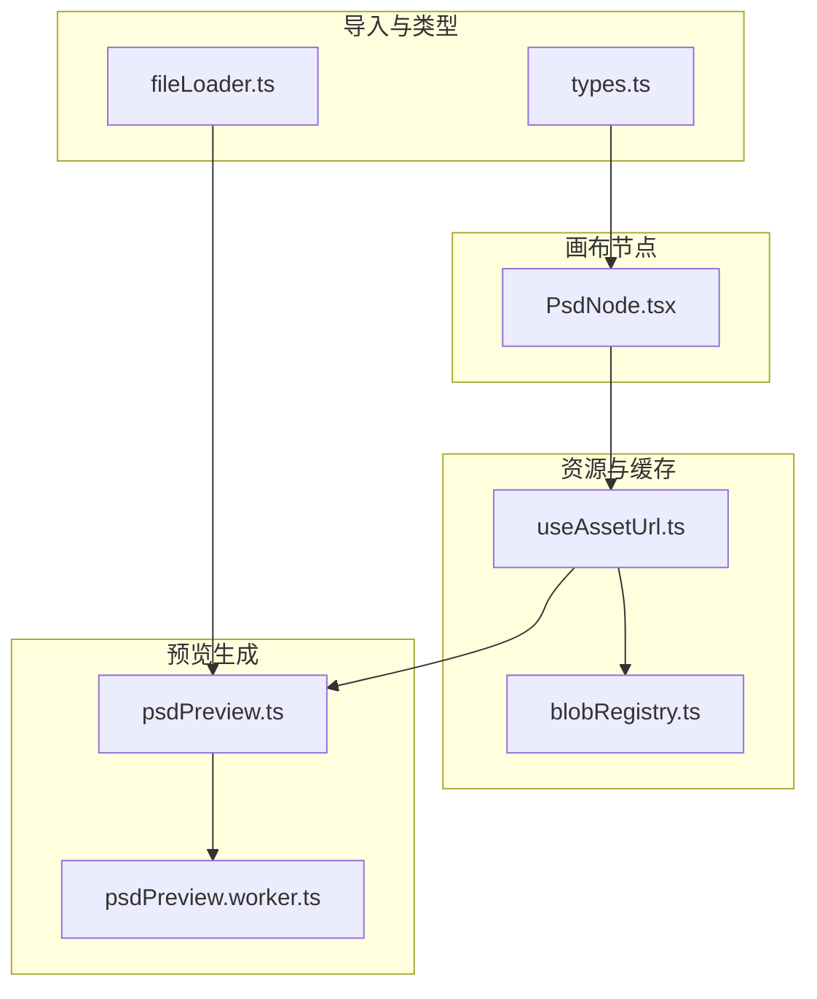
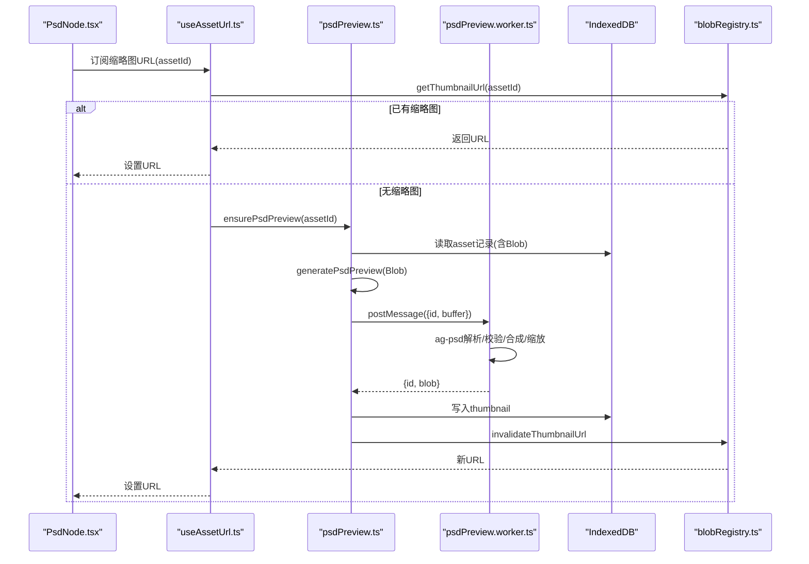
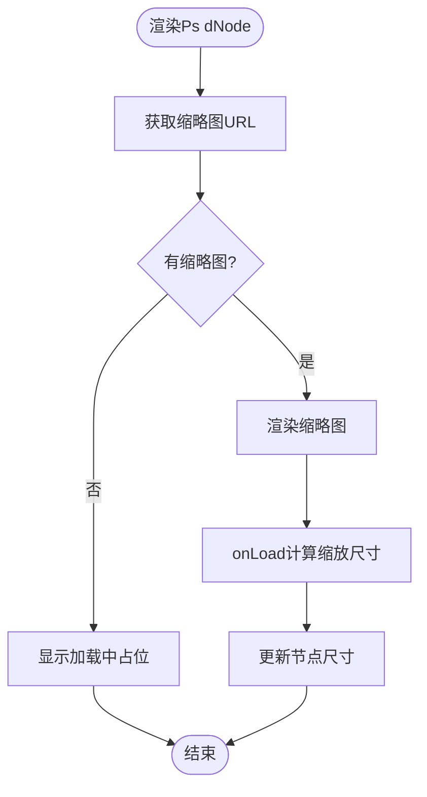
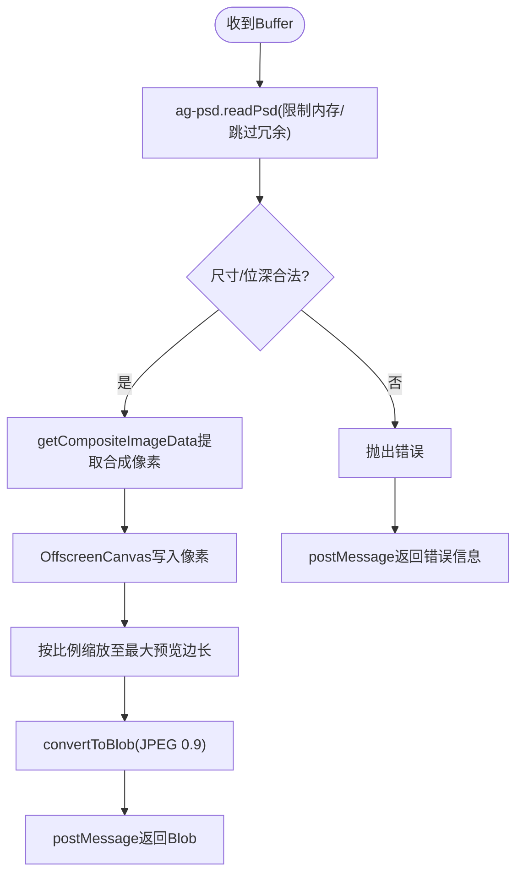
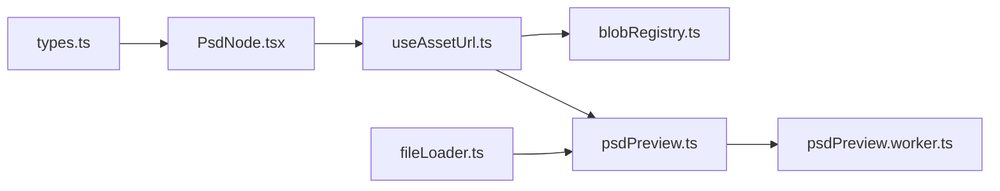

# PSD 节点 (PsdNode)

<cite>
**本文引用的文件**
- [src/canvas/nodes/PsdNode.tsx](file://src/canvas/nodes/PsdNode.tsx)
- [src/media/psdPreview.ts](file://src/media/psdPreview.ts)
- [src/media/psdPreview.worker.ts](file://src/media/psdPreview.worker.ts)
- [src/media/useAssetUrl.ts](file://src/media/useAssetUrl.ts)
- [src/media/blobRegistry.ts](file://src/media/blobRegistry.ts)
- [src/io/fileLoader.ts](file://src/io/fileLoader.ts)
- [src/types.ts](file://src/types.ts)
- [package-lock.json](file://package-lock.json)
</cite>

## 目录
1. [简介](#简介)
2. [项目结构](#项目结构)
3. [核心组件](#核心组件)
4. [架构总览](#架构总览)
5. [详细组件分析](#详细组件分析)
6. [依赖关系分析](#依赖关系分析)
7. [性能与内存管理](#性能与内存管理)
8. [故障排查指南](#故障排查指南)
9. [结论](#结论)
10. [附录：配置与扩展示例](#附录：配置与扩展示例)

## 简介
本技术文档围绕 PsdNode（PSD 节点）展开，系统性说明其在画布中的渲染、预览生成、Worker 线程处理、大文件策略以及错误恢复机制。重点涵盖 ag-psd 库集成、PSD 解析流程、图层合成预览生成、缩略图缓存与失效、并发控制与内存限制等实现细节，并提供可操作的配置与扩展方法。

## 项目结构
PSD 节点相关代码主要分布在以下模块：
- 画布节点层：PsdNode.tsx 负责在 ReactFlow 中渲染 PSD 节点、尺寸自适应、打开预览与下载原始文件。
- 媒体资源层：blobRegistry.ts 提供资产 URL/缩略图获取与缓存；useAssetUrl.ts 提供 React Hook 以订阅资源与缩略图状态。
- 预览生成层：psdPreview.ts 封装 Worker 通信与队列；psdPreview.worker.ts 使用 ag-psd 在 Worker 中解析并生成 JPEG 缩略图。
- 导入流程：fileLoader.ts 在上传时触发 PSD 预览生成并持久化到 IndexedDB。
- 类型定义：types.ts 定义了 MediaKind 包含 'psd' 等类型。

图表来源
- [src/canvas/nodes/PsdNode.tsx:1-125](file://src/canvas/nodes/PsdNode.tsx#L1-L125)
- [src/media/useAssetUrl.ts:1-157](file://src/media/useAssetUrl.ts#L1-L157)
- [src/media/blobRegistry.ts:1-389](file://src/media/blobRegistry.ts#L1-L389)
- [src/media/psdPreview.ts:1-62](file://src/media/psdPreview.ts#L1-L62)
- [src/media/psdPreview.worker.ts:1-82](file://src/media/psdPreview.worker.ts#L1-L82)
- [src/io/fileLoader.ts:81-117](file://src/io/fileLoader.ts#L81-L117)
- [src/types.ts:1-112](file://src/types.ts#L1-L112)

章节来源
- [src/canvas/nodes/PsdNode.tsx:1-125](file://src/canvas/nodes/PsdNode.tsx#L1-L125)
- [src/media/useAssetUrl.ts:1-157](file://src/media/useAssetUrl.ts#L1-L157)
- [src/media/blobRegistry.ts:1-389](file://src/media/blobRegistry.ts#L1-L389)
- [src/media/psdPreview.ts:1-62](file://src/media/psdPreview.ts#L1-L62)
- [src/media/psdPreview.worker.ts:1-82](file://src/media/psdPreview.worker.ts#L1-L82)
- [src/io/fileLoader.ts:81-117](file://src/io/fileLoader.ts#L81-L117)
- [src/types.ts:1-112](file://src/types.ts#L1-L112)

## 核心组件
- PsdNode 组件：负责展示 PSD 缩略图、自动适配节点尺寸、打开大图预览、下载原始 PSD、协作锁定提示。
- usePsdPreviewUrl Hook：订阅缩略图 URL，若不存在则触发 ensurePsdPreview 生成并缓存。
- psdPreview 模块：维护 Worker 实例、请求队列、错误处理，将 Blob 转为 ArrayBuffer 发送给 Worker。
- psdPreview.worker：基于 ag-psd 读取 PSD，校验尺寸与位深，合成图像并缩放为 JPEG 缩略图返回。
- blobRegistry：统一资源与缩略图的获取、缓存、失效与并发控制。
- fileLoader：在导入文件时为 PSD 生成预览并落库，支持局域网与云端同步。

章节来源
- [src/canvas/nodes/PsdNode.tsx:1-125](file://src/canvas/nodes/PsdNode.tsx#L1-L125)
- [src/media/useAssetUrl.ts:129-157](file://src/media/useAssetUrl.ts#L129-L157)
- [src/media/psdPreview.ts:1-62](file://src/media/psdPreview.ts#L1-L62)
- [src/media/psdPreview.worker.ts:1-82](file://src/media/psdPreview.worker.ts#L1-L82)
- [src/media/blobRegistry.ts:1-389](file://src/media/blobRegistry.ts#L1-L389)
- [src/io/fileLoader.ts:81-117](file://src/io/fileLoader.ts#L81-L117)

## 架构总览
PSD 预览的端到端流程如下：
- 节点渲染阶段：PsdNode 通过 usePsdPreviewUrl 获取缩略图 URL；若无则调用 ensurePsdPreview。
- 预览生成阶段：ensurePsdPreview 从 IndexedDB 获取资产 Blob，调用 generatePsdPreview 进入队列并通过 Worker 异步生成。
- Worker 解析阶段：psdPreview.worker 使用 ag-psd 读取 PSD，进行尺寸/位深校验，合成像素数据并缩放为 JPEG。
- 结果回传与缓存：Worker 返回 Blob，主线程写入 IndexedDB 并更新缩略图 URL 缓存，节点重新渲染。

图表来源
- [src/canvas/nodes/PsdNode.tsx:1-125](file://src/canvas/nodes/PsdNode.tsx#L1-L125)
- [src/media/useAssetUrl.ts:129-157](file://src/media/useAssetUrl.ts#L129-L157)
- [src/media/psdPreview.ts:1-62](file://src/media/psdPreview.ts#L1-L62)
- [src/media/psdPreview.worker.ts:1-82](file://src/media/psdPreview.worker.ts#L1-L82)
- [src/media/blobRegistry.ts:1-389](file://src/media/blobRegistry.ts#L1-L389)

## 详细组件分析

### PsdNode 组件
- 功能要点
  - 使用 usePsdPreviewUrl 获取缩略图 URL，未就绪时显示“正在生成 PSD 预览”。
  - 图片加载完成后根据自然宽高计算缩放比例，动态调整节点尺寸，确保在最大宽高内完整显示。
  - 双击或点击按钮打开大图预览；提供下载原始 PSD 的入口。
  - 协作编辑场景下，若被其他用户锁定，则阻止操作并提示。
- 关键交互
  - NodeResizer 控制节点尺寸变化，并在开始/结束时标记 LAN 编辑状态。
  - 右上角工具栏提供“打开预览”和“下载原文件”两个动作。

图表来源
- [src/canvas/nodes/PsdNode.tsx:1-125](file://src/canvas/nodes/PsdNode.tsx#L1-L125)

章节来源
- [src/canvas/nodes/PsdNode.tsx:1-125](file://src/canvas/nodes/PsdNode.tsx#L1-L125)

### usePsdPreviewUrl Hook
- 职责
  - 优先尝试获取已存在的缩略图 URL；若不存在，调用 ensurePsdPreview 生成并再次获取。
  - 捕获异常并给出友好提示，避免阻塞界面。
- 行为特性
  - 生命周期清理防止悬挂任务。
  - 与 blobRegistry 的缩略图缓存联动，保证刷新后仍可用。

章节来源
- [src/media/useAssetUrl.ts:129-157](file://src/media/useAssetUrl.ts#L129-L157)
- [src/media/blobRegistry.ts:310-379](file://src/media/blobRegistry.ts#L310-L379)

### psdPreview 模块（主线程）
- 职责
  - 维护唯一 Worker 实例，处理消息收发与错误恢复。
  - 使用 Promise 队列串行化预览生成任务，避免同时解码多个大文件导致内存峰值过高。
  - 将 Blob 转换为 ArrayBuffer 并通过 transferable 对象高效传输给 Worker。
- 错误处理
  - Worker 出错时清空 pending 队列并重建 Worker。
  - 单个请求失败不影响后续请求。

章节来源
- [src/media/psdPreview.ts:1-62](file://src/media/psdPreview.ts#L1-L62)

### psdPreview.worker（Worker 线程）
- 职责
  - 初始化 ag-psd 的 OffscreenCanvas/ImageData 适配器。
  - 读取 PSD 并进行安全校验：
    - 维度上限：单边不超过 12000，总像素不超过 4000 万。
    - 仅支持 8-bit 通道深度。
  - 使用 getCompositeImageData 获取合成图像像素数据。
  - 创建源 OffscreenCanvas 写入像素，再按最大预览边长（2400）等比缩放生成目标 OffscreenCanvas。
  - 输出 JPEG Blob（质量 0.9）返回主线程。
- 内存与性能
  - 通过 totalMemoryLimit 限制解码内存占用。
  - 跳过不必要的图层数据与链接文件以降低开销。

图表来源
- [src/media/psdPreview.worker.ts:1-82](file://src/media/psdPreview.worker.ts#L1-L82)

章节来源
- [src/media/psdPreview.worker.ts:1-82](file://src/media/psdPreview.worker.ts#L1-L82)

### 导入与存储链路（fileLoader 与 blobRegistry）
- 导入时
  - 识别文件类型为 PSD，调用 generatePsdPreview 生成缩略图。
  - 将资产与缩略图写入 IndexedDB，并尝试同步到局域网与云端。
- 运行时
  - getAssetUrl/getThumbnailUrl 提供 URL 访问，支持本地缓存、HTTP 流式地址与局域网同步。
  - 缩略图缓存失效时主动重建 URL，确保 UI 及时刷新。

章节来源
- [src/io/fileLoader.ts:81-117](file://src/io/fileLoader.ts#L81-L117)
- [src/media/blobRegistry.ts:84-126](file://src/media/blobRegistry.ts#L84-L126)
- [src/media/blobRegistry.ts:310-379](file://src/media/blobRegistry.ts#L310-L379)

## 依赖关系分析
- 外部依赖
  - ag-psd：用于 PSD 解析与合成图像提取，版本由包管理器锁定。
- 内部依赖
  - PsdNode 依赖 useAssetUrl 提供的缩略图 URL。
  - useAssetUrl 依赖 blobRegistry 的缩略图获取能力。
  - psdPreview 依赖 Worker 与 IndexedDB。
  - fileLoader 在导入阶段触发预览生成并落库。

图表来源
- [src/canvas/nodes/PsdNode.tsx:1-125](file://src/canvas/nodes/PsdNode.tsx#L1-L125)
- [src/media/useAssetUrl.ts:1-157](file://src/media/useAssetUrl.ts#L1-L157)
- [src/media/blobRegistry.ts:1-389](file://src/media/blobRegistry.ts#L1-L389)
- [src/media/psdPreview.ts:1-62](file://src/media/psdPreview.ts#L1-L62)
- [src/media/psdPreview.worker.ts:1-82](file://src/media/psdPreview.worker.ts#L1-L82)
- [src/io/fileLoader.ts:81-117](file://src/io/fileLoader.ts#L81-L117)
- [src/types.ts:1-112](file://src/types.ts#L1-L112)

章节来源
- [package-lock.json:2022-2031](file://package-lock.json#L2022-L2031)
- [src/types.ts:1-112](file://src/types.ts#L1-L112)

## 性能与内存管理
- 并发控制
  - 主线程使用 Promise 队列串行化 PSD 预览生成，避免多文件同时解码造成内存尖峰。
  - 视频缩略图抓帧有独立并发限制，避免阻塞播放。
- 内存限制
  - Worker 中通过 totalMemoryLimit 限制 ag-psd 解码内存。
  - 对超大 PSD（维度或像素超限）直接拒绝，防止 OOM。
- 数据传输优化
  - 使用 transferable ArrayBuffer 减少拷贝开销。
  - 缩略图采用 JPEG 压缩降低体积。
- 缓存与失效
  - 缩略图 URL 与资源 URL 均缓存于 Map，必要时通过 invalidate* 函数释放 Object URL 并重建。
- 大文件策略
  - 对于无法生成预览的 PSD，仍可下载原始文件，保障可用性。
  - 导入时即生成缩略图，避免首次渲染时的延迟。

[本节为通用性能建议与实现总结，不直接分析具体代码行]

## 故障排查指南
- 常见错误与定位
  - “PSD 维度超出预览限制”：检查 PSD 尺寸是否超过单边 12000 或总像素超过 4000 万。
  - “仅支持 8-bit PSD 预览”：确认位深是否为 8。
  - “PSD 没有合成图像”：确认 PSD 是否包含可见的合成层。
  - “PSD 预览仍在生成”：等待缩略图生成完成后再打开预览。
  - “资源加载失败”：检查资产是否存在、网络/局域网传输是否完成。
- 处理建议
  - 查看控制台日志与 toast 提示，定位失败阶段。
  - 若 Worker 崩溃，主线程会重建 Worker 并清空待处理请求。
  - 对于超大或复杂 PSD，考虑先裁剪或降分辨率后再导入。

章节来源
- [src/media/psdPreview.worker.ts:41-82](file://src/media/psdPreview.worker.ts#L41-L82)
- [src/media/psdPreview.ts:15-40](file://src/media/psdPreview.ts#L15-L40)
- [src/media/useAssetUrl.ts:129-157](file://src/media/useAssetUrl.ts#L129-L157)
- [src/io/fileLoader.ts:81-117](file://src/io/fileLoader.ts#L81-L117)

## 结论
PsdNode 通过分层设计实现了高效的 PSD 预览与渲染：节点层负责交互与尺寸自适应，资源层提供统一的 URL 与缓存管理，预览层借助 Worker 与 ag-psd 完成安全的解析与合成，导入层在入库时即生成缩略图以提升体验。整体方案在并发、内存、错误恢复方面均有完善策略，适合处理大文件与复杂场景。

[本节为总结性内容，不直接分析具体代码行]

## 附录：配置与扩展示例
- 节点配置选项（来自 SuqNodeData）
  - kind: 'psd'
  - assetId: 关联的素材 ID
  - label: 文件名或自定义名称
  - width/height: 初始尺寸（可由 onLoad 自动计算）
  - borderColor/backgroundColo r: 样式定制
  - createdByName/createdAt: 协作元信息
  - 参考路径：[src/types.ts:66-98](file://src/types.ts#L66-L98)
- 自定义 PSD 功能扩展点
  - 修改 Worker 中的尺寸与质量参数：
    - MAX_DOCUMENT_SIDE/MAX_DOCUMENT_PIXELS/MAX_PREVIEW_SIDE
    - JPEG quality 与缩放策略
    - 参考路径：[src/media/psdPreview.worker.ts:3-80](file://src/media/psdPreview.worker.ts#L3-L80)
  - 调整主线程队列与重试策略：
    - 队列长度、错误重试次数、超时时间
    - 参考路径：[src/media/psdPreview.ts:10-47](file://src/media/psdPreview.ts#L10-L47)
  - 扩展导入流程：
    - 在 fileLoader 中增加额外预处理（如预裁剪、格式转换）
    - 参考路径：[src/io/fileLoader.ts:81-117](file://src/io/fileLoader.ts#L81-L117)
  - 自定义缩略图缓存策略：
    - 调整缓存失效时机与并发限制
    - 参考路径：[src/media/blobRegistry.ts:12-51](file://src/media/blobRegistry.ts#L12-L51)

章节来源
- [src/types.ts:66-98](file://src/types.ts#L66-L98)
- [src/media/psdPreview.worker.ts:3-80](file://src/media/psdPreview.worker.ts#L3-L80)
- [src/media/psdPreview.ts:10-47](file://src/media/psdPreview.ts#L10-L47)
- [src/io/fileLoader.ts:81-117](file://src/io/fileLoader.ts#L81-L117)
- [src/media/blobRegistry.ts:12-51](file://src/media/blobRegistry.ts#L12-L51)