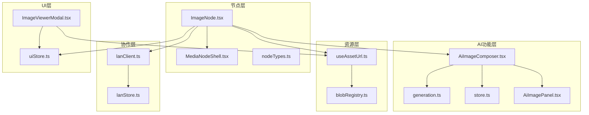
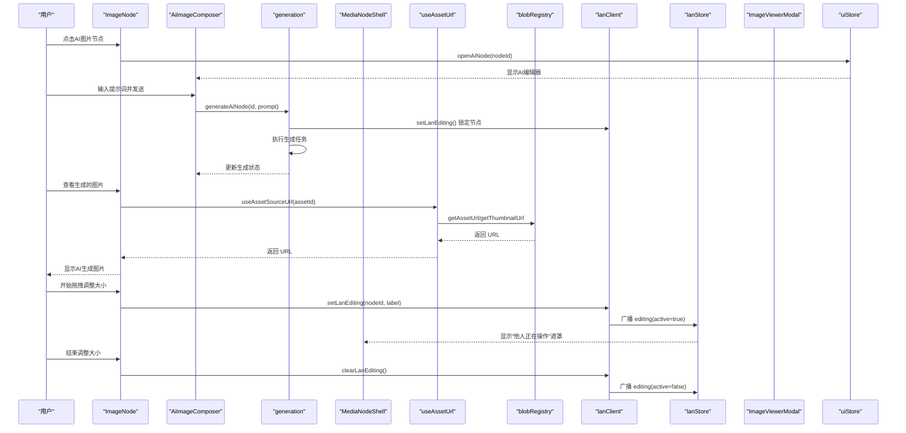
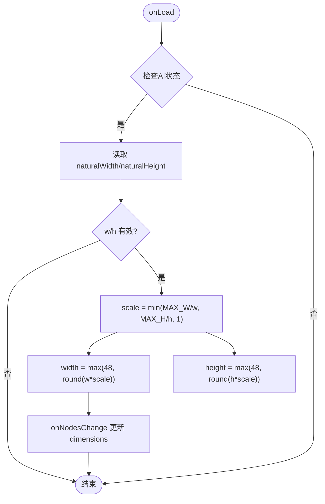
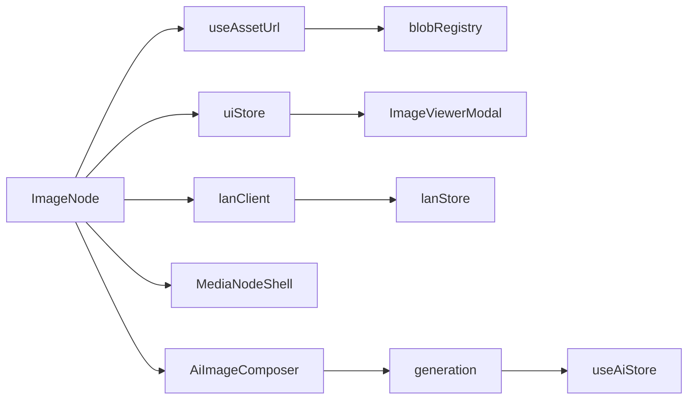

# 图片节点 (ImageNode)

<cite>
**本文引用的文件**
- [src/canvas/nodes/ImageNode.tsx](file://src/canvas/nodes/ImageNode.tsx)
- [src/components/ImageViewerModal.tsx](file://src/components/ImageViewerModal.tsx)
- [src/canvas/nodes/MediaNodeShell.tsx](file://src/canvas/nodes/MediaNodeShell.tsx)
- [src/media/useAssetUrl.ts](file://src/media/useAssetUrl.ts)
- [src/media/blobRegistry.ts](file://src/media/blobRegistry.ts)
- [src/sync/lanClient.ts](file://src/sync/lanClient.ts)
- [src/store/uiStore.ts](file://src/store/uiStore.ts)
- [src/store/lanStore.ts](file://src/store/lanStore.ts)
- [src/types.ts](file://src/types.ts)
- [src/canvas/nodes/nodeTypes.ts](file://src/canvas/nodes/nodeTypes.ts)
- [src/components/AiImageComposer.tsx](file://src/components/AiImageComposer.tsx)
- [src/ai/generation.ts](file://src/ai/generation.ts)
- [src/ai/store.ts](file://src/ai/store.ts)
- [src/components/AiImagePanel.tsx](file://src/components/AiImagePanel.tsx)
- [src/io/fileLoader.ts](file://src/io/fileLoader.ts)
</cite>

## 更新摘要
**变更内容**
- 新增AI生成内容支持，包括AI元数据、状态管理和视觉指示器
- 添加AI生成状态动画反馈和"AI"徽章显示
- 实现传统资产图片与AI生成内容的无缝切换
- 集成AI图片编辑器面板和生成流程管理
- 增强协作锁定机制以支持AI生成任务

## 目录
1. [简介](#简介)
2. [项目结构](#项目结构)
3. [核心组件](#核心组件)
4. [架构总览](#架构总览)
5. [详细组件分析](#详细组件分析)
6. [依赖关系分析](#依赖关系分析)
7. [性能考量](#性能考量)
8. [故障排查指南](#故障排查指南)
9. [结论](#结论)
10. [附录：配置与用法示例](#附录：配置与用法示例)

## 简介
本技术文档聚焦于图片节点 ImageNode 的实现原理与使用方式，涵盖以下关键点：
- **AI生成内容支持**：完整的AI图片生成工作流，包括提示词编辑、参数配置、生成状态跟踪
- **智能视觉指示器**：AI生成状态动画、"AI"徽章、生成进度反馈
- **双模式图片处理**：传统资产图片与AI生成内容的无缝切换
- 图片加载机制与懒加载优化策略（含局域网分片传输、重试与占位层动画）
- 自动尺寸适配算法（基于最大宽高限制与最小尺寸约束）
- 缩放控制与非等比缩放（NodeResizer、最小尺寸 48x48px）
- 图片预览功能（双击打开大图查看器、下载）
- 局域网协作编辑锁定（setLanEditing / clearLanEditing）
- 图片加载状态管理（占位层、淡入效果、错误处理）
- 具体配置项与使用方法（通过 SuqNodeData 描述）

## 项目结构
ImageNode 属于画布节点体系的一部分，位于 canvas/nodes 目录下，并通过 nodeTypes 注册到 ReactFlow。其渲染外壳由 MediaNodeShell 提供，资源 URL 获取由 useAssetUrl 与 blobRegistry 负责，预览弹窗由 ImageViewerModal 实现，协作编辑锁定由 lanClient 与 lanStore 协同完成。**新增的AI功能**通过 AiImageComposer 组件和 ai/generation 模块提供支持。

**图表来源**
- [src/canvas/nodes/ImageNode.tsx:1-143](file://src/canvas/nodes/ImageNode.tsx#L1-L143)
- [src/components/AiImageComposer.tsx:1-96](file://src/components/AiImageComposer.tsx#L1-L96)
- [src/ai/generation.ts:1-215](file://src/ai/generation.ts#L1-L215)
- [src/ai/store.ts:1-44](file://src/ai/store.ts#L1-L44)
- [src/components/AiImagePanel.tsx:1-114](file://src/components/AiImagePanel.tsx#L1-L114)

## 核心组件
- **ImageNode**：图片节点渲染、自动尺寸适配、交互（双击预览、工具栏按钮）、协作锁定响应、NodeResizer 集成，**新增AI内容支持和状态管理**。
- **AiImageComposer**：**新增** AI图片编辑器面板，提供提示词输入、参数配置、生成控制和状态显示。
- **MediaNodeShell**：媒体节点通用外壳，提供连接手柄、选中态、底部信息栏、协作者遮挡提示。
- **useAssetUrl**：资源 URL 懒加载与重试，支持本地 IndexedDB、局域网 HTTP 流式地址、云端回退。
- **blobRegistry**：资源 Blob/缩略图缓存、HTTP Range 流式地址、抓帧生成封面、URL 生命周期管理。
- **ImageViewerModal**：全屏图片查看器，支持缩放、适应窗口、键盘快捷键、下载、PSD 预览。
- **lanClient / lanStore**：协作编辑锁定广播与状态同步，setLanEditing/clearLanEditing 在 NodeResizer 开始/结束时触发。
- **uiStore**：全局 UI 状态，包含图片查看器的开关与参数、**AI节点编辑状态管理**。
- **generation**：**新增** AI图片生成流程管理，包括任务创建、执行、结果处理和持久化。

**章节来源**
- [src/canvas/nodes/ImageNode.tsx:19-143](file://src/canvas/nodes/ImageNode.tsx#L19-L143)
- [src/components/AiImageComposer.tsx:14-96](file://src/components/AiImageComposer.tsx#L14-L96)
- [src/ai/generation.ts:152-181](file://src/ai/generation.ts#L152-L181)

## 架构总览
下图展示图片从插入到显示、预览、协作锁定的完整流程，**包含AI生成内容的完整工作流**。

**图表来源**
- [src/canvas/nodes/ImageNode.tsx:77-92](file://src/canvas/nodes/ImageNode.tsx#L77-L92)
- [src/components/AiImageComposer.tsx:60-83](file://src/components/AiImageComposer.tsx#L60-L83)
- [src/ai/generation.ts:152-181](file://src/ai/generation.ts#L152-L181)
- [src/sync/lanClient.ts:827-834](file://src/sync/lanClient.ts#L827-L834)

## 详细组件分析

### ImageNode 组件
- **AI内容支持与状态管理**
  - 检测 `props.data.ai` 字段判断是否为AI生成图片，支持三种状态：草稿(draft)、生成中(generating)、完成(done)、错误(error)
  - 通过 `useAiStore` 获取当前节点的生成任务状态，显示实时反馈
  - 根据AI状态动态渲染不同的界面元素：AI编辑器入口、生成进度指示、AI徽章
- **资源加载与懒加载**
  - 通过 useAssetUrl 获取图片 URL；该 Hook 内部会尝试本地 IndexedDB、局域网 HTTP 流式地址或云端下载，并在失败时进行有限次重试，避免局域网分片传输未完成导致的闪烁。
- **自动尺寸适配**
  - 图片 onLoad 后根据自然宽高计算缩放比例，以 MAX_W=480、MAX_H=360 为上限进行等比缩放，并设置最小尺寸为 48x48px；最终通过 onNodesChange 更新节点 dimensions。
- **缩放控制**
  - 使用 NodeResizer 暴露四角/边手柄，允许非等比缩放（keepAspectRatio=false），最小尺寸 48x48px；在开始/结束调整时分别调用 setLanEditing/clearLanEditing 通知协作端。
- **预览与下载**
  - 双击容器或点击"打开图片"按钮调用 openImageViewer；右上角工具栏提供下载链接，直接利用浏览器原生下载能力。
- **协作锁定**
  - 通过 lanStore 的 editing 状态判断是否被其他用户锁定；若锁定则隐藏 NodeResizer 并阻止交互，同时 MediaNodeShell 显示"他人正在操作"的遮罩提示。
- **加载状态与动画**
  - 使用 loaded 状态控制图片淡入；占位层在加载中呈现脉动动画，图片到达后交叉淡出，提升视觉过渡体验。

**图表来源**
- [src/canvas/nodes/ImageNode.tsx:46-63](file://src/canvas/nodes/ImageNode.tsx#L46-L63)

**章节来源**
- [src/canvas/nodes/ImageNode.tsx:19-143](file://src/canvas/nodes/ImageNode.tsx#L19-L143)

### AiImageComposer 组件
- **AI图片编辑器面板**：**新增** 浮动面板，提供提示词输入、参数配置、生成控制
- **智能定位**：根据节点位置和视口自动计算最佳显示位置，避免超出屏幕边界
- **实时状态反馈**：显示生成进度、错误信息、任务状态
- **提示词优化**：集成LLM模型优化提示词，提升生成质量
- **参数配置**：支持选择生成参数来源（当前设置或原图参数）

**章节来源**
- [src/components/AiImageComposer.tsx:14-96](file://src/components/AiImageComposer.tsx#L14-L96)

### MediaNodeShell 外壳
- 提供统一边框、选中态、底部名称栏、创建者标注、进度遮罩（用于音视频）。
- 四条边的连接热区在连线模式下启用，便于快速建立边。
- 当检测到协作锁定（editing 存在且非当前用户）时，拦截指针事件并显示遮罩，防止误操作。

**章节来源**
- [src/canvas/nodes/MediaNodeShell.tsx:32-151](file://src/canvas/nodes/MediaNodeShell.tsx#L32-L151)

### 资源加载与懒加载（useAssetUrl / blobRegistry）
- **useAssetUrl**
  - 对 assetId 进行惰性请求，最多重试若干次，延迟重试以应对局域网分片传输尚未就绪的情况。
  - 失败时通过 toast 提示"资源加载失败"。
- **blobRegistry**
  - getAssetUrl：优先本地 IndexedDB，其次局域网 HTTP Range 流式地址，最后拉取完整 Blob 并转为 object URL。
  - getThumbnailUrl：优先局域网同步来的封面，否则本地记录或抓帧生成视频封面；支持并发控制与跨源抓取。
  - 管理 URL 生命周期（revokeObjectURL），避免内存泄漏。

**章节来源**
- [src/media/useAssetUrl.ts:10-44](file://src/media/useAssetUrl.ts#L10-L44)
- [src/media/blobRegistry.ts:84-126](file://src/media/blobRegistry.ts#L84-L126)
- [src/media/blobRegistry.ts:310-379](file://src/media/blobRegistry.ts#L310-L379)

### 图片预览（ImageViewerModal）
- 打开来源：ImageNode 双击或按钮触发 openImageViewer。
- 视图行为：
  - 支持滚轮缩放、键盘 +/−/0 缩放、点击空白关闭。
  - 自动适应窗口：根据视口尺寸计算 fitZoom，初始显示为适合窗口的大小。
  - 下载：直接使用 downloadUrl 触发浏览器下载。
  - PSD 预览：若为缩略图模式，可下载原始 PSD 并在 Photoshop 中打开。
- 资源来源：useAssetSourceUrl 根据 thumbnail 标志选择原图或缩略图 URL。

**章节来源**
- [src/components/ImageViewerModal.tsx:14-165](file://src/components/ImageViewerModal.tsx#L14-L165)
- [src/store/uiStore.ts:28-30](file://src/store/uiStore.ts#L28-L30)

### 协作编辑锁定（setLanEditing / clearLanEditing）
- **触发时机**：
  - NodeResizer 开始调整：setLanEditing(nodeId, label) 广播"正在编辑"，其他用户看到遮罩并禁止操作。
  - NodeResizer 结束调整：clearLanEditing() 广播"停止编辑"，解除锁定。
  - **AI生成任务**：generateAiNode 过程中也会调用锁定机制，防止多用户同时编辑同一节点。
- **状态存储**：lanStore.editing 维护每个用户的编辑目标节点与时间戳，供界面实时渲染。
- **网络传播**：通过 roomSend('editing', ...) 将 active 状态同步至局域网内其他客户端。

**章节来源**
- [src/sync/lanClient.ts:827-841](file://src/sync/lanClient.ts#L827-L841)
- [src/store/lanStore.ts:31-80](file://src/store/lanStore.ts#L31-L80)
- [src/canvas/nodes/ImageNode.tsx:67-76](file://src/canvas/nodes/ImageNode.tsx#L67-L76)

### AI生成流程管理（generation）
- **任务创建与管理**：generateAiNode 创建AI生成任务，支持ComfyUI和兼容API两种服务模式
- **状态跟踪**：通过 useAiStore.jobs 跟踪每个任务的运行状态、消息和错误信息
- **结果处理**：applyAiTask 处理生成结果，自动应用到画布节点或保存到项目
- **错误恢复**：支持任务中断恢复，应用退出时清理进行中的任务
- **参数配置**：generationSettings 根据节点AI元数据和用户设置确定最终生成参数

**章节来源**
- [src/ai/generation.ts:152-181](file://src/ai/generation.ts#L152-L181)
- [src/ai/generation.ts:65-122](file://src/ai/generation.ts#L65-L122)

### 类型定义与节点注册
- **SuqNodeData**：包含 kind、assetId、label、mime、fileSize、borderColor 等字段，**新增 ai 字段**用于描述AI生成元数据，包括提示词、服务信息、生成状态等。
- **nodeTypes**：将 image 类型映射到 ImageNode，使 ReactFlow 能正确渲染。

**章节来源**
- [src/types.ts:66-82](file://src/types.ts#L66-L82)
- [src/canvas/nodes/nodeTypes.ts:14-16](file://src/canvas/nodes/nodeTypes.ts#L14-L16)

## 依赖关系分析
- **ImageNode 依赖**：
  - @xyflow/react 的 NodeResizer 与 NodeProps
  - 资源 URL：useAssetUrl → blobRegistry
  - UI 状态：uiStore（openImageViewer、openAiNode）
  - 协作状态：lanStore（editing）与 lanClient（setLanEditing/clearLanEditing）
  - 外壳：MediaNodeShell（统一样式与交互）
  - **AI功能**：AiImageComposer、useAiStore、generation
- **数据流向**：
  - 资源加载：useAssetUrl → blobRegistry → IndexedDB/局域网/云端
  - 预览：uiStore.imageViewer → ImageViewerModal → useAssetSourceUrl → blobRegistry
  - 协作：lanClient.roomSend → lanStore.editing → MediaNodeShell 遮罩
  - **AI生成**：AiImageComposer → generation → lanClient → 服务端 → 结果回调

**图表来源**
- [src/canvas/nodes/ImageNode.tsx:1-143](file://src/canvas/nodes/ImageNode.tsx#L1-L143)
- [src/components/AiImageComposer.tsx:1-96](file://src/components/AiImageComposer.tsx#L1-L96)
- [src/ai/generation.ts:1-215](file://src/ai/generation.ts#L1-L215)

## 性能考量
- **懒加载与重试**：useAssetUrl 对资源进行惰性加载与有限重试，减少不必要的网络请求与失败抖动。
- **本地缓存**：blobRegistry 优先使用 IndexedDB 中的 Blob，避免重复下载；对视频采用 HTTP Range 流式地址，边下边播，降低内存占用。
- **缩略图并发控制**：视频封面抓帧限制并发数，避免阻塞浏览器连接池。
- **自动尺寸适配**：基于固定最大宽高限制，确保节点在画布中保持合理尺寸，避免过大节点影响布局与渲染性能。
- **URL 生命周期管理**：及时 revokeObjectURL，防止内存泄漏。
- **AI任务管理**：generation 模块使用 AbortController 管理任务生命周期，支持中断和恢复，避免资源泄漏。
- **状态优化**：useAiStore 使用 Zustand 状态管理，仅订阅必要的数据变化，减少重渲染。

## 故障排查指南
- **图片无法加载**
  - 检查 useAssetUrl 的重试逻辑与 toast 提示；确认局域网连接与资产是否已就绪。
  - 若为视频封面问题，检查 blobRegistry 的抓帧逻辑与跨域配置。
- **预览无法打开**
  - 确认 uiStore.imageViewer 是否正确设置；检查 useAssetSourceUrl 返回的 URL 是否有效。
- **协作锁定异常**
  - 检查 setLanEditing/clearLanEditing 是否在 NodeResizer 的开始/结束事件中正确调用；确认 lanStore.editing 状态是否被其他用户覆盖。
- **尺寸异常**
  - 检查 onLoad 回调是否执行；确认 naturalWidth/naturalHeight 是否有效；验证 MAX_W/MAX_H 与最小尺寸 48px 的限制是否符合预期。
- **AI生成问题**
  - 检查 AiImageComposer 是否正确显示和绑定事件；确认 generation 模块的任务创建和执行逻辑。
  - 验证 AI 服务配置（ComfyUI 或兼容API）是否正确设置。
  - 检查网络请求和错误处理逻辑。

**章节来源**
- [src/media/useAssetUrl.ts:10-44](file://src/media/useAssetUrl.ts#L10-L44)
- [src/media/blobRegistry.ts:310-379](file://src/media/blobRegistry.ts#L310-L379)
- [src/sync/lanClient.ts:827-841](file://src/sync/lanClient.ts#L827-L841)
- [src/canvas/nodes/ImageNode.tsx:46-63](file://src/canvas/nodes/ImageNode.tsx#L46-L63)
- [src/ai/generation.ts:152-181](file://src/ai/generation.ts#L152-L181)

## 结论
ImageNode 通过结合懒加载、自动尺寸适配、协作锁定与预览下载等功能，提供了健壮且易用的图片节点能力。**新增的AI生成内容支持**进一步增强了节点的功能性，使其能够无缝集成AI图片生成工作流。其设计充分利用了本地缓存、局域网流式传输与 UI 状态管理，在保证用户体验的同时兼顾了性能与稳定性。对于团队协作场景，编辑锁定机制有效避免了冲突操作，提升了多端一致性。AI功能的加入使得图片节点不仅能够展示传统素材，还能作为AI创作的入口和结果展示载体。

## 附录：配置与用法示例
- **创建图片节点的基本配置（SuqNodeData）**
  - kind: 'image'
  - assetId: 资源标识符
  - label: 文件名或自定义标签
  - mime: 媒体类型（如 image/png、image/jpeg）
  - fileSize: 文件大小（可选）
  - borderColor: 边框颜色（可选）
  - **ai**: AI生成元数据（可选）
    - prompt: 提示词
    - provider: 服务提供商（comfy 或 compatible）
    - model: 模型名称
    - size: 图片尺寸
    - status: 生成状态（draft | generating | done | error）
- **典型用法路径参考**
  - 节点注册：[src/canvas/nodes/nodeTypes.ts:14-16](file://src/canvas/nodes/nodeTypes.ts#L14-L16)
  - 节点数据模型：[src/types.ts:66-82](file://src/types.ts#L66-L82)
  - AI节点创建：[src/io/fileLoader.ts:204-210](file://src/io/fileLoader.ts#L204-L210)
  - AI生成流程：[src/ai/generation.ts:152-181](file://src/ai/generation.ts#L152-L181)
  - AI编辑器面板：[src/components/AiImageComposer.tsx:60-83](file://src/components/AiImageComposer.tsx#L60-L83)

**章节来源**
- [src/canvas/nodes/nodeTypes.ts:14-16](file://src/canvas/nodes/nodeTypes.ts#L14-L16)
- [src/types.ts:66-82](file://src/types.ts#L66-L82)
- [src/io/fileLoader.ts:204-210](file://src/io/fileLoader.ts#L204-L210)
- [src/ai/generation.ts:152-181](file://src/ai/generation.ts#L152-L181)
- [src/components/AiImageComposer.tsx:60-83](file://src/components/AiImageComposer.tsx#L60-L83)