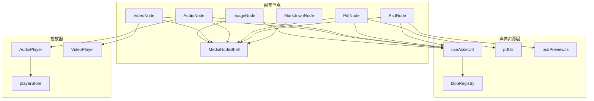
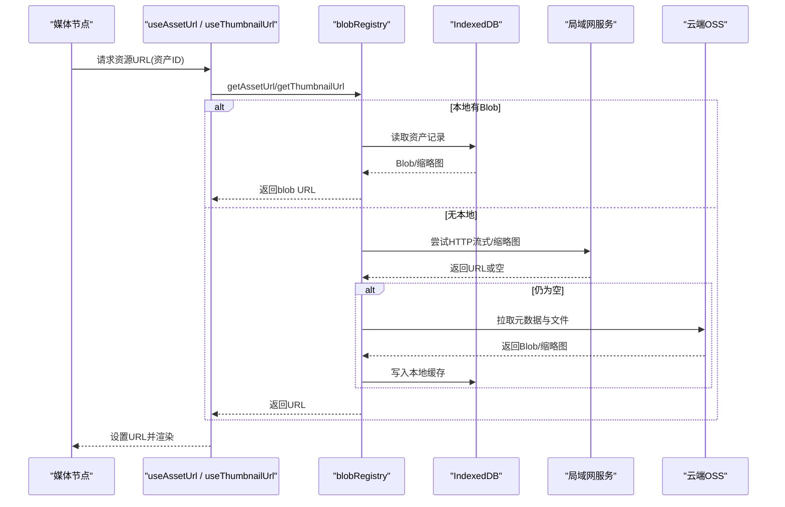
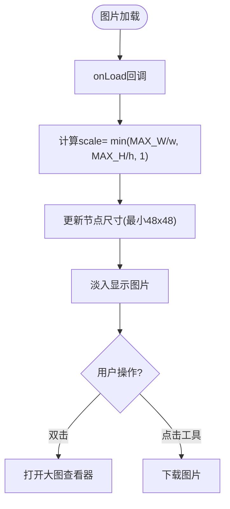
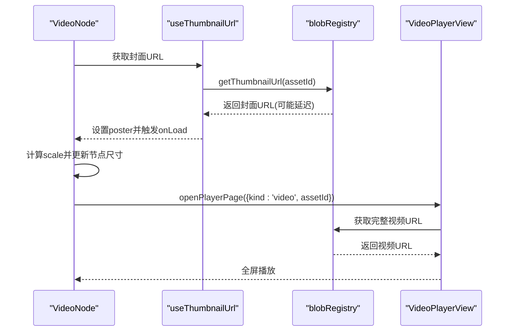
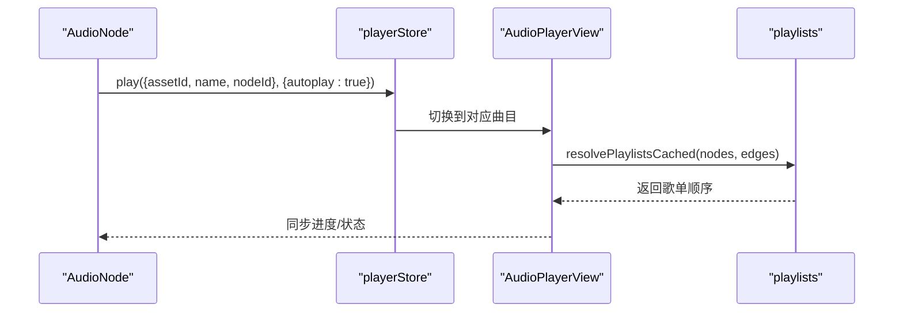
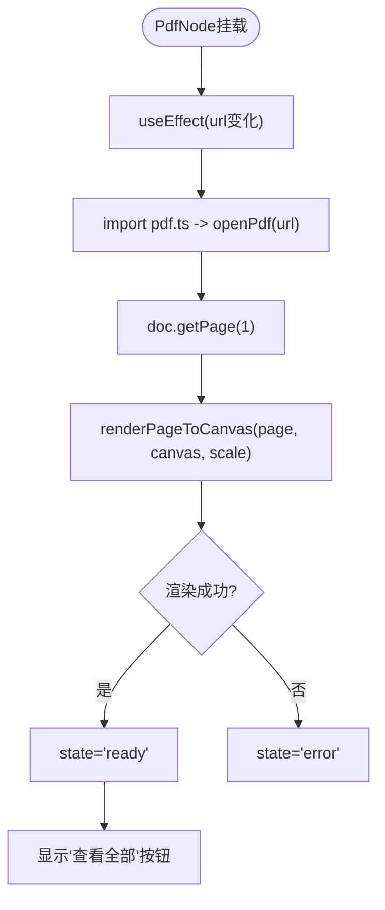
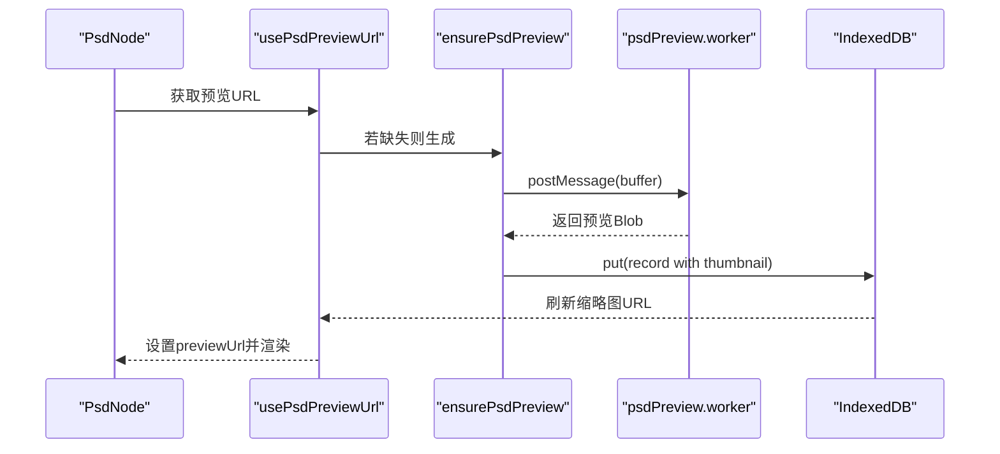
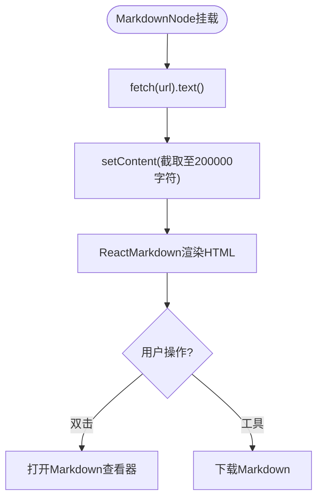
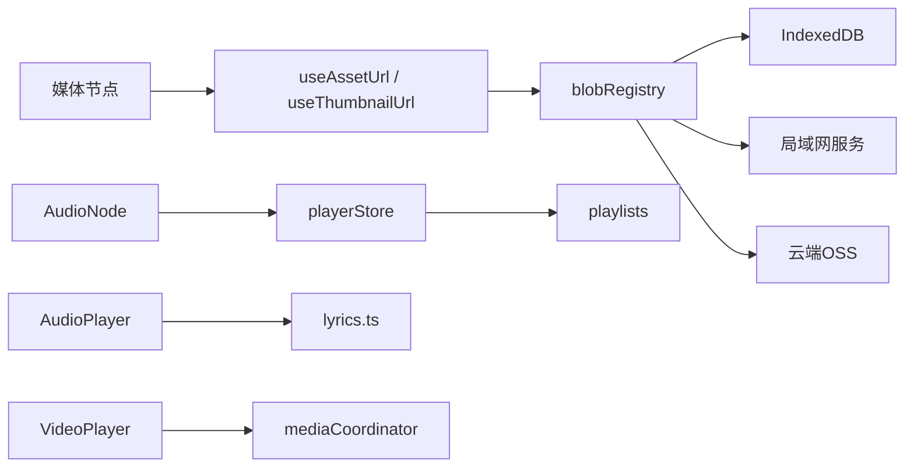

# 媒体节点

<cite>
**本文引用的文件**
- [ImageNode.tsx](file://src/canvas/nodes/ImageNode.tsx)
- [VideoNode.tsx](file://src/canvas/nodes/VideoNode.tsx)
- [AudioNode.tsx](file://src/canvas/nodes/AudioNode.tsx)
- [PdfNode.tsx](file://src/canvas/nodes/PdfNode.tsx)
- [PsdNode.tsx](file://src/canvas/nodes/PsdNode.tsx)
- [MarkdownNode.tsx](file://src/canvas/nodes/MarkdownNode.tsx)
- [MediaNodeShell.tsx](file://src/canvas/nodes/MediaNodeShell.tsx)
- [useAssetUrl.ts](file://src/media/useAssetUrl.ts)
- [blobRegistry.ts](file://src/media/blobRegistry.ts)
- [pdf.ts](file://src/media/pdf.ts)
- [psdPreview.ts](file://src/media/psdPreview.ts)
- [AudioPlayer.tsx](file://src/components/AudioPlayer.tsx)
- [VideoPlayer.tsx](file://src/components/VideoPlayer.tsx)
- [playerStore.ts](file://src/store/playerStore.ts)
- [lyrics.ts](file://src/media/lyrics.ts)
- [playlists.ts](file://src/media/playlists.ts)
</cite>

## 目录
1. [简介](#简介)
2. [项目结构](#项目结构)
3. [核心组件](#核心组件)
4. [架构总览](#架构总览)
5. [详细组件分析](#详细组件分析)
6. [依赖关系分析](#依赖关系分析)
7. [性能与优化](#性能与优化)
8. [故障排查指南](#故障排查指南)
9. [结论](#结论)
10. [附录：使用示例与配置项](#附录使用示例与配置项)

## 简介
本技术文档聚焦于画布中的媒体节点实现，覆盖图片、视频、音频、PDF、PSD 以及 Markdown 的渲染与交互机制。重点说明各节点的加载策略、缩放与裁剪、播放控制、可视化能力（频谱、歌词）、导航与搜索、以及统一的资源获取与缓存体系。同时提供架构图、时序图与流程图，帮助读者快速理解数据流与控制流。

## 项目结构
媒体节点位于 canvas/nodes 目录下，每个媒体类型一个 React 组件；通用外壳 MediaNodeShell 负责统一边框、连接点、底部信息栏、进度遮罩与局域网协作锁定提示。媒体资源通过 media 层进行统一获取与缓存（本地 IndexedDB、局域网 HTTP 流式、云端 OSS），播放器相关逻辑集中在 components 下的 AudioPlayer 与 VideoPlayer，以及 store/playerStore 中。

图表来源
- [ImageNode.tsx:15-126](file://src/canvas/nodes/ImageNode.tsx#L15-L126)
- [VideoNode.tsx:18-88](file://src/canvas/nodes/VideoNode.tsx#L18-L88)
- [AudioNode.tsx:18-126](file://src/canvas/nodes/AudioNode.tsx#L18-L126)
- [PdfNode.tsx:11-90](file://src/canvas/nodes/PdfNode.tsx#L11-L90)
- [PsdNode.tsx:15-125](file://src/canvas/nodes/PsdNode.tsx#L15-L125)
- [MarkdownNode.tsx:12-105](file://src/canvas/nodes/MarkdownNode.tsx#L12-L105)
- [MediaNodeShell.tsx:32-151](file://src/canvas/nodes/MediaNodeShell.tsx#L32-L151)
- [useAssetUrl.ts:10-157](file://src/media/useAssetUrl.ts#L10-L157)
- [blobRegistry.ts:84-389](file://src/media/blobRegistry.ts#L84-L389)
- [pdf.ts:1-50](file://src/media/pdf.ts#L1-L50)
- [psdPreview.ts:1-62](file://src/media/psdPreview.ts#L1-L62)
- [AudioPlayer.tsx:142-800](file://src/components/AudioPlayer.tsx#L142-L800)
- [VideoPlayer.tsx:58-800](file://src/components/VideoPlayer.tsx#L58-L800)
- [playerStore.ts:163-298](file://src/store/playerStore.ts#L163-L298)

章节来源
- [ImageNode.tsx:15-126](file://src/canvas/nodes/ImageNode.tsx#L15-L126)
- [VideoNode.tsx:18-88](file://src/canvas/nodes/VideoNode.tsx#L18-L88)
- [AudioNode.tsx:18-126](file://src/canvas/nodes/AudioNode.tsx#L18-L126)
- [PdfNode.tsx:11-90](file://src/canvas/nodes/PdfNode.tsx#L11-L90)
- [PsdNode.tsx:15-125](file://src/canvas/nodes/PsdNode.tsx#L15-L125)
- [MarkdownNode.tsx:12-105](file://src/canvas/nodes/MarkdownNode.tsx#L12-L105)
- [MediaNodeShell.tsx:32-151](file://src/canvas/nodes/MediaNodeShell.tsx#L32-L151)
- [useAssetUrl.ts:10-157](file://src/media/useAssetUrl.ts#L10-L157)
- [blobRegistry.ts:84-389](file://src/media/blobRegistry.ts#L84-L389)
- [pdf.ts:1-50](file://src/media/pdf.ts#L1-L50)
- [psdPreview.ts:1-62](file://src/media/psdPreview.ts#L1-L62)
- [AudioPlayer.tsx:142-800](file://src/components/AudioPlayer.tsx#L142-L800)
- [VideoPlayer.tsx:58-800](file://src/components/VideoPlayer.tsx#L58-L800)
- [playerStore.ts:163-298](file://src/store/playerStore.ts#L163-L298)

## 核心组件
- ImageNode：图片节点，支持自适应尺寸、双击打开大图、下载、局域网编辑锁定、加载占位与淡入过渡。
- VideoNode：视频节点，画布内仅显示封面缩略图与播放按钮，点击/双击进入全屏播放器页面，按需拉取完整视频。
- AudioNode：音频节点，显示封面、当前曲目进度、播放/暂停、下载；双击进入沉浸式播放器页，支持频谱、歌词、歌单。
- PdfNode：PDF 节点，动态加载 PDF 并渲染第一页到 Canvas，支持查看全部页面。
- PsdNode：PSD 节点，异步生成预览图，支持打开预览与下载原始 PSD。
- MarkdownNode：Markdown 节点，拉取文本并渲染为 HTML，支持打开查看器与下载。
- MediaNodeShell：统一外壳，提供连接点、底部名称栏、创建者角标、进度遮罩、局域网协作锁定提示。

章节来源
- [ImageNode.tsx:15-126](file://src/canvas/nodes/ImageNode.tsx#L15-L126)
- [VideoNode.tsx:18-88](file://src/canvas/nodes/VideoNode.tsx#L18-L88)
- [AudioNode.tsx:18-126](file://src/canvas/nodes/AudioNode.tsx#L18-L126)
- [PdfNode.tsx:11-90](file://src/canvas/nodes/PdfNode.tsx#L11-L90)
- [PsdNode.tsx:15-125](file://src/canvas/nodes/PsdNode.tsx#L15-L125)
- [MarkdownNode.tsx:12-105](file://src/canvas/nodes/MarkdownNode.tsx#L12-L105)
- [MediaNodeShell.tsx:32-151](file://src/canvas/nodes/MediaNodeShell.tsx#L32-L151)

## 架构总览
媒体节点通过 useAssetUrl/useThumbnailUrl 获取资源 URL，底层 blobRegistry 负责从本地 IndexedDB、局域网 HTTP 流式或云端 OSS 获取资源与缩略图，并提供并发控制与重试策略。PDF 与 PSD 分别通过 pdf.ts 与 psdPreview.ts 完成解析与预览生成。音频与视频在各自播放器页面中实现完整交互（播放控制、进度条、音量、全屏、画中画、频谱、歌词等）。

图表来源
- [useAssetUrl.ts:10-157](file://src/media/useAssetUrl.ts#L10-L157)
- [blobRegistry.ts:84-389](file://src/media/blobRegistry.ts#L84-L389)

章节来源
- [useAssetUrl.ts:10-157](file://src/media/useAssetUrl.ts#L10-L157)
- [blobRegistry.ts:84-389](file://src/media/blobRegistry.ts#L84-L389)

## 详细组件分析

### 图片节点（ImageNode）
- 功能要点
  - 使用 useAssetUrl 获取图片 URL，首次加载时根据自然宽高计算缩放比例，自动调整节点尺寸（最大宽高限制）。
  - 支持双击打开大图查看器、右上角工具栏打开/下载。
  - 局域网协作：当其他用户正在编辑时，禁止调整大小并显示锁定提示。
  - 加载体验：占位层脉动动画，图片到达后交叉淡入。
- 关键流程
  - 图片 onLoad → 计算 scale → onNodesChange 更新节点尺寸。
  - 打开大图前校验 URL 与 assetId，未就绪时提示“仍在加载”。
- 错误处理
  - 资源未就绪时禁用打开/下载操作，避免无效请求。

图表来源
- [ImageNode.tsx:39-56](file://src/canvas/nodes/ImageNode.tsx#L39-L56)
- [ImageNode.tsx:71-120](file://src/canvas/nodes/ImageNode.tsx#L71-L120)

章节来源
- [ImageNode.tsx:15-126](file://src/canvas/nodes/ImageNode.tsx#L15-L126)

### 视频节点（VideoNode）
- 功能要点
  - 画布内不内嵌播放器，仅显示封面缩略图与播放按钮，避免原生控件抢占指针影响拖拽。
  - 使用 useThumbnailUrl 获取封面，按缩略图原尺寸自适应节点大小。
  - 点击/双击打开全屏播放器页面，按需拉取完整视频。
- 关键流程
  - 封面 onLoad → 计算 scale → 更新节点尺寸（最小 96x72）。
  - openPlayerPage({ kind: 'video', assetId, name }) 进入播放器。
- 错误处理
  - 无封面时显示占位；打开播放器前校验 assetId。

图表来源
- [VideoNode.tsx:18-88](file://src/canvas/nodes/VideoNode.tsx#L18-L88)
- [blobRegistry.ts:310-379](file://src/media/blobRegistry.ts#L310-L379)
- [VideoPlayer.tsx:58-800](file://src/components/VideoPlayer.tsx#L58-L800)

章节来源
- [VideoNode.tsx:18-88](file://src/canvas/nodes/VideoNode.tsx#L18-L88)
- [blobRegistry.ts:310-379](file://src/media/blobRegistry.ts#L310-L379)
- [VideoPlayer.tsx:58-800](file://src/components/VideoPlayer.tsx#L58-L800)

### 音频节点（AudioNode）
- 功能要点
  - 显示封面、当前时间/时长、播放/暂停、下载；双击进入沉浸式播放器页。
  - 仅展示引擎当前曲目的进度；切到其他歌曲后归零。
  - 播放器页支持频谱可视化、歌词显示、播放列表、模式切换（顺序/循环/随机/单曲/流式）。
- 关键流程
  - toggle() 调用 playerStore.play/toggle，若文件管理器打开则不弹出悬浮窗。
  - 播放器页通过 playlists 模块解析画布连线得到流式顺序。
- 错误处理
  - 下载失败时 toast 提示；无 assetId 时禁用操作。

图表来源
- [AudioNode.tsx:18-126](file://src/canvas/nodes/AudioNode.tsx#L18-L126)
- [playerStore.ts:163-298](file://src/store/playerStore.ts#L163-L298)
- [playlists.ts:114-179](file://src/media/playlists.ts#L114-L179)
- [AudioPlayer.tsx:142-800](file://src/components/AudioPlayer.tsx#L142-L800)

章节来源
- [AudioNode.tsx:18-126](file://src/canvas/nodes/AudioNode.tsx#L18-L126)
- [playerStore.ts:163-298](file://src/store/playerStore.ts#L163-L298)
- [playlists.ts:114-179](file://src/media/playlists.ts#L114-L179)
- [AudioPlayer.tsx:142-800](file://src/components/AudioPlayer.tsx#L142-L800)

### PDF 节点（PdfNode）
- 功能要点
  - 动态导入 pdf.ts，openPdf(url) 加载文档，renderPageToCanvas 渲染第一页到 Canvas。
  - 更新节点数据 pageCount，提供“查看全部”入口打开 PDF 查看器。
  - 生命周期管理：组件卸载时清理 page 与 pdf handle。
- 关键流程
  - useEffect 监听 url → 加载 PDF → 获取第1页 → 计算 viewport scale → 渲染 → 状态切换 ready/loading/error。
- 错误处理
  - 渲染失败打印错误并显示“PDF 加载失败”。

图表来源
- [PdfNode.tsx:11-90](file://src/canvas/nodes/PdfNode.tsx#L11-L90)
- [pdf.ts:1-50](file://src/media/pdf.ts#L1-L50)

章节来源
- [PdfNode.tsx:11-90](file://src/canvas/nodes/PdfNode.tsx#L11-L90)
- [pdf.ts:1-50](file://src/media/pdf.ts#L1-L50)

### PSD 节点（PsdNode）
- 功能要点
  - 使用 usePsdPreviewUrl 获取预览图；若无则触发 ensurePsdPreview 生成预览并缓存。
  - 支持打开预览（ImageViewer）与下载原始 PSD。
  - 自适应节点尺寸（最小 120x90），局域网协作锁定。
- 关键流程
  - previewUrl 存在 → 显示预览图；不存在 → 显示“正在生成 PSD 预览”。
  - ensurePsdPreview 将 Blob 送入 Worker 生成缩略图，落库并刷新 URL。
- 错误处理
  - 预览生成失败 toast 提示；被锁定时提示“正在操作此元素”。

图表来源
- [PsdNode.tsx:15-125](file://src/canvas/nodes/PsdNode.tsx#L15-L125)
- [useAssetUrl.ts:129-157](file://src/media/useAssetUrl.ts#L129-L157)
- [psdPreview.ts:1-62](file://src/media/psdPreview.ts#L1-L62)

章节来源
- [PsdNode.tsx:15-125](file://src/canvas/nodes/PsdNode.tsx#L15-L125)
- [useAssetUrl.ts:129-157](file://src/media/useAssetUrl.ts#L129-L157)
- [psdPreview.ts:1-62](file://src/media/psdPreview.ts#L1-L62)

### Markdown 节点（MarkdownNode）
- 功能要点
  - 拉取 Markdown 文本（限制长度），使用 react-markdown 渲染为 HTML。
  - 支持打开查看器与下载；局域网协作锁定。
- 关键流程
  - useEffect 监听 url → fetch(url).text() → setContent(text.slice(0, 200000))。
- 错误处理
  - 加载失败 toast 提示。

图表来源
- [MarkdownNode.tsx:12-105](file://src/canvas/nodes/MarkdownNode.tsx#L12-L105)

章节来源
- [MarkdownNode.tsx:12-105](file://src/canvas/nodes/MarkdownNode.tsx#L12-L105)

## 依赖关系分析
- 资源获取
  - useAssetUrl/useThumbnailUrl 封装了重试与轮询逻辑，适配局域网传输场景。
  - blobRegistry 维护 urlCache 与 thumbCache，提供并发控制（THUMB_MAX_CONCURRENT）与兜底策略（HTTP 抓帧失败回退全量 Blob）。
- 播放器
  - playerStore 统一管理单一 <audio> 元素，提供播放、暂停、跳转、切歌、模式切换、队列管理。
  - AudioPlayer/VideoPlayer 作为视图层，绑定键盘快捷键、全屏、画中画、进度条、音量等交互。
- 歌单与流式播放
  - playlists 模块基于画布图结构解析歌单顺序，确保多视图一致。
  - 流式模式结合画布连线顺序，实现无缝切歌。

图表来源
- [useAssetUrl.ts:10-157](file://src/media/useAssetUrl.ts#L10-L157)
- [blobRegistry.ts:84-389](file://src/media/blobRegistry.ts#L84-L389)
- [playerStore.ts:163-298](file://src/store/playerStore.ts#L163-L298)
- [playlists.ts:114-179](file://src/media/playlists.ts#L114-L179)
- [lyrics.ts:1-206](file://src/media/lyrics.ts#L1-L206)

章节来源
- [useAssetUrl.ts:10-157](file://src/media/useAssetUrl.ts#L10-L157)
- [blobRegistry.ts:84-389](file://src/media/blobRegistry.ts#L84-L389)
- [playerStore.ts:163-298](file://src/store/playerStore.ts#L163-L298)
- [playlists.ts:114-179](file://src/media/playlists.ts#L114-L179)
- [lyrics.ts:1-206](file://src/media/lyrics.ts#L1-L206)

## 性能与优化
- 资源加载优化
  - 本地优先：优先使用 IndexedDB 中的 Blob，离线可用且减少网络开销。
  - 流式播放：视频走局域网 HTTP Range 流式地址，边下边播，避免整份下载到内存/磁盘。
  - 缩略图并发控制：限制同时抓帧数量，防止浏览器连接池阻塞。
  - 重试与轮询：useAssetUrl 最多重试 5 次；useThumbnailUrl 在局域网下持续轮询直至超时。
- 渲染优化
  - 图片/PSD 自适应缩放，限制最大宽高，避免过大节点导致重排。
  - PDF 仅渲染第一页到 Canvas，减少首屏压力。
  - Markdown 内容截取上限，避免超大文本阻塞渲染。
- 播放器优化
  - 音频：单一 <audio> 元素，避免多实例竞争；切歌时复用同一元素。
  - 视频：批量探测时长与缩略图，完成后释放临时 video 元素。
  - 频谱与歌词：仅在播放器页启用，降低画布节点复杂度。

[本节为通用指导，无需具体文件引用]

## 故障排查指南
- 资源加载失败
  - 现象：toast 提示“资源加载失败”或“Markdown 加载失败”。
  - 排查：检查 useAssetUrl 重试次数、局域网连接状态、OSS 配置；确认 blobRegistry 是否成功写入本地缓存。
- 视频封面黑图
  - 现象：缩略图为黑色或空白。
  - 排查：blobRegistry 内置黑帧检测与重新抓帧；确认跨源设置 crossOrigin 与服务器 CORS；必要时触发全量 Blob 兜底。
- PDF 渲染失败
  - 现象：显示“PDF 加载失败”。
  - 排查：检查 pdf.ts 的 workerSrc、cMapUrl、standardFontDataUrl、wasmUrl 路径是否正确；确认 BASE_URL 配置。
- PSD 预览失败
  - 现象：toast “PSD 无法预览，可能格式不受支持或文件过大”。
  - 排查：确认 Worker 正常启动；检查输入 Blob 是否为有效 PSD；查看控制台错误日志。
- 播放器无声音
  - 现象：点击播放无响应或无声。
  - 排查：确认 playerStore 已绑定全局 <audio> 元素；检查浏览器自动播放策略；查看 canplay/loadeddata 事件。

章节来源
- [useAssetUrl.ts:10-157](file://src/media/useAssetUrl.ts#L10-L157)
- [blobRegistry.ts:128-239](file://src/media/blobRegistry.ts#L128-L239)
- [pdf.ts:1-50](file://src/media/pdf.ts#L1-L50)
- [psdPreview.ts:1-62](file://src/media/psdPreview.ts#L1-L62)
- [playerStore.ts:72-88](file://src/store/playerStore.ts#L72-L88)

## 结论
媒体节点通过统一的资源获取层与播放器抽象，实现了图片、视频、音频、PDF、PSD 与 Markdown 的高效加载与渲染。借助局域网流式传输、本地缓存、并发控制与重试机制，系统在复杂网络环境下仍能提供稳定体验。播放器页进一步丰富了交互能力（频谱、歌词、全屏、画中画、歌单），满足多样化创作与演示需求。

[本节为总结性内容，无需具体文件引用]

## 附录：使用示例与配置项
- 图片节点
  - 用法：在画布中添加图片节点，自动根据图片自然尺寸缩放；双击打开大图；右上角可下载。
  - 配置项：MAX_W=480, MAX_H=360；最小尺寸 48x48。
  - 参考路径：[ImageNode.tsx:12-14](file://src/canvas/nodes/ImageNode.tsx#L12-L14), [ImageNode.tsx:39-56](file://src/canvas/nodes/ImageNode.tsx#L39-L56)
- 视频节点
  - 用法：添加视频节点，显示封面与播放按钮；点击/双击进入全屏播放器；支持进度条、音量、倍速、全屏、画中画。
  - 配置项：MAX_W=640, MAX_H=360；最小尺寸 96x72。
  - 参考路径：[VideoNode.tsx:10-11](file://src/canvas/nodes/VideoNode.tsx#L10-L11), [VideoPlayer.tsx:40-41](file://src/components/VideoPlayer.tsx#L40-L41)
- 音频节点
  - 用法：添加音频节点，显示封面与进度；点击播放/暂停；双击进入播放器页，支持频谱、歌词、歌单。
  - 配置项：播放器模式 sequential/loop/single/random/flow；歌词偏移持久化。
  - 参考路径：[AudioNode.tsx:11-16](file://src/canvas/nodes/AudioNode.tsx#L11-L16), [playerStore.ts:9-17](file://src/store/playerStore.ts#L9-L17), [lyrics.ts:1-12](file://src/media/lyrics.ts#L1-L12)
- PDF 节点
  - 用法：添加 PDF 节点，自动渲染第一页；点击“查看全部”进入 PDF 查看器。
  - 配置项：BASE_URL + 'pdfjs/' 资源路径；workerSrc 配置。
  - 参考路径：[PdfNode.tsx:19-62](file://src/canvas/nodes/PdfNode.tsx#L19-L62), [pdf.ts:7-16](file://src/media/pdf.ts#L7-L16)
- PSD 节点
  - 用法：添加 PSD 节点，自动生成预览图；支持打开预览与下载原始文件。
  - 配置项：最小尺寸 120x90；Worker 并发与队列。
  - 参考路径：[PsdNode.tsx:12-13](file://src/canvas/nodes/PsdNode.tsx#L12-L13), [psdPreview.ts:10-13](file://src/media/psdPreview.ts#L10-L13)
- Markdown 节点
  - 用法：添加 Markdown 节点，自动拉取文本并渲染；支持打开查看器与下载。
  - 配置项：内容截取上限 200000 字符。
  - 参考路径：[MarkdownNode.tsx:29-43](file://src/canvas/nodes/MarkdownNode.tsx#L29-L43)

章节来源
- [ImageNode.tsx:12-56](file://src/canvas/nodes/ImageNode.tsx#L12-L56)
- [VideoNode.tsx:10-11](file://src/canvas/nodes/VideoNode.tsx#L10-L11)
- [VideoPlayer.tsx:40-41](file://src/components/VideoPlayer.tsx#L40-L41)
- [AudioNode.tsx:11-16](file://src/canvas/nodes/AudioNode.tsx#L11-L16)
- [playerStore.ts:9-17](file://src/store/playerStore.ts#L9-L17)
- [lyrics.ts:1-12](file://src/media/lyrics.ts#L1-L12)
- [PdfNode.tsx:19-62](file://src/canvas/nodes/PdfNode.tsx#L19-L62)
- [pdf.ts:7-16](file://src/media/pdf.ts#L7-L16)
- [PsdNode.tsx:12-13](file://src/canvas/nodes/PsdNode.tsx#L12-L13)
- [psdPreview.ts:10-13](file://src/media/psdPreview.ts#L10-L13)
- [MarkdownNode.tsx:29-43](file://src/canvas/nodes/MarkdownNode.tsx#L29-L43)