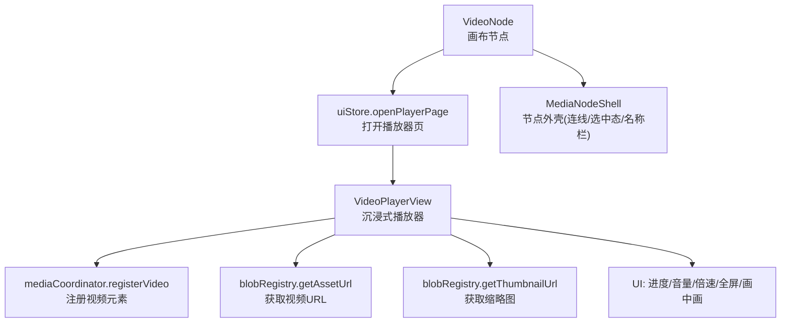
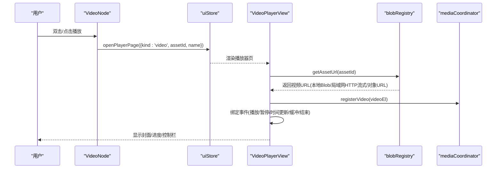
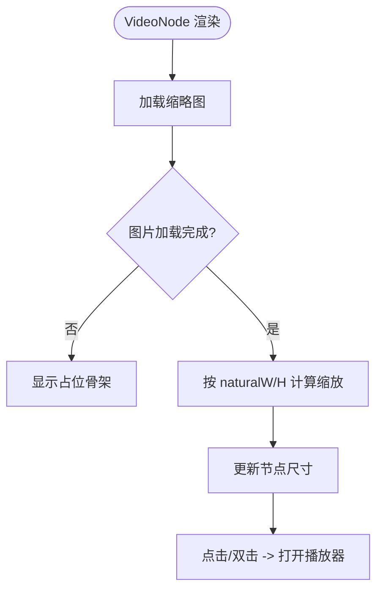
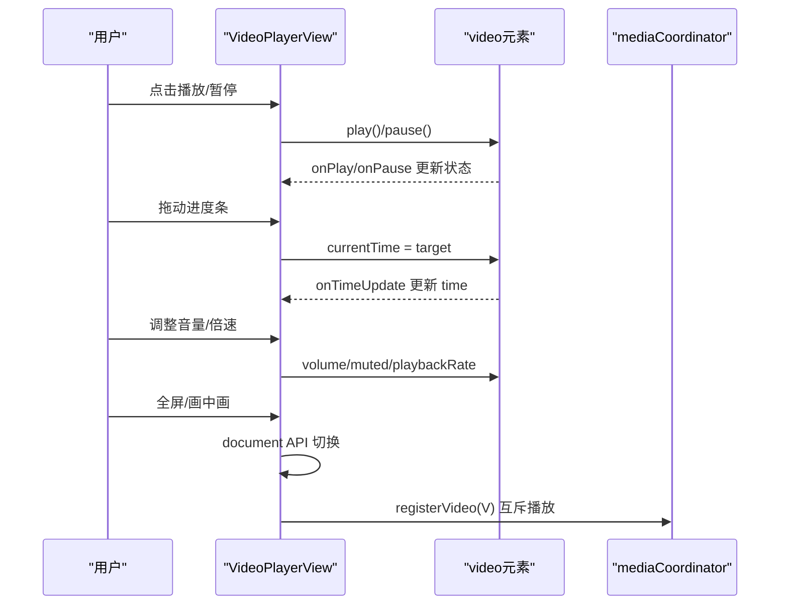
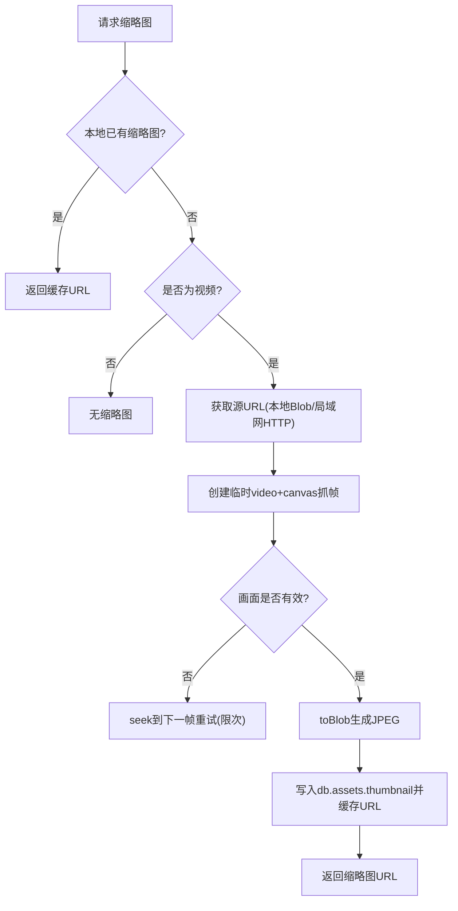
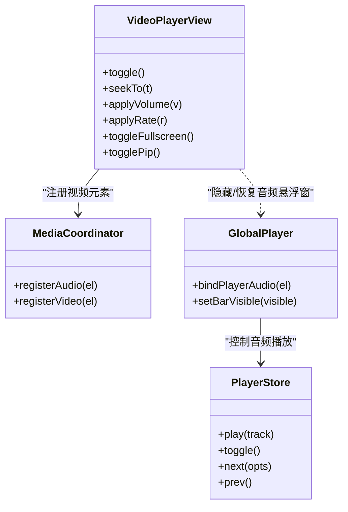
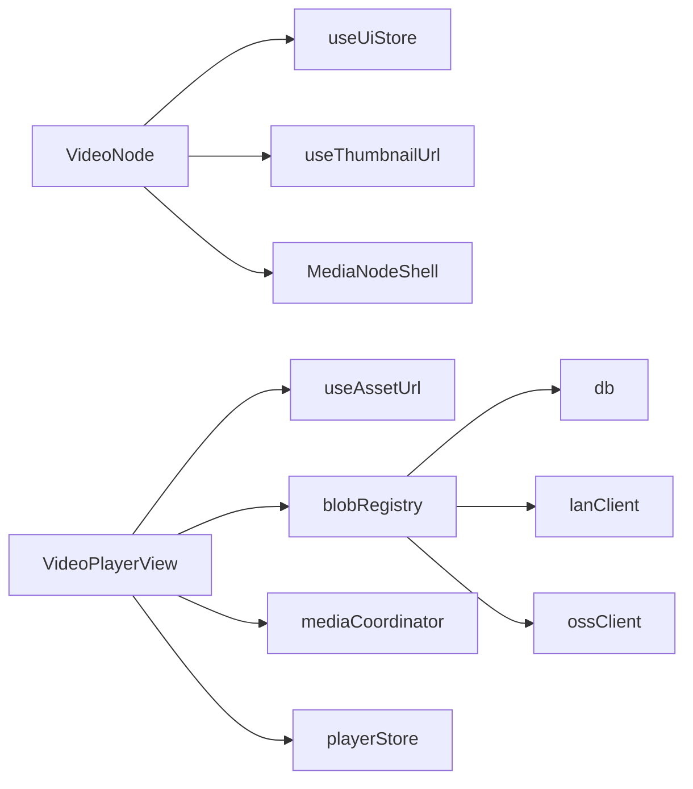

# 视频节点 (VideoNode)

<cite>
**本文引用的文件**
- [src/canvas/nodes/VideoNode.tsx](file://src/canvas/nodes/VideoNode.tsx)
- [src/components/VideoPlayer.tsx](file://src/components/VideoPlayer.tsx)
- [src/media/mediaCoordinator.ts](file://src/media/mediaCoordinator.ts)
- [src/media/useAssetUrl.ts](file://src/media/useAssetUrl.ts)
- [src/media/blobRegistry.ts](file://src/media/blobRegistry.ts)
- [src/canvas/nodes/MediaNodeShell.tsx](file://src/canvas/nodes/MediaNodeShell.tsx)
- [src/store/uiStore.ts](file://src/store/uiStore.ts)
- [src/store/playerStore.ts](file://src/store/playerStore.ts)
- [src/io/fileLoader.ts](file://src/io/fileLoader.ts)
</cite>

## 目录
1. [简介](#简介)
2. [项目结构](#项目结构)
3. [核心组件](#核心组件)
4. [架构总览](#架构总览)
5. [详细组件分析](#详细组件分析)
6. [依赖关系分析](#依赖关系分析)
7. [性能考量](#性能考量)
8. [故障排查指南](#故障排查指南)
9. [结论](#结论)
10. [附录：配置与扩展示例路径](#附录配置与扩展示例路径)

## 简介
本技术文档围绕“视频节点”展开，系统性说明 VideoNode 的渲染与交互、沉浸式播放器 VideoPlayer 的实现、缩略图与帧抓取机制、全局媒体互斥与多实例管理、以及播放控制（播放/暂停、音量、全屏、画中画、倍速）等。同时给出与全局播放器的集成方式、状态同步策略和可扩展点，帮助读者快速理解并二次开发。

## 项目结构
视频相关能力由多个模块协作完成：
- 画布节点层：VideoNode 负责在画布上显示封面与播放按钮，不内嵌播放器以避免指针抢占。
- 播放器层：VideoPlayerView 提供沉浸式全屏播放器，包含进度条、音量、倍速、全屏、画中画、列表导航等。
- 资源与预览层：blobRegistry 负责获取资源 URL、生成视频缩略图；useAssetUrl/useThumbnailUrl 提供 React Hook 式加载与重试。
- 全局协调层：mediaCoordinator 保证同一时刻仅一个音频或一个视频在播放；playerStore 管理全局音频播放引擎与队列。
- UI 路由层：uiStore 维护播放器页面入口与状态。

图表来源
- [src/canvas/nodes/VideoNode.tsx:18-87](file://src/canvas/nodes/VideoNode.tsx#L18-L87)
- [src/components/VideoPlayer.tsx:58-184](file://src/components/VideoPlayer.tsx#L58-L184)
- [src/media/mediaCoordinator.ts:1-25](file://src/media/mediaCoordinator.ts#L1-L25)
- [src/media/blobRegistry.ts:84-105](file://src/media/blobRegistry.ts#L84-L105)
- [src/media/blobRegistry.ts:128-239](file://src/media/blobRegistry.ts#L128-L239)
- [src/canvas/nodes/MediaNodeShell.tsx:32-151](file://src/canvas/nodes/MediaNodeShell.tsx#L32-L151)
- [src/store/uiStore.ts:5-33](file://src/store/uiStore.ts#L5-L33)

章节来源
- [src/canvas/nodes/VideoNode.tsx:18-87](file://src/canvas/nodes/VideoNode.tsx#L18-L87)
- [src/components/VideoPlayer.tsx:58-184](file://src/components/VideoPlayer.tsx#L58-L184)
- [src/media/mediaCoordinator.ts:1-25](file://src/media/mediaCoordinator.ts#L1-L25)
- [src/media/blobRegistry.ts:84-105](file://src/media/blobRegistry.ts#L84-L105)
- [src/media/blobRegistry.ts:128-239](file://src/media/blobRegistry.ts#L128-L239)
- [src/canvas/nodes/MediaNodeShell.tsx:32-151](file://src/canvas/nodes/MediaNodeShell.tsx#L32-L151)
- [src/store/uiStore.ts:5-33](file://src/store/uiStore.ts#L5-L33)

## 核心组件
- VideoNode：画布上的视频节点，展示缩略图与播放按钮，双击/点击打开播放器页，按缩略图宽高比自适应节点尺寸。
- VideoPlayerView：沉浸式播放器，支持播放/暂停、快退/快进、进度拖拽、音量调节、静音切换、倍速选择、上一集/下一集、全屏、画中画、下载、主题切换、键盘快捷键、右侧视频列表。
- mediaCoordinator：全局媒体互斥，确保同一类型媒体只有一个在播放。
- blobRegistry：资源 URL 获取、缩略图生成（含并发控制、跨源处理、黑帧检测与重试）、本地缓存与失效。
- useAssetUrl / useThumbnailUrl：React Hook，封装资源与缩略图的异步加载与重试逻辑。
- MediaNodeShell：通用节点外壳，提供连线手柄、选中态、名称栏、创建者角标、进度遮罩、锁定提示等。
- uiStore：播放器页面入口与各类查看器状态管理。
- playerStore：全局音频播放引擎与队列（与视频播放器通过媒体互斥协同）。

章节来源
- [src/canvas/nodes/VideoNode.tsx:18-87](file://src/canvas/nodes/VideoNode.tsx#L18-L87)
- [src/components/VideoPlayer.tsx:58-184](file://src/components/VideoPlayer.tsx#L58-L184)
- [src/media/mediaCoordinator.ts:1-25](file://src/media/mediaCoordinator.ts#L1-L25)
- [src/media/blobRegistry.ts:84-105](file://src/media/blobRegistry.ts#L84-L105)
- [src/media/blobRegistry.ts:128-239](file://src/media/blobRegistry.ts#L128-L239)
- [src/media/useAssetUrl.ts:10-44](file://src/media/useAssetUrl.ts#L10-L44)
- [src/media/useAssetUrl.ts:52-99](file://src/media/useAssetUrl.ts#L52-L99)
- [src/canvas/nodes/MediaNodeShell.tsx:32-151](file://src/canvas/nodes/MediaNodeShell.tsx#L32-L151)
- [src/store/uiStore.ts:5-33](file://src/store/uiStore.ts#L5-L33)
- [src/store/playerStore.ts:1-50](file://src/store/playerStore.ts#L1-L50)

## 架构总览
视频播放从“画布节点”到“沉浸式播放器”的完整链路如下：

图表来源
- [src/canvas/nodes/VideoNode.tsx:25-28](file://src/canvas/nodes/VideoNode.tsx#L25-L28)
- [src/store/uiStore.ts:84-88](file://src/store/uiStore.ts#L84-L88)
- [src/components/VideoPlayer.tsx:69-116](file://src/components/VideoPlayer.tsx#L69-L116)
- [src/media/blobRegistry.ts:84-105](file://src/media/blobRegistry.ts#L84-L105)
- [src/media/mediaCoordinator.ts:7-24](file://src/media/mediaCoordinator.ts#L7-L24)

## 详细组件分析

### VideoNode：画布上的视频节点
- 设计要点
  - 不在画布中内嵌原生播放器，避免控件抢占指针影响拖拽。
  - 使用缩略图作为封面，根据缩略图自然宽高计算节点尺寸，保持纵横比。
  - 点击/双击打开播放器页，仅在需要时拉取完整视频资源。
- 关键流程
  - 获取缩略图 URL：useThumbnailUrl(assetId)。
  - 打开播放器：uiStore.openPlayerPage({ kind: 'video', assetId, name })。
  - 自适应节点尺寸：onLoad 后根据 naturalWidth/naturalHeight 计算缩放比例并更新 dimensions。
- 交互
  - 播放按钮与双击区域均触发 openPlayer。
  - 节点外壳 MediaNodeShell 提供连线手柄、选中态、名称栏、创建者角标、进度遮罩等。

图表来源
- [src/canvas/nodes/VideoNode.tsx:18-87](file://src/canvas/nodes/VideoNode.tsx#L18-L87)
- [src/canvas/nodes/MediaNodeShell.tsx:32-151](file://src/canvas/nodes/MediaNodeShell.tsx#L32-L151)

章节来源
- [src/canvas/nodes/VideoNode.tsx:18-87](file://src/canvas/nodes/VideoNode.tsx#L18-L87)
- [src/canvas/nodes/MediaNodeShell.tsx:32-151](file://src/canvas/nodes/MediaNodeShell.tsx#L32-L151)

### VideoPlayerView：沉浸式播放器
- 功能概览
  - 播放/暂停、快退/快进、进度条拖拽、音量滑块与静音、倍速菜单、上一集/下一集、全屏、画中画、下载当前视频、主题切换、键盘快捷键、右侧视频列表搜索与过滤。
  - 自动播放策略：首次进入或切换视频后尝试自动播放，失败则静默处理。
  - 全屏体验：顶栏/底栏随鼠标移动显示，闲置自动隐藏；非全屏常驻布局。
- 播放控制实现
  - 播放/暂停：toggle() 调用 video.play()/pause()。
  - 跳转：seekTo(target) 设置 currentTime，边界保护。
  - 快退/快进：seekBy(delta)，默认步长 10 秒。
  - 音量：applyVolume(value) 映射 0..1，muted 联动。
  - 倍速：applyRate(value) 设置 playbackRate，预设可选值集合。
  - 全屏：toggleFullscreen() 基于 document.fullscreenElement 切换。
  - 画中画：togglePip() 基于 requestPictureInPicture/exits。
- 进度条交互
  - 使用 Pointer Events 实现拖拽定位 seekFromPointer，实时反馈 dragTime，松开后应用 seekTo。
  - 缓冲进度 buffered 通过 onProgress 更新。
- 列表与导航
  - 右侧列表展示所有视频，支持关键词过滤；上一集/下一集循环或回绕。
  - 自动播放下一集：onEnded 触发 playNext。
- 全局媒体互斥
  - 通过 registerVideo(videoEl) 注册当前视频元素，与其他视频元素互斥播放。
- 键盘快捷键
  - 空格：播放/暂停；方向键：快退/快进、音量增减；M：静音；F：全屏；L：列表；Esc：关闭或退出子菜单。

图表来源
- [src/components/VideoPlayer.tsx:196-340](file://src/components/VideoPlayer.tsx#L196-L340)
- [src/components/VideoPlayer.tsx:426-458](file://src/components/VideoPlayer.tsx#L426-L458)
- [src/components/VideoPlayer.tsx:374-424](file://src/components/VideoPlayer.tsx#L374-L424)
- [src/media/mediaCoordinator.ts:7-24](file://src/media/mediaCoordinator.ts#L7-L24)

章节来源
- [src/components/VideoPlayer.tsx:58-184](file://src/components/VideoPlayer.tsx#L58-L184)
- [src/components/VideoPlayer.tsx:196-340](file://src/components/VideoPlayer.tsx#L196-L340)
- [src/components/VideoPlayer.tsx:426-458](file://src/components/VideoPlayer.tsx#L426-L458)
- [src/components/VideoPlayer.tsx:374-424](file://src/components/VideoPlayer.tsx#L374-L424)

### 视频文件处理机制：格式支持、编码优化、内存管理
- 资源获取策略
  - 优先使用本地 IndexedDB 中的 Blob（离线可用）。
  - 若存在局域网 HTTP Range 流式地址，直接使用该 URL，边下边播，避免整份下载到本地造成内存/磁盘压力。
  - 否则回退为 Blob URL（对象 URL），注意及时释放。
- 缩略图生成
  - 对视频资产，使用临时 video + canvas 抓帧生成 JPEG 缩略图。
  - 并发控制：限制同时抓帧数量，避免阻塞浏览器连接池。
  - 跨源处理：显式 crossOrigin=anonymous，配合服务器 CORS 允许画到 canvas。
  - 黑帧检测与重试：若画面过暗视为未解码完成或黑场，自动 seek 到下一个采样点重试。
  - 超时兜底：长时间无法加载则放弃，避免 Promise 挂起。
- 内存管理
  - 缩略图 URL 与资源 URL 使用 Map 缓存，并在失效时调用 URL.revokeObjectURL 释放。
  - 抓帧完成后清理临时 video 元素与 src。
  - 批量探测时长时使用独立 video 元素，完成后移除 src 并 load。

图表来源
- [src/media/blobRegistry.ts:84-105](file://src/media/blobRegistry.ts#L84-L105)
- [src/media/blobRegistry.ts:128-239](file://src/media/blobRegistry.ts#L128-L239)
- [src/media/blobRegistry.ts:241-268](file://src/media/blobRegistry.ts#L241-L268)
- [src/media/blobRegistry.ts:320-364](file://src/media/blobRegistry.ts#L320-L364)

章节来源
- [src/media/blobRegistry.ts:84-105](file://src/media/blobRegistry.ts#L84-L105)
- [src/media/blobRegistry.ts:128-239](file://src/media/blobRegistry.ts#L128-L239)
- [src/media/blobRegistry.ts:241-268](file://src/media/blobRegistry.ts#L241-L268)
- [src/media/blobRegistry.ts:320-364](file://src/media/blobRegistry.ts#L320-L364)

### 视频预览功能：缩略图生成、帧抓取、时间轴导航
- 缩略图生成
  - 使用临时 video 元素加载元数据，seek 到中间位置，等待 onseeked 后用 canvas 绘制并 toBlob 生成 JPEG。
  - 并发上限 THUMB_MAX_CONCURRENT，避免过多并发 seek 导致连接池耗尽。
  - 跨域安全：crossOrigin=anonymous，需服务端允许跨域。
- 时间轴导航
  - 播放器内进度条支持拖拽 seek，实时更新 dragTime，松开后应用 seekTo。
  - 缓冲进度 via onProgress 读取 buffered.end(...)。
  - 列表项时长探测：批量创建临时 video，preload=metadata，读取 duration 并格式化显示。
- 上传时的缩略图
  - fileLoader 在导入视频时主动抓取一帧作为缩略图，提升后续展示体验。

章节来源
- [src/media/blobRegistry.ts:128-239](file://src/media/blobRegistry.ts#L128-L239)
- [src/components/VideoPlayer.tsx:118-164](file://src/components/VideoPlayer.tsx#L118-L164)
- [src/components/VideoPlayer.tsx:426-458](file://src/components/VideoPlayer.tsx#L426-L458)
- [src/io/fileLoader.ts:20-40](file://src/io/fileLoader.ts#L20-L40)

### 与全局播放器的集成：播放状态同步、多实例管理
- 媒体互斥
  - mediaCoordinator 维护 audio/video 两组 Set，任一元素触发 play 时暂停同类型其他元素。
  - VideoPlayerView 通过 registerVideo(videoEl) 将自身纳入互斥体系。
- 全局音频播放器
  - GlobalPlayer 挂载唯一 <audio> 元素，统一受 playerStore 管理。
  - 视频播放器与音频播放器通过媒体互斥保证不会同时出声。
- 状态同步
  - 视频播放器内部维护 playing/time/duration/buffered/volume/muted/rate 等状态，并通过 video 事件驱动更新。
  - 全屏/画中画状态通过 document 事件同步。
  - 播放期间隐藏全局音频悬浮窗，关闭播放器页恢复显示。

图表来源
- [src/media/mediaCoordinator.ts:1-25](file://src/media/mediaCoordinator.ts#L1-L25)
- [src/components/VideoPlayer.tsx:325-348](file://src/components/VideoPlayer.tsx#L325-L348)
- [src/components/GlobalPlayer.tsx:17-97](file://src/components/GlobalPlayer.tsx#L17-L97)
- [src/store/playerStore.ts:52-65](file://src/store/playerStore.ts#L52-L65)

章节来源
- [src/media/mediaCoordinator.ts:1-25](file://src/media/mediaCoordinator.ts#L1-L25)
- [src/components/VideoPlayer.tsx:325-348](file://src/components/VideoPlayer.tsx#L325-L348)
- [src/components/GlobalPlayer.tsx:17-97](file://src/components/GlobalPlayer.tsx#L17-L97)
- [src/store/playerStore.ts:52-65](file://src/store/playerStore.ts#L52-L65)

## 依赖关系分析
- VideoNode 依赖：
  - useThumbnailUrl：获取缩略图 URL。
  - useCanvasStore：更新节点尺寸。
  - useUiStore：打开播放器页。
  - MediaNodeShell：节点外壳。
- VideoPlayerView 依赖：
  - useAssetUrl：获取当前视频 URL。
  - blobRegistry：批量获取缩略图与时长探测。
  - mediaCoordinator：注册视频元素以参与互斥。
  - playerStore：隐藏/恢复音频悬浮窗。
  - settingsStore：主题切换。
  - uiStore：toast 提示。
- blobRegistry 依赖：
  - db：持久化缩略图与资源。
  - lanClient/ossClient/cloudSync：资源与缩略图的网络获取与推送。
  - psdPreview：PSD 预览（与视频无关但同属媒体模块）。
- 耦合与内聚
  - 媒体互斥通过集中式协调器解耦各播放器实例。
  - 资源获取与缩略图生成集中在 blobRegistry，便于复用与测试。
  - UI 路由与播放器视图分离，uiStore 仅持有状态，具体渲染在 VideoPlayerView。

图表来源
- [src/canvas/nodes/VideoNode.tsx:18-87](file://src/canvas/nodes/VideoNode.tsx#L18-L87)
- [src/components/VideoPlayer.tsx:69-116](file://src/components/VideoPlayer.tsx#L69-L116)
- [src/media/blobRegistry.ts:84-105](file://src/media/blobRegistry.ts#L84-L105)
- [src/media/mediaCoordinator.ts:1-25](file://src/media/mediaCoordinator.ts#L1-L25)

章节来源
- [src/canvas/nodes/VideoNode.tsx:18-87](file://src/canvas/nodes/VideoNode.tsx#L18-L87)
- [src/components/VideoPlayer.tsx:69-116](file://src/components/VideoPlayer.tsx#L69-L116)
- [src/media/blobRegistry.ts:84-105](file://src/media/blobRegistry.ts#L84-L105)
- [src/media/mediaCoordinator.ts:1-25](file://src/media/mediaCoordinator.ts#L1-L25)

## 性能考量
- 缩略图并发限制：THUMB_MAX_CONCURRENT=2，避免过多并发 seek 阻塞浏览器连接池。
- 懒加载与流式播放：优先使用局域网 HTTP Range 流式地址，边下边播，减少内存占用。
- 资源缓存与释放：URL 缓存 Map，失效时 revokeObjectURL，避免内存泄漏。
- 批量探测时长：Promise.all 并行探测，完成后立即清理临时 video 元素。
- 黑帧检测与重试：减少无效缩略图生成，提高成功率。
- 全屏交互优化：闲置自动隐藏控制栏，降低干扰。

[本节为通用性能建议，无需特定文件引用]

## 故障排查指南
- 缩略图始终为黑或空白
  - 检查跨域配置：crossOrigin=anonymous 需服务端允许跨域。
  - 观察 onerror/onloadedmetadata/onseeked 事件链是否正常触发。
  - 确认并发槽位未被占满，必要时降低并发或延长超时。
- 视频无法播放或卡顿
  - 确认资源 URL 是否可用（本地 Blob/局域网 HTTP 流式）。
  - 检查是否有其他视频元素正在播放（媒体互斥会暂停其他视频）。
  - 网络不稳定时，useAssetUrl 的重试机制会延迟失败，可观察 toast 提示。
- 全屏/画中画不可用
  - 浏览器不支持或权限受限，播放器已做错误提示。
  - 确认容器元素具备全屏上下文（VideoPlayerView 使用 containerRef）。
- 进度条拖拽不生效
  - 检查 pointer events 捕获是否正确释放。
  - 确认 duration > 0 且 currentTime 可写。

章节来源
- [src/media/blobRegistry.ts:128-239](file://src/media/blobRegistry.ts#L128-L239)
- [src/components/VideoPlayer.tsx:284-311](file://src/components/VideoPlayer.tsx#L284-L311)
- [src/components/VideoPlayer.tsx:426-458](file://src/components/VideoPlayer.tsx#L426-L458)
- [src/media/useAssetUrl.ts:10-44](file://src/media/useAssetUrl.ts#L10-L44)

## 结论
VideoNode 采用“轻量封面 + 按需加载”的设计，结合沉浸式播放器与完善的缩略图生成机制，既保证了画布交互流畅性，又提供了丰富的播放控制与预览能力。通过 mediaCoordinator 的全局媒体互斥与 blobRegistry 的资源/缩略图管理，系统在多实例场景下具备良好的稳定性与性能表现。开发者可在此基础上扩展自定义播放器功能、优化缩略图策略或接入新的资源源。

[本节为总结性内容，无需特定文件引用]

## 附录：配置与扩展示例路径
- 视频节点配置选项（尺寸、封面、行为）
  - 参考：[src/canvas/nodes/VideoNode.tsx:18-87](file://src/canvas/nodes/VideoNode.tsx#L18-L87)
  - 参考：[src/canvas/nodes/MediaNodeShell.tsx:32-151](file://src/canvas/nodes/MediaNodeShell.tsx#L32-L151)
- 播放器控制接口（播放/暂停、音量、倍速、全屏、画中画、进度拖拽）
  - 参考：[src/components/VideoPlayer.tsx:196-340](file://src/components/VideoPlayer.tsx#L196-L340)
  - 参考：[src/components/VideoPlayer.tsx:426-458](file://src/components/VideoPlayer.tsx#L426-L458)
  - 参考：[src/components/VideoPlayer.tsx:374-424](file://src/components/VideoPlayer.tsx#L374-L424)
- 缩略图生成与帧抓取（并发控制、跨源、黑帧检测）
  - 参考：[src/media/blobRegistry.ts:128-239](file://src/media/blobRegistry.ts#L128-L239)
  - 参考：[src/media/blobRegistry.ts:241-268](file://src/media/blobRegistry.ts#L241-L268)
  - 参考：[src/media/blobRegistry.ts:320-364](file://src/media/blobRegistry.ts#L320-L364)
- 资源 URL 获取与重试（本地/局域网/云端）
  - 参考：[src/media/blobRegistry.ts:84-105](file://src/media/blobRegistry.ts#L84-L105)
  - 参考：[src/media/useAssetUrl.ts:10-44](file://src/media/useAssetUrl.ts#L10-L44)
  - 参考：[src/media/useAssetUrl.ts:52-99](file://src/media/useAssetUrl.ts#L52-L99)
- 全局媒体互斥与多实例管理
  - 参考：[src/media/mediaCoordinator.ts:1-25](file://src/media/mediaCoordinator.ts#L1-L25)
  - 参考：[src/components/VideoPlayer.tsx:325-348](file://src/components/VideoPlayer.tsx#L325-L348)
  - 参考：[src/components/GlobalPlayer.tsx:17-97](file://src/components/GlobalPlayer.tsx#L17-L97)
- 播放器页面入口与状态
  - 参考：[src/store/uiStore.ts:5-33](file://src/store/uiStore.ts#L5-L33)
  - 参考：[src/store/uiStore.ts:84-88](file://src/store/uiStore.ts#L84-L88)
- 导入时视频缩略图抓取
  - 参考：[src/io/fileLoader.ts:20-40](file://src/io/fileLoader.ts#L20-L40)