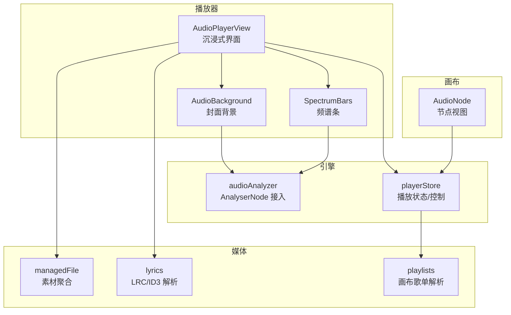
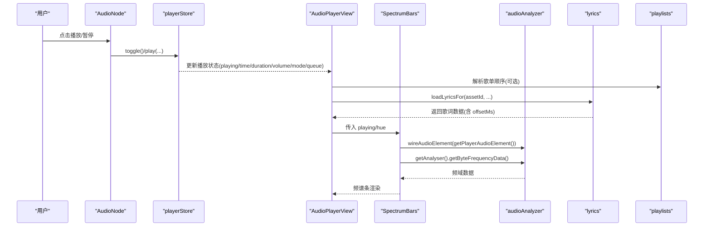
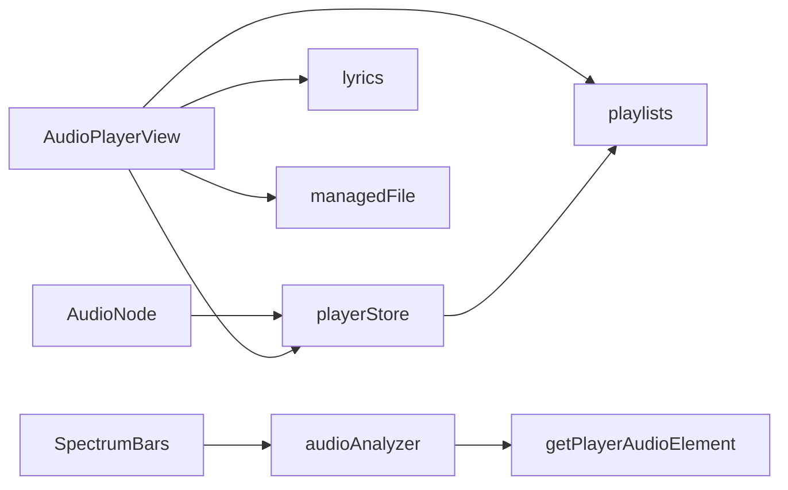

# 音频节点 (AudioNode)

<cite>
**本文引用的文件**
- [src/canvas/nodes/AudioNode.tsx](file://src/canvas/nodes/AudioNode.tsx)
- [src/components/AudioPlayer.tsx](file://src/components/AudioPlayer.tsx)
- [src/components/SpectrumBars.tsx](file://src/components/SpectrumBars.tsx)
- [src/media/audioAnalyzer.ts](file://src/media/audioAnalyzer.ts)
- [src/media/lyrics.ts](file://src/media/lyrics.ts)
- [src/store/playerStore.ts](file://src/store/playerStore.ts)
- [src/components/AudioBackground.tsx](file://src/components/AudioBackground.tsx)
- [src/media/playlists.ts](file://src/media/playlists.ts)
- [src/media/managedFile.ts](file://src/media/managedFile.ts)
</cite>

## 目录
1. [简介](#简介)
2. [项目结构](#项目结构)
3. [核心组件](#核心组件)
4. [架构总览](#架构总览)
5. [详细组件分析](#详细组件分析)
6. [依赖关系分析](#依赖关系分析)
7. [性能考量](#性能考量)
8. [故障排查指南](#故障排查指南)
9. [结论](#结论)
10. [附录：配置与自定义示例路径](#附录：配置与自定义示例路径)

## 简介
本技术文档围绕“音频节点”展开，系统阐述 AudioNode 组件的实现原理与交互流程，覆盖以下能力：
- 音频播放器集成：通过全局播放引擎统一控制播放、暂停、进度、音量、切歌与播放模式。
- 频谱可视化渲染：基于 Web Audio API 的 AnalyserNode 实时获取频域数据，驱动 SpectrumBars 组件绘制动态频谱条。
- 歌词显示机制：支持 LRC 文本歌词与 ID3 内嵌歌词（SYLT/USLT），实现时间轴同步、滚动高亮与偏移校正。
- 播放控制：播放/暂停、进度跳转、音量调节、播放列表管理（顺序/随机/循环/单曲/流式）。
- 元数据处理：从画布连线解析歌单顺序；封面取色用于主题与频谱配色；专辑图收集与轮换。
- 扩展点：提供可插拔的歌曲顺序提供者、歌词来源与缓存策略，便于定制音频功能。

## 项目结构
音频相关代码按职责分层组织：
- 画布节点层：AudioNode 作为画布中的媒体节点，负责展示封面、进度与基础播放入口。
- 播放器视图层：AudioPlayerView 提供沉浸式播放器界面，包含队列、歌词、频谱、背景等。
- 播放引擎层：playerStore 维护单一播放状态与行为，封装 <audio> 元素操作与自动续播逻辑。
- 媒体分析层：audioAnalyzer 将当前音频接入 AnalyserNode，供频谱与背景动画消费。
- 歌词与歌单层：lyrics 解析 LRC/ID3 歌词；playlists 从画布图结构派生歌单顺序。
- 资源与工具层：managedFile 聚合素材信息；blobRegistry/useAssetUrl 提供资源 URL。

图表来源
- [src/canvas/nodes/AudioNode.tsx:18-126](file://src/canvas/nodes/AudioNode.tsx#L18-L126)
- [src/components/AudioPlayer.tsx:142-647](file://src/components/AudioPlayer.tsx#L142-L647)
- [src/components/SpectrumBars.tsx:1-120](file://src/components/SpectrumBars.tsx#L1-L120)
- [src/media/audioAnalyzer.ts:1-59](file://src/media/audioAnalyzer.ts#L1-L59)
- [src/media/lyrics.ts:1-206](file://src/media/lyrics.ts#L1-L206)
- [src/media/playlists.ts:1-179](file://src/media/playlists.ts#L1-L179)
- [src/media/managedFile.ts:1-39](file://src/media/managedFile.ts#L1-L39)

章节来源
- [src/canvas/nodes/AudioNode.tsx:18-126](file://src/canvas/nodes/AudioNode.tsx#L18-L126)
- [src/components/AudioPlayer.tsx:142-647](file://src/components/AudioPlayer.tsx#L142-L647)
- [src/components/SpectrumBars.tsx:1-120](file://src/components/SpectrumBars.tsx#L1-L120)
- [src/media/audioAnalyzer.ts:1-59](file://src/media/audioAnalyzer.ts#L1-L59)
- [src/media/lyrics.ts:1-206](file://src/media/lyrics.ts#L1-L206)
- [src/media/playlists.ts:1-179](file://src/media/playlists.ts#L1-L179)
- [src/media/managedFile.ts:1-39](file://src/media/managedFile.ts#L1-L39)

## 核心组件
- AudioNode：画布中的音频节点，展示封面、进度条与播放按钮，双击进入专用播放器页。
- AudioPlayerView：沉浸式播放器，集成队列、歌词、频谱、背景、键盘快捷键、收藏与下载。
- playerStore：全局播放引擎，维护 track、playing、time、duration、volume、muted、mode、queue，并提供 play/toggle/seek/next/prev/setVolume 等方法。
- audioAnalyzer：单例 Web Audio 分析器，将当前 <audio> 接入 AnalyserNode，暴露 getAnalyser/getAudioLevel。
- SpectrumBars：Canvas 绘制的频谱条，读取 AnalyserNode 频域数据并渲染圆头条。
- lyrics：解析 LRC 与 ID3 歌词（SYLT/USLT），提供 loadLyricsFor 统一加载与缓存。
- playlists：从画布节点与边解析命名歌单与线性顺序，供播放器与引擎使用。
- managedFile：聚合素材信息与关联节点，过滤 MP3 文件。

章节来源
- [src/canvas/nodes/AudioNode.tsx:18-126](file://src/canvas/nodes/AudioNode.tsx#L18-L126)
- [src/components/AudioPlayer.tsx:142-647](file://src/components/AudioPlayer.tsx#L142-L647)
- [src/store/playerStore.ts:1-298](file://src/store/playerStore.ts#L1-L298)
- [src/media/audioAnalyzer.ts:1-59](file://src/media/audioAnalyzer.ts#L1-L59)
- [src/components/SpectrumBars.tsx:1-120](file://src/components/SpectrumBars.tsx#L1-L120)
- [src/media/lyrics.ts:1-206](file://src/media/lyrics.ts#L1-L206)
- [src/media/playlists.ts:1-179](file://src/media/playlists.ts#L1-L179)
- [src/media/managedFile.ts:1-39](file://src/media/managedFile.ts#L1-L39)

## 架构总览
下图展示了从用户交互到音频播放、频谱渲染与歌词显示的完整调用链。

图表来源
- [src/canvas/nodes/AudioNode.tsx:34-47](file://src/canvas/nodes/AudioNode.tsx#L34-L47)
- [src/store/playerStore.ts:174-216](file://src/store/playerStore.ts#L174-L216)
- [src/components/AudioPlayer.tsx:421-515](file://src/components/AudioPlayer.tsx#L421-L515)
- [src/components/SpectrumBars.tsx:29-63](file://src/components/SpectrumBars.tsx#L29-L63)
- [src/media/audioAnalyzer.ts:26-47](file://src/media/audioAnalyzer.ts#L26-L47)
- [src/media/lyrics.ts:181-205](file://src/media/lyrics.ts#L181-L205)
- [src/media/playlists.ts:72-112](file://src/media/playlists.ts#L72-L112)

## 详细组件分析

### AudioNode：画布中的音频节点
- 职责
  - 展示封面图片与播放进度遮罩（只读，不可拖动）。
  - 提供播放/暂停按钮，若当前节点为正在播放曲目则切换状态，否则以 autoplay 方式播放该曲目。
  - 显示当前时间与时长，提供下载入口。
  - 双击进入沉浸式播放器页面（流式模式，沿用画布连线顺序）。
- 关键实现要点
  - 仅当节点对应资产是当前引擎曲目时显示真实进度，否则归零。
  - 通过 usePlayerStore 订阅播放状态，避免重复渲染。
  - 打开播放器页时隐藏底部播放条，避免遮挡。

章节来源
- [src/canvas/nodes/AudioNode.tsx:18-126](file://src/canvas/nodes/AudioNode.tsx#L18-L126)

### AudioPlayerView：沉浸式播放器
- 职责
  - 管理歌曲列表、搜索与排序。
  - 管理播放模式（顺序/随机/列表循环/单曲循环/流式）与队列。
  - 加载并显示歌词（LRC/ID3），支持偏移调整与滚动高亮。
  - 收集并轮换专辑背景图，计算封面主色用于 UI 主题。
  - 集成键盘快捷键（空格播放/暂停、方向键快进快退/音量、L 收藏）。
  - 提供下载当前曲目功能。
- 关键实现要点
  - 通过 setOrderProvider 向引擎注册当前列表顺序，保证导航基准一致。
  - 根据 mode 与 queue 决定 next/prev 的行为。
  - 歌词加载优先级：先尝试画布连线的 .lrc 文件，再回退到 ID3 内嵌歌词。
  - 多张专辑图每 5 秒轮换一次，配合背景水波纹效果。

章节来源
- [src/components/AudioPlayer.tsx:142-647](file://src/components/AudioPlayer.tsx#L142-L647)

### playerStore：全局播放引擎
- 职责
  - 维护单一播放状态：track、playing、time、duration、volume、muted、mode、queue。
  - 提供播放控制：play、toggle、seekTo、seekBy、next、prev、setVolume、setMuted、stop。
  - 处理自动续播：根据 mode 选择下一首或单曲循环。
  - 解析流式顺序：优先队列，其次播放器列表提供者，最后画布连线顺序。
- 关键实现要点
  - requestPlay 在 canplay/loadeddata 时重试播放，兼容浏览器策略。
  - baseOrder 组合队列、orderProvider 与 graphOrderFor，确保导航一致性。
  - handleEnded 根据模式执行单曲循环、顺序/随机/列表循环或停止。

章节来源
- [src/store/playerStore.ts:1-298](file://src/store/playerStore.ts#L1-L298)

### audioAnalyzer：Web Audio 分析器
- 职责
  - 创建并复用 AudioContext 与 AnalyserNode，设置 FFT 大小与平滑参数。
  - 将当前 <audio> 元素接入分析器，供频谱与背景动画读取频域数据。
  - 提供 getAnalyser 与 getAudioLevel 接口。
- 关键实现要点
  - WeakSet 保证每个 <audio> 元素只接入一次。
  - 自动恢复 suspended 状态的 AudioContext。
  - 失败时静默降级，不影响 UI 动画。

章节来源
- [src/media/audioAnalyzer.ts:1-59](file://src/media/audioAnalyzer.ts#L1-L59)

### SpectrumBars：频谱条渲染
- 职责
  - 使用 Canvas 绘制 44 根圆头条，颜色随封面主色变化。
  - 读取 AnalyserNode 频域数据，映射到感知曲线，实现上升快回落慢的动态效果。
  - 静音/暂停时保留低矮基线，保持视觉呼吸感。
- 关键实现要点
  - ResizeObserver 自适应容器尺寸与 DPR。
  - 每帧读取 hueRef.current，无需重启动画循环。
  - 微光效果仅在明显跳动时启用，降低渲染开销。

章节来源
- [src/components/SpectrumBars.tsx:1-120](file://src/components/SpectrumBars.tsx#L1-L120)

### lyrics：歌词解析与同步
- 职责
  - 解析 LRC 文本歌词，提取 meta 与 offsetMs。
  - 解析 ID3 内嵌歌词：SYLT（同步歌词）与 USLT（非同步歌词）。
  - 提供 loadLyricsFor 统一加载，支持外部 .lrc 与内嵌歌词两种来源，带缓存。
- 关键实现要点
  - parseLrc 支持多时间戳行与毫秒精度。
  - extractId3Lyrics 处理多种编码与时间格式。
  - 播放器中根据 currentTime + totalOffset 定位活跃歌词行并滚动对齐。

章节来源
- [src/media/lyrics.ts:1-206](file://src/media/lyrics.ts#L1-L206)
- [src/components/AudioPlayer.tsx:461-515](file://src/components/AudioPlayer.tsx#L461-L515)

### playlists：画布歌单解析
- 职责
  - 扫描画布，识别命名文本节点作为歌单名，沿音频节点出边 DFS 先序遍历生成线性顺序。
  - 处理分叉排序（order 字段）、环检测、去重与告警。
  - 提供 resolvePlaylistsCached 共享缓存，避免重复解析。
- 关键实现要点
  - audioNextEdges 仅考虑目标为音频节点的边，并按 order 升序稳定排序。
  - linearizeFrom 维护 visited/onPath/seenAssets，防止重复与死循环。
  - findPlaylistByAsset 快速查找包含某首歌的歌单。

章节来源
- [src/media/playlists.ts:1-179](file://src/media/playlists.ts#L1-L179)

### managedFile：素材聚合
- 职责
  - 聚合每个 assetId 对应的节点与素材记录，形成 ManagedFile。
  - 提供 isMp3 判断，过滤 MP3 文件用于播放器列表。
- 关键实现要点
  - collectFiles 按 assetId 分组，合并同名不同节点的信息。

章节来源
- [src/media/managedFile.ts:1-39](file://src/media/managedFile.ts#L1-L39)

### AudioBackground：沉浸式背景
- 职责
  - 将专辑封面 cover-fit 铺满全屏，多张封面之间 0.9s 交叉淡入。
  - 无封面时使用渐变背景，底部压暗提升可读性。
- 关键实现要点
  - ResizeObserver 适配容器尺寸与 DPR。
  - 静态时无重绘，仅在封面变化或淡入中绘制。

章节来源
- [src/components/AudioBackground.tsx:1-140](file://src/components/AudioBackground.tsx#L1-L140)

## 依赖关系分析
- AudioNode 依赖 playerStore 进行播放控制与状态订阅。
- AudioPlayerView 依赖 playerStore、lyrics、playlists、managedFile 与 blobRegistry。
- SpectrumBars 依赖 audioAnalyzer 与 getPlayerAudioElement。
- playerStore 依赖 playlists 解析流式顺序，依赖 canvasStore 获取节点信息。
- audioAnalyzer 依赖全局 <audio> 元素（由 GlobalPlayer 绑定）。
- lyrics 依赖数据库与资源服务获取 .lrc 与 ID3 数据。

图表来源
- [src/canvas/nodes/AudioNode.tsx:18-126](file://src/canvas/nodes/AudioNode.tsx#L18-L126)
- [src/components/AudioPlayer.tsx:142-647](file://src/components/AudioPlayer.tsx#L142-L647)
- [src/components/SpectrumBars.tsx:1-120](file://src/components/SpectrumBars.tsx#L1-L120)
- [src/media/audioAnalyzer.ts:1-59](file://src/media/audioAnalyzer.ts#L1-L59)
- [src/media/lyrics.ts:1-206](file://src/media/lyrics.ts#L1-L206)
- [src/media/playlists.ts:1-179](file://src/media/playlists.ts#L1-L179)
- [src/media/managedFile.ts:1-39](file://src/media/managedFile.ts#L1-L39)
- [src/store/playerStore.ts:1-298](file://src/store/playerStore.ts#L1-L298)

章节来源
- [src/canvas/nodes/AudioNode.tsx:18-126](file://src/canvas/nodes/AudioNode.tsx#L18-L126)
- [src/components/AudioPlayer.tsx:142-647](file://src/components/AudioPlayer.tsx#L142-L647)
- [src/components/SpectrumBars.tsx:1-120](file://src/components/SpectrumBars.tsx#L1-L120)
- [src/media/audioAnalyzer.ts:1-59](file://src/media/audioAnalyzer.ts#L1-L59)
- [src/media/lyrics.ts:1-206](file://src/media/lyrics.ts#L1-L206)
- [src/media/playlists.ts:1-179](file://src/media/playlists.ts#L1-L179)
- [src/media/managedFile.ts:1-39](file://src/media/managedFile.ts#L1-L39)
- [src/store/playerStore.ts:1-298](file://src/store/playerStore.ts#L1-L298)

## 性能考量
- 频谱渲染
  - 使用 Float32Array 存储历史值，指数平滑减少抖动。
  - ResizeObserver 与 DPR 自适应，限制最大 DPR 为 2，平衡清晰度与性能。
  - 仅在显著跳动时绘制微光，降低高频绘制开销。
- 背景渲染
  - 静态封面不重复绘制，仅在封面变化或淡入中触发重绘。
  - 使用 cover-fit 算法裁剪，避免拉伸失真。
- 歌词滚动
  - 使用 scrollTo({ behavior: 'smooth' }) 平滑滚动，冻结短时间内的频繁滚动。
  - 镜像区域与正像区域通过 top 同步，减少布局抖动。
- 播放引擎
  - requestPlay 在 canplay/loadeddata 时重试，避免浏览器自动播放策略导致的失败。
  - baseOrder 组合队列与 orderProvider，避免不必要的图遍历。
- 资源加载
  - 专辑图优先使用缩略图，失败回退原图，减少带宽占用。
  - 歌词加载结果缓存，避免重复解析。

[本节为通用性能建议，不直接分析具体文件]

## 故障排查指南
- 无法播放
  - 检查是否已绑定全局 <audio> 元素（bindPlayerAudio）。
  - 确认浏览器允许自动播放策略，必要时在用户手势后调用 play。
  - 查看请求 URL 是否正确（getAssetUrl），网络错误会触发 catch。
- 频谱无响应
  - 确认 wireAudioElement 已调用且 <audio> 元素有效。
  - 检查 AnalyserNode 是否可用，某些环境可能不支持。
  - 确认 playing 状态为真，否则频谱条仅显示基线。
- 歌词不同步
  - 检查 LRC 时间戳格式是否正确，offsetMs 是否合理。
  - 使用播放器中的歌词偏移调整功能微调同步。
  - 确认 loadLyricsFor 成功返回数据，否则回退到 ID3 歌词。
- 歌单顺序异常
  - 检查画布连线是否为音频节点之间的直连边。
  - 确认 edges.order 设置正确，未设置时按创建顺序稳定排序。
  - 查看 warnings 提示，处理环路与重复节点。

章节来源
- [src/store/playerStore.ts:72-88](file://src/store/playerStore.ts#L72-L88)
- [src/media/audioAnalyzer.ts:26-47](file://src/media/audioAnalyzer.ts#L26-L47)
- [src/media/lyrics.ts:16-46](file://src/media/lyrics.ts#L16-L46)
- [src/media/playlists.ts:72-112](file://src/media/playlists.ts#L72-L112)

## 结论
AudioNode 作为画布中的音频入口，与全局播放引擎、频谱渲染、歌词系统与歌单解析紧密协作，提供了完整的音频体验。通过统一的 playerStore 与可插拔的顺序提供者，系统实现了灵活的播放控制与可视化效果。建议在扩展时遵循现有接口契约，确保行为一致性与性能优化。

[本节为总结性内容，不直接分析具体文件]

## 附录：配置与自定义示例路径
- 播放控制
  - 播放/暂停：[toggle:211-216](file://src/store/playerStore.ts#L211-L216)
  - 进度控制：[seekTo/seekBy:218-235](file://src/store/playerStore.ts#L218-L235)
  - 音量调节：[setVolume/setMuted:261-267](file://src/store/playerStore.ts#L261-L267)
  - 播放列表管理：[next/prev/mode/queue:237-276](file://src/store/playerStore.ts#L237-L276)
- 频谱分析
  - 接入分析器：[wireAudioElement:26-39](file://src/media/audioAnalyzer.ts#L26-L39)
  - 读取频域数据：[getAnalyser.getByteFrequencyData:61-63](file://src/components/SpectrumBars.tsx#L61-L63)
  - 渲染逻辑：[SpectrumBars 渲染循环:53-107](file://src/components/SpectrumBars.tsx#L53-L107)
- 歌词解析与显示
  - LRC 解析：[parseLrc:16-46](file://src/media/lyrics.ts#L16-L46)
  - ID3 歌词提取：[extractId3Lyrics:129-167](file://src/media/lyrics.ts#L129-L167)
  - 统一加载：[loadLyricsFor:181-205](file://src/media/lyrics.ts#L181-L205)
  - 时间轴同步与滚动：[activeIndex 计算与滚动:600-620](file://src/components/AudioPlayer.tsx#L600-L620)
- 元数据处理
  - 歌单解析：[resolvePlaylists/linearizeFrom:72-112](file://src/media/playlists.ts#L72-L112)
  - 素材聚合：[collectFiles/isMp3:17-39](file://src/media/managedFile.ts#L17-L39)
  - 封面取色与背景：[useCoverPalette/AudioBackground:275-311](file://src/components/AudioPlayer.tsx#L275-L311), [AudioBackground 绘制:90-130](file://src/components/AudioBackground.tsx#L90-L130)

[本节提供代码片段路径，便于快速定位实现细节]