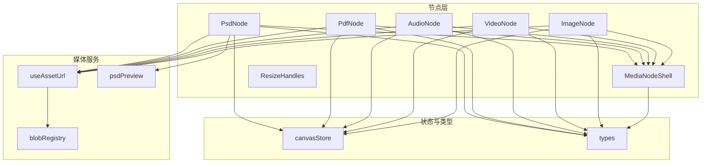
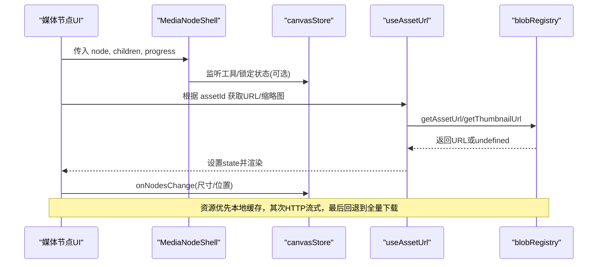
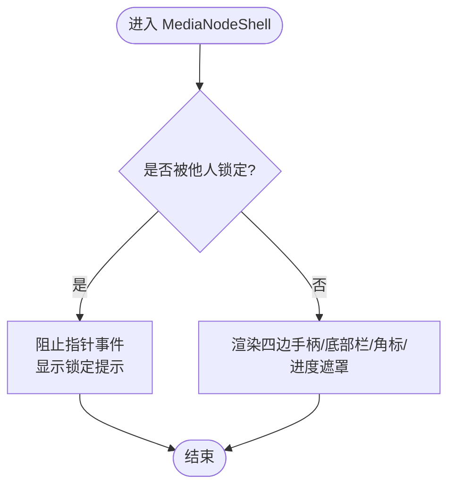
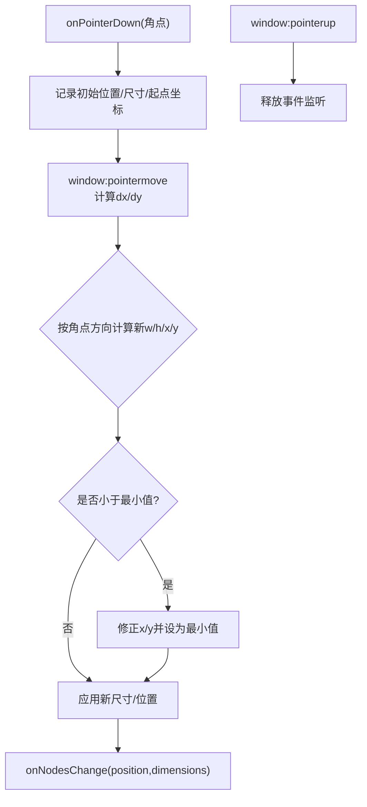
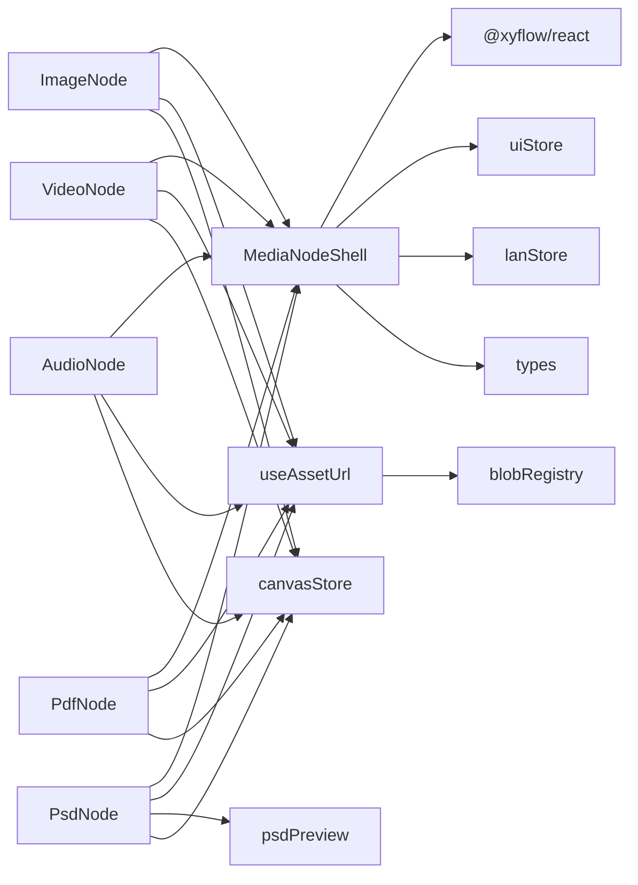

# 媒体节点壳组件

<cite>
**本文引用的文件**
- [MediaNodeShell.tsx](file://src/canvas/nodes/MediaNodeShell.tsx)
- [ResizeHandles.tsx](file://src/canvas/nodes/ResizeHandles.tsx)
- [ImageNode.tsx](file://src/canvas/nodes/ImageNode.tsx)
- [VideoNode.tsx](file://src/canvas/nodes/VideoNode.tsx)
- [AudioNode.tsx](file://src/canvas/nodes/AudioNode.tsx)
- [PdfNode.tsx](file://src/canvas/nodes/PdfNode.tsx)
- [PsdNode.tsx](file://src/canvas/nodes/PsdNode.tsx)
- [nodeTypes.ts](file://src/canvas/nodes/nodeTypes.ts)
- [useAssetUrl.ts](file://src/media/useAssetUrl.ts)
- [blobRegistry.ts](file://src/media/blobRegistry.ts)
- [psdPreview.ts](file://src/media/psdPreview.ts)
- [canvasStore.ts](file://src/store/canvasStore.ts)
- [types.ts](file://src/types.ts)
</cite>

## 目录
1. [简介](#简介)
2. [项目结构](#项目结构)
3. [核心组件](#核心组件)
4. [架构总览](#架构总览)
5. [详细组件分析](#详细组件分析)
6. [依赖关系分析](#依赖关系分析)
7. [性能与内存优化](#性能与内存优化)
8. [故障排查指南](#故障排查指南)
9. [结论](#结论)
10. [附录：使用示例与最佳实践](#附录使用示例与最佳实践)

## 简介
本技术文档围绕“媒体节点壳组件”展开，系统性阐述 MediaNodeShell 的设计目标、统一接口、通用属性系统、预览能力、响应式布局策略，以及 ResizeHandles 的拖拽调整大小机制。同时覆盖媒体加载优化、缓存策略、错误处理与性能调优建议，并提供基于现有代码的自定义媒体节点实现指引。

## 项目结构
媒体节点相关代码集中在 canvas/nodes 与 media 两个目录：
- canvas/nodes：具体节点实现（图片、视频、音频、PDF、PSD）与通用壳 MediaNodeShell、尺寸调整 ResizeHandles、节点类型注册 nodeTypes。
- media：资源 URL 获取与缓存 useAssetUrl、Blob 管理与缩略图生成 blobRegistry、PSD 预览 psdPreview。
- store：画布状态管理 canvasStore，提供节点增删改、对齐、撤销重做等能力。
- types：统一的 SuqNodeData 定义，承载媒体节点的通用属性（kind、assetId、label、尺寸、样式等）。



图表来源
- [MediaNodeShell.tsx:32-150](file://src/canvas/nodes/MediaNodeShell.tsx#L32-L150)
- [ImageNode.tsx:15-126](file://src/canvas/nodes/ImageNode.tsx#L15-L126)
- [VideoNode.tsx:18-88](file://src/canvas/nodes/VideoNode.tsx#L18-L88)
- [AudioNode.tsx:18-126](file://src/canvas/nodes/AudioNode.tsx#L18-L126)
- [PdfNode.tsx:11-90](file://src/canvas/nodes/PdfNode.tsx#L11-L90)
- [PsdNode.tsx:15-125](file://src/canvas/nodes/PsdNode.tsx#L15-L125)
- [useAssetUrl.ts:10-157](file://src/media/useAssetUrl.ts#L10-L157)
- [blobRegistry.ts:84-389](file://src/media/blobRegistry.ts#L84-L389)
- [psdPreview.ts:42-60](file://src/media/psdPreview.ts#L42-L60)
- [canvasStore.ts:118-399](file://src/store/canvasStore.ts#L118-L399)
- [types.ts:66-107](file://src/types.ts#L66-L107)

章节来源
- [MediaNodeShell.tsx:32-150](file://src/canvas/nodes/MediaNodeShell.tsx#L32-L150)
- [nodeTypes.ts:14-26](file://src/canvas/nodes/nodeTypes.ts#L14-L26)
- [types.ts:66-107](file://src/types.ts#L66-L107)

## 核心组件
- MediaNodeShell：为所有媒体节点提供统一外壳，包含四边连接手柄、选中态边框、底部信息栏、创建者角标、播放进度遮罩、局域网锁定提示等。
- ResizeHandles：提供四个角的拖拽调整大小，支持最小宽高约束与边界检测，实时更新节点位置与尺寸。
- 具体媒体节点：ImageNode、VideoNode、AudioNode、PdfNode、PsdNode，分别封装各自渲染逻辑与交互，均复用 MediaNodeShell。

章节来源
- [MediaNodeShell.tsx:20-150](file://src/canvas/nodes/MediaNodeShell.tsx#L20-L150)
- [ResizeHandles.tsx:35-118](file://src/canvas/nodes/ResizeHandles.tsx#L35-L118)
- [ImageNode.tsx:15-126](file://src/canvas/nodes/ImageNode.tsx#L15-L126)
- [VideoNode.tsx:18-88](file://src/canvas/nodes/VideoNode.tsx#L18-L88)
- [AudioNode.tsx:18-126](file://src/canvas/nodes/AudioNode.tsx#L18-L126)
- [PdfNode.tsx:11-90](file://src/canvas/nodes/PdfNode.tsx#L11-L90)
- [PsdNode.tsx:15-125](file://src/canvas/nodes/PsdNode.tsx#L15-L125)

## 架构总览
媒体节点壳采用“壳 + 内容”的组合模式：
- 壳负责：统一外观、连线手柄、选中态、底部栏、进度遮罩、协作锁定提示。
- 内容负责：具体媒体类型的渲染与交互（如图片加载、视频封面、音频播放控制、PDF 首帧渲染、PSD 预览）。
- 数据流：通过 types.SuqNodeData 描述节点元数据；useCanvasStore 管理节点变更；useAssetUrl/blobRegistry 提供资源 URL 与缩略图；psdPreview 异步生成 PSD 预览。



图表来源
- [MediaNodeShell.tsx:32-150](file://src/canvas/nodes/MediaNodeShell.tsx#L32-L150)
- [useAssetUrl.ts:10-157](file://src/media/useAssetUrl.ts#L10-L157)
- [blobRegistry.ts:84-389](file://src/media/blobRegistry.ts#L84-L389)
- [canvasStore.ts:118-399](file://src/store/canvasStore.ts#L118-L399)

## 详细组件分析

### MediaNodeShell 设计
- 统一外壳：容器使用相对定位、圆角、阴影与主题色边框；选中态添加高亮类名。
- 连线手柄：四边各一对 source/target Handle，并在连线模式下将四条边作为可连接热区。
- 底部栏：显示图标与名称，支持始终显示或仅选中时显示。
- 创建者角标：悬停/选中/始终显示三种模式，展示插入者信息。
- 播放进度遮罩：当传入 progress 时，以铺满宽度的半透明条覆盖整个节点，用于音频播放进度可视化。
- 协作锁定：若检测到其他用户正在编辑该节点，则阻止指针事件并显示提示。
- 内部刷新：在工具切换时调用 updateNodeInternals 确保连线热区重新测量。



图表来源
- [MediaNodeShell.tsx:40-150](file://src/canvas/nodes/MediaNodeShell.tsx#L40-L150)

章节来源
- [MediaNodeShell.tsx:20-150](file://src/canvas/nodes/MediaNodeShell.tsx#L20-L150)

### ResizeHandles 实现原理
- 四角拖拽：nw/ne/sw/se 四个角，分别映射不同光标样式与绝对定位。
- 坐标转换：使用 screenToFlowPosition 将屏幕坐标转换为 Flow 坐标，计算 dx/dy。
- 边界检测：限制最小宽度与高度，并根据拖拽方向修正 x/y 以保证不越界。
- 状态更新：通过 onNodesChange 同时更新 position 与 dimensions，setAttributes 保证持久化。
- 生命周期：在 pointermove/pointerup 上绑定/移除全局事件，避免内存泄漏。



图表来源
- [ResizeHandles.tsx:45-103](file://src/canvas/nodes/ResizeHandles.tsx#L45-L103)

章节来源
- [ResizeHandles.tsx:5-118](file://src/canvas/nodes/ResizeHandles.tsx#L5-L118)
- [canvasStore.ts:126-145](file://src/store/canvasStore.ts#L126-L145)

### 媒体节点通用属性系统
SuqNodeData 定义了媒体节点的通用属性，包括：
- 标识与元数据：kind、assetId、label、mime、size、pageCount、coverAssetId。
- 尺寸与样式：width、height、borderColor、backgroundColor。
- 文本与排版：textAlign、textAlignV、fontSize、fontFamily、textColor、bold、italic、underline、lineHeight。
- 创作信息：createdById、createdByName、createdAt、assetUpdatedAt。
这些属性由 MediaNodeShell 及具体节点消费，例如：
- MediaNodeShell 使用 borderColor、label、createdByName、kind 进行渲染。
- ImageNode/VideoNode/PsdNode 使用 width/height 自适应初始尺寸。
- AudioNode 使用 coverAssetId 显示专辑封面。

章节来源
- [types.ts:66-107](file://src/types.ts#L66-L107)
- [MediaNodeShell.tsx:109-130](file://src/canvas/nodes/MediaNodeShell.tsx#L109-L130)
- [ImageNode.tsx:40-56](file://src/canvas/nodes/ImageNode.tsx#L40-L56)
- [VideoNode.tsx:31-49](file://src/canvas/nodes/VideoNode.tsx#L31-L49)
- [PsdNode.tsx:40-57](file://src/canvas/nodes/PsdNode.tsx#L40-L57)
- [AudioNode.tsx:18-33](file://src/canvas/nodes/AudioNode.tsx#L18-L33)

### 媒体加载优化、缓存策略与错误处理
- 资源 URL 获取：
  - useAssetUrl：对 assetId 进行重试加载，最多尝试多次，失败时提示。
  - useThumbnailUrl：针对封面缩略图的快速轮询与长等待策略，考虑局域网传输延迟。
  - usePsdPreviewUrl：先取缩略图，若无则触发 ensurePsdPreview 生成预览。
- Blob 管理与缓存：
  - blobRegistry 维护 urlCache 与 thumbCache，优先使用本地 IndexedDB 中的 Blob，其次使用局域网 HTTP 流式地址，最后回退到全量下载。
  - 并发控制：视频封面抓帧限制最大并发数，避免阻塞浏览器连接池。
  - 黑帧检测与替换：对旧版本可能生成的黑色封面进行检测并重新抓取。
  - 资源失效：提供 invalidate* 方法清理对象 URL 与缓存。
- 错误处理：
  - useAssetUrl 捕获异常并 toast 提示。
  - PdfNode 渲染失败时切换至 error 状态。
  - PsdNode 打开预览前检查锁定与可用性，失败时提示。

```mermaid
sequenceDiagram
participant Node as "媒体节点"
participant Hook as "useAssetUrl/useThumbnailUrl"
participant Reg as "blobRegistry"
participant DB as "IndexedDB"
participant LAN as "局域网/OSS"
Node->>Hook : 请求URL/缩略图(assetId)
Hook->>Reg : getAssetUrl/getThumbnailUrl
alt 本地有Blob
Reg->>DB : 读取Blob
DB-->>Reg : Blob
Reg-->>Hook : 返回ObjectURL
else 无本地Blob
Reg->>LAN : 获取HTTP流式地址或全量下载
LAN-->>Reg : URL/Blob
Reg->>DB : 写入Blob/缩略图
Reg-->>Hook : 返回URL
end
Hook-->>Node : 设置state并渲染
Note over Hook,Reg : 失败时重试/提示;缩略图并发受限;黑帧检测
```

图表来源
- [useAssetUrl.ts:10-157](file://src/media/useAssetUrl.ts#L10-L157)
- [blobRegistry.ts:84-389](file://src/media/blobRegistry.ts#L84-L389)

章节来源
- [useAssetUrl.ts:10-157](file://src/media/useAssetUrl.ts#L10-L157)
- [blobRegistry.ts:12-389](file://src/media/blobRegistry.ts#L12-L389)
- [PdfNode.tsx:19-62](file://src/canvas/nodes/PdfNode.tsx#L19-L62)
- [PsdNode.tsx:28-38](file://src/canvas/nodes/PsdNode.tsx#L28-L38)

### 响应式设计与自适应布局策略
- 图片节点：根据自然宽高与最大宽高限制计算缩放比例，首次加载后自动设置节点尺寸，保持内容适配。
- 视频节点：使用缩略图的自然宽高计算缩放比例，避免大文件下载，仅在打开播放器时拉取完整视频。
- PDF 节点：首帧渲染到 Canvas，按钮提供查看全部入口。
- PSD 节点：异步生成预览图，完成后自适应节点尺寸。
- 统一外壳：MediaNodeShell 提供 flex 布局与 overflow-hidden，确保内容自适应且不溢出。

章节来源
- [ImageNode.tsx:39-56](file://src/canvas/nodes/ImageNode.tsx#L39-L56)
- [VideoNode.tsx:31-49](file://src/canvas/nodes/VideoNode.tsx#L31-L49)
- [PdfNode.tsx:39-49](file://src/canvas/nodes/PdfNode.tsx#L39-L49)
- [PsdNode.tsx:40-57](file://src/canvas/nodes/PsdNode.tsx#L40-L57)
- [MediaNodeShell.tsx:53-107](file://src/canvas/nodes/MediaNodeShell.tsx#L53-L107)

## 依赖关系分析
- MediaNodeShell 依赖：@xyflow/react（Handle、useUpdateNodeInternals）、store（uiStore、lanStore）、types（SuqNode）。
- 具体节点依赖：MediaNodeShell、useAssetUrl、canvasStore、uiStore、lanStore、icons。
- 媒体服务依赖：db、ossClient、cloudSync、lanClient、psdPreview。
- 状态管理：canvasStore 提供 onNodesChange、updateNodeData、alignSelected 等能力。



图表来源
- [MediaNodeShell.tsx:1-12](file://src/canvas/nodes/MediaNodeShell.tsx#L1-L12)
- [ImageNode.tsx:1-10](file://src/canvas/nodes/ImageNode.tsx#L1-L10)
- [VideoNode.tsx:1-9](file://src/canvas/nodes/VideoNode.tsx#L1-L9)
- [AudioNode.tsx:1-10](file://src/canvas/nodes/AudioNode.tsx#L1-L10)
- [PdfNode.tsx:1-9](file://src/canvas/nodes/PdfNode.tsx#L1-L9)
- [PsdNode.tsx:1-10](file://src/canvas/nodes/PsdNode.tsx#L1-L10)
- [useAssetUrl.ts:1-5](file://src/media/useAssetUrl.ts#L1-L5)
- [blobRegistry.ts:1-10](file://src/media/blobRegistry.ts#L1-L10)
- [psdPreview.ts:1-3](file://src/media/psdPreview.ts#L1-L3)
- [canvasStore.ts:1-5](file://src/store/canvasStore.ts#L1-L5)

章节来源
- [nodeTypes.ts:14-26](file://src/canvas/nodes/nodeTypes.ts#L14-L26)
- [MediaNodeShell.tsx:1-12](file://src/canvas/nodes/MediaNodeShell.tsx#L1-L12)

## 性能与内存优化
- 资源加载优化：
  - 优先使用本地 Blob 与 HTTP 流式地址，避免整份下载大文件。
  - 缩略图抓取限制并发，防止阻塞视频播放。
  - 封面缺失时主动请求源端，减少无效等待。
- 缓存策略：
  - urlCache 与 thumbCache 缓存 ObjectURL，配合 invalidate* 方法及时释放。
  - 局域网同步来的封面优先使用，避免重复解码。
- 内存管理：
  - 及时 revokeObjectURL，避免内存泄漏。
  - 清理 Worker 与 pending 任务，防止资源堆积。
- 渲染优化：
  - 使用 memo 包裹节点组件，减少不必要重渲染。
  - 仅在必要时更新节点内部测量（工具切换时）。

章节来源
- [blobRegistry.ts:12-39](file://src/media/blobRegistry.ts#L12-L39)
- [blobRegistry.ts:41-56](file://src/media/blobRegistry.ts#L41-L56)
- [blobRegistry.ts:241-268](file://src/media/blobRegistry.ts#L241-L268)
- [blobRegistry.ts:381-389](file://src/media/blobRegistry.ts#L381-L389)
- [psdPreview.ts:15-32](file://src/media/psdPreview.ts#L15-L32)
- [MediaNodeShell.tsx:32-51](file://src/canvas/nodes/MediaNodeShell.tsx#L32-L51)

## 故障排查指南
- 资源加载失败：
  - useAssetUrl 会重试并 toast 提示；检查网络与 OSS/局域网配置。
  - 若缩略图长期为空，确认局域网连接与源端在线状态。
- PDF 渲染失败：
  - PdfNode 切换 error 状态；检查 URL 有效性与服务端 CORS。
- PSD 预览失败：
  - 检查 Worker 是否可用；确保资产已下载到本地或可通过局域网获取。
- 协作冲突：
  - MediaNodeShell 检测到他人编辑时会阻止操作并提示；等待对方完成或协商编辑权。

章节来源
- [useAssetUrl.ts:21-44](file://src/media/useAssetUrl.ts#L21-L44)
- [PdfNode.tsx:49-62](file://src/canvas/nodes/PdfNode.tsx#L49-L62)
- [PsdNode.tsx:28-38](file://src/canvas/nodes/PsdNode.tsx#L28-L38)
- [MediaNodeShell.tsx:61-67](file://src/canvas/nodes/MediaNodeShell.tsx#L61-L67)

## 结论
MediaNodeShell 提供了统一的媒体节点外壳，结合 ResizeHandles 实现了灵活的尺寸调整与边界检测。通过 useAssetUrl 与 blobRegistry 的协同，系统在资源加载、缓存与错误处理方面具备健壮性。各媒体节点在壳的基础上扩展了各自的渲染与交互逻辑，形成可扩展、高性能的媒体节点体系。

## 附录：使用示例与最佳实践
- 创建自定义媒体节点：
  - 新建一个 React 组件，使用 @xyflow/react 的 NodeProps<SuqNode> 接收 props。
  - 在组件中引入 MediaNodeShell，并将自定义内容作为 children 传入。
  - 如需尺寸调整，可叠加 NodeResizer 或集成 ResizeHandles。
  - 使用 useAssetUrl 获取资源 URL，并通过 canvasStore.onNodesChange 更新节点尺寸/位置。
  - 参考现有节点（ImageNode、VideoNode、AudioNode、PdfNode、PsdNode）的实现方式。
- 最佳实践：
  - 合理使用 progress 参数在 MediaNodeShell 中展示播放进度。
  - 利用 SuqNodeData 的样式字段（borderColor、backgroundColor）定制外观。
  - 在资源加载过程中提供占位与过渡动画，提升用户体验。
  - 注意内存管理，及时释放对象 URL 与清理事件监听。

章节来源
- [ImageNode.tsx:58-126](file://src/canvas/nodes/ImageNode.tsx#L58-L126)
- [VideoNode.tsx:51-88](file://src/canvas/nodes/VideoNode.tsx#L51-L88)
- [AudioNode.tsx:72-126](file://src/canvas/nodes/AudioNode.tsx#L72-L126)
- [PdfNode.tsx:64-90](file://src/canvas/nodes/PdfNode.tsx#L64-L90)
- [PsdNode.tsx:59-125](file://src/canvas/nodes/PsdNode.tsx#L59-L125)
- [MediaNodeShell.tsx:32-150](file://src/canvas/nodes/MediaNodeShell.tsx#L32-L150)