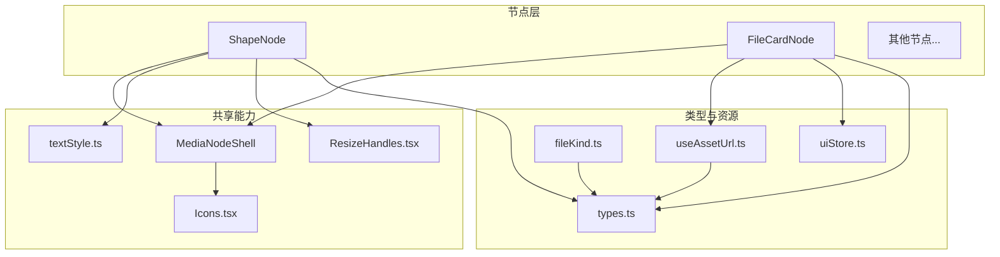
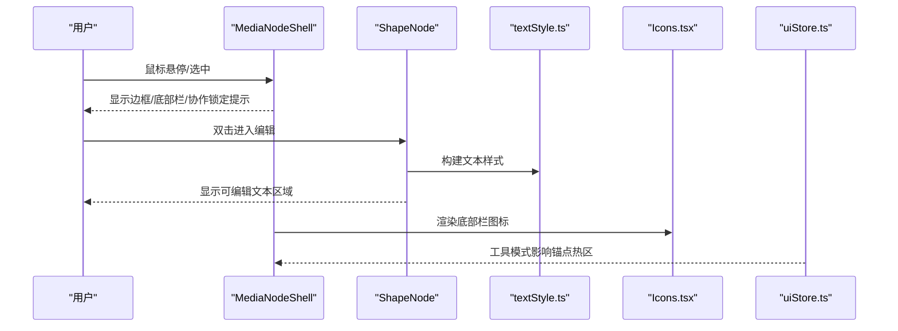
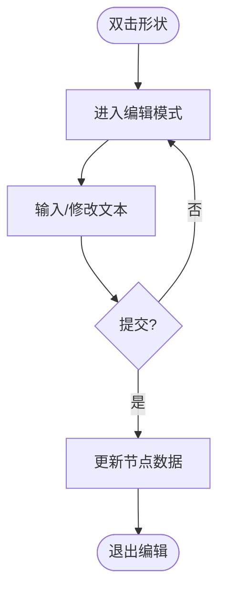
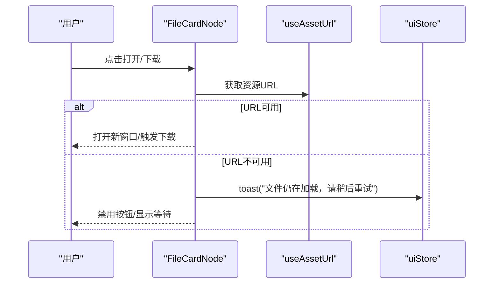
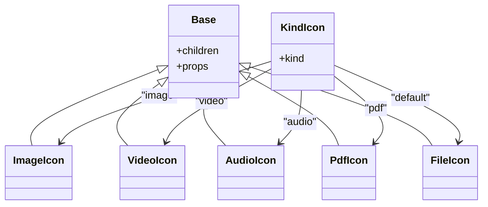
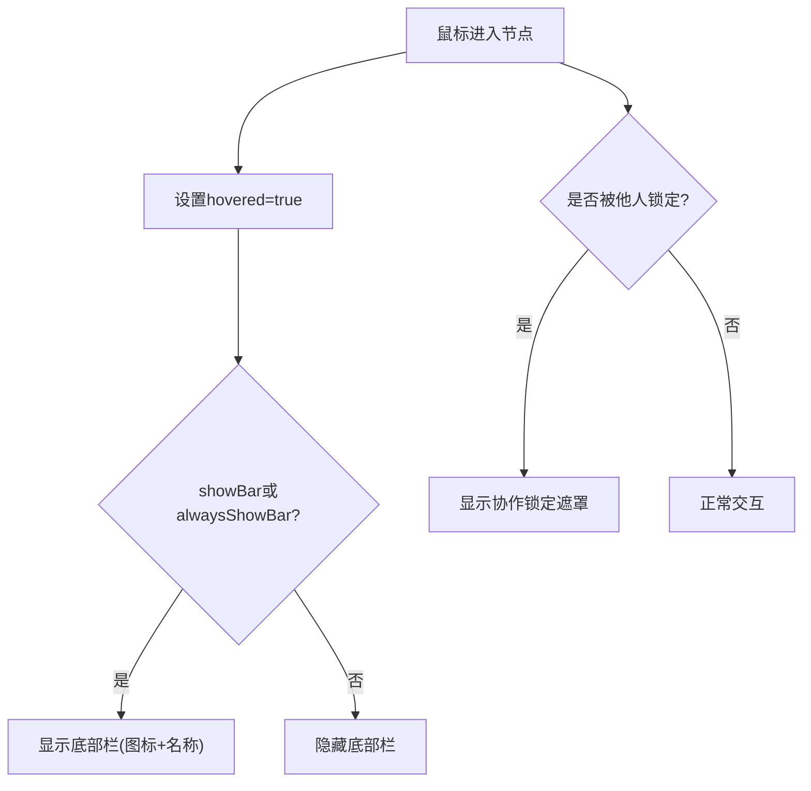
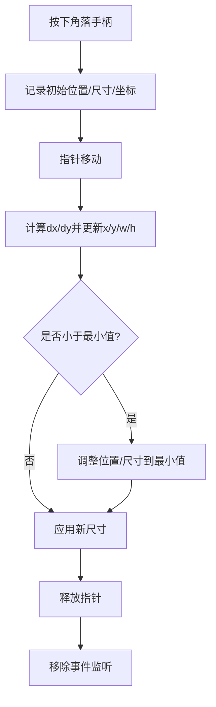
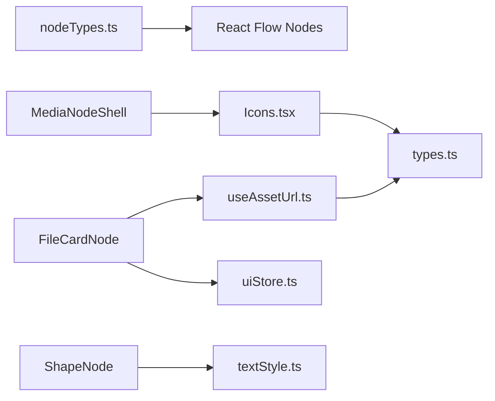

# 工具类节点

<cite>
**本文引用的文件**
- [ShapeNode.tsx](file://src/canvas/nodes/ShapeNode.tsx)
- [FileCardNode.tsx](file://src/canvas/nodes/FileCardNode.tsx)
- [Icons.tsx](file://src/canvas/nodes/Icons.tsx)
- [MediaNodeShell.tsx](file://src/canvas/nodes/MediaNodeShell.tsx)
- [nodeTypes.ts](file://src/canvas/nodes/nodeTypes.ts)
- [textStyle.ts](file://src/canvas/nodes/textStyle.ts)
- [ResizeHandles.tsx](file://src/canvas/nodes/ResizeHandles.tsx)
- [types.ts](file://src/types.ts)
- [fileKind.ts](file://src/media/fileKind.ts)
- [useAssetUrl.ts](file://src/media/useAssetUrl.ts)
- [uiStore.ts](file://src/store/uiStore.ts)
</cite>

## 目录
1. [简介](#简介)
2. [项目结构](#项目结构)
3. [核心组件](#核心组件)
4. [架构总览](#架构总览)
5. [详细组件分析](#详细组件分析)
6. [依赖关系分析](#依赖关系分析)
7. [性能考量](#性能考量)
8. [故障排查指南](#故障排查指南)
9. [结论](#结论)
10. [附录：使用示例与主题定制](#附录使用示例与主题定制)

## 简介
本技术文档聚焦于“工具类节点”的实现与使用，覆盖以下要点：
- ShapeNode 形状节点：几何图形绘制、填充样式、文本编辑、垂直对齐等。
- FileCardNode 文件卡片节点：文件信息展示、缩略图/资源加载、打开与下载操作。
- Icons.tsx 图标系统：统一 SVG 图标库、按媒体类型动态选择图标。
- 通用外壳 MediaNodeShell：统一的边框、连线锚点、底部名称栏、协作锁定提示、进度遮罩等。
- 通用属性与事件机制：基于 SuqNodeData 的节点数据模型、文本样式构建、尺寸调整与交互。
- 样式定制与主题适配：通过 CSS 变量与 Tailwind 实现主题切换与节点外观控制。
- 性能优化建议与用户体验改进策略。

## 项目结构
工具类节点位于 src/canvas/nodes 目录下，围绕 React Flow 的 Node 体系组织：
- 具体节点：ShapeNode、FileCardNode 等
- 通用外壳：MediaNodeShell（提供边框、锚点、底部栏、协作锁定、进度遮罩）
- 图标系统：Icons.tsx（统一 Base 容器 + 多种图标 + KindIcon 动态选择）
- 文本样式：textStyle.ts（字体、颜色、粗细、行高、对齐）
- 尺寸调整：ResizeHandles.tsx（四角拖拽缩放）
- 类型定义：types.ts（SuqNodeData、MediaKind、对齐方式等）
- 资源加载：useAssetUrl.ts（资源 URL、缩略图轮询、PSD 预览）
- 文件识别：fileKind.ts（MIME/扩展名推断媒体类型）
- UI 状态：uiStore.ts（Toast、工具模式等）

图表来源
- [MediaNodeShell.tsx:32-151](file://src/canvas/nodes/MediaNodeShell.tsx#L32-L151)
- [ShapeNode.tsx:10-86](file://src/canvas/nodes/ShapeNode.tsx#L10-L86)
- [FileCardNode.tsx:10-80](file://src/canvas/nodes/FileCardNode.tsx#L10-L80)
- [Icons.tsx:6-657](file://src/canvas/nodes/Icons.tsx#L6-L657)
- [textStyle.ts:1-22](file://src/canvas/nodes/textStyle.ts#L1-L22)
- [ResizeHandles.tsx:35-118](file://src/canvas/nodes/ResizeHandles.tsx#L35-L118)
- [types.ts:1-112](file://src/types.ts#L1-L112)
- [useAssetUrl.ts:10-157](file://src/media/useAssetUrl.ts#L10-L157)
- [fileKind.ts:1-24](file://src/media/fileKind.ts#L1-L24)
- [uiStore.ts:1-121](file://src/store/uiStore.ts#L1-L121)

章节来源
- [nodeTypes.ts:1-27](file://src/canvas/nodes/nodeTypes.ts#L1-L27)
- [README.md:1-181](file://README.md#L1-L181)

## 核心组件
- ShapeNode：渲染矩形或椭圆形状，支持填充色、圆角、文本编辑、垂直对齐、自动进入编辑态。
- FileCardNode：展示文件名、大小、打开与下载按钮；根据资源就绪状态禁用交互并提示。
- MediaNodeShell：统一节点外壳，包含边框、四边连接锚点、底部名称栏、创建者标签、协作锁定遮罩、播放进度遮罩。
- Icons.tsx：统一 SVG 图标基座与多种图标，提供 KindIcon 按媒体类型动态返回对应图标。
- textStyle.ts：将 SuqNodeData 中的文本相关属性转换为 CSS 样式对象，并提供垂直对齐映射。
- ResizeHandles.tsx：在选中节点时显示四角拖拽手柄，实时计算新位置与尺寸并更新画布。
- useAssetUrl.ts：异步获取资源 URL 与缩略图 URL，内置重试与超时逻辑，支持 PSD 预览。
- fileKind.ts：根据 MIME 类型与扩展名推断媒体类型，并提供文件大小格式化。
- uiStore.ts：全局 UI 状态（工具模式、Toast 等），为节点提供交互反馈。

章节来源
- [ShapeNode.tsx:10-86](file://src/canvas/nodes/ShapeNode.tsx#L10-L86)
- [FileCardNode.tsx:10-80](file://src/canvas/nodes/FileCardNode.tsx#L10-L80)
- [MediaNodeShell.tsx:32-151](file://src/canvas/nodes/MediaNodeShell.tsx#L32-L151)
- [Icons.tsx:6-657](file://src/canvas/nodes/Icons.tsx#L6-L657)
- [textStyle.ts:1-22](file://src/canvas/nodes/textStyle.ts#L1-L22)
- [ResizeHandles.tsx:35-118](file://src/canvas/nodes/ResizeHandles.tsx#L35-L118)
- [useAssetUrl.ts:10-157](file://src/media/useAssetUrl.ts#L10-L157)
- [fileKind.ts:1-24](file://src/media/fileKind.ts#L1-L24)
- [uiStore.ts:1-121](file://src/store/uiStore.ts#L1-L121)

## 架构总览
工具类节点遵循“外壳 + 内容”的分层设计：
- 外壳层（MediaNodeShell）负责：边框、锚点、底部栏、协作锁定、进度遮罩、悬停/选中态。
- 内容层（ShapeNode/FileCardNode）负责：各自业务渲染与交互。
- 类型与样式层（types.ts/textStyle.ts）提供统一的数据结构与样式构建。
- 资源层（useAssetUrl.ts/fileKind.ts）负责资源 URL 与缩略图的获取与重试。
- 图标层（Icons.tsx）提供一致的视觉元素与动态选择。

图表来源
- [MediaNodeShell.tsx:32-151](file://src/canvas/nodes/MediaNodeShell.tsx#L32-L151)
- [ShapeNode.tsx:10-86](file://src/canvas/nodes/ShapeNode.tsx#L10-L86)
- [textStyle.ts:1-22](file://src/canvas/nodes/textStyle.ts#L1-L22)
- [Icons.tsx:633-657](file://src/canvas/nodes/Icons.tsx#L633-L657)
- [uiStore.ts:43-45](file://src/store/uiStore.ts#L43-L45)

## 详细组件分析

### ShapeNode 形状节点
- 功能要点
  - 形状类型：rect（圆角矩形）、ellipse（圆形）。
  - 填充样式：通过 data.fill 设置背景色；圆角由 shape 决定。
  - 文本编辑：双击进入编辑，支持多行文本；Enter/Ctrl+Enter 提交，Esc 退出编辑。
  - 文本样式：使用 buildTextStyle 生成字体、颜色、粗细、斜体、下划线、行高等样式；textAlignV 控制垂直对齐。
  - 自动编辑：data.autoEdit 为真时自动进入编辑态并重置标志。
  - 协作编辑：编辑时调用 setLanEditing 同步本地编辑状态，退出时清理。
  - 尺寸调整：选中且未编辑时显示 ResizeHandles，支持四角拖拽。
- 数据结构
  - 依赖 SuqNodeData 中的 shape、fill、text、textAlign、textAlignV、fontSize、fontFamily、textColor、bold、italic、underline、lineHeight、autoEdit 等字段。
- 交互流程
  - 双击 -> 进入编辑 -> 失焦/快捷键 -> 提交文本 -> 退出编辑。
  - 选中 -> 显示四角手柄 -> 拖拽 -> 实时更新节点位置与尺寸。

图表来源
- [ShapeNode.tsx:17-41](file://src/canvas/nodes/ShapeNode.tsx#L17-L41)
- [textStyle.ts:4-21](file://src/canvas/nodes/textStyle.ts#L4-L21)

章节来源
- [ShapeNode.tsx:10-86](file://src/canvas/nodes/ShapeNode.tsx#L10-L86)
- [textStyle.ts:1-22](file://src/canvas/nodes/textStyle.ts#L1-L22)
- [types.ts:66-98](file://src/types.ts#L66-L98)

### FileCardNode 文件卡片节点
- 功能要点
  - 文件信息：显示文件名（data.label）、文件大小（formatBytes）。
  - 资源加载：通过 useAssetUrl 获取资源 URL；若未就绪则禁用操作并提示。
  - 操作按钮：打开文件（window.open）、下载（download 链接）。
  - 交互保护：阻止事件冒泡避免误触发画布操作；无 URL 时显示等待光标与半透明禁用态。
- 数据结构
  - 依赖 SuqNodeData 中的 assetId、label、fileSize 等字段。
- 错误处理
  - 资源未就绪时 toast 提示；下载点击时若无 URL 则阻止默认行为并提示。

图表来源
- [FileCardNode.tsx:10-80](file://src/canvas/nodes/FileCardNode.tsx#L10-L80)
- [useAssetUrl.ts:10-44](file://src/media/useAssetUrl.ts#L10-L44)
- [uiStore.ts:49-55](file://src/store/uiStore.ts#L49-L55)

章节来源
- [FileCardNode.tsx:10-80](file://src/canvas/nodes/FileCardNode.tsx#L10-L80)
- [fileKind.ts:18-23](file://src/media/fileKind.ts#L18-L23)
- [useAssetUrl.ts:10-44](file://src/media/useAssetUrl.ts#L10-L44)
- [uiStore.ts:49-55](file://src/store/uiStore.ts#L49-L55)

### Icons.tsx 图标系统
- 设计模式
  - Base 组件：统一 SVG 基础属性（viewBox、stroke、strokeWidth、size 等），所有图标复用该容器。
  - 具体图标：每个导出函数返回一个 SVG 路径集合，语义清晰、易于维护。
  - KindIcon：根据 MediaKind 动态返回对应图标，便于在底部栏或列表中统一展示。
- 扩展性
  - 新增图标只需添加新的函数并可选地在 KindIcon 中注册。
  - 可通过 props 传递 className、style 等以适配不同场景。

图表来源
- [Icons.tsx:6-22](file://src/canvas/nodes/Icons.tsx#L6-L22)
- [Icons.tsx:24-90](file://src/canvas/nodes/Icons.tsx#L24-L90)
- [Icons.tsx:633-657](file://src/canvas/nodes/Icons.tsx#L633-L657)

章节来源
- [Icons.tsx:6-657](file://src/canvas/nodes/Icons.tsx#L6-L657)
- [types.ts:3-14](file://src/types.ts#L3-L14)

### MediaNodeShell 通用外壳
- 功能要点
  - 边框与主题：通过 data.borderColor 与 CSS 变量 --nodebg、--nodebar、--nodebarline 控制外观。
  - 连线锚点：四边 source/target Handle，连线模式下四条边作为连接热区。
  - 底部栏：显示 KindIcon 与 label，支持 alwaysShowBar 控制始终显示。
  - 协作锁定：当有远程用户在编辑时，显示遮罩与提示，禁止交互。
  - 进度遮罩：progress 参数用于渲染铺满节点的进度条（如媒体播放进度）。
- 事件处理
  - 鼠标进入/离开控制悬停态。
  - onPointerDownCapture 在协作锁定时阻止事件传播。
  - 工具模式变化时调用 updateNodeInternals 重新测量锚点边界。

图表来源
- [MediaNodeShell.tsx:32-151](file://src/canvas/nodes/MediaNodeShell.tsx#L32-L151)

章节来源
- [MediaNodeShell.tsx:32-151](file://src/canvas/nodes/MediaNodeShell.tsx#L32-L151)

### ResizeHandles 尺寸调整
- 功能要点
  - 四角手柄：nw/ne/sw/se，分别对应不同的光标样式。
  - 拖拽逻辑：记录初始位置与尺寸，计算 dx/dy 更新 x/y/w/h，限制最小宽高。
  - 状态更新：通过 onNodesChange 同时更新 position 与 dimensions。
- 性能考虑
  - 使用 screenToFlowPosition 进行坐标转换，确保缩放/平移下的准确性。
  - 事件监听在 pointerup 时移除，避免内存泄漏。

图表来源
- [ResizeHandles.tsx:35-118](file://src/canvas/nodes/ResizeHandles.tsx#L35-L118)

章节来源
- [ResizeHandles.tsx:35-118](file://src/canvas/nodes/ResizeHandles.tsx#L35-L118)

### 文本样式与类型系统
- textStyle.ts
  - buildTextStyle：将 SuqNodeData 中的文本相关属性映射为 CSSProperties。
  - V_JUSTIFY：将 textAlignV 映射为 flex 布局的 justify-content 值。
- types.ts
  - MediaKind：定义支持的媒体类型（image/video/audio/pdf/psd/markdown/text/file/heading/sticky/shape）。
  - SuqNodeData：节点数据模型，包含文本、形状、颜色、尺寸、创建信息等字段。
  - EdgeStyle：边的样式（线型、路径、箭头、颜色、粗细）。

章节来源
- [textStyle.ts:1-22](file://src/canvas/nodes/textStyle.ts#L1-L22)
- [types.ts:1-112](file://src/types.ts#L1-L112)

## 依赖关系分析
- 节点注册：nodeTypes.ts 将各节点类型映射到 React Flow 的 NodeTypes，便于画布渲染。
- 资源加载：FileCardNode 依赖 useAssetUrl 获取资源 URL；useAssetUrl 内部依赖 blobRegistry 与局域网状态。
- 图标选择：MediaNodeShell 底部栏使用 KindIcon 根据 data.kind 动态渲染图标。
- 样式构建：ShapeNode 使用 buildTextStyle 生成文本样式；外壳通过 CSS 变量与 Tailwind 控制主题。
- 交互反馈：FileCardNode 与外壳通过 uiStore 的 toast 提供用户反馈。

图表来源
- [nodeTypes.ts:14-26](file://src/canvas/nodes/nodeTypes.ts#L14-L26)
- [FileCardNode.tsx:10-80](file://src/canvas/nodes/FileCardNode.tsx#L10-L80)
- [MediaNodeShell.tsx:32-151](file://src/canvas/nodes/MediaNodeShell.tsx#L32-L151)
- [ShapeNode.tsx:10-86](file://src/canvas/nodes/ShapeNode.tsx#L10-L86)
- [useAssetUrl.ts:10-44](file://src/media/useAssetUrl.ts#L10-L44)
- [types.ts:1-112](file://src/types.ts#L1-L112)

章节来源
- [nodeTypes.ts:1-27](file://src/canvas/nodes/nodeTypes.ts#L1-L27)
- [useAssetUrl.ts:10-44](file://src/media/useAssetUrl.ts#L10-L44)
- [Icons.tsx:633-657](file://src/canvas/nodes/Icons.tsx#L633-L657)
- [textStyle.ts:1-22](file://src/canvas/nodes/textStyle.ts#L1-L22)
- [uiStore.ts:49-55](file://src/store/uiStore.ts#L49-L55)

## 性能考量
- 资源加载优化
  - useAssetUrl 与 useThumbnailUrl 内置重试与延迟策略，避免频繁失败请求；局域网环境下对封面采用慢轮询，最长等待时间可控。
  - PSD 预览先尝试缩略图，失败再触发 ensurePsdPreview，减少不必要的解析开销。
- 渲染优化
  - 节点组件使用 memo 包裹，减少不必要重渲染。
  - MediaNodeShell 仅在选中/悬停/协作锁定时显示额外 UI，降低常态渲染成本。
- 交互优化
  - ResizeHandles 使用屏幕坐标到画布坐标转换，保证缩放/平移下的精确调整。
  - 事件冒泡控制（stopPropagation）避免误触画布操作。
- 主题与样式
  - 通过 CSS 变量与 Tailwind 类名控制外观，避免内联样式过多导致的样式冲突。
  - 边框颜色、背景色等关键样式可由 data 驱动，便于主题切换与个性化定制。

[本节为通用性能讨论，不直接分析具体文件]

## 故障排查指南
- 文件卡片无法打开/下载
  - 检查资源是否就绪（useAssetUrl 返回值是否为 undefined）。
  - 查看 toast 提示是否出现“文件仍在加载，请稍后重试”。
  - 确认浏览器是否允许新窗口打开与下载行为。
- 形状节点文本不显示/样式异常
  - 检查 SuqNodeData 中的 text、textAlign、textAlignV、fontSize、fontFamily、textColor、bold、italic、underline、lineHeight 是否正确设置。
  - 确认 buildTextStyle 生成的样式是否被正确应用到 DOM。
- 协作锁定导致无法编辑
  - 检查 MediaNodeShell 的 lock 状态，确认是否有其他用户正在编辑该节点。
  - 等待对方结束编辑或刷新页面后重试。
- 图标显示不正确
  - 检查 data.kind 是否与预期一致。
  - 确认 KindIcon 分支是否覆盖了当前媒体类型。

章节来源
- [FileCardNode.tsx:15-21](file://src/canvas/nodes/FileCardNode.tsx#L15-L21)
- [useAssetUrl.ts:10-44](file://src/media/useAssetUrl.ts#L10-L44)
- [MediaNodeShell.tsx:44-46](file://src/canvas/nodes/MediaNodeShell.tsx#L44-L46)
- [Icons.tsx:633-657](file://src/canvas/nodes/Icons.tsx#L633-L657)

## 结论
工具类节点通过“外壳 + 内容”的分层设计，实现了高度复用与可扩展的节点体系：
- ShapeNode 提供了灵活的形状与文本编辑能力，适合标注、说明与可视化表达。
- FileCardNode 提供了通用的文件展示与操作入口，结合资源加载与错误提示，提升用户体验。
- Icons.tsx 构建了统一的图标系统，便于在不同场景中保持一致的视觉风格。
- MediaNodeShell 提供了强大的外壳能力，包括边框、锚点、底部栏、协作锁定与进度遮罩。
- 通过 types.ts 与 textStyle.ts 的统一类型与样式构建，确保了节点数据的一致性与样式的可维护性。
- 结合 useAssetUrl.ts 与 fileKind.ts，实现了稳健的资源加载与媒体类型识别。
- 借助 uiStore.ts 的全局状态管理，提供了友好的交互反馈与工具模式控制。

[本节为总结性内容，不直接分析具体文件]

## 附录：使用示例与主题定制

### 创建与使用工具节点
- 形状节点
  - 设置 data.shape 为 rect 或 ellipse。
  - 设置 data.fill 为填充颜色。
  - 设置 data.text、textAlign、textAlignV、fontSize、fontFamily、textColor、bold、italic、underline、lineHeight 控制文本样式。
  - 双击进入编辑，Enter/Ctrl+Enter 提交，Esc 退出。
  - 选中后使用四角手柄调整尺寸。
- 文件卡片节点
  - 设置 data.assetId 以关联资源。
  - 设置 data.label 为文件名，data.fileSize 为文件大小。
  - 双击或点击打开按钮在新窗口打开文件；点击下载按钮触发下载。
  - 资源未就绪时按钮禁用并提示。

章节来源
- [ShapeNode.tsx:10-86](file://src/canvas/nodes/ShapeNode.tsx#L10-L86)
- [FileCardNode.tsx:10-80](file://src/canvas/nodes/FileCardNode.tsx#L10-L80)
- [types.ts:66-98](file://src/types.ts#L66-L98)

### 样式定制与主题适配
- 边框颜色：通过 data.borderColor 控制节点边框颜色。
- 背景与主题：MediaNodeShell 使用 CSS 变量 --nodebg、--nodebar、--nodebarline 控制背景与分割线颜色，便于主题切换。
- 文本样式：通过 buildTextStyle 将 SuqNodeData 中的文本属性转换为 CSS 样式，支持字体、颜色、粗细、斜体、下划线、行高与对齐。
- 图标主题：Icons.tsx 的 Base 组件使用 stroke="currentColor"，可随上下文颜色变化，便于深色/浅色主题适配。

章节来源
- [MediaNodeShell.tsx:54-59](file://src/canvas/nodes/MediaNodeShell.tsx#L54-L59)
- [textStyle.ts:10-21](file://src/canvas/nodes/textStyle.ts#L10-L21)
- [Icons.tsx:6-22](file://src/canvas/nodes/Icons.tsx#L6-L22)