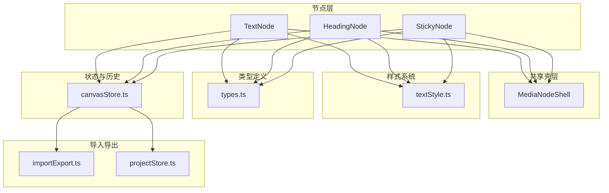
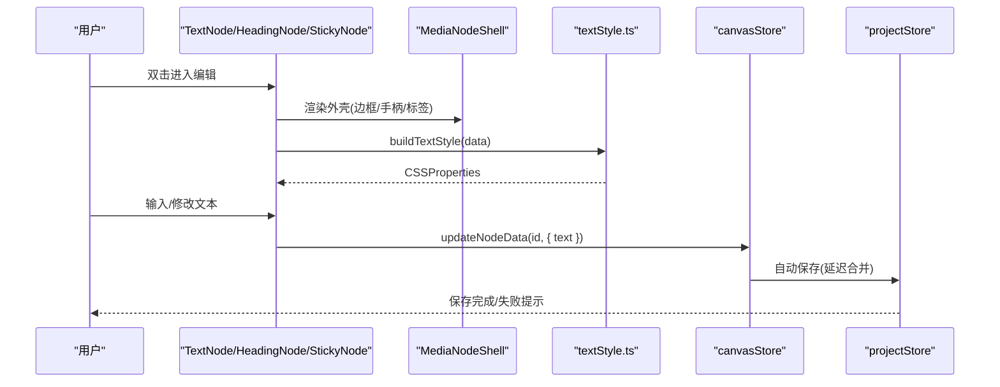
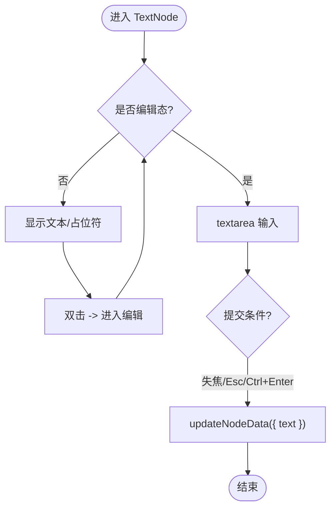
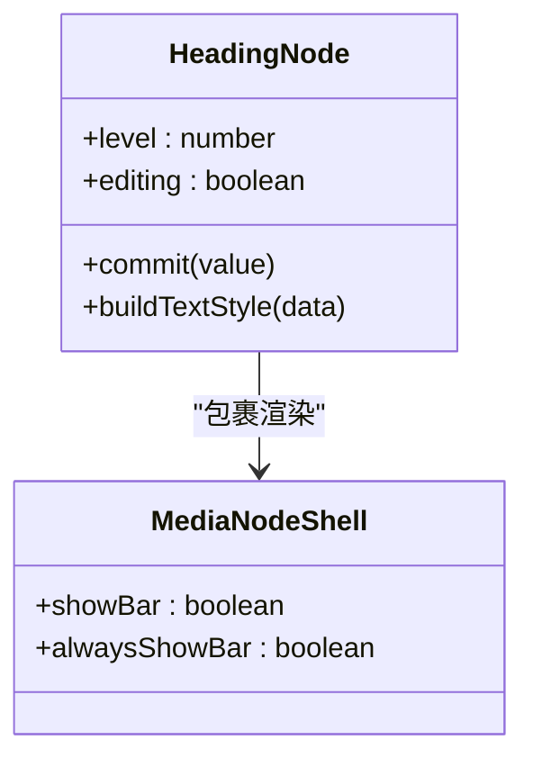
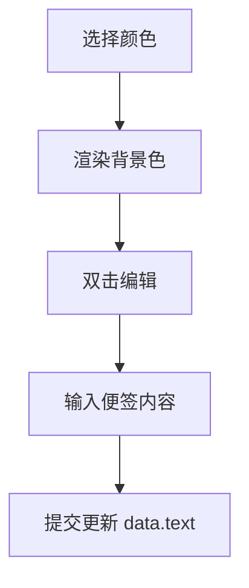
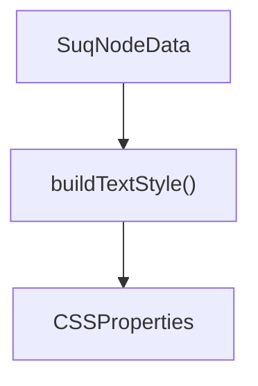
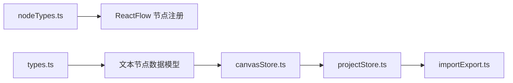

# 文本类节点

<cite>
**本文引用的文件**
- [TextNode.tsx](file://src/canvas/nodes/TextNode.tsx)
- [HeadingNode.tsx](file://src/canvas/nodes/HeadingNode.tsx)
- [StickyNode.tsx](file://src/canvas/nodes/StickyNode.tsx)
- [textStyle.ts](file://src/canvas/nodes/textStyle.ts)
- [MediaNodeShell.tsx](file://src/canvas/nodes/MediaNodeShell.tsx)
- [nodeTypes.ts](file://src/canvas/nodes/nodeTypes.ts)
- [types.ts](file://src/types.ts)
- [canvasStore.ts](file://src/store/canvasStore.ts)
- [importExport.ts](file://src/io/importExport.ts)
- [projectStore.ts](file://src/store/projectStore.ts)
</cite>

## 目录
1. [简介](#简介)
2. [项目结构](#项目结构)
3. [核心组件](#核心组件)
4. [架构总览](#架构总览)
5. [详细组件分析](#详细组件分析)
6. [依赖关系分析](#依赖关系分析)
7. [性能与体验优化](#性能与体验优化)
8. [故障排查](#故障排查)
9. [结论](#结论)
10. [附录：使用示例与配置项](#附录使用示例与配置项)

## 简介
本技术文档聚焦于文本类节点，系统性阐述以下能力：
- TextNode 富文本编辑、文本格式化、字体样式设置等实现细节
- HeadingNode 标题层级管理、工具栏交互、字号调节等设计
- StickyNode 便签的创建、编辑、颜色主题、视觉呈现等特性
- textStyle.ts 文本样式管理系统（字体、颜色、字号、行高、对齐）
- 文本内容的持久化存储与版本管理机制
- 文本编辑的性能优化技巧与用户体验改进建议

## 项目结构
文本类节点位于画布节点模块中，统一通过 MediaNodeShell 提供外壳（边框、手柄、底部标签、协作锁定提示），并通过 zustand store 进行状态管理与撤销重做。

图表来源
- [nodeTypes.ts:14-26](file://src/canvas/nodes/nodeTypes.ts#L14-L26)
- [MediaNodeShell.tsx:32-151](file://src/canvas/nodes/MediaNodeShell.tsx#L32-L151)
- [textStyle.ts:4-21](file://src/canvas/nodes/textStyle.ts#L4-L21)
- [types.ts:66-107](file://src/types.ts#L66-L107)
- [canvasStore.ts:118-399](file://src/store/canvasStore.ts#L118-L399)
- [importExport.ts:35-203](file://src/io/importExport.ts#L35-L203)
- [projectStore.ts:196-229](file://src/store/projectStore.ts#L196-L229)

章节来源
- [nodeTypes.ts:14-26](file://src/canvas/nodes/nodeTypes.ts#L14-L26)
- [MediaNodeShell.tsx:32-151](file://src/canvas/nodes/MediaNodeShell.tsx#L32-L151)

## 核心组件
- TextNode：支持双击进入编辑、自动聚焦、失焦提交、快捷键提交；可关联歌单并一键播放；应用统一的文本样式。
- HeadingNode：内置标题层级切换工具栏（默认/H1/H2/H3），支持实时调整字号；同样应用统一文本样式。
- StickyNode：便签节点，支持多种颜色主题背景；编辑行为与其他文本节点一致。
- textStyle.ts：集中构建 CSSProperties，包含水平/垂直对齐、字号、字体、颜色、粗细、斜体、下划线、行高等。
- MediaNodeShell：统一节点外壳，负责四向连接点、选中态、底部标签、协作者锁定提示、进度遮罩等。

章节来源
- [TextNode.tsx:13-107](file://src/canvas/nodes/TextNode.tsx#L13-L107)
- [HeadingNode.tsx:17-124](file://src/canvas/nodes/HeadingNode.tsx#L17-L124)
- [StickyNode.tsx:10-85](file://src/canvas/nodes/StickyNode.tsx#L10-L85)
- [textStyle.ts:4-21](file://src/canvas/nodes/textStyle.ts#L4-L21)
- [MediaNodeShell.tsx:32-151](file://src/canvas/nodes/MediaNodeShell.tsx#L32-L151)

## 架构总览
文本类节点遵循“展示-样式-状态”分层：
- 展示层：各 Node 组件负责渲染与交互（编辑态/非编辑态切换、工具栏、按钮）。
- 样式层：textStyle.ts 将 SuqNodeData 中的样式字段映射为 CSSProperties，保证一致性。
- 状态层：通过 canvasStore.updateNodeData 更新节点数据，触发撤销/重做历史快照。
- 外壳层：MediaNodeShell 提供通用 UI 与协作能力。
- 持久化：projectStore 自动保存；importExport 提供项目级导入导出与版本校验。

图表来源
- [TextNode.tsx:78-101](file://src/canvas/nodes/TextNode.tsx#L78-L101)
- [HeadingNode.tsx:91-117](file://src/canvas/nodes/HeadingNode.tsx#L91-L117)
- [StickyNode.tsx:52-79](file://src/canvas/nodes/StickyNode.tsx#L52-L79)
- [textStyle.ts:10-21](file://src/canvas/nodes/textStyle.ts#L10-L21)
- [canvasStore.ts:176-183](file://src/store/canvasStore.ts#L176-L183)
- [projectStore.ts:46-67](file://src/store/projectStore.ts#L46-L67)

## 详细组件分析

### TextNode：富文本编辑与样式
- 编辑模式：双击进入编辑，自动聚焦并全选；失焦或按 Esc/Ctrl+Enter 提交。
- 文本内容：data.text 作为显示与编辑值，提交时写入 data.text。
- 样式系统：通过 buildTextStyle 应用 textAlign、fontSize、fontFamily、textColor、bold、italic、underline、lineHeight；垂直对齐由 V_JUSTIFY 映射到 flex 布局。
- 歌单联动：若该节点被识别为歌单标题节点，且存在出边指向音频首节点，则显示“歌单”按钮，点击后打开播放器。
- 协作编辑：编辑期间通过 LAN 客户端广播当前编辑者信息，避免冲突。

图表来源
- [TextNode.tsx:78-101](file://src/canvas/nodes/TextNode.tsx#L78-L101)
- [textStyle.ts:4-21](file://src/canvas/nodes/textStyle.ts#L4-L21)

章节来源
- [TextNode.tsx:13-107](file://src/canvas/nodes/TextNode.tsx#L13-L107)
- [textStyle.ts:4-21](file://src/canvas/nodes/textStyle.ts#L4-L21)

### HeadingNode：标题层级管理与字号控制
- 层级管理：level=0 表示默认文本，1/2/3 对应不同标题样式（字号/字重）。
- 工具栏：在编辑态顶部显示层级切换按钮与字号滑块，实时更新 level 与 fontSize。
- 样式系统：同 TextNode，统一通过 buildTextStyle 应用文本样式；垂直对齐同上。
- 交互：双击进入编辑，失焦或快捷键提交；层级切换即时生效。

图表来源
- [HeadingNode.tsx:17-124](file://src/canvas/nodes/HeadingNode.tsx#L17-L124)
- [MediaNodeShell.tsx:32-151](file://src/canvas/nodes/MediaNodeShell.tsx#L32-L151)

章节来源
- [HeadingNode.tsx:17-124](file://src/canvas/nodes/HeadingNode.tsx#L17-L124)
- [textStyle.ts:4-21](file://src/canvas/nodes/textStyle.ts#L4-L21)

### StickyNode：便签节点与颜色主题
- 颜色主题：从 STICKY_COLORS 读取背景与边框色，支持黄/绿/蓝/粉/紫/灰。
- 编辑行为：与其他文本节点一致，双击编辑，失焦或快捷键提交。
- 样式系统：统一应用 buildTextStyle；背景色由 color 决定。
- 协作编辑：编辑期间广播当前编辑者信息。

图表来源
- [StickyNode.tsx:10-85](file://src/canvas/nodes/StickyNode.tsx#L10-L85)
- [types.ts:26-35](file://src/types.ts#L26-L35)

章节来源
- [StickyNode.tsx:10-85](file://src/canvas/nodes/StickyNode.tsx#L10-L85)
- [types.ts:26-35](file://src/types.ts#L26-L35)

### textStyle.ts：文本样式管理系统
- 垂直对齐：V_JUSTIFY 将 top/middle/bottom 映射为 flex-start/center/flex-end。
- 样式构建：buildTextStyle 根据 SuqNodeData 生成 CSSProperties，包括：
  - 水平对齐 textAlign
  - 字号 fontSize
  - 字体 fontFamily
  - 颜色 textColor
  - 加粗 bold -> fontWeight
  - 斜体 italic -> fontStyle
  - 下划线 underline -> textDecoration
  - 行高 lineHeight

图表来源
- [textStyle.ts:4-21](file://src/canvas/nodes/textStyle.ts#L4-L21)

章节来源
- [textStyle.ts:4-21](file://src/canvas/nodes/textStyle.ts#L4-L21)

### 媒体外壳 MediaNodeShell：统一外壳与协作
- 连接点：四向 source/target Handle，连线模式下四条边作为热区。
- 标签栏：显示节点图标与 label。
- 协作锁定：当其他用户在编辑同一节点时，显示覆盖提示并阻止交互。
- 进度遮罩：可选 progress 参数用于播放进度可视化。

章节来源
- [MediaNodeShell.tsx:32-151](file://src/canvas/nodes/MediaNodeShell.tsx#L32-L151)

## 依赖关系分析
- 组件注册：nodeTypes.ts 将 text/heading/sticky 等节点类型注册到 ReactFlow。
- 类型约束：types.ts 定义了 SuqNodeData 的所有样式与元数据字段，确保节点数据一致性。
- 状态管理：canvasStore.ts 提供 updateNodeData、undo/redo、历史记录与剪贴板。
- 持久化：projectStore.ts 监听画布变化并自动保存；importExport.ts 提供项目导出/导入与版本校验。

图表来源
- [nodeTypes.ts:14-26](file://src/canvas/nodes/nodeTypes.ts#L14-L26)
- [types.ts:66-107](file://src/types.ts#L66-L107)
- [canvasStore.ts:118-399](file://src/store/canvasStore.ts#L118-L399)
- [projectStore.ts:196-229](file://src/store/projectStore.ts#L196-L229)
- [importExport.ts:35-203](file://src/io/importExport.ts#L35-L203)

章节来源
- [nodeTypes.ts:14-26](file://src/canvas/nodes/nodeTypes.ts#L14-L26)
- [types.ts:66-107](file://src/types.ts#L66-L107)
- [canvasStore.ts:118-399](file://src/store/canvasStore.ts#L118-L399)
- [projectStore.ts:196-229](file://src/store/projectStore.ts#L196-L229)
- [importExport.ts:35-203](file://src/io/importExport.ts#L35-L203)

## 性能与体验优化
- 编辑态防抖与批量提交：
  - 使用失焦与快捷键提交，减少频繁更新；canvasStore 内部对历史快照进行节流合并，降低重绘压力。
- 样式计算缓存：
  - buildTextStyle 每次调用基于当前 data 计算，建议在父组件或 memo 中复用结果以减少重复计算。
- 渲染优化：
  - 使用 React.memo 包裹节点组件，避免不必要的重渲染。
  - MediaNodeShell 仅在 selected/hovered 时显示额外 UI，减少 DOM 复杂度。
- 协作体验：
  - 编辑期间广播当前编辑者，避免多人同时编辑同一节点造成冲突。
- 导入导出与版本：
  - 项目导出包含 format/version，导入时进行版本校验，防止不兼容格式导致崩溃。

[本节为通用指导，不直接分析具体文件]

## 故障排查
- 无法编辑或编辑无响应：
  - 检查是否处于协作锁定状态（MediaNodeShell 会显示覆盖提示）。
  - 确认 autoEdit 标志是否正确重置。
- 样式未生效：
  - 检查 SuqNodeData 中 textAlign/fontSize/fontFamily/textColor/bold/italic/underline/lineHeight 是否设置正确。
  - 确认 buildTextStyle 返回的 CSSProperties 已应用到容器元素。
- 保存失败：
  - 查看 projectStore.saveNow 的错误处理与 toast 提示；检查云端/本地存储权限与网络状态。
- 导入失败：
  - 检查项目文件格式与版本；确认 project.json 存在且可解析。

章节来源
- [MediaNodeShell.tsx:141-147](file://src/canvas/nodes/MediaNodeShell.tsx#L141-L147)
- [projectStore.ts:196-229](file://src/store/projectStore.ts#L196-L229)
- [importExport.ts:111-131](file://src/io/importExport.ts#L111-L131)

## 结论
文本类节点通过统一的样式系统与外壳封装，提供了稳定一致的编辑体验。HeadingNode 与 StickyNode 在基础文本能力之上分别扩展了层级管理与颜色主题。配合 canvasStore 的历史机制与 projectStore 的自动保存，以及 importExport 的版本化导入导出，形成了完整的文本节点工作流。未来可在样式预设、批量格式化、更丰富的排版选项等方面持续优化。

[本节为总结性内容，不直接分析具体文件]

## 附录：使用示例与配置项
以下为常见用法与配置项说明（以路径引用代替代码片段）：

- 创建文本节点并设置样式
  - 参考：[canvasStore.addNodes:159-171](file://src/store/canvasStore.ts#L159-L171)
  - 数据字段：text/fontFamily/fontSize/textColor/bold/italic/underline/lineHeight/textAlign/textAlignV
  - 参考：[types.SuqNodeData:66-98](file://src/types.ts#L66-L98)

- 设置标题层级与字号
  - 参考：[HeadingNode 工具栏:54-83](file://src/canvas/nodes/HeadingNode.tsx#L54-L83)
  - 层级映射：level=0/1/2/3
  - 字号范围：8..72

- 设置便签颜色主题
  - 参考：[StickyNode 颜色选择:10-13](file://src/canvas/nodes/StickyNode.tsx#L10-L13)
  - 颜色枚举与配色：[types.STICKY_COLORS:26-35](file://src/types.ts#L26-L35)

- 文本样式统一管理
  - 参考：[textStyle.buildTextStyle:10-21](file://src/canvas/nodes/textStyle.ts#L10-L21)
  - 垂直对齐映射：[textStyle.V_JUSTIFY:4-8](file://src/canvas/nodes/textStyle.ts#L4-L8)

- 文本内容持久化与版本管理
  - 自动保存：[projectStore 自动保存逻辑:46-67](file://src/store/projectStore.ts#L46-L67)
  - 手动保存：[projectStore.saveNow:196-229](file://src/store/projectStore.ts#L196-L229)
  - 导出项目（含版本）：[importExport.exportProjectToBlob:35-78](file://src/io/importExport.ts#L35-L78)
  - 导入项目（版本校验）：[importExport.importProjectFile:111-131](file://src/io/importExport.ts#L111-L131)

- 协作编辑与锁定
  - 参考：[MediaNodeShell 协作锁定:141-147](file://src/canvas/nodes/MediaNodeShell.tsx#L141-L147)
  - 编辑广播：[LAN 客户端编辑状态](file://src/sync/lanClient.ts)（由节点组件调用 setLanEditing/clearLanEditing）

章节来源
- [canvasStore.ts:159-171](file://src/store/canvasStore.ts#L159-L171)
- [types.ts:66-98](file://src/types.ts#L66-L98)
- [HeadingNode.tsx:54-83](file://src/canvas/nodes/HeadingNode.tsx#L54-L83)
- [StickyNode.tsx:10-13](file://src/canvas/nodes/StickyNode.tsx#L10-L13)
- [textStyle.ts:4-21](file://src/canvas/nodes/textStyle.ts#L4-L21)
- [projectStore.ts:46-67](file://src/store/projectStore.ts#L46-L67)
- [projectStore.ts:196-229](file://src/store/projectStore.ts#L196-L229)
- [importExport.ts:35-78](file://src/io/importExport.ts#L35-L78)
- [importExport.ts:111-131](file://src/io/importExport.ts#L111-L131)
- [MediaNodeShell.tsx:141-147](file://src/canvas/nodes/MediaNodeShell.tsx#L141-L147)