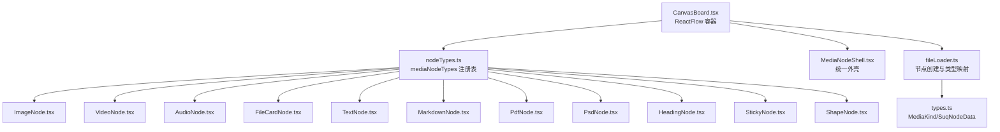
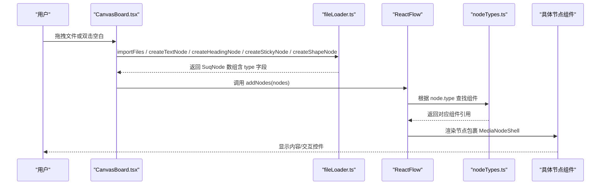
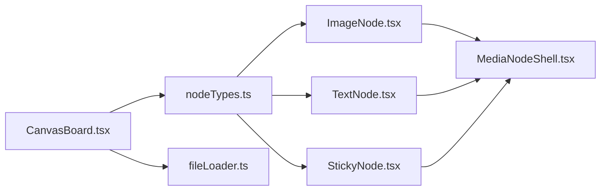
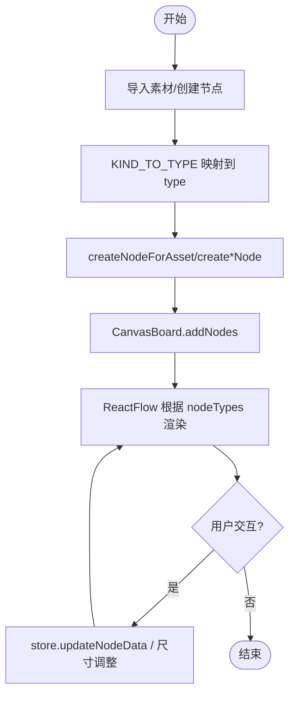

# 节点类型注册机制

<cite>
**本文引用的文件**
- [src/canvas/nodes/nodeTypes.ts](file://src/canvas/nodes/nodeTypes.ts)
- [src/canvas/CanvasBoard.tsx](file://src/canvas/CanvasBoard.tsx)
- [src/io/fileLoader.ts](file://src/io/fileLoader.ts)
- [src/types.ts](file://src/types.ts)
- [src/canvas/nodes/MediaNodeShell.tsx](file://src/canvas/nodes/MediaNodeShell.tsx)
- [src/canvas/nodes/ImageNode.tsx](file://src/canvas/nodes/ImageNode.tsx)
- [src/canvas/nodes/TextNode.tsx](file://src/canvas/nodes/TextNode.tsx)
- [src/canvas/nodes/StickyNode.tsx](file://src/canvas/nodes/StickyNode.tsx)
</cite>

## 目录
1. [简介](#简介)
2. [项目结构](#项目结构)
3. [核心组件](#核心组件)
4. [架构总览](#架构总览)
5. [详细组件分析](#详细组件分析)
6. [依赖关系分析](#依赖关系分析)
7. [性能考量](#性能考量)
8. [故障排查指南](#故障排查指南)
9. [结论](#结论)
10. [附录：扩展新节点类型的步骤与最佳实践](#附录：扩展新节点类型的步骤与最佳实践)

## 简介
本技术文档聚焦于画布中“节点类型注册机制”的实现与使用，围绕 mediaNodeTypes 对象的构建过程、命名约定与映射关系、节点类型扩展方式，以及与 ReactFlow 渲染引擎的集成和生命周期管理进行系统化说明。读者将了解如何从各节点组件导入并注册到 ReactFlow 的 NodeTypes 系统，以及如何通过统一的 Shell 组件与数据模型完成节点的渲染与交互。

## 项目结构
本项目采用按功能域组织文件的模式：
- 节点定义集中在 src/canvas/nodes 下，每个节点一个组件文件，并通过 nodeTypes.ts 统一导出媒体节点类型集合。
- 画布容器在 CanvasBoard.tsx 中创建 ReactFlow 实例，并将 mediaNodeTypes 注入为 nodeTypes。
- 节点创建逻辑集中在 io/fileLoader.ts，负责根据素材类型生成节点数据，并映射到对应的节点类型字符串。
- 通用类型定义在 types.ts，包括 MediaKind、SuqNodeData 等，确保节点数据结构的统一性。
- 公共外壳组件 MediaNodeShell.tsx 提供统一的边框、连接点、名称栏、协作锁定等能力，被多数节点复用。

图表来源
- [src/canvas/CanvasBoard.tsx:195-341](file://src/canvas/CanvasBoard.tsx#L195-L341)
- [src/canvas/nodes/nodeTypes.ts:1-26](file://src/canvas/nodes/nodeTypes.ts#L1-L26)
- [src/io/fileLoader.ts:137-182](file://src/io/fileLoader.ts#L137-L182)
- [src/types.ts:3-14](file://src/types.ts#L3-L14)

章节来源
- [src/canvas/CanvasBoard.tsx:195-341](file://src/canvas/CanvasBoard.tsx#L195-L341)
- [src/canvas/nodes/nodeTypes.ts:1-26](file://src/canvas/nodes/nodeTypes.ts#L1-L26)
- [src/io/fileLoader.ts:137-182](file://src/io/fileLoader.ts#L137-L182)
- [src/types.ts:3-14](file://src/types.ts#L3-L14)

## 核心组件
- mediaNodeTypes（注册表）：集中声明所有支持的节点类型键名与对应组件的映射，供 ReactFlow 渲染时查找。
- CanvasBoard（容器）：创建 ReactFlow 实例，传入 nodeTypes 与 edgeTypes，处理拖拽、双击添加文本、快捷键、视图同步等。
- MediaNodeShell（外壳）：为节点提供统一边框、四边连接点、名称栏、协作者锁定提示、进度遮罩等。
- 具体节点组件：如 ImageNode、TextNode、StickyNode 等，基于 MediaNodeShell 实现各自业务逻辑。
- fileLoader（节点工厂）：根据素材或操作创建节点数据，维护 MediaKind 到节点类型字符串的映射，并提供 create*Node 函数。

章节来源
- [src/canvas/nodes/nodeTypes.ts:1-26](file://src/canvas/nodes/nodeTypes.ts#L1-L26)
- [src/canvas/CanvasBoard.tsx:195-341](file://src/canvas/CanvasBoard.tsx#L195-L341)
- [src/canvas/nodes/MediaNodeShell.tsx:1-151](file://src/canvas/nodes/MediaNodeShell.tsx#L1-L151)
- [src/io/fileLoader.ts:137-182](file://src/io/fileLoader.ts#L137-L182)

## 架构总览
下图展示了从“用户操作/文件导入”到“节点渲染”的完整流程，以及 mediaNodeTypes 在其中的作用。

图表来源
- [src/canvas/CanvasBoard.tsx:222-240](file://src/canvas/CanvasBoard.tsx#L222-L240)
- [src/io/fileLoader.ts:186-200](file://src/io/fileLoader.ts#L186-L200)
- [src/canvas/nodes/nodeTypes.ts:14-26](file://src/canvas/nodes/nodeTypes.ts#L14-L26)

## 详细组件分析

### mediaNodeTypes 注册表
- 职责：集中导出 NodeTypes 对象，键名为节点类型字符串（如 image、video、audio、fileCard、text、markdown、pdf、psd、heading、sticky、shape），值为对应的 React 组件。
- 设计要点：
  - 键名需与节点数据中的 type 字段严格一致，否则 ReactFlow 无法匹配渲染。
  - 所有媒体类节点均通过 MediaNodeShell 获得统一外观与行为。
  - 新增节点类型只需在此处增加一行映射即可接入系统。

章节来源
- [src/canvas/nodes/nodeTypes.ts:1-26](file://src/canvas/nodes/nodeTypes.ts#L1-L26)

### 画布容器 CanvasBoard
- 职责：初始化 ReactFlow，注入 nodeTypes 与 edgeTypes；处理键盘快捷键、拖放导入、双击添加文本、视图同步、选择/连线模式切换等。
- 关键点：
  - nodeTypes 来自 mediaNodeTypes，edgeTypes 来自 edges/edgeTypes。
  - onPaneDoubleClick 会插入文本节点；onDrop 会调用 importFiles 批量导入。
  - 通过 useReactFlow 提供的 API 控制视口、缩放、居中。

章节来源
- [src/canvas/CanvasBoard.tsx:195-341](file://src/canvas/CanvasBoard.tsx#L195-L341)

### 节点外壳 MediaNodeShell
- 职责：为所有节点提供统一的外壳，包括：
  - 四边连接点（source/target），支持连线模式下的热区条带。
  - 底部名称栏，显示 kind 图标与 label。
  - 协作者锁定提示，避免多人同时编辑冲突。
  - 播放进度遮罩（可选）。
- 设计要点：
  - 通过 props.node.data.borderColor 控制边框颜色。
  - 使用 useUpdateNodeInternals 保证模式切换后连接热区正确测量。

章节来源
- [src/canvas/nodes/MediaNodeShell.tsx:1-151](file://src/canvas/nodes/MediaNodeShell.tsx#L1-L151)

### 典型节点组件示例

#### 图像节点 ImageNode
- 特性：
  - 使用 useAssetUrl 获取资源 URL，加载完成后自动计算合适尺寸并更新节点宽高。
  - 支持双击打开大图、下载原图。
  - 使用 NodeResizer 调整大小，并在开始/结束时上报局域网编辑状态。
- 与注册机制的关系：type 为 image，由 mediaNodeTypes.image 指向该组件。

章节来源
- [src/canvas/nodes/ImageNode.tsx:1-126](file://src/canvas/nodes/ImageNode.tsx#L1-L126)

#### 文本节点 TextNode
- 特性：
  - 支持双击进入编辑模式，失焦或按键提交保存。
  - 可识别“歌单标题”节点，点击可播放关联音频。
  - 使用 ResizeHandles 提供尺寸手柄。
- 与注册机制的关系：type 为 text，由 mediaNodeTypes.text 指向该组件。

章节来源
- [src/canvas/nodes/TextNode.tsx:1-107](file://src/canvas/nodes/TextNode.tsx#L1-L107)

#### 便签节点 StickyNode
- 特性：
  - 支持多种颜色主题，背景与边框色来自 STICKY_COLORS。
  - 双击编辑文本，失焦提交。
- 与注册机制的关系：type 为 sticky，由 mediaNodeTypes.sticky 指向该组件。

章节来源
- [src/canvas/nodes/StickyNode.tsx:1-85](file://src/canvas/nodes/StickyNode.tsx#L1-L85)

### 节点类型与数据映射
- MediaKind 到节点类型字符串的映射位于 fileLoader.ts 的 KIND_TO_TYPE 中，确保导入素材时生成的节点 type 与 mediaNodeTypes 的键名一致。
- 默认占位尺寸 PLACEHOLDER_SIZE 为不同 kind 提供合理的初始宽高，提升首次渲染体验。
- createNodeForAsset 根据素材元数据生成 SuqNode，包含 id、type、position、size、data 等字段。

章节来源
- [src/io/fileLoader.ts:137-182](file://src/io/fileLoader.ts#L137-L182)
- [src/types.ts:3-14](file://src/types.ts#L3-L14)

## 依赖关系分析
- CanvasBoard 依赖：
  - mediaNodeTypes（节点类型注册表）
  - styledEdgeTypes（边类型）
  - fileLoader（节点创建与导入）
  - store（画布状态、视口、事件回调）
- nodeTypes.ts 依赖：
  - 各节点组件（ImageNode、VideoNode、AudioNode、FileCardNode、TextNode、MarkdownNode、PdfNode、PsdNode、HeadingNode、StickyNode、ShapeNode）
- 节点组件依赖：
  - MediaNodeShell（外壳）
  - store（更新节点数据、打开查看器、播放器等）
  - sync（局域网协作锁定）
  - media（资源 URL、播放列表等）

图表来源
- [src/canvas/CanvasBoard.tsx:195-341](file://src/canvas/CanvasBoard.tsx#L195-L341)
- [src/canvas/nodes/nodeTypes.ts:1-26](file://src/canvas/nodes/nodeTypes.ts#L1-L26)
- [src/canvas/nodes/MediaNodeShell.tsx:1-151](file://src/canvas/nodes/MediaNodeShell.tsx#L1-L151)

章节来源
- [src/canvas/CanvasBoard.tsx:195-341](file://src/canvas/CanvasBoard.tsx#L195-L341)
- [src/canvas/nodes/nodeTypes.ts:1-26](file://src/canvas/nodes/nodeTypes.ts#L1-L26)
- [src/canvas/nodes/MediaNodeShell.tsx:1-151](file://src/canvas/nodes/MediaNodeShell.tsx#L1-L151)

## 性能考量
- 节点组件使用 memo 包裹，减少不必要的重渲染。
- 图片节点在加载完成后才调整尺寸，避免多次布局抖动。
- MediaNodeShell 在工具模式切换时主动触发内部测量更新，确保连接热区准确。
- 资源 URL 通过 useAssetUrl 缓存与懒加载，降低重复请求。
- 批量导入时顺序递增偏移，避免节点重叠。

[本节为通用性能建议，不直接分析具体代码行]

## 故障排查指南
- 节点无法渲染：
  - 检查 mediaNodeTypes 是否包含对应 type 键名，且值指向正确的组件。
  - 确认节点数据的 type 字段与注册表键名完全一致。
- 连线无效：
  - 确认节点使用了 MediaNodeShell，其内置 Handle 已正确挂载。
  - 检查当前工具是否为 connect 模式，isConnectable/isConnectableEnd 是否正确设置。
- 协作锁定异常：
  - 检查局域网编辑状态上报与清除逻辑是否在编辑开始/结束时调用。
- 导入失败：
  - 检查文件大小限制与存储权限，关注 toast 提示与错误日志。

章节来源
- [src/canvas/nodes/MediaNodeShell.tsx:48-51](file://src/canvas/nodes/MediaNodeShell.tsx#L48-L51)
- [src/io/fileLoader.ts:186-200](file://src/io/fileLoader.ts#L186-L200)

## 结论
本项目通过集中式的 mediaNodeTypes 注册表，将各类节点组件与 ReactFlow 的 NodeTypes 系统解耦对接，配合统一的 MediaNodeShell 外壳与标准化的节点数据结构，实现了高内聚、低耦合的节点体系。借助 fileLoader 的类型映射与工厂方法，用户可以便捷地导入素材并自动生成对应节点，极大简化了扩展与维护成本。

[本节为总结性内容，不直接分析具体代码行]

## 附录：扩展新节点类型的步骤与最佳实践

### 步骤概览
1. 新建节点组件
   - 在 src/canvas/nodes 下创建新组件，例如 NewNode.tsx。
   - 使用 MediaNodeShell 作为外层容器，实现自身业务逻辑。
   - 遵循现有节点的模式：memo 包裹、响应式尺寸、编辑态与提交逻辑、协作锁定上报。

2. 注册节点类型
   - 在 src/canvas/nodes/nodeTypes.ts 中导入新组件，并在 mediaNodeTypes 中添加键值对。
   - 键名建议使用小写驼峰或短横线风格，保持与现有命名一致（如 newType）。

3. 建立类型映射（如需）
   - 如果新节点可由素材导入生成，需在 src/io/fileLoader.ts 的 KIND_TO_TYPE 中添加映射。
   - 在 PLACEHOLDER_SIZE 中为新 kind 提供合适的默认尺寸。
   - 在 types.ts 的 MediaKind 中添加新的 kind 枚举值。

4. 提供创建函数（可选）
   - 若需要快捷创建新节点，可在 fileLoader.ts 中新增 createNewNode 函数，返回符合 SuqNode 的数据结构。
   - 在 CanvasBoard.tsx 中监听自定义事件或菜单动作，调用该函数并 addNodes。

5. 测试与验证
   - 验证节点渲染、编辑、连线、尺寸调整、协作锁定等行为。
   - 验证导入流程是否能正确生成新节点类型。

### 命名约定与映射关系
- 节点类型键名（type）必须与 mediaNodeTypes 的键名一致。
- 节点数据中的 kind 用于标识业务类别，可与 type 相同或不同，但需保持一致的语义。
- 推荐：
  - 媒体类节点：image、video、audio、fileCard、markdown、pdf、psd
  - 文本与标注：text、heading、sticky
  - 图形：shape
- 新增类型应遵循上述分类，保持可读性与一致性。

### 与渲染引擎的集成与生命周期
- 注册阶段：应用启动时，mediaNodeTypes 被加载并注入到 ReactFlow 的 nodeTypes。
- 渲染阶段：当 nodes 数组中出现某 type，ReactFlow 根据 nodeTypes 找到对应组件并渲染。
- 生命周期：
  - 节点创建：fileLoader 生成 SuqNode，CanvasBoard 调用 addNodes。
  - 节点更新：节点组件通过 store.updateNodeData 更新 data，触发重渲染。
  - 节点销毁：store 移除节点，ReactFlow 清理 DOM 与事件。
  - 协作锁定：MediaNodeShell 检测他人编辑状态，禁用交互并显示提示。

图表来源
- [src/io/fileLoader.ts:137-182](file://src/io/fileLoader.ts#L137-L182)
- [src/canvas/CanvasBoard.tsx:222-240](file://src/canvas/CanvasBoard.tsx#L222-L240)
- [src/canvas/nodes/nodeTypes.ts:14-26](file://src/canvas/nodes/nodeTypes.ts#L14-L26)

### 最佳实践
- 始终使用 MediaNodeShell 作为节点外壳，保证一致的边框、连接点与协作体验。
- 节点组件尽量无副作用地读取 store，仅在必要时更新数据。
- 使用 memo 包裹节点组件，避免不必要重渲染。
- 对大资源（图片、视频、PDF）采用懒加载与占位策略，提升首屏性能。
- 在编辑开始时上报协作锁定，结束时及时清除，避免误锁。
- 新增类型时同步更新类型定义、映射表与默认尺寸，确保端到端一致。

[本节为通用最佳实践，不直接分析具体代码行]