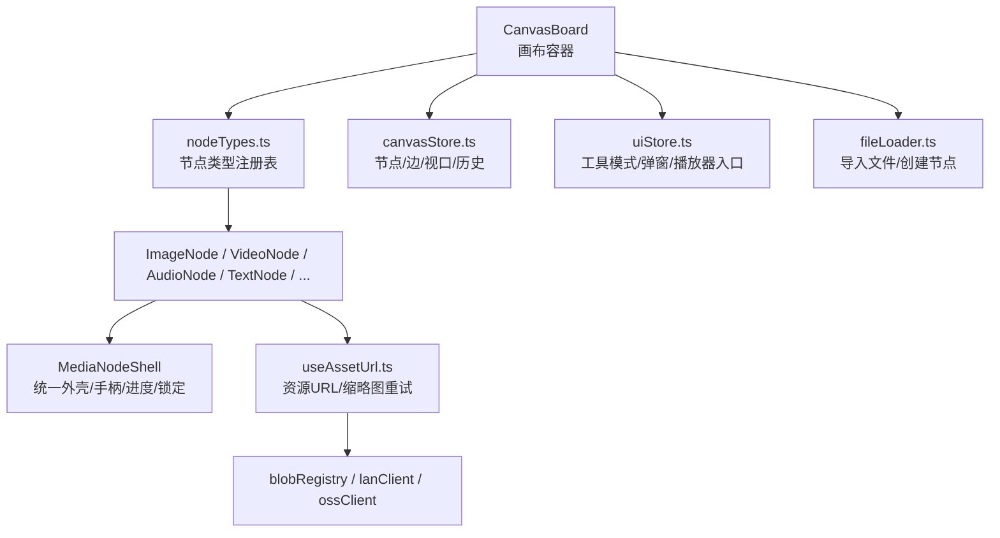
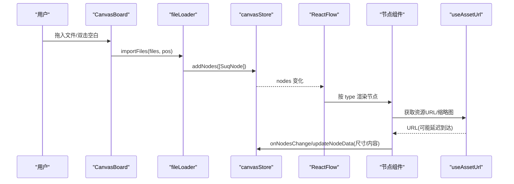
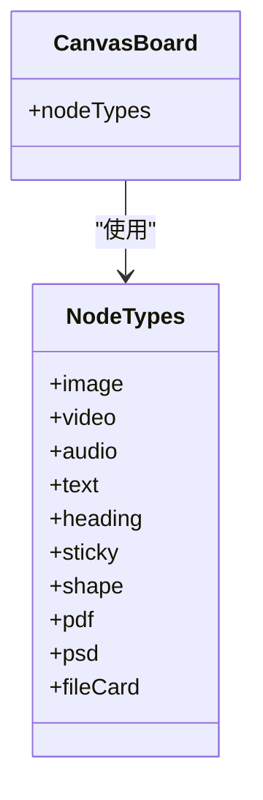
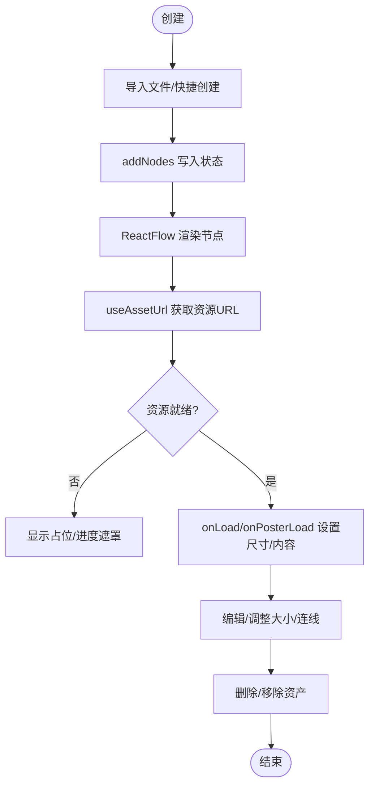
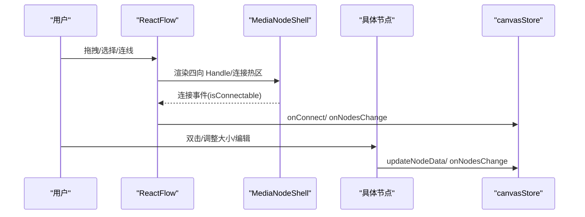
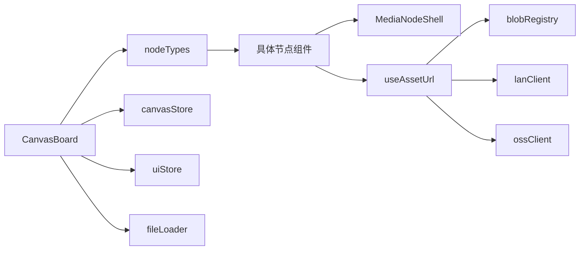

# 节点系统

<cite>
**本文引用的文件**
- [src/canvas/nodes/nodeTypes.ts](file://src/canvas/nodes/nodeTypes.ts)
- [src/canvas/CanvasBoard.tsx](file://src/canvas/CanvasBoard.tsx)
- [src/store/canvasStore.ts](file://src/store/canvasStore.ts)
- [src/types.ts](file://src/types.ts)
- [src/io/fileLoader.ts](file://src/io/fileLoader.ts)
- [src/media/useAssetUrl.ts](file://src/media/useAssetUrl.ts)
- [src/media/mediaCoordinator.ts](file://src/media/mediaCoordinator.ts)
- [src/canvas/nodes/MediaNodeShell.tsx](file://src/canvas/nodes/MediaNodeShell.tsx)
- [src/canvas/nodes/ImageNode.tsx](file://src/canvas/nodes/ImageNode.tsx)
- [src/canvas/nodes/VideoNode.tsx](file://src/canvas/nodes/VideoNode.tsx)
- [src/canvas/nodes/AudioNode.tsx](file://src/canvas/nodes/AudioNode.tsx)
- [src/canvas/nodes/TextNode.tsx](file://src/canvas/nodes/TextNode.tsx)
- [src/store/uiStore.ts](file://src/store/uiStore.ts)
</cite>

## 目录
1. [简介](#简介)
2. [项目结构](#项目结构)
3. [核心组件](#核心组件)
4. [架构总览](#架构总览)
5. [详细组件分析](#详细组件分析)
6. [依赖关系分析](#依赖关系分析)
7. [性能与内存优化建议](#性能与内存优化建议)
8. [故障排查指南](#故障排查指南)
9. [结论](#结论)
10. [附录：自定义节点类型示例](#附录自定义节点类型示例)

## 简介
本技术文档围绕画布节点系统展开，重点解释以下方面：
- 节点类型注册机制与动态加载（mediaNodeTypes 的构建）
- 节点生命周期管理（创建、渲染、更新、销毁）
- 节点属性系统（数据绑定、默认值、验证思路）
- 节点交互机制（拖拽、调整大小、选择、编辑、连线）
- 媒体节点壳组件（MediaNodeShell）的统一处理与预览能力
- 自定义节点类型的创建方式（定义、样式定制、事件处理）
- 性能优化与内存管理建议

## 项目结构
节点系统由“画布容器 + 节点类型注册 + 节点实现 + 状态存储 + 资源加载”五部分组成：
- 画布容器：ReactFlow 集成、工具模式、快捷键、拖放导入、视图同步等
- 节点类型注册：集中导出 mediaNodeTypes，供 ReactFlow 使用
- 节点实现：各类具体节点（图片、视频、音频、文本、标题、便签、形状、PDF、PSD、文件卡片）
- 状态存储：Zustand store 管理节点/边/视口/历史/剪贴板等
- 资源加载：本地 IndexedDB + 局域网/OSS 同步 + 缩略图/封面 URL 获取

图表来源
- [src/canvas/CanvasBoard.tsx:195-379](file://src/canvas/CanvasBoard.tsx#L195-L379)
- [src/canvas/nodes/nodeTypes.ts:14-26](file://src/canvas/nodes/nodeTypes.ts#L14-L26)
- [src/store/canvasStore.ts:118-399](file://src/store/canvasStore.ts#L118-L399)
- [src/io/fileLoader.ts:165-205](file://src/io/fileLoader.ts#L165-L205)
- [src/media/useAssetUrl.ts:10-44](file://src/media/useAssetUrl.ts#L10-L44)

章节来源
- [src/canvas/CanvasBoard.tsx:1-459](file://src/canvas/CanvasBoard.tsx#L1-L459)
- [src/canvas/nodes/nodeTypes.ts:1-27](file://src/canvas/nodes/nodeTypes.ts#L1-L27)
- [src/store/canvasStore.ts:1-399](file://src/store/canvasStore.ts#L1-L399)
- [src/io/fileLoader.ts:1-297](file://src/io/fileLoader.ts#L1-L297)
- [src/media/useAssetUrl.ts:1-157](file://src/media/useAssetUrl.ts#L1-L157)

## 核心组件
- 节点类型注册表：将各节点组件映射为字符串类型键，供 ReactFlow 渲染
- 媒体节点壳：提供统一的边框、底部信息栏、四向连接热区、播放进度遮罩、协作锁定提示
- 画布容器：负责节点/边的增删改、工具模式切换、快捷键、拖放导入、视图同步、选中/锁定过滤
- 状态存储：维护节点/边集合、视口、撤销重做历史、剪贴板、对齐/层级操作
- 资源加载：通过 assetId 获取本地/局域网/云端资源 URL，支持缩略图轮询与失败重试

章节来源
- [src/canvas/nodes/nodeTypes.ts:14-26](file://src/canvas/nodes/nodeTypes.ts#L14-L26)
- [src/canvas/nodes/MediaNodeShell.tsx:20-150](file://src/canvas/nodes/MediaNodeShell.tsx#L20-L150)
- [src/canvas/CanvasBoard.tsx:41-423](file://src/canvas/CanvasBoard.tsx#L41-L423)
- [src/store/canvasStore.ts:118-399](file://src/store/canvasStore.ts#L118-L399)
- [src/media/useAssetUrl.ts:10-99](file://src/media/useAssetUrl.ts#L10-L99)

## 架构总览
节点系统基于 @xyflow/react 的 ReactFlow 扩展。核心流程如下：
- 初始化时，CanvasBoard 将 mediaNodeTypes 注入 ReactFlow
- 用户拖入文件或双击空白处，fileLoader 生成 SuqNode 并调用 canvasStore.addNodes
- ReactFlow 根据 type 查找对应组件进行渲染；媒体类节点通常包裹 MediaNodeShell
- 节点内部通过 useCanvasStore.updateNodeData 或 onNodesChange 更新自身 data/尺寸
- 资源通过 useAssetUrl/useThumbnailUrl 异步获取，支持局域网分片传输的重试与等待
- 协作场景下，通过 LAN 锁定与编辑中状态，避免冲突操作

图表来源
- [src/canvas/CanvasBoard.tsx:222-241](file://src/canvas/CanvasBoard.tsx#L222-L241)
- [src/io/fileLoader.ts:186-205](file://src/io/fileLoader.ts#L186-L205)
- [src/store/canvasStore.ts:159-171](file://src/store/canvasStore.ts#L159-L171)
- [src/media/useAssetUrl.ts:10-44](file://src/media/useAssetUrl.ts#L10-L44)

## 详细组件分析

### 节点类型注册机制与动态加载
- 注册表：mediaNodeTypes 将字符串类型键映射到具体节点组件，如 image、video、audio、text、heading、sticky、shape、pdf、psd、fileCard
- 注入点：CanvasBoard 将 nodeTypes=mediaNodeTypes 传入 ReactFlow，使画布能识别并渲染这些节点
- 动态性：新增节点类型只需在 nodeTypes.ts 中注册，并在 fileLoader 的 KIND_TO_TYPE 映射中添加对应关系，即可被导入流程自动创建

图表来源
- [src/canvas/nodes/nodeTypes.ts:14-26](file://src/canvas/nodes/nodeTypes.ts#L14-L26)
- [src/canvas/CanvasBoard.tsx:195-196](file://src/canvas/CanvasBoard.tsx#L195-L196)

章节来源
- [src/canvas/nodes/nodeTypes.ts:1-27](file://src/canvas/nodes/nodeTypes.ts#L1-L27)
- [src/canvas/CanvasBoard.tsx:195-196](file://src/canvas/CanvasBoard.tsx#L195-L196)
- [src/io/fileLoader.ts:137-149](file://src/io/fileLoader.ts#L137-L149)

### 节点生命周期管理
- 创建：
  - 文件导入：importFiles -> putAsset -> createNodeForAsset -> addNodes
  - 快捷创建：createTextNode/createHeadingNode/createStickyNode/createShapeNode -> addNodes
  - 插入元数据：addNodes 会为节点补充 createdById/createdByName/createdAt
- 渲染：
  - ReactFlow 根据 type 匹配组件；媒体节点通常以 MediaNodeShell 包裹
  - 资源 URL 通过 useAssetUrl/useThumbnailUrl 异步获取，首次为空时显示占位
- 更新：
  - 尺寸：图片/视频在资源加载完成后通过 dimensions 变更自适应
  - 内容：文本节点通过 updateNodeData 持久化 text/样式
  - 进度：音频节点根据播放器状态计算 progress 并渲染遮罩
- 销毁：
  - 删除节点/边会触发 history snapshot；移除关联资产时会清理节点和边
  - 资源 URL 钩子在组件卸载时清理定时器/标志，避免泄漏

图表来源
- [src/io/fileLoader.ts:186-205](file://src/io/fileLoader.ts#L186-L205)
- [src/store/canvasStore.ts:159-171](file://src/store/canvasStore.ts#L159-L171)
- [src/media/useAssetUrl.ts:10-44](file://src/media/useAssetUrl.ts#L10-L44)
- [src/canvas/nodes/ImageNode.tsx:39-56](file://src/canvas/nodes/ImageNode.tsx#L39-L56)
- [src/canvas/nodes/VideoNode.tsx:30-49](file://src/canvas/nodes/VideoNode.tsx#L30-L49)

章节来源
- [src/io/fileLoader.ts:186-205](file://src/io/fileLoader.ts#L186-L205)
- [src/store/canvasStore.ts:159-171](file://src/store/canvasStore.ts#L159-L171)
- [src/canvas/nodes/ImageNode.tsx:15-56](file://src/canvas/nodes/ImageNode.tsx#L15-L56)
- [src/canvas/nodes/VideoNode.tsx:18-49](file://src/canvas/nodes/VideoNode.tsx#L18-L49)
- [src/media/useAssetUrl.ts:10-44](file://src/media/useAssetUrl.ts#L10-L44)

### 节点属性系统（数据绑定、验证、默认值）
- 数据类型：SuqNodeData 定义了 kind、assetId、label、尺寸、颜色、文本、对齐、字体、作者信息等字段
- 默认值：
  - 导入时根据 kind 设置 PLACEHOLDER_SIZE 作为初始宽高
  - 文本/标题/便签/形状等快捷创建函数提供默认 label/text/color/fill 等
- 数据绑定：
  - 节点通过 props.data 读取属性，并通过 updateNodeData/onNodesChange 写回
  - 媒体节点通过 useAssetUrl/useThumbnailUrl 绑定资源 URL
- 验证：
  - 资源 URL 获取失败时进行重试/轮询，避免直接报错阻断
  - 文件大小限制（最大 1.5GB），超出则跳过并提示
  - 对齐/层级等操作对输入进行边界保护（如 zIndex 范围限制）

章节来源
- [src/types.ts:66-107](file://src/types.ts#L66-L107)
- [src/io/fileLoader.ts:151-182](file://src/io/fileLoader.ts#L151-L182)
- [src/io/fileLoader.ts:207-297](file://src/io/fileLoader.ts#L207-L297)
- [src/store/canvasStore.ts:266-274](file://src/store/canvasStore.ts#L266-L274)
- [src/media/useAssetUrl.ts:10-44](file://src/media/useAssetUrl.ts#L10-L44)

### 节点交互机制（拖拽、调整大小、选择、编辑、连线）
- 拖拽：
  - 工具模式 select/drag 控制是否可拖拽节点
  - 拖拽开始/结束时广播协作编辑状态（setLanEditing/clearLanEditing）
- 调整大小：
  - 图片节点使用 NodeResizer，在选中且未被他人锁定时显示
  - 文本节点通过 ResizeHandles 调整宽度
- 选择：
  - 多选框选，Ctrl+A 全选，删除键删除
  - 选中态影响 MediaNodeShell 的边框高亮与信息栏显示
- 编辑：
  - 文本节点双击进入编辑模式，失焦或按键提交
  - 媒体节点双击打开专用查看器/播放器
- 连线：
  - connect 模式下，MediaNodeShell 四条边暴露连接热区
  - onConnect 创建 styled 边，默认样式来自 DEFAULT_EDGE_STYLE

图表来源
- [src/canvas/nodes/MediaNodeShell.tsx:68-105](file://src/canvas/nodes/MediaNodeShell.tsx#L68-L105)
- [src/canvas/CanvasBoard.tsx:337-379](file://src/canvas/CanvasBoard.tsx#L337-L379)
- [src/store/canvasStore.ts:146-158](file://src/store/canvasStore.ts#L146-L158)
- [src/canvas/nodes/ImageNode.tsx:60-69](file://src/canvas/nodes/ImageNode.tsx#L60-L69)
- [src/canvas/nodes/TextNode.tsx:78-103](file://src/canvas/nodes/TextNode.tsx#L78-L103)

章节来源
- [src/canvas/nodes/MediaNodeShell.tsx:68-105](file://src/canvas/nodes/MediaNodeShell.tsx#L68-L105)
- [src/canvas/CanvasBoard.tsx:337-379](file://src/canvas/CanvasBoard.tsx#L337-L379)
- [src/canvas/nodes/ImageNode.tsx:60-69](file://src/canvas/nodes/ImageNode.tsx#L60-L69)
- [src/canvas/nodes/TextNode.tsx:78-103](file://src/canvas/nodes/TextNode.tsx#L78-L103)
- [src/store/canvasStore.ts:146-158](file://src/store/canvasStore.ts#L146-L158)

### 媒体节点壳组件（MediaNodeShell）
- 统一外壳：圆角边框、背景色、阴影、选中态样式
- 底部信息栏：显示图标与文件名，支持始终显示
- 连接热区：四条边同时暴露 source/target Handle，仅在 connect 模式下可用
- 播放进度：可选 progress 参数，渲染铺满节点的半透明遮罩
- 协作锁定：若其他用户正在编辑该节点，显示锁定提示并阻止交互
- 内部插槽：children 承载具体媒体内容（图片/视频/音频/文本等）

章节来源
- [src/canvas/nodes/MediaNodeShell.tsx:20-150](file://src/canvas/nodes/MediaNodeShell.tsx#L20-L150)

### 具体媒体节点
- 图片节点：
  - 使用 useAssetUrl 获取图片 URL，加载完成后按最大宽高比自适应尺寸
  - 双击打开大图查看器，悬浮按钮支持下载
- 视频节点：
  - 仅展示缩略图与播放按钮，点击/双击进入全屏播放器页
  - 缩略图加载后自适应节点尺寸
- 音频节点：
  - 显示专辑封面、播放/暂停按钮、时间信息
  - 当前播放曲目显示进度遮罩；双击进入流式播放器页
- 文本节点：
  - 支持多行编辑、样式配置（字体、字号、颜色、对齐）
  - 若命名了歌单（文本→出边→音频首节点），可一键播放

章节来源
- [src/canvas/nodes/ImageNode.tsx:15-126](file://src/canvas/nodes/ImageNode.tsx#L15-L126)
- [src/canvas/nodes/VideoNode.tsx:18-88](file://src/canvas/nodes/VideoNode.tsx#L18-L88)
- [src/canvas/nodes/AudioNode.tsx:18-126](file://src/canvas/nodes/AudioNode.tsx#L18-L126)
- [src/canvas/nodes/TextNode.tsx:13-107](file://src/canvas/nodes/TextNode.tsx#L13-L107)

## 依赖关系分析
- CanvasBoard 依赖：
  - nodeTypes.ts（节点类型注册）
  - canvasStore.ts（节点/边/视口/历史）
  - uiStore.ts（工具模式/弹窗/播放器入口）
  - fileLoader.ts（导入与创建节点）
  - edges/edgeTypes.ts（边样式）
- 节点组件依赖：
  - MediaNodeShell（统一外壳）
  - useAssetUrl（资源 URL）
  - canvasStore（数据更新）
  - uiStore（打开查看器/播放器）
  - lanStore（协作锁定/光标）
- 资源层依赖：
  - blobRegistry（本地/局域网资源 URL）
  - lanClient（局域网推送/订阅）
  - ossClient/cloudSync（云端上传/元数据同步）

图表来源
- [src/canvas/CanvasBoard.tsx:17-35](file://src/canvas/CanvasBoard.tsx#L17-L35)
- [src/canvas/nodes/nodeTypes.ts:1-26](file://src/canvas/nodes/nodeTypes.ts#L1-L26)
- [src/media/useAssetUrl.ts:1-157](file://src/media/useAssetUrl.ts#L1-L157)

章节来源
- [src/canvas/CanvasBoard.tsx:17-35](file://src/canvas/CanvasBoard.tsx#L17-L35)
- [src/canvas/nodes/nodeTypes.ts:1-26](file://src/canvas/nodes/nodeTypes.ts#L1-L26)
- [src/media/useAssetUrl.ts:1-157](file://src/media/useAssetUrl.ts#L1-L157)

## 性能与内存优化建议
- 资源加载
  - 使用缩略图而非完整媒体文件进行画布预览，减少带宽与内存占用
  - 利用 useAssetUrl/useThumbnailUrl 的重试与轮询机制，避免瞬时失败导致卡顿
- 渲染优化
  - 媒体节点尽量懒加载：仅在可见或交互时请求完整资源
  - 使用 memo 包裹节点组件，减少不必要的重渲染
- 协作与锁定
  - 通过 LAN 锁定避免多人同时编辑同一节点导致的冲突与重复渲染
- 历史与快照
  - 使用防抖的历史快照策略，降低频繁操作的存储压力
- 内存管理
  - 及时释放 ObjectURL 与定时器（useAssetUrl 已处理 alive 标志）
  - 删除节点时清理关联资产，避免孤儿资源

[本节为通用指导，不直接分析具体文件]

## 故障排查指南
- 资源加载失败
  - 现象：图片/视频无内容或长时间占位
  - 排查：检查 useAssetUrl/useThumbnailUrl 重试逻辑、局域网连接状态、OSS 配置
  - 参考路径：[src/media/useAssetUrl.ts:10-99](file://src/media/useAssetUrl.ts#L10-L99)
- 导入失败
  - 现象：拖入文件无反应或提示失败
  - 排查：文件大小是否超过限制、putAsset 是否成功、云/局域网同步是否失败
  - 参考路径：[src/io/fileLoader.ts:186-205](file://src/io/fileLoader.ts#L186-L205)
- 协作冲突
  - 现象：节点无法拖拽/编辑，显示锁定提示
  - 排查：确认 LAN 编辑中状态、其他用户是否仍在操作
  - 参考路径：[src/canvas/nodes/MediaNodeShell.tsx:44-66](file://src/canvas/nodes/MediaNodeShell.tsx#L44-L66)
- 尺寸异常
  - 现象：图片/视频尺寸不正确
  - 排查：onLoad/onPosterLoad 是否执行、MAX_W/MAX_H 限制是否合理
  - 参考路径：[src/canvas/nodes/ImageNode.tsx:39-56](file://src/canvas/nodes/ImageNode.tsx#L39-L56), [src/canvas/nodes/VideoNode.tsx:30-49](file://src/canvas/nodes/VideoNode.tsx#L30-L49)

章节来源
- [src/media/useAssetUrl.ts:10-99](file://src/media/useAssetUrl.ts#L10-L99)
- [src/io/fileLoader.ts:186-205](file://src/io/fileLoader.ts#L186-L205)
- [src/canvas/nodes/MediaNodeShell.tsx:44-66](file://src/canvas/nodes/MediaNodeShell.tsx#L44-L66)
- [src/canvas/nodes/ImageNode.tsx:39-56](file://src/canvas/nodes/ImageNode.tsx#L39-L56)
- [src/canvas/nodes/VideoNode.tsx:30-49](file://src/canvas/nodes/VideoNode.tsx#L30-L49)

## 结论
该节点系统以 ReactFlow 为基础，结合 Zustand 状态管理与本地/局域网/云端资源协同，实现了丰富的媒体节点类型与协作编辑能力。通过统一的 MediaNodeShell 与完善的资源加载机制，系统在易用性与性能之间取得平衡。未来可扩展更多节点类型与交互能力，同时持续优化资源加载与渲染性能。

[本节为总结，不直接分析具体文件]

## 附录：自定义节点类型示例
以下示例展示如何创建一个新的自定义节点类型（例如“代码片段节点”），包括节点定义、样式定制、事件处理等步骤。请根据实际业务替换占位描述。

- 步骤一：定义节点类型
  - 在 types.ts 中扩展 MediaKind（如需）
  - 在 nodeTypes.ts 中将新类型键映射到新组件
  - 在 fileLoader.ts 的 KIND_TO_TYPE 中添加映射（若需从文件导入）

- 步骤二：实现节点组件
  - 新建 CodeSnippetNode.tsx，使用 MediaNodeShell 包裹内容
  - 通过 props.data 读取属性（kind、label、text、样式等）
  - 使用 useCanvasStore.updateNodeData 保存编辑结果
  - 如需调整大小，可使用 NodeResizer 或自定义 ResizeHandles

- 步骤三：样式定制
  - 在 MediaNodeShell 中通过 data.borderColor/backgroundColor 控制外观
  - 在节点内部添加自定义样式类名与布局

- 步骤四：事件处理
  - 双击打开编辑器或预览窗口（通过 uiStore.open*Viewer）
  - 监听键盘/鼠标事件，触发保存/复制/分享等操作

- 步骤五：测试与调试
  - 在 CanvasBoard 中通过快捷创建或导入流程验证
  - 检查资源加载、协作锁定、历史记录等行为

参考路径
- [src/canvas/nodes/nodeTypes.ts:14-26](file://src/canvas/nodes/nodeTypes.ts#L14-L26)
- [src/io/fileLoader.ts:137-149](file://src/io/fileLoader.ts#L137-L149)
- [src/canvas/nodes/MediaNodeShell.tsx:20-150](file://src/canvas/nodes/MediaNodeShell.tsx#L20-L150)
- [src/canvas/nodes/ImageNode.tsx:15-126](file://src/canvas/nodes/ImageNode.tsx#L15-L126)
- [src/canvas/nodes/TextNode.tsx:13-107](file://src/canvas/nodes/TextNode.tsx#L13-L107)
- [src/store/uiStore.ts:18-45](file://src/store/uiStore.ts#L18-L45)

[本节为概念性指导，不直接分析具体文件]