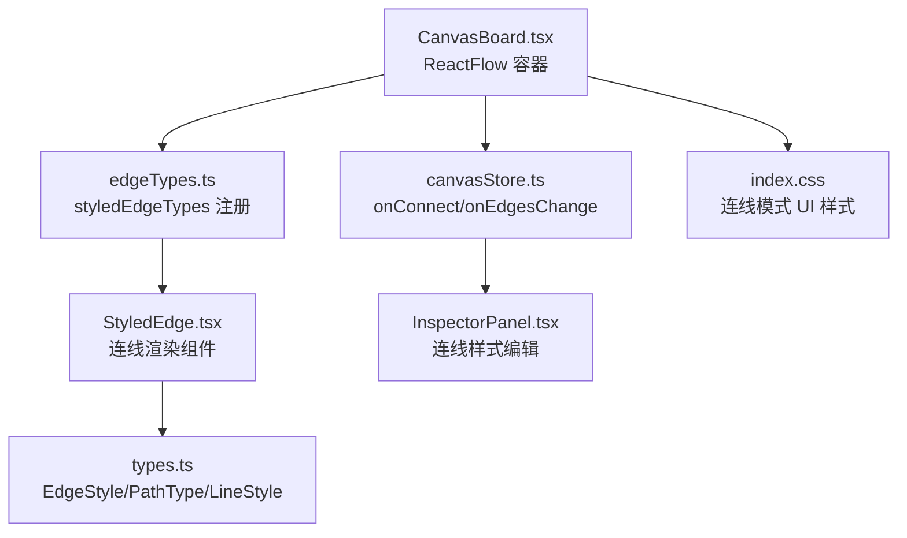
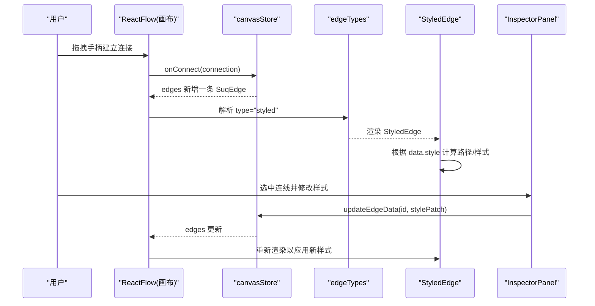
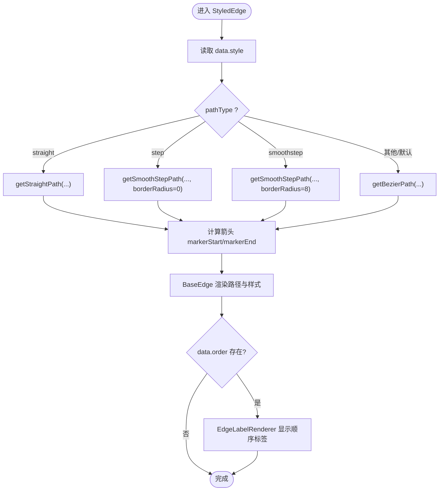
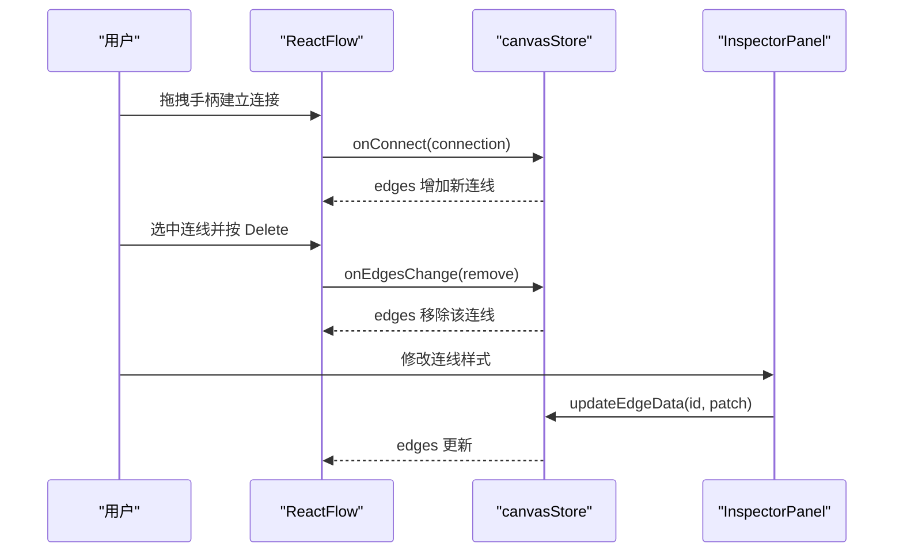
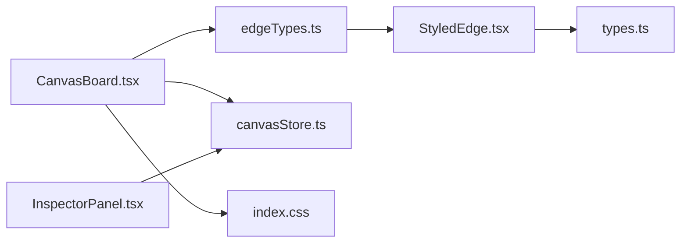

# 连线系统

<cite>
**本文引用的文件**
- [src/canvas/edges/edgeTypes.ts](file://src/canvas/edges/edgeTypes.ts)
- [src/canvas/edges/StyledEdge.tsx](file://src/canvas/edges/StyledEdge.tsx)
- [src/types.ts](file://src/types.ts)
- [src/canvas/CanvasBoard.tsx](file://src/canvas/CanvasBoard.tsx)
- [src/store/canvasStore.ts](file://src/store/canvasStore.ts)
- [src/components/InspectorPanel.tsx](file://src/components/InspectorPanel.tsx)
- [src/index.css](file://src/index.css)
</cite>

## 目录
1. [简介](#简介)
2. [项目结构](#项目结构)
3. [核心组件](#核心组件)
4. [架构总览](#架构总览)
5. [详细组件分析](#详细组件分析)
6. [依赖关系分析](#依赖关系分析)
7. [性能考虑](#性能考虑)
8. [故障排查指南](#故障排查指南)
9. [结论](#结论)
10. [附录：自定义连线类型实现指南](#附录自定义连线类型实现指南)

## 简介
本技术文档围绕画布项目的“连线系统”展开，系统性说明连线的类型定义与注册机制、绘制算法（贝塞尔曲线、路径选择、锚点定位）、样式系统（颜色、粗细、虚线/点线、箭头）、交互流程（创建、删除、编辑）、验证规则（自环检测等），并提供扩展自定义连线类型的实践建议与性能优化要点。

## 项目结构
连线系统主要分布在以下模块：
- 连线类型注册：将 React Flow 的 edgeTypes 映射到具体连线组件
- 连线渲染：基于 React Flow 提供的路径计算函数生成 SVG 路径并应用样式
- 数据模型：统一描述连线样式、箭头方向、路径类型等
- 画布容器：配置连线交互行为、连接校验、默认连线样式
- 状态管理：处理连线创建、更新、删除以及撤销重做历史
- 检查面板：提供连线样式的可视化编辑能力
- 样式覆盖：在连线模式下对节点手柄进行视觉增强

图表来源
- [src/canvas/CanvasBoard.tsx:336-370](file://src/canvas/CanvasBoard.tsx#L336-L370)
- [src/canvas/edges/edgeTypes.ts:1-6](file://src/canvas/edges/edgeTypes.ts#L1-L6)
- [src/canvas/edges/StyledEdge.tsx:1-130](file://src/canvas/edges/StyledEdge.tsx#L1-L130)
- [src/types.ts:46-64](file://src/types.ts#L46-L64)
- [src/store/canvasStore.ts:146-158](file://src/store/canvasStore.ts#L146-L158)
- [src/index.css:215-267](file://src/index.css#L215-L267)

章节来源
- [src/canvas/CanvasBoard.tsx:336-370](file://src/canvas/CanvasBoard.tsx#L336-L370)
- [src/canvas/edges/edgeTypes.ts:1-6](file://src/canvas/edges/edgeTypes.ts#L1-L6)
- [src/types.ts:46-64](file://src/types.ts#L46-L64)
- [src/store/canvasStore.ts:146-158](file://src/store/canvasStore.ts#L146-L158)
- [src/index.css:215-267](file://src/index.css#L215-L267)

## 核心组件
- 连线类型注册：通过 styledEdgeTypes 将字符串类型名 "styled" 映射到 StyledEdge 组件，供 React Flow 渲染使用。
- 连线渲染组件：StyledEdge 根据 data.style 决定路径类型、线条样式、箭头位置，并使用 React Flow 的路径计算函数生成 SVG 路径。
- 数据模型：types.ts 定义了 EdgeStyle、PathType、LineStyle、ArrowPos 等类型及默认样式 DEFAULT_EDGE_STYLE。
- 画布容器：CanvasBoard 中配置连线交互（连接半径、连接校验、删除键、连接预览样式）并将 edgeTypes 注入 ReactFlow。
- 状态管理：canvasStore 中的 onConnect 负责创建新连线并赋予默认样式；onEdgesChange 处理连线增删改。
- 检查面板：InspectorPanel 暴露连线样式编辑入口（颜色、粗细、虚线/点线、路径类型、箭头方向、顺序）。

章节来源
- [src/canvas/edges/edgeTypes.ts:1-6](file://src/canvas/edges/edgeTypes.ts#L1-L6)
- [src/canvas/edges/StyledEdge.tsx:1-130](file://src/canvas/edges/StyledEdge.tsx#L1-L130)
- [src/types.ts:46-64](file://src/types.ts#L46-L64)
- [src/canvas/CanvasBoard.tsx:336-370](file://src/canvas/CanvasBoard.tsx#L336-L370)
- [src/store/canvasStore.ts:146-158](file://src/store/canvasStore.ts#L146-L158)
- [src/components/InspectorPanel.tsx:1-200](file://src/components/InspectorPanel.tsx#L1-L200)

## 架构总览
连线系统的整体数据流与渲染流程如下：

图表来源
- [src/canvas/CanvasBoard.tsx:336-370](file://src/canvas/CanvasBoard.tsx#L336-L370)
- [src/store/canvasStore.ts:146-158](file://src/store/canvasStore.ts#L146-L158)
- [src/canvas/edges/edgeTypes.ts:1-6](file://src/canvas/edges/edgeTypes.ts#L1-L6)
- [src/canvas/edges/StyledEdge.tsx:1-130](file://src/canvas/edges/StyledEdge.tsx#L1-L130)
- [src/components/InspectorPanel.tsx:1-200](file://src/components/InspectorPanel.tsx#L1-L200)

## 详细组件分析

### 连线类型定义与注册机制
- 类型定义集中在 types.ts：
  - LineStyle：solid/dashed/dotted
  - PathType：bezier/straight/step/smoothstep
  - ArrowPos：none/start/end/both
  - EdgeStyle：包含 lineStyle、pathType、arrow、stroke、strokeWidth
  - DEFAULT_EDGE_STYLE：默认连线样式
  - SuqEdgeData：包含 style 和可选 order（用于歌单分叉播放顺序）
- 注册机制：
  - edgeTypes.ts 导出 styledEdgeTypes，将 "styled" 映射到 StyledEdge 组件
  - CanvasBoard 中将 edgeTypes={styledEdgeTypes} 传入 ReactFlow，使连线按类型渲染

章节来源
- [src/types.ts:46-64](file://src/types.ts#L46-L64)
- [src/types.ts:100-107](file://src/types.ts#L100-L107)
- [src/canvas/edges/edgeTypes.ts:1-6](file://src/canvas/edges/edgeTypes.ts#L1-L6)
- [src/canvas/CanvasBoard.tsx:336-370](file://src/canvas/CanvasBoard.tsx#L336-L370)

### 连线绘制算法与路径选择
- 路径计算：
  - 直线：getStraightPath
  - 直角折线：getSmoothStepPath（圆角半径可配）
  - 平滑折线：getSmoothStepPath（带圆角）
  - 贝塞尔曲线：getBezierPath（默认）
- 锚点定位：
  - 使用 sourceX/Y、targetX/Y 与 sourcePosition/targetPosition 作为端点与方向信息
  - 标签位置由路径计算函数返回的 edgeLabelX/Y 确定，并通过 EdgeLabelRenderer 绝对定位显示
- 箭头标记：
  - 动态生成 markerId，依据 arrow 配置设置 markerStart/markerEnd
  - 箭头颜色跟随连线 stroke，支持两端或单端箭头

图表来源
- [src/canvas/edges/StyledEdge.tsx:11-77](file://src/canvas/edges/StyledEdge.tsx#L11-L77)
- [src/canvas/edges/StyledEdge.tsx:79-126](file://src/canvas/edges/StyledEdge.tsx#L79-L126)

章节来源
- [src/canvas/edges/StyledEdge.tsx:11-77](file://src/canvas/edges/StyledEdge.tsx#L11-L77)
- [src/canvas/edges/StyledEdge.tsx:79-126](file://src/canvas/edges/StyledEdge.tsx#L79-L126)

### 连线样式系统
- 颜色与粗细：
  - stroke 来自 data.style.stroke；选中时高亮为特定蓝色
  - strokeWidth 控制线条宽度
- 虚线与点线：
  - lineStyle 为 dashed/dotted 时，通过 strokeDasharray 与 strokeLinecap 组合实现
  - 点线使用 round 端点以获得更柔和效果
- 箭头：
  - arrow 为 start/end/both/none，影响 markerStart/markerEnd
- 路径类型：
  - pathType 控制 getBezierPath/getSmoothStepPath/getStraightPath 的选择
- 默认样式：
  - DEFAULT_EDGE_STYLE 提供初始值，新建连线时自动应用

章节来源
- [src/canvas/edges/StyledEdge.tsx:24-34](file://src/canvas/edges/StyledEdge.tsx#L24-L34)
- [src/canvas/edges/StyledEdge.tsx:79-113](file://src/canvas/edges/StyledEdge.tsx#L79-L113)
- [src/types.ts:46-64](file://src/types.ts#L46-L64)

### 连线交互功能
- 连接创建：
  - CanvasBoard 中启用 nodesConnectable/connectOnClick/connectionRadius
  - isValidConnection 禁止源与目标相同（防止自环）
  - onConnect 回调在 canvasStore 中创建 SuqEdge 并写入 edges
- 删除操作：
  - deleteKeyCode 支持 Backspace/Delete 删除选中的连线
  - onEdgesChange 处理删除变更并维护历史快照
- 编辑操作：
  - InspectorPanel 提供连线样式编辑（颜色、粗细、虚线/点线、路径类型、箭头方向、顺序）
  - updateEdgeData 将样式补丁应用到对应连线

图表来源
- [src/canvas/CanvasBoard.tsx:336-370](file://src/canvas/CanvasBoard.tsx#L336-L370)
- [src/store/canvasStore.ts:146-158](file://src/store/canvasStore.ts#L146-L158)
- [src/store/canvasStore.ts:136-145](file://src/store/canvasStore.ts#L136-L145)
- [src/components/InspectorPanel.tsx:1-200](file://src/components/InspectorPanel.tsx#L1-L200)

章节来源
- [src/canvas/CanvasBoard.tsx:336-370](file://src/canvas/CanvasBoard.tsx#L336-L370)
- [src/store/canvasStore.ts:136-158](file://src/store/canvasStore.ts#L136-L158)
- [src/components/InspectorPanel.tsx:1-200](file://src/components/InspectorPanel.tsx#L1-L200)

### 连线验证规则
- 自环检测：
  - isValidConnection 强制 c.source !== c.target，避免节点连接到自身
- 循环连接检测：
  - 当前代码未实现全局有向图环路检测；如需支持，可在 onConnect 前加入拓扑检查逻辑
- 连接有效性检查：
  - 仅限制源与目标不同；若需进一步约束（如只允许特定节点类型之间连接），可扩展 isValidConnection

章节来源
- [src/canvas/CanvasBoard.tsx:347-348](file://src/canvas/CanvasBoard.tsx#L347-L348)

### 连线样式编辑界面
- InspectorPanel 提供连线样式的可视化编辑入口，包括：
  - 颜色选择器（预设色板）
  - 线条粗细调节
  - 虚线/点线切换
  - 路径类型选择
  - 箭头方向选择
  - 播放顺序（order）设置与清除
- 这些编辑通过 updateEdgeData 将样式补丁应用到对应连线，触发重新渲染

章节来源
- [src/components/InspectorPanel.tsx:1-200](file://src/components/InspectorPanel.tsx#L1-L200)

## 依赖关系分析
- 组件耦合：
  - CanvasBoard 依赖 edgeTypes 与 ReactFlow 配置，驱动连线交互
  - StyledEdge 依赖 types 中的样式类型与 React Flow 路径计算函数
  - canvasStore 集中管理连线数据与变更历史
  - InspectorPanel 通过 store 方法更新连线样式
- 外部依赖：
  - @xyflow/react 提供连线渲染、路径计算、事件处理等基础能力
- 潜在风险：
  - 若扩展新的 pathType 或 lineStyle，需在 StyledEdge 中补充分支逻辑
  - 若引入复杂验证（如环路检测），应在 onConnect 之前执行以避免无效连线进入状态

图表来源
- [src/canvas/CanvasBoard.tsx:336-370](file://src/canvas/CanvasBoard.tsx#L336-L370)
- [src/canvas/edges/edgeTypes.ts:1-6](file://src/canvas/edges/edgeTypes.ts#L1-L6)
- [src/canvas/edges/StyledEdge.tsx:1-130](file://src/canvas/edges/StyledEdge.tsx#L1-L130)
- [src/types.ts:46-64](file://src/types.ts#L46-L64)
- [src/store/canvasStore.ts:146-158](file://src/store/canvasStore.ts#L146-L158)
- [src/components/InspectorPanel.tsx:1-200](file://src/components/InspectorPanel.tsx#L1-L200)
- [src/index.css:215-267](file://src/index.css#L215-L267)

章节来源
- [src/canvas/CanvasBoard.tsx:336-370](file://src/canvas/CanvasBoard.tsx#L336-L370)
- [src/canvas/edges/edgeTypes.ts:1-6](file://src/canvas/edges/edgeTypes.ts#L1-L6)
- [src/canvas/edges/StyledEdge.tsx:1-130](file://src/canvas/edges/StyledEdge.tsx#L1-L130)
- [src/types.ts:46-64](file://src/types.ts#L46-L64)
- [src/store/canvasStore.ts:146-158](file://src/store/canvasStore.ts#L146-L158)
- [src/components/InspectorPanel.tsx:1-200](file://src/components/InspectorPanel.tsx#L1-L200)
- [src/index.css:215-267](file://src/index.css#L215-L267)

## 性能考虑
- 路径计算开销：
  - 大量连线时，频繁调用 getBezierPath/getSmoothStepPath/getStraightPath 会产生一定计算成本；可通过减少不必要的重渲染（如仅在样式变化时更新）来降低开销
- 渲染效率：
  - BaseEdge 的 interactionWidth 增大点击区域，但不会显著影响绘制性能
  - 使用合适的 pathType：straight/step 通常比 bezier 计算更快
- 样式计算：
  - dasharray 与 strokeLinecap 的计算在每帧渲染时执行，建议在样式稳定后缓存结果
- 交互优化：
  - connectionRadius 在连线模式下适当增大以提升易用性，但过大会导致误触
- 历史快照：
  - onEdgesChange 中对 remove 操作立即 flushPending，其余操作采用延时快照，有助于平衡性能与撤销重做的准确性

[本节为通用性能建议，不直接分析具体代码片段]

## 故障排查指南
- 无法建立连接：
  - 检查 CanvasBoard 中 nodesConnectable/connectOnClick/connectionRadius 是否被禁用或过小
  - 确认 isValidConnection 未被自定义逻辑阻止（当前仅禁止自环）
- 连线样式不生效：
  - 确认 data.style 字段完整且类型正确（lineStyle/pathType/arrow/stroke/strokeWidth）
  - 检查 StyledEdge 中对应分支是否覆盖了所需样式
- 删除无效：
  - 确认 deleteKeyCode 已配置，且连线处于选中状态
  - 检查 onEdgesChange 是否正确处理 remove 变更
- 连线模式手柄不可见：
  - 检查 index.css 中 .sq-connect-mode 相关样式是否生效
  - 确认节点是否具备可连接的手柄元素

章节来源
- [src/canvas/CanvasBoard.tsx:336-370](file://src/canvas/CanvasBoard.tsx#L336-L370)
- [src/canvas/edges/StyledEdge.tsx:24-34](file://src/canvas/edges/StyledEdge.tsx#L24-L34)
- [src/index.css:215-267](file://src/index.css#L215-L267)

## 结论
本项目连线系统基于 React Flow 构建，通过 styledEdgeTypes 注册自定义连线类型，利用内置路径计算函数实现多种连线形态，并结合 types.ts 的类型系统与默认样式实现灵活的样式定制。交互方面支持连接创建、删除与样式编辑，验证规则目前仅禁止自环。整体架构清晰、扩展性强，适合在此基础上继续完善高级验证与性能优化。

[本节为总结性内容，不直接分析具体代码片段]

## 附录：自定义连线类型实现指南
- 步骤概览：
  1) 在 types.ts 中扩展 PathType/LineStyle/ArrowPos 或新增样式字段
  2) 在 edgeTypes.ts 中注册新的连线类型名与组件映射
  3) 开发连线组件：
     - 接收 EdgeProps<SuqEdge>，读取 data.style
     - 根据 pathType 选择路径计算函数，计算 edgePath 与 label 坐标
     - 根据 arrow 设置 markerStart/markerEnd
     - 根据 lineStyle 设置 strokeDasharray 与 strokeLinecap
     - 使用 BaseEdge 渲染路径，必要时添加 EdgeLabelRenderer 显示标签
  4) 在 CanvasBoard 中确保 edgeTypes 已注入 ReactFlow
  5) 在 InspectorPanel 中添加对应的样式编辑控件，调用 updateEdgeData 应用更改
- 示例参考路径：
  - 连线类型注册：[edgeTypes.ts:1-6](file://src/canvas/edges/edgeTypes.ts#L1-L6)
  - 连线组件实现：[StyledEdge.tsx:1-130](file://src/canvas/edges/StyledEdge.tsx#L1-L130)
  - 样式类型定义：[types.ts:46-64](file://src/types.ts#L46-L64)
  - 画布容器注入：[CanvasBoard.tsx:336-370](file://src/canvas/CanvasBoard.tsx#L336-L370)
  - 样式编辑入口：[InspectorPanel.tsx:1-200](file://src/components/InspectorPanel.tsx#L1-L200)

章节来源
- [src/canvas/edges/edgeTypes.ts:1-6](file://src/canvas/edges/edgeTypes.ts#L1-L6)
- [src/canvas/edges/StyledEdge.tsx:1-130](file://src/canvas/edges/StyledEdge.tsx#L1-L130)
- [src/types.ts:46-64](file://src/types.ts#L46-L64)
- [src/canvas/CanvasBoard.tsx:336-370](file://src/canvas/CanvasBoard.tsx#L336-L370)
- [src/components/InspectorPanel.tsx:1-200](file://src/components/InspectorPanel.tsx#L1-L200)