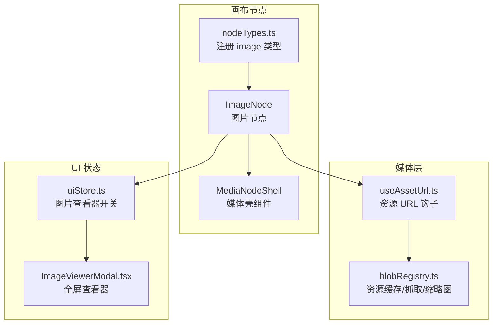
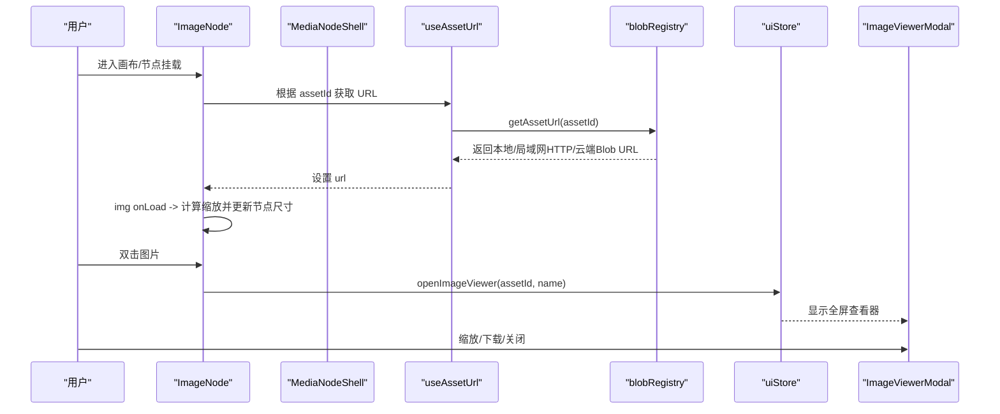
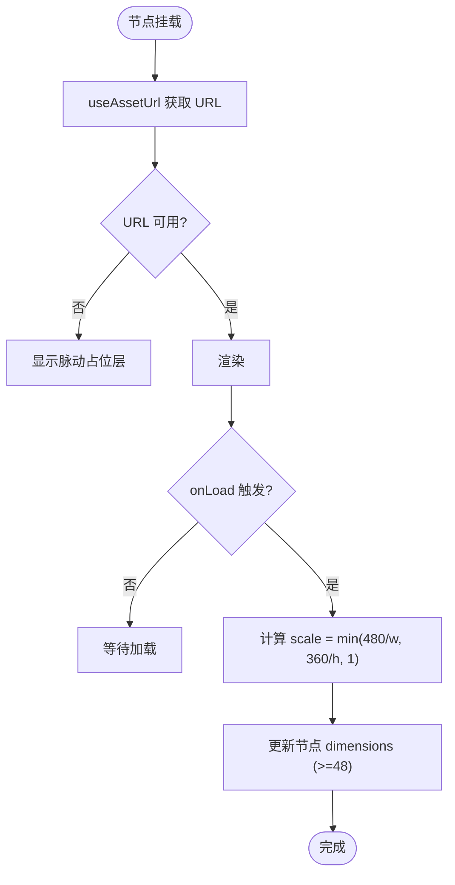
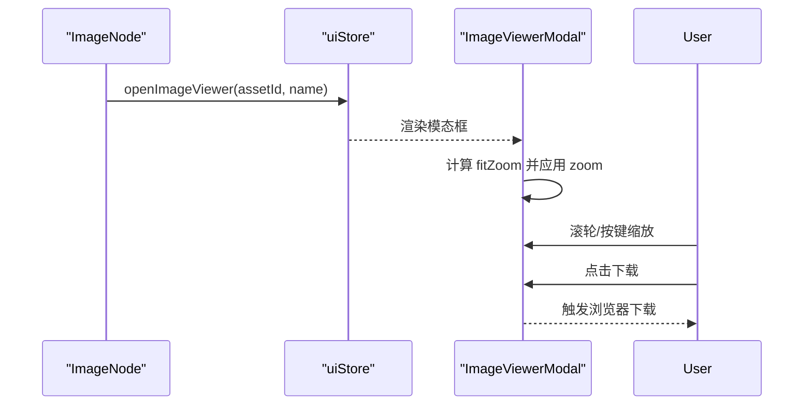
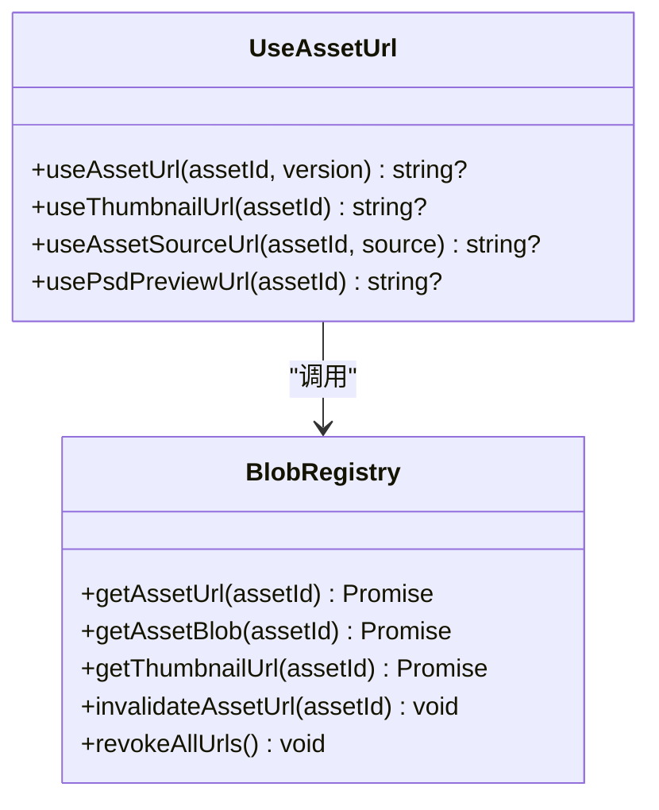
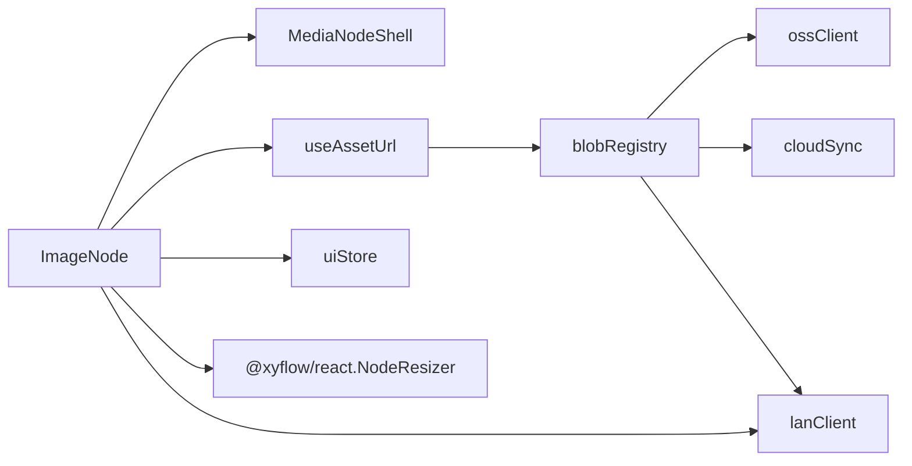

# 图片节点

<cite>
**本文引用的文件**
- [ImageNode.tsx](file://src/canvas/nodes/ImageNode.tsx)
- [MediaNodeShell.tsx](file://src/canvas/nodes/MediaNodeShell.tsx)
- [ImageViewerModal.tsx](file://src/components/ImageViewerModal.tsx)
- [useAssetUrl.ts](file://src/media/useAssetUrl.ts)
- [blobRegistry.ts](file://src/media/blobRegistry.ts)
- [nodeTypes.ts](file://src/canvas/nodes/nodeTypes.ts)
- [types.ts](file://src/types.ts)
- [uiStore.ts](file://src/store/uiStore.ts)
- [ResizeHandles.tsx](file://src/canvas/nodes/ResizeHandles.tsx)
</cite>

## 目录
1. [简介](#简介)
2. [项目结构](#项目结构)
3. [核心组件](#核心组件)
4. [架构总览](#架构总览)
5. [详细组件分析](#详细组件分析)
6. [依赖关系分析](#依赖关系分析)
7. [性能与内存管理](#性能与内存管理)
8. [故障排查指南](#故障排查指南)
9. [结论](#结论)
10. [附录：属性配置参考](#附录属性配置参考)

## 简介
本章节面向“图片节点”的完整实现与使用，涵盖图片加载机制、自适应缩放、懒加载优化、内存管理、与 MediaNodeShell 的集成、NodeResizer 的使用、用户交互（双击打开查看器、下载、悬停操作面板），以及最佳实践与性能优化建议。目标是帮助开发者快速理解并高效扩展图片节点能力。

## 项目结构
图片节点位于画布节点体系中，作为媒体类节点的一种，通过统一的壳组件 MediaNodeShell 提供边框、连接点、底部信息栏、作者角标等通用 UI；自身负责图片渲染、尺寸自适应、交互行为。图片资源由媒体层 useAssetUrl 与 blobRegistry 统一获取，支持本地缓存、局域网流式地址、云端回退与缩略图策略。

图表来源
- [ImageNode.tsx:15-126](file://src/canvas/nodes/ImageNode.tsx#L15-L126)
- [MediaNodeShell.tsx:32-151](file://src/canvas/nodes/MediaNodeShell.tsx#L32-L151)
- [useAssetUrl.ts:10-44](file://src/media/useAssetUrl.ts#L10-L44)
- [blobRegistry.ts:84-126](file://src/media/blobRegistry.ts#L84-L126)
- [nodeTypes.ts:14-26](file://src/canvas/nodes/nodeTypes.ts#L14-L26)
- [uiStore.ts:25-30](file://src/store/uiStore.ts#L25-L30)
- [ImageViewerModal.tsx:14-165](file://src/components/ImageViewerModal.tsx#L14-L165)

章节来源
- [ImageNode.tsx:15-126](file://src/canvas/nodes/ImageNode.tsx#L15-L126)
- [MediaNodeShell.tsx:32-151](file://src/canvas/nodes/MediaNodeShell.tsx#L32-L151)
- [nodeTypes.ts:14-26](file://src/canvas/nodes/nodeTypes.ts#L14-L26)

## 核心组件
- ImageNode：图片节点主组件，负责图片加载、自适应缩放、交互（双击打开查看器、悬停面板打开/下载）、与 NodeResizer 集成。
- MediaNodeShell：媒体节点通用外壳，提供四边连接热区、选中态、底部名称栏、作者角标、进度遮罩、局域网锁定提示等。
- ImageViewerModal：全屏查看器，支持缩放、适应窗口、键盘快捷键、下载原始资源或 PSD 预览。
- useAssetUrl / blobRegistry：资源 URL 获取与缓存、缩略图生成、局域网/云端回退、并发控制与内存释放。
- uiStore：全局 UI 状态，包含图片查看器的打开/关闭、工具模式等。

章节来源
- [ImageNode.tsx:15-126](file://src/canvas/nodes/ImageNode.tsx#L15-L126)
- [MediaNodeShell.tsx:32-151](file://src/canvas/nodes/MediaNodeShell.tsx#L32-L151)
- [ImageViewerModal.tsx:14-165](file://src/components/ImageViewerModal.tsx#L14-L165)
- [useAssetUrl.ts:10-44](file://src/media/useAssetUrl.ts#L10-L44)
- [blobRegistry.ts:84-126](file://src/media/blobRegistry.ts#L84-L126)
- [uiStore.ts:25-30](file://src/store/uiStore.ts#L25-L30)

## 架构总览
图片节点的数据流与交互流程如下：

图表来源
- [ImageNode.tsx:15-126](file://src/canvas/nodes/ImageNode.tsx#L15-L126)
- [useAssetUrl.ts:10-44](file://src/media/useAssetUrl.ts#L10-L44)
- [blobRegistry.ts:84-126](file://src/media/blobRegistry.ts#L84-L126)
- [uiStore.ts:25-30](file://src/store/uiStore.ts#L25-L30)
- [ImageViewerModal.tsx:14-165](file://src/components/ImageViewerModal.tsx#L14-L165)

## 详细组件分析

### ImageNode：图片节点实现
- 图片加载与占位：
  - 使用 useAssetUrl 获取资源 URL，未就绪时显示脉动占位层，避免布局抖动。
  - 图片加载完成后触发 onLoad，记录自然宽高并执行自适应缩放。
- 自适应缩放算法：
  - 以最大展示尺寸 MAX_W=480、MAX_H=360 为上限，按 min(MAX_W/w, MAX_H/h, 1) 计算缩放比例。
  - 将缩放后的宽高写入节点 dimensions，同时保证最小宽度/高度不低于 48px，确保可编辑性。
- 懒加载优化：
  - 仅在节点可见且 URL 可用时请求资源；结合 useAssetUrl 的重试机制，在局域网分片传输期间自动重试直至成功或达到上限。
- 内存管理：
  - 通过 blobRegistry 内部对 URL 进行缓存与释放；当资源失效或页面卸载时，URL 会被清理，避免内存泄漏。
- 与 NodeResizer 集成：
  - 使用 NodeResizer 提供拖拽调整大小，最小尺寸 48x48，保持非等比缩放；开始/结束调整时同步局域网编辑锁状态。
- 用户交互：
  - 双击图片区域打开全屏查看器（ImageViewerModal）。
  - 悬停右上角弹出操作面板：打开图片、下载图片。
  - 与 MediaNodeShell 的选中态、连接热区、底部名称栏、作者角标无缝集成。
- 错误处理：
  - 若图片仍在加载，双击会提示“图片仍在加载，请稍后重试”。
  - 资源加载失败会通过 toast 提示。

图表来源
- [ImageNode.tsx:12-56](file://src/canvas/nodes/ImageNode.tsx#L12-L56)
- [useAssetUrl.ts:10-44](file://src/media/useAssetUrl.ts#L10-L44)

章节来源
- [ImageNode.tsx:15-126](file://src/canvas/nodes/ImageNode.tsx#L15-L126)

### MediaNodeShell：媒体节点壳
- 功能要点：
  - 四边 Handle 作为连接热区，支持连线模式下从任意边拉线。
  - 底部名称栏显示类型图标与文件名，支持始终显示。
  - 作者角标显示插入者，支持始终显示。
  - 进度遮罩用于媒体播放进度可视化。
  - 局域网锁定：当其他用户正在编辑该节点时，阻止交互并显示提示。
- 与 ImageNode 的关系：
  - ImageNode 将图片内容作为 children 传入 MediaNodeShell，获得统一的边框、连接点、选中态、底部栏等体验。

章节来源
- [MediaNodeShell.tsx:32-151](file://src/canvas/nodes/MediaNodeShell.tsx#L32-L151)

### ImageViewerModal：全屏查看器
- 功能要点：
  - 支持缩放（按钮/滚轮/键盘 +/-/0 适应窗口）。
  - 自动根据自然尺寸计算初始缩放以适应视口。
  - 下载原始资源或 PSD 预览（针对 thumbnail 场景）。
  - 点击背景关闭。
- 与 ImageNode 的协作：
  - ImageNode 双击调用 uiStore.openImageViewer，传递 assetId 与名称；查看器根据是否 thumbnail 决定使用原图还是 PSD 预览图。

图表来源
- [uiStore.ts:25-30](file://src/store/uiStore.ts#L25-L30)
- [ImageViewerModal.tsx:14-165](file://src/components/ImageViewerModal.tsx#L14-L165)

章节来源
- [ImageViewerModal.tsx:14-165](file://src/components/ImageViewerModal.tsx#L14-L165)
- [uiStore.ts:25-30](file://src/store/uiStore.ts#L25-L30)

### 资源加载与缓存：useAssetUrl 与 blobRegistry
- useAssetUrl：
  - 基于 assetId 获取资源 URL，具备重试机制（最多 5 次，间隔 1200ms），适用于局域网分片传输未完成时的等待。
  - 提供多种钩子：getAssetUrl、getThumbnailUrl、getAssetSourceUrl、usePsdPreviewUrl。
- blobRegistry：
  - 本地 IndexedDB 缓存优先，其次局域网 HTTP 流式地址（视频等大文件边下边播），最后云端回退。
  - 缩略图生成：对视频抓帧，限制并发（默认 2），避免阻塞播放；黑帧检测与重试；必要时回退到全量下载再抓帧。
  - URL 缓存与释放：Map 缓存 URL，提供 invalidate/revoke 接口，防止内存泄漏。

图表来源
- [useAssetUrl.ts:10-157](file://src/media/useAssetUrl.ts#L10-L157)
- [blobRegistry.ts:84-389](file://src/media/blobRegistry.ts#L84-L389)

章节来源
- [useAssetUrl.ts:10-157](file://src/media/useAssetUrl.ts#L10-L157)
- [blobRegistry.ts:84-389](file://src/media/blobRegistry.ts#L84-L389)

### NodeResizer 与自定义 ResizeHandles
- NodeResizer：
  - 由 @xyflow/react 提供，ImageNode 中使用它实现拖拽调整大小，最小尺寸 48x48，非等比缩放。
  - 在开始/结束调整时同步局域网编辑锁，避免多人冲突。
- 自定义 ResizeHandles：
  - 提供四角拖拽手柄，支持最小尺寸约束（宽 120、高 40）与位置同步更新。
  - 适合需要更精细控制的场景，可与 CanvasStore 的 onNodesChange 配合。

章节来源
- [ImageNode.tsx:60-69](file://src/canvas/nodes/ImageNode.tsx#L60-L69)
- [ResizeHandles.tsx:35-118](file://src/canvas/nodes/ResizeHandles.tsx#L35-L118)

## 依赖关系分析
- ImageNode 依赖：
  - MediaNodeShell：统一外壳 UI。
  - useAssetUrl：资源 URL 获取。
  - uiStore：打开图片查看器。
  - NodeResizer：尺寸调整。
  - lanClient：局域网编辑锁同步。
- MediaNodeShell 依赖：
  - @xyflow/react：Handle、Position、useUpdateNodeInternals。
  - uiStore：工具模式切换影响连接热区。
  - lanStore：局域网锁定提示。
- 媒体层依赖：
  - blobRegistry：资源缓存、缩略图、并发控制、内存释放。
  - ossClient/cloudSync/lanClient：云端/局域网/云同步。

图表来源
- [ImageNode.tsx:15-126](file://src/canvas/nodes/ImageNode.tsx#L15-L126)
- [MediaNodeShell.tsx:32-151](file://src/canvas/nodes/MediaNodeShell.tsx#L32-L151)
- [useAssetUrl.ts:10-157](file://src/media/useAssetUrl.ts#L10-L157)
- [blobRegistry.ts:84-389](file://src/media/blobRegistry.ts#L84-L389)

章节来源
- [ImageNode.tsx:15-126](file://src/canvas/nodes/ImageNode.tsx#L15-L126)
- [MediaNodeShell.tsx:32-151](file://src/canvas/nodes/MediaNodeShell.tsx#L32-L151)
- [useAssetUrl.ts:10-157](file://src/media/useAssetUrl.ts#L10-L157)
- [blobRegistry.ts:84-389](file://src/media/blobRegistry.ts#L84-L389)

## 性能与内存管理
- 大图片处理：
  - 自适应缩放限制最大展示尺寸为 480x360，避免大图导致布局与渲染压力。
  - 全屏查看器根据自然尺寸计算 fitZoom，支持缩放查看细节。
- 缓存策略：
  - 本地 IndexedDB 缓存优先，减少重复网络请求。
  - 局域网 HTTP 流式地址用于视频等大文件，边下边播，降低内存占用。
  - 缩略图缓存与并发控制（默认 2），避免多视频同时 seek 导致卡顿。
- 内存管理：
  - URL 缓存 Map 与 revokeAllUrls 接口，确保对象 URL 及时释放。
  - 资源加载失败或组件卸载时清理定时器与监听，避免内存泄漏。
- 错误处理：
  - 资源加载失败 toast 提示；PSD 预览失败给出友好提示。
  - 局域网分片传输未完成时自动重试，提升鲁棒性。

[本节为通用指导，不直接分析具体文件]

## 故障排查指南
- 图片无法加载：
  - 检查 useAssetUrl 重试逻辑是否生效（最多 5 次，间隔 1200ms）。
  - 确认 blobRegistry 中本地/局域网/云端路径是否可达。
- 缩略图不显示：
  - 检查并发限制与队列是否阻塞；查看是否有跨源问题导致抓帧失败。
  - 对于视频，确认是否已触发 ensureVideoThumbnail 并成功生成封面。
- 全屏查看器无法打开：
  - 确认 uiStore.imageViewer 状态是否正确设置。
  - 检查 downloadUrl 与 psdPreviewUrl 是否可用。
- 局域网编辑冲突：
  - 确认 MediaNodeShell 的 lock 状态与 lanClient 的 setLanEditing/clearLanEditing 调用是否正确。

章节来源
- [useAssetUrl.ts:10-44](file://src/media/useAssetUrl.ts#L10-L44)
- [blobRegistry.ts:26-39](file://src/media/blobRegistry.ts#L26-L39)
- [blobRegistry.ts:310-379](file://src/media/blobRegistry.ts#L310-L379)
- [uiStore.ts:25-30](file://src/store/uiStore.ts#L25-L30)
- [MediaNodeShell.tsx:44-46](file://src/canvas/nodes/MediaNodeShell.tsx#L44-L46)

## 结论
图片节点通过 MediaNodeShell 提供一致的媒体节点体验，结合 useAssetUrl 与 blobRegistry 实现了高效的资源加载、缓存与缩略图生成。自适应缩放与全屏查看器提升了用户体验，NodeResizer 与自定义 ResizeHandles 提供了灵活的尺寸控制。整体架构清晰、可扩展性强，适合在复杂画布场景中稳定运行。

[本节为总结，不直接分析具体文件]

## 附录：属性配置参考
- SuqNodeData（图片相关字段）：
  - kind: 'image'
  - assetId: 资源 ID
  - label: 文件名/标签
  - width/height: 初始尺寸（可由 onLoad 自适应覆盖）
  - borderColor: 边框颜色
  - createdByName: 插入者名称
- 行为与交互：
  - 双击打开全屏查看器
  - 悬停右上角面板：打开图片、下载图片
  - 拖拽调整大小（NodeResizer，最小 48x48）
  - 连接热区：四边均可拉线（连线模式下）

章节来源
- [types.ts:66-98](file://src/types.ts#L66-L98)
- [ImageNode.tsx:15-126](file://src/canvas/nodes/ImageNode.tsx#L15-L126)
- [MediaNodeShell.tsx:32-151](file://src/canvas/nodes/MediaNodeShell.tsx#L32-L151)