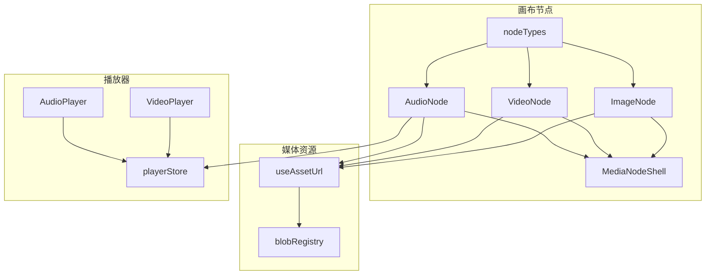
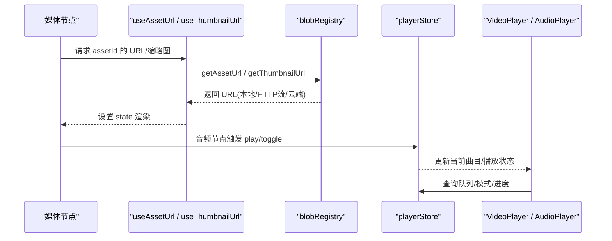
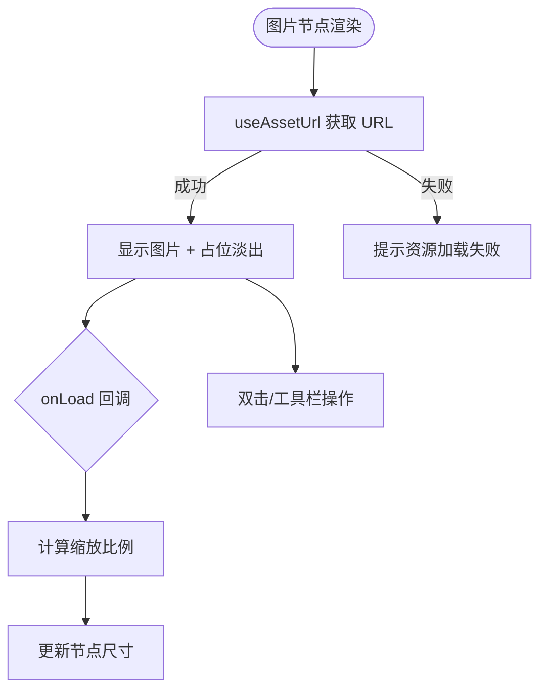
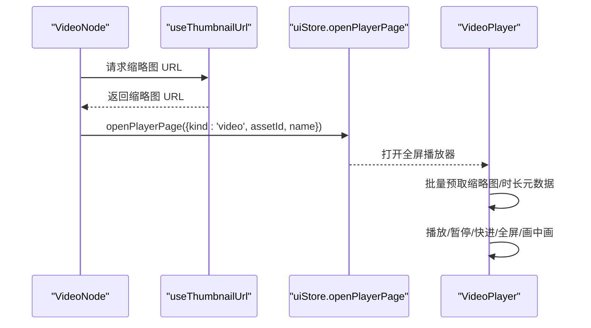
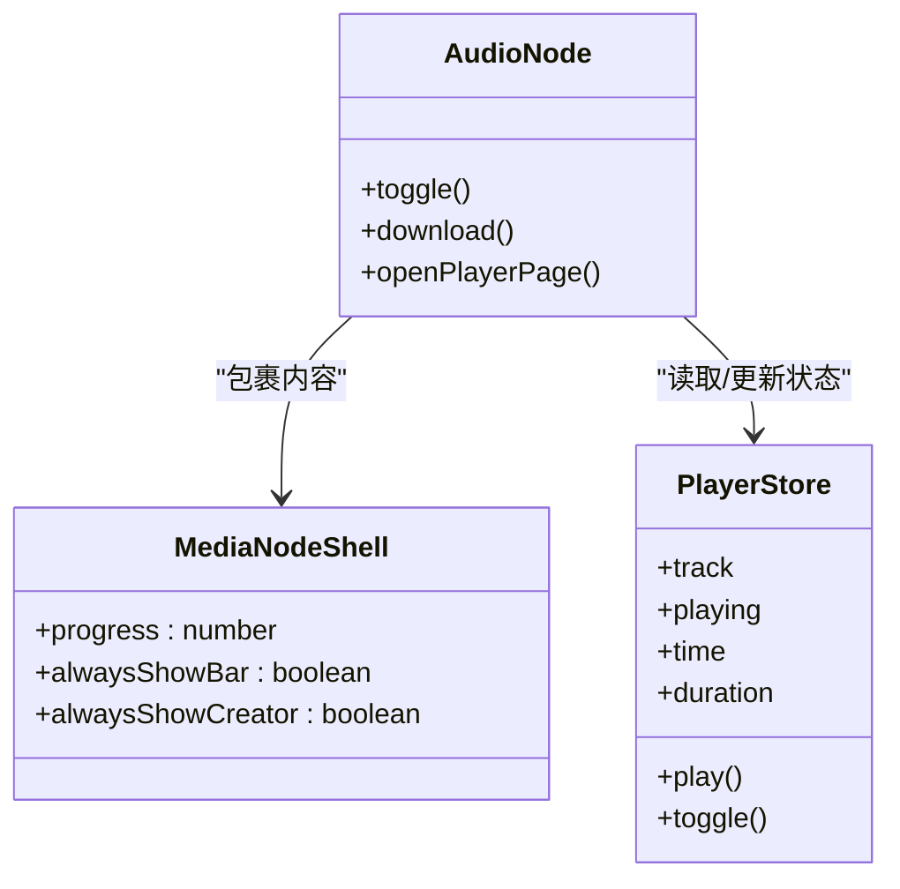
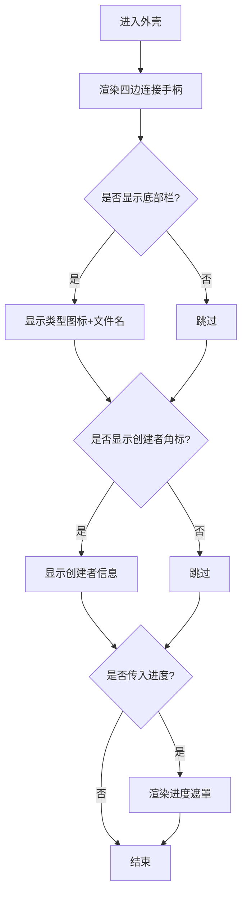
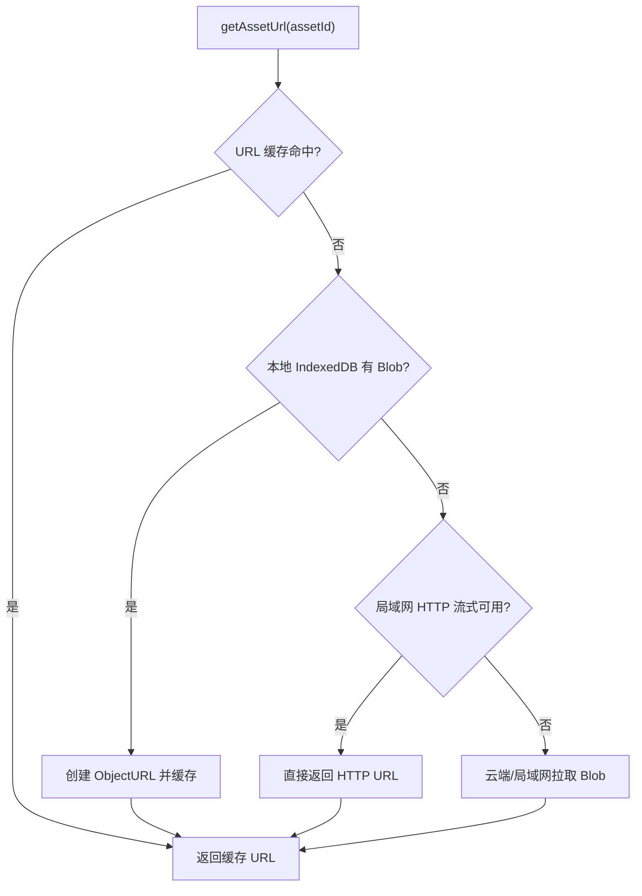
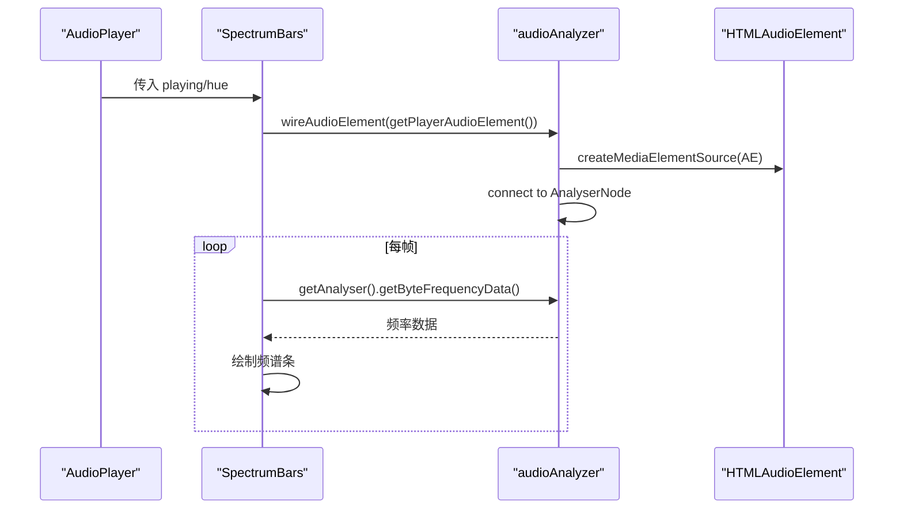
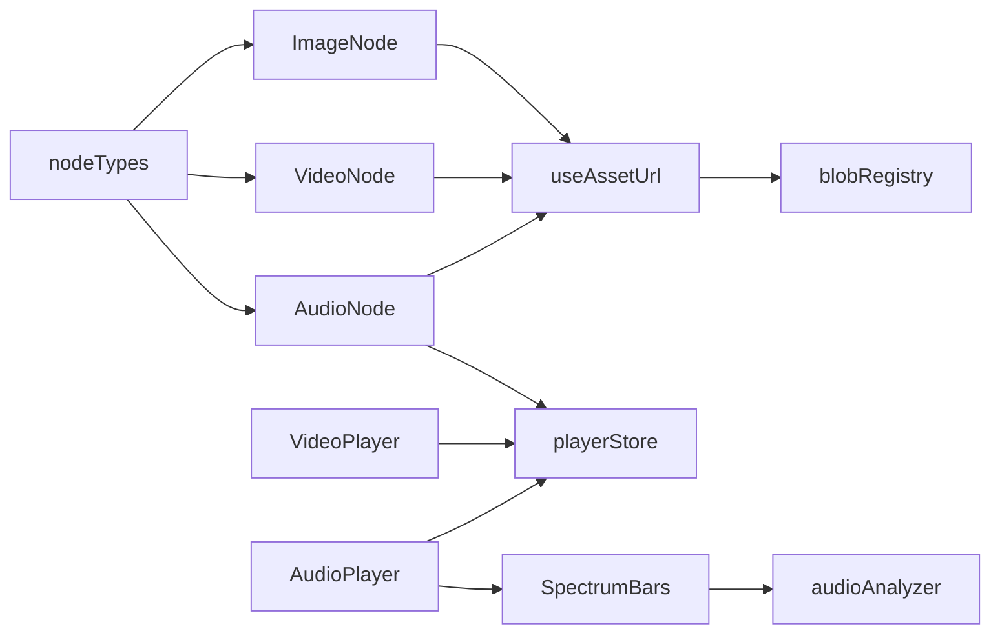

# 媒体节点

<cite>
**本文引用的文件**
- [ImageNode.tsx](file://src/canvas/nodes/ImageNode.tsx)
- [VideoNode.tsx](file://src/canvas/nodes/VideoNode.tsx)
- [AudioNode.tsx](file://src/canvas/nodes/AudioNode.tsx)
- [MediaNodeShell.tsx](file://src/canvas/nodes/MediaNodeShell.tsx)
- [nodeTypes.ts](file://src/canvas/nodes/nodeTypes.ts)
- [useAssetUrl.ts](file://src/media/useAssetUrl.ts)
- [blobRegistry.ts](file://src/media/blobRegistry.ts)
- [audioAnalyzer.ts](file://src/media/audioAnalyzer.ts)
- [SpectrumBars.tsx](file://src/components/SpectrumBars.tsx)
- [VideoPlayer.tsx](file://src/components/VideoPlayer.tsx)
- [AudioPlayer.tsx](file://src/components/AudioPlayer.tsx)
- [playerStore.ts](file://src/store/playerStore.ts)
- [types.ts](file://src/types.ts)
</cite>

## 目录
1. [简介](#简介)
2. [项目结构](#项目结构)
3. [核心组件](#核心组件)
4. [架构总览](#架构总览)
5. [详细组件分析](#详细组件分析)
6. [依赖关系分析](#依赖关系分析)
7. [性能考量](#性能考量)
8. [故障排查指南](#故障排查指南)
9. [结论](#结论)
10. [附录：使用示例与扩展](#附录使用示例与扩展)

## 简介
本文件系统化梳理 SuQCanvas 中的三类媒体节点（图片、视频、音频）及其通用外壳 MediaNodeShell，覆盖实现原理、功能特性、数据流、交互流程、配置项、最佳实践与性能优化策略。读者可据此理解画布中媒体节点的渲染、加载、播放控制与可视化机制，并掌握如何扩展新的媒体类型或定制行为。

## 项目结构
媒体节点位于 canvas/nodes 目录下，通过 nodeTypes 注册到 ReactFlow；媒体资源获取与缓存由 media 层提供；播放器视图在 components 下；播放状态由 store/playerStore 统一管理。

图表来源
- [nodeTypes.ts:14-26](file://src/canvas/nodes/nodeTypes.ts#L14-L26)
- [ImageNode.tsx:15-126](file://src/canvas/nodes/ImageNode.tsx#L15-L126)
- [VideoNode.tsx:18-88](file://src/canvas/nodes/VideoNode.tsx#L18-L88)
- [AudioNode.tsx:18-126](file://src/canvas/nodes/AudioNode.tsx#L18-L126)
- [useAssetUrl.ts:10-157](file://src/media/useAssetUrl.ts#L10-L157)
- [blobRegistry.ts:84-126](file://src/media/blobRegistry.ts#L84-L126)
- [VideoPlayer.tsx:58-800](file://src/components/VideoPlayer.tsx#L58-L800)
- [AudioPlayer.tsx:142-800](file://src/components/AudioPlayer.tsx#L142-L800)
- [playerStore.ts:1-200](file://src/store/playerStore.ts#L1-L200)

章节来源
- [nodeTypes.ts:14-26](file://src/canvas/nodes/nodeTypes.ts#L14-L26)

## 核心组件
- ImageNode：图片节点，内嵌缩略图预览，支持双击打开大图、下载；自动根据原图尺寸适配节点大小；支持局域网编辑锁定提示。
- VideoNode：视频节点，画布上仅显示封面缩略图与播放按钮，点击/双击进入全屏播放器；避免原生控件抢占指针影响拖拽。
- AudioNode：音频节点，显示封面、播放/暂停、时间进度、下载；双击进入沉浸式音频播放器；进度以遮罩铺满节点展示。
- MediaNodeShell：通用外壳，统一处理边框、四边连接手柄、底部名称栏、创建者角标、播放进度遮罩、局域网编辑锁定等。

章节来源
- [ImageNode.tsx:15-126](file://src/canvas/nodes/ImageNode.tsx#L15-L126)
- [VideoNode.tsx:18-88](file://src/canvas/nodes/VideoNode.tsx#L18-L88)
- [AudioNode.tsx:18-126](file://src/canvas/nodes/AudioNode.tsx#L18-L126)
- [MediaNodeShell.tsx:20-151](file://src/canvas/nodes/MediaNodeShell.tsx#L20-L151)

## 架构总览
媒体节点通过 useAssetUrl/useThumbnailUrl 从 blobRegistry 获取资源 URL（本地 IndexedDB、局域网 HTTP 流式地址或云端），并在节点内按需渲染。视频节点不内嵌播放器，而是跳转到 VideoPlayer 全屏视图；音频节点通过全局 playerStore 驱动单一 <audio> 元素，并在 AudioPlayer 中提供歌词、频谱、背景水波纹等能力。

图表来源
- [useAssetUrl.ts:10-157](file://src/media/useAssetUrl.ts#L10-L157)
- [blobRegistry.ts:84-126](file://src/media/blobRegistry.ts#L84-L126)
- [playerStore.ts:163-200](file://src/store/playerStore.ts#L163-L200)
- [VideoPlayer.tsx:58-800](file://src/components/VideoPlayer.tsx#L58-L800)
- [AudioPlayer.tsx:142-800](file://src/components/AudioPlayer.tsx#L142-L800)

## 详细组件分析

### ImageNode（图片节点）
- 资源加载：通过 useAssetUrl 获取图片 URL，失败时 toast 提示；支持局域网分片传输期间的占位与淡入过渡。
- 自适应尺寸：图片 onLoad 后按最大宽高限制计算缩放比例，调用 onNodesChange 调整节点尺寸。
- 交互：双击打开图片查看器；悬浮工具栏支持“打开”和“下载”。
- 协作：NodeResizer 在选中且非他人编辑时显示；编辑时通过 LAN 锁阻止冲突。

图表来源
- [ImageNode.tsx:15-126](file://src/canvas/nodes/ImageNode.tsx#L15-L126)
- [useAssetUrl.ts:10-44](file://src/media/useAssetUrl.ts#L10-L44)

章节来源
- [ImageNode.tsx:15-126](file://src/canvas/nodes/ImageNode.tsx#L15-L126)

### VideoNode（视频节点）
- 预览：使用 useThumbnailUrl 获取视频封面缩略图，按最大宽高自适应节点尺寸。
- 播放入口：点击/双击打开 VideoPlayer 全屏视图，实际视频文件仅在播放器中按需拉取，画布上不下载大文件。
- 交互：播放按钮居中显示，nodrag 避免干扰节点拖拽。

图表来源
- [VideoNode.tsx:18-88](file://src/canvas/nodes/VideoNode.tsx#L18-L88)
- [VideoPlayer.tsx:58-800](file://src/components/VideoPlayer.tsx#L58-L800)

章节来源
- [VideoNode.tsx:18-88](file://src/canvas/nodes/VideoNode.tsx#L18-L88)

### AudioNode（音频节点）
- 播放控制：基于全局 playerStore，切换播放/暂停；若当前节点即正在播放则暂停，否则播放该音频并自动显示底部播放条。
- 进度展示：当为当前曲目且播放中时，以 progress 参数传入 MediaNodeShell，渲染为铺满节点的半透明遮罩。
- 下载与全屏：支持下载当前音频；双击进入沉浸式 AudioPlayer 视图，支持歌词、频谱、背景水波纹、歌单与流式播放。

图表来源
- [AudioNode.tsx:18-126](file://src/canvas/nodes/AudioNode.tsx#L18-L126)
- [MediaNodeShell.tsx:20-151](file://src/canvas/nodes/MediaNodeShell.tsx#L20-L151)
- [playerStore.ts:163-200](file://src/store/playerStore.ts#L163-L200)

章节来源
- [AudioNode.tsx:18-126](file://src/canvas/nodes/AudioNode.tsx#L18-L126)

### MediaNodeShell（通用媒体外壳）
- 连线手柄：四边同时提供 source/target 手柄，支持连线模式下的热区连接。
- 底部栏：可选始终显示名称栏；显示媒体类型图标与文件名。
- 创建者角标：悬停/选中/始终显示插入者信息。
- 播放进度遮罩：传入 progress 时渲染横向进度条覆盖整个节点。
- 协作锁定：检测 LAN 编辑锁，阻止他人操作并显示提示。

图表来源
- [MediaNodeShell.tsx:20-151](file://src/canvas/nodes/MediaNodeShell.tsx#L20-L151)

章节来源
- [MediaNodeShell.tsx:20-151](file://src/canvas/nodes/MediaNodeShell.tsx#L20-L151)

### 媒体资源加载与缓存（blobRegistry）
- 优先级：本地 IndexedDB Blob > 局域网 HTTP 流式地址 > 云端下载。
- 缩略图：对视频源进行抓帧生成封面，并发上限控制，避免阻塞播放。
- 重试与轮询：useAssetUrl/useThumbnailUrl 在网络不稳定或局域网传输期间进行重试与轮询。

图表来源
- [blobRegistry.ts:84-126](file://src/media/blobRegistry.ts#L84-L126)
- [useAssetUrl.ts:10-157](file://src/media/useAssetUrl.ts#L10-L157)

章节来源
- [blobRegistry.ts:84-126](file://src/media/blobRegistry.ts#L84-L126)
- [useAssetUrl.ts:10-157](file://src/media/useAssetUrl.ts#L10-L157)

### 音频频谱与可视化（audioAnalyzer + SpectrumBars）
- 单例 AnalyserNode：将当前 <audio> 元素接入 Web Audio API 分析器，供背景水波纹与频谱条读取频率数据。
- 频谱条：Canvas 绘制 44 根圆头条，颜色随封面主色变化，暂停/静音保留基线呼吸效果。

图表来源
- [audioAnalyzer.ts:1-59](file://src/media/audioAnalyzer.ts#L1-L59)
- [SpectrumBars.tsx:1-120](file://src/components/SpectrumBars.tsx#L1-L120)
- [AudioPlayer.tsx:142-800](file://src/components/AudioPlayer.tsx#L142-L800)

章节来源
- [audioAnalyzer.ts:1-59](file://src/media/audioAnalyzer.ts#L1-L59)
- [SpectrumBars.tsx:1-120](file://src/components/SpectrumBars.tsx#L1-L120)

## 依赖关系分析
- 节点类型注册：nodeTypes 将 image/video/audio 映射到对应组件。
- 资源访问：所有媒体节点依赖 useAssetUrl/useThumbnailUrl，后者依赖 blobRegistry。
- 播放状态：AudioNode 与 AudioPlayer/VideoPlayer 均依赖 playerStore 管理全局播放上下文。
- 可视化：AudioPlayer 集成 SpectrumBars 与 audioAnalyzer，实现频谱与背景水波纹。

图表来源
- [nodeTypes.ts:14-26](file://src/canvas/nodes/nodeTypes.ts#L14-L26)
- [useAssetUrl.ts:10-157](file://src/media/useAssetUrl.ts#L10-L157)
- [blobRegistry.ts:84-126](file://src/media/blobRegistry.ts#L84-L126)
- [playerStore.ts:163-200](file://src/store/playerStore.ts#L163-L200)
- [SpectrumBars.tsx:1-120](file://src/components/SpectrumBars.tsx#L1-L120)
- [audioAnalyzer.ts:1-59](file://src/media/audioAnalyzer.ts#L1-L59)

章节来源
- [nodeTypes.ts:14-26](file://src/canvas/nodes/nodeTypes.ts#L14-L26)

## 性能考量
- 视频节点不在画布内嵌播放器，避免原生控件抢占指针与内存占用；仅在打开全屏播放器时按需拉取完整视频。
- 缩略图抓取并发上限为 2，防止多 video 同时 seek 导致浏览器连接池阻塞。
- 资源 URL 与缩略图 URL 均有缓存；本地优先，减少网络开销。
- 音频频谱使用单例 AnalyserNode，避免重复创建 AudioContext。
- 图片节点 onLoad 后一次性计算并设置节点尺寸，避免多次重排。

[本节为通用指导，无需具体文件引用]

## 故障排查指南
- 资源加载失败：useAssetUrl 会在失败时 toast 提示；检查局域网连接与云端配置。
- 缩略图未显示：useThumbnailUrl 在局域网模式下会持续轮询直至超时；确认服务器已推送缩略图。
- 视频无法抓帧：确保跨域正确（crossOrigin=anonymous），否则 canvas 被污染导致封面生成失败。
- 音频可视化无效：确认 HTMLAudioElement 已绑定到 playerStore，且浏览器允许 Web Audio API。

章节来源
- [useAssetUrl.ts:10-157](file://src/media/useAssetUrl.ts#L10-L157)
- [blobRegistry.ts:128-200](file://src/media/blobRegistry.ts#L128-L200)
- [audioAnalyzer.ts:1-59](file://src/media/audioAnalyzer.ts#L1-L59)

## 结论
SuQCanvas 的媒体节点体系通过 MediaNodeShell 实现了统一的交互与外观，配合 useAssetUrl 与 blobRegistry 完成高效可靠的资源加载；视频节点采用“封面+全屏播放器”的策略兼顾性能与体验；音频节点借助全局播放器与可视化组件提供丰富的音乐体验。整体架构清晰、可扩展性强，适合继续扩展更多媒体类型或定制行为。

[本节为总结性内容，无需具体文件引用]

## 附录：使用示例与扩展

### 使用示例
- 图片节点：添加图片后自动适配尺寸；双击打开大图；右上角工具栏可下载。
- 视频节点：显示封面与播放按钮；点击打开全屏播放器，支持列表、倍速、全屏、画中画。
- 音频节点：点击播放/暂停；双击进入沉浸式播放器，支持歌词、频谱、背景水波纹、歌单与流式播放。

章节来源
- [ImageNode.tsx:15-126](file://src/canvas/nodes/ImageNode.tsx#L15-L126)
- [VideoNode.tsx:18-88](file://src/canvas/nodes/VideoNode.tsx#L18-L88)
- [AudioNode.tsx:18-126](file://src/canvas/nodes/AudioNode.tsx#L18-L126)
- [VideoPlayer.tsx:58-800](file://src/components/VideoPlayer.tsx#L58-L800)
- [AudioPlayer.tsx:142-800](file://src/components/AudioPlayer.tsx#L142-L800)

### 自定义扩展方法
- 新增媒体类型：在 nodeTypes 中注册新组件，并在 MediaNodeShell 中根据需要启用 alwaysShowBar/alwaysShowCreator/progress。
- 自定义资源加载：复用 useAssetUrl/useThumbnailUrl，必要时在 blobRegistry 中增加特定类型的处理逻辑。
- 自定义播放器：参照 VideoPlayer/AudioPlayer 的结构，封装全屏视图并与 playerStore 集成。

章节来源
- [nodeTypes.ts:14-26](file://src/canvas/nodes/nodeTypes.ts#L14-L26)
- [MediaNodeShell.tsx:20-151](file://src/canvas/nodes/MediaNodeShell.tsx#L20-L151)
- [useAssetUrl.ts:10-157](file://src/media/useAssetUrl.ts#L10-L157)
- [blobRegistry.ts:84-126](file://src/media/blobRegistry.ts#L84-L126)