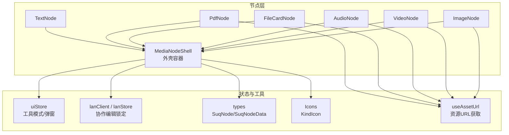
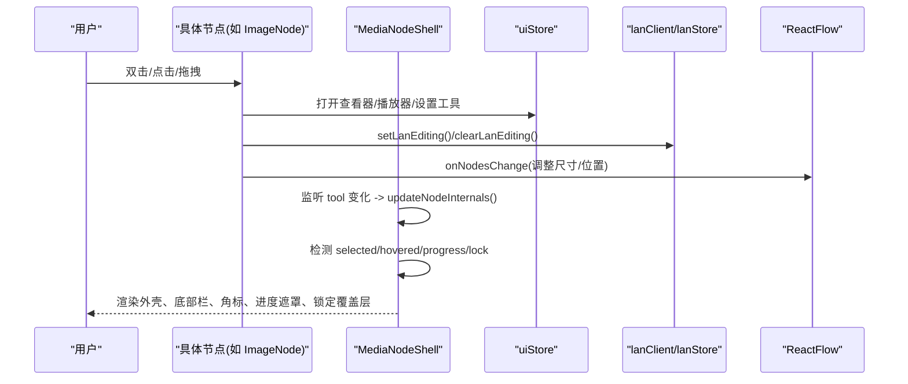
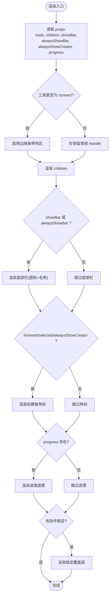
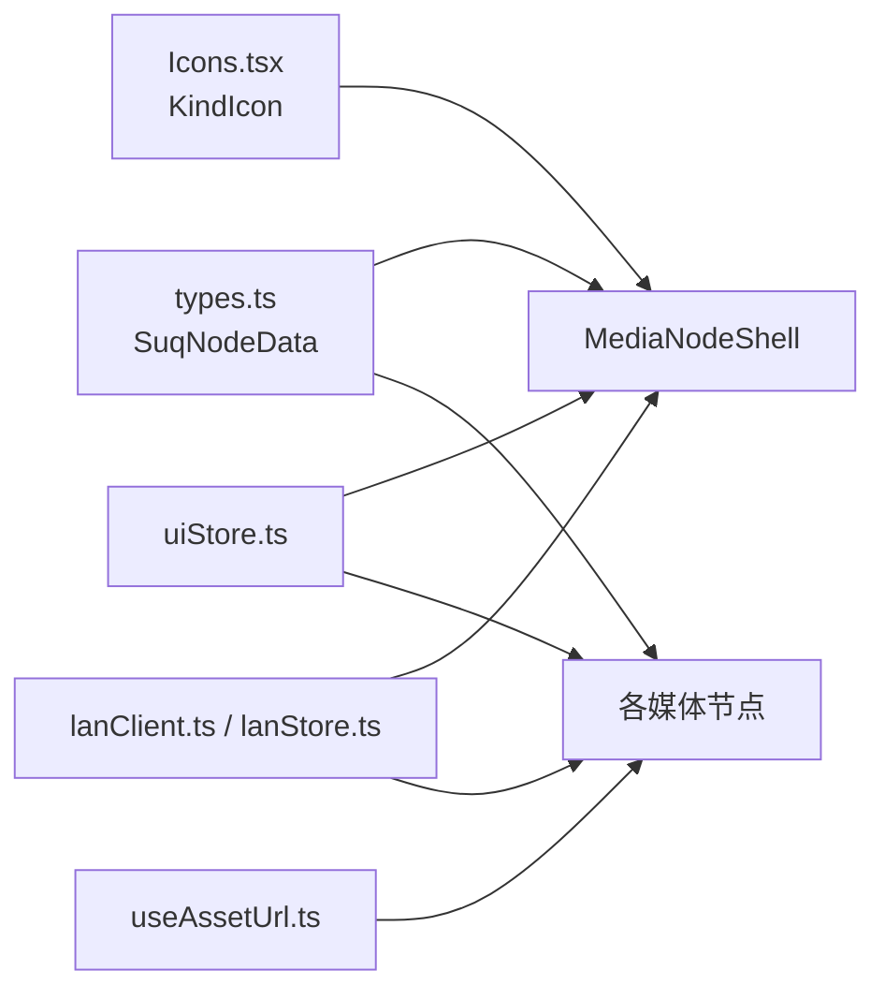

# 媒体节点外壳

<cite>
**本文引用的文件**
- [MediaNodeShell.tsx](file://src/canvas/nodes/MediaNodeShell.tsx)
- [nodeTypes.ts](file://src/canvas/nodes/nodeTypes.ts)
- [ImageNode.tsx](file://src/canvas/nodes/ImageNode.tsx)
- [VideoNode.tsx](file://src/canvas/nodes/VideoNode.tsx)
- [AudioNode.tsx](file://src/canvas/nodes/AudioNode.tsx)
- [FileCardNode.tsx](file://src/canvas/nodes/FileCardNode.tsx)
- [PdfNode.tsx](file://src/canvas/nodes/PdfNode.tsx)
- [TextNode.tsx](file://src/canvas/nodes/TextNode.tsx)
- [types.ts](file://src/types.ts)
- [Icons.tsx](file://src/canvas/nodes/Icons.tsx)
- [uiStore.ts](file://src/store/uiStore.ts)
- [lanClient.ts](file://src/sync/lanClient.ts)
- [useAssetUrl.ts](file://src/media/useAssetUrl.ts)
</cite>

## 目录
1. [简介](#简介)
2. [项目结构](#项目结构)
3. [核心组件](#核心组件)
4. [架构总览](#架构总览)
5. [详细组件分析](#详细组件分析)
6. [依赖关系分析](#依赖关系分析)
7. [性能考量](#性能考量)
8. [故障排查指南](#故障排查指南)
9. [结论](#结论)
10. [附录：扩展自定义媒体节点](#附录：扩展自定义媒体节点)

## 简介
本文件围绕 MediaNodeShell 通用外壳组件，系统化阐述其在画布中的设计模式与架构原理，包括组件复用机制、生命周期管理、事件处理、选择状态、锁定机制、拖拽与连线支持等。同时说明如何基于该外壳扩展新的媒体节点类型，并给出配置项、样式定制与主题支持的最佳实践，以及常见问题解决方案。

## 项目结构
媒体节点外壳位于画布节点层，作为所有媒体类节点的统一容器，提供统一的边框、底部信息栏、创建者角标、进度遮罩、四边连接热区与协作锁定覆盖层。具体节点（图片、视频、音频、PDF、文本、文件卡片等）通过包裹外壳渲染各自的内容区域。

图表来源
- [MediaNodeShell.tsx:20-151](file://src/canvas/nodes/MediaNodeShell.tsx#L20-L151)
- [nodeTypes.ts:14-26](file://src/canvas/nodes/nodeTypes.ts#L14-L26)
- [ImageNode.tsx:15-126](file://src/canvas/nodes/ImageNode.tsx#L15-L126)
- [VideoNode.tsx:18-88](file://src/canvas/nodes/VideoNode.tsx#L18-L88)
- [AudioNode.tsx:18-126](file://src/canvas/nodes/AudioNode.tsx#L18-L126)
- [FileCardNode.tsx:10-80](file://src/canvas/nodes/FileCardNode.tsx#L10-L80)
- [PdfNode.tsx:11-90](file://src/canvas/nodes/PdfNode.tsx#L11-L90)
- [TextNode.tsx:13-107](file://src/canvas/nodes/TextNode.tsx#L13-L107)
- [types.ts:66-107](file://src/types.ts#L66-L107)
- [Icons.tsx:633-656](file://src/canvas/nodes/Icons.tsx#L633-L656)
- [uiStore.ts:18-45](file://src/store/uiStore.ts#L18-L45)
- [lanClient.ts:793-800](file://src/sync/lanClient.ts#L793-L800)
- [useAssetUrl.ts:10-44](file://src/media/useAssetUrl.ts#L10-L44)

章节来源
- [MediaNodeShell.tsx:20-151](file://src/canvas/nodes/MediaNodeShell.tsx#L20-L151)
- [nodeTypes.ts:14-26](file://src/canvas/nodes/nodeTypes.ts#L14-L26)

## 核心组件
MediaNodeShell 是媒体类节点的通用外壳，职责包括：
- 节点容器：统一布局、圆角、阴影、背景色、边框颜色（来自 data.borderColor）。
- 选择状态：根据 selected 添加选中样式。
- 底部信息栏：显示类型图标与名称，支持 alwaysShowBar 控制始终显示。
- 创建者角标：显示 createdByName，支持 alwaysShowCreator 控制始终显示。
- 播放进度遮罩：progress 参数驱动全节点宽度渐变遮罩，用于音频播放进度展示。
- 协作锁定：当其他用户正在编辑当前节点时，阻止指针事件并显示“正在操作”提示。
- 连线热区：在四条边上注册 source/target Handle，并在 connect 模式下启用边缘条带热区，便于从任意边拉线。
- 内部尺寸刷新：工具切换时调用 useUpdateNodeInternals 重新测量手柄边界，保证连线模式下的热区生效。

关键能力与数据流：
- 读取 node.id、node.data、node.selected 进行渲染与交互控制。
- 通过 useUiStore.tool 判断是否处于连线模式，动态启用/禁用连接热区。
- 通过 useLanStore.editing 检测是否有其他用户在编辑当前节点，实现锁定覆盖层与事件拦截。
- 通过 progress 计算遮罩宽度，实现播放进度可视化。

章节来源
- [MediaNodeShell.tsx:20-151](file://src/canvas/nodes/MediaNodeShell.tsx#L20-L151)
- [uiStore.ts:18-45](file://src/store/uiStore.ts#L18-L45)
- [lanClient.ts:793-800](file://src/sync/lanClient.ts#L793-L800)

## 架构总览
外壳与具体节点的关系为“容器-内容”模式：外壳负责通用交互与外观，具体节点负责业务内容与行为。节点通过 NodeResizer、双击打开播放器、下载、编辑等行为与外部 store 交互；外壳则提供统一的视觉与协作体验。

图表来源
- [ImageNode.tsx:15-126](file://src/canvas/nodes/ImageNode.tsx#L15-L126)
- [VideoNode.tsx:18-88](file://src/canvas/nodes/VideoNode.tsx#L18-L88)
- [AudioNode.tsx:18-126](file://src/canvas/nodes/AudioNode.tsx#L18-L126)
- [MediaNodeShell.tsx:20-151](file://src/canvas/nodes/MediaNodeShell.tsx#L20-L151)
- [uiStore.ts:18-45](file://src/store/uiStore.ts#L18-L45)
- [lanClient.ts:793-800](file://src/sync/lanClient.ts#L793-L800)

## 详细组件分析

### MediaNodeShell 外壳组件
- 设计模式：高阶容器 + 组合式子节点（children），将通用交互逻辑下沉到外壳，提升复用性。
- 生命周期：
  - 工具切换时触发 useEffect，调用 useUpdateNodeInternals 重新测量手柄边界，确保连线模式下的边缘热区正确响应。
  - 鼠标进入/离开更新 hovered 状态，影响创建者角标显示。
  - 锁定状态由局域网协作状态决定，非空即阻止交互并显示覆盖层。
- 事件处理：
  - onPointerDownCapture 在非自身编辑时阻止默认行为与冒泡，避免误操作。
  - 四条边的 Handle 同时注册 source/target，connect 模式下启用边缘条带热区。
- 数据绑定：
  - borderColor 来自 data.borderColor，用于边框颜色定制。
  - progress 以百分比驱动遮罩宽度，用于播放进度展示。
  - createdByName 显示插入者，hovered/selected/alwaysShowCreator 控制可见性。
- 可配置项：
  - showBar：是否显示底部信息栏。
  - alwaysShowBar：是否始终显示底部信息栏。
  - alwaysShowCreator：是否始终显示创建者角标。
  - progress：播放进度（0..1）。

图表来源
- [MediaNodeShell.tsx:20-151](file://src/canvas/nodes/MediaNodeShell.tsx#L20-L151)

章节来源
- [MediaNodeShell.tsx:20-151](file://src/canvas/nodes/MediaNodeShell.tsx#L20-L151)

### 图片节点 ImageNode
- 功能：加载图片缩略图，自动按最大宽高适配节点尺寸；双击打开大图查看器；悬浮按钮支持打开与下载。
- 与外壳协作：使用 MediaNodeShell 包裹内容，继承外壳的边框、底部栏、创建者角标、进度遮罩与锁定覆盖层。
- 尺寸自适应：图片 onLoad 后根据 naturalWidth/naturalHeight 计算缩放比例，调用 onNodesChange 设置 dimensions。
- 协作：Resize 开始/结束分别调用 setLanEditing/clearLanEditing，通知协作者。

章节来源
- [ImageNode.tsx:15-126](file://src/canvas/nodes/ImageNode.tsx#L15-L126)
- [useAssetUrl.ts:10-44](file://src/media/useAssetUrl.ts#L10-L44)
- [lanClient.ts:793-800](file://src/sync/lanClient.ts#L793-L800)

### 视频节点 VideoNode
- 功能：不内嵌播放器，仅显示封面缩略图与播放按钮；双击或点击播放按钮打开全屏播放器页面。
- 与外壳协作：使用 MediaNodeShell 包裹内容，继承外壳通用交互。
- 封面加载：使用 useThumbnailUrl 获取缩略图 URL，onLoad 后按最大宽高自适应节点尺寸。
- 性能优化：画布上不下载完整视频，仅在播放器页按需拉取。

章节来源
- [VideoNode.tsx:18-88](file://src/canvas/nodes/VideoNode.tsx#L18-L88)
- [useAssetUrl.ts:52-99](file://src/media/useAssetUrl.ts#L52-L99)

### 音频节点 AudioNode
- 功能：显示专辑封面与播放控件；当前曲目播放时显示进度遮罩；双击进入专用播放器页（支持连播顺序）。
- 与外壳协作：传入 progress 参数驱动进度遮罩；alwaysShowBar/alwaysShowCreator 使信息栏与创建者角标始终可见。
- 播放控制：根据当前 track 与 playing 状态计算进度；下载通过 getAssetUrl 与本地数据库记录文件名。

章节来源
- [AudioNode.tsx:18-126](file://src/canvas/nodes/AudioNode.tsx#L18-L126)
- [useAssetUrl.ts:10-44](file://src/media/useAssetUrl.ts#L10-L44)

### 文件卡片节点 FileCardNode
- 功能：显示文件图标、名称与大小；双击在新窗口打开；支持下载。
- 与外壳协作：使用 MediaNodeShell 包裹内容，继承外壳通用交互。

章节来源
- [FileCardNode.tsx:10-80](file://src/canvas/nodes/FileCardNode.tsx#L10-L80)
- [useAssetUrl.ts:10-44](file://src/media/useAssetUrl.ts#L10-L44)

### PDF 节点 PdfNode
- 功能：懒加载 PDF 库，渲染第一页到 canvas；显示“查看全部”按钮打开 PDF 查看器。
- 与外壳协作：使用 MediaNodeShell 包裹内容，继承外壳通用交互。
- 资源管理：异步加载 pdfjs-dist，清理 page 与 handle，避免内存泄漏。

章节来源
- [PdfNode.tsx:11-90](file://src/canvas/nodes/PdfNode.tsx#L11-L90)

### 文本节点 TextNode
- 功能：支持编辑态与非编辑态；自动聚焦与提交；识别命名歌单并快速播放。
- 与外壳协作：使用 MediaNodeShell 包裹内容；编辑时调用 setLanEditing/clearLanEditing 通知协作者。
- 样式：通过 buildTextStyle 应用字体、对齐、行高等样式。

章节来源
- [TextNode.tsx:13-107](file://src/canvas/nodes/TextNode.tsx#L13-L107)
- [lanClient.ts:793-800](file://src/sync/lanClient.ts#L793-L800)

## 依赖关系分析
- 类型定义：SuqNodeData 包含 kind、assetId、label、borderColor、createdByName 等字段，被外壳与各节点使用。
- 图标系统：KindIcon 根据 kind 渲染对应图标，用于底部栏。
- 状态管理：
  - uiStore：工具模式（select/connect/drag）、弹窗（图片查看器、播放器页）、Toast。
  - lanStore/lanClient：协作编辑锁定、活动日志、视口同步、素材传输。
- 资源加载：useAssetUrl/useThumbnailUrl 提供资源 URL 与重试机制，适配局域网分片传输场景。

图表来源
- [types.ts:66-107](file://src/types.ts#L66-L107)
- [Icons.tsx:633-656](file://src/canvas/nodes/Icons.tsx#L633-L656)
- [uiStore.ts:18-45](file://src/store/uiStore.ts#L18-L45)
- [lanClient.ts:793-800](file://src/sync/lanClient.ts#L793-L800)
- [useAssetUrl.ts:10-44](file://src/media/useAssetUrl.ts#L10-L44)

章节来源
- [types.ts:66-107](file://src/types.ts#L66-L107)
- [Icons.tsx:633-656](file://src/canvas/nodes/Icons.tsx#L633-L656)
- [uiStore.ts:18-45](file://src/store/uiStore.ts#L18-L45)
- [lanClient.ts:793-800](file://src/sync/lanClient.ts#L793-L800)
- [useAssetUrl.ts:10-44](file://src/media/useAssetUrl.ts#L10-L44)

## 性能考量
- 懒加载与按需渲染：
  - 视频节点不内嵌播放器，仅在打开播放器页时拉取完整资源。
  - PDF 节点异步加载 pdfjs-dist 并清理资源，避免常驻内存占用。
- 资源加载重试：
  - useAssetUrl/useThumbnailUrl 内置重试与超时策略，适应局域网分片传输延迟。
- 尺寸自适应：
  - 图片/视频在首次加载后根据自然尺寸计算缩放比例，减少不必要的重排。
- 协作锁定：
  - 通过 lanStore.editing 实时检测他人编辑状态，避免并发冲突导致的重复渲染与无效交互。

[本节为通用性能讨论，不直接分析具体文件]

## 故障排查指南
- 资源加载失败：
  - 现象：图片/视频/文件无法显示或下载。
  - 排查：检查 useAssetUrl 重试次数与网络状态；确认局域网连接与中继地址；查看 toast 提示信息。
  - 参考路径：[useAssetUrl.ts:10-44](file://src/media/useAssetUrl.ts#L10-L44)、[useAssetUrl.ts:52-99](file://src/media/useAssetUrl.ts#L52-L99)
- 协作锁定异常：
  - 现象：节点不可编辑或锁定覆盖层不消失。
  - 排查：确认 setLanEditing/clearLanEditing 是否正确调用；检查 lanStore.editing 状态；验证 WebSocket 连接与消息广播。
  - 参考路径：[lanClient.ts:793-800](file://src/sync/lanClient.ts#L793-L800)
- 连线热区不生效：
  - 现象：connect 模式下无法从边缘拉线。
  - 排查：确认 tool 是否为 connect；检查 useUpdateNodeInternals 是否在工具切换时触发；验证 Handle 的 isConnectable/isConnectableStart/End 设置。
  - 参考路径：[MediaNodeShell.tsx:48-105](file://src/canvas/nodes/MediaNodeShell.tsx#L48-L105)、[uiStore.ts:18-45](file://src/store/uiStore.ts#L18-L45)
- 进度遮罩不显示：
  - 现象：音频播放时无进度遮罩。
  - 排查：确认 progress 参数是否正确传入；检查播放状态与 duration/time 计算；验证遮罩宽度计算。
  - 参考路径：[AudioNode.tsx:18-126](file://src/canvas/nodes/AudioNode.tsx#L18-L126)、[MediaNodeShell.tsx:132-139](file://src/canvas/nodes/MediaNodeShell.tsx#L132-L139)

章节来源
- [useAssetUrl.ts:10-44](file://src/media/useAssetUrl.ts#L10-L44)
- [useAssetUrl.ts:52-99](file://src/media/useAssetUrl.ts#L52-L99)
- [lanClient.ts:793-800](file://src/sync/lanClient.ts#L793-L800)
- [MediaNodeShell.tsx:48-105](file://src/canvas/nodes/MediaNodeShell.tsx#L48-L105)
- [MediaNodeShell.tsx:132-139](file://src/canvas/nodes/MediaNodeShell.tsx#L132-L139)
- [AudioNode.tsx:18-126](file://src/canvas/nodes/AudioNode.tsx#L18-L126)

## 结论
MediaNodeShell 通过容器化设计将媒体节点的通用交互与外观抽象出来，显著提升了代码复用性与一致性。结合 uiStore、lanStore 与 useAssetUrl，实现了选择状态、协作锁定、资源加载与进度展示等核心能力。各具体节点只需关注业务逻辑与内容渲染，即可快速构建丰富的媒体节点类型。

[本节为总结性内容，不直接分析具体文件]

## 附录：扩展自定义媒体节点
- 步骤概览：
  1. 新建节点组件，使用 MediaNodeShell 包裹内容区域。
  2. 在 nodeTypes.ts 中注册新节点类型。
  3. 在 types.ts 的 SuqNodeData 中补充必要字段（如 kind、assetId、label、borderColor 等）。
  4. 在 Icons.tsx 中新增 KindIcon 分支，用于底部栏图标。
  5. 根据需要接入 useAssetUrl/useThumbnailUrl 获取资源 URL。
  6. 如需协作编辑，调用 setLanEditing/clearLanEditing。
  7. 如需尺寸调整，使用 NodeResizer 或 ResizeHandles，并通过 onNodesChange 更新 dimensions。
- 最佳实践：
  - 保持外壳配置一致：showBar、alwaysShowBar、alwaysShowCreator、progress 的使用应遵循现有约定。
  - 资源加载健壮性：使用 useAssetUrl/useThumbnailUrl 的重试机制，避免瞬时失败导致空白。
  - 协作友好：在编辑开始/结束时及时通知协作者，避免冲突。
  - 性能优化：懒加载重型库（如 PDF），及时清理资源；避免在画布上下载大文件。
- 示例参考路径：
  - 外壳使用：[MediaNodeShell.tsx:20-151](file://src/canvas/nodes/MediaNodeShell.tsx#L20-L151)
  - 节点注册：[nodeTypes.ts:14-26](file://src/canvas/nodes/nodeTypes.ts#L14-L26)
  - 类型定义：[types.ts:66-107](file://src/types.ts#L66-L107)
  - 图标扩展：[Icons.tsx:633-656](file://src/canvas/nodes/Icons.tsx#L633-L656)
  - 资源加载：[useAssetUrl.ts:10-44](file://src/media/useAssetUrl.ts#L10-L44)、[useAssetUrl.ts:52-99](file://src/media/useAssetUrl.ts#L52-L99)
  - 协作编辑：[lanClient.ts:793-800](file://src/sync/lanClient.ts#L793-L800)

章节来源
- [MediaNodeShell.tsx:20-151](file://src/canvas/nodes/MediaNodeShell.tsx#L20-L151)
- [nodeTypes.ts:14-26](file://src/canvas/nodes/nodeTypes.ts#L14-L26)
- [types.ts:66-107](file://src/types.ts#L66-L107)
- [Icons.tsx:633-656](file://src/canvas/nodes/Icons.tsx#L633-L656)
- [useAssetUrl.ts:10-44](file://src/media/useAssetUrl.ts#L10-L44)
- [useAssetUrl.ts:52-99](file://src/media/useAssetUrl.ts#L52-L99)
- [lanClient.ts:793-800](file://src/sync/lanClient.ts#L793-L800)