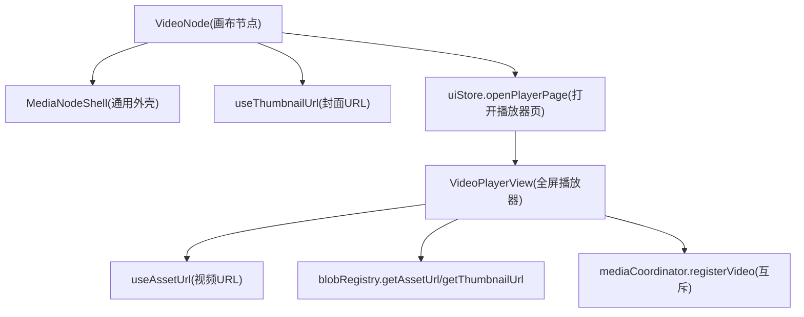
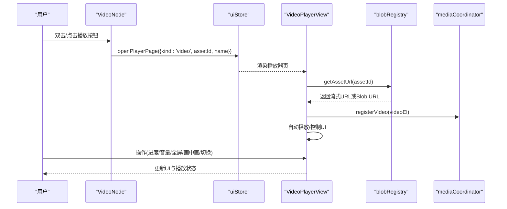
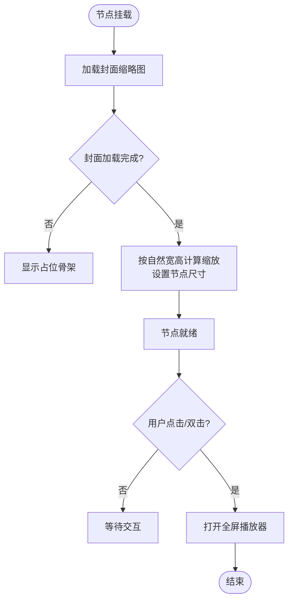
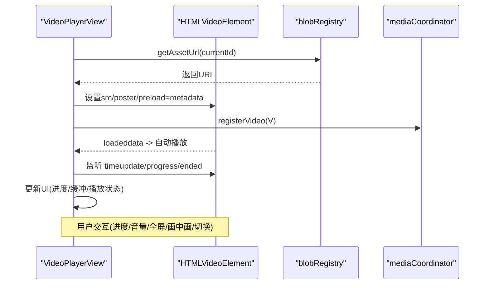
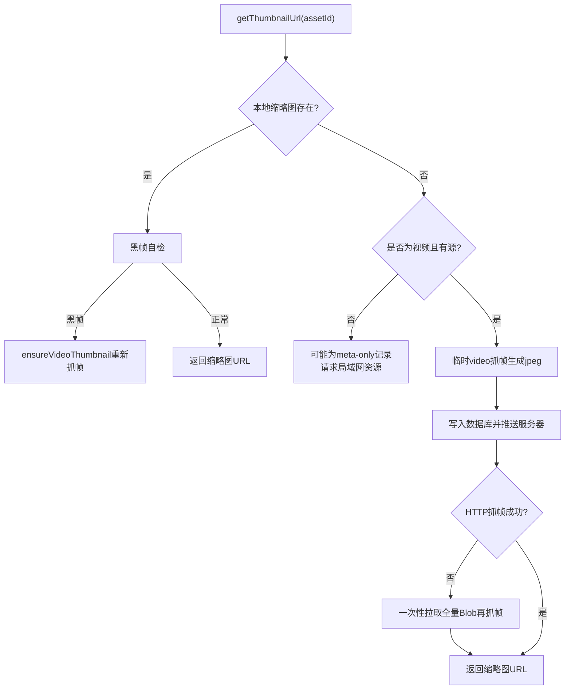
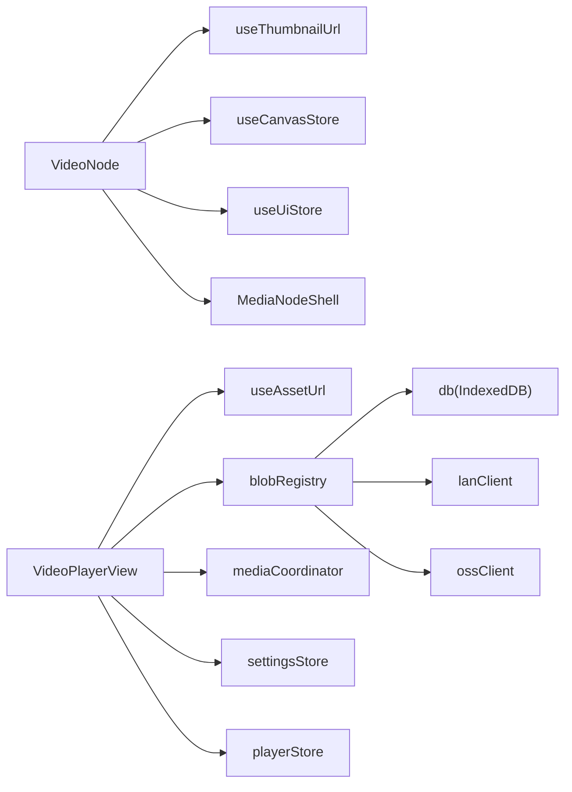

# 视频节点

<cite>
**本文引用的文件**
- [VideoNode.tsx](file://src/canvas/nodes/VideoNode.tsx)
- [MediaNodeShell.tsx](file://src/canvas/nodes/MediaNodeShell.tsx)
- [nodeTypes.ts](file://src/canvas/nodes/nodeTypes.ts)
- [VideoPlayer.tsx](file://src/components/VideoPlayer.tsx)
- [blobRegistry.ts](file://src/media/blobRegistry.ts)
- [useAssetUrl.ts](file://src/media/useAssetUrl.ts)
- [mediaCoordinator.ts](file://src/media/mediaCoordinator.ts)
- [uiStore.ts](file://src/store/uiStore.ts)
- [types.ts](file://src/types.ts)
</cite>

## 目录
1. [简介](#简介)
2. [项目结构](#项目结构)
3. [核心组件](#核心组件)
4. [架构总览](#架构总览)
5. [详细组件分析](#详细组件分析)
6. [依赖关系分析](#依赖关系分析)
7. [性能考量](#性能考量)
8. [故障排查指南](#故障排查指南)
9. [结论](#结论)
10. [附录](#附录)

## 简介
本文件围绕“视频节点”展开，系统性说明 VideoNode 在画布中的职责、与全屏播放器 VideoPlayerView 的协作方式、视频缩略图生成与缓存策略、播放控制与状态管理、用户交互（播放/暂停、进度、音量、全屏、画中画等），以及预加载、缓冲管理与内存释放等性能优化实践。目标是帮助开发者快速理解并扩展视频相关能力。

## 项目结构
- 画布节点层：VideoNode 作为 ReactFlow 节点，负责展示封面与播放入口，不内嵌播放器以避免指针抢占影响拖拽。
- 播放器层：VideoPlayerView 提供沉浸式全屏播放体验，包含完整控制栏、列表侧边栏、键盘快捷键等。
- 媒体资源层：blobRegistry 统一处理资源 URL、缩略图抓取与缓存；useAssetUrl 封装资源 URL 获取与重试逻辑。
- 协调层：mediaCoordinator 实现全局媒体互斥（同一时刻仅一个音频/视频播放）。
- 状态与路由：uiStore 管理播放器页面开关与参数；types 定义节点数据模型。

图表来源
- [VideoNode.tsx:18-28](file://src/canvas/nodes/VideoNode.tsx#L18-L28)
- [MediaNodeShell.tsx:32-150](file://src/canvas/nodes/MediaNodeShell.tsx#L32-L150)
- [useAssetUrl.ts:10-44](file://src/media/useAssetUrl.ts#L10-L44)
- [blobRegistry.ts:84-105](file://src/media/blobRegistry.ts#L84-L105)
- [mediaCoordinator.ts:1-25](file://src/media/mediaCoordinator.ts#L1-L25)
- [uiStore.ts:31-33](file://src/store/uiStore.ts#L31-L33)

章节来源
- [VideoNode.tsx:1-88](file://src/canvas/nodes/VideoNode.tsx#L1-L88)
- [nodeTypes.ts:14-16](file://src/canvas/nodes/nodeTypes.ts#L14-L16)

## 核心组件
- VideoNode：画布上的视频卡片，显示封面缩略图与播放按钮，双击或点击播放按钮进入全屏播放器。
- MediaNodeShell：所有媒体节点的通用外壳，提供边框、连线手柄、底部信息条、创建者角标、进度遮罩、协作锁定提示等。
- VideoPlayerView：沉浸式播放器，支持播放/暂停、进度拖动、快退快进、上一集/下一集、音量调节、静音、倍速、画中画、全屏、下载、搜索列表、键盘快捷键等。
- blobRegistry：资源 URL 与缩略图获取、缓存、并发控制、跨源抓帧、黑帧检测与兜底策略。
- useAssetUrl：资源 URL 获取与重试机制，适配局域网传输延迟场景。
- mediaCoordinator：全局媒体互斥，确保同一时间只有一个视频/音频播放。
- uiStore：播放器页面开关与参数传递。

章节来源
- [VideoNode.tsx:18-88](file://src/canvas/nodes/VideoNode.tsx#L18-L88)
- [MediaNodeShell.tsx:32-150](file://src/canvas/nodes/MediaNodeShell.tsx#L32-L150)
- [VideoPlayer.tsx:58-424](file://src/components/VideoPlayer.tsx#L58-L424)
- [blobRegistry.ts:84-389](file://src/media/blobRegistry.ts#L84-L389)
- [useAssetUrl.ts:10-99](file://src/media/useAssetUrl.ts#L10-L99)
- [mediaCoordinator.ts:1-25](file://src/media/mediaCoordinator.ts#L1-L25)
- [uiStore.ts:31-33](file://src/store/uiStore.ts#L31-L33)

## 架构总览
视频节点采用“轻量预览 + 按需加载”的架构：
- 画布上只渲染封面缩略图与播放按钮，避免大文件下载与原生控件干扰。
- 点击/双击后通过 uiStore 打开 VideoPlayerView，按需拉取视频流式地址或本地 Blob URL。
- 缩略图由 blobRegistry 统一生成与缓存，支持局域网同步、HTTP Range 流式、跨源抓帧与黑帧自检。
- 播放器注册到 mediaCoordinator，与其他音视频元素互斥播放。

图表来源
- [VideoNode.tsx:25-28](file://src/canvas/nodes/VideoNode.tsx#L25-L28)
- [uiStore.ts:84-88](file://src/store/uiStore.ts#L84-L88)
- [VideoPlayer.tsx:69-72](file://src/components/VideoPlayer.tsx#L69-L72)
- [blobRegistry.ts:84-105](file://src/media/blobRegistry.ts#L84-L105)
- [mediaCoordinator.ts:7-21](file://src/media/mediaCoordinator.ts#L7-L21)

## 详细组件分析

### VideoNode：画布视频节点
- 功能要点
  - 使用 useThumbnailUrl 获取封面缩略图 URL，用于节点展示与尺寸自适应。
  - 封面加载完成后根据自然宽高计算缩放比例，设置节点最大宽高限制，保持纵横比。
  - 点击/双击触发 openPlayerPage，传入 kind=video、assetId、name，进入全屏播放器。
  - 节点内部不嵌入 video 元素，避免原生控件抢占指针影响拖拽。
- 属性配置
  - 节点 data 字段来自 types.SuqNodeData，视频节点常用字段包括 kind、assetId、label、mime、width、height、borderColor 等。
  - 节点尺寸可通过 onNodesChange 动态调整，遵循 MAX_W/MAX_H 限制。
- 交互行为
  - 播放按钮与双击区域均调用 openPlayer()，阻止事件冒泡避免误触节点拖拽。
  - 封面图片 draggable=false 防止浏览器默认拖拽行为。

图表来源
- [VideoNode.tsx:18-49](file://src/canvas/nodes/VideoNode.tsx#L18-L49)
- [VideoNode.tsx:51-85](file://src/canvas/nodes/VideoNode.tsx#L51-L85)

章节来源
- [VideoNode.tsx:1-88](file://src/canvas/nodes/VideoNode.tsx#L1-L88)
- [types.ts:66-98](file://src/types.ts#L66-L98)

### MediaNodeShell：媒体节点通用外壳
- 提供四边连线手柄（source/target）、连接模式热区、选中态高亮、底部信息条（类型图标+文件名）、创建者角标、进度遮罩、协作锁定提示。
- 对 VideoNode 而言，主要承载内容区域与可选的进度遮罩（当前未使用）。

章节来源
- [MediaNodeShell.tsx:32-150](file://src/canvas/nodes/MediaNodeShell.tsx#L32-L150)

### VideoPlayerView：全屏播放器
- 功能要点
  - 批量加载缩略图与时长元数据（仅 metadata，不下载完整文件）。
  - 维护播放状态：playing、time、duration、buffered、volume、muted、rate、fullscreen、pip、seekDragging 等。
  - 控制能力：播放/暂停、进度拖动、快退快进、上一集/下一集、音量滑块与静音、倍速菜单、画中画、全屏、下载。
  - 键盘快捷键：空格播放暂停、左右箭头快退快进、上下箭头音量、M 静音、F 全屏、L 列表、Esc 关闭。
  - 自动播放：首次加载或切换视频时尝试自动播放，失败静默处理。
  - 互斥播放：通过 registerVideo 将当前 video 元素注册到全局集合，其他视频播放时自动暂停。
- 界面布局
  - 氛围背景：当前视频封面模糊铺满 + 渐变遮罩。
  - 顶栏：返回、标题、列表开关、主题切换、下载、关闭。
  - 主体：左侧视频画面 + 右侧常驻列表（非全屏）。
  - 底部控制栏：进度条、播放控制、音量、倍速、画中画、全屏。

图表来源
- [VideoPlayer.tsx:91-164](file://src/components/VideoPlayer.tsx#L91-L164)
- [VideoPlayer.tsx:196-293](file://src/components/VideoPlayer.tsx#L196-L293)
- [VideoPlayer.tsx:313-348](file://src/components/VideoPlayer.tsx#L313-L348)
- [blobRegistry.ts:84-105](file://src/media/blobRegistry.ts#L84-L105)
- [mediaCoordinator.ts:7-21](file://src/media/mediaCoordinator.ts#L7-L21)

章节来源
- [VideoPlayer.tsx:58-424](file://src/components/VideoPlayer.tsx#L58-L424)

### 缩略图生成与缓存策略（blobRegistry）
- 获取流程
  - 优先使用局域网同步的缩略图（已存在则直接返回）。
  - 若本地记录存在 thumbnail，进行黑帧自检，必要时重新抓帧替换。
  - 对于视频且无本地文件也无流式地址时，主动请求一次局域网资源，等待回包。
  - 有本地 Blob 或 HTTP 流式地址时，使用临时 video 元素抓帧生成 jpeg，存入数据库并推送到服务器。
  - HTTP 抓帧失败时，一次性拉取全量素材用同源 Blob URL 再抓一次（仅一次兜底，避免反复拉大文件）。
- 并发控制
  - 限制同时抓帧数量（THUMB_MAX_CONCURRENT），避免多路 seek 占用浏览器连接池导致播放卡顿。
- 跨源处理
  - 设置 crossOrigin=anonymous，配合服务端 CORS 允许画到 canvas 上，避免 SecurityError。
- 清理与失效
  - 提供 invalidate* 与 revokeAllUrls 方法，及时释放 Object URL，避免内存泄漏。

图表来源
- [blobRegistry.ts:310-379](file://src/media/blobRegistry.ts#L310-L379)
- [blobRegistry.ts:128-268](file://src/media/blobRegistry.ts#L128-L268)

章节来源
- [blobRegistry.ts:128-389](file://src/media/blobRegistry.ts#L128-L389)

### 资源 URL 获取与重试（useAssetUrl）
- 资源 URL 获取
  - 优先本地 IndexedDB Blob，其次局域网 HTTP 流式地址，最后 fallback 到 Blob URL。
  - 针对局域网传输中资源，提供多次重试与延时策略，提升鲁棒性。
- 缩略图 URL 获取
  - 快速轮询若干次，若处于局域网连接状态且超时未就绪，则降频继续等待，最长等待一定时间。
  - 失败时清空 URL，避免阻塞 UI。

章节来源
- [useAssetUrl.ts:10-99](file://src/media/useAssetUrl.ts#L10-L99)
- [blobRegistry.ts:84-105](file://src/media/blobRegistry.ts#L84-L105)

### 全局媒体互斥（mediaCoordinator）
- 设计目标：同一时刻最多一个音频和一个视频在播放。
- 实现方式：维护 audioElements 与 videoElements 两个 Set，任一元素触发 play 时，暂停同类型其他正在播放的元素。
- 生命周期：组件卸载时移除事件监听并从集合中删除元素，避免内存泄漏。

章节来源
- [mediaCoordinator.ts:1-25](file://src/media/mediaCoordinator.ts#L1-L25)

### 节点类型与数据模型
- 节点类型注册：mediaNodeTypes 中将 'video' 映射到 VideoNode。
- 数据模型：SuqNodeData 定义了节点通用字段，视频节点常用包括 kind、assetId、label、mime、width、height、borderColor 等。

章节来源
- [nodeTypes.ts:14-16](file://src/canvas/nodes/nodeTypes.ts#L14-L16)
- [types.ts:66-98](file://src/types.ts#L66-L98)

## 依赖关系分析
- VideoNode 依赖：
  - useThumbnailUrl：获取封面缩略图 URL。
  - useCanvasStore.onNodesChange：动态调整节点尺寸。
  - useUiStore.openPlayerPage：打开全屏播放器。
  - MediaNodeShell：通用外壳渲染。
- VideoPlayerView 依赖：
  - useAssetUrl：获取视频 URL。
  - blobRegistry：资源与缩略图获取、缓存、并发控制。
  - mediaCoordinator：注册视频元素以实现互斥播放。
  - store 层：settingsStore（主题）、playerStore（隐藏音频悬浮窗）。
- blobRegistry 依赖：
  - db：IndexedDB 存取资源与缩略图。
  - ossClient/cloudSync/lanClient：云端/局域网资源获取与缩略图同步。

图表来源
- [VideoNode.tsx:18-28](file://src/canvas/nodes/VideoNode.tsx#L18-L28)
- [VideoPlayer.tsx:69-72](file://src/components/VideoPlayer.tsx#L69-L72)
- [blobRegistry.ts:1-10](file://src/media/blobRegistry.ts#L1-L10)

章节来源
- [VideoNode.tsx:1-88](file://src/canvas/nodes/VideoNode.tsx#L1-L88)
- [VideoPlayer.tsx:58-424](file://src/components/VideoPlayer.tsx#L58-L424)
- [blobRegistry.ts:1-389](file://src/media/blobRegistry.ts#L1-L389)

## 性能考量
- 预加载策略
  - 播放器初始化时对列表内所有视频批量探测时长与缩略图，仅读取 metadata，不下载完整文件，减少带宽占用。
  - 使用 preload="metadata" 与 muted=true 的临时 video 元素探测，完成后立即移除 src 并 load，释放资源。
- 缓冲管理
  - 播放器监听 progress 事件更新 buffered 百分比，提供缓冲可视化。
  - 局域网 HTTP 流式地址支持 Range 请求，边下边播，可拖动进度，避免整份下载。
- 内存释放
  - 缩略图与资源 URL 使用 URL.createObjectURL 后，在失效或清理时调用 URL.revokeObjectURL 释放内存。
  - 抓帧过程中创建的临时 video 元素在 finish 回调中移除 src 并 load，避免悬挂对象。
  - mediaCoordinator 在组件卸载时移除事件监听并从集合中删除元素。
- 并发控制
  - 缩略图抓帧并发上限 THUMB_MAX_CONCURRENT，避免多路 seek 阻塞浏览器连接池。
  - 对 HTTP 抓帧失败的场景，仅进行一次全量 Blob 兜底，避免重复拉取大文件。
- 用户体验优化
  - 封面懒加载与重试机制，适应局域网传输延迟。
  - 全屏模式下控制栏自动隐藏，闲置后淡出，提升沉浸感。
  - 画中画与全屏状态同步，保证 UI 与系统状态一致。

[本节为通用性能建议，不直接分析具体代码行]

## 故障排查指南
- 封面始终为空
  - 检查局域网是否连接且资源是否就绪；useThumbnailUrl 会轮询等待，最长等待一段时间。
  - 确认服务端 CORS 配置正确，否则跨源抓帧会被安全策略阻止。
  - 查看 blobRegistry 的黑帧自检逻辑，旧版本黑帧会被重新抓帧替换。
- 视频无法播放
  - 检查 useAssetUrl 的重试逻辑与网络状况；局域网传输中资源可能需要等待。
  - 确认 blobRegistry 返回的是合法 URL（本地 Blob 或 HTTP 流式地址）。
- 播放不同步或卡顿
  - 检查 mediaCoordinator 是否正确注册视频元素，避免多个视频同时播放。
  - 关注缩略图抓帧并发是否过高，必要时降低 THUMB_MAX_CONCURRENT。
- 内存增长
  - 确认 URL.revokeObjectURL 被调用，避免 Object URL 泄漏。
  - 检查临时 video 元素是否在 finish 回调中清理。

章节来源
- [useAssetUrl.ts:52-99](file://src/media/useAssetUrl.ts#L52-L99)
- [blobRegistry.ts:128-268](file://src/media/blobRegistry.ts#L128-L268)
- [blobRegistry.ts:310-389](file://src/media/blobRegistry.ts#L310-L389)
- [mediaCoordinator.ts:7-21](file://src/media/mediaCoordinator.ts#L7-L21)

## 结论
VideoNode 以“轻量预览 + 按需加载”的方式实现了高效的视频节点展示与播放入口；VideoPlayerView 提供了完整的播放体验与控制能力；blobRegistry 构建了健壮的缩略图生成与资源获取体系；mediaCoordinator 确保了多媒体的有序播放。整体架构兼顾了性能与用户体验，适合在复杂画布场景中稳定运行。

[本节为总结性内容，不直接分析具体代码行]

## 附录
- 节点数据字段参考：参见 types.SuqNodeData，视频节点常用字段包括 kind、assetId、label、mime、width、height、borderColor 等。
- 播放器快捷键参考：空格播放暂停、左右箭头快退快进、上下箭头音量、M 静音、F 全屏、L 列表、Esc 关闭。
- 推荐实践
  - 在大量视频节点场景下，合理控制缩略图抓帧并发，避免影响主播放体验。
  - 对超大视频建议使用流式地址而非整份下载，充分利用 Range 请求。
  - 定期调用 revokeAllUrls 或在应用退出时清理资源，避免内存泄漏。

[本节为补充信息，不直接分析具体代码行]