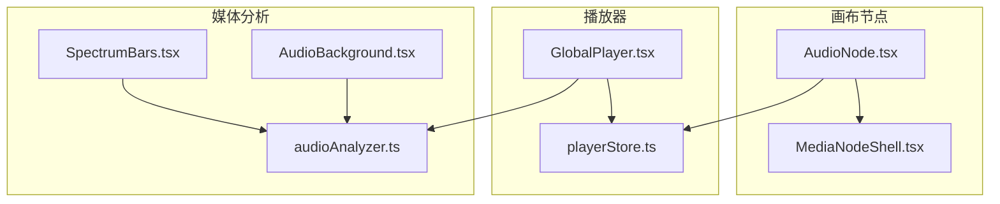
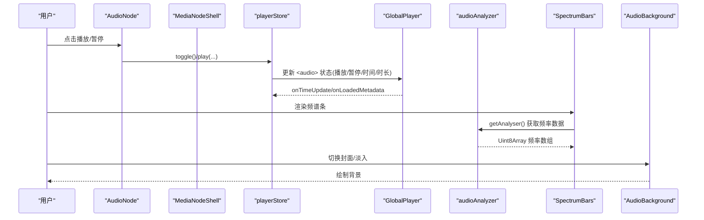
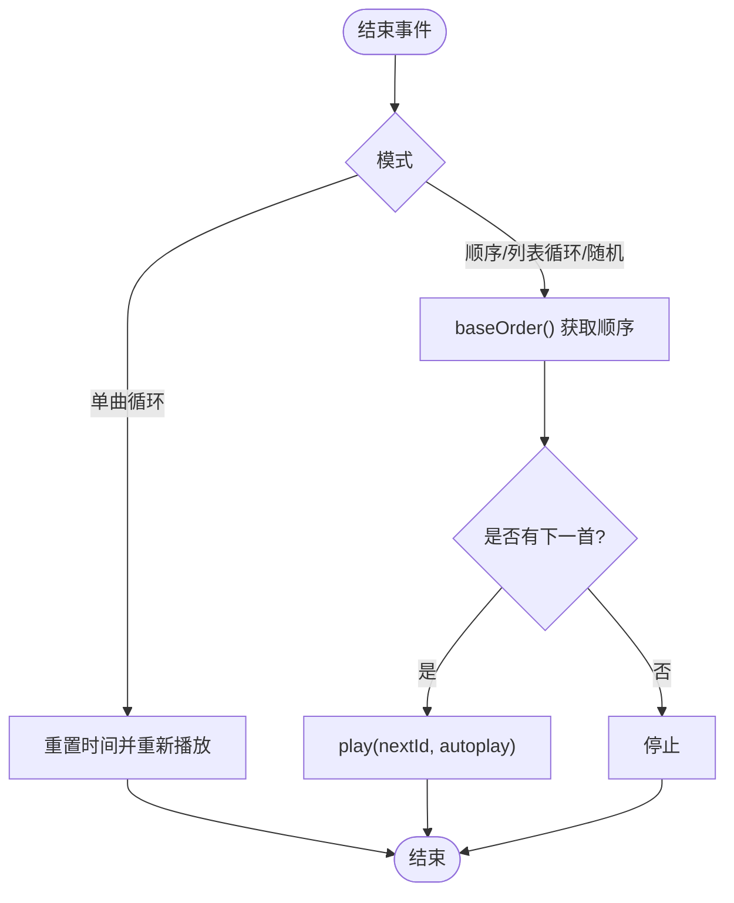
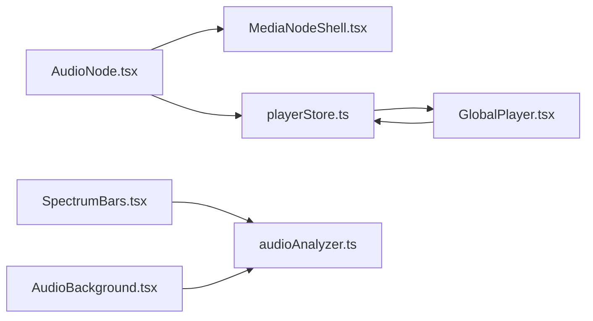

# 音频节点

<cite>
**本文引用的文件**
- [AudioNode.tsx](file://src/canvas/nodes/AudioNode.tsx)
- [MediaNodeShell.tsx](file://src/canvas/nodes/MediaNodeShell.tsx)
- [playerStore.ts](file://src/store/playerStore.ts)
- [GlobalPlayer.tsx](file://src/components/GlobalPlayer.tsx)
- [audioAnalyzer.ts](file://src/media/audioAnalyzer.ts)
- [SpectrumBars.tsx](file://src/components/SpectrumBars.tsx)
- [AudioBackground.tsx](file://src/components/AudioBackground.tsx)
- [managedFile.ts](file://src/media/managedFile.ts)
</cite>

## 目录
1. [简介](#简介)
2. [项目结构](#项目结构)
3. [核心组件](#核心组件)
4. [架构总览](#架构总览)
5. [详细组件分析](#详细组件分析)
6. [依赖关系分析](#依赖关系分析)
7. [性能考虑](#性能考虑)
8. [故障排查指南](#故障排查指南)
9. [结论](#结论)

## 简介
本文件面向“音频节点”的完整实现与使用，覆盖以下主题：
- 音频文件加载与播放器集成：从画布节点到全局播放引擎的数据流与控制流。
- 频谱分析与可视化效果：基于 Web Audio API 的频率数据获取、实时渲染与优化策略。
- 属性配置选项：播放模式、显示样式、频谱参数等。
- 用户交互功能：播放控制、进度显示、音量调节、歌词与专辑背景联动。
- 性能优化建议：音频流处理、内存管理与渲染优化。

## 项目结构
音频节点位于画布节点体系中，通过统一的媒体外壳渲染，并与全局播放器、频谱分析器、沉浸式背景等模块协作。

图表来源
- [AudioNode.tsx:18-126](file://src/canvas/nodes/AudioNode.tsx#L18-L126)
- [MediaNodeShell.tsx:32-151](file://src/canvas/nodes/MediaNodeShell.tsx#L32-L151)
- [GlobalPlayer.tsx:17-234](file://src/components/GlobalPlayer.tsx#L17-L234)
- [playerStore.ts:1-298](file://src/store/playerStore.ts#L1-L298)
- [audioAnalyzer.ts:1-59](file://src/media/audioAnalyzer.ts#L1-L59)
- [SpectrumBars.tsx:1-120](file://src/components/SpectrumBars.tsx#L1-L120)
- [AudioBackground.tsx:1-140](file://src/components/AudioBackground.tsx#L1-L140)

章节来源
- [AudioNode.tsx:18-126](file://src/canvas/nodes/AudioNode.tsx#L18-L126)
- [MediaNodeShell.tsx:32-151](file://src/canvas/nodes/MediaNodeShell.tsx#L32-L151)
- [GlobalPlayer.tsx:17-234](file://src/components/GlobalPlayer.tsx#L17-L234)
- [playerStore.ts:1-298](file://src/store/playerStore.ts#L1-L298)
- [audioAnalyzer.ts:1-59](file://src/media/audioAnalyzer.ts#L1-L59)
- [SpectrumBars.tsx:1-120](file://src/components/SpectrumBars.tsx#L1-L120)
- [AudioBackground.tsx:1-140](file://src/components/AudioBackground.tsx#L1-L140)

## 核心组件
- 音频节点（AudioNode）：画布中的可交互媒体节点，负责展示封面/图标、播放/暂停按钮、时间显示、下载入口，以及双击进入专用播放器页面。
- 媒体外壳（MediaNodeShell）：统一节点外壳，提供连接点、名称栏、创建者角标、进度遮罩、锁定提示等通用能力。
- 全局播放器（GlobalPlayer）：应用内唯一 <audio> 元素挂载点，承载播放状态同步、悬浮迷你控制条、画中画支持。
- 播放器状态（playerStore）：集中管理当前曲目、播放/暂停、时间/时长、音量/静音、播放模式、队列、切歌逻辑等。
- 音频分析器（audioAnalyzer）：单例 AnalyserNode 管理，将当前音频元素接入频率分析管线，提供归一化音量级。
- 频谱条（SpectrumBars）：Canvas 绘制的紧凑频谱条，随音乐节奏跳动，颜色跟随封面主色相变化。
- 沉浸式背景（AudioBackground）：全屏封面铺满背景，多张封面轮换时淡入切换，底部压暗提升可读性。

章节来源
- [AudioNode.tsx:18-126](file://src/canvas/nodes/AudioNode.tsx#L18-L126)
- [MediaNodeShell.tsx:32-151](file://src/canvas/nodes/MediaNodeShell.tsx#L32-L151)
- [GlobalPlayer.tsx:17-234](file://src/components/GlobalPlayer.tsx#L17-L234)
- [playerStore.ts:1-298](file://src/store/playerStore.ts#L1-L298)
- [audioAnalyzer.ts:1-59](file://src/media/audioAnalyzer.ts#L1-L59)
- [SpectrumBars.tsx:1-120](file://src/components/SpectrumBars.tsx#L1-L120)
- [AudioBackground.tsx:1-140](file://src/components/AudioBackground.tsx#L1-L140)

## 架构总览
音频节点作为画布中的一个媒体类型，不直接持有音频实例，而是通过全局播放器与状态管理进行控制；可视化部分通过共享的分析器读取实时频率数据并驱动 Canvas 渲染。

图表来源
- [AudioNode.tsx:34-47](file://src/canvas/nodes/AudioNode.tsx#L34-L47)
- [playerStore.ts:174-209](file://src/store/playerStore.ts#L174-L209)
- [GlobalPlayer.tsx:160-179](file://src/components/GlobalPlayer.tsx#L160-L179)
- [audioAnalyzer.ts:26-47](file://src/media/audioAnalyzer.ts#L26-L47)
- [SpectrumBars.tsx:29-63](file://src/components/SpectrumBars.tsx#L29-L63)
- [AudioBackground.tsx:46-130](file://src/components/AudioBackground.tsx#L46-L130)

## 详细组件分析

### 音频节点（AudioNode）
- 职责
  - 展示封面或默认图标，显示当前播放进度遮罩。
  - 提供播放/暂停按钮，点击后调用全局播放器状态切换或播放指定曲目。
  - 显示当前时间与总时长（仅对当前正在播放的节点）。
  - 提供下载入口，打开专用播放器页面（双击）。
- 关键行为
  - 进度计算：仅当该节点为当前曲目时显示真实进度，否则归零。
  - 播放控制：若当前已在播放同一曲目则切换播放/暂停；否则以 autoplay=true 播放。
  - 界面联动：打开播放器时隐藏悬浮条，关闭时恢复。
- 与外壳协作
  - 通过 MediaNodeShell 传入 progress，实现整节点进度遮罩。
- 错误处理
  - 下载失败时弹出错误提示。

章节来源
- [AudioNode.tsx:18-126](file://src/canvas/nodes/AudioNode.tsx#L18-L126)
- [MediaNodeShell.tsx:132-139](file://src/canvas/nodes/MediaNodeShell.tsx#L132-L139)

### 媒体外壳（MediaNodeShell）
- 职责
  - 提供四边连接手柄与连线模式热区。
  - 显示名称栏与创建者角标（可选始终显示）。
  - 渲染进度遮罩（0..1），用于在节点上直观展示播放进度。
  - 处理协同编辑锁定提示。
- 性能要点
  - 仅在选中或悬停时显示名称栏与创建者信息，减少重绘。
  - 进度遮罩使用 CSS 宽度过渡，避免频繁 DOM 操作。

章节来源
- [MediaNodeShell.tsx:32-151](file://src/canvas/nodes/MediaNodeShell.tsx#L32-L151)

### 全局播放器（GlobalPlayer）
- 职责
  - 挂载唯一的 <audio> 元素，绑定事件同步时间、时长、播放状态。
  - 暴露悬浮迷你控制条，支持拖拽定位、收起/展开、快进/后退、最小化窗口。
  - 注册音频元素至媒体协调器，供其他模块访问。
- 与状态同步
  - 监听 store 的 volume/muted 变化并应用到 <audio>。
  - 歌曲结束后通知引擎自动续播。
- 键盘快捷键
  - 空格播放/暂停、左右键跳转、上下键调音量、L 收藏（由播放器视图层处理）。

章节来源
- [GlobalPlayer.tsx:17-234](file://src/components/GlobalPlayer.tsx#L17-L234)
- [playerStore.ts:159-161](file://src/store/playerStore.ts#L159-L161)

### 播放器状态（playerStore）
- 核心状态
  - track、playing、time、duration、volume、muted、mode、queue、barVisible。
- 关键方法
  - play：解析资源 URL，设置 src/load，按需自动播放；同曲不重复加载。
  - toggle/seekTo/seekBy：控制播放与跳转。
  - next/prev：根据 mode 与 baseOrder 决定下一首/上一首。
  - setMode/setQueue：切换播放模式与队列。
  - stop：停止并清空状态。
- 顺序解析
  - baseOrder：优先队列 → 播放器列表提供者 → 画布连线顺序。
  - graphOrderFor：沿画布连线 DFS 先序遍历得到流式顺序。
- 自动续播
  - handleEnded：单曲循环重播；其他模式按顺序/随机选择下一首。

图表来源
- [playerStore.ts:132-161](file://src/store/playerStore.ts#L132-L161)
- [playerStore.ts:105-123](file://src/store/playerStore.ts#L105-L123)

章节来源
- [playerStore.ts:1-298](file://src/store/playerStore.ts#L1-L298)

### 音频分析器（audioAnalyzer）
- 设计
  - 单例 AudioContext + AnalyserNode，FFT 大小 512，平滑常数 0.5，保证响应灵敏且不过度抖动。
  - wireAudioElement：将 HTMLAudioElement 接入分析器，WeakSet 确保每个元素只接一次。
  - getAnalyser：获取 AnalyserNode 供可视化读取频率数据。
  - getAudioLevel：计算归一化音量级（0..1），用于波纹幅度等视觉反馈。
- 兼容性
  - 不支持环境静默降级，不影响动画与 UI。

章节来源
- [audioAnalyzer.ts:1-59](file://src/media/audioAnalyzer.ts#L1-L59)

### 频谱条（SpectrumBars）
- 渲染
  - 使用 Canvas 绘制 44 根圆头条，高度随频率值动态变化。
  - 感知曲线：对中小频段增强可见度，提升律动感。
  - 颜色：基于封面主色相渐变，高亮条带微光。
  - 基线：暂停/静音时保留低矮基线，保持“呼吸”感。
- 性能
  - ResizeObserver 自适应尺寸，限制 DPR 上限为 2。
  - requestAnimationFrame 驱动，帧间差值平滑上升/回落。
  - 仅当 playing 变化时启动/停止动画循环。

章节来源
- [SpectrumBars.tsx:1-120](file://src/components/SpectrumBars.tsx#L1-L120)
- [audioAnalyzer.ts:26-59](file://src/media/audioAnalyzer.ts#L26-L59)

### 沉浸式背景（AudioBackground）
- 渲染
  - 封面 cover-fit 铺满全屏，多张封面每 5 秒轮换，交叉淡入 0.9s。
  - 无封面时回退为渐变色背景，颜色来自封面取色。
  - 底部压暗渐变，提升控制栏可读性。
- 性能
  - 仅在封面变化、淡入中或尺寸变化时重绘，静态时零开销。
  - ResizeObserver 适配容器尺寸，DPR 上限 2。

章节来源
- [AudioBackground.tsx:1-140](file://src/components/AudioBackground.tsx#L1-L140)

### 媒体文件聚合（managedFile）
- 作用
  - 将画布节点与素材记录聚合为 ManagedFile 列表，过滤 MP3 文件用于播放器列表。
- 关键点
  - isMp3：判断音频类型与扩展名。
  - collectFiles：去重并按 assetId 聚合关联节点。

章节来源
- [managedFile.ts:1-39](file://src/media/managedFile.ts#L1-L39)

## 依赖关系分析
- 耦合与内聚
  - AudioNode 与 MediaNodeShell 高内聚，专注节点展示与交互。
  - GlobalPlayer 与 playerStore 强耦合，承担实际播放与状态同步。
  - SpectrumBars/AudioBackground 依赖 audioAnalyzer 提供的频率数据，解耦于具体播放源。
- 外部依赖
  - Web Audio API：AnalyserNode、AudioContext。
  - Canvas API：2D 上下文绘制频谱与背景。
  - React Flow：节点连接与手柄。
- 潜在循环
  - 无直接循环依赖；通过 store 与单例分析器解耦。

图表来源
- [AudioNode.tsx:18-126](file://src/canvas/nodes/AudioNode.tsx#L18-L126)
- [MediaNodeShell.tsx:32-151](file://src/canvas/nodes/MediaNodeShell.tsx#L32-L151)
- [GlobalPlayer.tsx:17-234](file://src/components/GlobalPlayer.tsx#L17-L234)
- [playerStore.ts:1-298](file://src/store/playerStore.ts#L1-L298)
- [audioAnalyzer.ts:1-59](file://src/media/audioAnalyzer.ts#L1-L59)
- [SpectrumBars.tsx:1-120](file://src/components/SpectrumBars.tsx#L1-L120)
- [AudioBackground.tsx:1-140](file://src/components/AudioBackground.tsx#L1-L140)

章节来源
- [playerStore.ts:1-298](file://src/store/playerStore.ts#L1-L298)
- [audioAnalyzer.ts:1-59](file://src/media/audioAnalyzer.ts#L1-L59)

## 性能考虑
- 音频流处理
  - 单例 AudioContext/AnalyserNode，避免重复创建与资源泄漏。
  - FFT 大小 512、平滑常数 0.5，平衡灵敏度与稳定性。
  - 使用 WeakSet 防止重复接入音频元素。
- 内存管理
  - 频谱条与背景使用 ResizeObserver 与 DPR 上限 2 控制像素缓冲大小。
  - 背景仅在必要时重绘，减少 CPU/GPU 压力。
  - 歌词/专辑图异步加载，取消未完成请求（alive 标志）。
- 渲染优化
  - 频谱条使用 requestAnimationFrame，帧间差值平滑，避免卡顿。
  - 进度遮罩采用 CSS 宽度过渡，降低重排成本。
  - 播放器状态变更批量更新，减少多次 setState。
- 建议
  - 大文件预加载：preload="metadata" 已启用，可按需进一步缓存 URL。
  - 频谱条数量可调：BAR_COUNT 可根据设备性能调整。
  - 禁用不必要的高 DPI：在低端设备上可将 DPR 上限降至 1。

[本节为通用指导，无需特定文件引用]

## 故障排查指南
- 无法播放
  - 检查是否已通过 wireAudioElement 接入分析器；某些浏览器需要用户手势触发播放。
  - 确认 <audio> 元素已正确绑定事件（onPlay/onPause/onTimeUpdate/onLoadedMetadata）。
- 频谱无变化
  - 确认 getAnalyser 返回有效 AnalyserNode；检查频率数组长度与取值范围。
  - 确认 playing 状态为真，否则频谱条会显示基线。
- 背景不切换
  - 检查封面 URL 是否正确加载；确认淡入过渡逻辑未被提前清理。
- 下载失败
  - 检查资源 URL 生成与权限；捕获异常并提示用户。

章节来源
- [audioAnalyzer.ts:26-47](file://src/media/audioAnalyzer.ts#L26-L47)
- [GlobalPlayer.tsx:160-179](file://src/components/GlobalPlayer.tsx#L160-L179)
- [SpectrumBars.tsx:29-63](file://src/components/SpectrumBars.tsx#L29-L63)
- [AudioBackground.tsx:46-130](file://src/components/AudioBackground.tsx#L46-L130)
- [AudioNode.tsx:49-64](file://src/canvas/nodes/AudioNode.tsx#L49-L64)

## 结论
音频节点通过清晰的职责划分与模块化设计，实现了从画布交互到全局播放、再到频谱可视化的完整链路。借助单例分析器与高效的 Canvas 渲染，系统在保持良好用户体验的同时兼顾了性能。未来可进一步优化频谱条数量、DPR 上限与资源缓存策略，以适应更多设备场景。

[本节为总结性内容，无需特定文件引用]