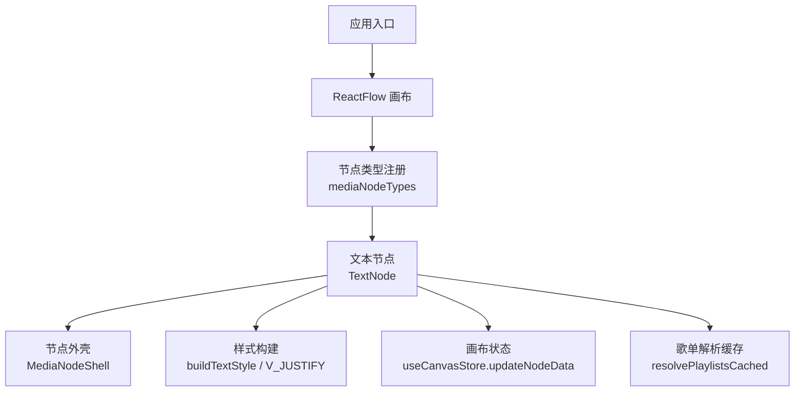
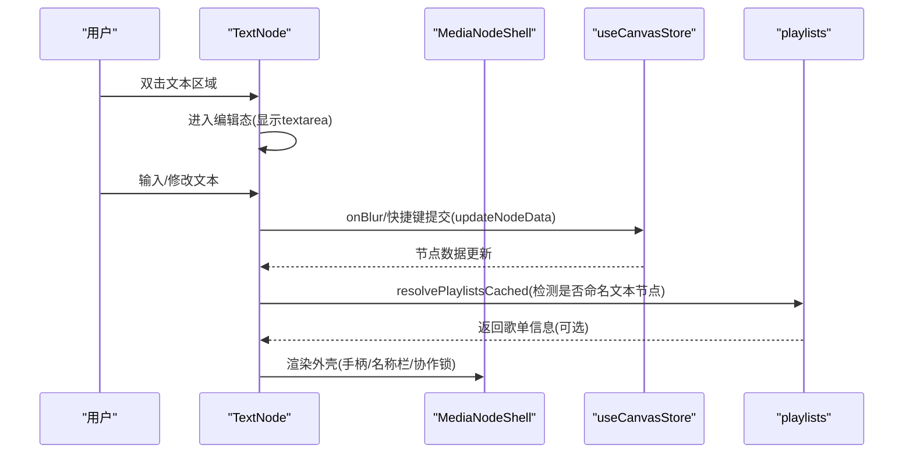
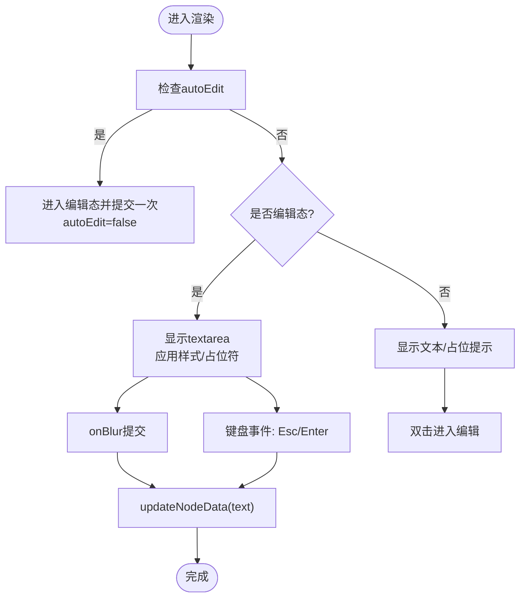
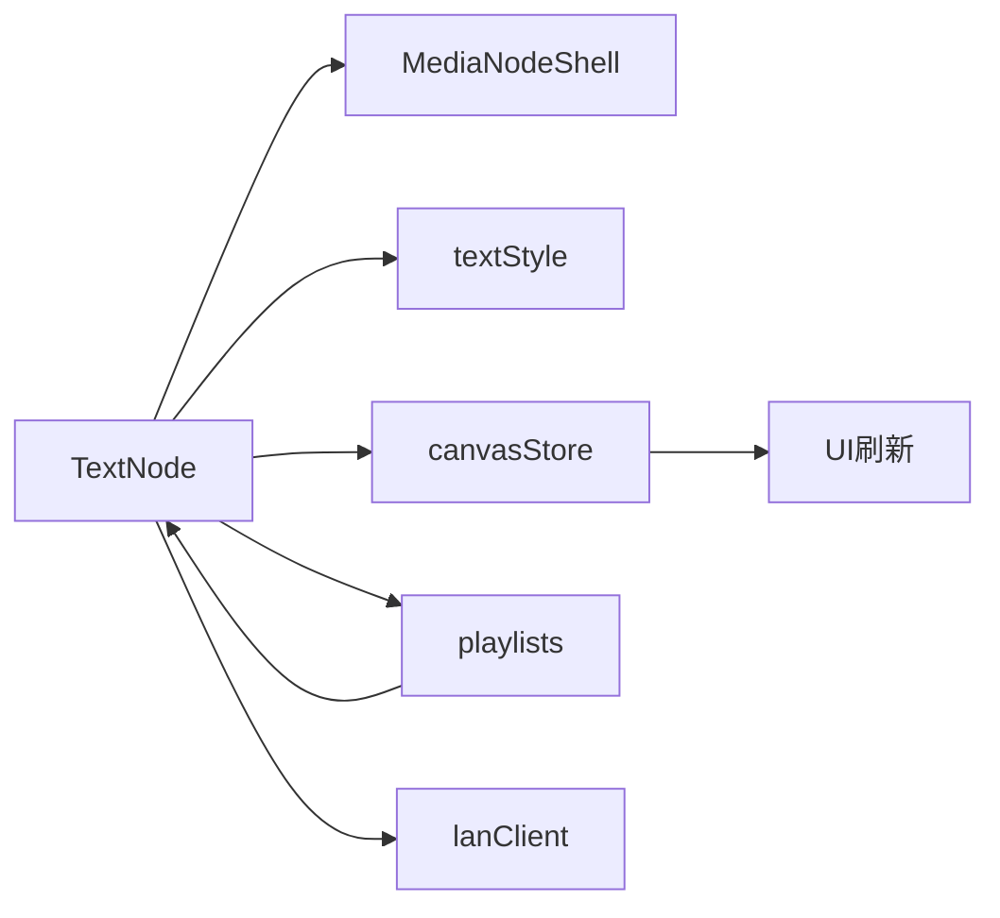

# 文本节点

<cite>
**本文引用的文件**
- [TextNode.tsx](file://src/canvas/nodes/TextNode.tsx)
- [textStyle.ts](file://src/canvas/nodes/textStyle.ts)
- [MediaNodeShell.tsx](file://src/canvas/nodes/MediaNodeShell.tsx)
- [nodeTypes.ts](file://src/canvas/nodes/nodeTypes.ts)
- [types.ts](file://src/types.ts)
- [canvasStore.ts](file://src/store/canvasStore.ts)
- [playlists.ts](file://src/media/playlists.ts)
- [InspectorPanel.tsx](file://src/components/InspectorPanel.tsx)
- [fileLoader.ts](file://src/io/fileLoader.ts)
</cite>

## 目录
1. [简介](#简介)
2. [项目结构](#项目结构)
3. [核心组件](#核心组件)
4. [架构总览](#架构总览)
5. [详细组件分析](#详细组件分析)
6. [依赖关系分析](#依赖关系分析)
7. [性能考虑](#性能考虑)
8. [故障排查指南](#故障排查指南)
9. [结论](#结论)
10. [附录：使用示例与最佳实践](#附录：使用示例与最佳实践)

## 简介
本文档围绕画布中的“文本节点”进行系统化说明，涵盖实现原理、编辑交互、样式设置（字体、颜色、对齐方式）、文本格式化选项、属性接口、事件处理机制、渲染逻辑、与其他节点的交互与数据绑定机制，以及性能优化建议与常见问题解决方案。目标是帮助开发者快速理解并正确使用 TextNode，同时为扩展和排错提供清晰指引。

## 项目结构
文本节点位于画布节点体系中，作为媒体节点的一种类型被注册到 React Flow 中，并通过统一的节点外壳 MediaNodeShell 提供连线手柄、选中态、协作锁定等通用能力。文本节点的数据模型由全局类型定义约束，样式通过独立的样式构建函数生成，状态变更统一经由画布 Store 管理。

图表来源
- [nodeTypes.ts:14-26](file://src/canvas/nodes/nodeTypes.ts#L14-L26)
- [TextNode.tsx:13-106](file://src/canvas/nodes/TextNode.tsx#L13-L106)
- [MediaNodeShell.tsx:32-150](file://src/canvas/nodes/MediaNodeShell.tsx#L32-L150)
- [textStyle.ts:4-21](file://src/canvas/nodes/textStyle.ts#L4-L21)
- [canvasStore.ts:176-183](file://src/store/canvasStore.ts#L176-L183)
- [playlists.ts:172-178](file://src/media/playlists.ts#L172-L178)

章节来源
- [nodeTypes.ts:14-26](file://src/canvas/nodes/nodeTypes.ts#L14-L26)
- [TextNode.tsx:13-106](file://src/canvas/nodes/TextNode.tsx#L13-L106)
- [MediaNodeShell.tsx:32-150](file://src/canvas/nodes/MediaNodeShell.tsx#L32-L150)
- [textStyle.ts:4-21](file://src/canvas/nodes/textStyle.ts#L4-L21)
- [canvasStore.ts:176-183](file://src/store/canvasStore.ts#L176-L183)
- [playlists.ts:172-178](file://src/media/playlists.ts#L172-L178)

## 核心组件
- 文本节点组件：负责文本的展示与编辑、样式应用、与歌单系统的联动、协作编辑状态同步。
- 样式构建器：将节点数据转换为 CSS 样式对象，支持水平/垂直对齐、字号、字体、颜色、加粗、斜体、下划线、行高。
- 节点外壳：提供连线手柄、选中态边框、底部名称栏、插入者角标、播放进度遮罩、协作锁定覆盖层。
- 类型系统：统一定义 SuqNodeData 中与文本相关的字段，确保跨模块一致。
- 画布 Store：集中管理节点数据更新、撤销/重做历史、复制粘贴、层级调整等。
- 歌单系统：基于文本节点命名并指向音频首节点，派生播放列表；文本节点内嵌快捷播放按钮。

章节来源
- [TextNode.tsx:13-106](file://src/canvas/nodes/TextNode.tsx#L13-L106)
- [textStyle.ts:4-21](file://src/canvas/nodes/textStyle.ts#L4-L21)
- [MediaNodeShell.tsx:32-150](file://src/canvas/nodes/MediaNodeShell.tsx#L32-L150)
- [types.ts:66-98](file://src/types.ts#L66-L98)
- [canvasStore.ts:176-183](file://src/store/canvasStore.ts#L176-L183)
- [playlists.ts:115-178](file://src/media/playlists.ts#L115-L178)

## 架构总览
文本节点在 React Flow 中以自定义节点形式存在，渲染时包裹在 MediaNodeShell 中，获得统一的交互能力。文本内容通过 textarea 或 div 呈现，编辑态与非编辑态切换由本地状态控制。样式通过 buildTextStyle 从节点数据计算得到。文本节点可触发画布 Store 的 updateNodeData 持久化修改。若该文本节点满足“命名文本节点”规则，则会被歌单系统识别并可一键播放关联音频。

图表来源
- [TextNode.tsx:23-50](file://src/canvas/nodes/TextNode.tsx#L23-L50)
- [canvasStore.ts:176-183](file://src/store/canvasStore.ts#L176-L183)
- [playlists.ts:172-178](file://src/media/playlists.ts#L172-L178)
- [MediaNodeShell.tsx:32-150](file://src/canvas/nodes/MediaNodeShell.tsx#L32-L150)

## 详细组件分析

### TextNode 组件
- 编辑模式
  - 双击进入编辑态，自动聚焦并全选文本；支持 Escape 退出编辑；Ctrl/Cmd + Enter 提交。
  - 提交时将值写入节点 data.text，并关闭编辑态。
  - 支持 autoEdit 标志位，用于外部触发自动进入编辑（如插入新文本节点后）。
- 样式渲染
  - 使用 buildTextStyle 将 textAlign、fontSize、fontFamily、textColor、bold、italic、underline、lineHeight 映射为 CSS。
  - 使用 V_JUSTIFY 将 textAlignV(top/middle/bottom) 映射为 flex 容器的 justifyContent。
- 歌单联动
  - 通过 resolvePlaylistsCached 判断当前文本节点是否为“命名文本节点”，若是且未编辑，则显示“歌单”按钮，点击打开播放器。
- 协作编辑
  - 编辑期间调用 setLanEditing 上报当前节点正在被编辑，离开时清理；其他用户可见锁定提示。
- 选择与缩放
  - 选中且非编辑时显示 ResizeHandles，允许调整尺寸。

图表来源
- [TextNode.tsx:23-50](file://src/canvas/nodes/TextNode.tsx#L23-L50)
- [TextNode.tsx:78-101](file://src/canvas/nodes/TextNode.tsx#L78-L101)

章节来源
- [TextNode.tsx:13-106](file://src/canvas/nodes/TextNode.tsx#L13-L106)

### 样式系统（textStyle.ts）
- 水平对齐：textAlign(left/center/right/justify)，默认 left。
- 垂直对齐：textAlignV(top/middle/bottom)，通过 flex 的 justifyContent 生效。
- 字体与颜色：fontFamily、fontSize、textColor。
- 文本修饰：bold(700)、italic、underline。
- 行高：lineHeight。
- 输出：buildTextStyle(data) 返回 CSSProperties。

章节来源
- [textStyle.ts:4-21](file://src/canvas/nodes/textStyle.ts#L4-L21)

### 节点外壳（MediaNodeShell.tsx）
- 连线手柄：四边 source/target 手柄，连线模式下四条边作为连接热区。
- 名称栏：显示节点 kind 图标与 label。
- 插入者角标：hover/selected/alwaysShowCreator 时显示 createdByName。
- 播放进度遮罩：progress 参数驱动宽度变化。
- 协作锁定：当有其他用户正在编辑该节点时，阻止交互并显示提示。

章节来源
- [MediaNodeShell.tsx:32-150](file://src/canvas/nodes/MediaNodeShell.tsx#L32-L150)

### 类型与数据模型（types.ts）
- SuqNodeData 中与文本相关的关键字段：
  - text: string | undefined
  - label: string | undefined
  - textAlign: 'left' | 'center' | 'right' | 'justify'
  - textAlignV: 'top' | 'middle' | 'bottom'
  - fontSize: number | undefined
  - fontFamily: string | undefined
  - textColor: string | undefined
  - bold: boolean | undefined
  - italic: boolean | undefined
  - underline: boolean | undefined
  - lineHeight: number | undefined
  - autoEdit: boolean | undefined
- 这些字段被 InspectorPanel 暴露为可视化控件，供用户实时调整。

章节来源
- [types.ts:66-98](file://src/types.ts#L66-L98)

### 画布状态与数据绑定（canvasStore.ts）
- updateNodeData(id, patch)：合并更新节点 data，并记录历史快照，支持撤销/重做。
- onNodesChange/onEdgesChange：统一处理节点/边的增删改，并在删除时立即落盘历史。
- 文本节点通过调用 updateNodeData 将编辑结果持久化到全局状态，从而驱动 UI 刷新与协作同步。

章节来源
- [canvasStore.ts:176-183](file://src/store/canvasStore.ts#L176-L183)
- [canvasStore.ts:126-145](file://src/store/canvasStore.ts#L126-L145)

### 歌单系统与文本节点联动（playlists.ts）
- 命名文本节点规则：kind === 'text'、文本非空、无入边、恰好一条出边指向音频节点。
- 文本节点内部根据 resolvePlaylistsCached 检测结果，在非编辑态显示“歌单”按钮，点击后打开播放器并传入首曲 assetId。
- 解析过程对重复歌曲、循环连线等进行告警，保证播放顺序稳定。

章节来源
- [playlists.ts:115-178](file://src/media/playlists.ts#L115-L178)
- [TextNode.tsx:18-22](file://src/canvas/nodes/TextNode.tsx#L18-L22)
- [TextNode.tsx:55-60](file://src/canvas/nodes/TextNode.tsx#L55-L60)

### 检查器面板（InspectorPanel.tsx）
- 提供文本样式的可视化编辑：
  - 水平/垂直对齐按钮组
  - 字体家族下拉（含常用中英文字体）
  - 字号输入框（范围限制）
  - 行高输入框
  - 颜色选择器（文本颜色、边框颜色）
  - 加粗/斜体/下划线开关
- 所有更改通过 updateNodeData 即时应用到选中节点，支持多节点批量操作。

章节来源
- [InspectorPanel.tsx:540-594](file://src/components/InspectorPanel.tsx#L540-L594)
- [InspectorPanel.tsx:489-500](file://src/components/InspectorPanel.tsx#L489-L500)

### 文本节点创建与默认值（fileLoader.ts）
- createTextNode(position, autoEdit?)：创建文本节点，默认 width=240，data 包含 kind='text'、label='文本'、text=''、autoEdit、borderColor。
- 便于在工具栏或导入流程中快速插入文本节点，并可选择自动进入编辑态。

章节来源
- [fileLoader.ts:207-221](file://src/io/fileLoader.ts#L207-L221)

## 依赖关系分析
- TextNode 依赖：
  - @xyflow/react：节点渲染与交互基础
  - MediaNodeShell：节点外壳与协作锁定
  - textStyle：样式构建
  - canvasStore：数据更新与历史
  - playlists：歌单解析与缓存
  - lanClient：协作编辑上报
- 数据流向：
  - 用户输入 → TextNode → updateNodeData → 全局状态 → 其他组件订阅刷新
  - 歌单解析 → resolvePlaylistsCached → TextNode 显示播放入口

图表来源
- [TextNode.tsx:1-11](file://src/canvas/nodes/TextNode.tsx#L1-L11)
- [canvasStore.ts:176-183](file://src/store/canvasStore.ts#L176-L183)
- [playlists.ts:172-178](file://src/media/playlists.ts#L172-L178)

章节来源
- [TextNode.tsx:1-11](file://src/canvas/nodes/TextNode.tsx#L1-L11)
- [canvasStore.ts:176-183](file://src/store/canvasStore.ts#L176-L183)
- [playlists.ts:172-178](file://src/media/playlists.ts#L172-L178)

## 性能考虑
- 避免频繁重渲染
  - 使用 memo 包裹 TextNode，减少无关更新。
  - 样式通过 useMemo 构建（buildTextStyle），仅在数据变化时重建。
- 歌单解析缓存
  - resolvePlaylistsCached 基于引用相等性缓存整图解析结果，避免多个文本节点重复计算。
- 编辑器行为优化
  - 编辑态使用 textarea，提交时机集中在 onBlur 与快捷键，降低状态抖动。
  - 自动聚焦与选区提升输入效率。
- 协作锁定
  - 通过 MediaNodeShell 的锁定层防止并发冲突导致的无效操作。

[本节为通用性能建议，不直接分析具体代码片段]

## 故障排查指南
- 文本无法编辑
  - 检查是否处于协作锁定状态（MediaNodeShell 会显示锁定提示）。
  - 确认 autoEdit 是否正确触发进入编辑态。
- 样式不生效
  - 确认 InspectorPanel 已正确调用 updateNodeData 更新对应字段。
  - 检查 buildTextStyle 映射的字段是否与 types.ts 一致。
- 歌单按钮不显示
  - 确认文本节点满足“命名文本节点”规则：文本非空、无入边、仅一条出边指向音频节点。
  - 查看 playlists 解析是否有警告（重复歌曲、循环连线等）。
- 数据未持久化
  - 确认提交路径调用了 updateNodeData，而非仅更新本地 state。
  - 检查画布 Store 的历史快照是否正常记录（撤销/重做可用）。

章节来源
- [MediaNodeShell.tsx:141-147](file://src/canvas/nodes/MediaNodeShell.tsx#L141-L147)
- [TextNode.tsx:23-50](file://src/canvas/nodes/TextNode.tsx#L23-L50)
- [textStyle.ts:10-21](file://src/canvas/nodes/textStyle.ts#L10-L21)
- [playlists.ts:115-178](file://src/media/playlists.ts#L115-L178)
- [canvasStore.ts:176-183](file://src/store/canvasStore.ts#L176-L183)

## 结论
文本节点以简洁的数据模型与清晰的渲染逻辑实现了富文本编辑与样式定制，并通过歌单系统拓展了业务场景。借助统一的节点外壳与画布 Store，文本节点具备良好的可扩展性与协作能力。遵循本文档的规范与最佳实践，可在项目中高效地使用与扩展文本节点功能。

[本节为总结性内容，不直接分析具体代码片段]

## 附录：使用示例与最佳实践

- 基本文本输入
  - 插入文本节点后双击进入编辑，输入内容；失焦或按快捷键提交。
  - 参考：createTextNode 的默认结构与 autoEdit 用法。
  - 章节来源
    - [fileLoader.ts:207-221](file://src/io/fileLoader.ts#L207-L221)
    - [TextNode.tsx:78-101](file://src/canvas/nodes/TextNode.tsx#L78-L101)

- 富文本格式化
  - 通过 InspectorPanel 调整字体家族、字号、行高、颜色、加粗、斜体、下划线、水平/垂直对齐。
  - 样式通过 buildTextStyle 实时应用到文本区域。
  - 章节来源
    - [InspectorPanel.tsx:540-594](file://src/components/InspectorPanel.tsx#L540-L594)
    - [textStyle.ts:10-21](file://src/canvas/nodes/textStyle.ts#L10-L21)

- 样式定制
  - 边框颜色、背景色可通过节点外壳的 borderColor 与主题变量控制。
  - 文本颜色通过 textColor 字段设置。
  - 章节来源
    - [MediaNodeShell.tsx:53-67](file://src/canvas/nodes/MediaNodeShell.tsx#L53-L67)
    - [types.ts:66-98](file://src/types.ts#L66-L98)

- 与其他节点的交互与数据绑定
  - 文本节点可作为“命名文本节点”指向音频节点，形成歌单；文本节点内嵌播放入口。
  - 所有数据变更通过 updateNodeData 绑定到全局状态，确保一致性。
  - 章节来源
    - [playlists.ts:115-178](file://src/media/playlists.ts#L115-L178)
    - [TextNode.tsx:18-60](file://src/canvas/nodes/TextNode.tsx#L18-L60)
    - [canvasStore.ts:176-183](file://src/store/canvasStore.ts#L176-L183)

- 性能优化建议
  - 合理使用 memo 与 useMemo，避免不必要的重渲染。
  - 利用歌单解析缓存减少重复计算。
  - 编辑态提交时机收敛，减少高频状态更新。
  - 章节来源
    - [TextNode.tsx:13-22](file://src/canvas/nodes/TextNode.tsx#L13-L22)
    - [playlists.ts:172-178](file://src/media/playlists.ts#L172-L178)

- 常见问题解决方案
  - 协作锁定导致无法编辑：等待他人结束编辑或切换节点。
  - 样式不生效：确认字段名与类型一致，并通过 InspectorPanel 提交。
  - 歌单按钮不显示：检查命名文本节点规则与出边目标是否为音频节点。
  - 章节来源
    - [MediaNodeShell.tsx:141-147](file://src/canvas/nodes/MediaNodeShell.tsx#L141-L147)
    - [playlists.ts:115-178](file://src/media/playlists.ts#L115-L178)