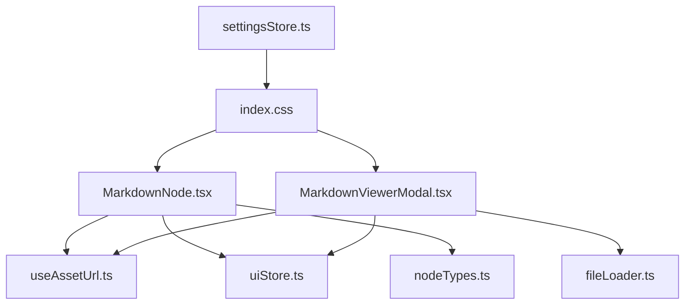
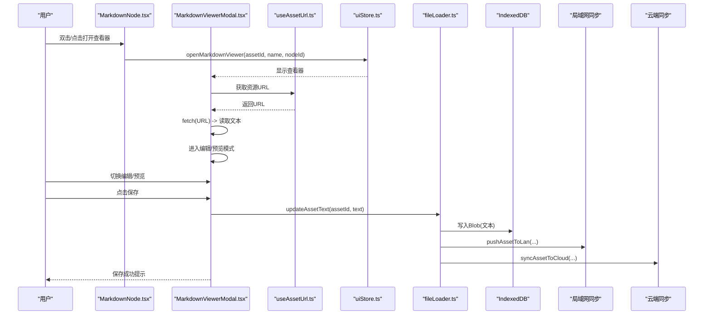
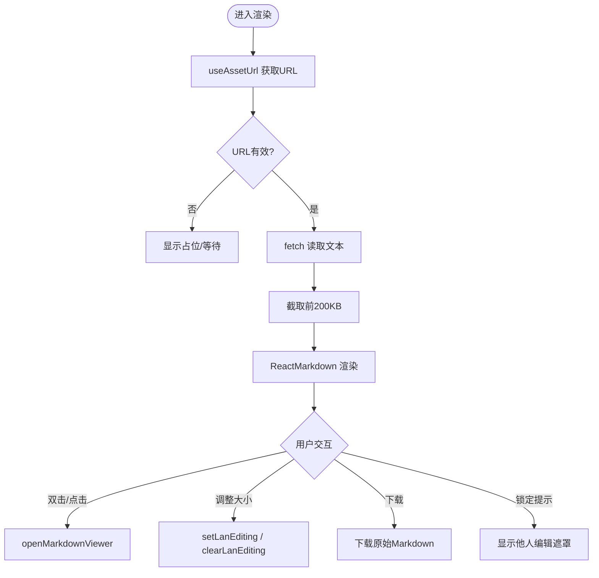
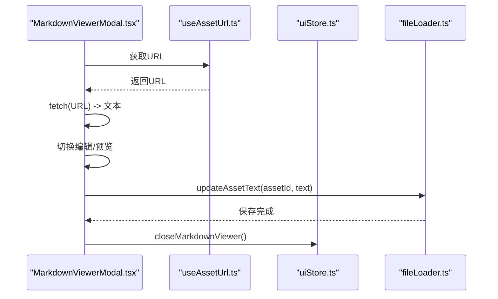
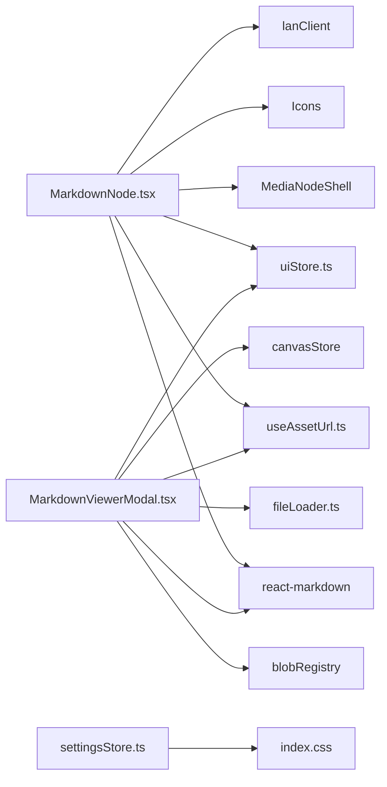

# Markdown 节点

<cite>
**本文引用的文件**
- [MarkdownNode.tsx](file://src/canvas/nodes/MarkdownNode.tsx)
- [MarkdownViewerModal.tsx](file://src/components/MarkdownViewerModal.tsx)
- [nodeTypes.ts](file://src/canvas/nodes/nodeTypes.ts)
- [useAssetUrl.ts](file://src/media/useAssetUrl.ts)
- [fileLoader.ts](file://src/io/fileLoader.ts)
- [uiStore.ts](file://src/store/uiStore.ts)
- [index.css](file://src/index.css)
- [settingsStore.ts](file://src/store/settingsStore.ts)
- [README.md](file://README.md)
</cite>

## 目录
1. [简介](#简介)
2. [项目结构](#项目结构)
3. [核心组件](#核心组件)
4. [架构总览](#架构总览)
5. [详细组件分析](#详细组件分析)
6. [依赖关系分析](#依赖关系分析)
7. [性能与容量](#性能与容量)
8. [故障排查](#故障排查)
9. [结论](#结论)
10. [附录：使用示例与扩展指南](#附录使用示例与扩展指南)

## 简介
本章节面向“Markdown 节点”的使用与实现说明。该节点用于在画布中展示、编辑和导出 Markdown 内容，支持即时渲染、在线协作锁定、本地持久化与云端同步，并提供主题化的样式输出。

- 功能要点
  - 在画布中以缩略形式预览 Markdown 内容
  - 双击或点击按钮打开全屏查看器进行编辑与预览切换
  - 保存时更新本地 IndexedDB，并可选同步到局域网与云端
  - 通过 CSS 变量实现深色/浅色主题适配
  - 基于 react-markdown 渲染标准 Markdown（标题、列表、代码块、表格等）

**章节来源**
- [README.md:12-14](file://README.md#L12-L14)

## 项目结构
Markdown 节点相关代码主要分布在以下位置：
- 画布节点渲染：src/canvas/nodes/MarkdownNode.tsx
- 查看与编辑器：src/components/MarkdownViewerModal.tsx
- 资源 URL 获取：src/media/useAssetUrl.ts
- 文本资源更新与导入：src/io/fileLoader.ts
- UI 状态（查看器开关）：src/store/uiStore.ts
- 样式与主题：src/index.css、src/store/settingsStore.ts
- 节点类型注册：src/canvas/nodes/nodeTypes.ts

**图表来源**
- [MarkdownNode.tsx:1-105](file://src/canvas/nodes/MarkdownNode.tsx#L1-L105)
- [MarkdownViewerModal.tsx:1-116](file://src/components/MarkdownViewerModal.tsx#L1-L116)
- [useAssetUrl.ts:1-157](file://src/media/useAssetUrl.ts#L1-L157)
- [fileLoader.ts:1-297](file://src/io/fileLoader.ts#L1-L297)
- [uiStore.ts:1-121](file://src/store/uiStore.ts#L1-L121)
- [index.css:50-249](file://src/index.css#L50-L249)
- [settingsStore.ts:1-39](file://src/store/settingsStore.ts#L1-L39)
- [nodeTypes.ts:1-27](file://src/canvas/nodes/nodeTypes.ts#L1-L27)

**章节来源**
- [MarkdownNode.tsx:1-105](file://src/canvas/nodes/MarkdownNode.tsx#L1-L105)
- [MarkdownViewerModal.tsx:1-116](file://src/components/MarkdownViewerModal.tsx#L1-L116)
- [useAssetUrl.ts:1-157](file://src/media/useAssetUrl.ts#L1-L157)
- [fileLoader.ts:1-297](file://src/io/fileLoader.ts#L1-L297)
- [uiStore.ts:1-121](file://src/store/uiStore.ts#L1-L121)
- [index.css:50-249](file://src/index.css#L50-L249)
- [settingsStore.ts:1-39](file://src/store/settingsStore.ts#L1-L39)
- [nodeTypes.ts:1-27](file://src/canvas/nodes/nodeTypes.ts#L1-L27)

## 核心组件
- MarkdownNode：画布中的 Markdown 节点，负责加载资源、渲染预览、打开查看器、下载与协作锁定提示。
- MarkdownViewerModal：全屏查看器，提供编辑模式与预览模式切换、保存、下载等操作。
- useAssetUrl：统一获取资源 URL，包含重试机制，确保在网络波动或局域网传输中稳定加载。
- fileLoader.updateAssetText：将编辑后的文本写回 IndexedDB，并触发局域网/云端同步。
- uiStore：管理查看器的打开/关闭状态以及全局 Toast 提示。
- index.css：定义 .sq-markdown 的排版样式，并通过 CSS 变量适配主题。
- settingsStore：控制应用主题（深色/浅色），影响 Markdown 渲染外观。

**章节来源**
- [MarkdownNode.tsx:12-105](file://src/canvas/nodes/MarkdownNode.tsx#L12-L105)
- [MarkdownViewerModal.tsx:11-116](file://src/components/MarkdownViewerModal.tsx#L11-L116)
- [useAssetUrl.ts:10-44](file://src/media/useAssetUrl.ts#L10-L44)
- [fileLoader.ts:119-135](file://src/io/fileLoader.ts#L119-L135)
- [uiStore.ts:34-96](file://src/store/uiStore.ts#L34-L96)
- [index.css:518-557](file://src/index.css#L518-L557)
- [settingsStore.ts:13-39](file://src/store/settingsStore.ts#L13-L39)

## 架构总览
下图展示了 Markdown 节点从加载、渲染到编辑保存的完整流程，包括资源获取、查看器交互、存储与同步。

**图表来源**
- [MarkdownNode.tsx:20-27](file://src/canvas/nodes/MarkdownNode.tsx#L20-L27)
- [MarkdownViewerModal.tsx:21-58](file://src/components/MarkdownViewerModal.tsx#L21-L58)
- [useAssetUrl.ts:14-44](file://src/media/useAssetUrl.ts#L14-L44)
- [fileLoader.ts:119-135](file://src/io/fileLoader.ts#L119-L135)
- [uiStore.ts:90-96](file://src/store/uiStore.ts#L90-L96)

## 详细组件分析

### MarkdownNode（画布节点）
- 功能职责
  - 通过 useAssetUrl 获取资源 URL，fetch 文本并限制最大长度，避免大文件阻塞渲染
  - 使用 ReactMarkdown 渲染预览内容
  - 提供 NodeResizer 调整大小，并在开始/结束时设置/清除局域网编辑锁定
  - 双击或点击按钮打开 MarkdownViewerModal
  - 提供下载链接直接下载原始 Markdown
  - 当检测到其他用户正在编辑时，显示“正在操作”遮罩与提示
- 关键行为
  - 加载失败时通过 toast 提示错误
  - 未选中或未锁定时显示尺寸手柄
  - 名称默认取自节点 label，否则为“Markdown”

**图表来源**
- [MarkdownNode.tsx:29-43](file://src/canvas/nodes/MarkdownNode.tsx#L29-L43)
- [MarkdownNode.tsx:47-55](file://src/canvas/nodes/MarkdownNode.tsx#L47-L55)
- [MarkdownNode.tsx:57-99](file://src/canvas/nodes/MarkdownNode.tsx#L57-L99)

**章节来源**
- [MarkdownNode.tsx:12-105](file://src/canvas/nodes/MarkdownNode.tsx#L12-L105)

### MarkdownViewerModal（查看器与编辑器）
- 功能职责
  - 根据 uiStore 中的 markdownViewer 状态显示查看器
  - 自动拉取资源文本，进入编辑或预览模式
  - 编辑模式下提供 textarea，支持实时输入与长度限制
  - 保存时调用 updateAssetText 更新 IndexedDB，并触发局域网/云端同步
  - 提供下载按钮直接下载当前 Markdown
  - 打开时设置局域网编辑锁定，关闭时清理
- 关键行为
  - 保存过程中禁用按钮并显示“保存中”
  - 保存成功后刷新资产版本以触发重新加载
  - 保存失败时通过 toast 提示错误

**图表来源**
- [MarkdownViewerModal.tsx:21-58](file://src/components/MarkdownViewerModal.tsx#L21-L58)
- [MarkdownViewerModal.tsx:60-116](file://src/components/MarkdownViewerModal.tsx#L60-L116)
- [useAssetUrl.ts:14-44](file://src/media/useAssetUrl.ts#L14-L44)
- [fileLoader.ts:119-135](file://src/io/fileLoader.ts#L119-L135)

**章节来源**
- [MarkdownViewerModal.tsx:11-116](file://src/components/MarkdownViewerModal.tsx#L11-L116)

### 资源与存储
- 资源 URL 获取
  - useAssetUrl 封装了重试逻辑，适合局域网传输或网络不稳定场景
  - 支持传入 assetId 与 version 以触发重新加载
- 文本资源更新
  - updateAssetText 将文本转为 Blob 写入 IndexedDB，并触发局域网与云端同步
  - 同步失败不影响主流程，仅记录警告或提示

**章节来源**
- [useAssetUrl.ts:10-44](file://src/media/useAssetUrl.ts#L10-L44)
- [fileLoader.ts:119-135](file://src/io/fileLoader.ts#L119-L135)

### 样式与主题
- Markdown 样式
  - 通过 .sq-markdown 类名对标题、链接、引用、表格、代码块等进行统一样式控制
  - 表格边框、内边距、字体大小等均有明确规则
- 主题切换
  - 通过 settingsStore 切换 html 根节点的 light 类，配合 CSS 变量实现主题切换
  - 深色/浅色主题下，Markdown 文本、链接、边框颜色均会变化

**章节来源**
- [index.css:518-557](file://src/index.css#L518-L557)
- [index.css:50-121](file://src/index.css#L50-L121)
- [settingsStore.ts:13-39](file://src/store/settingsStore.ts#L13-L39)

### 节点类型注册
- nodeTypes 中将 markdown 类型映射到 MarkdownNode，使画布可识别并渲染该节点

**章节来源**
- [nodeTypes.ts:14-26](file://src/canvas/nodes/nodeTypes.ts#L14-L26)

## 依赖关系分析
- MarkdownNode 依赖
  - @xyflow/react：NodeResizer、NodeProps
  - react-markdown：Markdown 渲染
  - useAssetUrl：资源 URL 获取
  - uiStore：打开查看器、Toast
  - MediaNodeShell：节点外壳
  - Icons：图标
  - lanClient：协作锁定
- MarkdownViewerModal 依赖
  - react-markdown：预览渲染
  - useAssetUrl：资源 URL 获取
  - blobRegistry：失效资产 URL
  - fileLoader：更新文本
  - lanClient：协作锁定
  - uiStore：查看器状态、Toast
  - canvasStore：更新节点数据
- 样式依赖
  - index.css：.sq-markdown 样式与主题变量
  - settingsStore：主题切换

**图表来源**
- [MarkdownNode.tsx:1-105](file://src/canvas/nodes/MarkdownNode.tsx#L1-L105)
- [MarkdownViewerModal.tsx:1-116](file://src/components/MarkdownViewerModal.tsx#L1-L116)
- [useAssetUrl.ts:1-157](file://src/media/useAssetUrl.ts#L1-L157)
- [fileLoader.ts:1-297](file://src/io/fileLoader.ts#L1-L297)
- [uiStore.ts:1-121](file://src/store/uiStore.ts#L1-L121)
- [index.css:50-249](file://src/index.css#L50-L249)
- [settingsStore.ts:1-39](file://src/store/settingsStore.ts#L1-L39)

**章节来源**
- [MarkdownNode.tsx:1-105](file://src/canvas/nodes/MarkdownNode.tsx#L1-L105)
- [MarkdownViewerModal.tsx:1-116](file://src/components/MarkdownViewerModal.tsx#L1-L116)
- [useAssetUrl.ts:1-157](file://src/media/useAssetUrl.ts#L1-L157)
- [fileLoader.ts:1-297](file://src/io/fileLoader.ts#L1-L297)
- [uiStore.ts:1-121](file://src/store/uiStore.ts#L1-L121)
- [index.css:50-249](file://src/index.css#L50-L249)
- [settingsStore.ts:1-39](file://src/store/settingsStore.ts#L1-L39)

## 性能与容量
- 内容长度限制
  - 节点与查看器均对加载的 Markdown 文本进行截取（约 200KB），防止超大文件导致渲染卡顿
- 资源加载策略
  - useAssetUrl 内置重试机制，适应局域网传输延迟或临时不可用
- 渲染优化
  - 使用 memo 包裹 MarkdownNode，减少不必要的重渲染
  - 查看器仅在需要时加载文本，避免首屏负担
- 建议
  - 保持 Markdown 文件大小合理，必要时拆分文档
  - 在大团队协作时注意并发编辑冲突，利用锁定提示避免覆盖

**章节来源**
- [MarkdownNode.tsx:29-43](file://src/canvas/nodes/MarkdownNode.tsx#L29-L43)
- [MarkdownViewerModal.tsx:21-33](file://src/components/MarkdownViewerModal.tsx#L21-L33)
- [useAssetUrl.ts:14-44](file://src/media/useAssetUrl.ts#L14-L44)

## 故障排查
- 加载失败
  - 现象：toast 提示“Markdown 加载失败”
  - 可能原因：资源 URL 无效、网络异常、局域网传输未完成
  - 处理：检查 useAssetUrl 重试是否生效；确认资产已上传至本地/云端
- 保存失败
  - 现象：toast 提示“Markdown 保存失败”
  - 可能原因：IndexedDB 写入失败、同步服务不可用
  - 处理：检查浏览器存储权限；确认局域网/云端同步配置正确
- 协作冲突
  - 现象：打开查看器时提示“X 正在操作此元素”
  - 处理：等待对方结束编辑或使用查看器右上角关闭后重试

**章节来源**
- [MarkdownNode.tsx:20-27](file://src/canvas/nodes/MarkdownNode.tsx#L20-L27)
- [MarkdownViewerModal.tsx:43-58](file://src/components/MarkdownViewerModal.tsx#L43-L58)
- [useAssetUrl.ts:26-35](file://src/media/useAssetUrl.ts#L26-L35)

## 结论
Markdown 节点提供了完整的 Markdown 内容在画布中的展示、编辑与导出能力。其通过统一的资源获取、本地持久化与多端同步机制，结合主题化样式，实现了良好的用户体验与可扩展性。对于复杂文档，建议控制文件大小并利用查看器进行编辑，以获得最佳性能与稳定性。

## 附录：使用示例与扩展指南

### 基本使用
- 插入 Markdown 节点
  - 通过工具栏或拖拽方式添加 Markdown 节点，节点类型由 nodeTypes 注册
- 编辑与预览
  - 双击节点或点击“查看 Markdown”按钮打开查看器
  - 在查看器中切换“编辑/预览”，修改后点击“保存”
- 下载
  - 在节点或查看器中点击“下载 Markdown”即可导出原始文本

**章节来源**
- [nodeTypes.ts:14-26](file://src/canvas/nodes/nodeTypes.ts#L14-L26)
- [MarkdownNode.tsx:57-99](file://src/canvas/nodes/MarkdownNode.tsx#L57-L99)
- [MarkdownViewerModal.tsx:60-116](file://src/components/MarkdownViewerModal.tsx#L60-L116)

### 支持的 Markdown 语法与渲染效果
- 标题、段落、加粗、斜体、链接、图片
- 列表（有序/无序）
- 代码块与行内代码
- 引用块
- 表格
- 分割线
- 说明：以上元素由 react-markdown 解析并以 .sq-markdown 样式呈现，具体样式见 index.css

**章节来源**
- [index.css:518-557](file://src/index.css#L518-L557)

### 存储格式、版本管理与同步机制
- 存储格式
  - Markdown 文本以 Blob 形式存储在 IndexedDB 的 assets 表中，mime 类型为 text/markdown
- 版本管理
  - 每次保存后更新 assetUpdatedAt 时间戳，触发资源 URL 失效与重新加载
- 同步机制
  - 保存后优先推送到局域网（如连接），再尝试同步到云端（如配置）
  - 同步失败不影响本地保存，仅记录错误或提示

**章节来源**
- [fileLoader.ts:119-135](file://src/io/fileLoader.ts#L119-L135)
- [MarkdownViewerModal.tsx:43-58](file://src/components/MarkdownViewerModal.tsx#L43-L58)

### 自定义样式与主题配置
- 主题切换
  - 通过 settingsStore 切换 theme，应用会在 html 根节点添加/移除 light 类
  - 主题变量在 index.css 中定义，影响 Markdown 文本、链接、边框等颜色
- 自定义样式
  - 可通过覆盖 .sq-markdown 下的子元素样式实现定制（如表格、代码块、引用块）
  - 建议使用 CSS 变量以保持与主题一致

**章节来源**
- [settingsStore.ts:13-39](file://src/store/settingsStore.ts#L13-L39)
- [index.css:50-121](file://src/index.css#L50-L121)
- [index.css:518-557](file://src/index.css#L518-L557)

### 扩展语法开发指南
- 当前实现使用 react-markdown 默认解析器，未引入额外插件
- 如需扩展语法（如数学公式、任务列表、脚注等），可在 MarkdownViewerModal 与 MarkdownNode 中引入相应 remark/rehype 插件并进行配置
- 注意：扩展插件需与 react-markdown 版本兼容，并确保样式与主题一致

**章节来源**
- [MarkdownNode.tsx:3](file://src/canvas/nodes/MarkdownNode.tsx#L3)
- [MarkdownViewerModal.tsx:2](file://src/components/MarkdownViewerModal.tsx#L2)