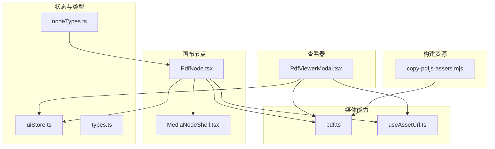
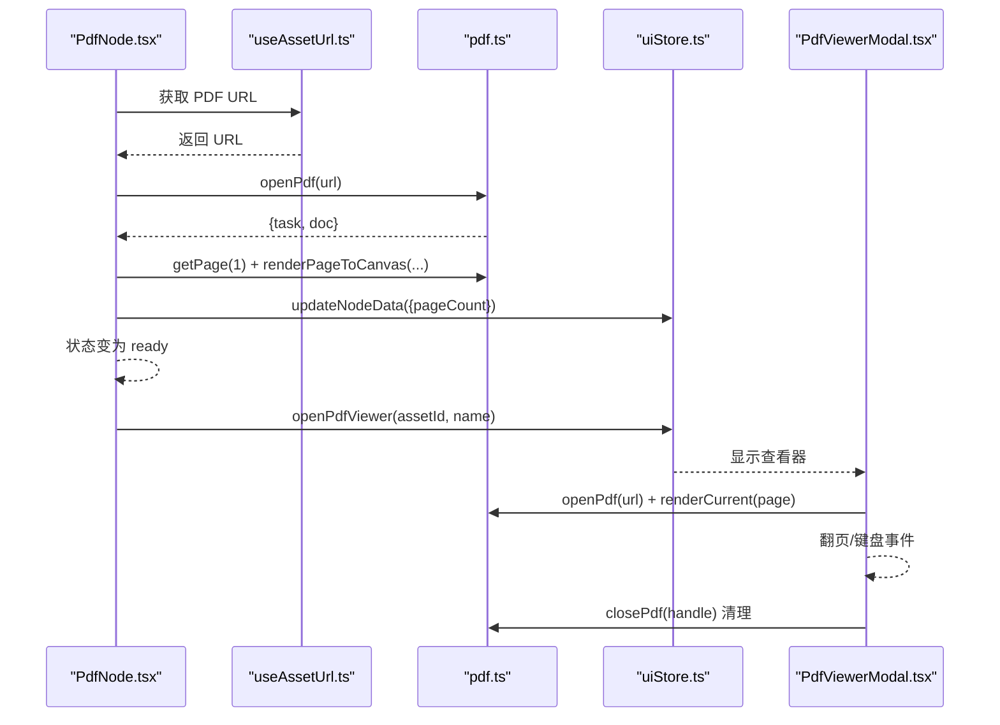
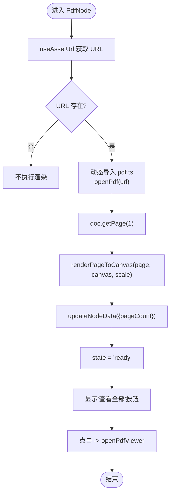
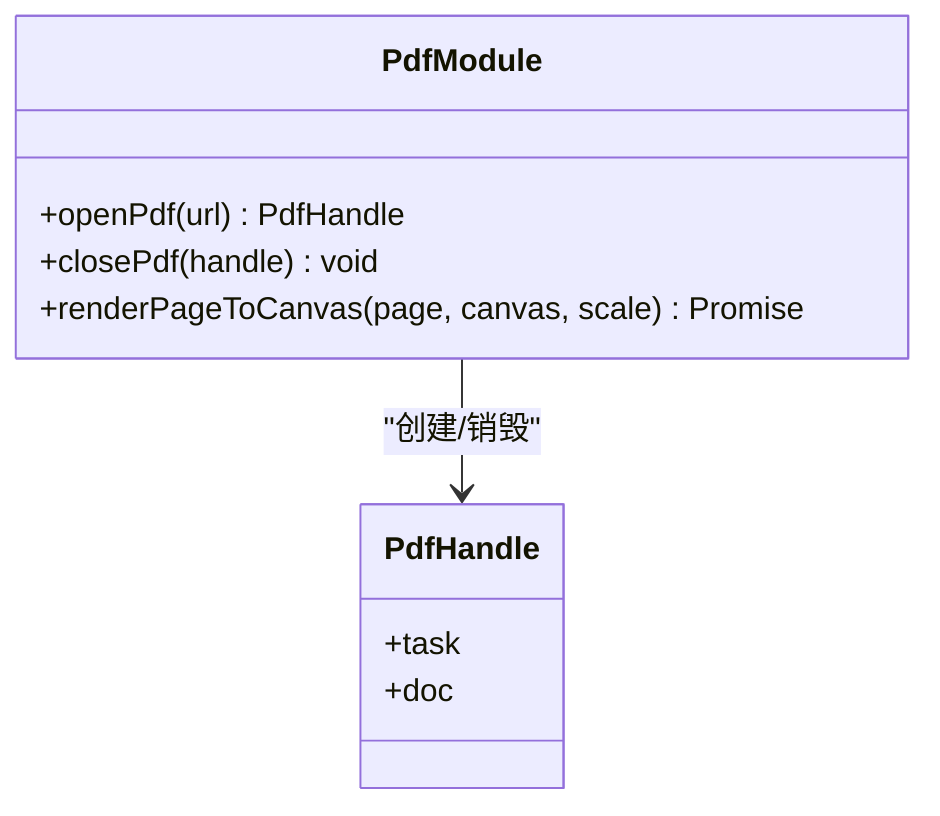
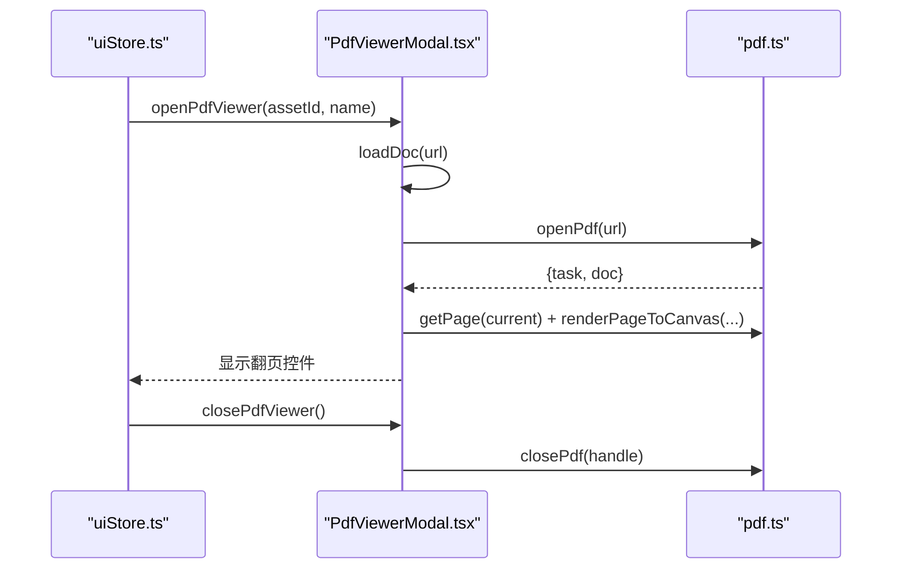
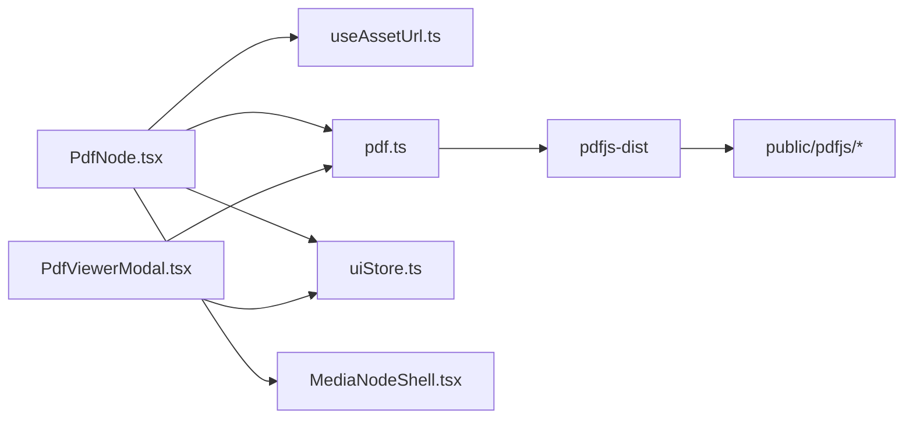

# PDF 节点

<cite>
**本文引用的文件**
- [PdfNode.tsx](file://src/canvas/nodes/PdfNode.tsx)
- [pdf.ts](file://src/media/pdf.ts)
- [PdfViewerModal.tsx](file://src/components/PdfViewerModal.tsx)
- [nodeTypes.ts](file://src/canvas/nodes/nodeTypes.ts)
- [useAssetUrl.ts](file://src/media/useAssetUrl.ts)
- [uiStore.ts](file://src/store/uiStore.ts)
- [types.ts](file://src/types.ts)
- [MediaNodeShell.tsx](file://src/canvas/nodes/MediaNodeShell.tsx)
- [copy-pdfjs-assets.mjs](file://scripts/copy-pdfjs-assets.mjs)
</cite>

## 目录
1. [简介](#简介)
2. [项目结构](#项目结构)
3. [核心组件](#核心组件)
4. [架构总览](#架构总览)
5. [详细组件分析](#详细组件分析)
6. [依赖关系分析](#依赖关系分析)
7. [性能与内存管理](#性能与内存管理)
8. [故障排查指南](#故障排查指南)
9. [结论](#结论)
10. [附录：使用示例与最佳实践](#附录使用示例与最佳实践)

## 简介
本文件面向 SuQCanvas 中的 PDF 节点能力，系统性说明 PdfNode 组件的实现原理、PDF 动态加载与渲染流程、页面缩放与视口策略、状态管理与用户交互（预览与全屏查看），以及大文件处理、错误处理和资源清理的最佳实践。该功能基于 pdfjs-dist 进行解析与 Canvas 渲染，并通过统一的资源 URL 获取与 UI 状态管理完成端到端体验。

## 项目结构
围绕 PDF 节点的关键文件组织如下：
- 画布节点层：PdfNode.tsx 负责在画布中渲染 PDF 第一页缩略图，并提供“查看全部”入口。
- 媒体抽象层：pdf.ts 封装 pdfjs-dist 的打开、关闭与页面渲染；useAssetUrl.ts 提供带重试的资源 URL 获取。
- 查看器层：PdfViewerModal.tsx 实现全屏 PDF 阅读器，支持翻页、键盘导航与错误提示。
- 类型与注册：types.ts 定义节点数据字段（含 pageCount）；nodeTypes.ts 将 PdfNode 注册为媒体节点类型之一。
- 通用外壳：MediaNodeShell.tsx 提供节点边框、连接手柄、底部信息栏等统一外观与交互。
- 构建脚本：copy-pdfjs-assets.mjs 将 pdfjs-dist 所需的 cmaps/standard_fonts/wasm 复制到 public/pdfjs，供运行时加载。

图表来源
- [PdfNode.tsx:1-90](file://src/canvas/nodes/PdfNode.tsx#L1-L90)
- [pdf.ts:1-50](file://src/media/pdf.ts#L1-L50)
- [PdfViewerModal.tsx:1-146](file://src/components/PdfViewerModal.tsx#L1-L146)
- [useAssetUrl.ts:1-157](file://src/media/useAssetUrl.ts#L1-L157)
- [uiStore.ts:1-121](file://src/store/uiStore.ts#L1-L121)
- [types.ts:66-106](file://src/types.ts#L66-L106)
- [nodeTypes.ts:1-27](file://src/canvas/nodes/nodeTypes.ts#L1-L27)
- [copy-pdfjs-assets.mjs:1-20](file://scripts/copy-pdfjs-assets.mjs#L1-L20)

章节来源
- [PdfNode.tsx:1-90](file://src/canvas/nodes/PdfNode.tsx#L1-L90)
- [pdf.ts:1-50](file://src/media/pdf.ts#L1-L50)
- [PdfViewerModal.tsx:1-146](file://src/components/PdfViewerModal.tsx#L1-L146)
- [useAssetUrl.ts:1-157](file://src/media/useAssetUrl.ts#L1-L157)
- [uiStore.ts:1-121](file://src/store/uiStore.ts#L1-L121)
- [types.ts:66-106](file://src/types.ts#L66-L106)
- [nodeTypes.ts:1-27](file://src/canvas/nodes/nodeTypes.ts#L1-L27)
- [copy-pdfjs-assets.mjs:1-20](file://scripts/copy-pdfjs-assets.mjs#L1-L20)

## 核心组件
- PdfNode：在画布中异步加载 PDF，渲染第一页到 Canvas，维护 loading/ready/error 状态，并暴露“查看全部”按钮。
- pdf.ts：封装 pdfjs-dist 的文档打开、关闭与页面渲染，配置 worker、cMap、标准字体与 wasm 路径，处理高 DPI 渲染。
- PdfViewerModal：全屏 PDF 阅读器，支持翻页、键盘操作、错误提示与资源清理。
- useAssetUrl：提供带重试机制的静态资源 URL 获取，适配局域网传输场景。
- uiStore：集中管理 PDF 查看器的开关与参数。
- types：定义 SuqNodeData 包含 pageCount 等字段。
- MediaNodeShell：提供节点外壳、连接点、底部信息栏与协作锁定提示。
- copy-pdfjs-assets.mjs：构建期复制 pdfjs-dist 运行所需资源到 public/pdfjs。

章节来源
- [PdfNode.tsx:1-90](file://src/canvas/nodes/PdfNode.tsx#L1-L90)
- [pdf.ts:1-50](file://src/media/pdf.ts#L1-L50)
- [PdfViewerModal.tsx:1-146](file://src/components/PdfViewerModal.tsx#L1-L146)
- [useAssetUrl.ts:1-157](file://src/media/useAssetUrl.ts#L1-L157)
- [uiStore.ts:1-121](file://src/store/uiStore.ts#L1-L121)
- [types.ts:66-106](file://src/types.ts#L66-L106)
- [MediaNodeShell.tsx:1-151](file://src/canvas/nodes/MediaNodeShell.tsx#L1-L151)
- [copy-pdfjs-assets.mjs:1-20](file://scripts/copy-pdfjs-assets.mjs#L1-L20)

## 架构总览
PdfNode 通过 useAssetUrl 获取 PDF 的可用 URL，然后动态导入 pdf.ts 打开文档、获取第一页并渲染到 Canvas。渲染完成后更新节点数据中的 pageCount，并将状态切换为 ready。点击“查看全部”会调用 uiStore.openPdfViewer 打开 PdfViewerModal，后者再次动态导入 pdf.ts 加载文档并渲染当前页，支持翻页与键盘控制。所有 PDF 任务在卸载或关闭时都会显式释放资源。

图表来源
- [PdfNode.tsx:19-62](file://src/canvas/nodes/PdfNode.tsx#L19-L62)
- [pdf.ts:23-49](file://src/media/pdf.ts#L23-L49)
- [PdfViewerModal.tsx:24-83](file://src/components/PdfViewerModal.tsx#L24-L83)
- [uiStore.ts:69-75](file://src/store/uiStore.ts#L69-L75)

## 详细组件分析

### PdfNode 组件
- 职责
  - 根据 assetId 获取资源 URL。
  - 动态加载 pdf.ts，打开 PDF 并渲染第一页到 Canvas。
  - 同步节点数据中的 pageCount。
  - 管理 loading/ready/error 三种状态。
  - 提供“查看全部”按钮，触发全屏查看器。
- 关键点
  - 使用 useEffect 包裹异步流程，内部用 cancelled 标志避免卸载后继续执行。
  - 渲染前计算 base viewport，按目标宽度换算 scale，确保缩略图尺寸合适。
  - 清理阶段调用 page.cleanup() 与 closePdf(handle)。
- 交互
  - 悬停/选中时由 MediaNodeShell 提供边框与连接点。
  - 底部按钮仅在 ready 态显示，点击调用 openPdfViewer。

图表来源
- [PdfNode.tsx:19-62](file://src/canvas/nodes/PdfNode.tsx#L19-L62)
- [pdf.ts:23-49](file://src/media/pdf.ts#L23-L49)

章节来源
- [PdfNode.tsx:1-90](file://src/canvas/nodes/PdfNode.tsx#L1-L90)
- [MediaNodeShell.tsx:1-151](file://src/canvas/nodes/MediaNodeShell.tsx#L1-L151)

### pdf.ts 模块
- 职责
  - 配置 pdfjs-dist 的 workerSrc、cMapUrl、standardFontDataUrl、wasmUrl。
  - 提供 openPdf/closePdf 生命周期管理。
  - 提供 renderPageToCanvas，处理高 DPI 渲染与视口变换。
- 关键点
  - 通过 import.meta.env.BASE_URL + 'pdfjs/' 定位资源目录，需构建期复制资源。
  - renderPageToCanvas 根据 devicePixelRatio 设置 canvas 宽高，并在 transform 中应用缩放。
  - closePdf 检查 task.destroyed 后再销毁，避免重复销毁。

图表来源
- [pdf.ts:1-50](file://src/media/pdf.ts#L1-L50)

章节来源
- [pdf.ts:1-50](file://src/media/pdf.ts#L1-L50)

### PdfViewerModal 查看器
- 职责
  - 全屏展示 PDF，支持上一页/下一页、键盘左右键、Esc 关闭。
  - 动态导入 pdf.ts 打开文档，渲染当前页到 Canvas。
  - 错误时通过 toast 提示。
  - 关闭时清理 page 与 handle。
- 关键点
  - 使用 useCallback 缓存 loadDoc/renderCurrent，减少重渲染。
  - 渲染 scale 取 min(2, 900/base.width)，限制最大缩放与宽度，平衡清晰度与性能。
  - 监听键盘事件，绑定翻页与关闭逻辑。

图表来源
- [PdfViewerModal.tsx:24-94](file://src/components/PdfViewerModal.tsx#L24-L94)
- [pdf.ts:23-49](file://src/media/pdf.ts#L23-L49)
- [uiStore.ts:69-75](file://src/store/uiStore.ts#L69-L75)

章节来源
- [PdfViewerModal.tsx:1-146](file://src/components/PdfViewerModal.tsx#L1-L146)
- [uiStore.ts:1-121](file://src/store/uiStore.ts#L1-L121)

### 资源 URL 与构建资源
- useAssetUrl：对 getAssetUrl 的结果进行最多 5 次重试，间隔 1200ms，用于应对局域网传输延迟。失败时弹出 toast。
- copy-pdfjs-assets.mjs：构建时将 pdfjs-dist 的 cmaps、standard_fonts、wasm 复制到 public/pdfjs，供运行时 BASE_URL + 'pdfjs/' 访问。

章节来源
- [useAssetUrl.ts:1-157](file://src/media/useAssetUrl.ts#L1-L157)
- [copy-pdfjs-assets.mjs:1-20](file://scripts/copy-pdfjs-assets.mjs#L1-L20)

### 类型与注册
- types.ts：SuqNodeData 包含 pageCount 字段，用于记录 PDF 页数。
- nodeTypes.ts：将 PdfNode 注册为 mediaNodeTypes 中的 pdf 类型，使画布可识别并渲染 PDF 节点。

章节来源
- [types.ts:66-106](file://src/types.ts#L66-L106)
- [nodeTypes.ts:1-27](file://src/canvas/nodes/nodeTypes.ts#L1-L27)

## 依赖关系分析
- PdfNode 依赖 useAssetUrl 获取 URL，依赖 pdf.ts 进行 PDF 打开与渲染，依赖 uiStore 打开查看器，依赖 MediaNodeShell 提供外壳。
- PdfViewerModal 依赖 uiStore 控制显示与关闭，依赖 pdf.ts 渲染页面。
- pdf.ts 依赖 pdfjs-dist 及构建期复制的资源目录。
- 所有 PDF 相关模块均遵循“动态导入”策略，降低首屏体积。

图表来源
- [PdfNode.tsx:1-90](file://src/canvas/nodes/PdfNode.tsx#L1-L90)
- [PdfViewerModal.tsx:1-146](file://src/components/PdfViewerModal.tsx#L1-L146)
- [pdf.ts:1-50](file://src/media/pdf.ts#L1-L50)
- [copy-pdfjs-assets.mjs:1-20](file://scripts/copy-pdfjs-assets.mjs#L1-L20)

章节来源
- [PdfNode.tsx:1-90](file://src/canvas/nodes/PdfNode.tsx#L1-L90)
- [PdfViewerModal.tsx:1-146](file://src/components/PdfViewerModal.tsx#L1-L146)
- [pdf.ts:1-50](file://src/media/pdf.ts#L1-L50)
- [copy-pdfjs-assets.mjs:1-20](file://scripts/copy-pdfjs-assets.mjs#L1-L20)

## 性能与内存管理
- 动态导入：PdfNode 与 PdfViewerModal 均在需要时才动态导入 pdf.ts，减少初始包体。
- 视口与缩放：
  - 节点内缩略图：以 base width 为基准，按目标宽度计算 scale，保证缩略图清晰且不过度放大。
  - 查看器：scale 上限为 2，并按 900px 宽度限制，避免超大页面导致卡顿。
- 高 DPI 渲染：renderPageToCanvas 根据 devicePixelRatio 设置 canvas 像素尺寸，并使用 transform 提升清晰度。
- 资源清理：
  - 每个页面渲染后调用 page.cleanup()。
  - 组件卸载或查看器关闭时调用 closePdf(handle) 销毁任务。
  - 使用 cancelled 标志防止卸载后继续执行异步流程。
- 资源可用性：构建期复制 cmaps/standard_fonts/wasm 到 public/pdfjs，避免运行时缺失导致的 CJK 字体或图片解码错误。

章节来源
- [PdfNode.tsx:19-62](file://src/canvas/nodes/PdfNode.tsx#L19-L62)
- [PdfViewerModal.tsx:58-94](file://src/components/PdfViewerModal.tsx#L58-L94)
- [pdf.ts:35-49](file://src/media/pdf.ts#L35-L49)
- [copy-pdfjs-assets.mjs:1-20](file://scripts/copy-pdfjs-assets.mjs#L1-L20)

## 故障排查指南
- PDF 无法打开
  - 确认构建脚本已执行，public/pdfjs 下存在 cmaps、standard_fonts、wasm 目录。
  - 检查 BASE_URL 是否正确拼接至 pdfjs 资源路径。
  - 查看控制台错误日志，常见于字体或图片解码缺失。
- 资源加载失败
  - useAssetUrl 会在局域网传输未完成时重试多次，若最终失败会弹出 toast。
  - 确认网络连通性与资源服务正常。
- 渲染异常
  - 检查页面索引是否越界（查看器翻页边界）。
  - 确认 canvas 引用存在且未被移除。
- 内存泄漏风险
  - 确保组件卸载时调用 page.cleanup() 与 closePdf(handle)。
  - 避免重复打开多个 PDF 实例而不关闭。

章节来源
- [useAssetUrl.ts:14-44](file://src/media/useAssetUrl.ts#L14-L44)
- [PdfViewerModal.tsx:41-56](file://src/components/PdfViewerModal.tsx#L41-L56)
- [pdf.ts:29-33](file://src/media/pdf.ts#L29-L33)

## 结论
PdfNode 通过模块化与动态导入的方式，结合 pdfjs-dist 实现了高效的 PDF 缩略图渲染与全屏查看能力。其状态管理清晰、资源清理完善，并在构建期补齐了必要的运行时资源。配合 useAssetUrl 的重试机制与 uiStore 的统一状态管理，整体具备良好的鲁棒性与可扩展性。对于大文件与复杂 PDF，建议关注缩放上限、页面清理与资源可用性，以获得更稳定的用户体验。

## 附录：使用示例与最佳实践

### 属性配置
- SuqNodeData.pageCount：记录 PDF 总页数，用于“查看全部”按钮显示页数提示。
- 其他常用字段：assetId、label、width、height、mime 等，用于节点元数据与展示。

章节来源
- [types.ts:66-106](file://src/types.ts#L66-L106)

### 状态管理
- 节点状态：loading/ready/error，分别对应加载中、渲染完成与加载失败。
- 查看器状态：通过 uiStore.pdfViewer 控制显示与关闭。

章节来源
- [PdfNode.tsx:17-53](file://src/canvas/nodes/PdfNode.tsx#L17-L53)
- [uiStore.ts:69-75](file://src/store/uiStore.ts#L69-L75)

### 用户交互
- 节点内“查看全部”：点击后打开 PdfViewerModal。
- 查看器交互：上一页/下一页、键盘左右键翻页、Esc 关闭、点击遮罩关闭。

章节来源
- [PdfNode.tsx:77-85](file://src/canvas/nodes/PdfNode.tsx#L77-L85)
- [PdfViewerModal.tsx:85-94](file://src/components/PdfViewerModal.tsx#L85-L94)

### 完整使用流程
- 导入与预览
  - 将 PDF 文件作为资产上传，生成 assetId。
  - 在画布中添加类型为 pdf 的节点，传入 assetId。
  - 节点自动加载并渲染第一页缩略图，同时更新 pageCount。
- 全屏查看
  - 点击节点内的“查看全部”按钮，打开 PdfViewerModal。
  - 支持翻页与键盘操作，关闭时自动清理资源。

章节来源
- [nodeTypes.ts:14-22](file://src/canvas/nodes/nodeTypes.ts#L14-L22)
- [PdfNode.tsx:19-62](file://src/canvas/nodes/PdfNode.tsx#L19-L62)
- [PdfViewerModal.tsx:24-94](file://src/components/PdfViewerModal.tsx#L24-L94)

### 大文件处理与优化
- 限制缩放上限：查看器中 scale 不超过 2，避免过大页面导致性能问题。
- 合理缩略图缩放：节点内按目标宽度计算 scale，兼顾清晰度与性能。
- 资源清理：每次渲染后清理页面，关闭查看器时销毁任务，防止内存累积。
- 构建期资源准备：确保 public/pdfjs 资源齐全，避免运行时缺失导致的错误。

章节来源
- [PdfViewerModal.tsx:68-72](file://src/components/PdfViewerModal.tsx#L68-L72)
- [PdfNode.tsx:46-49](file://src/canvas/nodes/PdfNode.tsx#L46-L49)
- [pdf.ts:35-49](file://src/media/pdf.ts#L35-L49)
- [copy-pdfjs-assets.mjs:1-20](file://scripts/copy-pdfjs-assets.mjs#L1-L20)