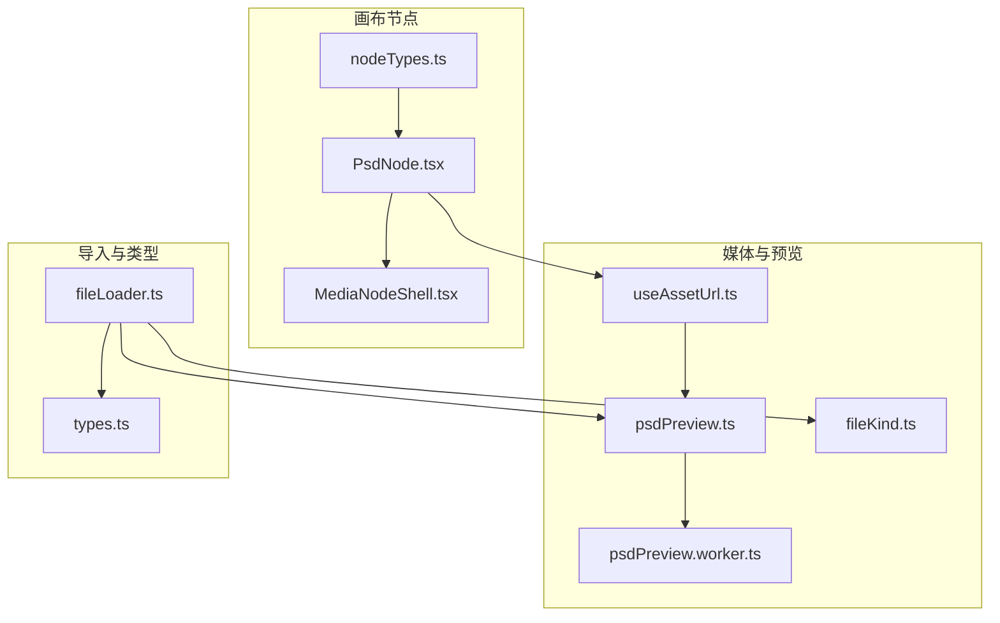
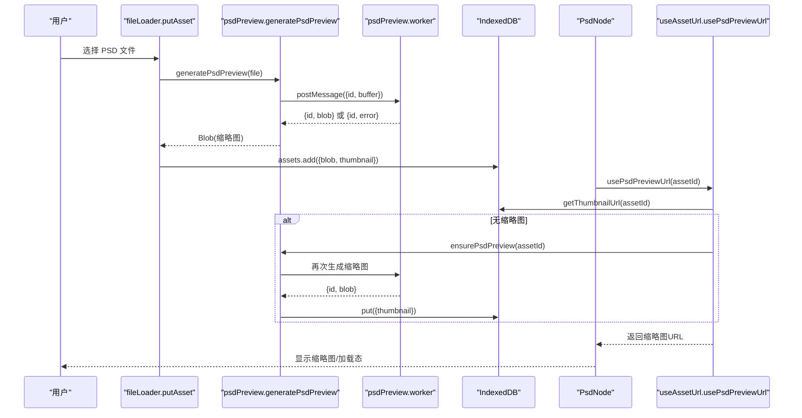
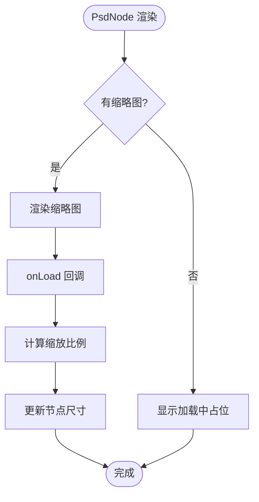
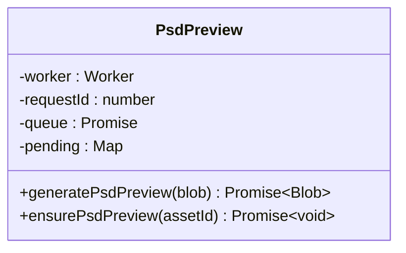
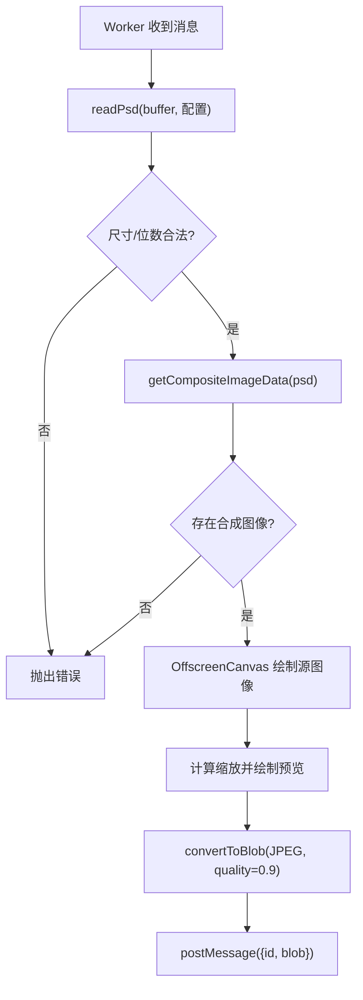
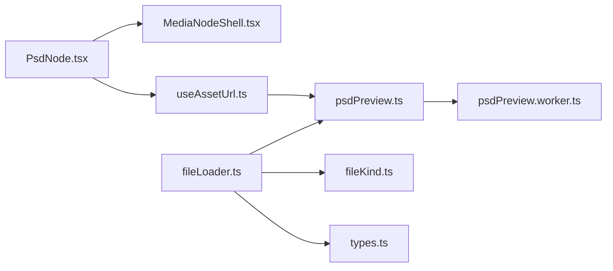

# PSD 节点

<cite>
**本文引用的文件**
- [PsdNode.tsx](file://src/canvas/nodes/PsdNode.tsx)
- [nodeTypes.ts](file://src/canvas/nodes/nodeTypes.ts)
- [MediaNodeShell.tsx](file://src/canvas/nodes/MediaNodeShell.tsx)
- [psdPreview.ts](file://src/media/psdPreview.ts)
- [psdPreview.worker.ts](file://src/media/psdPreview.worker.ts)
- [useAssetUrl.ts](file://src/media/useAssetUrl.ts)
- [fileKind.ts](file://src/media/fileKind.ts)
- [fileLoader.ts](file://src/io/fileLoader.ts)
- [types.ts](file://src/types.ts)
</cite>

## 目录
1. [简介](#简介)
2. [项目结构](#项目结构)
3. [核心组件](#核心组件)
4. [架构总览](#架构总览)
5. [详细组件分析](#详细组件分析)
6. [依赖关系分析](#依赖关系分析)
7. [性能与内存优化](#性能与内存优化)
8. [故障排查指南](#故障排查指南)
9. [使用示例](#使用示例)
10. [结论](#结论)

## 简介
本文件面向实现与使用者，系统性说明 PSD 节点（PsdNode）在画布中的工作机制：从 PSD 文件导入、缩略图生成、预览渲染到编辑交互的完整流程。重点解释 Web Worker 异步处理 PSD 解析与合成图像、内存限制策略、以及前端状态管理与错误处理机制。同时提供大尺寸 PSD 处理、性能调优与兼容性注意事项，帮助在生产环境中稳定高效地使用 PSD 预览能力。

## 项目结构
PSD 相关代码主要分布在以下模块：
- 画布节点层：PsdNode.tsx、MediaNodeShell.tsx、nodeTypes.ts
- 媒体资源层：psdPreview.ts、psdPreview.worker.ts、useAssetUrl.ts、fileKind.ts
- 导入与存储层：fileLoader.ts、types.ts

图表来源
- [PsdNode.tsx:1-125](file://src/canvas/nodes/PsdNode.tsx#L1-L125)
- [MediaNodeShell.tsx:1-151](file://src/canvas/nodes/MediaNodeShell.tsx#L1-L151)
- [nodeTypes.ts:1-27](file://src/canvas/nodes/nodeTypes.ts#L1-L27)
- [psdPreview.ts:1-62](file://src/media/psdPreview.ts#L1-L62)
- [psdPreview.worker.ts:1-82](file://src/media/psdPreview.worker.ts#L1-L82)
- [useAssetUrl.ts:1-157](file://src/media/useAssetUrl.ts#L1-L157)
- [fileKind.ts:1-24](file://src/media/fileKind.ts#L1-L24)
- [fileLoader.ts:1-297](file://src/io/fileLoader.ts#L1-L297)
- [types.ts:1-112](file://src/types.ts#L1-L112)

章节来源
- [PsdNode.tsx:1-125](file://src/canvas/nodes/PsdNode.tsx#L1-L125)
- [nodeTypes.ts:1-27](file://src/canvas/nodes/nodeTypes.ts#L1-L27)
- [MediaNodeShell.tsx:1-151](file://src/canvas/nodes/MediaNodeShell.tsx#L1-L151)
- [psdPreview.ts:1-62](file://src/media/psdPreview.ts#L1-L62)
- [psdPreview.worker.ts:1-82](file://src/media/psdPreview.worker.ts#L1-L82)
- [useAssetUrl.ts:1-157](file://src/media/useAssetUrl.ts#L1-L157)
- [fileKind.ts:1-24](file://src/media/fileKind.ts#L1-L24)
- [fileLoader.ts:1-297](file://src/io/fileLoader.ts#L1-L297)
- [types.ts:1-112](file://src/types.ts#L1-L112)

## 核心组件
- PsdNode：画布上的 PSD 节点 UI，负责展示缩略图、自动适配尺寸、打开预览、下载原文件、协作锁定提示等。
- MediaNodeShell：通用媒体节点外壳，提供边框、连接手柄、底部信息栏、创建者角标、进度遮罩与协作锁定覆盖层。
- psdPreview：主线程侧的 PSD 预览生成器与缓存管理，封装 Web Worker 调用、任务队列、请求 ID 与错误传播。
- psdPreview.worker：Web Worker 中执行 ag-psd 解析、合成图像提取、缩放与编码为 JPEG Blob。
- useAssetUrl：React Hook，负责获取原始资源 URL、缩略图 URL，并在缺失时触发 PSD 预览生成。
- fileKind：文件类型识别，优先将 .psd 识别为 PSD 类型。
- fileLoader：文件导入入口，识别类型、生成缩略图、持久化到 IndexedDB、同步至局域网与云端。
- types：节点数据类型定义，包含 kind、assetId、label、mime 等字段。

章节来源
- [PsdNode.tsx:1-125](file://src/canvas/nodes/PsdNode.tsx#L1-L125)
- [MediaNodeShell.tsx:1-151](file://src/canvas/nodes/MediaNodeShell.tsx#L1-L151)
- [psdPreview.ts:1-62](file://src/media/psdPreview.ts#L1-L62)
- [psdPreview.worker.ts:1-82](file://src/media/psdPreview.worker.ts#L1-L82)
- [useAssetUrl.ts:1-157](file://src/media/useAssetUrl.ts#L1-L157)
- [fileKind.ts:1-24](file://src/media/fileKind.ts#L1-L24)
- [fileLoader.ts:1-297](file://src/io/fileLoader.ts#L1-L297)
- [types.ts:1-112](file://src/types.ts#L1-L112)

## 架构总览
PSD 节点的端到端流程如下：
- 导入阶段：用户选择文件 → fileLoader 识别类型为 psd → 调用 generatePsdPreview 生成缩略图 → 写入 IndexedDB → 可选同步到局域网/云端。
- 渲染阶段：PsdNode 通过 usePsdPreviewUrl 获取缩略图 URL；若不存在则触发 ensurePsdPreview 生成并缓存。
- 预览阶段：双击或点击按钮打开 ImageViewerModal，传入 assetId 与文件名进行全屏预览。
- 异步与并发：所有 PSD 解析在 Web Worker 中进行，主线程仅维护任务队列与消息通道，避免阻塞 UI。

图表来源
- [fileLoader.ts:77-117](file://src/io/fileLoader.ts#L77-L117)
- [psdPreview.ts:34-60](file://src/media/psdPreview.ts#L34-L60)
- [psdPreview.worker.ts:29-81](file://src/media/psdPreview.worker.ts#L29-L81)
- [useAssetUrl.ts:129-156](file://src/media/useAssetUrl.ts#L129-L156)
- [PsdNode.tsx:15-124](file://src/canvas/nodes/PsdNode.tsx#L15-L124)

## 详细组件分析

### PsdNode 组件
- 功能要点
  - 通过 usePsdPreviewUrl 获取缩略图 URL，若无则显示“正在生成 PSD 预览”占位。
  - 图片加载完成后根据自然宽高计算缩放比例，自动设置节点尺寸，限制最大宽高以控制画布占用。
  - 支持 NodeResizer 调整大小，并在开始/结束时更新 LAN 编辑锁状态。
  - 双击或点击按钮打开 ImageViewerModal 进行全屏预览；提供下载原始 PSD 的链接。
  - 协作场景下，若其他用户正在编辑，会阻止操作并提示。
- 关键行为路径
  - 打开预览：openPreview → 校验锁定与预览可用性 → openImageViewer(assetId, filename, true)。
  - 自适应尺寸：onLoad → 计算 scale → onNodesChange 设置 dimensions。
  - 工具栏按钮：打开预览、下载原文件。

图表来源
- [PsdNode.tsx:15-124](file://src/canvas/nodes/PsdNode.tsx#L15-L124)

章节来源
- [PsdNode.tsx:15-124](file://src/canvas/nodes/PsdNode.tsx#L15-L124)
- [MediaNodeShell.tsx:32-151](file://src/canvas/nodes/MediaNodeShell.tsx#L32-L151)
- [nodeTypes.ts:14-26](file://src/canvas/nodes/nodeTypes.ts#L14-L26)

### 媒体外壳 MediaNodeShell
- 提供统一节点外壳：边框、四边连接手柄、底部名称栏、创建者角标、进度遮罩、协作锁定覆盖层。
- 对 PsdNode 而言，它承载内容区域与交互事件，确保选中态、悬停态、协作态的正确表现。

章节来源
- [MediaNodeShell.tsx:1-151](file://src/canvas/nodes/MediaNodeShell.tsx#L1-L151)

### 预览生成器 psdPreview（主线程）
- 职责
  - 管理 Web Worker 生命周期与消息通道。
  - 维护请求队列，串行执行以避免过多并发导致内存峰值过高。
  - 维护 pending 映射，按 id 分发结果或错误。
  - ensurePsdPreview：检查 IndexedDB 是否已有缩略图，若无则生成并写入数据库，随后使缩略图 URL 失效以便刷新。
- 关键数据结构
  - worker：单例 Worker，复用以减少开销。
  - queue：Promise 链式队列，保证任务顺序执行。
  - pending：Map<number, {resolve,reject}>，用于匹配请求与响应。

图表来源
- [psdPreview.ts:10-60](file://src/media/psdPreview.ts#L10-L60)

章节来源
- [psdPreview.ts:1-62](file://src/media/psdPreview.ts#L1-L62)

### 预览 Worker（psdPreview.worker.ts）
- 职责
  - 初始化 ag-psd 所需的 OffscreenCanvas/ImageData 工厂。
  - 接收 ArrayBuffer 并解析 PSD，提取合成图像数据。
  - 校验尺寸与位数限制，防止过大或不受支持的文档。
  - 将合成像素绘制到 OffscreenCanvas，并按最大预览边长缩放。
  - 编码为 JPEG Blob 返回主线程。
- 安全与内存
  - MAX_DOCUMENT_SIDE、MAX_DOCUMENT_PIXELS：限制文档维度与像素总量。
  - MAX_PREVIEW_SIDE：限制输出预览边长，降低内存与带宽。
  - totalMemoryLimit：限制解码内存上限。
  - skipLayerImageData/skipLinkedFilesData/skipThumbnail：跳过不必要的数据以降低内存占用。

图表来源
- [psdPreview.worker.ts:8-81](file://src/media/psdPreview.worker.ts#L8-L81)

章节来源
- [psdPreview.worker.ts:1-82](file://src/media/psdPreview.worker.ts#L1-L82)

### React Hook useAssetUrl
- usePsdPreviewUrl：优先读取缩略图 URL；若不存在则调用 ensurePsdPreview 生成并再次读取。失败时给出 toast 提示。
- useAssetUrl：获取原始资源 URL，支持重试机制以应对局域网传输延迟。
- useThumbnailUrl：轮询获取缩略图 URL，考虑局域网等待时长与快速失败策略。

章节来源
- [useAssetUrl.ts:1-157](file://src/media/useAssetUrl.ts#L1-L157)

### 文件类型识别 fileKind
- detectKind：优先将扩展名为 .psd 的文件识别为 psd，其次按 MIME 判断 image/video/audio/pdf/markdown/text/file。

章节来源
- [fileKind.ts:1-24](file://src/media/fileKind.ts#L1-L24)

### 导入流程 fileLoader
- putAsset：识别类型，视频与 PSD 分别生成缩略图；写入 IndexedDB；可选推送至局域网与云端。
- importFiles：批量导入，逐个 putAsset 并创建对应节点，错开位置排列。
- createNodeForAsset：根据 kind 设置默认尺寸与 data 字段（kind、assetId、label、mime、size 等）。

章节来源
- [fileLoader.ts:77-205](file://src/io/fileLoader.ts#L77-L205)
- [types.ts:66-98](file://src/types.ts#L66-L98)

## 依赖关系分析
- PsdNode 依赖 MediaNodeShell 提供外壳与交互；依赖 usePsdPreviewUrl 获取缩略图；依赖 NodeResizer 与 CanvasStore/LAN Store 进行尺寸与协作状态管理。
- usePsdPreviewUrl 依赖 psdPreview.ensurePsdPreview 与 blobRegistry 提供的缩略图 URL 获取与失效机制。
- psdPreview 依赖 psdPreview.worker 执行重计算，并通过 IndexedDB 持久化缩略图。
- fileLoader 依赖 fileKind 识别类型，依赖 psdPreview 生成缩略图，依赖 db 与同步客户端进行存储与分发。

图表来源
- [PsdNode.tsx:1-125](file://src/canvas/nodes/PsdNode.tsx#L1-L125)
- [useAssetUrl.ts:1-157](file://src/media/useAssetUrl.ts#L1-L157)
- [psdPreview.ts:1-62](file://src/media/psdPreview.ts#L1-L62)
- [psdPreview.worker.ts:1-82](file://src/media/psdPreview.worker.ts#L1-L82)
- [fileLoader.ts:1-297](file://src/io/fileLoader.ts#L1-L297)
- [fileKind.ts:1-24](file://src/media/fileKind.ts#L1-L24)
- [types.ts:1-112](file://src/types.ts#L1-L112)

章节来源
- [PsdNode.tsx:1-125](file://src/canvas/nodes/PsdNode.tsx#L1-L125)
- [useAssetUrl.ts:1-157](file://src/media/useAssetUrl.ts#L1-L157)
- [psdPreview.ts:1-62](file://src/media/psdPreview.ts#L1-L62)
- [psdPreview.worker.ts:1-82](file://src/media/psdPreview.worker.ts#L1-L82)
- [fileLoader.ts:1-297](file://src/io/fileLoader.ts#L1-L297)
- [fileKind.ts:1-24](file://src/media/fileKind.ts#L1-L24)
- [types.ts:1-112](file://src/types.ts#L1-L112)

## 性能与内存优化
- 解析与渲染分离：PSD 解析与合成图像生成在 Web Worker 中执行，避免阻塞主线程 UI。
- 任务串行化：主线程通过 Promise 队列串行执行生成任务，降低并发导致的内存尖峰。
- 尺寸与位数限制：Worker 内限制文档最大边长与像素总数，仅支持 8-bit 预览，避免超大或高比特深度带来的内存压力。
- 预览缩放：按最大预览边长缩放输出，减少最终 Blob 体积与后续渲染成本。
- 跳过冗余数据：解析时跳过图层图像、缩略图与链接文件数据，降低内存占用。
- 解码内存限制：通过 totalMemoryLimit 限制解析过程中的内存使用。
- 缩略图缓存：IndexedDB 持久化缩略图，避免重复生成；URL 失效机制确保更新后及时刷新。
- 网络与协作：局域网环境下缩略图可能延迟就绪，Hook 采用快速/慢速轮询策略，兼顾体验与资源消耗。

[本节为通用性能建议，不直接分析具体文件]

## 故障排查指南
- 无法生成预览
  - 现象：节点显示“正在生成 PSD 预览”，长时间无缩略图。
  - 可能原因：文件过大、非 8-bit、无合成图像、Worker 异常。
  - 处理：查看控制台警告；确认文件大小与格式；必要时降级为仅下载原文件。
- 预览失败但可下载
  - 现象：toast 提示无法生成预览但仍可下载。
  - 处理：这是预期容错路径，不影响原文件可用性。
- 资源加载失败
  - 现象：useAssetUrl 捕获错误并 toast。
  - 处理：检查 IndexedDB 记录与局域网/云端同步状态；确认资产可用。
- 协作冲突
  - 现象：打开预览被阻止，提示“某用户正在操作此元素”。
  - 处理：等待对方结束编辑；NodeResizer 开始/结束时会更新 LAN 编辑锁。

章节来源
- [fileLoader.ts:81-117](file://src/io/fileLoader.ts#L81-L117)
- [useAssetUrl.ts:129-156](file://src/media/useAssetUrl.ts#L129-L156)
- [PsdNode.tsx:28-38](file://src/canvas/nodes/PsdNode.tsx#L28-L38)
- [MediaNodeShell.tsx:141-147](file://src/canvas/nodes/MediaNodeShell.tsx#L141-L147)

## 使用示例
以下为典型使用流程与关键步骤（以路径引用代替代码片段）：
- 导入 PSD 文件
  - 调用导入入口，识别类型为 psd，生成缩略图并入库。
  - 参考路径：[fileLoader.importFiles:186-205](file://src/io/fileLoader.ts#L186-L205)、[fileLoader.putAsset:77-117](file://src/io/fileLoader.ts#L77-L117)
- 在画布上显示 PSD 节点
  - 节点类型注册与渲染。
  - 参考路径：[nodeTypes.mediaNodeTypes:14-26](file://src/canvas/nodes/nodeTypes.ts#L14-L26)、[PsdNode:15-124](file://src/canvas/nodes/PsdNode.tsx#L15-L124)
- 获取缩略图与预览
  - 使用 Hook 获取缩略图 URL，缺失时自动生成。
  - 参考路径：[useAssetUrl.usePsdPreviewUrl:129-156](file://src/media/useAssetUrl.ts#L129-L156)、[psdPreview.ensurePsdPreview:49-60](file://src/media/psdPreview.ts#L49-L60)
- 打开全屏预览
  - 双击节点或点击按钮打开 ImageViewerModal。
  - 参考路径：[PsdNode.openPreview:28-38](file://src/canvas/nodes/PsdNode.tsx#L28-L38)
- 下载原始 PSD
  - 通过 a 标签下载原文件。
  - 参考路径：[PsdNode 下载按钮:108-118](file://src/canvas/nodes/PsdNode.tsx#L108-L118)

章节来源
- [fileLoader.ts:77-205](file://src/io/fileLoader.ts#L77-L205)
- [nodeTypes.ts:14-26](file://src/canvas/nodes/nodeTypes.ts#L14-L26)
- [PsdNode.tsx:15-124](file://src/canvas/nodes/PsdNode.tsx#L15-L124)
- [useAssetUrl.ts:129-156](file://src/media/useAssetUrl.ts#L129-L156)
- [psdPreview.ts:49-60](file://src/media/psdPreview.ts#L49-L60)

## 结论
PSD 节点通过清晰的职责划分实现了高效的预览与编辑体验：
- 主线程专注 UI 与状态管理，Worker 专注重型解析与图像转换。
- 严格的尺寸与内存限制保障稳定性，缩略图缓存与 URL 失效机制提升性能。
- 完善的错误处理与协作锁定机制确保多用户场景下的可用性。
对于大尺寸 PSD 文件，建议在导入前进行预处理（如降采样），或在业务层提示用户注意性能影响。

[本节为总结性内容，不直接分析具体文件]