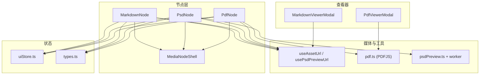
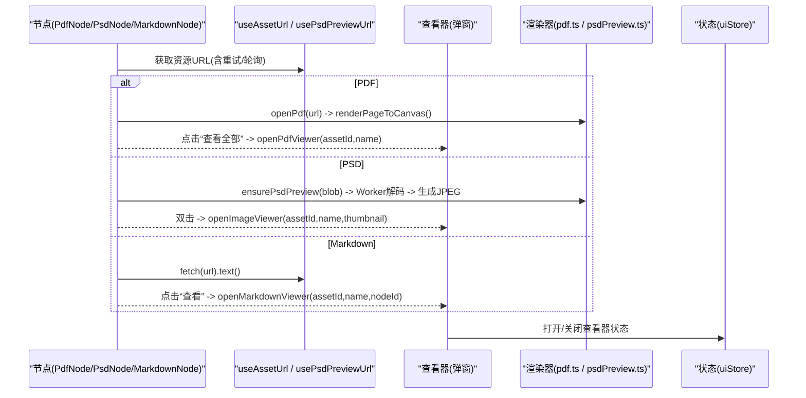
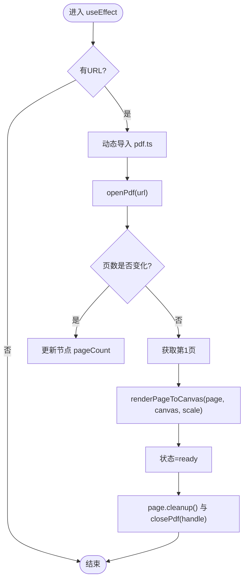
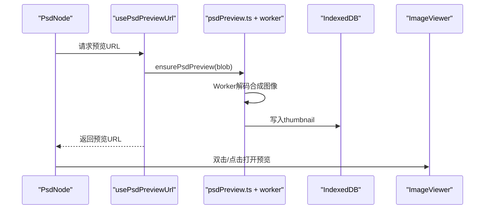
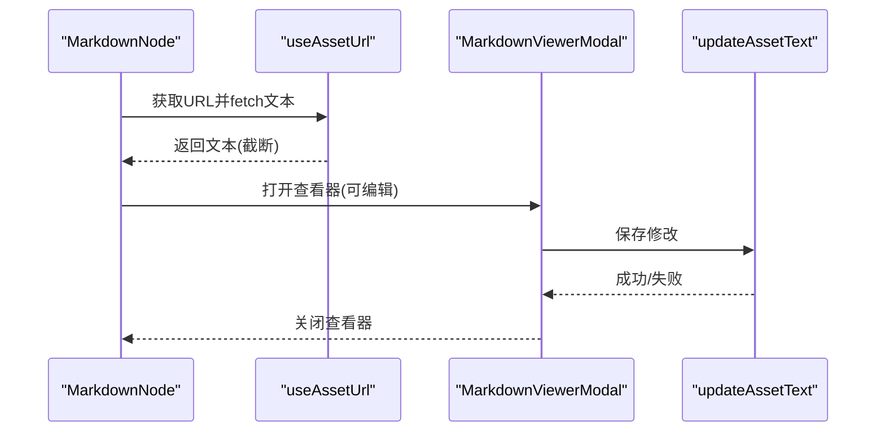
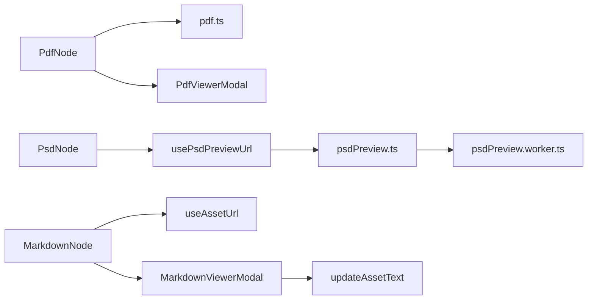

# 文档节点

<cite>
**本文引用的文件**
- [PdfNode.tsx](file://src/canvas/nodes/PdfNode.tsx)
- [PsdNode.tsx](file://src/canvas/nodes/PsdNode.tsx)
- [MarkdownNode.tsx](file://src/canvas/nodes/MarkdownNode.tsx)
- [pdf.ts](file://src/media/pdf.ts)
- [psdPreview.ts](file://src/media/psdPreview.ts)
- [psdPreview.worker.ts](file://src/media/psdPreview.worker.ts)
- [useAssetUrl.ts](file://src/media/useAssetUrl.ts)
- [MediaNodeShell.tsx](file://src/canvas/nodes/MediaNodeShell.tsx)
- [PdfViewerModal.tsx](file://src/components/PdfViewerModal.tsx)
- [MarkdownViewerModal.tsx](file://src/components/MarkdownViewerModal.tsx)
- [uiStore.ts](file://src/store/uiStore.ts)
- [types.ts](file://src/types.ts)
</cite>

## 目录
1. [简介](#简介)
2. [项目结构](#项目结构)
3. [核心组件](#核心组件)
4. [架构总览](#架构总览)
5. [详细组件分析](#详细组件分析)
6. [依赖关系分析](#依赖关系分析)
7. [性能与内存优化](#性能与内存优化)
8. [故障排查指南](#故障排查指南)
9. [结论](#结论)
10. [附录：使用示例与集成方案](#附录：使用示例与集成方案)

## 简介
本章节面向“文档节点”能力，系统性说明三类文档类型节点的实现原理与特性：
- PDF 节点：在画布中渲染首页缩略图，支持打开全屏预览、翻页、缩放与资源释放。
- PSD 节点：异步生成并缓存 PSD 预览图（Worker 解码），支持双击预览、下载原始文件、自动适配尺寸。
- Markdown 节点：加载并渲染 Markdown 内容，支持编辑、保存、下载与协作锁定提示。

同时覆盖属性配置、交互操作、导出功能、大文件处理、内存管理与渲染性能优化实践。

## 项目结构
围绕文档节点的关键文件组织如下：
- 节点组件：PdfNode、PsdNode、MarkdownNode，均基于 MediaNodeShell 提供统一外壳（边框、连线手柄、底部信息栏、协作锁定遮罩等）。
- 媒体资源 URL 获取：useAssetUrl、useThumbnailUrl、usePsdPreviewUrl，负责资源地址解析与重试策略。
- PDF 渲染：pdf.ts 封装 pdfjs-dist 的打开、关闭与页面渲染到 Canvas。
- PSD 预览：psdPreview.ts 通过 Worker 调用 ag-psd 解码合成图像，生成 JPEG 预览并持久化到 IndexedDB；psdPreview.worker.ts 执行具体解码与缩放。
- 查看器弹窗：PdfViewerModal、MarkdownViewerModal，提供全屏阅读与编辑体验。
- 状态管理：uiStore.ts 维护各类查看器的开关与参数；types.ts 定义 SuqNodeData 字段（如 pageCount、assetUpdatedAt 等）。

图表来源
- [PdfNode.tsx:1-90](file://src/canvas/nodes/PdfNode.tsx#L1-L90)
- [PsdNode.tsx:1-125](file://src/canvas/nodes/PsdNode.tsx#L1-L125)
- [MarkdownNode.tsx:1-105](file://src/canvas/nodes/MarkdownNode.tsx#L1-L105)
- [useAssetUrl.ts:1-157](file://src/media/useAssetUrl.ts#L1-L157)
- [pdf.ts:1-50](file://src/media/pdf.ts#L1-L50)
- [psdPreview.ts:1-62](file://src/media/psdPreview.ts#L1-L62)
- [psdPreview.worker.ts:1-82](file://src/media/psdPreview.worker.ts#L1-L82)
- [PdfViewerModal.tsx:1-146](file://src/components/PdfViewerModal.tsx#L1-L146)
- [MarkdownViewerModal.tsx:1-116](file://src/components/MarkdownViewerModal.tsx#L1-L116)
- [uiStore.ts:1-121](file://src/store/uiStore.ts#L1-L121)
- [types.ts:1-112](file://src/types.ts#L1-L112)

章节来源
- [PdfNode.tsx:1-90](file://src/canvas/nodes/PdfNode.tsx#L1-L90)
- [PsdNode.tsx:1-125](file://src/canvas/nodes/PsdNode.tsx#L1-L125)
- [MarkdownNode.tsx:1-105](file://src/canvas/nodes/MarkdownNode.tsx#L1-L105)
- [useAssetUrl.ts:1-157](file://src/media/useAssetUrl.ts#L1-L157)
- [pdf.ts:1-50](file://src/media/pdf.ts#L1-L50)
- [psdPreview.ts:1-62](file://src/media/psdPreview.ts#L1-L62)
- [psdPreview.worker.ts:1-82](file://src/media/psdPreview.worker.ts#L1-L82)
- [PdfViewerModal.tsx:1-146](file://src/components/PdfViewerModal.tsx#L1-L146)
- [MarkdownViewerModal.tsx:1-116](file://src/components/MarkdownViewerModal.tsx#L1-L116)
- [uiStore.ts:1-121](file://src/store/uiStore.ts#L1-L121)
- [types.ts:1-112](file://src/types.ts#L1-L112)

## 核心组件
- PdfNode：动态导入 pdf.ts，打开 PDF，渲染第一页到 Canvas，更新节点页数，提供“查看全部”入口。
- PsdNode：通过 usePsdPreviewUrl 获取或触发生成预览图，双击打开图片查看器，支持下载原始 PSD，自动根据原图尺寸设置节点宽高。
- MarkdownNode：拉取 Markdown 文本并限制最大长度，使用 ReactMarkdown 渲染，支持打开编辑器弹窗进行编辑与保存。
- MediaNodeShell：统一节点外壳，包含四边连接手柄、底部名称栏、创建者角标、协作锁定遮罩与进度条占位。

章节来源
- [PdfNode.tsx:1-90](file://src/canvas/nodes/PdfNode.tsx#L1-L90)
- [PsdNode.tsx:1-125](file://src/canvas/nodes/PsdNode.tsx#L1-L125)
- [MarkdownNode.tsx:1-105](file://src/canvas/nodes/MarkdownNode.tsx#L1-L105)
- [MediaNodeShell.tsx:1-151](file://src/canvas/nodes/MediaNodeShell.tsx#L1-L151)

## 架构总览
三类文档节点共享统一的交互外壳与资源加载机制，并通过查看器弹窗提供完整阅读/编辑体验。PDF 与 PSD 分别采用不同的渲染路径：PDF 使用 pdfjs-dist 直接渲染到 Canvas；PSD 通过 Web Worker 解码合成图层并生成 JPEG 预览，再缓存至 IndexedDB。

图表来源
- [PdfNode.tsx:1-90](file://src/canvas/nodes/PdfNode.tsx#L1-L90)
- [PsdNode.tsx:1-125](file://src/canvas/nodes/PsdNode.tsx#L1-L125)
- [MarkdownNode.tsx:1-105](file://src/canvas/nodes/MarkdownNode.tsx#L1-L105)
- [useAssetUrl.ts:1-157](file://src/media/useAssetUrl.ts#L1-L157)
- [pdf.ts:1-50](file://src/media/pdf.ts#L1-L50)
- [psdPreview.ts:1-62](file://src/media/psdPreview.ts#L1-L62)
- [PdfViewerModal.tsx:1-146](file://src/components/PdfViewerModal.tsx#L1-L146)
- [MarkdownViewerModal.tsx:1-116](file://src/components/MarkdownViewerModal.tsx#L1-L116)
- [uiStore.ts:1-121](file://src/store/uiStore.ts#L1-L121)

## 详细组件分析

### PDF 节点（PdfNode）
- 渲染流程
  - 动态导入 pdf.ts，调用 openPdf 打开文档，读取第一页并计算缩放比例后渲染到 Canvas。
  - 若文档页数与节点数据不一致，则更新节点 pageCount。
  - 清理：组件卸载时取消任务、释放页面与 PDF 实例。
- 交互
  - 就绪态显示“查看全部”按钮，调用 uiStore.openPdfViewer 打开全屏阅读器。
  - 加载中显示骨架占位，错误时显示失败提示。
- 关键实现要点
  - 使用 pdfjs 的 cMap/标准字体/WASM 资源路径，避免 CJK 与特殊编码问题。
  - 渲染时使用 devicePixelRatio 提升清晰度，并在关闭时调用 page.cleanup 与 closePdf。

图表来源
- [PdfNode.tsx:19-62](file://src/canvas/nodes/PdfNode.tsx#L19-L62)
- [pdf.ts:23-49](file://src/media/pdf.ts#L23-L49)

章节来源
- [PdfNode.tsx:1-90](file://src/canvas/nodes/PdfNode.tsx#L1-L90)
- [pdf.ts:1-50](file://src/media/pdf.ts#L1-L50)

### PSD 节点（PsdNode）
- 预览生成与展示
  - 通过 usePsdPreviewUrl 尝试获取已缓存的预览图；若无则触发 ensurePsdPreview，将 Blob 送入 Worker 解码合成图像，生成 JPEG 并写入 IndexedDB，随后刷新缩略图 URL。
  - 节点内显示预览图，首次加载完成后根据自然宽高按比例设置节点尺寸（上限 MAX_W/MAX_H）。
- 交互
  - 双击预览图或右上角“打开”按钮，调用 openImageViewer 打开图片查看器。
  - 右上角“下载”按钮直接下载原始 PSD。
- 协作与锁定
  - 使用 LAN 锁判断当前用户是否可编辑；若他人正在编辑，弹出提示并禁用打开预览。
  - 调整尺寸时通过 setLanEditing/clearLanEditing 标记编辑状态。

图表来源
- [PsdNode.tsx:15-57](file://src/canvas/nodes/PsdNode.tsx#L15-L57)
- [useAssetUrl.ts:129-157](file://src/media/useAssetUrl.ts#L129-L157)
- [psdPreview.ts:42-60](file://src/media/psdPreview.ts#L42-L60)
- [psdPreview.worker.ts:41-81](file://src/media/psdPreview.worker.ts#L41-L81)

章节来源
- [PsdNode.tsx:1-125](file://src/canvas/nodes/PsdNode.tsx#L1-L125)
- [useAssetUrl.ts:129-157](file://src/media/useAssetUrl.ts#L129-L157)
- [psdPreview.ts:1-62](file://src/media/psdPreview.ts#L1-L62)
- [psdPreview.worker.ts:1-82](file://src/media/psdPreview.worker.ts#L1-L82)

### Markdown 节点（MarkdownNode）
- 内容与渲染
  - 使用 useAssetUrl 获取 Markdown 文本 URL，fetch 文本并限制最大长度，使用 ReactMarkdown 渲染。
  - 支持双击或点击“查看”按钮打开 MarkdownViewerModal 进行编辑与保存。
- 编辑与保存
  - 在查看器中切换编辑模式，保存时调用 updateAssetText 更新资源，并失效 URL 以触发重新加载。
  - 支持下载原始 Markdown。
- 协作与锁定
  - 若检测到其他用户正在编辑该节点，显示遮罩与提示，阻止本地操作。

图表来源
- [MarkdownNode.tsx:29-43](file://src/canvas/nodes/MarkdownNode.tsx#L29-L43)
- [MarkdownViewerModal.tsx:43-58](file://src/components/MarkdownViewerModal.tsx#L43-L58)

章节来源
- [MarkdownNode.tsx:1-105](file://src/canvas/nodes/MarkdownNode.tsx#L1-L105)
- [MarkdownViewerModal.tsx:1-116](file://src/components/MarkdownViewerModal.tsx#L1-L116)

### 通用外壳（MediaNodeShell）
- 提供统一边框、四边连接手柄、底部名称栏、创建者角标、协作锁定遮罩与可选进度条。
- 在连线模式下启用边缘热区，便于从任意边拖拽连线。
- 当检测到协作锁定（他人正在编辑）时，阻止交互并显示提示。

章节来源
- [MediaNodeShell.tsx:1-151](file://src/canvas/nodes/MediaNodeShell.tsx#L1-L151)

## 依赖关系分析
- 节点与资源加载
  - PdfNode/PsdNode/MarkdownNode 均依赖 useAssetUrl/usePsdPreviewUrl 获取资源 URL，具备重试与轮询机制，适应局域网传输延迟。
- PDF 渲染链路
  - PdfNode -> pdf.ts(openPdf/renderPageToCanvas) -> PdfViewerModal(翻页/缩放)。
- PSD 预览链路
  - PsdNode -> usePsdPreviewUrl -> psdPreview.ensurePsdPreview -> Worker(ag-psd) -> IndexedDB -> 缩略图URL。
- Markdown 编辑链路
  - MarkdownNode -> MarkdownViewerModal -> updateAssetText -> 失效URL -> 重新加载。

图表来源
- [PdfNode.tsx:1-90](file://src/canvas/nodes/PdfNode.tsx#L1-L90)
- [pdf.ts:1-50](file://src/media/pdf.ts#L1-L50)
- [PdfViewerModal.tsx:1-146](file://src/components/PdfViewerModal.tsx#L1-L146)
- [PsdNode.tsx:1-125](file://src/canvas/nodes/PsdNode.tsx#L1-L125)
- [useAssetUrl.ts:129-157](file://src/media/useAssetUrl.ts#L129-L157)
- [psdPreview.ts:1-62](file://src/media/psdPreview.ts#L1-L62)
- [psdPreview.worker.ts:1-82](file://src/media/psdPreview.worker.ts#L1-L82)
- [MarkdownNode.tsx:1-105](file://src/canvas/nodes/MarkdownNode.tsx#L1-L105)
- [MarkdownViewerModal.tsx:1-116](file://src/components/MarkdownViewerModal.tsx#L1-L116)

章节来源
- [PdfNode.tsx:1-90](file://src/canvas/nodes/PdfNode.tsx#L1-L90)
- [PsdNode.tsx:1-125](file://src/canvas/nodes/PsdNode.tsx#L1-L125)
- [MarkdownNode.tsx:1-105](file://src/canvas/nodes/MarkdownNode.tsx#L1-L105)
- [useAssetUrl.ts:1-157](file://src/media/useAssetUrl.ts#L1-L157)
- [pdf.ts:1-50](file://src/media/pdf.ts#L1-L50)
- [psdPreview.ts:1-62](file://src/media/psdPreview.ts#L1-L62)
- [psdPreview.worker.ts:1-82](file://src/media/psdPreview.worker.ts#L1-L82)
- [PdfViewerModal.tsx:1-146](file://src/components/PdfViewerModal.tsx#L1-L146)
- [MarkdownViewerModal.tsx:1-116](file://src/components/MarkdownViewerModal.tsx#L1-L116)

## 性能与内存优化
- PDF 渲染
  - 仅渲染首页作为缩略图，减少主线程压力；全屏查看时按需渲染当前页，并在切换时清理旧页面。
  - 使用 devicePixelRatio 提升清晰度，同时控制缩放比例避免过大 Canvas。
  - 组件卸载时及时 cleanup 页面与销毁 PDF 任务，防止内存泄漏。
- PSD 预览
  - 使用 Web Worker 解码，避免阻塞主线程；限制文档尺寸与像素总量，防止超大文件导致崩溃。
  - 合成图像后进行等比缩放生成预览 JPEG，降低存储与网络开销；结果缓存到 IndexedDB，后续快速加载。
  - 队列化请求，串行处理以避免并发解码造成内存峰值。
- Markdown 内容
  - 限制加载文本大小，避免超长文本导致渲染卡顿。
  - 编辑保存时失效 URL 并递增版本，确保最新内容生效。
- 资源加载
  - 对资源 URL 获取增加重试与轮询，适应局域网传输延迟；封面/缩略图场景采用快慢轮询策略，提高可用性。
- 协作与交互
  - 通过 LAN 锁避免多人同时编辑冲突；在锁定状态下禁用交互并给出明确提示。

章节来源
- [PdfNode.tsx:19-62](file://src/canvas/nodes/PdfNode.tsx#L19-L62)
- [pdf.ts:23-49](file://src/media/pdf.ts#L23-L49)
- [PdfViewerModal.tsx:58-83](file://src/components/PdfViewerModal.tsx#L58-L83)
- [psdPreview.worker.ts:3-81](file://src/media/psdPreview.worker.ts#L3-L81)
- [psdPreview.ts:42-60](file://src/media/psdPreview.ts#L42-L60)
- [useAssetUrl.ts:7-49](file://src/media/useAssetUrl.ts#L7-L49)
- [useAssetUrl.ts:46-99](file://src/media/useAssetUrl.ts#L46-L99)
- [MarkdownNode.tsx:29-43](file://src/canvas/nodes/MarkdownNode.tsx#L29-L43)
- [MarkdownViewerModal.tsx:43-58](file://src/components/MarkdownViewerModal.tsx#L43-L58)

## 故障排查指南
- PDF 加载失败
  - 检查 pdfjs 的 cMap/标准字体/WASM 资源路径是否正确配置。
  - 确认 PDF 文件可访问且未损坏；查看控制台错误日志。
  - 确认组件卸载时已正确清理页面与 PDF 任务。
- PSD 预览失败
  - 检查文件大小与格式：仅支持 8-bit 且尺寸不超过限制；超出限制会抛出错误。
  - 确认 Worker 可用且未崩溃；查看浏览器控制台是否有 Worker 相关错误。
  - 若为局域网环境，等待缩略图生成完成后再试。
- Markdown 加载/保存失败
  - 检查资源 URL 是否有效；确认网络可达。
  - 保存失败时检查 updateAssetText 接口响应与权限。
  - 注意文本长度限制，避免超长内容导致渲染异常。
- 协作锁定提示
  - 若出现“某用户正在操作此元素”，请等待对方完成编辑或协调解锁。

章节来源
- [pdf.ts:1-50](file://src/media/pdf.ts#L1-L50)
- [PdfNode.tsx:50-59](file://src/canvas/nodes/PdfNode.tsx#L50-L59)
- [psdPreview.worker.ts:41-81](file://src/media/psdPreview.worker.ts#L41-L81)
- [psdPreview.ts:42-60](file://src/media/psdPreview.ts#L42-L60)
- [MarkdownNode.tsx:29-43](file://src/canvas/nodes/MarkdownNode.tsx#L29-L43)
- [MarkdownViewerModal.tsx:43-58](file://src/components/MarkdownViewerModal.tsx#L43-L58)

## 结论
三类文档节点通过统一外壳与资源加载机制，提供了稳定高效的 PDF 预览、PSD 预览与 Markdown 编辑能力。借助 Worker、缓存与严格的资源清理策略，系统在复杂网络与大数据量场景下仍保持良好性能与稳定性。结合协作锁定与完善的错误处理，适合团队协作与多端同步的使用场景。

## 附录：使用示例与集成方案
- 添加 PDF 节点
  - 在画布中添加类型为 pdf 的节点，设置 assetId 与 label；节点会自动渲染首页缩略图，点击“查看全部”打开全屏阅读器。
  - 参考：[PdfNode.tsx:11-89](file://src/canvas/nodes/PdfNode.tsx#L11-L89)、[PdfViewerModal.tsx:7-146](file://src/components/PdfViewerModal.tsx#L7-L146)
- 添加 PSD 节点
  - 添加类型为 psd 的节点，设置 assetId；系统自动生成并缓存预览图，双击或点击“打开”查看大图，支持下载原始文件。
  - 参考：[PsdNode.tsx:15-124](file://src/canvas/nodes/PsdNode.tsx#L15-L124)、[useAssetUrl.ts:129-157](file://src/media/useAssetUrl.ts#L129-L157)
- 添加 Markdown 节点
  - 添加类型为 markdown 的节点，设置 assetId；节点内渲染前若干字符，点击“查看”进入编辑器进行全文编辑与保存。
  - 参考：[MarkdownNode.tsx:12-104](file://src/canvas/nodes/MarkdownNode.tsx#L12-L104)、[MarkdownViewerModal.tsx:11-116](file://src/components/MarkdownViewerModal.tsx#L11-L116)
- 属性配置（SuqNodeData）
  - 常用字段：kind、assetId、label、pageCount、assetUpdatedAt、width、height、borderColor 等。
  - 参考：[types.ts:66-98](file://src/types.ts#L66-L98)
- 查看器状态管理
  - 通过 uiStore 的 open/close 方法控制各查看器显隐与参数。
  - 参考：[uiStore.ts:25-96](file://src/store/uiStore.ts#L25-L96)

章节来源
- [PdfNode.tsx:11-89](file://src/canvas/nodes/PdfNode.tsx#L11-L89)
- [PsdNode.tsx:15-124](file://src/canvas/nodes/PsdNode.tsx#L15-L124)
- [MarkdownNode.tsx:12-104](file://src/canvas/nodes/MarkdownNode.tsx#L12-L104)
- [PdfViewerModal.tsx:7-146](file://src/components/PdfViewerModal.tsx#L7-L146)
- [MarkdownViewerModal.tsx:11-116](file://src/components/MarkdownViewerModal.tsx#L11-L116)
- [useAssetUrl.ts:129-157](file://src/media/useAssetUrl.ts#L129-L157)
- [types.ts:66-98](file://src/types.ts#L66-L98)
- [uiStore.ts:25-96](file://src/store/uiStore.ts#L25-L96)