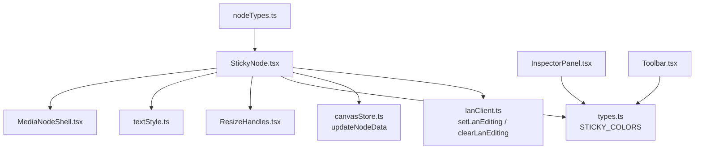
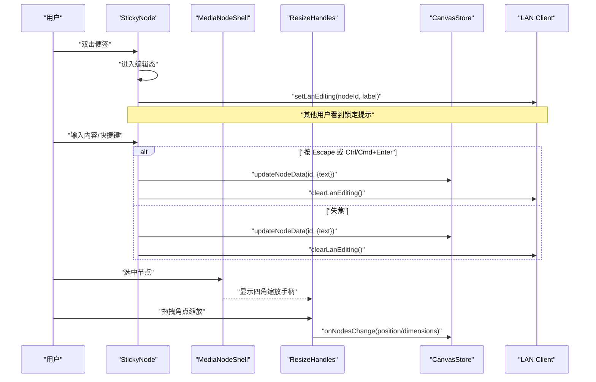
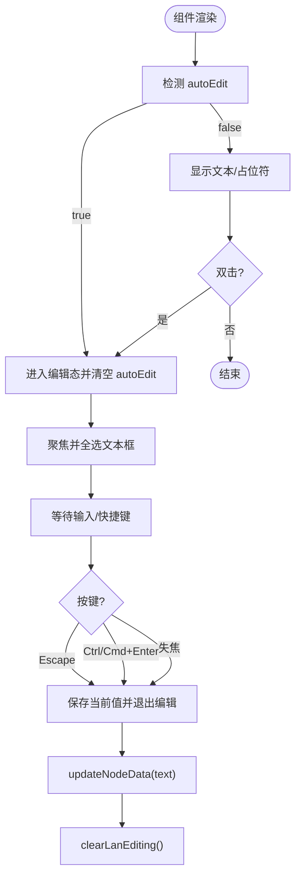
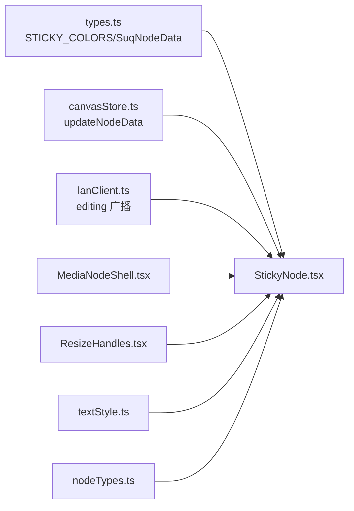

# 便签节点 (StickyNode)

<cite>
**本文引用的文件**
- [StickyNode.tsx](file://src/canvas/nodes/StickyNode.tsx)
- [MediaNodeShell.tsx](file://src/canvas/nodes/MediaNodeShell.tsx)
- [ResizeHandles.tsx](file://src/canvas/nodes/ResizeHandles.tsx)
- [textStyle.ts](file://src/canvas/nodes/textStyle.ts)
- [nodeTypes.ts](file://src/canvas/nodes/nodeTypes.ts)
- [types.ts](file://src/types.ts)
- [canvasStore.ts](file://src/store/canvasStore.ts)
- [lanClient.ts](file://src/sync/lanClient.ts)
- [InspectorPanel.tsx](file://src/components/InspectorPanel.tsx)
- [Toolbar.tsx](file://src/components/Toolbar.tsx)
</cite>

## 目录
1. [简介](#简介)
2. [项目结构](#项目结构)
3. [核心组件](#核心组件)
4. [架构总览](#架构总览)
5. [详细组件分析](#详细组件分析)
6. [依赖关系分析](#依赖关系分析)
7. [性能考量](#性能考量)
8. [故障排查指南](#故障排查指南)
9. [结论](#结论)
10. [附录：使用示例与自定义配置](#附录使用示例与自定义配置)

## 简介
本章节面向便签节点 StickyNode，系统性说明其实现原理、交互行为、样式定制、协作编辑支持以及与 MediaNodeShell、ResizeHandles 的集成方式。文档同时给出在画布中创建、编辑、显示便签的完整流程，以及快捷键操作与自动编辑模式的用法。

## 项目结构
StickyNode 位于 nodes 目录下，作为 ReactFlow 的一个节点类型注册到 mediaNodeTypes 中；其外观与交互由 MediaNodeShell 提供统一外壳（边框、连线手柄、底部信息栏、协作者锁定提示等），文本编辑与展示逻辑集中在 StickyNode 内部，并通过 textStyle 工具函数生成统一的文本样式。颜色系统 STICKY_COLORS 定义在 types.ts 中，供插入、检查面板和节点渲染共同使用。

图表来源
- [StickyNode.tsx:1-85](file://src/canvas/nodes/StickyNode.tsx#L1-L85)
- [MediaNodeShell.tsx:1-151](file://src/canvas/nodes/MediaNodeShell.tsx#L1-L151)
- [textStyle.ts:1-22](file://src/canvas/nodes/textStyle.ts#L1-L22)
- [ResizeHandles.tsx:1-118](file://src/canvas/nodes/ResizeHandles.tsx#L1-L118)
- [types.ts:26-35](file://src/types.ts#L26-L35)
- [nodeTypes.ts:14-26](file://src/canvas/nodes/nodeTypes.ts#L14-L26)
- [canvasStore.ts:176-183](file://src/store/canvasStore.ts#L176-L183)
- [lanClient.ts:793-800](file://src/sync/lanClient.ts#L793-L800)
- [InspectorPanel.tsx:679-703](file://src/components/InspectorPanel.tsx#L679-L703)
- [Toolbar.tsx:258-277](file://src/components/Toolbar.tsx#L258-L277)

章节来源
- [nodeTypes.ts:14-26](file://src/canvas/nodes/nodeTypes.ts#L14-L26)
- [types.ts:26-35](file://src/types.ts#L26-L35)

## 核心组件
- StickyNode：便签节点的核心实现，负责编辑态切换、内容提交、文本样式应用、协作编辑状态广播、尺寸调整手柄的显隐。
- MediaNodeShell：节点通用外壳，提供边框、四边连接热区、底部标签栏、协作者锁定遮罩、进度条等能力。
- ResizeHandles：四角缩放手柄，支持最小宽高限制与实时位置/尺寸更新。
- textStyle：集中构建文本样式（水平对齐、字号、字体、加粗/斜体/下划线、行高、垂直对齐）。
- STICKY_COLORS：便签颜色系统，包含背景色与边框色映射。

章节来源
- [StickyNode.tsx:10-85](file://src/canvas/nodes/StickyNode.tsx#L10-L85)
- [MediaNodeShell.tsx:32-151](file://src/canvas/nodes/MediaNodeShell.tsx#L32-L151)
- [ResizeHandles.tsx:35-118](file://src/canvas/nodes/ResizeHandles.tsx#L35-L118)
- [textStyle.ts:4-21](file://src/canvas/nodes/textStyle.ts#L4-L21)
- [types.ts:26-35](file://src/types.ts#L26-L35)

## 架构总览
StickyNode 通过 ReactFlow 的 NodeProps 接收节点数据，基于 data.color 选择 STICKY_COLORS 中的配色，并使用 buildTextStyle 生成文本样式。编辑模式下渲染 textarea，失焦或快捷键确认后调用 updateNodeData 持久化 text；非编辑模式双击进入编辑。协作场景下，进入/退出编辑时通过 setLanEditing/clearLanEditing 通知局域网其他用户，MediaNodeShell 会据此显示“正在操作此元素”的锁定提示。选中且未编辑时显示 ResizeHandles 以支持拖拽缩放。

图表来源
- [StickyNode.tsx:17-41](file://src/canvas/nodes/StickyNode.tsx#L17-L41)
- [StickyNode.tsx:52-81](file://src/canvas/nodes/StickyNode.tsx#L52-L81)
- [MediaNodeShell.tsx:44-66](file://src/canvas/nodes/MediaNodeShell.tsx#L44-L66)
- [MediaNodeShell.tsx:141-147](file://src/canvas/nodes/MediaNodeShell.tsx#L141-L147)
- [ResizeHandles.tsx:45-103](file://src/canvas/nodes/ResizeHandles.tsx#L45-L103)
- [canvasStore.ts:176-183](file://src/store/canvasStore.ts#L176-L183)
- [lanClient.ts:793-800](file://src/sync/lanClient.ts#L793-L800)

## 详细组件分析

### StickyNode 组件
- 颜色系统：从 data.color 读取，默认黄色，使用 STICKY_COLORS 获取背景与边框色。
- 自动编辑模式：当 data.autoEdit 为真时，组件挂载后自动进入编辑并清除该标记，便于批量导入或程序化插入后立即编辑。
- 文本编辑：
  - 编辑态：textarea 自适应行数，失焦保存；快捷键支持 Escape 取消并保存当前值、Ctrl/Cmd+Enter 确认保存。
  - 非编辑态：双击进入编辑；无内容时显示占位提示。
- 协作编辑：进入编辑时广播 setLanEditing，退出时广播 clearLanEditing，配合 MediaNodeShell 的锁定遮罩避免冲突。
- 样式：通过 buildTextStyle 应用水平对齐、字号、字体、加粗/斜体/下划线、行高；垂直对齐通过 V_JUSTIFY 映射 flex 布局。
- 缩放：selected 且非编辑时显示 ResizeHandles，支持四角拖拽缩放，最小宽度 120、最小高度 40。

图表来源
- [StickyNode.tsx:17-41](file://src/canvas/nodes/StickyNode.tsx#L17-L41)
- [StickyNode.tsx:52-81](file://src/canvas/nodes/StickyNode.tsx#L52-L81)

章节来源
- [StickyNode.tsx:10-85](file://src/canvas/nodes/StickyNode.tsx#L10-L85)
- [types.ts:26-35](file://src/types.ts#L26-L35)
- [textStyle.ts:4-21](file://src/canvas/nodes/textStyle.ts#L4-L21)

### MediaNodeShell 外壳
- 提供统一容器：圆角边框、阴影、选中态样式、可配置的底部名称栏、创作者角标、播放进度遮罩。
- 连线热区：四条边均暴露 source/target Handle，支持连线模式下的快速引线。
- 协作锁定：当检测到其他用户在编辑同一节点时，阻止指针事件并显示“正在操作此元素”的遮罩。
- 与 StickyNode 集成：StickyNode 将自身内容包裹在 MediaNodeShell 内，获得一致的交互体验。

章节来源
- [MediaNodeShell.tsx:32-151](file://src/canvas/nodes/MediaNodeShell.tsx#L32-L151)
- [lanClient.ts:793-800](file://src/sync/lanClient.ts#L793-L800)

### ResizeHandles 缩放
- 四角缩放：nw/ne/sw/se 四个角点，鼠标指针随角点变化。
- 最小尺寸约束：宽度不小于 120，高度不小于 40；当缩小触底时反向移动位置以保持最小尺寸。
- 实时更新：拖拽过程中同步更新节点的 position 与 dimensions，并触发 CanvasStore 变更。

章节来源
- [ResizeHandles.tsx:5-118](file://src/canvas/nodes/ResizeHandles.tsx#L5-L118)
- [canvasStore.ts:176-183](file://src/store/canvasStore.ts#L176-L183)

### 文本样式与对齐
- 水平对齐：left/center/right/justify。
- 垂直对齐：top/middle/bottom，通过 flex 布局 justify-content 控制。
- 字体与装饰：fontSize、fontFamily、color、bold、italic、underline、lineHeight。

章节来源
- [textStyle.ts:4-21](file://src/canvas/nodes/textStyle.ts#L4-L21)

### 颜色系统 STICKY_COLORS
- 颜色键：yellow/green/blue/pink/purple/gray。
- 每个颜色包含背景色与边框色，用于节点渲染与 UI 控件（插入菜单、检查面板）保持一致。

章节来源
- [types.ts:26-35](file://src/types.ts#L26-L35)
- [InspectorPanel.tsx:679-703](file://src/components/InspectorPanel.tsx#L679-L703)
- [Toolbar.tsx:258-277](file://src/components/Toolbar.tsx#L258-L277)

## 依赖关系分析
- StickyNode 依赖：
  - types.ts：STICKY_COLORS、SuqNodeData 字段（如 color、textAlign、textAlignV、fontSize、fontFamily、textColor、bold、italic、underline、lineHeight、autoEdit）。
  - canvasStore.ts：updateNodeData 持久化文本与样式变更。
  - lanClient.ts：setLanEditing/clearLanEditing 协作编辑广播。
  - MediaNodeShell：外壳容器与协作锁定。
  - ResizeHandles：缩放手柄。
  - textStyle：文本样式构建。
- nodeTypes.ts 将 sticky 类型注册到 ReactFlow，使画布能识别并渲染 StickyNode。

图表来源
- [types.ts:26-35](file://src/types.ts#L26-L35)
- [canvasStore.ts:176-183](file://src/store/canvasStore.ts#L176-L183)
- [lanClient.ts:793-800](file://src/sync/lanClient.ts#L793-L800)
- [MediaNodeShell.tsx:32-151](file://src/canvas/nodes/MediaNodeShell.tsx#L32-L151)
- [ResizeHandles.tsx:35-118](file://src/canvas/nodes/ResizeHandles.tsx#L35-L118)
- [textStyle.ts:4-21](file://src/canvas/nodes/textStyle.ts#L4-L21)
- [nodeTypes.ts:14-26](file://src/canvas/nodes/nodeTypes.ts#L14-L26)

章节来源
- [nodeTypes.ts:14-26](file://src/canvas/nodes/nodeTypes.ts#L14-L26)

## 性能考量
- memo 包裹 StickyNode 与 MediaNodeShell，减少不必要的重渲染。
- 文本编辑使用原生 textarea，避免富文本开销；失焦保存减少频繁写入。
- 缩放过程通过 onNodesChange 批量更新 position 与 dimensions，降低多次 setState 成本。
- 协作编辑广播仅在编辑态切换时发送，避免高频消息。

[本节为通用性能建议，不直接分析具体代码片段]

## 故障排查指南
- 无法进入编辑：
  - 检查是否被其他用户锁定（MediaNodeShell 会显示遮罩），等待对方退出编辑或断开协作。
  - 确认 data.autoEdit 未被意外设置导致重复进入编辑。
- 快捷键无效：
  - 确保 textarea 已聚焦；Escape 与 Ctrl/Cmd+Enter 仅在编辑态生效。
- 颜色不生效：
  - 确认 data.color 为 STICKY_COLORS 支持的键之一；检查 InspectorPanel 或 Toolbar 是否正确更新 borderColor。
- 缩放异常：
  - 确认节点处于选中且非编辑态；检查最小宽高限制是否导致位置回退。

章节来源
- [MediaNodeShell.tsx:44-66](file://src/canvas/nodes/MediaNodeShell.tsx#L44-L66)
- [MediaNodeShell.tsx:141-147](file://src/canvas/nodes/MediaNodeShell.tsx#L141-L147)
- [StickyNode.tsx:17-41](file://src/canvas/nodes/StickyNode.tsx#L17-L41)
- [ResizeHandles.tsx:81-88](file://src/canvas/nodes/ResizeHandles.tsx#L81-L88)

## 结论
StickyNode 提供了轻量、易用的便签能力：直观的颜色系统、灵活的文本样式、健壮的编辑与保存机制、完善的协作编辑支持与直观的缩放交互。通过 MediaNodeShell 的统一外壳与 ResizeHandles 的缩放能力，便签节点在画布中具备一致且高效的交互体验。

[本节为总结性内容，不直接分析具体代码片段]

## 附录：使用示例与自定义配置

### 在画布中创建便签
- 通过插入菜单选择“便签”，可选择颜色并插入到画布指定位置。
- 插入后可立即双击编辑，或通过 data.autoEdit 在插入后自动进入编辑。

章节来源
- [Toolbar.tsx:258-277](file://src/components/Toolbar.tsx#L258-L277)
- [StickyNode.tsx:17-22](file://src/canvas/nodes/StickyNode.tsx#L17-L22)

### 编辑与保存
- 双击便签进入编辑模式；失焦或按下 Escape、Ctrl/Cmd+Enter 保存内容。
- 文本样式可通过检查面板调整：水平/垂直对齐、字号、字体、加粗、斜体、下划线、行高。

章节来源
- [StickyNode.tsx:52-81](file://src/canvas/nodes/StickyNode.tsx#L52-L81)
- [textStyle.ts:4-21](file://src/canvas/nodes/textStyle.ts#L4-L21)

### 颜色定制
- 使用 InspectorPanel 的“便签颜色”区域切换颜色，同时更新背景与边框色。
- 也可通过更新 data.color 与 data.borderColor 进行编程式定制。

章节来源
- [InspectorPanel.tsx:679-703](file://src/components/InspectorPanel.tsx#L679-L703)
- [types.ts:26-35](file://src/types.ts#L26-L35)

### 协作编辑
- 进入编辑时，其他用户会看到锁定提示，防止并发修改冲突。
- 退出编辑后锁定解除，恢复自由编辑。

章节来源
- [lanClient.ts:793-800](file://src/sync/lanClient.ts#L793-L800)
- [MediaNodeShell.tsx:44-66](file://src/canvas/nodes/MediaNodeShell.tsx#L44-L66)
- [MediaNodeShell.tsx:141-147](file://src/canvas/nodes/MediaNodeShell.tsx#L141-L147)

### 缩放与尺寸
- 选中便签后出现四角缩放手柄；拖拽可调整尺寸，最小宽度 120、最小高度 40。
- 缩放过程中节点位置与尺寸实时更新，保持视觉一致性。

章节来源
- [ResizeHandles.tsx:35-118](file://src/canvas/nodes/ResizeHandles.tsx#L35-L118)