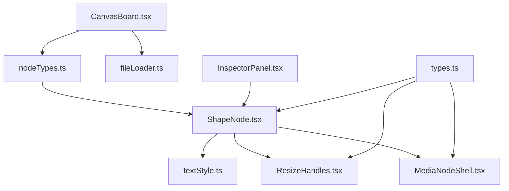
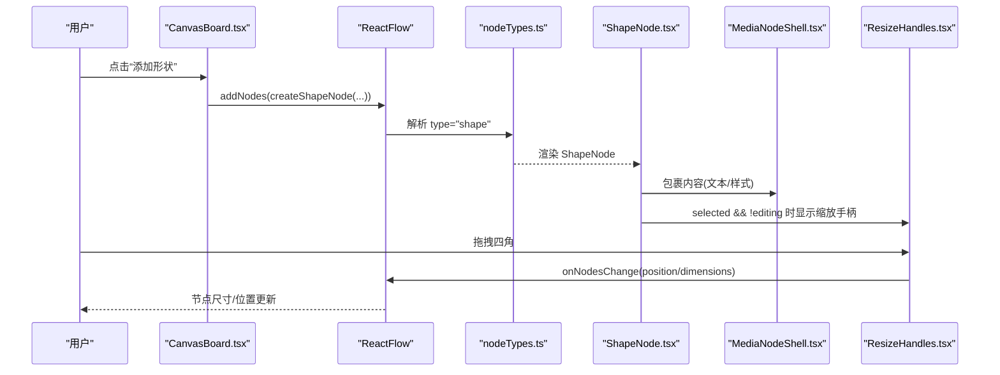
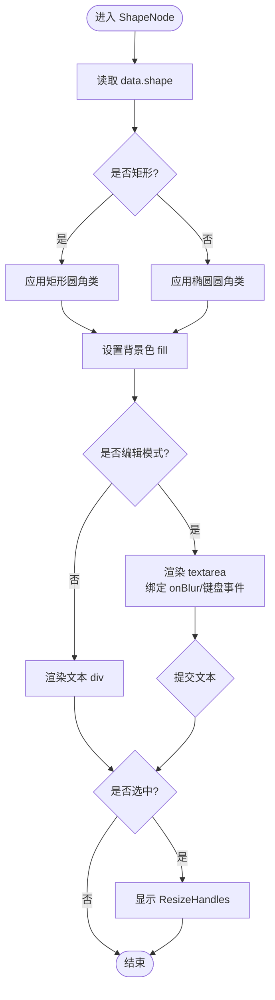
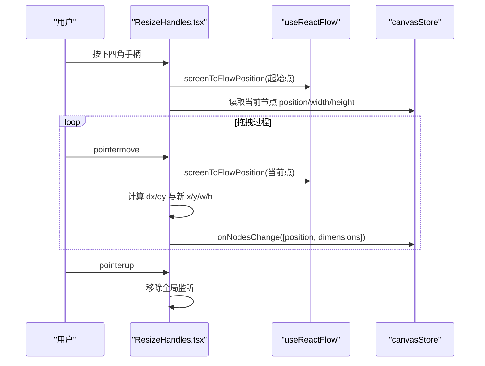
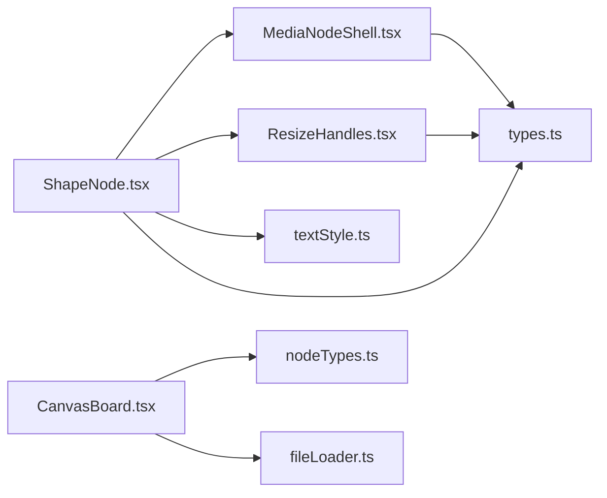

# 形状节点 (ShapeNode)

<cite>
**本文引用的文件**
- [src/canvas/nodes/ShapeNode.tsx](file://src/canvas/nodes/ShapeNode.tsx)
- [src/canvas/nodes/MediaNodeShell.tsx](file://src/canvas/nodes/MediaNodeShell.tsx)
- [src/canvas/nodes/ResizeHandles.tsx](file://src/canvas/nodes/ResizeHandles.tsx)
- [src/canvas/nodes/textStyle.ts](file://src/canvas/nodes/textStyle.ts)
- [src/canvas/nodes/nodeTypes.ts](file://src/canvas/nodes/nodeTypes.ts)
- [src/types.ts](file://src/types.ts)
- [src/io/fileLoader.ts](file://src/io/fileLoader.ts)
- [src/components/InspectorPanel.tsx](file://src/components/InspectorPanel.tsx)
- [src/canvas/CanvasBoard.tsx](file://src/canvas/CanvasBoard.tsx)
</cite>

## 目录
1. [简介](#简介)
2. [项目结构](#项目结构)
3. [核心组件](#核心组件)
4. [架构总览](#架构总览)
5. [详细组件分析](#详细组件分析)
6. [依赖关系分析](#依赖关系分析)
7. [性能考量](#性能考量)
8. [故障排查指南](#故障排查指南)
9. [结论](#结论)
10. [附录：使用示例与扩展方案](#附录：使用示例与扩展方案)

## 简介
本文件围绕 ShapeNode（形状节点）的实现进行系统化说明，涵盖支持的几何形状、填充与边框样式、文本渲染、交互能力（选择、拖拽、缩放）、与其他节点的连接能力、事件处理机制，以及基于 React + Tailwind CSS 的绘制实现。该项目未使用原生 SVG/Canvas 直接绘制形状，而是通过 DOM + CSS 完成形状渲染；同时提供扩展思路以支持更复杂的自定义形状。

## 项目结构
- 形状节点由多个模块协作构成：
  - 节点渲染：ShapeNode 负责根据 data.shape 渲染矩形或椭圆，并处理文本编辑与样式。
  - 通用外壳：MediaNodeShell 提供统一的节点外壳、连线手柄、底部信息栏、锁定状态等。
  - 尺寸调整：ResizeHandles 提供四角缩放手柄，支持最小宽高限制与位置同步更新。
  - 文本样式：textStyle 提供字体、对齐、行高等样式构建。
  - 类型定义：types.ts 定义了 ShapeType、SuqNodeData 等关键类型。
  - 创建入口：fileLoader.ts 提供 createShapeNode 工厂函数，用于在画布上添加形状节点。
  - 画布集成：CanvasBoard.tsx 将节点类型注册到 ReactFlow，并提供工具模式、快捷键、视图控制等。
  - 检查面板：InspectorPanel.tsx 暴露形状类型、填充色等属性编辑能力。

图表来源
- [src/canvas/CanvasBoard.tsx:195-196](file://src/canvas/CanvasBoard.tsx#L195-L196)
- [src/canvas/nodes/nodeTypes.ts:14-26](file://src/canvas/nodes/nodeTypes.ts#L14-L26)
- [src/canvas/nodes/ShapeNode.tsx:10-85](file://src/canvas/nodes/ShapeNode.tsx#L10-L85)
- [src/canvas/nodes/MediaNodeShell.tsx:32-150](file://src/canvas/nodes/MediaNodeShell.tsx#L32-L150)
- [src/canvas/nodes/ResizeHandles.tsx:35-117](file://src/canvas/nodes/ResizeHandles.tsx#L35-L117)
- [src/canvas/nodes/textStyle.ts:10-21](file://src/canvas/nodes/textStyle.ts#L10-L21)
- [src/io/fileLoader.ts:273-296](file://src/io/fileLoader.ts#L273-L296)
- [src/components/InspectorPanel.tsx:706-728](file://src/components/InspectorPanel.tsx#L706-L728)
- [src/types.ts:24-25,66-98:24-25](file://src/types.ts#L24-L25)

章节来源
- [src/canvas/CanvasBoard.tsx:195-196](file://src/canvas/CanvasBoard.tsx#L195-L196)
- [src/canvas/nodes/nodeTypes.ts:14-26](file://src/canvas/nodes/nodeTypes.ts#L14-L26)

## 核心组件
- ShapeNode：根据 data.shape 决定圆角策略（矩形 vs 椭圆），设置背景填充色，支持双击进入文本编辑模式，并在选中时显示 ResizeHandles。
- MediaNodeShell：为所有媒体类节点提供统一外壳，包含四个边的 source/target 连线手柄、底部标签栏、作者标记、进度遮罩、锁定提示等。
- ResizeHandles：四角缩放手柄，实时计算新宽高与位置，应用最小宽高约束，并通过 onNodesChange 同步到 store。
- textStyle：集中构建文本样式（对齐、字号、字体、颜色、加粗、斜体、下划线、行高）。
- types：定义 ShapeType（rect/ellipse）、SuqNodeData 字段（shape、fill、borderColor、textAlign、textAlignV 等）。
- fileLoader.createShapeNode：创建默认形状节点数据（含 kind、shape、label、fill、borderColor、文本对齐等）。
- InspectorPanel：提供形状类型切换与填充色修改的 UI 控件。

章节来源
- [src/canvas/nodes/ShapeNode.tsx:10-85](file://src/canvas/nodes/ShapeNode.tsx#L10-L85)
- [src/canvas/nodes/MediaNodeShell.tsx:32-150](file://src/canvas/nodes/MediaNodeShell.tsx#L32-L150)
- [src/canvas/nodes/ResizeHandles.tsx:35-117](file://src/canvas/nodes/ResizeHandles.tsx#L35-L117)
- [src/canvas/nodes/textStyle.ts:10-21](file://src/canvas/nodes/textStyle.ts#L10-L21)
- [src/types.ts:24-25,66-98:24-25](file://src/types.ts#L24-L25)
- [src/io/fileLoader.ts:273-296](file://src/io/fileLoader.ts#L273-L296)
- [src/components/InspectorPanel.tsx:706-728](file://src/components/InspectorPanel.tsx#L706-L728)

## 架构总览
ShapeNode 作为 ReactFlow 的一个节点类型，被注册到 mediaNodeTypes，并由 CanvasBoard 渲染。其外观由 MediaNodeShell 包裹，内部通过 Tailwind CSS 的圆角类名区分矩形与椭圆，并使用 data.fill 作为背景色。文本内容通过 buildTextStyle 生成样式对象，支持水平与垂直对齐。选中态下显示 ResizeHandles 以实现缩放。连线能力由 MediaNodeShell 内置的 Handle 提供，支持从四条边进行连接。

图表来源
- [src/canvas/CanvasBoard.tsx:195-196](file://src/canvas/CanvasBoard.tsx#L195-L196)
- [src/canvas/nodes/nodeTypes.ts:14-26](file://src/canvas/nodes/nodeTypes.ts#L14-L26)
- [src/canvas/nodes/ShapeNode.tsx:10-85](file://src/canvas/nodes/ShapeNode.tsx#L10-L85)
- [src/canvas/nodes/MediaNodeShell.tsx:68-105](file://src/canvas/nodes/MediaNodeShell.tsx#L68-L105)
- [src/canvas/nodes/ResizeHandles.tsx:45-101](file://src/canvas/nodes/ResizeHandles.tsx#L45-L101)

## 详细组件分析

### ShapeNode 渲染与交互
- 形状类型：data.shape 支持 rect 与 ellipse。矩形使用圆角类名，椭圆使用全圆角类名。
- 填充样式：通过 data.fill 设置背景色，默认值在创建节点时设定。
- 边框设置：边框色由 MediaNodeShell 的 borderColor 控制，可在检查面板中修改。
- 文本编辑：双击进入编辑模式，提交后保存 text；支持 ESC 取消、Ctrl/Cmd+Enter 确认。
- 文本样式：通过 buildTextStyle 应用 textAlign、fontSize、fontFamily、color、bold、italic、underline、lineHeight；垂直对齐由 V_JUSTIFY 映射到 flex 布局。
- 选中态：selected 且非编辑时显示 ResizeHandles 以支持缩放。

图表来源
- [src/canvas/nodes/ShapeNode.tsx:10-85](file://src/canvas/nodes/ShapeNode.tsx#L10-L85)
- [src/canvas/nodes/textStyle.ts:4-21](file://src/canvas/nodes/textStyle.ts#L4-L21)

章节来源
- [src/canvas/nodes/ShapeNode.tsx:10-85](file://src/canvas/nodes/ShapeNode.tsx#L10-L85)
- [src/canvas/nodes/textStyle.ts:4-21](file://src/canvas/nodes/textStyle.ts#L4-L21)

### MediaNodeShell 外壳与连线
- 连线手柄：在上下左右四边分别提供 source/target 类型的 Handle，支持连线模式下的热区连接。
- 底部栏：显示图标与 label，便于识别节点类型与名称。
- 锁定状态：当其他用户正在编辑该节点时，阻止交互并显示提示。
- 进度遮罩：可选 progress 参数用于播放进度可视化（对形状节点通常不启用）。
- 边框色：通过 data.borderColor 控制，影响外壳边框。

章节来源
- [src/canvas/nodes/MediaNodeShell.tsx:32-150](file://src/canvas/nodes/MediaNodeShell.tsx#L32-L150)

### ResizeHandles 缩放逻辑
- 四角缩放手柄：nw/ne/sw/se，不同角对应不同的光标样式。
- 最小尺寸：宽度不小于 MIN_W，高度不小于 MIN_H。
- 坐标与尺寸更新：根据拖拽位移计算新的 x/y/w/h，并通过 onNodesChange 同时更新 position 与 dimensions。
- 事件管理：在 pointerdown 时注册 window 级别的 pointermove/pointerup，在 pointerup 时移除监听，避免内存泄漏。

图表来源
- [src/canvas/nodes/ResizeHandles.tsx:45-101](file://src/canvas/nodes/ResizeHandles.tsx#L45-L101)

章节来源
- [src/canvas/nodes/ResizeHandles.tsx:35-117](file://src/canvas/nodes/ResizeHandles.tsx#L35-L117)

### 类型与数据模型
- ShapeType：'rect' | 'ellipse'，用于区分矩形与椭圆。
- SuqNodeData：包含 shape、fill、borderColor、textAlign、textAlignV、fontSize、fontFamily、textColor、bold、italic、underline、lineHeight 等字段，用于驱动形状与文本样式。
- EdgeStyle：定义边的线型、路径、箭头、描边等，供连线使用。

章节来源
- [src/types.ts:24-25,66-98:24-25](file://src/types.ts#L24-L25)

### 创建与配置
- createShapeNode：创建默认形状节点，包含 kind、shape、label、text、autoEdit、fill、borderColor、textAlign、textAlignV 等初始值。
- InspectorPanel：提供形状类型切换与填充色修改的 UI，调用 updateNodeData 实时更新节点数据。

章节来源
- [src/io/fileLoader.ts:273-296](file://src/io/fileLoader.ts#L273-L296)
- [src/components/InspectorPanel.tsx:706-728](file://src/components/InspectorPanel.tsx#L706-L728)

## 依赖关系分析
- ShapeNode 依赖：
  - MediaNodeShell：提供外壳、连线手柄、底部栏、锁定提示。
  - ResizeHandles：提供缩放交互。
  - textStyle：提供文本样式构建。
  - canvasStore：读写节点数据与变更。
  - types：类型约束。
- CanvasBoard 依赖：
  - nodeTypes：注册 shape 节点类型。
  - fileLoader：创建形状节点。
  - uiStore/settingsStore/lanStore：工具模式、主题、局域网协作。
- 连线能力：
  - MediaNodeShell 在四边提供 source/target 手柄，支持 connect 模式下从任意边引线。

图表来源
- [src/canvas/nodes/ShapeNode.tsx:10-85](file://src/canvas/nodes/ShapeNode.tsx#L10-L85)
- [src/canvas/nodes/MediaNodeShell.tsx:32-150](file://src/canvas/nodes/MediaNodeShell.tsx#L32-L150)
- [src/canvas/nodes/ResizeHandles.tsx:35-117](file://src/canvas/nodes/ResizeHandles.tsx#L35-L117)
- [src/canvas/nodes/textStyle.ts:10-21](file://src/canvas/nodes/textStyle.ts#L10-L21)
- [src/canvas/CanvasBoard.tsx:195-196](file://src/canvas/CanvasBoard.tsx#L195-L196)
- [src/io/fileLoader.ts:273-296](file://src/io/fileLoader.ts#L273-L296)
- [src/types.ts:24-25,66-98:24-25](file://src/types.ts#L24-L25)

章节来源
- [src/canvas/nodes/ShapeNode.tsx:10-85](file://src/canvas/nodes/ShapeNode.tsx#L10-L85)
- [src/canvas/nodes/MediaNodeShell.tsx:32-150](file://src/canvas/nodes/MediaNodeShell.tsx#L32-L150)
- [src/canvas/nodes/ResizeHandles.tsx:35-117](file://src/canvas/nodes/ResizeHandles.tsx#L35-L117)
- [src/canvas/nodes/textStyle.ts:10-21](file://src/canvas/nodes/textStyle.ts#L10-L21)
- [src/canvas/CanvasBoard.tsx:195-196](file://src/canvas/CanvasBoard.tsx#L195-L196)
- [src/io/fileLoader.ts:273-296](file://src/io/fileLoader.ts#L273-L296)
- [src/types.ts:24-25,66-98:24-25](file://src/types.ts#L24-L25)

## 性能考量
- 渲染方式：形状节点采用 DOM + CSS 渲染，利用 Tailwind 的圆角类与背景色快速绘制，避免了复杂 Canvas/SVG 绘制的开销。
- 文本编辑：仅在选中且非编辑状态下显示 ResizeHandles，减少不必要的重绘。
- 缩放交互：ResizeHandles 使用全局指针事件监听，确保拖拽流畅；在 pointerup 时及时移除监听，防止内存泄漏。
- 样式构建：buildTextStyle 返回纯样式对象，避免重复计算。
- 建议：如需高性能大量形状渲染，可考虑引入虚拟滚动或按需渲染策略；对于复杂图形，可评估 Canvas/SVG 方案。

## 故障排查指南
- 无法缩放：
  - 检查节点是否处于编辑模式（editing=true 时隐藏 ResizeHandles）。
  - 确认节点未被其他用户锁定（MediaNodeShell 会阻止交互）。
- 形状不显示圆角：
  - 确认 data.shape 是否为 'rect' 或 'ellipse'，否则不会应用相应圆角类。
- 文本样式不生效：
  - 检查 SuqNodeData 中的 textAlign、textAlignV、fontSize、fontFamily、textColor、bold、italic、underline、lineHeight 是否正确设置。
- 连线失败：
  - 确认处于 connect 工具模式，且目标节点四边存在 source/target 手柄。
- 创建节点异常：
  - 检查 createShapeNode 的默认数据是否完整（kind、shape、fill、borderColor、textAlign、textAlignV）。

章节来源
- [src/canvas/nodes/ShapeNode.tsx:10-85](file://src/canvas/nodes/ShapeNode.tsx#L10-L85)
- [src/canvas/nodes/MediaNodeShell.tsx:32-150](file://src/canvas/nodes/MediaNodeShell.tsx#L32-L150)
- [src/canvas/nodes/ResizeHandles.tsx:35-117](file://src/canvas/nodes/ResizeHandles.tsx#L35-L117)
- [src/io/fileLoader.ts:273-296](file://src/io/fileLoader.ts#L273-L296)

## 结论
ShapeNode 通过 React + Tailwind CSS 实现了简洁高效的形状渲染与交互，支持矩形与椭圆两种基本几何形状，具备丰富的文本样式与连线能力。借助 MediaNodeShell 的统一外壳与 ResizeHandles 的缩放逻辑，提供了良好的用户体验。若需更复杂的几何形状或高性能渲染，可在现有基础上扩展自定义形状实现。

## 附录：使用示例与扩展方案

### 使用示例
- 添加形状节点：
  - 在画布工具栏中选择“形状”，或在代码中调用 createShapeNode 并添加到节点列表。
- 修改形状类型与填充色：
  - 在检查面板中切换形状类型为矩形或椭圆，并选择填充颜色。
- 编辑文本：
  - 双击形状节点进入编辑模式，输入文本后失焦或按 Ctrl/Cmd+Enter 提交。
- 缩放与移动：
  - 选中节点后拖动四角手柄进行缩放；使用画布工具模式进行拖拽移动。

章节来源
- [src/io/fileLoader.ts:273-296](file://src/io/fileLoader.ts#L273-L296)
- [src/components/InspectorPanel.tsx:706-728](file://src/components/InspectorPanel.tsx#L706-L728)
- [src/canvas/nodes/ShapeNode.tsx:10-85](file://src/canvas/nodes/ShapeNode.tsx#L10-L85)
- [src/canvas/nodes/ResizeHandles.tsx:35-117](file://src/canvas/nodes/ResizeHandles.tsx#L35-L117)

### 自定义形状扩展方案
- 扩展形状类型：
  - 在 types.ts 中扩展 ShapeType，例如增加 'triangle'、'polygon' 等。
  - 在 ShapeNode 中根据 data.shape 分支渲染不同形状（可通过 CSS clip-path 或内联 SVG 实现）。
- 高级样式：
  - 在 SuqNodeData 中添加阴影、渐变、透明度等字段，并在渲染时应用。
- 自定义绘制：
  - 若需要复杂图形或动画，可在节点内部嵌入 SVG 或使用 Canvas 绘制，并保持与 MediaNodeShell 的交互兼容。
- 连线适配：
  - 保持 MediaNodeShell 的四边手柄不变，确保自定义形状仍可从任意边连线。

章节来源
- [src/types.ts:24-25,66-98:24-25](file://src/types.ts#L24-L25)
- [src/canvas/nodes/ShapeNode.tsx:10-85](file://src/canvas/nodes/ShapeNode.tsx#L10-L85)
- [src/canvas/nodes/MediaNodeShell.tsx:68-105](file://src/canvas/nodes/MediaNodeShell.tsx#L68-L105)