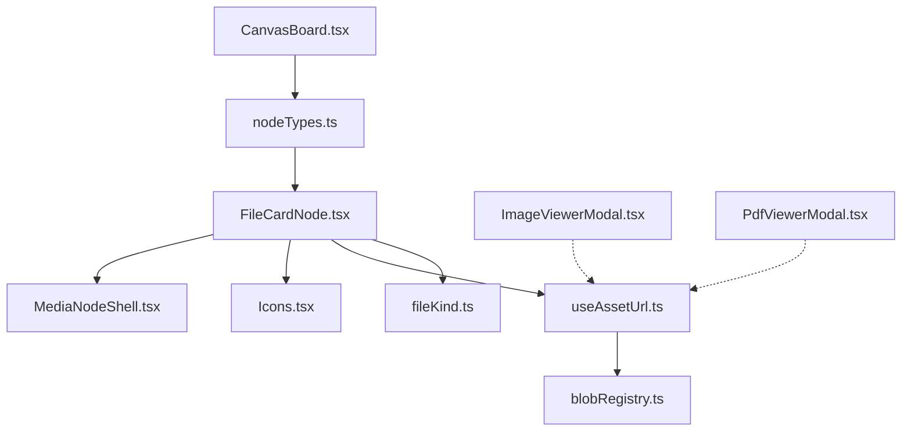
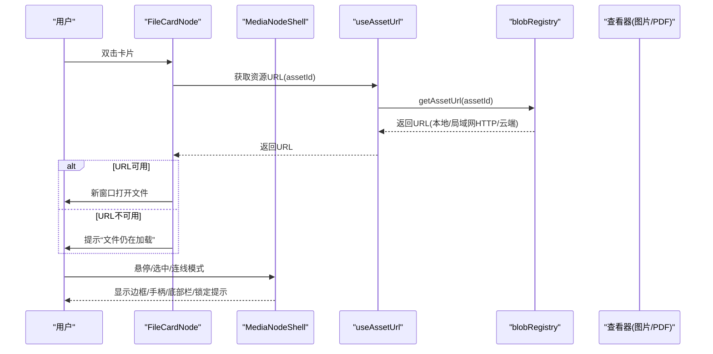
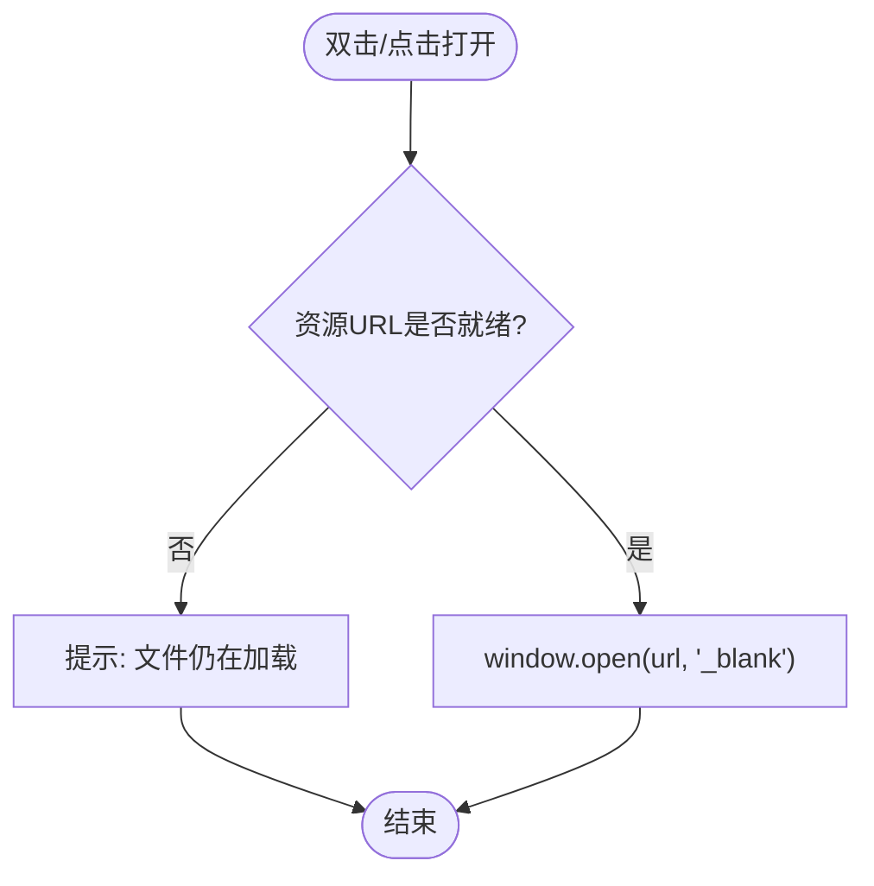
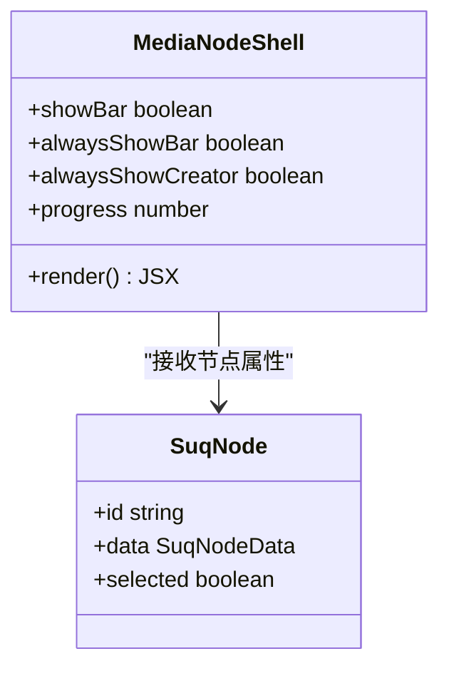
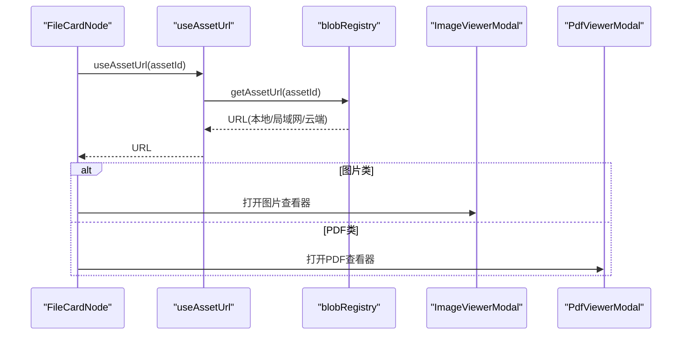
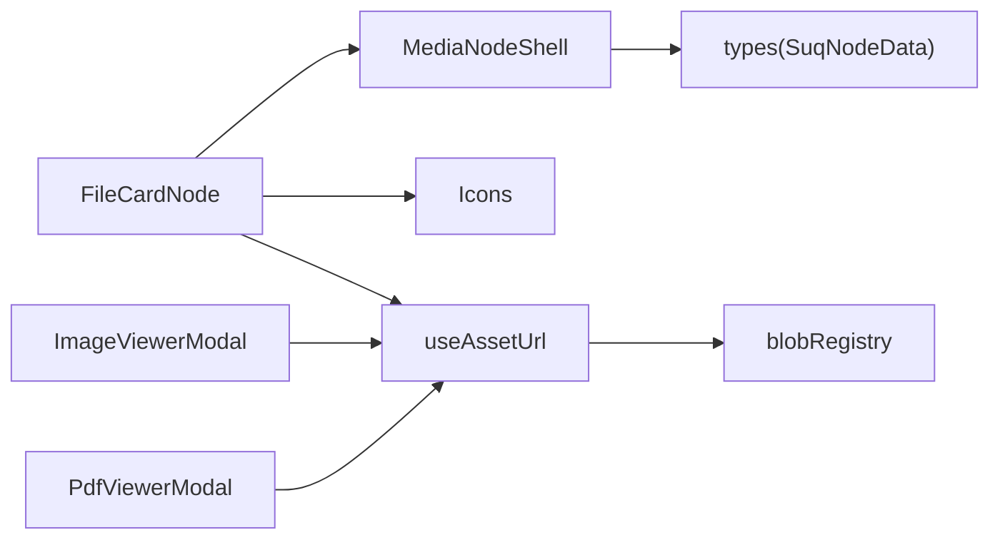

# 文件卡片节点 (FileCardNode)

<cite>
**本文引用的文件**
- [FileCardNode.tsx](file://src/canvas/nodes/FileCardNode.tsx)
- [MediaNodeShell.tsx](file://src/canvas/nodes/MediaNodeShell.tsx)
- [Icons.tsx](file://src/canvas/nodes/Icons.tsx)
- [nodeTypes.ts](file://src/canvas/nodes/nodeTypes.ts)
- [useAssetUrl.ts](file://src/media/useAssetUrl.ts)
- [blobRegistry.ts](file://src/media/blobRegistry.ts)
- [fileKind.ts](file://src/media/fileKind.ts)
- [ImageViewerModal.tsx](file://src/components/ImageViewerModal.tsx)
- [PdfViewerModal.tsx](file://src/components/PdfViewerModal.tsx)
- [CanvasBoard.tsx](file://src/canvas/CanvasBoard.tsx)
- [types.ts](file://src/types.ts)
</cite>

## 目录
1. [简介](#简介)
2. [项目结构](#项目结构)
3. [核心组件](#核心组件)
4. [架构总览](#架构总览)
5. [详细组件分析](#详细组件分析)
6. [依赖关系分析](#依赖关系分析)
7. [性能与加载策略](#性能与加载策略)
8. [故障排查指南](#故障排查指南)
9. [结论](#结论)
10. [附录：使用示例与扩展方案](#附录使用示例与扩展方案)

## 简介
文件卡片节点用于在画布中以“卡片”形式展示任意文件，并提供打开、下载等交互。它复用媒体节点外壳（MediaNodeShell）提供统一的边框、连线手柄、选中态、协作锁定等能力；自身负责文件名、文件大小、图标与操作按钮的布局与交互。通过媒体系统（useAssetUrl、blobRegistry）获取资源 URL，结合图片、PDF、视频等查看器完成预览体验。

## 项目结构
文件卡片节点位于画布节点层，围绕以下关键文件组织：
- 节点实现：FileCardNode.tsx
- 通用外壳：MediaNodeShell.tsx（边框、手柄、底部栏、进度遮罩、协作锁定）
- 图标库：Icons.tsx（文件、打开、下载等）
- 类型定义：types.ts（SuqNodeData、MediaKind 等）
- 资源 URL 获取：useAssetUrl.ts、blobRegistry.ts
- 文件类型识别与格式化：fileKind.ts
- 预览与查看器：ImageViewerModal.tsx、PdfViewerModal.tsx
- 画布集成：nodeTypes.ts、CanvasBoard.tsx

图表来源
- [FileCardNode.tsx:10-79](file://src/canvas/nodes/FileCardNode.tsx#L10-L79)
- [MediaNodeShell.tsx:32-150](file://src/canvas/nodes/MediaNodeShell.tsx#L32-L150)
- [useAssetUrl.ts:10-44](file://src/media/useAssetUrl.ts#L10-L44)
- [blobRegistry.ts:84-126](file://src/media/blobRegistry.ts#L84-L126)
- [nodeTypes.ts:14-26](file://src/canvas/nodes/nodeTypes.ts#L14-L26)
- [CanvasBoard.tsx:195-236](file://src/canvas/CanvasBoard.tsx#L195-L236)

章节来源
- [FileCardNode.tsx:10-79](file://src/canvas/nodes/FileCardNode.tsx#L10-L79)
- [MediaNodeShell.tsx:32-150](file://src/canvas/nodes/MediaNodeShell.tsx#L32-L150)
- [nodeTypes.ts:14-26](file://src/canvas/nodes/nodeTypes.ts#L14-L26)
- [CanvasBoard.tsx:195-236](file://src/canvas/CanvasBoard.tsx#L195-L236)

## 核心组件
- FileCardNode：渲染文件卡片的主体内容，包括缩略图占位区、文件名、文件大小、打开/下载按钮，以及双击打开行为。
- MediaNodeShell：提供统一节点外壳，包含四边连接手柄、选中态样式、底部名称栏、创建者角标、播放进度遮罩、协作锁定提示。
- useAssetUrl / blobRegistry：负责从本地 IndexedDB、局域网或云端获取资源 URL，并处理重试与错误提示。
- fileKind：文件类型检测与字节大小格式化。
- ImageViewerModal / PdfViewerModal：图片与 PDF 的独立查看器，支持缩放、翻页、下载等。

章节来源
- [FileCardNode.tsx:10-79](file://src/canvas/nodes/FileCardNode.tsx#L10-L79)
- [MediaNodeShell.tsx:32-150](file://src/canvas/nodes/MediaNodeShell.tsx#L32-L150)
- [useAssetUrl.ts:10-44](file://src/media/useAssetUrl.ts#L10-L44)
- [blobRegistry.ts:84-126](file://src/media/blobRegistry.ts#L84-L126)
- [fileKind.ts:3-23](file://src/media/fileKind.ts#L3-L23)
- [ImageViewerModal.tsx:14-165](file://src/components/ImageViewerModal.tsx#L14-L165)
- [PdfViewerModal.tsx:7-146](file://src/components/PdfViewerModal.tsx#L7-L146)

## 架构总览
文件卡片节点作为 React Flow 的一个自定义节点类型注册到画布中，渲染时依赖媒体系统提供的资源 URL，并通过查看器完成预览。整体数据流如下：

图表来源
- [FileCardNode.tsx:10-79](file://src/canvas/nodes/FileCardNode.tsx#L10-L79)
- [MediaNodeShell.tsx:32-150](file://src/canvas/nodes/MediaNodeShell.tsx#L32-L150)
- [useAssetUrl.ts:10-44](file://src/media/useAssetUrl.ts#L10-L44)
- [blobRegistry.ts:84-126](file://src/media/blobRegistry.ts#L84-L126)

## 详细组件分析

### FileCardNode：布局与交互
- 布局设计
  - 左侧为固定尺寸的文件图标区域，用于表示“文件”类型。
  - 中间区域展示文件名（最多两行截断）和文件大小（格式化后的 KB/MB/GB）。
  - 右侧为操作区，包含“打开”和“下载”两个按钮，禁用态与加载态有明确视觉反馈。
- 交互功能
  - 双击卡片或点击“打开”按钮：若资源 URL 已就绪则在新标签页打开；否则提示“文件仍在加载”。
  - 点击“下载”：通过 a 标签触发下载，未就绪时阻止默认行为并提示。
  - 事件冒泡控制：对按钮和容器进行 stopPropagation，避免误触画布拖拽或选择。
- 样式定制
  - 通过 MediaNodeShell 的 data.borderColor 可定制边框颜色。
  - 背景色可通过主题变量或 backgroundColor 字段配合外层样式调整。
  - 尺寸由画布节点尺寸决定，内部采用弹性布局自适应。

图表来源
- [FileCardNode.tsx:15-21](file://src/canvas/nodes/FileCardNode.tsx#L15-L21)
- [FileCardNode.tsx:44-74](file://src/canvas/nodes/FileCardNode.tsx#L44-L74)

章节来源
- [FileCardNode.tsx:10-79](file://src/canvas/nodes/FileCardNode.tsx#L10-L79)

### MediaNodeShell：外壳与协作
- 边框与选中态：根据 selected 状态添加选中样式，支持 data.borderColor 自定义边框。
- 连线手柄：四边 source/target 手柄，连线模式下边缘条带热区可快速连线。
- 底部栏：显示 kind 图标与 label，支持 alwaysShowBar 始终显示。
- 创建者角标：hover/selected/alwaysShowCreator 时显示 createdByName。
- 播放进度遮罩：progress 参数以百分比宽度覆盖节点，用于媒体播放进度可视化。
- 协作锁定：当其他用户正在编辑此节点时，显示锁定提示并拦截指针事件。

图表来源
- [MediaNodeShell.tsx:20-30](file://src/canvas/nodes/MediaNodeShell.tsx#L20-L30)
- [MediaNodeShell.tsx:32-150](file://src/canvas/nodes/MediaNodeShell.tsx#L32-L150)
- [types.ts:66-107](file://src/types.ts#L66-L107)

章节来源
- [MediaNodeShell.tsx:32-150](file://src/canvas/nodes/MediaNodeShell.tsx#L32-L150)
- [types.ts:66-107](file://src/types.ts#L66-L107)

### 资源获取与预览：useAssetUrl 与 blobRegistry
- useAssetUrl：封装 getAssetUrl，具备重试机制与错误提示，返回资源 URL。
- blobRegistry：
  - 优先本地 IndexedDB Blob，其次局域网 HTTP 流式地址，最后云端下载。
  - 维护 URL 缓存与缩略图缓存，避免重复请求。
  - 针对视频封面生成并发限制与黑帧自检，确保缩略图质量。
- 图片预览：ImageViewerModal 支持缩放、适应窗口、下载原始 PSD 或图片。
- PDF 预览：PdfViewerModal 懒加载 pdfjs-dist，支持翻页、键盘导航、渲染失败提示。

图表来源
- [useAssetUrl.ts:10-44](file://src/media/useAssetUrl.ts#L10-L44)
- [blobRegistry.ts:84-126](file://src/media/blobRegistry.ts#L84-L126)
- [ImageViewerModal.tsx:14-165](file://src/components/ImageViewerModal.tsx#L14-L165)
- [PdfViewerModal.tsx:7-146](file://src/components/PdfViewerModal.tsx#L7-L146)

章节来源
- [useAssetUrl.ts:10-44](file://src/media/useAssetUrl.ts#L10-L44)
- [blobRegistry.ts:84-126](file://src/media/blobRegistry.ts#L84-L126)
- [ImageViewerModal.tsx:14-165](file://src/components/ImageViewerModal.tsx#L14-L165)
- [PdfViewerModal.tsx:7-146](file://src/components/PdfViewerModal.tsx#L7-L146)

### 文件类型识别与展示：fileKind 与 Icons
- fileKind.detectKind：基于 MIME 与扩展名判断媒体类型（image/video/audio/pdf/markdown/text/file/psd）。
- fileKind.formatBytes：将字节数格式化为人类可读字符串（B/KB/MB/GB）。
- Icons.KindIcon：根据 kind 渲染对应图标（图片、视频、音频、文本、PDF、PSD 等），文件卡片默认使用 FileIcon。

章节来源
- [fileKind.ts:3-23](file://src/media/fileKind.ts#L3-L23)
- [Icons.tsx:633-656](file://src/canvas/nodes/Icons.tsx#L633-L656)

### 画布集成：节点类型与拖放导入
- nodeTypes：将 fileCard 映射到 FileCardNode，供 React Flow 渲染。
- CanvasBoard：处理拖拽文件进入画布，调用 importFiles 将文件转为节点（含 fileCard），并定位到鼠标位置。

章节来源
- [nodeTypes.ts:14-26](file://src/canvas/nodes/nodeTypes.ts#L14-L26)
- [CanvasBoard.tsx:210-236](file://src/canvas/CanvasBoard.tsx#L210-L236)

## 依赖关系分析
- FileCardNode 依赖 MediaNodeShell 提供外壳能力，依赖 useAssetUrl 获取资源 URL，依赖 Icons 提供图标，依赖 fileKind 格式化大小。
- MediaNodeShell 依赖 types 中的 SuqNodeData 字段（如 borderColor、kind、label、createdByName）。
- useAssetUrl 依赖 blobRegistry 的资源获取逻辑，并在失败时通过 uiStore 的 toast 提示。
- 查看器（ImageViewerModal、PdfViewerModal）通过 useAssetUrl 获取资源 URL，并各自实现预览交互。

图表来源
- [FileCardNode.tsx:10-79](file://src/canvas/nodes/FileCardNode.tsx#L10-L79)
- [MediaNodeShell.tsx:32-150](file://src/canvas/nodes/MediaNodeShell.tsx#L32-L150)
- [useAssetUrl.ts:10-44](file://src/media/useAssetUrl.ts#L10-L44)
- [blobRegistry.ts:84-126](file://src/media/blobRegistry.ts#L84-L126)
- [types.ts:66-107](file://src/types.ts#L66-L107)
- [ImageViewerModal.tsx:14-165](file://src/components/ImageViewerModal.tsx#L14-L165)
- [PdfViewerModal.tsx:7-146](file://src/components/PdfViewerModal.tsx#L7-L146)

## 性能与加载策略
- 资源 URL 缓存：blobRegistry 维护 urlCache 与 thumbCache，避免重复请求与内存泄漏（必要时释放 blob URL）。
- 重试与超时：useAssetUrl 对资源加载失败进行有限次重试，避免网络抖动导致永久失败。
- 视频封面并发控制：blobRegistry 限制同时抓帧数量，防止阻塞浏览器连接池影响播放。
- 懒加载 PDF：PdfViewerModal 动态 import pdfjs-dist，减少首屏体积。
- 协作锁定：MediaNodeShell 在他人编辑时阻止交互，提升多端协作稳定性。

[本节为通用性能讨论，不直接分析具体代码片段]

## 故障排查指南
- 文件仍在加载
  - 现象：点击打开/下载时提示“文件仍在加载”。
  - 原因：useAssetUrl 尚未返回有效 URL（可能资源仍在传输或拉取失败）。
  - 处理：等待重试完成或检查局域网/云端资源可用性。
- 资源加载失败
  - 现象：toast 提示“资源加载失败”。
  - 原因：blobRegistry 无法从本地/局域网/云端获取资源。
  - 处理：确认资产是否存在、网络连通性、跨域配置（尤其是局域网 HTTP 流式地址）。
- 图片/PSD 预览失败
  - 现象：图片查看器无法显示或提示“PSD 无法预览”。
  - 原因：缩略图生成失败或格式不受支持。
  - 处理：尝试重新生成缩略图或更换格式。
- PDF 渲染失败
  - 现象：页面渲染失败或打开失败。
  - 原因：pdfjs-dist 加载异常或 PDF 损坏。
  - 处理：检查网络与 CDN，或替换 PDF 文件。

章节来源
- [FileCardNode.tsx:15-21](file://src/canvas/nodes/FileCardNode.tsx#L15-L21)
- [useAssetUrl.ts:10-44](file://src/media/useAssetUrl.ts#L10-L44)
- [blobRegistry.ts:84-126](file://src/media/blobRegistry.ts#L84-L126)
- [ImageViewerModal.tsx:42-60](file://src/components/ImageViewerModal.tsx#L42-L60)
- [PdfViewerModal.tsx:24-39](file://src/components/PdfViewerModal.tsx#L24-L39)

## 结论
文件卡片节点以简洁的卡片形态承载任意文件，提供打开与下载的核心交互，并通过媒体系统与查看器实现图片、PDF 等类型的预览。借助 MediaNodeShell 的统一外壳，节点具备一致的边框、连线、协作与进度展示能力。资源获取层具备缓存、重试与并发控制，保障在多端协作与网络波动场景下的稳定性。

[本节为总结性内容，不直接分析具体代码片段]

## 附录：使用示例与扩展方案

### 使用示例
- 在画布中添加文件卡片节点
  - 通过拖拽文件到画布，系统会识别文件并创建对应节点（包含 fileCard）。
  - 节点类型映射由 nodeTypes 管理，fileCard 指向 FileCardNode。
- 双击打开与下载
  - 双击卡片或点击“打开”按钮在新窗口打开文件。
  - 点击“下载”按钮触发下载，未就绪时提示等待。
- 查看图片与 PDF
  - 图片类资源可通过图片查看器放大、缩放、适应窗口。
  - PDF 类资源通过 PDF 查看器分页浏览，支持键盘导航。

章节来源
- [nodeTypes.ts:14-26](file://src/canvas/nodes/nodeTypes.ts#L14-L26)
- [CanvasBoard.tsx:210-236](file://src/canvas/CanvasBoard.tsx#L210-L236)
- [FileCardNode.tsx:15-74](file://src/canvas/nodes/FileCardNode.tsx#L15-L74)
- [ImageViewerModal.tsx:14-165](file://src/components/ImageViewerModal.tsx#L14-L165)
- [PdfViewerModal.tsx:7-146](file://src/components/PdfViewerModal.tsx#L7-L146)

### 自定义文件类型扩展方案
- 新增文件类型识别
  - 在 fileKind.detectKind 中增加新的扩展名或 MIME 匹配规则，返回新的 MediaKind。
- 新增图标与底部栏显示
  - 在 Icons.KindIcon 中为新 MediaKind 添加对应图标分支。
- 新增预览查看器
  - 为新的文件类型实现专用查看器组件（类似 ImageViewerModal/PdfViewerModal），并通过 useAssetUrl 获取资源 URL。
- 节点行为扩展
  - 如需在 FileCardNode 中为新类型提供特殊交互，可在组件内根据 data.kind 或 data.mime 分支处理。

章节来源
- [fileKind.ts:3-23](file://src/media/fileKind.ts#L3-L23)
- [Icons.tsx:633-656](file://src/canvas/nodes/Icons.tsx#L633-L656)
- [types.ts:3-14](file://src/types.ts#L3-L14)
- [FileCardNode.tsx:10-79](file://src/canvas/nodes/FileCardNode.tsx#L10-L79)