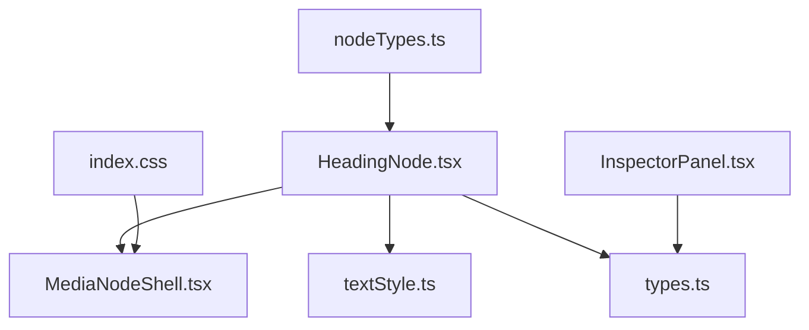
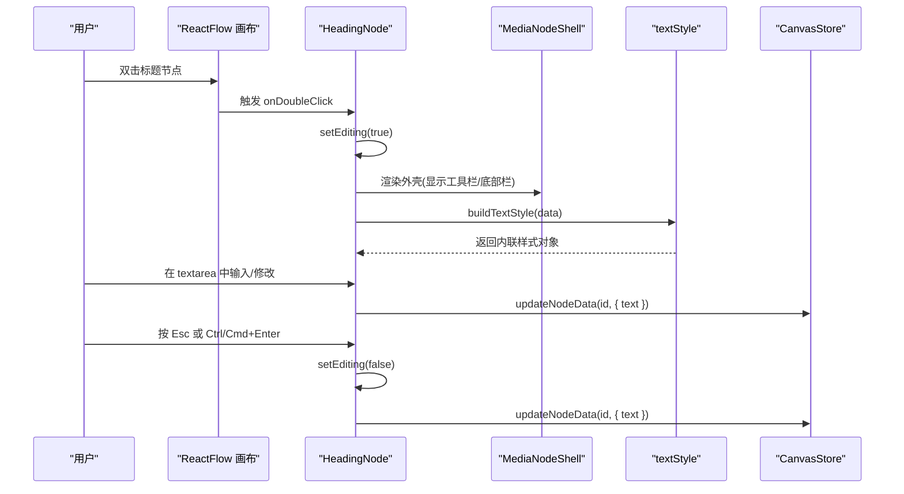
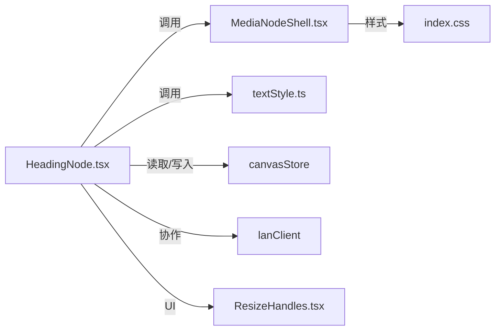

# 标题节点 (HeadingNode)

<cite>
**本文引用的文件**
- [HeadingNode.tsx](file://src/canvas/nodes/HeadingNode.tsx)
- [textStyle.ts](file://src/canvas/nodes/textStyle.ts)
- [nodeTypes.ts](file://src/canvas/nodes/nodeTypes.ts)
- [MediaNodeShell.tsx](file://src/canvas/nodes/MediaNodeShell.tsx)
- [types.ts](file://src/types.ts)
- [index.css](file://src/index.css)
- [InspectorPanel.tsx](file://src/components/InspectorPanel.tsx)
</cite>

## 目录
1. [简介](#简介)
2. [项目结构](#项目结构)
3. [核心组件](#核心组件)
4. [架构总览](#架构总览)
5. [详细组件分析](#详细组件分析)
6. [依赖关系分析](#依赖关系分析)
7. [性能考量](#性能考量)
8. [故障排查指南](#故障排查指南)
9. [结论](#结论)
10. [附录：使用示例与主题定制](#附录使用示例与主题定制)

## 简介
本文件面向画布中的“标题节点（HeadingNode）”，系统性说明其实现原理、层级渲染与样式应用、编辑交互、布局行为、与其他元素的组合方式、无障碍支持与键盘导航，以及主题定制方案。目标是帮助开发者快速理解并扩展该节点的能力。

## 项目结构
标题节点位于画布节点模块中，作为 ReactFlow 的一个自定义节点类型注册并使用通用外壳进行统一交互与连线能力封装。

图表来源
- [HeadingNode.tsx:1-124](file://src/canvas/nodes/HeadingNode.tsx#L1-L124)
- [MediaNodeShell.tsx:1-151](file://src/canvas/nodes/MediaNodeShell.tsx#L1-L151)
- [textStyle.ts:1-22](file://src/canvas/nodes/textStyle.ts#L1-L22)
- [nodeTypes.ts:1-27](file://src/canvas/nodes/nodeTypes.ts#L1-L27)
- [types.ts:1-112](file://src/types.ts#L1-L112)
- [index.css:1-120](file://src/index.css#L1-L120)
- [InspectorPanel.tsx:491-742](file://src/components/InspectorPanel.tsx#L491-L742)

章节来源
- [HeadingNode.tsx:1-124](file://src/canvas/nodes/HeadingNode.tsx#L1-L124)
- [nodeTypes.ts:1-27](file://src/canvas/nodes/nodeTypes.ts#L1-L27)

## 核心组件
- HeadingNode：负责标题节点的渲染、编辑态切换、层级选择、字号调节、文本提交与同步。
- MediaNodeShell：提供节点外壳、连接手柄、选中态、底部信息栏、协作锁定遮罩等通用能力。
- textStyle：集中构建文本样式（对齐、字号、字体、颜色、粗细、斜体、下划线、行高）。
- types：定义节点数据模型与标题级别类型。
- index.css：全局主题变量与 Tailwind 主题映射，支撑深色/浅色主题。
- InspectorPanel：属性面板中对标题级别的可视化控制入口。

章节来源
- [HeadingNode.tsx:17-124](file://src/canvas/nodes/HeadingNode.tsx#L17-L124)
- [MediaNodeShell.tsx:32-151](file://src/canvas/nodes/MediaNodeShell.tsx#L32-L151)
- [textStyle.ts:10-21](file://src/canvas/nodes/textStyle.ts#L10-L21)
- [types.ts:16-22](file://src/types.ts#L16-L22)
- [index.css:25-120](file://src/index.css#L25-L120)
- [InspectorPanel.tsx:659-676](file://src/components/InspectorPanel.tsx#L659-L676)

## 架构总览
标题节点通过 ReactFlow 的 Node 机制渲染，内部以 MediaNodeShell 为容器，结合内置工具栏与编辑器完成交互；样式由 Tailwind 类与 CSS 变量共同驱动，支持主题切换。

图表来源
- [HeadingNode.tsx:24-48](file://src/canvas/nodes/HeadingNode.tsx#L24-L48)
- [HeadingNode.tsx:91-117](file://src/canvas/nodes/HeadingNode.tsx#L91-L117)
- [textStyle.ts:10-21](file://src/canvas/nodes/textStyle.ts#L10-L21)

## 详细组件分析

### HeadingNode 组件
- 层级与样式映射：根据 level 选择预设的 Tailwind 类组合，实现不同层级的字体大小与字重差异。
- 编辑模式：
  - 自动进入编辑：当 data.autoEdit 为真时，首次渲染即进入编辑态并重置标志。
  - 聚焦与全选：进入编辑态后自动聚焦并选中文本。
  - 提交逻辑：失焦、Esc、Ctrl/Cmd+Enter 均可提交文本到 store。
- 工具栏：
  - 层级切换按钮：默认/ H1/H2/H3，点击更新 level 与 label。
  - 字号滑块：范围 8–72，实时更新 fontSize。
- 文本展示：
  - 非编辑态：使用 div 展示文本，支持换行与断词。
  - 编辑态：textarea 自适应行数，占位符提示当前层级。
- 垂直对齐：通过 V_JUSTIFY 将 textAlignV 映射为 flex 对齐值，影响内容在节点内的纵向位置。
- 协作与锁定：借助 MediaNodeShell 的协作锁定状态，避免冲突编辑。

章节来源
- [HeadingNode.tsx:10-15](file://src/canvas/nodes/HeadingNode.tsx#L10-L15)
- [HeadingNode.tsx:24-48](file://src/canvas/nodes/HeadingNode.tsx#L24-L48)
- [HeadingNode.tsx:54-83](file://src/canvas/nodes/HeadingNode.tsx#L54-L83)
- [HeadingNode.tsx:85-121](file://src/canvas/nodes/HeadingNode.tsx#L85-L121)

#### 层级样式映射（H0-H3）
- H0（默认）：基础字号、常规字重
- H1：较大字号、粗体
- H2：中等偏大字号、半粗体
- H3：基础字号、中等字重

章节来源
- [HeadingNode.tsx:10-15](file://src/canvas/nodes/HeadingNode.tsx#L10-L15)

### MediaNodeShell 外壳
- 连接手柄：四边 source/target 手柄，支持连线模式下的边缘热区。
- 选中态与悬停：选中时高亮边框，悬停显示手柄。
- 底部栏：显示图标与标签，便于识别节点类型与名称。
- 协作锁定：当其他用户正在编辑时，显示遮罩并禁用交互。
- 进度遮罩：用于媒体播放进度可视化（标题节点未使用）。

章节来源
- [MediaNodeShell.tsx:32-151](file://src/canvas/nodes/MediaNodeShell.tsx#L32-L151)

### 文本样式系统（textStyle）
- 水平对齐：textAlign 直接映射到 CSS。
- 字号/字体/颜色：fontSize、fontFamily、color 来自节点数据。
- 字重/斜体/下划线：bold/italic/underline 分别映射为 fontWeight/fontStyle/textDecoration。
- 行高：lineHeight 透传至样式对象。
- 垂直对齐：V_JUSTIFY 将 top/middle/bottom 映射为 flex-start/center/flex-end。

章节来源
- [textStyle.ts:4-21](file://src/canvas/nodes/textStyle.ts#L4-L21)

### 类型与数据模型（types）
- 媒体类型：包含 heading 在内的多种节点类型。
- 标题级别：HeadingLevelOrNone 支持 0（默认）、1、2、3。
- 文本相关字段：textAlign、textAlignV、fontSize、fontFamily、textColor、bold、italic、underline、lineHeight。
- 节点数据接口：SuqNodeData 承载所有节点可配置项。

章节来源
- [types.ts:3-22](file://src/types.ts#L3-L22)
- [types.ts:66-98](file://src/types.ts#L66-L98)

### 节点注册（nodeTypes）
- 将 heading 类型映射到 HeadingNode 组件，供 ReactFlow 渲染。

章节来源
- [nodeTypes.ts:14-26](file://src/canvas/nodes/nodeTypes.ts#L14-L26)

### 属性面板集成（InspectorPanel）
- 标题级别：提供分段控件切换 H0/H1/H2/H3，并同步更新 label。
- 文字样式：支持水平/垂直对齐、加粗、斜体、下划线、行高等设置，适用于 heading 节点。

章节来源
- [InspectorPanel.tsx:516-557](file://src/components/InspectorPanel.tsx#L516-L557)
- [InspectorPanel.tsx:659-676](file://src/components/InspectorPanel.tsx#L659-L676)

## 依赖关系分析
- HeadingNode 依赖：
  - @xyflow/react：NodeToolbar、Position、NodeProps 等。
  - canvasStore：updateNodeData 持久化节点数据。
  - MediaNodeShell：统一外壳与协作能力。
  - textStyle：文本样式构建。
  - lanClient：协同编辑时的编辑状态广播。
  - ResizeHandles：选中时显示尺寸调整手柄。
- 主题与样式：
  - index.css 定义 CSS 变量并通过 Tailwind 主题注入，使节点颜色、背景、边框等跟随主题切换。

图表来源
- [HeadingNode.tsx:1-8](file://src/canvas/nodes/HeadingNode.tsx#L1-L8)
- [MediaNodeShell.tsx:1-12](file://src/canvas/nodes/MediaNodeShell.tsx#L1-L12)
- [index.css:1-15](file://src/index.css#L1-L15)

章节来源
- [HeadingNode.tsx:1-8](file://src/canvas/nodes/HeadingNode.tsx#L1-L8)
- [MediaNodeShell.tsx:1-12](file://src/canvas/nodes/MediaNodeShell.tsx#L1-L12)
- [index.css:1-15](file://src/index.css#L1-L15)

## 性能考量
- 使用 memo 包裹 HeadingNode，减少不必要的重渲染。
- 文本编辑时使用 textarea，避免复杂富文本解析开销。
- 样式计算集中在 buildTextStyle，复用性强且易于缓存。
- 工具栏仅在编辑态显示，降低常驻 UI 成本。
- 响应式布局基于 Flexbox，配合 Tailwind 类，适配不同节点高度与内容长度。

[本节为通用性能建议，不直接分析具体代码片段]

## 故障排查指南
- 无法进入编辑态：
  - 检查 data.autoEdit 是否被正确置位并在首次渲染后重置。
  - 确认双击事件未被上层捕获阻止。
- 文本未保存：
  - 确认 onBlur、Esc、Ctrl/Cmd+Enter 回调是否正确触发并提交数据。
- 层级切换无效：
  - 检查 level 更新是否同时更新了 label，确保属性面板与节点显示一致。
- 样式不生效：
  - 确认 Tailwind 主题变量已正确注入，CSS 变量未被覆盖。
  - 检查 buildTextStyle 传入的 data 字段是否齐全。
- 协作锁定导致不可编辑：
  - 查看 MediaNodeShell 的 lock 状态，确认是否有其他用户正在编辑该节点。

章节来源
- [HeadingNode.tsx:24-48](file://src/canvas/nodes/HeadingNode.tsx#L24-L48)
- [HeadingNode.tsx:91-117](file://src/canvas/nodes/HeadingNode.tsx#L91-L117)
- [MediaNodeShell.tsx:44-66](file://src/canvas/nodes/MediaNodeShell.tsx#L44-L66)

## 结论
HeadingNode 以简洁的数据驱动方式实现了多层级标题的渲染与编辑，结合通用的 MediaNodeShell 外壳与统一的样式系统，提供了良好的可扩展性与主题一致性。通过属性面板与内置工具栏，用户可以灵活调整层级、字号与文本样式，满足常见排版需求。

[本节为总结性内容，不直接分析具体文件]

## 附录：使用示例与主题定制

### 使用示例
- 插入标题节点：
  - 在画布中添加类型为 heading 的节点，默认 level 为 1。
  - 双击进入编辑态，输入标题文本，失焦或按快捷键提交。
- 调整层级与字号：
  - 在节点顶部工具栏选择 H0/H1/H2/H3，或使用属性面板的“标题级别”分段控件。
  - 拖动字号滑块调整字体大小（8–72）。
- 文本样式：
  - 在属性面板中设置水平/垂直对齐、加粗、斜体、下划线、行高。
  - 使用 buildTextStyle 生成的样式对象应用于文本容器。

章节来源
- [HeadingNode.tsx:54-83](file://src/canvas/nodes/HeadingNode.tsx#L54-L83)
- [InspectorPanel.tsx:516-557](file://src/components/InspectorPanel.tsx#L516-L557)
- [InspectorPanel.tsx:659-676](file://src/components/InspectorPanel.tsx#L659-L676)

### 主题定制方案
- 全局主题变量：
  - 通过 index.css 的 :root 与 html.light 定义深色/浅色主题变量，如 --main、--panel、--nodebg 等。
  - Tailwind 主题通过 @theme inline 将 CSS 变量映射为 color-* 工具类，节点文本与背景色随之变化。
- 节点外观：
  - 节点边框颜色可通过 data.borderColor 设置。
  - 文本颜色、字号、字体等通过 data.textColor、data.fontSize、data.fontFamily 控制。
- 自定义层级样式：
  - 可在 LEVEL_STYLE 中扩展更多层级或调整字体大小与字重，以满足品牌规范。

章节来源
- [index.css:25-120](file://src/index.css#L25-L120)
- [HeadingNode.tsx:10-15](file://src/canvas/nodes/HeadingNode.tsx#L10-L15)
- [textStyle.ts:10-21](file://src/canvas/nodes/textStyle.ts#L10-L21)

### 无障碍访问与键盘导航
- 键盘操作：
  - 编辑态支持 Esc 退出编辑、Ctrl/Cmd+Enter 提交文本。
  - 工具栏按钮具备语义化标题（title），便于屏幕阅读器识别。
- 焦点管理：
  - 进入编辑态自动聚焦并选中文本，提升可访问性体验。
- 协作提示：
  - 协作锁定时显示遮罩与提示文案，明确当前不可编辑状态。

章节来源
- [HeadingNode.tsx:31-37](file://src/canvas/nodes/HeadingNode.tsx#L31-L37)
- [HeadingNode.tsx:100-104](file://src/canvas/nodes/HeadingNode.tsx#L100-L104)
- [MediaNodeShell.tsx:141-147](file://src/canvas/nodes/MediaNodeShell.tsx#L141-L147)