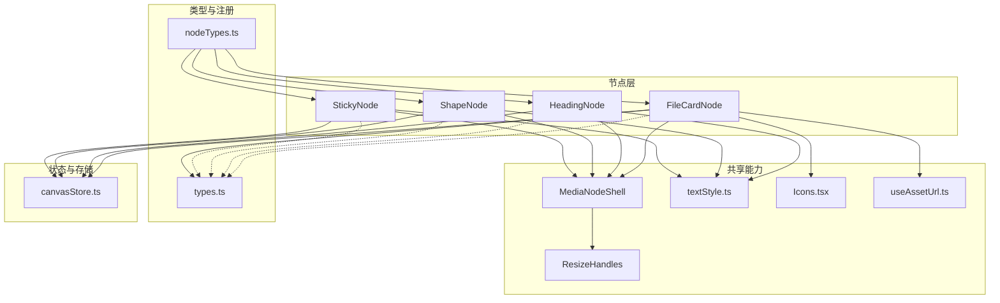
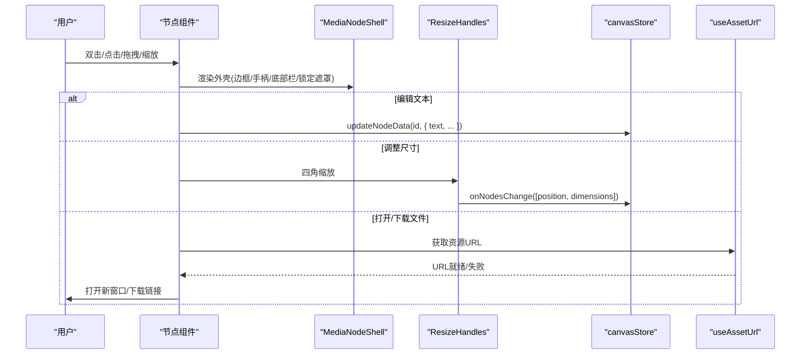
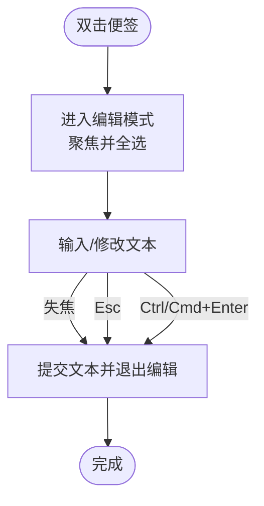
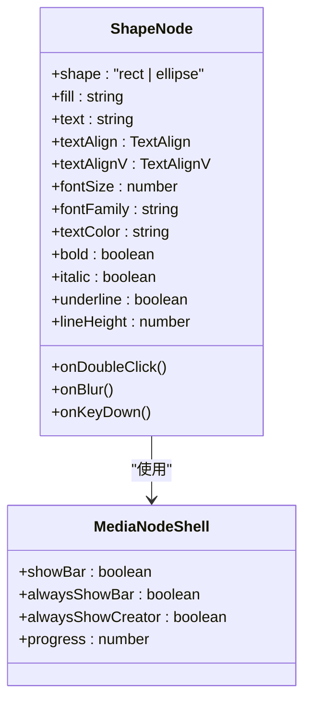
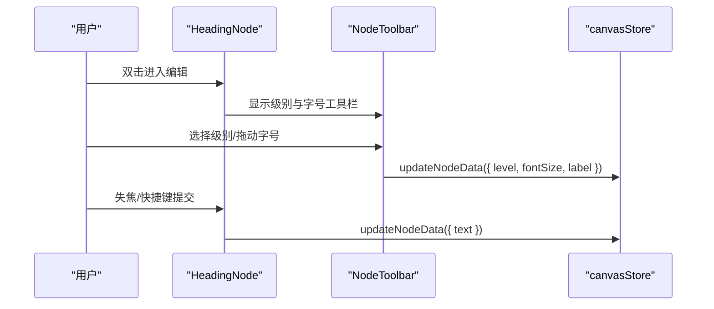
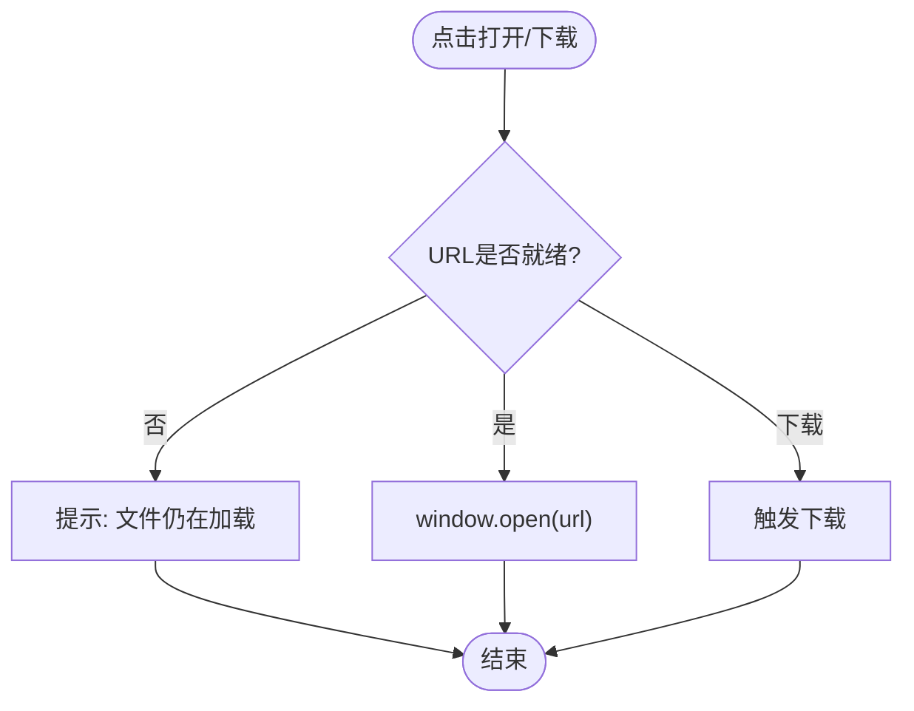
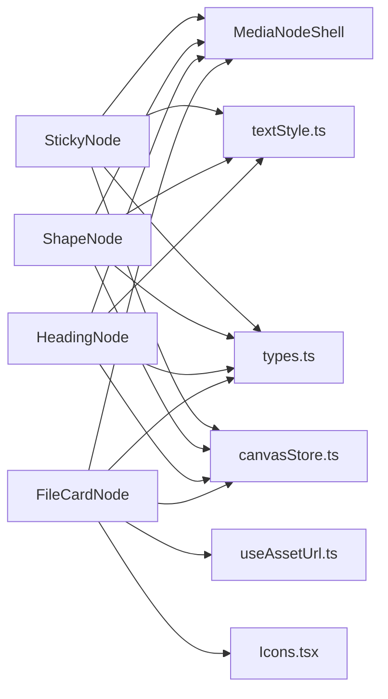

# 界面节点

<cite>
**本文引用的文件**
- [StickyNode.tsx](file://src/canvas/nodes/StickyNode.tsx)
- [ShapeNode.tsx](file://src/canvas/nodes/ShapeNode.tsx)
- [HeadingNode.tsx](file://src/canvas/nodes/HeadingNode.tsx)
- [FileCardNode.tsx](file://src/canvas/nodes/FileCardNode.tsx)
- [MediaNodeShell.tsx](file://src/canvas/nodes/MediaNodeShell.tsx)
- [ResizeHandles.tsx](file://src/canvas/nodes/ResizeHandles.tsx)
- [textStyle.ts](file://src/canvas/nodes/textStyle.ts)
- [nodeTypes.ts](file://src/canvas/nodes/nodeTypes.ts)
- [types.ts](file://src/types.ts)
- [useAssetUrl.ts](file://src/media/useAssetUrl.ts)
- [Icons.tsx](file://src/canvas/nodes/Icons.tsx)
- [fileKind.ts](file://src/media/fileKind.ts)
- [canvasStore.ts](file://src/store/canvasStore.ts)
</cite>

## 目录
1. [简介](#简介)
2. [项目结构](#项目结构)
3. [核心组件](#核心组件)
4. [架构总览](#架构总览)
5. [详细组件分析](#详细组件分析)
6. [依赖关系分析](#依赖关系分析)
7. [性能考量](#性能考量)
8. [故障排查指南](#故障排查指南)
9. [结论](#结论)
10. [附录：使用示例与自定义样式方案](#附录使用示例与自定义样式方案)

## 简介
本章节面向界面节点的使用者与扩展者，系统性说明便签节点（StickyNode）、形状节点（ShapeNode）、标题节点（HeadingNode）和文件卡片节点（FileCardNode）的实现原理、用户交互设计、样式定制选项、布局行为、事件处理机制，以及响应式设计与无障碍访问支持。文档同时提供常见使用示例与自定义样式方案，帮助快速上手并安全扩展。

## 项目结构
界面节点位于 src/canvas/nodes 目录下，采用“按功能拆分”的组织方式：
- 节点实现：StickyNode、ShapeNode、HeadingNode、FileCardNode 等
- 通用外壳：MediaNodeShell 统一处理边框、手柄、底部信息栏、协作者锁定提示、进度遮罩等
- 工具与类型：textStyle.ts 提供文本样式构建；types.ts 定义节点数据类型与枚举
- 资源与图标：useAssetUrl.ts 负责资源 URL 获取；Icons.tsx 提供统一图标
- 存储与状态：canvasStore.ts 管理节点数据变更、历史撤销/重做、连接等
- 注册表：nodeTypes.ts 将各节点类型注册到 React Flow

图表来源
- [nodeTypes.ts:14-26](file://src/canvas/nodes/nodeTypes.ts#L14-L26)
- [MediaNodeShell.tsx:32-151](file://src/canvas/nodes/MediaNodeShell.tsx#L32-L151)
- [ResizeHandles.tsx:35-118](file://src/canvas/nodes/ResizeHandles.tsx#L35-L118)
- [textStyle.ts:1-22](file://src/canvas/nodes/textStyle.ts#L1-L22)
- [useAssetUrl.ts:10-44](file://src/media/useAssetUrl.ts#L10-L44)
- [Icons.tsx:633-657](file://src/canvas/nodes/Icons.tsx#L633-L657)
- [types.ts:66-107](file://src/types.ts#L66-L107)
- [canvasStore.ts:118-183](file://src/store/canvasStore.ts#L118-L183)

章节来源
- [nodeTypes.ts:14-26](file://src/canvas/nodes/nodeTypes.ts#L14-L26)
- [MediaNodeShell.tsx:32-151](file://src/canvas/nodes/MediaNodeShell.tsx#L32-L151)
- [ResizeHandles.tsx:35-118](file://src/canvas/nodes/ResizeHandles.tsx#L35-L118)
- [textStyle.ts:1-22](file://src/canvas/nodes/textStyle.ts#L1-L22)
- [useAssetUrl.ts:10-44](file://src/media/useAssetUrl.ts#L10-L44)
- [Icons.tsx:633-657](file://src/canvas/nodes/Icons.tsx#L633-L657)
- [types.ts:66-107](file://src/types.ts#L66-L107)
- [canvasStore.ts:118-183](file://src/store/canvasStore.ts#L118-L183)

## 核心组件
- MediaNodeShell：所有节点的统一外壳，负责：
  - 四边连接手柄（source/target），连线模式下四条边作为热区
  - 选中态边框、底部名称栏、创建者角标、协作者锁定遮罩、播放进度遮罩
  - 阻止被他人编辑时的指针事件，保障协作一致性
- ResizeHandles：节点选中后出现的四角缩放手柄，支持最小宽高限制与位置同步更新
- textStyle：集中构建文本样式（水平对齐、垂直对齐、字号、字体、颜色、粗细、斜体、下划线、行高）
- useAssetUrl：异步获取资源 URL，带重试与失败提示，适配局域网传输场景
- Icons：统一的 SVG 图标集合，用于节点类型标识与操作按钮
- types：节点数据模型、枚举与默认边样式等类型定义
- canvasStore：节点增删改查、连接、层级、对齐、撤销/重做、视口等全局状态管理

章节来源
- [MediaNodeShell.tsx:32-151](file://src/canvas/nodes/MediaNodeShell.tsx#L32-L151)
- [ResizeHandles.tsx:35-118](file://src/canvas/nodes/ResizeHandles.tsx#L35-L118)
- [textStyle.ts:1-22](file://src/canvas/nodes/textStyle.ts#L1-L22)
- [useAssetUrl.ts:10-44](file://src/media/useAssetUrl.ts#L10-L44)
- [Icons.tsx:633-657](file://src/canvas/nodes/Icons.tsx#L633-L657)
- [types.ts:66-107](file://src/types.ts#L66-L107)
- [canvasStore.ts:118-183](file://src/store/canvasStore.ts#L118-L183)

## 架构总览
下图展示了从用户交互到状态更新的完整链路：用户在节点上触发编辑或操作，节点通过 MediaNodeShell 提供的统一能力渲染 UI，并通过 canvasStore 持久化变更；文件类节点通过 useAssetUrl 获取资源 URL 进行预览与下载。

图表来源
- [StickyNode.tsx:10-85](file://src/canvas/nodes/StickyNode.tsx#L10-L85)
- [ShapeNode.tsx:10-86](file://src/canvas/nodes/ShapeNode.tsx#L10-L86)
- [HeadingNode.tsx:17-124](file://src/canvas/nodes/HeadingNode.tsx#L17-L124)
- [FileCardNode.tsx:10-80](file://src/canvas/nodes/FileCardNode.tsx#L10-L80)
- [MediaNodeShell.tsx:32-151](file://src/canvas/nodes/MediaNodeShell.tsx#L32-L151)
- [ResizeHandles.tsx:35-118](file://src/canvas/nodes/ResizeHandles.tsx#L35-L118)
- [useAssetUrl.ts:10-44](file://src/media/useAssetUrl.ts#L10-L44)
- [canvasStore.ts:118-183](file://src/store/canvasStore.ts#L118-L183)

## 详细组件分析

### StickyNode（便签节点）
- 实现要点
  - 基于 MediaNodeShell 包裹，背景色由 STICKY_COLORS 映射决定，支持多种主题色
  - 文本编辑模式：双击进入编辑，Enter+Ctrl/Cmd 提交，Esc 退出编辑；自动聚焦并全选
  - 文本样式：通过 buildTextStyle 与 V_JUSTIFY 控制水平/垂直对齐、字号、字体、颜色、粗细、斜体、下划线、行高
  - 协同编辑：编辑时通过 setLanEditing 广播当前编辑节点，避免冲突
  - 尺寸调整：选中且非编辑时显示 ResizeHandles，支持四角缩放与最小尺寸约束
- 用户交互
  - 双击便签进入编辑；失焦或快捷键提交；支持多行内容
  - 选中后出现缩放手柄，可自由调整大小
- 样式定制
  - 颜色：data.color 选择预设主题色
  - 文本：data.textAlign、textAlignV、fontSize、fontFamily、textColor、bold、italic、underline、lineHeight
  - 边框：通过 MediaNodeShell 的 borderColor 定制
- 布局行为
  - 使用 Flex 布局，垂直对齐由 textAlignV 控制；内容区域自适应高度
- 事件处理
  - 键盘事件：阻止冒泡，支持 Esc 取消、Ctrl/Cmd+Enter 提交
  - 失焦事件：提交文本
  - 缩放事件：通过 ResizeHandles 更新节点位置与尺寸

图表来源
- [StickyNode.tsx:17-41](file://src/canvas/nodes/StickyNode.tsx#L17-L41)
- [StickyNode.tsx:52-79](file://src/canvas/nodes/StickyNode.tsx#L52-L79)
- [textStyle.ts:4-21](file://src/canvas/nodes/textStyle.ts#L4-L21)
- [types.ts:28-35](file://src/types.ts#L28-L35)

章节来源
- [StickyNode.tsx:10-85](file://src/canvas/nodes/StickyNode.tsx#L10-L85)
- [textStyle.ts:4-21](file://src/canvas/nodes/textStyle.ts#L4-L21)
- [types.ts:28-35](file://src/types.ts#L28-L35)

### ShapeNode（形状节点）
- 实现要点
  - 支持矩形与椭圆两种 shape，圆角与全圆角切换
  - 填充色 data.fill 控制背景；文本居中或按对齐设置
  - 编辑流程与 StickyNode 一致，支持快捷键提交与自动聚焦
  - 文本样式与对齐同样通过 textStyle 与 V_JUSTIFY 控制
- 用户交互
  - 双击进入编辑；选中后可缩放
- 样式定制
  - 形状：data.shape 为 rect 或 ellipse
  - 填充：data.fill
  - 文本：与 StickyNode 一致的文本样式字段
- 布局行为
  - Flex 容器，垂直对齐默认 middle，可按需调整
- 事件处理
  - 与 StickyNode 相同的双击编辑、键盘提交、失焦提交、缩放

图表来源
- [ShapeNode.tsx:10-86](file://src/canvas/nodes/ShapeNode.tsx#L10-L86)
- [MediaNodeShell.tsx:32-151](file://src/canvas/nodes/MediaNodeShell.tsx#L32-L151)

章节来源
- [ShapeNode.tsx:10-86](file://src/canvas/nodes/ShapeNode.tsx#L10-L86)
- [textStyle.ts:4-21](file://src/canvas/nodes/textStyle.ts#L4-L21)

### HeadingNode（标题节点）
- 实现要点
  - 支持多级标题（H1/H2/H3）与默认文本（level=0），不同级别对应不同字号与字重
  - 顶部工具栏：在编辑时显示，可切换标题级别与实时调整字号
  - 文本样式与对齐同上，支持富文本样式字段
- 用户交互
  - 双击进入编辑；工具栏仅在编辑时可见；选中后可缩放
- 样式定制
  - 级别：data.level（0/1/2/3）
  - 字号：data.fontSize（滑块实时调整）
  - 文本样式：与 StickyNode 一致
- 布局行为
  - Flex 容器，垂直对齐默认 top；最小高度保证视觉稳定
- 事件处理
  - 工具栏按钮更新 level 与 label；滑块更新 fontSize；编辑提交逻辑同其他节点

图表来源
- [HeadingNode.tsx:17-124](file://src/canvas/nodes/HeadingNode.tsx#L17-L124)
- [canvasStore.ts:176-183](file://src/store/canvasStore.ts#L176-L183)

章节来源
- [HeadingNode.tsx:17-124](file://src/canvas/nodes/HeadingNode.tsx#L17-L124)
- [textStyle.ts:4-21](file://src/canvas/nodes/textStyle.ts#L4-L21)

### FileCardNode（文件卡片节点）
- 实现要点
  - 展示文件名与文件大小，使用 Icons 中的文件图标
  - 打开文件：若 URL 未就绪则提示“文件仍在加载”，否则在新窗口打开
  - 下载文件：直接通过 <a download> 下载，URL 未就绪时阻止默认行为并提示
  - 资源 URL：通过 useAssetUrl 异步获取，支持重试与失败提示
- 用户交互
  - 双击卡片或点击“打开”按钮打开文件
  - 点击“下载”按钮下载文件
- 样式定制
  - 文件名截断显示，支持 title 提示完整名称
  - 文件大小格式化：formatBytes
- 布局行为
  - 横向布局：左侧图标、中间信息、右侧操作按钮
- 事件处理
  - 双击与按钮点击均阻止冒泡，避免误触画布事件
  - URL 未就绪时禁用按钮并给出等待光标

图表来源
- [FileCardNode.tsx:10-80](file://src/canvas/nodes/FileCardNode.tsx#L10-L80)
- [useAssetUrl.ts:10-44](file://src/media/useAssetUrl.ts#L10-L44)
- [fileKind.ts:18-23](file://src/media/fileKind.ts#L18-L23)
- [Icons.tsx:83-127](file://src/canvas/nodes/Icons.tsx#L83-L127)

章节来源
- [FileCardNode.tsx:10-80](file://src/canvas/nodes/FileCardNode.tsx#L10-L80)
- [useAssetUrl.ts:10-44](file://src/media/useAssetUrl.ts#L10-L44)
- [fileKind.ts:18-23](file://src/media/fileKind.ts#L18-L23)
- [Icons.tsx:83-127](file://src/canvas/nodes/Icons.tsx#L83-L127)

## 依赖关系分析
- 节点与外壳
  - 所有节点均依赖 MediaNodeShell 提供统一边框、手柄、底部栏、锁定遮罩等能力
- 文本样式
  - 文本相关节点统一通过 textStyle.ts 构建样式，确保风格一致
- 资源加载
  - 文件类节点依赖 useAssetUrl 获取资源 URL，支持重试与错误提示
- 类型系统
  - types.ts 定义了节点数据模型、枚举与默认边样式，确保类型安全
- 状态管理
  - 节点编辑与尺寸变更通过 canvasStore 的 updateNodeData 与 onNodesChange 更新，支持撤销/重做

图表来源
- [nodeTypes.ts:14-26](file://src/canvas/nodes/nodeTypes.ts#L14-L26)
- [MediaNodeShell.tsx:32-151](file://src/canvas/nodes/MediaNodeShell.tsx#L32-L151)
- [textStyle.ts:1-22](file://src/canvas/nodes/textStyle.ts#L1-L22)
- [useAssetUrl.ts:10-44](file://src/media/useAssetUrl.ts#L10-L44)
- [Icons.tsx:633-657](file://src/canvas/nodes/Icons.tsx#L633-L657)
- [types.ts:66-107](file://src/types.ts#L66-L107)
- [canvasStore.ts:118-183](file://src/store/canvasStore.ts#L118-L183)

章节来源
- [nodeTypes.ts:14-26](file://src/canvas/nodes/nodeTypes.ts#L14-L26)
- [MediaNodeShell.tsx:32-151](file://src/canvas/nodes/MediaNodeShell.tsx#L32-L151)
- [textStyle.ts:1-22](file://src/canvas/nodes/textStyle.ts#L1-L22)
- [useAssetUrl.ts:10-44](file://src/media/useAssetUrl.ts#L10-L44)
- [Icons.tsx:633-657](file://src/canvas/nodes/Icons.tsx#L633-L657)
- [types.ts:66-107](file://src/types.ts#L66-L107)
- [canvasStore.ts:118-183](file://src/store/canvasStore.ts#L118-L183)

## 性能考量
- 文本样式计算：buildTextStyle 每次渲染都会生成 CSSProperties，建议对频繁变化的文本节点保持合理的更新频率，避免过度重绘
- 资源加载：useAssetUrl 内置重试机制，避免网络抖动导致的失败；对于大文件或局域网传输，合理设置重试间隔与次数
- 缩放性能：ResizeHandles 使用 pointer 事件并在 window 上监听移动与抬起，减少不必要的重渲染；最小宽高限制避免极端尺寸导致布局抖动
- 协作锁定：MediaNodeShell 在协作者编辑时阻止指针事件，避免并发修改带来的状态不一致

[本节为通用指导，不直接分析具体文件]

## 故障排查指南
- 文件无法打开或下载
  - 检查 useAssetUrl 是否返回 URL；若未就绪，会提示“文件仍在加载”
  - 确认资源是否已上传至资产库，或局域网传输是否完成
- 文本编辑无响应
  - 检查是否在编辑模式；确认键盘事件未被上层捕获
  - 确认 autoEdit 标志是否正确重置
- 缩放无效
  - 确认节点处于选中且非编辑状态
  - 检查 ResizeHandles 是否被遮挡或事件被阻止
- 协作冲突
  - 若看到“正在操作此元素”遮罩，等待对方完成后再编辑
  - 检查 LAN 连接状态与编辑广播是否正常

章节来源
- [FileCardNode.tsx:15-21](file://src/canvas/nodes/FileCardNode.tsx#L15-L21)
- [useAssetUrl.ts:10-44](file://src/media/useAssetUrl.ts#L10-L44)
- [StickyNode.tsx:17-41](file://src/canvas/nodes/StickyNode.tsx#L17-L41)
- [ResizeHandles.tsx:35-118](file://src/canvas/nodes/ResizeHandles.tsx#L35-L118)
- [MediaNodeShell.tsx:44-66](file://src/canvas/nodes/MediaNodeShell.tsx#L44-L66)

## 结论
本仓库的界面节点以 MediaNodeShell 为核心外壳，统一了边框、手柄、底部栏、协作锁定等能力；各节点专注自身业务逻辑与交互细节。通过 textStyle 统一文本样式，通过 canvasStore 统一管理状态与历史，通过 useAssetUrl 处理资源加载。整体架构清晰、可扩展性强，适合快速迭代与团队协作。

[本节为总结性内容，不直接分析具体文件]

## 附录：使用示例与自定义样式方案
- 便签节点
  - 创建便签：添加节点类型为 sticky，设置 data.color 为主题色，data.text 为初始内容
  - 编辑：双击便签进入编辑，Ctrl/Cmd+Enter 提交，Esc 取消
  - 样式：通过 data.textAlign、textAlignV、fontSize、fontFamily、textColor、bold、italic、underline、lineHeight 定制
- 形状节点
  - 创建形状：添加节点类型为 shape，设置 data.shape 为 rect 或 ellipse，data.fill 为填充色
  - 编辑：双击进入编辑，快捷键提交
  - 样式：文本样式与对齐同上
- 标题节点
  - 创建标题：添加节点类型为 heading，设置 data.level 为 1/2/3 或 0（默认文本）
  - 编辑：双击进入编辑，顶部工具栏切换级别与字号
  - 样式：文本样式与对齐同上
- 文件卡片节点
  - 创建文件卡片：添加节点类型为 fileCard，设置 data.assetId 与 data.label
  - 打开/下载：双击或点击按钮打开，点击下载按钮下载
  - 样式：文件名截断显示，文件大小格式化

响应式设计
- 节点内部使用 Flex 布局与百分比宽度，适应不同屏幕尺寸
- 文本换行与截断策略确保在小屏设备上可读
- 手柄与工具栏在小屏下仍可用，但建议在大屏上进行精细编辑

无障碍访问
- 文件卡片的打开与下载按钮设置了 aria-label，便于屏幕阅读器识别
- 媒体外壳在协作者锁定时设置 aria-disabled，提示不可操作状态
- 文本节点在编辑模式下自动聚焦，提升键盘操作体验

章节来源
- [StickyNode.tsx:10-85](file://src/canvas/nodes/StickyNode.tsx#L10-L85)
- [ShapeNode.tsx:10-86](file://src/canvas/nodes/ShapeNode.tsx#L10-L86)
- [HeadingNode.tsx:17-124](file://src/canvas/nodes/HeadingNode.tsx#L17-L124)
- [FileCardNode.tsx:10-80](file://src/canvas/nodes/FileCardNode.tsx#L10-L80)
- [MediaNodeShell.tsx:32-151](file://src/canvas/nodes/MediaNodeShell.tsx#L32-L151)
- [textStyle.ts:4-21](file://src/canvas/nodes/textStyle.ts#L4-L21)
- [types.ts:66-107](file://src/types.ts#L66-L107)
- [useAssetUrl.ts:10-44](file://src/media/useAssetUrl.ts#L10-L44)
- [Icons.tsx:83-127](file://src/canvas/nodes/Icons.tsx#L83-L127)
- [fileKind.ts:18-23](file://src/media/fileKind.ts#L18-L23)
- [canvasStore.ts:118-183](file://src/store/canvasStore.ts#L118-L183)