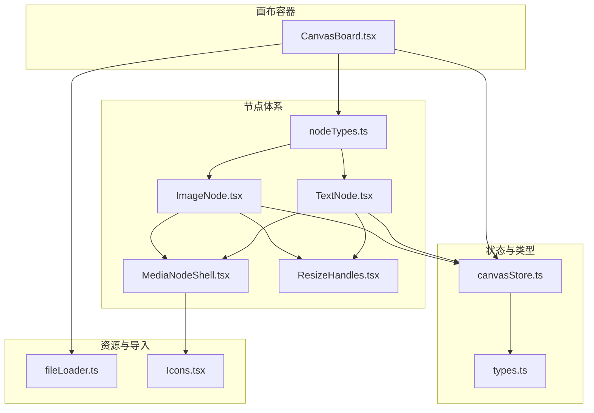
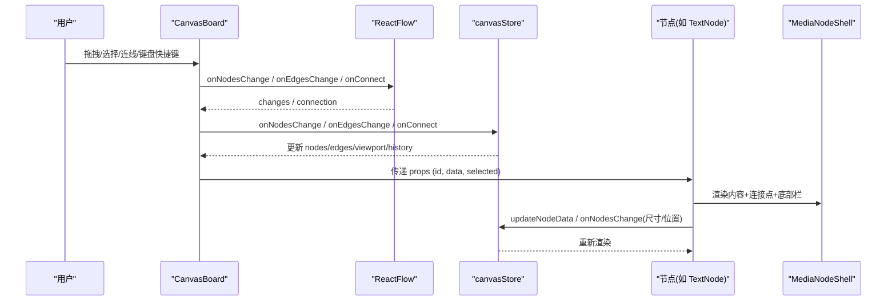
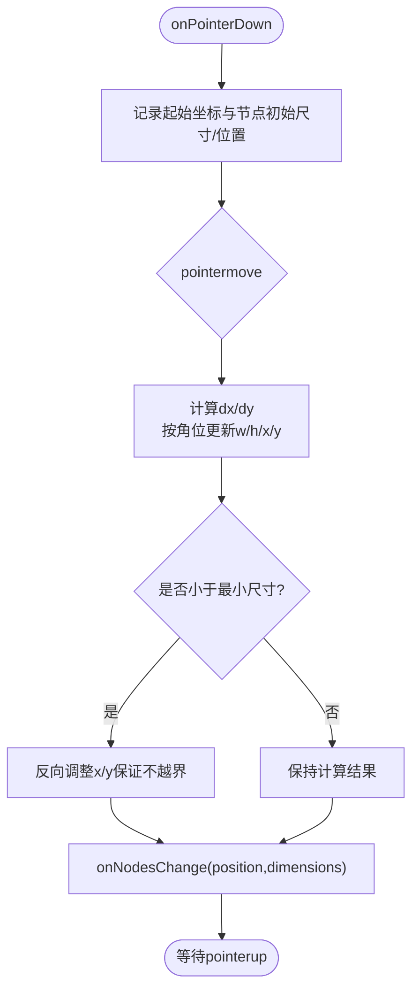
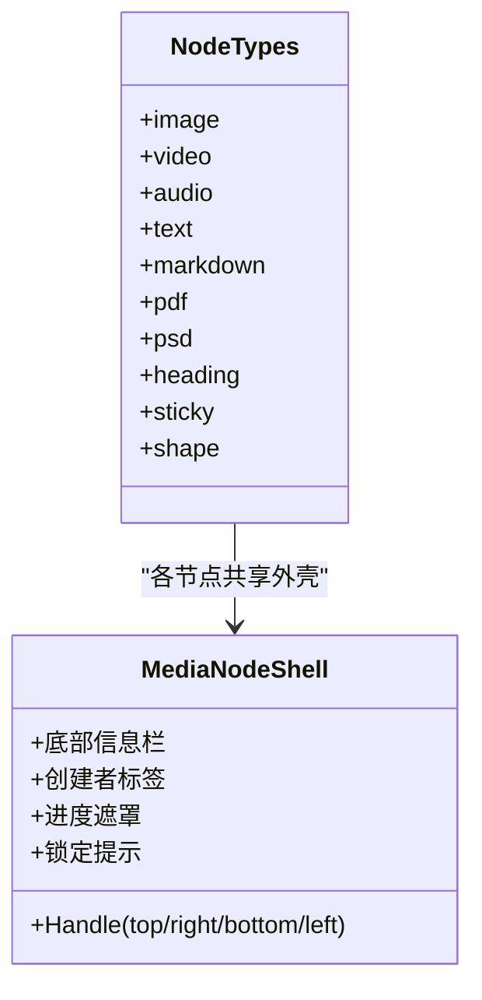
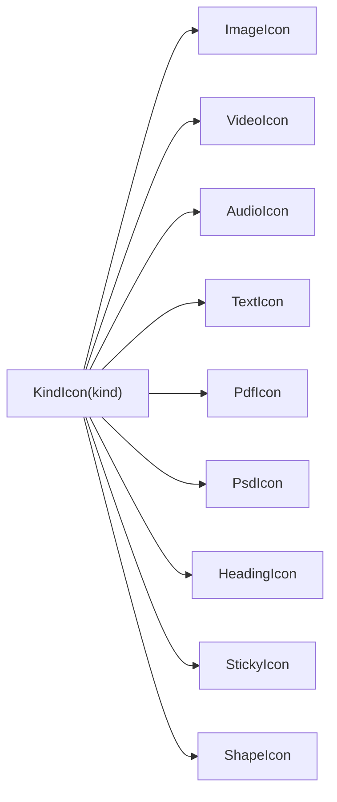
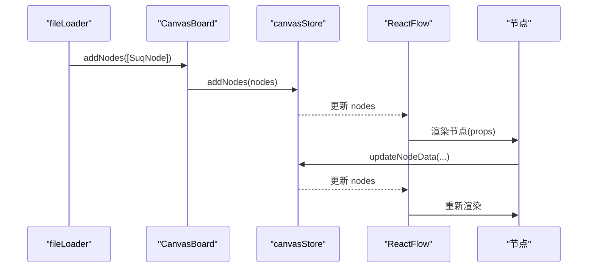
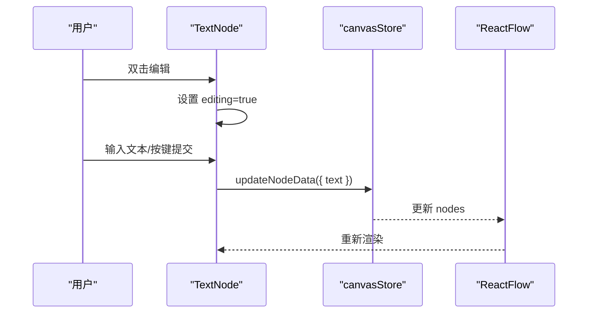
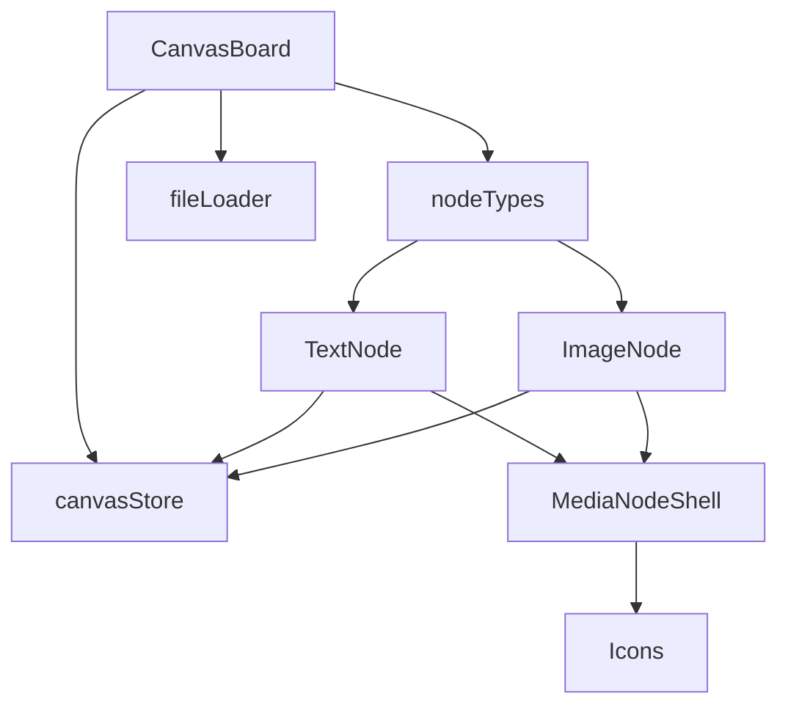

# 节点基础设施

<cite>
**本文引用的文件**
- [ResizeHandles.tsx](file://src/canvas/nodes/ResizeHandles.tsx)
- [nodeTypes.ts](file://src/canvas/nodes/nodeTypes.ts)
- [Icons.tsx](file://src/canvas/nodes/Icons.tsx)
- [CanvasBoard.tsx](file://src/canvas/CanvasBoard.tsx)
- [MediaNodeShell.tsx](file://src/canvas/nodes/MediaNodeShell.tsx)
- [canvasStore.ts](file://src/store/canvasStore.ts)
- [types.ts](file://src/types.ts)
- [TextNode.tsx](file://src/canvas/nodes/TextNode.tsx)
- [ImageNode.tsx](file://src/canvas/nodes/ImageNode.tsx)
- [fileLoader.ts](file://src/io/fileLoader.ts)
</cite>

## 目录
1. [简介](#简介)
2. [项目结构](#项目结构)
3. [核心组件](#核心组件)
4. [架构总览](#架构总览)
5. [详细组件分析](#详细组件分析)
6. [依赖关系分析](#依赖关系分析)
7. [性能考量](#性能考量)
8. [故障排查指南](#故障排查指南)
9. [结论](#结论)
10. [附录：自定义节点开发指南](#附录自定义节点开发指南)

## 简介
本文件面向“节点基础设施”的完整说明，重点覆盖以下方面：
- ResizeHandles 调整手柄的实现原理（拖拽检测、尺寸计算、边界约束）
- nodeTypes 注册机制与节点类型定义规范
- Icons 图标系统的集成与使用方式
- 节点生命周期管理、状态同步与事件传播机制
- 自定义节点开发指南（接口、样式、事件、性能优化）
- 调试工具与最佳实践

## 项目结构
本项目基于 React + @xyflow/react 构建可视化画布。节点相关代码集中在 src/canvas/nodes，画布容器在 src/canvas/CanvasBoard.tsx，全局状态在 src/store/canvasStore.ts，类型定义在 src/types.ts，图标系统位于 src/canvas/nodes/Icons.tsx。

图表来源
- [CanvasBoard.tsx:195-341](file://src/canvas/CanvasBoard.tsx#L195-L341)
- [nodeTypes.ts:14-26](file://src/canvas/nodes/nodeTypes.ts#L14-L26)
- [MediaNodeShell.tsx:13-105](file://src/canvas/nodes/MediaNodeShell.tsx#L13-L105)
- [ResizeHandles.tsx:35-117](file://src/canvas/nodes/ResizeHandles.tsx#L35-L117)
- [canvasStore.ts:118-191](file://src/store/canvasStore.ts#L118-L191)
- [types.ts:66-107](file://src/types.ts#L66-L107)
- [fileLoader.ts:165-297](file://src/io/fileLoader.ts#L165-L297)
- [Icons.tsx:633-656](file://src/canvas/nodes/Icons.tsx#L633-L656)

章节来源
- [CanvasBoard.tsx:195-341](file://src/canvas/CanvasBoard.tsx#L195-L341)
- [nodeTypes.ts:14-26](file://src/canvas/nodes/nodeTypes.ts#L14-L26)
- [MediaNodeShell.tsx:13-105](file://src/canvas/nodes/MediaNodeShell.tsx#L13-L105)
- [canvasStore.ts:118-191](file://src/store/canvasStore.ts#L118-L191)
- [types.ts:66-107](file://src/types.ts#L66-L107)
- [fileLoader.ts:165-297](file://src/io/fileLoader.ts#L165-L297)
- [Icons.tsx:633-656](file://src/canvas/nodes/Icons.tsx#L633-L656)

## 核心组件
- ResizeHandles：为选中节点提供四角拖拽调整尺寸的能力，包含最小尺寸约束与位置修正。
- MediaNodeShell：所有媒体类节点的统一外壳，负责连接点（Handle）、底部信息栏、创建者标签、进度遮罩与局域网锁定提示。
- CanvasBoard：ReactFlow 容器，负责节点/边变更处理、视图同步、快捷键、拖放导入、工具模式切换等。
- canvasStore：基于 Zustand 的全局状态，维护 nodes/edges/viewport/history/clipboard，并提供对齐、层级、撤销重做等能力。
- types：统一的 SuqNode/SuqEdge 类型与默认边样式等常量。
- fileLoader：将文件转为节点数据，并生成不同节点类型的初始尺寸与数据。
- Icons：统一的 SVG 图标库，并通过 KindIcon 按素材类型映射到具体图标。

章节来源
- [ResizeHandles.tsx:35-117](file://src/canvas/nodes/ResizeHandles.tsx#L35-L117)
- [MediaNodeShell.tsx:32-150](file://src/canvas/nodes/MediaNodeShell.tsx#L32-L150)
- [CanvasBoard.tsx:41-341](file://src/canvas/CanvasBoard.tsx#L41-L341)
- [canvasStore.ts:118-399](file://src/store/canvasStore.ts#L118-L399)
- [types.ts:1-112](file://src/types.ts#L1-L112)
- [fileLoader.ts:165-297](file://src/io/fileLoader.ts#L165-L297)
- [Icons.tsx:633-656](file://src/canvas/nodes/Icons.tsx#L633-L656)

## 架构总览
下图展示了从用户交互到状态更新的完整链路：用户在 CanvasBoard 中操作，触发 ReactFlow 的事件；节点内部通过 store 方法更新 nodes/edges；store 负责历史记录、对齐、层级、剪贴板等；节点渲染时读取 store 中的状态，形成响应式 UI。

图表来源
- [CanvasBoard.tsx:66-79](file://src/canvas/CanvasBoard.tsx#L66-L79)
- [CanvasBoard.tsx:337-341](file://src/canvas/CanvasBoard.tsx#L337-L341)
- [canvasStore.ts:126-158](file://src/store/canvasStore.ts#L126-L158)
- [MediaNodeShell.tsx:68-105](file://src/canvas/nodes/MediaNodeShell.tsx#L68-L105)
- [TextNode.tsx:47-50](file://src/canvas/nodes/TextNode.tsx#L47-L50)

## 详细组件分析

### ResizeHandles 调整手柄
- 拖拽检测：监听四个角的 onPointerDown，记录起始坐标与节点原始位置/尺寸，绑定 window 级 pointermove/pointerup 以支持跨元素拖拽。
- 尺寸计算：根据当前鼠标位置与起始位置的差值 dx/dy，结合所在角（nw/ne/sw/se）决定宽高的增减与位置偏移。
- 边界约束：限制最小宽高（MIN_W=120, MIN_H=40），当宽度或高度小于最小值时，反向调整位置以保持视觉一致。
- 状态同步：每次移动调用 onNodesChange，同时提交 position 与 dimensions（setAttributes=true 以同步 style.width/height）。
- 清理：pointerup 时移除事件监听，重置 resizeRef。

图表来源
- [ResizeHandles.tsx:45-103](file://src/canvas/nodes/ResizeHandles.tsx#L45-L103)

章节来源
- [ResizeHandles.tsx:5-117](file://src/canvas/nodes/ResizeHandles.tsx#L5-L117)

### nodeTypes 注册机制与节点类型规范
- 注册方式：在 nodeTypes.ts 中将字符串类型键映射到对应的 React 组件（如 image -> ImageNode）。
- 使用方式：CanvasBoard 通过 useMemo 导出 mediaNodeTypes 作为 ReactFlow 的 nodeTypes，使画布能识别并渲染对应节点。
- 节点类型规范：
  - type 字段必须与注册表中的键一致。
  - data.kind 需与 types.ts 中 MediaKind 枚举匹配。
  - 节点可通过 MediaNodeShell 获得标准连接点、底部栏、创建者标签与锁定提示。
  - 节点可借助 ResizeHandles 或 NodeResizer 实现尺寸调整。

图表来源
- [nodeTypes.ts:14-26](file://src/canvas/nodes/nodeTypes.ts#L14-L26)
- [MediaNodeShell.tsx:68-150](file://src/canvas/nodes/MediaNodeShell.tsx#L68-L150)

章节来源
- [nodeTypes.ts:14-26](file://src/canvas/nodes/nodeTypes.ts#L14-L26)
- [CanvasBoard.tsx:195-196](file://src/canvas/CanvasBoard.tsx#L195-L196)
- [types.ts:3-14](file://src/types.ts#L3-L14)

### Icons 图标系统集成与使用
- 基础封装：Base 组件统一 SVG 属性（viewBox、stroke、width/height 等），所有图标复用该基座。
- 分类丰富：提供图片、视频、音频、文本、PDF、PSD、标题、便签、形状等图标。
- 统一入口：KindIcon 根据 MediaKind 返回对应图标，便于在 MediaNodeShell 底部栏显示。
- 使用建议：新增图标应遵循 Base 风格，并在 KindIcon 中补充分支。

图表来源
- [Icons.tsx:6-21](file://src/canvas/nodes/Icons.tsx#L6-L21)
- [Icons.tsx:633-656](file://src/canvas/nodes/Icons.tsx#L633-L656)

章节来源
- [Icons.tsx:633-656](file://src/canvas/nodes/Icons.tsx#L633-L656)
- [MediaNodeShell.tsx:114-119](file://src/canvas/nodes/MediaNodeShell.tsx#L114-L119)

### 节点生命周期管理、状态同步与事件传播
- 生命周期：
  - 创建：fileLoader 根据文件类型创建节点数据（含 kind、label、尺寸等），CanvasBoard 通过 addNodes 加入画布。
  - 渲染：ReactFlow 根据 nodeTypes 渲染对应组件，MediaNodeShell 注入连接点与 UI 壳层。
  - 编辑：节点内部通过 updateNodeData 修改 data，触发 store 更新与重新渲染。
  - 销毁：删除节点时通过 onNodesChange 的 remove 类型变更，store 会立即写入历史快照。
- 状态同步：
  - 所有变更通过 onNodesChange/onEdgesChange 进入 store，store 使用 applyNodeChanges/applyEdgeChanges 合并变更。
  - 历史记录通过 scheduleSnapshot/snapshotNow 防抖保存，删除操作立即落盘。
  - 视图同步：CanvasBoard 订阅远程视口变化并驱动本地 ReactFlow 视图。
- 事件传播：
  - 节点内事件通过 stopPropagation 避免冒泡干扰画布操作（如拖拽、双击编辑）。
  - 局域网协作通过 setLanEditing/clearLanEditing 标记编辑态，其他用户看到锁定提示。

图表来源
- [fileLoader.ts:186-205](file://src/io/fileLoader.ts#L186-L205)
- [canvasStore.ts:159-175](file://src/store/canvasStore.ts#L159-L175)
- [CanvasBoard.tsx:337-341](file://src/canvas/CanvasBoard.tsx#L337-L341)

章节来源
- [fileLoader.ts:186-205](file://src/io/fileLoader.ts#L186-L205)
- [canvasStore.ts:126-191](file://src/store/canvasStore.ts#L126-L191)
- [CanvasBoard.tsx:93-102](file://src/canvas/CanvasBoard.tsx#L93-L102)

### 典型节点示例
- TextNode：支持双击编辑文本、自动聚焦、键盘快捷键提交、歌单标题联动播放。
- ImageNode：使用 NodeResizer 调整尺寸，加载完成后自适应缩放，支持打开大图与下载。

图表来源
- [TextNode.tsx:23-50](file://src/canvas/nodes/TextNode.tsx#L23-L50)
- [canvasStore.ts:176-183](file://src/store/canvasStore.ts#L176-L183)

章节来源
- [TextNode.tsx:13-107](file://src/canvas/nodes/TextNode.tsx#L13-L107)
- [ImageNode.tsx:15-126](file://src/canvas/nodes/ImageNode.tsx#L15-L126)

## 依赖关系分析
- CanvasBoard 依赖 nodeTypes 与 edgeTypes 完成节点/边的渲染与连接。
- 节点依赖 MediaNodeShell 获取通用外壳与连接点。
- 所有节点通过 canvasStore 进行状态读写，确保一致性。
- fileLoader 负责将外部文件转换为节点数据，并与 OSS/局域网/云同步。
- Icons 被 MediaNodeShell 用于展示类型图标。

图表来源
- [CanvasBoard.tsx:195-341](file://src/canvas/CanvasBoard.tsx#L195-L341)
- [nodeTypes.ts:14-26](file://src/canvas/nodes/nodeTypes.ts#L14-L26)
- [MediaNodeShell.tsx:68-150](file://src/canvas/nodes/MediaNodeShell.tsx#L68-L150)
- [fileLoader.ts:165-297](file://src/io/fileLoader.ts#L165-L297)
- [Icons.tsx:633-656](file://src/canvas/nodes/Icons.tsx#L633-L656)

章节来源
- [CanvasBoard.tsx:195-341](file://src/canvas/CanvasBoard.tsx#L195-L341)
- [nodeTypes.ts:14-26](file://src/canvas/nodes/nodeTypes.ts#L14-L26)
- [MediaNodeShell.tsx:68-150](file://src/canvas/nodes/MediaNodeShell.tsx#L68-L150)
- [fileLoader.ts:165-297](file://src/io/fileLoader.ts#L165-L297)
- [Icons.tsx:633-656](file://src/canvas/nodes/Icons.tsx#L633-L656)

## 性能考量
- 防抖历史：canvasStore 使用 scheduleSnapshot 对非删除操作进行防抖，减少频繁写历史带来的开销。
- 局部更新：onNodesChange/onEdgesChange 使用 apply*Changes 增量更新，避免全量重建。
- 懒加载与占位：图片节点在加载前显示占位层，加载后淡入，提升感知性能。
- 最小尺寸约束：ResizeHandles 限制最小宽高，避免过小导致渲染与交互问题。
- 连接热区：MediaNodeShell 在连线模式下启用边条带热区，减少误触。

[本节为通用指导，无需特定文件引用]

## 故障排查指南
- 无法调整尺寸：检查节点是否处于选中态且未被局域网锁定；确认 ResizeHandles 已挂载。
- 尺寸未生效：确认 onNodesChange 同时提交了 position 与 dimensions，且 setAttributes=true。
- 节点不可编辑：检查 MediaNodeShell 的锁定提示，确认无其他用户正在编辑该节点。
- 历史记录异常：确认删除操作走 onNodesChange 的 remove 类型，以便立即写入历史。
- 视图不同步：检查 CanvasBoard 的远程视口订阅逻辑是否正确应用。

章节来源
- [ResizeHandles.tsx:89-92](file://src/canvas/nodes/ResizeHandles.tsx#L89-L92)
- [MediaNodeShell.tsx:141-147](file://src/canvas/nodes/MediaNodeShell.tsx#L141-L147)
- [canvasStore.ts:126-145](file://src/store/canvasStore.ts#L126-L145)
- [CanvasBoard.tsx:93-102](file://src/canvas/CanvasBoard.tsx#L93-L102)

## 结论
本节点基础设施围绕 ReactFlow 与 Zustand 构建了可扩展、可协作、高性能的画布系统。ResizeHandles 提供了直观的尺寸调整能力；nodeTypes 注册机制简化了节点扩展；Icons 统一了视觉表达；canvasStore 保证了状态一致性与历史回溯；MediaNodeShell 为节点提供了标准化的外壳与协作体验。通过上述设计，开发者可以快速实现自定义节点并融入整体生态。

[本节为总结性内容，无需特定文件引用]

## 附录：自定义节点开发指南

### 接口定义
- 节点类型：在 nodeTypes.ts 中注册新类型键与组件映射。
- 数据类型：在 types.ts 的 SuqNodeData 中添加必要字段（如 kind、颜色、字体等），并确保与现有逻辑兼容。
- 节点结构：建议使用 MediaNodeShell 包裹内容，以获得连接点、底部栏、创建者标签与锁定提示。

章节来源
- [nodeTypes.ts:14-26](file://src/canvas/nodes/nodeTypes.ts#L14-L26)
- [types.ts:66-107](file://src/types.ts#L66-L107)
- [MediaNodeShell.tsx:68-150](file://src/canvas/nodes/MediaNodeShell.tsx#L68-L150)

### 样式定制
- 边框与背景：通过 data.borderColor 控制边框色，MediaNodeShell 会应用到外壳。
- 底部栏：KindIcon 与 label 由 MediaNodeShell 渲染，可在节点 data 中设置。
- 进度遮罩：如需播放进度，可在 MediaNodeShell 传入 progress 参数。

章节来源
- [MediaNodeShell.tsx:54-139](file://src/canvas/nodes/MediaNodeShell.tsx#L54-L139)
- [Icons.tsx:633-656](file://src/canvas/nodes/Icons.tsx#L633-L656)

### 事件处理
- 编辑提交：参考 TextNode，使用 updateNodeData 提交变更，避免直接修改 props。
- 尺寸调整：可使用 ResizeHandles 或 NodeResizer，确保 onNodesChange 同时提交 position 与 dimensions。
- 协作锁定：在开始编辑/调整时调用 setLanEditing，结束时 clearLanEditing。

章节来源
- [TextNode.tsx:47-50](file://src/canvas/nodes/TextNode.tsx#L47-L50)
- [ResizeHandles.tsx:89-92](file://src/canvas/nodes/ResizeHandles.tsx#L89-L92)
- [ImageNode.tsx:60-69](file://src/canvas/nodes/ImageNode.tsx#L60-L69)

### 性能优化
- 使用 memo 包裹节点组件以减少重渲染。
- 图片/媒体加载时使用占位与淡入过渡，避免闪烁。
- 合理设置最小尺寸与最大缩放范围，防止过度渲染。
- 利用 store 的防抖历史与增量更新机制。

章节来源
- [TextNode.tsx:13-23](file://src/canvas/nodes/TextNode.tsx#L13-L23)
- [ImageNode.tsx:78-93](file://src/canvas/nodes/ImageNode.tsx#L78-L93)
- [canvasStore.ts:72-92](file://src/store/canvasStore.ts#L72-L92)

### 调试工具与最佳实践
- 快捷键：Ctrl/Cmd+Z/Y 撤销重做，Ctrl/Cmd+C/V 复制粘贴，Ctrl/Cmd+A 全选，F 适配视图。
- 工具模式：V 选择、C 连线、H 拖动，空格临时平移。
- 局域网协作：关注锁定提示与远端光标，避免冲突编辑。
- 导入导出：拖放文件到画布即可导入，支持批量导入与偏移排列。

章节来源
- [CanvasBoard.tsx:104-193](file://src/canvas/CanvasBoard.tsx#L104-L193)
- [CanvasBoard.tsx:210-232](file://src/canvas/CanvasBoard.tsx#L210-L232)
- [fileLoader.ts:186-205](file://src/io/fileLoader.ts#L186-L205)