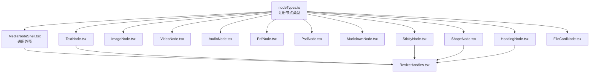
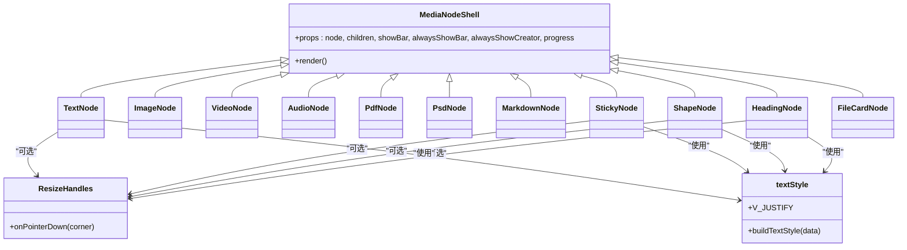
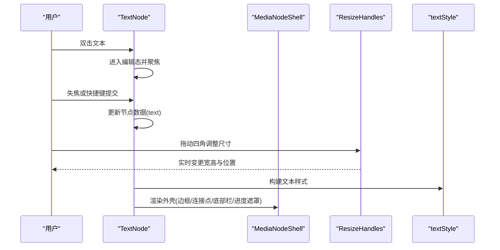
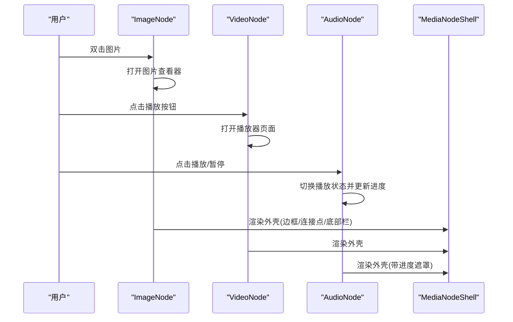
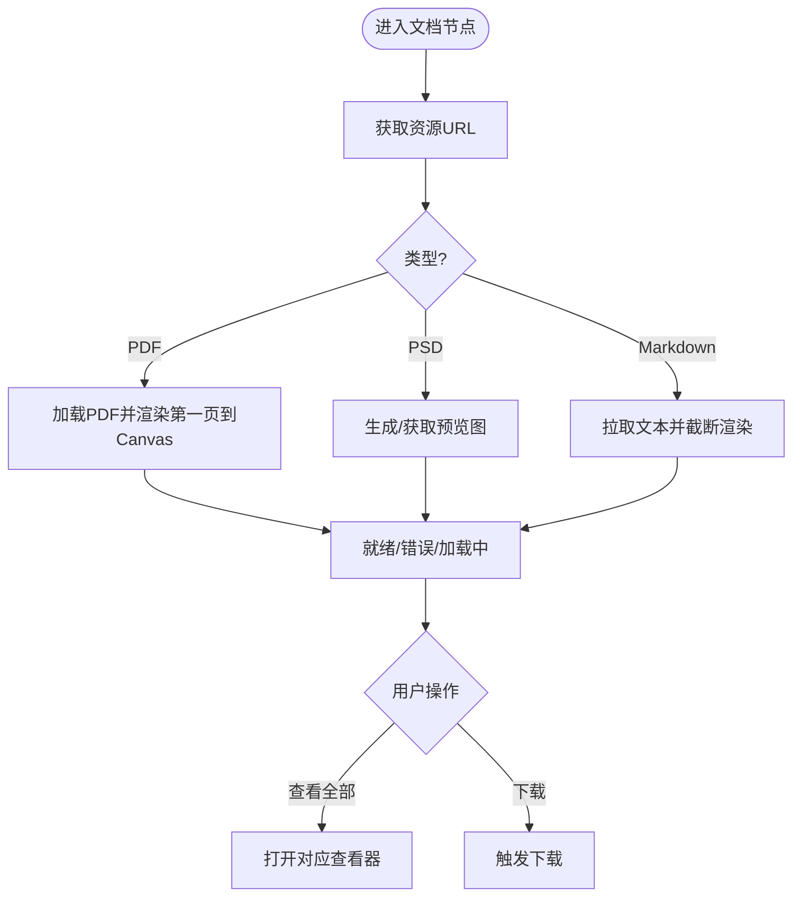
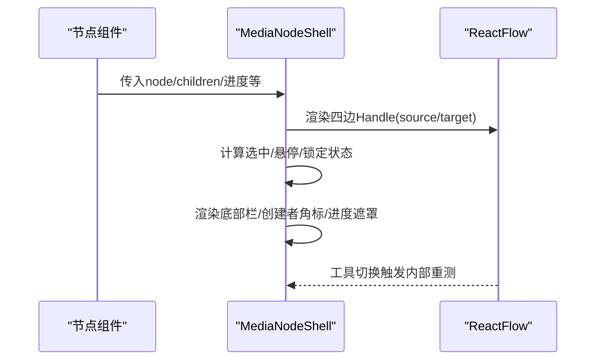
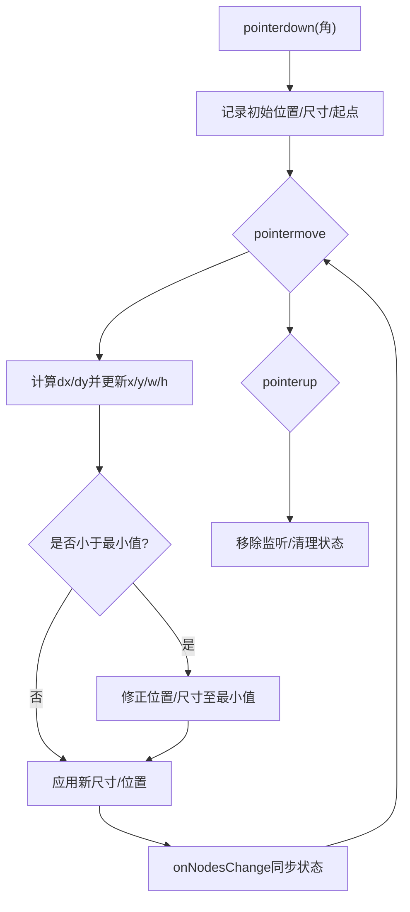
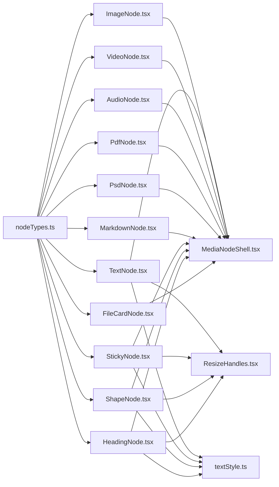

# 节点类型系统

<cite>
**本文引用的文件**
- [src/canvas/nodes/nodeTypes.ts](file://src/canvas/nodes/nodeTypes.ts)
- [src/canvas/nodes/MediaNodeShell.tsx](file://src/canvas/nodes/MediaNodeShell.tsx)
- [src/canvas/nodes/ResizeHandles.tsx](file://src/canvas/nodes/ResizeHandles.tsx)
- [src/canvas/nodes/TextNode.tsx](file://src/canvas/nodes/TextNode.tsx)
- [src/canvas/nodes/ImageNode.tsx](file://src/canvas/nodes/ImageNode.tsx)
- [src/canvas/nodes/VideoNode.tsx](file://src/canvas/nodes/VideoNode.tsx)
- [src/canvas/nodes/AudioNode.tsx](file://src/canvas/nodes/AudioNode.tsx)
- [src/canvas/nodes/PdfNode.tsx](file://src/canvas/nodes/PdfNode.tsx)
- [src/canvas/nodes/PsdNode.tsx](file://src/canvas/nodes/PsdNode.tsx)
- [src/canvas/nodes/MarkdownNode.tsx](file://src/canvas/nodes/MarkdownNode.tsx)
- [src/canvas/nodes/StickyNode.tsx](file://src/canvas/nodes/StickyNode.tsx)
- [src/canvas/nodes/ShapeNode.tsx](file://src/canvas/nodes/ShapeNode.tsx)
- [src/canvas/nodes/HeadingNode.tsx](file://src/canvas/nodes/HeadingNode.tsx)
- [src/canvas/nodes/FileCardNode.tsx](file://src/canvas/nodes/FileCardNode.tsx)
- [src/canvas/nodes/textStyle.ts](file://src/canvas/nodes/textStyle.ts)
</cite>

## 目录
1. [简介](#简介)
2. [项目结构](#项目结构)
3. [核心组件](#核心组件)
4. [架构总览](#架构总览)
5. [详细组件分析](#详细组件分析)
6. [依赖关系分析](#依赖关系分析)
7. [性能考量](#性能考量)
8. [故障排查指南](#故障排查指南)
9. [结论](#结论)
10. [附录：自定义节点开发指南](#附录自定义节点开发指南)

## 简介
本文件系统性梳理画布编辑器中的“节点类型系统”，覆盖文本、媒体、文档、便签、形状、标题与文件卡片等内置节点的实现原理与特性，重点解释通用媒体外壳 MediaNodeShell 的设计模式与复用机制，以及 ResizeHandles 调整手柄的工作原理。文末提供从零实现一个全新节点类型的完整指南，包括接口约定、生命周期管理、样式定制与交互设计要点。

## 项目结构
节点类型注册与实现集中在 src/canvas/nodes 目录下：
- nodeTypes.ts：集中注册所有节点类型到 ReactFlow，供画布使用。
- MediaNodeShell.tsx：通用媒体外壳，统一处理边框、连接点、底部信息栏、创建者角标、播放进度遮罩与协作锁定提示。
- ResizeHandles.tsx：四角拖拽调整尺寸，基于屏幕坐标到 Flow 坐标转换与最小尺寸约束。
- 各节点实现：TextNode、ImageNode、VideoNode、AudioNode、PdfNode、PsdNode、MarkdownNode、StickyNode、ShapeNode、HeadingNode、FileCardNode。
- textStyle.ts：统一的文本样式构建工具与垂直对齐映射。

图表来源
- [src/canvas/nodes/nodeTypes.ts:14-26](file://src/canvas/nodes/nodeTypes.ts#L14-L26)
- [src/canvas/nodes/MediaNodeShell.tsx:20-30](file://src/canvas/nodes/MediaNodeShell.tsx#L20-L30)
- [src/canvas/nodes/ResizeHandles.tsx:35-118](file://src/canvas/nodes/ResizeHandles.tsx#L35-L118)

章节来源
- [src/canvas/nodes/nodeTypes.ts:1-27](file://src/canvas/nodes/nodeTypes.ts#L1-L27)

## 核心组件
- 节点注册表（nodeTypes）：将字符串类型键映射到具体 React 组件，作为 ReactFlow 的 NodeTypes 配置。
- 通用媒体外壳（MediaNodeShell）：
  - 统一渲染节点容器、四边连接点（source/target）、连线模式下的边条热区、底部名称栏、创建者角标、播放进度遮罩与协作锁定提示。
  - 通过 props 控制是否显示底部栏、是否始终显示创建者、进度遮罩等。
- 文本样式（textStyle）：提供统一的字体、字号、粗细、斜体、下划线、行高与垂直对齐构建方法。
- 调整手柄（ResizeHandles）：四角拖拽改变节点宽高与位置，支持最小尺寸限制，并在移动过程中实时更新节点数据。

章节来源
- [src/canvas/nodes/nodeTypes.ts:14-26](file://src/canvas/nodes/nodeTypes.ts#L14-L26)
- [src/canvas/nodes/MediaNodeShell.tsx:20-30](file://src/canvas/nodes/MediaNodeShell.tsx#L20-L30)
- [src/canvas/nodes/textStyle.ts:4-21](file://src/canvas/nodes/textStyle.ts#L4-L21)
- [src/canvas/nodes/ResizeHandles.tsx:5-118](file://src/canvas/nodes/ResizeHandles.tsx#L5-L118)

## 架构总览
节点类型系统以“注册表 + 通用外壳 + 具体节点”的分层组织：
- 注册层：nodeTypes.ts 暴露 mediaNodeTypes 给上层画布使用。
- 外壳层：MediaNodeShell 提供一致的交互与视觉基座，减少重复代码。
- 业务层：每个节点专注自身的数据展示与交互逻辑（如图片加载、视频封面、PDF 渲染、PSD 预览、Markdown 拉取、音频播放状态等）。
- 辅助层：textStyle 提供文本样式；ResizeHandles 提供尺寸调整能力。

图表来源
- [src/canvas/nodes/MediaNodeShell.tsx:20-30](file://src/canvas/nodes/MediaNodeShell.tsx#L20-L30)
- [src/canvas/nodes/ResizeHandles.tsx:35-118](file://src/canvas/nodes/ResizeHandles.tsx#L35-L118)
- [src/canvas/nodes/textStyle.ts:4-21](file://src/canvas/nodes/textStyle.ts#L4-L21)

## 详细组件分析

### 文本节点（TextNode）
- 功能特性：
  - 双击进入编辑模式，失焦或快捷键提交内容。
  - 自动检测是否命名了画布歌单（通过出边指向音频首节点），并提供快捷播放入口。
  - 使用 MediaNodeShell 统一外壳，选中时显示 ResizeHandles 调整尺寸。
  - 使用 textStyle 构建文本样式，支持水平/垂直对齐、字体、字号、加粗、斜体、下划线、行高。
- 关键流程：
  - 编辑态切换与局域网协作锁定（setLanEditing/clearLanEditing）。
  - 歌单识别与播放器打开。
  - 文本提交更新节点数据。

图表来源
- [src/canvas/nodes/TextNode.tsx:13-107](file://src/canvas/nodes/TextNode.tsx#L13-L107)
- [src/canvas/nodes/MediaNodeShell.tsx:20-30](file://src/canvas/nodes/MediaNodeShell.tsx#L20-L30)
- [src/canvas/nodes/ResizeHandles.tsx:35-118](file://src/canvas/nodes/ResizeHandles.tsx#L35-L118)
- [src/canvas/nodes/textStyle.ts:4-21](file://src/canvas/nodes/textStyle.ts#L4-L21)

章节来源
- [src/canvas/nodes/TextNode.tsx:13-107](file://src/canvas/nodes/TextNode.tsx#L13-L107)
- [src/canvas/nodes/textStyle.ts:4-21](file://src/canvas/nodes/textStyle.ts#L4-L21)

### 媒体节点（ImageNode、VideoNode、AudioNode）
- ImageNode：
  - 使用 NodeResizer 进行尺寸调整，首次加载后根据原图尺寸自适应节点宽高。
  - 提供打开大图与下载按钮；懒加载占位与淡入过渡。
- VideoNode：
  - 仅显示封面缩略图与播放按钮，点击打开全屏播放器页面，避免在画布内嵌播放器影响交互。
  - 根据缩略图尺寸自适应节点大小。
- AudioNode：
  - 显示封面与播放控件，实时反映当前播放进度（进度遮罩铺满节点）。
  - 双击进入专用播放器页，支持流式连播顺序沿用画布连线。

图表来源
- [src/canvas/nodes/ImageNode.tsx:15-126](file://src/canvas/nodes/ImageNode.tsx#L15-L126)
- [src/canvas/nodes/VideoNode.tsx:18-88](file://src/canvas/nodes/VideoNode.tsx#L18-L88)
- [src/canvas/nodes/AudioNode.tsx:18-126](file://src/canvas/nodes/AudioNode.tsx#L18-L126)
- [src/canvas/nodes/MediaNodeShell.tsx:20-30](file://src/canvas/nodes/MediaNodeShell.tsx#L20-L30)

章节来源
- [src/canvas/nodes/ImageNode.tsx:15-126](file://src/canvas/nodes/ImageNode.tsx#L15-L126)
- [src/canvas/nodes/VideoNode.tsx:18-88](file://src/canvas/nodes/VideoNode.tsx#L18-L88)
- [src/canvas/nodes/AudioNode.tsx:18-126](file://src/canvas/nodes/AudioNode.tsx#L18-L126)

### 文档节点（PdfNode、PsdNode、MarkdownNode）
- PdfNode：
  - 动态导入 PDF 渲染模块，加载第一页并绘制到 canvas，记录页数；提供查看全部入口。
  - 错误与加载状态清晰反馈。
- PsdNode：
  - 生成 PSD 预览图，首次加载后按预览图尺寸自适应节点大小；支持打开预览与下载原始文件。
  - 协作锁定提示，避免并发编辑冲突。
- MarkdownNode：
  - 拉取 Markdown 文本并局部渲染，限制最大长度；支持打开完整查看器与下载。
  - 协作锁定提示。

图表来源
- [src/canvas/nodes/PdfNode.tsx:11-90](file://src/canvas/nodes/PdfNode.tsx#L11-L90)
- [src/canvas/nodes/PsdNode.tsx:15-125](file://src/canvas/nodes/PsdNode.tsx#L15-L125)
- [src/canvas/nodes/MarkdownNode.tsx:12-105](file://src/canvas/nodes/MarkdownNode.tsx#L12-L105)

章节来源
- [src/canvas/nodes/PdfNode.tsx:11-90](file://src/canvas/nodes/PdfNode.tsx#L11-L90)
- [src/canvas/nodes/PsdNode.tsx:15-125](file://src/canvas/nodes/PsdNode.tsx#L15-L125)
- [src/canvas/nodes/MarkdownNode.tsx:12-105](file://src/canvas/nodes/MarkdownNode.tsx#L12-L105)

### 便签节点（StickyNode）
- 功能特性：
  - 支持多主题色背景，双击编辑文本，提交更新。
  - 使用 textStyle 构建文本样式，选中时显示 ResizeHandles。
  - 协作锁定：编辑期间设置/清除编辑锁。

章节来源
- [src/canvas/nodes/StickyNode.tsx:10-85](file://src/canvas/nodes/StickyNode.tsx#L10-L85)
- [src/canvas/nodes/textStyle.ts:4-21](file://src/canvas/nodes/textStyle.ts#L4-L21)

### 形状节点（ShapeNode）
- 功能特性：
  - 矩形与圆形两种形状，填充色可配置。
  - 双击编辑文本，提交更新；选中时显示 ResizeHandles。
  - 使用 textStyle 构建文本样式。

章节来源
- [src/canvas/nodes/ShapeNode.tsx:10-86](file://src/canvas/nodes/ShapeNode.tsx#L10-L86)
- [src/canvas/nodes/textStyle.ts:4-21](file://src/canvas/nodes/textStyle.ts#L4-L21)

### 标题节点（HeadingNode）
- 功能特性：
  - 支持多级标题样式（默认/H1/H2/H3），顶部工具栏切换级别与字号。
  - 双击编辑文本，提交更新；选中时显示 ResizeHandles。
  - 使用 textStyle 构建文本样式。

章节来源
- [src/canvas/nodes/HeadingNode.tsx:17-124](file://src/canvas/nodes/HeadingNode.tsx#L17-L124)
- [src/canvas/nodes/textStyle.ts:4-21](file://src/canvas/nodes/textStyle.ts#L4-L21)

### 文件卡片节点（FileCardNode）
- 功能特性：
  - 显示文件名与大小，支持打开新窗口与下载。
  - 使用 MediaNodeShell 统一外壳。

章节来源
- [src/canvas/nodes/FileCardNode.tsx:10-80](file://src/canvas/nodes/FileCardNode.tsx#L10-L80)

### 通用媒体外壳（MediaNodeShell）
- 设计模式与复用机制：
  - 统一容器：圆角边框、阴影、选中态样式、协作锁定遮罩。
  - 连接点：四边 source/target Handle，连线模式下四条边同时作为连接热区。
  - 底部栏：显示图标与标签，支持始终显示。
  - 创建者角标：悬停/选中/始终显示。
  - 进度遮罩：用于音频等媒体的播放进度可视化。
  - 模式切换重测：工具切换时调用 updateNodeInternals 确保连接热区生效。

图表来源
- [src/canvas/nodes/MediaNodeShell.tsx:20-30](file://src/canvas/nodes/MediaNodeShell.tsx#L20-L30)
- [src/canvas/nodes/MediaNodeShell.tsx:48-51](file://src/canvas/nodes/MediaNodeShell.tsx#L48-L51)
- [src/canvas/nodes/MediaNodeShell.tsx:68-105](file://src/canvas/nodes/MediaNodeShell.tsx#L68-L105)
- [src/canvas/nodes/MediaNodeShell.tsx:109-147](file://src/canvas/nodes/MediaNodeShell.tsx#L109-L147)

章节来源
- [src/canvas/nodes/MediaNodeShell.tsx:20-30](file://src/canvas/nodes/MediaNodeShell.tsx#L20-L30)
- [src/canvas/nodes/MediaNodeShell.tsx:48-51](file://src/canvas/nodes/MediaNodeShell.tsx#L48-L51)
- [src/canvas/nodes/MediaNodeShell.tsx:68-105](file://src/canvas/nodes/MediaNodeShell.tsx#L68-L105)
- [src/canvas/nodes/MediaNodeShell.tsx:109-147](file://src/canvas/nodes/MediaNodeShell.tsx#L109-L147)

### 调整手柄（ResizeHandles）
- 实现原理：
  - 监听四角 pointerdown，记录初始位置、节点尺寸与起始坐标。
  - 在 pointermove 中计算 dx/dy，按角方向更新 x/y/w/h，并应用最小宽高约束。
  - 通过 onNodesChange 同步 position 与 dimensions，保持与画布状态一致。
  - pointerup 时移除事件监听，清理状态。

图表来源
- [src/canvas/nodes/ResizeHandles.tsx:35-118](file://src/canvas/nodes/ResizeHandles.tsx#L35-L118)

章节来源
- [src/canvas/nodes/ResizeHandles.tsx:35-118](file://src/canvas/nodes/ResizeHandles.tsx#L35-L118)

## 依赖关系分析
- 节点类型注册依赖：
  - nodeTypes.ts 依赖各节点组件，导出 mediaNodeTypes 供画布使用。
- 节点对外部能力的依赖：
  - 媒体节点依赖 useAssetUrl/useThumbnailUrl 获取资源地址。
  - 文档节点依赖 pdf/psd/markdown 相关能力（动态导入或 fetch）。
  - 文本/标题/便签/形状节点依赖 textStyle 构建样式。
  - 多数节点依赖 MediaNodeShell 提供统一外壳。
  - 部分节点依赖 ResizeHandles 提供尺寸调整。
  - 协作编辑依赖 setLanEditing/clearLanEditing 与 lanStore 锁定状态。

图表来源
- [src/canvas/nodes/nodeTypes.ts:14-26](file://src/canvas/nodes/nodeTypes.ts#L14-L26)
- [src/canvas/nodes/MediaNodeShell.tsx:20-30](file://src/canvas/nodes/MediaNodeShell.tsx#L20-L30)
- [src/canvas/nodes/ResizeHandles.tsx:35-118](file://src/canvas/nodes/ResizeHandles.tsx#L35-L118)
- [src/canvas/nodes/textStyle.ts:4-21](file://src/canvas/nodes/textStyle.ts#L4-L21)

章节来源
- [src/canvas/nodes/nodeTypes.ts:14-26](file://src/canvas/nodes/nodeTypes.ts#L14-L26)

## 性能考量
- 懒加载与按需渲染：
  - 视频节点不内嵌播放器，仅在打开播放器页面时加载大文件，降低画布负载。
  - PDF 节点动态导入渲染模块，仅渲染第一页到 canvas，减少内存占用。
  - Markdown 节点限制拉取文本长度，避免超大文本导致渲染卡顿。
- 自适应尺寸：
  - 图片/PSD/视频首次加载后根据原图或缩略图尺寸自适应节点宽高，提升布局效率。
- 协作锁定：
  - 编辑期间设置锁定，避免多人同时修改同一节点造成冲突与重绘。
- 进度遮罩：
  - 音频节点使用轻量级遮罩展示播放进度，不影响主交互。

[本节为通用指导，无需特定文件引用]

## 故障排查指南
- 协作锁定提示：
  - 若节点被其他用户锁定，操作会被阻止并显示提示。检查 lanStore 的 editing 状态与 setLanEditing/clearLanEditing 调用时机。
- 资源加载失败：
  - 图片/视频/PSD/Markdown/PDF 等资源加载失败时，会有占位或错误提示。确认资源 URL 可用性与权限。
- 尺寸调整异常：
  - 若 ResizeHandles 无效，检查是否在选中态且未被锁定；确认 onNodesChange 正确调用。
- 文本编辑未提交：
  - 检查 onBlur 与键盘事件是否正确触发；确认 autoEdit 标志与焦点管理。

章节来源
- [src/canvas/nodes/MediaNodeShell.tsx:141-147](file://src/canvas/nodes/MediaNodeShell.tsx#L141-L147)
- [src/canvas/nodes/PsdNode.tsx:28-38](file://src/canvas/nodes/PsdNode.tsx#L28-L38)
- [src/canvas/nodes/MarkdownNode.tsx:29-43](file://src/canvas/nodes/MarkdownNode.tsx#L29-L43)
- [src/canvas/nodes/PdfNode.tsx:27-54](file://src/canvas/nodes/PdfNode.tsx#L27-L54)
- [src/canvas/nodes/ResizeHandles.tsx:61-101](file://src/canvas/nodes/ResizeHandles.tsx#L61-L101)

## 结论
节点类型系统通过“注册表 + 通用外壳 + 具体节点”的分层设计，实现了高度复用与可扩展性。MediaNodeShell 统一了交互与视觉基座，ResizeHandles 提供了灵活的尺寸调整能力，textStyle 保证了文本样式的一致性。各节点专注于自身领域逻辑，整体架构清晰、易于维护与扩展。

[本节为总结，无需特定文件引用]

## 附录：自定义节点开发指南
以下提供一个从零实现全新节点类型的步骤与要点，结合现有代码模式与接口约定：

- 定义节点类型与数据模型
  - 在 nodeTypes.ts 中为新节点添加类型键与组件映射。
  - 参考 SuqNodeData 的结构，确定节点所需字段（如 label、assetId、text、fill、shape、level、fontSize、textAlign、textAlignV、borderColor、createdByName 等）。

- 选择外壳与交互
  - 若节点需要统一边框、连接点、底部栏、进度遮罩与协作锁定，优先使用 MediaNodeShell。
  - 若需要尺寸调整，集成 ResizeHandles（在选中态且非编辑态显示）。
  - 若需要 NodeResizer（如图片/PSD/Markdown），可直接使用 ReactFlow 的 NodeResizer，并配合协作锁定。

- 实现生命周期与状态管理
  - 使用 useEffect 处理资源加载、动态导入、状态初始化与清理。
  - 使用 useState 管理本地交互状态（如编辑态、加载态、错误态）。
  - 通过 useCanvasStore.updateNodeData/onNodesChange 持久化节点数据与尺寸/位置变更。
  - 使用 setLanEditing/clearLanEditing 管理协作编辑锁定。

- 样式定制
  - 使用 textStyle.buildTextStyle 构建文本样式，支持字体、字号、粗细、斜体、下划线、行高与垂直对齐。
  - 通过 CSS 变量与 Tailwind 类名统一外观，遵循 MediaNodeShell 的样式约定。

- 示例：实现一个“链接卡片节点”
  - 新增节点组件 LinkCardNode.tsx：
    - 使用 MediaNodeShell 包裹内容区域。
    - 显示链接图标、标题与描述，提供打开与下载按钮。
    - 使用 useAssetUrl 获取资源地址，处理加载状态与错误提示。
    - 可选：集成 ResizeHandles 或 NodeResizer 以支持尺寸调整。
  - 在 nodeTypes.ts 中注册：
    - 添加 linkCard: LinkCardNode 到 mediaNodeTypes。
  - 在画布中使用：
    - 通过 ReactFlow 的 nodes 数组添加类型为 linkCard 的节点，设置 data 字段（label、assetId、fileSize 等）。

- 最佳实践
  - 保持节点职责单一：只负责自身数据的展示与交互。
  - 复用通用能力：外壳、样式、尺寸调整、协作锁定。
  - 关注性能：懒加载、按需渲染、限制文本长度、避免不必要的重渲染。
  - 完善错误处理：资源加载失败、协作冲突、尺寸异常等场景的用户反馈。

章节来源
- [src/canvas/nodes/nodeTypes.ts:14-26](file://src/canvas/nodes/nodeTypes.ts#L14-L26)
- [src/canvas/nodes/MediaNodeShell.tsx:20-30](file://src/canvas/nodes/MediaNodeShell.tsx#L20-L30)
- [src/canvas/nodes/ResizeHandles.tsx:35-118](file://src/canvas/nodes/ResizeHandles.tsx#L35-L118)
- [src/canvas/nodes/textStyle.ts:4-21](file://src/canvas/nodes/textStyle.ts#L4-L21)
- [src/canvas/nodes/ImageNode.tsx:15-126](file://src/canvas/nodes/ImageNode.tsx#L15-L126)
- [src/canvas/nodes/MarkdownNode.tsx:12-105](file://src/canvas/nodes/MarkdownNode.tsx#L12-L105)
- [src/canvas/nodes/PsdNode.tsx:15-125](file://src/canvas/nodes/PsdNode.tsx#L15-L125)
- [src/canvas/nodes/PdfNode.tsx:11-90](file://src/canvas/nodes/PdfNode.tsx#L11-L90)
- [src/canvas/nodes/AudioNode.tsx:18-126](file://src/canvas/nodes/AudioNode.tsx#L18-L126)
- [src/canvas/nodes/VideoNode.tsx:18-88](file://src/canvas/nodes/VideoNode.tsx#L18-L88)
- [src/canvas/nodes/TextNode.tsx:13-107](file://src/canvas/nodes/TextNode.tsx#L13-L107)
- [src/canvas/nodes/StickyNode.tsx:10-85](file://src/canvas/nodes/StickyNode.tsx#L10-L85)
- [src/canvas/nodes/ShapeNode.tsx:10-86](file://src/canvas/nodes/ShapeNode.tsx#L10-L86)
- [src/canvas/nodes/HeadingNode.tsx:17-124](file://src/canvas/nodes/HeadingNode.tsx#L17-L124)
- [src/canvas/nodes/FileCardNode.tsx:10-80](file://src/canvas/nodes/FileCardNode.tsx#L10-L80)