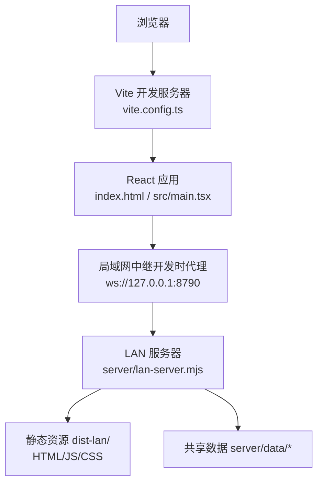
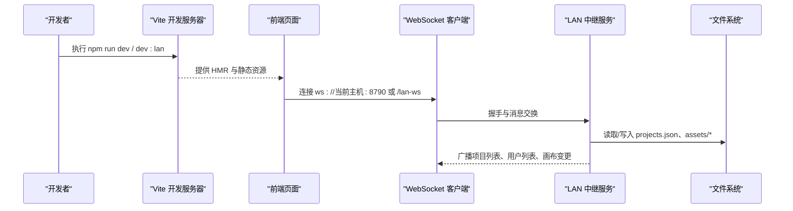
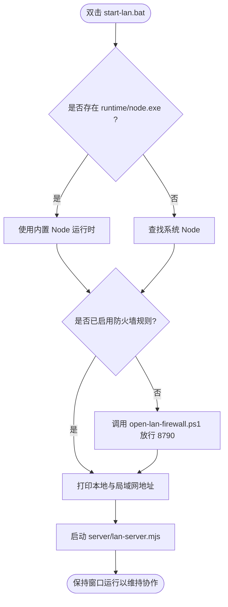
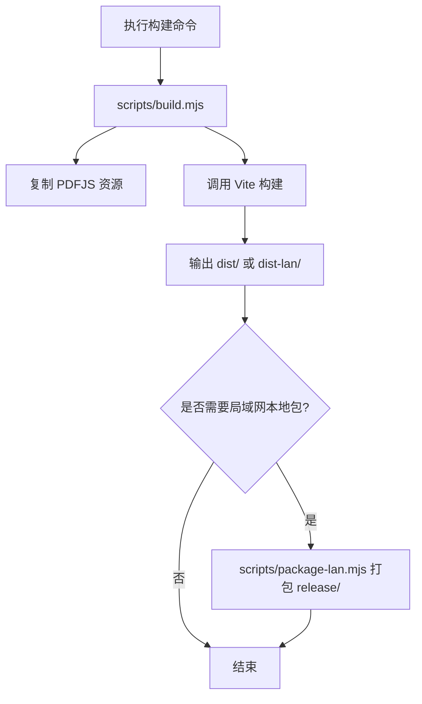
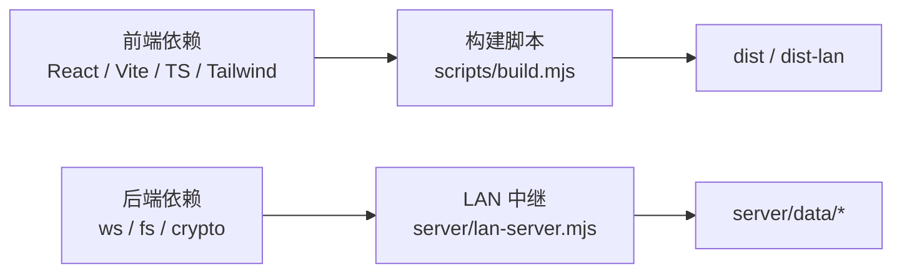

# 快速开始

<cite>
**本文引用的文件**
- [package.json](file://package.json)
- [README.md](file://README.md)
- [vite.config.ts](file://vite.config.ts)
- [index.html](file://index.html)
- [src/main.tsx](file://src/main.tsx)
- [.env.lan](file://.env.lan)
- [.env.online](file://.env.online)
- [scripts/build.mjs](file://scripts/build.mjs)
- [scripts/start-lan.ps1](file://scripts/start-lan.ps1)
- [start-lan.bat](file://start-lan.bat)
- [server/lan-server.mjs](file://server/lan-server.mjs)
- [scripts/package-lan.mjs](file://scripts/package-lan.mjs)
- [src/canvas/clipboard.test.ts](file://src/canvas/clipboard.test.ts)
</cite>

## 目录
1. [简介](#简介)
2. [项目结构](#项目结构)
3. [核心组件](#核心组件)
4. [架构总览](#架构总览)
5. [详细组件分析](#详细组件分析)
6. [依赖分析](#依赖分析)
7. [性能注意事项](#性能注意事项)
8. [故障排除指南](#故障排除指南)
9. [结论](#结论)
10. [附录](#附录)

## 简介
本指南面向首次接触 SuQCanvas 的开发者，目标是在最短时间内完成环境准备、本地开发、局域网协作、构建打包与测试。SuQCanvas 是一款基于浏览器的无限画布应用，支持图片、视频、音频、PDF、Markdown、文本等多媒体元素在同一张画布上组织与连线，并自动保存在本地；同时提供局域网多人协作能力。

## 项目结构
- 前端入口：index.html 引入 React 根节点，src/main.tsx 渲染 App。
- 开发与构建：Vite + TypeScript，脚本通过 scripts/build.mjs 统一调度在线版/局域网版构建。
- 局域网协作：server/lan-server.mjs 提供 HTTP 静态服务与 WebSocket 中继；Windows 启动器 scripts/start-lan.ps1 与 start-lan.bat 负责端口放行与进程启动。
- 配置与环境：.env.lan/.env.online 控制构建目标与可选环境变量；vite.config.ts 配置代理与插件。

图表来源
- [vite.config.ts:9-15](file://vite.config.ts#L9-L15)
- [index.html:16-18](file://index.html#L16-L18)
- [src/main.tsx:1-6](file://src/main.tsx#L1-L6)
- [server/lan-server.mjs:449-451](file://server/lan-server.mjs#L449-L451)

章节来源
- [index.html:1-21](file://index.html#L1-L21)
- [src/main.tsx:1-6](file://src/main.tsx#L1-L6)
- [vite.config.ts:1-21](file://vite.config.ts#L1-L21)

## 核心组件
- 开发模式
  - npm run dev：启动在线版开发服务器，支持热重载与调试。
  - npm run dev:lan：以局域网模式启动开发服务器，监听 0.0.0.0，便于同网设备访问。
- 构建与预览
  - npm run build：交互选择构建在线版/局域网版/全部。
  - npm run build:online / build:lan / build:all：指定构建目标。
  - npm run preview：预览生产构建产物。
- 局域网协作
  - npm run lan：启动 LAN 中继服务。
  - npm run lan:open：在 Windows 上放行 8790 端口防火墙规则。
  - start-lan.bat / scripts/start-lan.ps1：一键启动网页与中继服务，自动检测 Node.js 并设置堆大小。
- 测试
  - npm test：运行 Vitest 单元测试。

章节来源
- [package.json:6-20](file://package.json#L6-L20)
- [README.md:28-54](file://README.md#L28-L54)
- [scripts/start-lan.ps1:1-51](file://scripts/start-lan.ps1#L1-L51)
- [start-lan.bat:1-5](file://start-lan.bat#L1-L5)

## 架构总览
SuQCanvas 由“前端 SPA + Vite 开发/构建”和“LAN 中继服务”两部分组成。开发阶段通过 Vite 代理将 /lan-ws 转发到本机 8790 端口的中继服务；生产阶段可部署静态站点并通过反向代理暴露 wss:// 路径。

图表来源
- [vite.config.ts:9-15](file://vite.config.ts#L9-L15)
- [server/lan-server.mjs:449-451](file://server/lan-server.mjs#L449-L451)
- [server/lan-server.mjs:46-55](file://server/lan-server.mjs#L46-L55)

## 详细组件分析

### 环境与依赖准备
- Node.js 版本要求
  - 使用 Node.js 20 或更高版本（Windows 启动脚本会提示安装）。
- 安装依赖
  - 在项目根目录执行包管理器命令安装依赖。
- 环境变量
  - .env.lan：设置局域网构建目标与可选的中继地址。
  - .env.online：设置在线版构建目标与云端密钥占位说明（真实值放入 .env.online.local）。

章节来源
- [scripts/start-lan.ps1:11-14](file://scripts/start-lan.ps1#L11-L14)
- [.env.lan:1-6](file://.env.lan#L1-L6)
- [.env.online:1-11](file://.env.online#L1-L11)

### 克隆代码库与安装依赖
- 从仓库克隆代码到本地。
- 在项目根目录安装依赖。
- 如需 PDF 功能，构建前会自动复制必要资源。

章节来源
- [package.json:6-11](file://package.json#L6-L11)
- [scripts/build.mjs:27-29](file://scripts/build.mjs#L27-L29)

### 启动开发服务器
- 在线版开发：npm run dev
- 局域网开发：npm run dev:lan（监听 0.0.0.0，便于同网访问）
- 开发时代理：/lan-ws 将被代理至 ws://127.0.0.1:8790

章节来源
- [package.json:8-10](file://package.json#L8-L10)
- [vite.config.ts:9-15](file://vite.config.ts#L9-L15)

### 启动局域网协作服务
- Windows 一键启动
  - 双击 start-lan.bat 或通过 PowerShell 执行 scripts/start-lan.ps1。
  - 首次启动会请求放行 8790 端口防火墙规则。
  - 自动检测 Node.js 运行时，若存在内置 runtime/node.exe 则优先使用，否则使用系统 node。
  - 自动设置 NODE_OPTIONS 最大旧空间大小，提升大资产处理稳定性。
  - 启动后打开浏览器并打印本地与局域网访问地址。
- 手动启动
  - 先构建局域网版：npm run build:lan
  - 启动中继：npm run lan
  - 如需开放端口：npm run lan:open

图表来源
- [start-lan.bat:1-5](file://start-lan.bat#L1-L5)
- [scripts/start-lan.ps1:1-51](file://scripts/start-lan.ps1#L1-L51)
- [server/lan-server.mjs:449-451](file://server/lan-server.mjs#L449-L451)

章节来源
- [scripts/start-lan.ps1:1-51](file://scripts/start-lan.ps1#L1-L51)
- [start-lan.bat:1-5](file://start-lan.bat#L1-L5)
- [server/lan-server.mjs:449-451](file://server/lan-server.mjs#L449-L451)

### 基本开发工作流程
- 修改代码后，Vite 开发服务器会进行热重载，无需刷新页面即可看到效果。
- 调试建议
  - 使用浏览器开发者工具查看网络请求与 WebSocket 连接。
  - 检查控制台日志与错误信息。
  - 确认代理 /lan-ws 是否正确转发到 8790。
- 快捷键与操作参考 README 中的快捷键说明。

章节来源
- [README.md:152-165](file://README.md#L152-L165)

### 构建与打包
- 构建目标
  - 在线版：npm run build:online -> dist/
  - 局域网版：npm run build:lan -> dist-lan/
  - 全部构建：npm run build:all
  - 交互构建：npm run build
- 构建流程
  - 类型检查：tsc -b
  - 资源复制：scripts/copy-pdfjs-assets.mjs
  - 调用 Vite 构建：scripts/build.mjs 根据 mode/outDir 输出
- 局域网本地包
  - npm run package:lan：生成 release/SuQCanvas-LAN.zip，内含 dist-lan、server、node_modules/ws、runtime/node.exe、启动脚本等，解压后双击 start-lan.bat 即可运行。

图表来源
- [scripts/build.mjs:1-94](file://scripts/build.mjs#L1-L94)
- [scripts/package-lan.mjs:1-65](file://scripts/package-lan.mjs#L1-L65)

章节来源
- [package.json:11-15](file://package.json#L11-L15)
- [scripts/build.mjs:1-94](file://scripts/build.mjs#L1-L94)
- [scripts/package-lan.mjs:1-65](file://scripts/package-lan.mjs#L1-L65)

### 测试方法
- 运行测试：npm test
- 测试框架：Vitest，运行环境为 node。
- 示例测试：剪贴板相关逻辑验证。

章节来源
- [package.json:17-18](file://package.json#L17-L18)
- [vite.config.ts:17-19](file://vite.config.ts#L17-L19)
- [src/canvas/clipboard.test.ts:1-40](file://src/canvas/clipboard.test.ts#L1-L40)

## 依赖分析
- 关键依赖
  - 前端：React、@xyflow/react、Zustand、Tailwind CSS、Vite、TypeScript。
  - 后端：ws（WebSocket）、fs/promises、crypto、os、path、http。
- 开发依赖
  - Vitest、fake-indexeddb、oxlint、Tailwind v4、Vite 插件等。
- 构建与脚本
  - scripts/build.mjs 统一构建入口，scripts/package-lan.mjs 生成本地包。

图表来源
- [package.json:22-50](file://package.json#L22-L50)
- [scripts/build.mjs:1-94](file://scripts/build.mjs#L1-L94)
- [server/lan-server.mjs:4-24](file://server/lan-server.mjs#L4-L24)

章节来源
- [package.json:22-50](file://package.json#L22-L50)

## 性能注意事项
- 大资产传输
  - LAN 中继对视频类资产默认采用 HTTP Range 流式拉流，避免整份经 WebSocket 下发导致带宽占用过高。
- 内存优化
  - 启动脚本设置 NODE_OPTIONS 最大旧空间大小，提升大资产处理能力。
- 缓存策略
  - 静态资源与素材返回合理的 Cache-Control；HTML 不缓存。
- 维护任务
  - 定期清理过期备份与孤立素材，释放磁盘空间。

章节来源
- [scripts/start-lan.ps1:38-43](file://scripts/start-lan.ps1#L38-L43)
- [server/lan-server.mjs:107-205](file://server/lan-server.mjs#L107-L205)
- [server/lan-server.mjs:326-372](file://server/lan-server.mjs#L326-L372)

## 故障排除指南
- 无法连接局域网中继
  - 确认 8790 端口已放行（Windows 防火墙），可通过 npm run lan:open 或 scripts/open-lan-firewall.ps1。
  - 检查 Vite 代理 /lan-ws 是否指向 ws://127.0.0.1:8790。
  - 若使用 HTTPS 页面，需通过反向代理暴露 wss://域名/lan-ws。
- 构建失败
  - 确保 Node.js 版本满足要求（20+）。
  - 在线版缺失 Supabase/OSS 密钥不会阻断构建，但功能不可用；请在 .env.online.local 中补充。
- 局域网包无法启动
  - 双击 start-lan.bat 后如弹出 UAC 提示，请允许放行端口。
  - 若未检测到 Node.js，按提示安装 Node.js 20+。
- 测试失败
  - 确认 vitest 环境为 node，必要时重新安装依赖。
  - 针对 IndexedDB 相关测试，确保 fake-indexeddb 已加载。

章节来源
- [vite.config.ts:9-15](file://vite.config.ts#L9-L15)
- [scripts/start-lan.ps1:16-20](file://scripts/start-lan.ps1#L16-L20)
- [scripts/build.mjs:43-52](file://scripts/build.mjs#L43-L52)
- [src/canvas/clipboard.test.ts:1-40](file://src/canvas/clipboard.test.ts#L1-L40)

## 结论
通过以上步骤，你可以在最短时间内完成 SuQCanvas 的环境准备、本地开发、局域网协作、构建打包与测试。建议在开发过程中充分利用 Vite 的热重载与浏览器调试工具，并在生产环境合理配置反向代理与防火墙规则，以确保稳定可靠的协作体验。

## 附录
- 常用命令速查
  - 开发：npm run dev / npm run dev:lan
  - 构建：npm run build / npm run build:online / npm run build:lan / npm run build:all
  - 预览：npm run preview
  - 局域网：npm run lan / npm run lan:open
  - 本地包：npm run package:lan
  - 测试：npm test
- 环境变量
  - .env.lan：VITE_BUILD_TARGET、VITE_LAN_WS_URL（可选）
  - .env.online：VITE_BUILD_TARGET 及在线版密钥占位说明

章节来源
- [package.json:6-20](file://package.json#L6-L20)
- [.env.lan:1-6](file://.env.lan#L1-L6)
- [.env.online:1-11](file://.env.online#L1-L11)