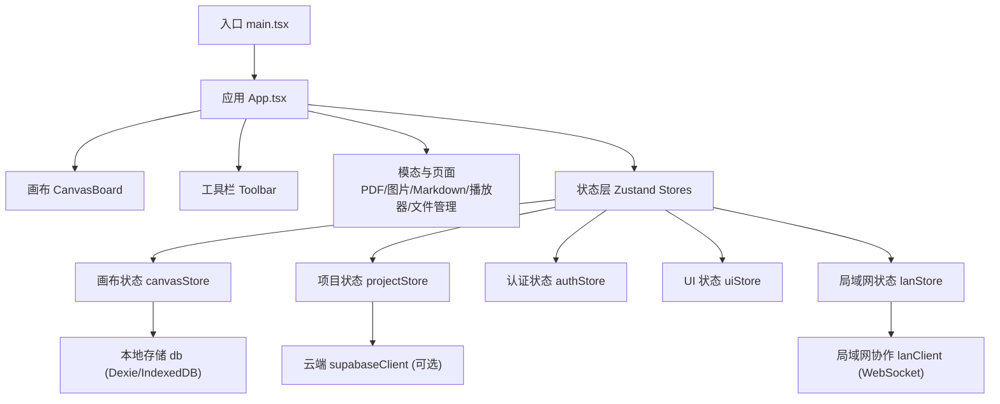
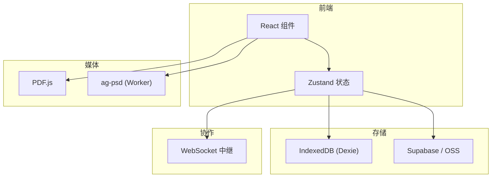
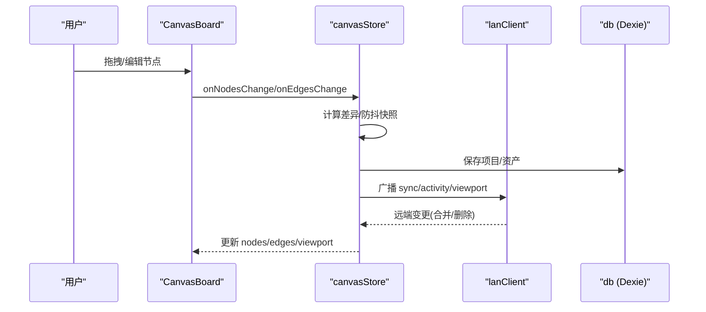
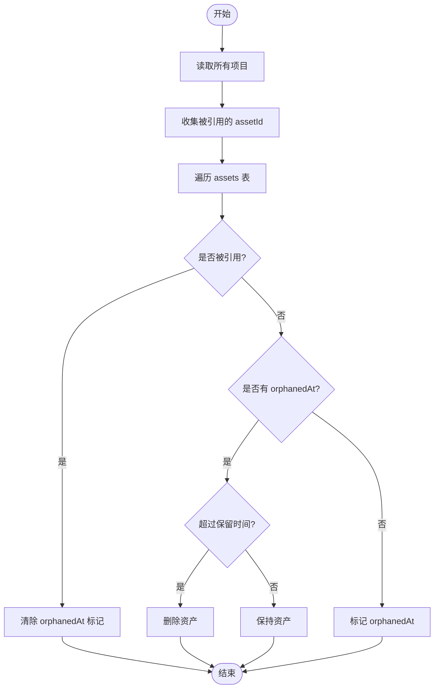
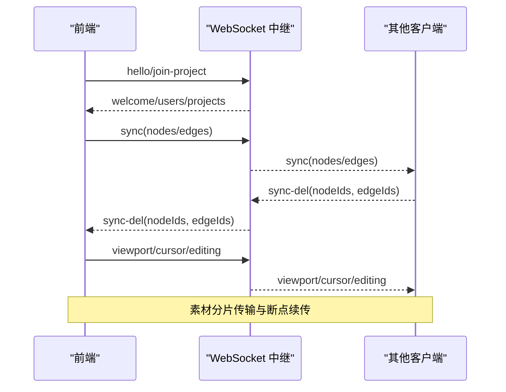
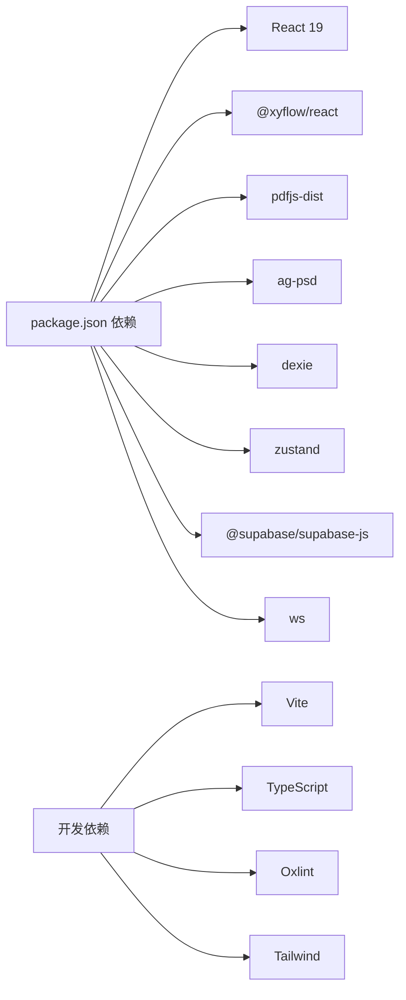

# 技术栈

<cite>
**本文引用的文件**
- [package.json](file://package.json)
- [vite.config.ts](file://vite.config.ts)
- [tsconfig.json](file://tsconfig.json)
- [src/main.tsx](file://src/main.tsx)
- [src/App.tsx](file://src/App.tsx)
- [src/types.ts](file://src/types.ts)
- [src/store/canvasStore.ts](file://src/store/canvasStore.ts)
- [src/db/db.ts](file://src/db/db.ts)
- [src/sync/lanClient.ts](file://src/sync/lanClient.ts)
- [src/sync/supabaseClient.ts](file://src/sync/supabaseClient.ts)
- [src/media/pdf.ts](file://src/media/pdf.ts)
- [src/media/psdPreview.ts](file://src/media/psdPreview.ts)
- [src/io/importExport.ts](file://src/io/importExport.ts)
- [src/buildMode.ts](file://src/buildMode.ts)
- [.oxlintrc.json](file://.oxlintrc.json)
</cite>

## 目录
1. [简介](#简介)
2. [项目结构](#项目结构)
3. [核心组件](#核心组件)
4. [架构总览](#架构总览)
5. [详细组件分析](#详细组件分析)
6. [依赖关系分析](#依赖关系分析)
7. [性能考量](#性能考量)
8. [故障排查指南](#故障排查指南)
9. [结论](#结论)
10. [附录](#附录)

## 简介
本技术栈文档围绕 SuQCanvas 的前端工程化方案展开，重点说明：
- 前端框架与语言：React 19 + TypeScript，提供类型安全与现代化开发体验。
- 构建工具：Vite 提供快速热更新、按需编译与插件生态（React、Tailwind）。
- 可视化画布：@xyflow/react 提供节点/连线编辑能力，配合自定义节点实现多媒体画布。
- 状态管理：Zustand 轻量、易用的全局状态管理，支撑画布历史、协作与 UI 状态。
- 数据存储：IndexedDB（通过 Dexie）用于本地持久化；Supabase 作为云端后端服务。
- 协作通信：WebSocket 实现局域网实时协作（节点/连线同步、视口、光标、活动流、素材传输）。
- 关键第三方库：PDF.js 渲染 PDF，ag-psd 解析 PSD 生成预览，Dexie 简化 IndexedDB 操作。
- 代码质量：Oxlint 进行规则检查，TypeScript 保障类型安全。
- 开发与部署：Vite 配置、多环境构建（在线版/局域网版）、脚本与代理设置。

## 项目结构
SuQCanvas 采用模块化组织方式，按功能域划分目录：
- src/canvas：画布与节点/边类型定义及交互逻辑
- src/components：页面与通用 UI 组件
- src/store：基于 Zustand 的状态管理（画布、项目、认证、UI、局域网等）
- src/db：基于 Dexie 的 IndexedDB 数据模型与清理策略
- src/sync：局域网协作（WebSocket）与云端（Supabase/OSS）集成
- src/media：媒体处理（PDF 渲染、PSD 预览、播放控制等）
- src/io：项目导入导出（ZIP 打包/解压）
- src/utils：工具函数（设备 ID、UUID）
- 根级配置：Vite、TypeScript、Oxlint、包依赖与脚本

图表来源
- [src/main.tsx:1-6](file://src/main.tsx#L1-L6)
- [src/App.tsx:1-74](file://src/App.tsx#L1-L74)
- [src/store/canvasStore.ts:1-399](file://src/store/canvasStore.ts#L1-L399)
- [src/db/db.ts:1-69](file://src/db/db.ts#L1-L69)
- [src/sync/lanClient.ts:1-800](file://src/sync/lanClient.ts#L1-L800)
- [src/sync/supabaseClient.ts:1-18](file://src/sync/supabaseClient.ts#L1-L18)

章节来源
- [src/main.tsx:1-6](file://src/main.tsx#L1-L6)
- [src/App.tsx:1-74](file://src/App.tsx#L1-L74)
- [package.json:1-52](file://package.json#L1-L52)

## 核心组件
- 画布与节点：基于 @xyflow/react 的节点/边模型，结合自定义节点类型（图片、视频、音频、PDF、PSD、Markdown、文本、形状、便签等），支持拖拽、缩放、对齐、层级调整、复制粘贴、撤销/重做。
- 状态管理：Zustand 维护画布图结构、视口、历史栈、剪贴板、选中态等；订阅变更触发局域网广播与本地持久化。
- 本地存储：Dexie 抽象 IndexedDB，定义资产与项目表结构，提供垃圾回收与引用计数清理。
- 协作通信：WebSocket 实现房间级协作，包括画布快照合并、显式删除传播、视口同步、光标位置、编辑中状态、活动日志、大文件分片传输与断点续传。
- 云端服务：Supabase 客户端在“在线构建”时启用，用于项目与资产元数据同步与对象存储（OSS）上传。
- 媒体处理：PDF.js 加载并渲染 PDF 到 Canvas；PSD 通过 ag-psd 在 Web Worker 中解析生成缩略图。
- 导入导出：使用 fflate 将项目 JSON 与资源打包为 ZIP，支持离线导入与在线云同步。

章节来源
- [src/types.ts:1-112](file://src/types.ts#L1-L112)
- [src/store/canvasStore.ts:1-399](file://src/store/canvasStore.ts#L1-L399)
- [src/db/db.ts:1-69](file://src/db/db.ts#L1-L69)
- [src/sync/lanClient.ts:1-800](file://src/sync/lanClient.ts#L1-L800)
- [src/sync/supabaseClient.ts:1-18](file://src/sync/supabaseClient.ts#L1-L18)
- [src/media/pdf.ts:1-50](file://src/media/pdf.ts#L1-L50)
- [src/media/psdPreview.ts:1-62](file://src/media/psdPreview.ts#L1-L62)
- [src/io/importExport.ts:1-203](file://src/io/importExport.ts#L1-L203)

## 架构总览
整体架构由“前端 UI + 状态层 + 本地存储 + 协作/云端 + 媒体处理”构成，Vite 负责构建与开发体验，TypeScript 贯穿类型系统，Oxlint 保障代码质量。

图表来源
- [src/App.tsx:1-74](file://src/App.tsx#L1-L74)
- [src/store/canvasStore.ts:1-399](file://src/store/canvasStore.ts#L1-L399)
- [src/db/db.ts:1-69](file://src/db/db.ts#L1-L69)
- [src/sync/lanClient.ts:1-800](file://src/sync/lanClient.ts#L1-L800)
- [src/sync/supabaseClient.ts:1-18](file://src/sync/supabaseClient.ts#L1-L18)
- [src/media/pdf.ts:1-50](file://src/media/pdf.ts#L1-L50)
- [src/media/psdPreview.ts:1-62](file://src/media/psdPreview.ts#L1-L62)

## 详细组件分析

### 画布与状态（Zustand + @xyflow/react）
- 数据结构：节点与边类型统一扩展自 @xyflow/react，附加业务字段（媒体类型、样式、尺寸、创建信息等）。
- 历史与撤销/重做：基于 past/future 双栈，防抖合并快照，限制历史长度，避免内存膨胀。
- 选择与批量操作：支持对齐、分布、层级调整、复制粘贴（含关联边重建）。
- 视图状态：视口变化通过 WebSocket 广播，支持跟随他人视口。
- 与协作联动：变更触发局域网广播与本地持久化，删除通过显式消息传播，避免并发冲突。

图表来源
- [src/store/canvasStore.ts:1-399](file://src/store/canvasStore.ts#L1-L399)
- [src/sync/lanClient.ts:1-800](file://src/sync/lanClient.ts#L1-L800)
- [src/db/db.ts:1-69](file://src/db/db.ts#L1-L69)

章节来源
- [src/types.ts:1-112](file://src/types.ts#L1-L112)
- [src/store/canvasStore.ts:1-399](file://src/store/canvasStore.ts#L1-L399)

### 本地存储（Dexie + IndexedDB）
- 数据模型：assets（媒体资产）、projects（项目图结构与视口）。
- 生命周期：GC 策略标记孤立资产并在保留期后清理，释放存储空间。
- 请求持久化：尝试调用浏览器持久化 API，确保跨会话可用。

图表来源
- [src/db/db.ts:35-69](file://src/db/db.ts#L35-L69)

章节来源
- [src/db/db.ts:1-69](file://src/db/db.ts#L1-L69)

### 协作通信（WebSocket）
- 连接与重连：自动重试、指数退避、断线恢复、上次连接信息持久化。
- 房间机制：按 projectId 隔离数据，加入/离开房间，推送当前画布给新成员。
- 数据同步：并集合并节点/边，显式删除消息（sync-del）+ 墓碑机制防止晚到旧快照复活。
- 视口与光标：广播视口变化，显示协作者光标与编辑中状态。
- 活动日志：合并批量操作，减少通知噪音。
- 素材传输：分片 base64/二进制传输，空闲超时检测，HTTP Range 流式拉取（视频），封面随资产传输。

图表来源
- [src/sync/lanClient.ts:1-800](file://src/sync/lanClient.ts#L1-L800)

章节来源
- [src/sync/lanClient.ts:1-800](file://src/sync/lanClient.ts#L1-L800)

### 云端服务（Supabase）
- 条件启用：仅在“在线构建”时创建 Supabase 客户端，否则产物不包含该依赖。
- 用途：项目与资产元数据同步、对象存储（OSS）上传密钥获取与直传。

章节来源
- [src/sync/supabaseClient.ts:1-18](file://src/sync/supabaseClient.ts#L1-L18)
- [src/buildMode.ts:1-8](file://src/buildMode.ts#L1-L8)

### 媒体处理（PDF.js 与 ag-psd）
- PDF 渲染：配置 worker、cMap、标准字体与 wasm 路径，渲染页面到 Canvas，支持高 DPI。
- PSD 预览：Web Worker 中解析 PSD，生成缩略图并缓存至 IndexedDB，避免主线程阻塞。

章节来源
- [src/media/pdf.ts:1-50](file://src/media/pdf.ts#L1-L50)
- [src/media/psdPreview.ts:1-62](file://src/media/psdPreview.ts#L1-L62)

### 导入导出（fflate）
- 导出：将项目 JSON 与资源（含缩略图）打包为 ZIP，下载 .sqcanvas 文件。
- 导入：校验格式与版本，还原资产与项目记录，登录状态下同步至云端与对象存储。

章节来源
- [src/io/importExport.ts:1-203](file://src/io/importExport.ts#L1-L203)

## 依赖关系分析
- 运行时依赖：React 19、@xyflow/react、pdfjs-dist、ag-psd、dexie、ws、zustand、supabase-js、ali-oss、fflate、react-markdown。
- 开发依赖：Vite、@vitejs/plugin-react、tailwindcss、typescript、vitest、oxlint、fake-indexeddb。
- 构建与脚本：predev 拷贝 PDF 资源，dev/dev:lan 启动 Vite 开发服务器，build 系列命令执行 tsc 与自定义构建脚本，lan 启动局域网服务器。

图表来源
- [package.json:1-52](file://package.json#L1-L52)

章节来源
- [package.json:1-52](file://package.json#L1-L52)

## 性能考量
- 画布历史防抖：合并频繁变更，限制历史长度，降低内存占用。
- 协作广播节流：节点/边变更与视口变化均通过定时器聚合发送，减少网络抖动。
- 素材传输优化：分片传输、空闲超时、HTTP Range 流式拉取（视频），避免整包下载与内存峰值。
- 媒体处理异步：PSD 解析在 Web Worker 中进行，避免阻塞主线程；PDF 渲染使用独立 worker。
- 构建优化：Vite 按需编译、插件生态提升开发体验；TypeScript 严格类型减少运行时错误。

[本节为通用指导，不直接分析具体文件]

## 故障排查指南
- 局域网连接失败：
  - 检查地址解析与协议（HTTPS 页面需 wss），确认反向代理或端口开放。
  - 查看自动重连日志与状态提示，必要时手动断开重连。
- 协作数据不同步：
  - 关注 sync-del 与墓碑机制，确认删除消息已广播且接收端生效。
  - 检查房间切换与 activeProjectId 是否正确。
- 素材加载异常：
  - 确认资产元数据与 HTTP Range 地址有效，检查分片接收与空闲超时。
  - 对 PDF/PSD 资源，核对 cMap/wasm/worker 路径与 MIME 类型。
- 本地存储不足：
  - 运行 GC 清理孤立资产，评估是否需要请求持久化存储。
- 构建与运行：
  - 确认 predev 已执行以复制 PDF 资源；检查 Vite 代理与端口冲突。

章节来源
- [src/sync/lanClient.ts:1-800](file://src/sync/lanClient.ts#L1-L800)
- [src/db/db.ts:35-69](file://src/db/db.ts#L35-L69)
- [src/media/pdf.ts:1-50](file://src/media/pdf.ts#L1-L50)
- [src/media/psdPreview.ts:1-62](file://src/media/psdPreview.ts#L1-L62)
- [vite.config.ts:1-21](file://vite.config.ts#L1-L21)

## 结论
SuQCanvas 以 React 19 + TypeScript 为基础，借助 Vite 的高效开发体验与 @xyflow/react 的可视化能力，构建了强大的多媒体画布。Zustand 提供简洁的状态管理，Dexie 与 IndexedDB 保障本地持久化，Supabase 提供云端能力。WebSocket 实现稳定的局域网协作，PDF.js 与 ag-psd 完善媒体处理能力。配合 Oxlint 与 TypeScript 的代码质量保障，以及完善的构建与脚本体系，项目具备高可维护性与可扩展性。

[本节为总结性内容，不直接分析具体文件]

## 附录
- 开发与部署要点：
  - 开发模式：npm run dev 或 npm run dev:lan（局域网模式），predev 自动复制 PDF 资源。
  - 构建模式：tsc 类型检查后执行自定义构建脚本，支持 online/lan/all 目标。
  - 代理配置：Vite 开发服务器代理 /lan-ws 到局域网中继，便于 HTTPS 页面调试。
  - 环境变量：通过 .env.lan/.env.online 设置 VITE_BUILD_TARGET，控制 IS_LAN_BUILD/IS_ONLINE_BUILD。
  - 代码质量：Oxlint 规则启用 React Hooks 与导出规范检查。

章节来源
- [package.json:1-52](file://package.json#L1-L52)
- [vite.config.ts:1-21](file://vite.config.ts#L1-L21)
- [src/buildMode.ts:1-8](file://src/buildMode.ts#L1-L8)
- [.oxlintrc.json:1-9](file://.oxlintrc.json#L1-L9)