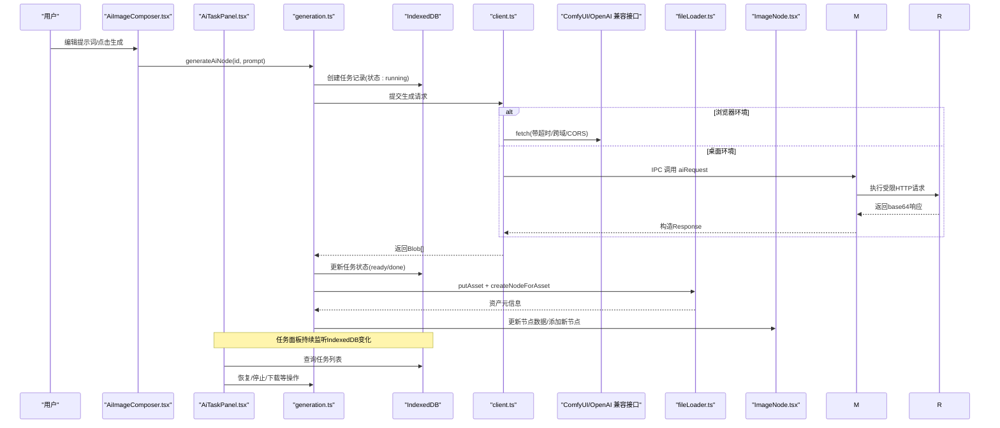
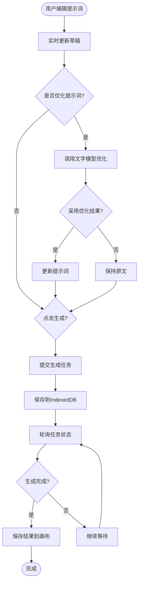
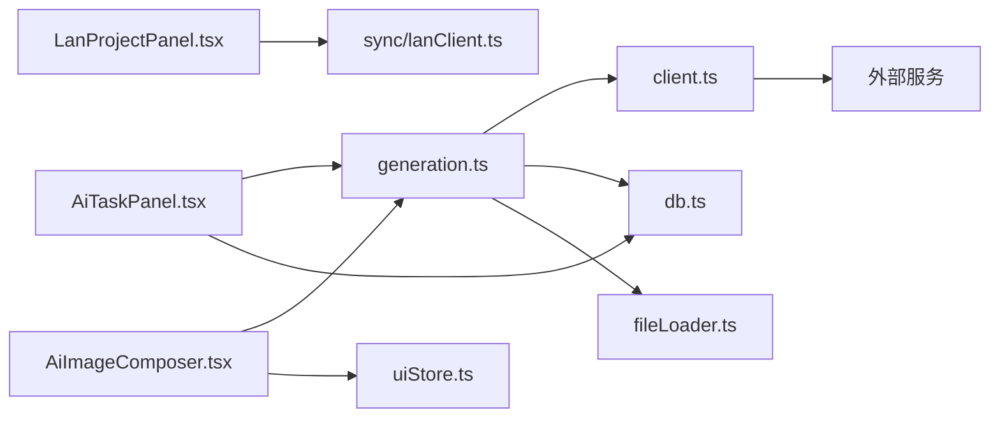

# AI图像生成功能

<cite>
**本文引用的文件**
- [README.md](file://README.md)
- [ai-image-generation.md](file://docs/ai-image-generation.md)
- [AiImageComposer.tsx](file://src/components/AiImageComposer.tsx)
- [AiTaskPanel.tsx](file://src/components/AiTaskPanel.tsx)
- [LanProjectPanel.tsx](file://src/components/LanProjectPanel.tsx)
- [AiImagePanel.tsx](file://src/components/AiImagePanel.tsx)
- [client.ts](file://src/ai/client.ts)
- [generation.ts](file://src/ai/generation.ts)
- [store.ts](file://src/ai/store.ts)
- [taskTypes.ts](file://src/ai/taskTypes.ts)
- [composerPosition.ts](file://src/ai/composerPosition.ts)
- [db.ts](file://src/db/db.ts)
- [ImageNode.tsx](file://src/canvas/nodes/ImageNode.tsx)
- [fileLoader.ts](file://src/io/fileLoader.ts)
- [uiStore.ts](file://src/store/uiStore.ts)
- [main.cjs](file://desktop/main.cjs)
- [ai-request.cjs](file://desktop/ai-request.cjs)
</cite>

## 更新摘要
**所做更改**
- 新增持久化任务管理系统，支持任务恢复和状态跟踪
- 添加内联AI图像生成器AiImageComposer，提供画布内直接编辑体验
- 实现AiTaskPanel用于管理和监控AI任务生命周期
- 集成LanProjectPanel支持局域网项目协作和下载
- 增强IndexedDB持久化存储，支持任务历史记录和结果保留
- 改进错误处理和用户反馈机制

## 目录
1. [简介](#简介)
2. [项目结构](#项目结构)
3. [核心组件](#核心组件)
4. [架构总览](#架构总览)
5. [详细组件分析](#详细组件分析)
6. [依赖关系分析](#依赖关系分析)
7. [性能与可用性](#性能与可用性)
8. [故障排查指南](#故障排查指南)
9. [结论](#结论)

## 简介
本功能为画布应用提供"AI 图像生成"能力，现已升级为完整的AI工作流管理系统，支持两种后端：
- ComfyUI（本地或远程）：通过导入/读取工作流，替换提示词输入节点后提交任务，轮询历史并下载图片。
- OpenAI 兼容 Images API：调用 /images/generations，返回 base64 或图片 URL。

**重大更新**：新增持久化任务管理、内联LAN协作、增强的选择UI和新的组件系统。用户可在画布中直接编辑提示词、管理生成任务、查看历史结果，并通过局域网协作共享项目。所有任务状态和结果都通过IndexedDB持久化存储，支持任务恢复和离线访问。

**章节来源**
- [README.md:7-8](file://README.md#L7-L8)
- [ai-image-generation.md:1-27](file://docs/ai-image-generation.md#L1-L27)

## 项目结构
AI 生图现已扩展为完整的工作流管理系统，涉及前端面板、客户端请求封装、持久化存储、画布节点渲染、桌面端安全传输等模块：

**新增组件**：
- AiImageComposer：内联提示词编辑器，直接在画布节点旁显示
- AiTaskPanel：任务管理面板，显示所有AI任务的执行状态和历史记录
- LanProjectPanel：局域网项目协作面板，支持连接和管理远程项目

**现有组件增强**：
- AiImagePanel：配置面板，支持更多服务类型和参数设置
- generation.ts：任务执行引擎，支持任务恢复和状态持久化
- store.ts：状态管理，新增任务列表和作业状态管理
- db.ts：数据库层，新增aiTasks表用于持久化存储

```mermaid
graph TB
A["AiImageComposer.tsx"] --> B["generation.ts"]
A --> C["AiImagePanel.tsx"]
B --> D["client.ts"]
B --> E["db.ts (IndexedDB)"]
F["AiTaskPanel.tsx"] --> B
F --> E
G["LanProjectPanel.tsx"] --> H["sync/lanClient.ts"]
D --> I["ComfyUI / OpenAI 兼容接口"]
C --> J["uiStore.ts"]
B --> K["fileLoader.ts"]
L["ImageNode.tsx"] --> A
M["desktop/main.cjs"] --> N["desktop/ai-request.cjs"]
D -.浏览器环境/.桌面环境.-> M
```

**图表来源**
- [AiImageComposer.tsx:1-96](file://src/components/AiImageComposer.tsx#L1-L96)
- [AiTaskPanel.tsx:1-78](file://src/components/AiTaskPanel.tsx#L1-L78)
- [LanProjectPanel.tsx:1-71](file://src/components/LanProjectPanel.tsx#L1-L71)
- [generation.ts:1-215](file://src/ai/generation.ts#L1-L215)
- [client.ts:1-157](file://src/ai/client.ts#L1-L157)
- [db.ts:62-80](file://src/db/db.ts#L62-L80)

**章节来源**
- [AiImageComposer.tsx:1-96](file://src/components/AiImageComposer.tsx#L1-L96)
- [AiTaskPanel.tsx:1-78](file://src/components/AiTaskPanel.tsx#L1-L78)
- [LanProjectPanel.tsx:1-71](file://src/components/LanProjectPanel.tsx#L1-L71)
- [generation.ts:1-215](file://src/ai/generation.ts#L1-L215)
- [client.ts:1-157](file://src/ai/client.ts#L1-L157)
- [db.ts:62-80](file://src/db/db.ts#L62-L80)

## 核心组件

### 新增组件

#### AiImageComposer - 内联提示词编辑器
- **功能**：在画布节点旁边直接显示提示词编辑框，支持实时编辑和生成
- **特性**：智能定位算法，自动调整面板位置避免遮挡；支持Ctrl+Enter快捷发送；内置提示词优化功能
- **交互**：点击节点打开编辑器，支持展开/收起，显示当前任务状态和错误信息

#### AiTaskPanel - 任务管理面板
- **功能**：集中管理所有AI任务，显示运行状态、历史记录和操作选项
- **特性**：支持任务恢复、停止等待、下载结果、查看原项目等功能
- **持久化**：所有任务状态保存在IndexedDB中，应用重启后可恢复

#### LanProjectPanel - 局域网协作面板
- **功能**：连接局域网服务器，浏览和下载远程项目
- **特性**：支持最近连接记录、连接状态显示、项目刷新功能
- **协作**：与现有LAN协作系统集成，支持多用户项目共享

### 增强组件

#### generation.ts - 任务执行引擎
- **持久化**：使用IndexedDB存储任务状态，支持中断恢复
- **并发控制**：管理多个并行任务，防止重复提交
- **错误处理**：完善的错误捕获和用户反馈机制
- **资源管理**：自动清理临时对象，防止内存泄漏

**章节来源**
- [AiImageComposer.tsx:14-96](file://src/components/AiImageComposer.tsx#L14-L96)
- [AiTaskPanel.tsx:11-78](file://src/components/AiTaskPanel.tsx#L11-L78)
- [LanProjectPanel.tsx:10-71](file://src/components/LanProjectPanel.tsx#L10-L71)
- [generation.ts:15-215](file://src/ai/generation.ts#L15-L215)

## 架构总览
下图展示了从用户操作到最终落图的端到端流程，涵盖浏览器与桌面两种运行环境，以及新增的持久化任务管理系统。



**图表来源**
- [AiImageComposer.tsx:63-83](file://src/components/AiImageComposer.tsx#L63-L83)
- [AiTaskPanel.tsx:36-73](file://src/components/AiTaskPanel.tsx#L36-L73)
- [generation.ts:152-215](file://src/ai/generation.ts#L152-L215)
- [db.ts:67-80](file://src/db/db.ts#L67-L80)
- [client.ts:18-44](file://src/ai/client.ts#L18-L44)

## 详细组件分析

### 内联编辑器：AiImageComposer.tsx
- **功能要点**
  - 智能定位：使用composerPosition算法自动计算最佳显示位置
  - 实时编辑：支持提示词草稿保存，避免意外丢失
  - 快捷操作：Ctrl+Enter快速发送，ESC关闭面板
  - 状态同步：实时显示任务执行状态和错误信息
  - 参数控制：支持选择参数来源（当前设置/原图参数）
- **关键交互**
  - 节点双击打开编辑器，支持拖拽调整大小
  - 优化提示词按钮调用文字模型API进行扩写
  - 生成按钮支持取消操作，不影响服务端任务
- **错误处理**
  - 网络错误和服务端错误的友好提示
  - 节点锁定检查，防止并发修改冲突



**图表来源**
- [AiImageComposer.tsx:44-92](file://src/components/AiImageComposer.tsx#L44-L92)
- [generation.ts:152-181](file://src/ai/generation.ts#L152-L181)

**章节来源**
- [AiImageComposer.tsx:14-96](file://src/components/AiImageComposer.tsx#L14-L96)
- [composerPosition.ts:1-13](file://src/ai/composerPosition.ts#L1-L13)

### 任务管理：AiTaskPanel.tsx
- **功能要点**
  - 任务列表：显示所有AI任务的详细信息和执行状态
  - 状态管理：支持running、paused、ready、done、error等状态
  - 操作控制：提供查看项目、停止等待、恢复任务、下载图片等功能
  - 权限控制：仅显示当前用户创建的任务
- **关键特性**
  - 自动恢复：应用启动时恢复之前运行的任务
  - 防误关：有运行中的任务时阻止页面关闭
  - 批量操作：支持批量下载生成的图片
- **数据持久化**
  - 任务信息存储在IndexedDB中，包括提示词、参数、结果等
  - 支持任务历史查询和统计

**章节来源**
- [AiTaskPanel.tsx:11-78](file://src/components/AiTaskPanel.tsx#L11-L78)

### 局域网协作：LanProjectPanel.tsx
- **功能要点**
  - 连接管理：支持WebSocket连接到局域网服务器
  - 项目浏览：显示服务器上可用的项目列表
  - 状态显示：实时显示连接状态和服务器信息
  - 历史记录：保存最近使用的服务器地址和名称
- **用户体验**
  - 直观的连接表单和状态指示器
  - 错误处理和重试机制
  - 响应式设计，适配不同屏幕尺寸

**章节来源**
- [LanProjectPanel.tsx:10-71](file://src/components/LanProjectPanel.tsx#L10-L71)

### 任务执行引擎：generation.ts
- **核心功能**
  - 任务调度：管理多个并发任务的执行和状态
  - 持久化：使用IndexedDB存储任务状态和结果
  - 恢复机制：支持中断任务的恢复和重连
  - 资源管理：自动清理临时对象，防止内存泄漏
- **执行流程**
  - 创建任务记录并设置为running状态
  - 调用相应的生成函数（ComfyUI或兼容接口）
  - 轮询任务状态直到完成或失败
  - 将结果应用到画布并更新任务状态
- **错误处理**
  - 网络异常和服务端错误的优雅处理
  - 任务状态的一致性和完整性保证
  - 用户友好的错误提示和恢复建议

**章节来源**
- [generation.ts:15-215](file://src/ai/generation.ts#L15-L215)

### 持久化存储：db.ts
- **数据结构**
  - aiTasks表：存储AI任务的所有信息，包括状态、提示词、结果等
  - 索引设计：按projectId、owner、state、createdAt等字段建立索引
  - 版本管理：支持数据库版本升级和数据迁移
- **数据维护**
  - 垃圾回收：定期清理不再使用的素材文件
  - 存储空间管理：监控和优化IndexedDB使用情况
  - 数据备份：支持导出和导入任务历史

**章节来源**
- [db.ts:62-120](file://src/db/db.ts#L62-L120)

### 客户端封装：client.ts
- **网络层增强**
  - 统一请求接口：支持浏览器和桌面环境的无缝切换
  - 超时控制：默认3分钟超时，防止长时间阻塞
  - 错误处理：详细的错误信息和用户友好的提示
- **服务支持**
  - ComfyUI：完整的工作流解析、参数绑定和结果获取
  - OpenAI兼容：标准的/images/generations接口支持
  - 文字模型：可选的提示词优化功能
- **安全考虑**
  - API Key安全管理，不持久化敏感信息
  - CORS和跨域请求的正确处理
  - 桌面端IPC通信的安全限制

**章节来源**
- [client.ts:1-157](file://src/ai/client.ts#L1-L157)

## 依赖关系分析
- **组件耦合**
  - AiImageComposer依赖generation进行任务执行，依赖store管理状态
  - AiTaskPanel依赖db进行数据持久化，依赖generation进行任务控制
  - LanProjectPanel依赖lanClient进行网络通信，依赖store管理连接状态
  - generation作为核心引擎，协调各个组件之间的交互
- **外部依赖**
  - IndexedDB：用于任务状态和结果的持久化存储
  - ComfyUI服务：/system_stats、/history、/prompt、/view接口
  - OpenAI兼容服务：/images/generations接口
  - 文字模型服务：/chat/completions接口（可选）
- **潜在循环依赖**
  - 通过合理的模块划分避免了循环依赖
  - 使用事件驱动和回调机制解耦组件间的直接依赖



**图表来源**
- [AiImageComposer.tsx:4-11](file://src/components/AiImageComposer.tsx#L4-L11)
- [AiTaskPanel.tsx:2-8](file://src/components/AiTaskPanel.tsx#L2-L8)
- [LanProjectPanel.tsx:2-5](file://src/components/LanProjectPanel.tsx#L2-L5)
- [generation.ts:1-13](file://src/ai/generation.ts#L1-L13)

**章节来源**
- [AiImageComposer.tsx:1-96](file://src/components/AiImageComposer.tsx#L1-L96)
- [AiTaskPanel.tsx:1-78](file://src/components/AiTaskPanel.tsx#L1-L78)
- [LanProjectPanel.tsx:1-71](file://src/components/LanProjectPanel.tsx#L1-L71)
- [generation.ts:1-215](file://src/ai/generation.ts#L1-L215)

## 性能与可用性
- **性能优化**
  - 任务并发控制：防止过多同时执行导致资源耗尽
  - 内存管理：及时释放临时对象，防止内存泄漏
  - 网络优化：请求去重和缓存机制
  - 存储优化：IndexedDB的合理索引设计和数据清理
- **用户体验**
  - 实时反馈：任务状态的即时更新和进度显示
  - 错误恢复：自动重试和手动恢复机制
  - 操作便捷：快捷键支持和直观的操作界面
  - 响应式设计：适配不同设备和屏幕尺寸
- **可靠性保障**
  - 数据持久化：重要数据的安全存储和备份
  - 异常处理：完善的错误捕获和恢复策略
  - 状态一致性：确保任务状态和实际执行的一致性
  - 兼容性测试：支持多种浏览器和环境

## 故障排查指南
- **任务无法启动**
  - 检查网络连接和服务端状态
  - 确认API Key配置正确
  - 查看浏览器控制台的网络请求
- **任务执行中断**
  - 检查IndexedDB存储空间是否充足
  - 确认服务端的任务ID仍然有效
  - 尝试使用"恢复等待"功能重新连接
- **结果未显示**
  - 检查画布节点的锁定状态
  - 确认项目保存是否成功
  - 查看任务面板中的错误信息
- **局域网连接问题**
  - 验证服务器地址和端口配置
  - 检查防火墙和网络设置
  - 确认服务器服务正常运行
- **性能问题**
  - 监控浏览器内存使用情况
  - 清理不必要的任务历史记录
  - 减少同时执行的并发任务数量

**章节来源**
- [generation.ts:145-181](file://src/ai/generation.ts#L145-L181)
- [AiTaskPanel.tsx:31-73](file://src/components/AiTaskPanel.tsx#L31-L73)
- [LanProjectPanel.tsx:25-39](file://src/components/LanProjectPanel.tsx#L25-L39)
- [db.ts:95-120](file://src/db/db.ts#L95-L120)

## 结论
经过全面升级的AI图像生成功能现已成为一个完整的AI工作流管理系统。通过新增的持久化任务管理、内联编辑器、任务控制面板和局域网协作功能，用户可以获得更加流畅和强大的AI图像生成体验。

**主要改进**：
- **持久化存储**：所有任务状态和结果都保存在IndexedDB中，支持应用重启后的恢复
- **内联编辑**：AiImageComposer提供直接的画布内编辑体验，无需切换到独立面板
- **任务管理**：AiTaskPanel集中管理所有AI任务，支持查看、控制和历史追溯
- **局域网协作**：LanProjectPanel支持团队项目共享和协作
- **错误处理**：完善的错误捕获和用户友好的恢复机制

该系统在保持原有功能的基础上，大幅提升了用户体验和功能完整性，适合个人创作和团队协作等多种使用场景。通过合理的架构设计和性能优化，确保了系统的稳定性和可扩展性。