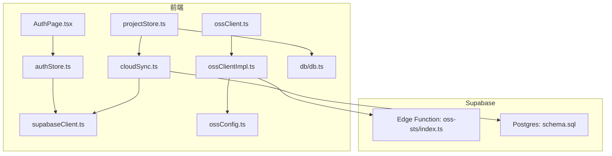
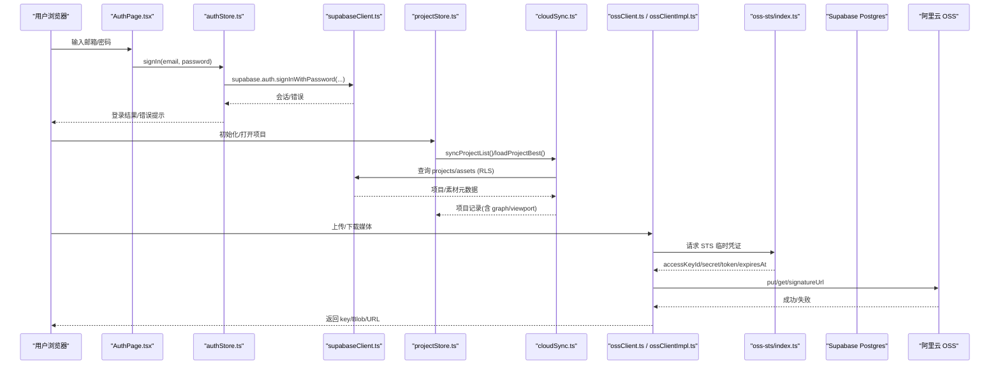
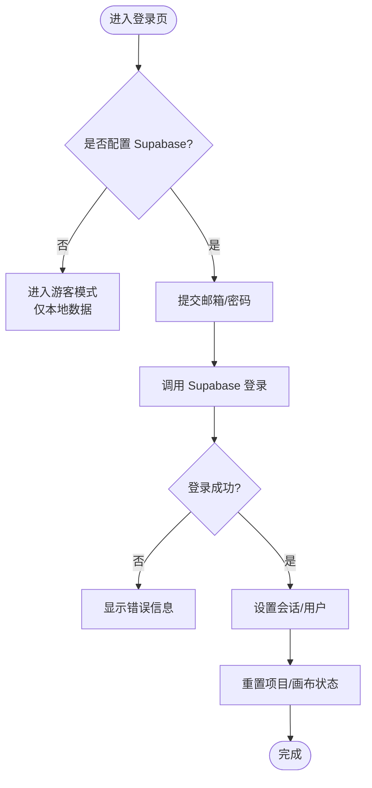
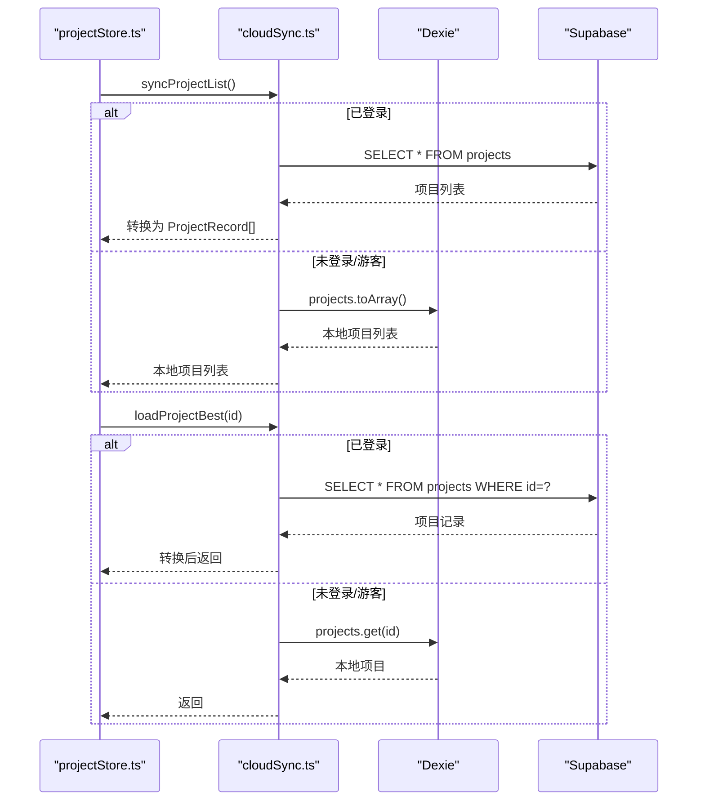
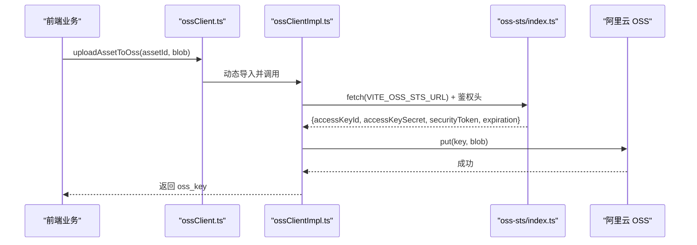
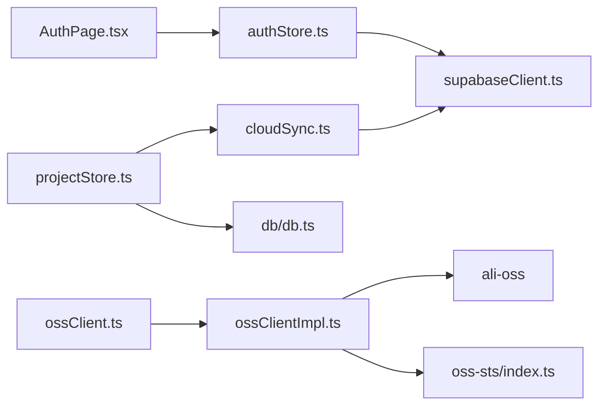

# 云端同步

<cite>
**本文引用的文件**
- [src/sync/cloudSync.ts](file://src/sync/cloudSync.ts)
- [src/sync/supabaseClient.ts](file://src/sync/supabaseClient.ts)
- [src/sync/ossClient.ts](file://src/sync/ossClient.ts)
- [src/sync/ossClientImpl.ts](file://src/sync/ossClientImpl.ts)
- [src/sync/ossConfig.ts](file://src/sync/ossConfig.ts)
- [supabase/functions/oss-sts/index.ts](file://supabase/functions/oss-sts/index.ts)
- [supabase/schema.sql](file://supabase/schema.sql)
- [src/store/authStore.ts](file://src/store/authStore.ts)
- [src/store/projectStore.ts](file://src/store/projectStore.ts)
- [src/db/db.ts](file://src/db/db.ts)
- [src/components/AuthPage.tsx](file://src/components/AuthPage.tsx)
- [README.md](file://README.md)
</cite>

## 目录
1. [简介](#简介)
2. [项目结构](#项目结构)
3. [核心组件](#核心组件)
4. [架构总览](#架构总览)
5. [详细组件分析](#详细组件分析)
6. [依赖关系分析](#依赖关系分析)
7. [性能考量](#性能考量)
8. [故障排查指南](#故障排查指南)
9. [结论](#结论)
10. [附录](#附录)

## 简介
本文件面向 SuQCanvas 的云端同步能力，围绕 Supabase 集成、阿里云 OSS 对象存储、云端数据同步策略、备份恢复、数据模型与索引设计、配置与安全最佳实践，以及常见问题诊断进行系统化说明。文档以源码为依据，提供架构图、时序图与流程图，帮助读者快速理解并正确部署使用。

## 项目结构
云端相关代码集中在 src/sync 目录，配合 supabase 下的函数与数据库脚本；状态管理在 store 中；本地持久化通过 Dexie（IndexedDB）实现。构建时根据目标环境（在线版/局域网版）动态裁剪依赖，确保产物最小化。

图表来源
- [src/components/AuthPage.tsx:1-238](file://src/components/AuthPage.tsx#L1-L238)
- [src/store/authStore.ts:1-104](file://src/store/authStore.ts#L1-L104)
- [src/store/projectStore.ts:1-230](file://src/store/projectStore.ts#L1-L230)
- [src/sync/cloudSync.ts:1-165](file://src/sync/cloudSync.ts#L1-L165)
- [src/sync/supabaseClient.ts:1-18](file://src/sync/supabaseClient.ts#L1-L18)
- [src/sync/ossClient.ts:1-63](file://src/sync/ossClient.ts#L1-L63)
- [src/sync/ossClientImpl.ts:1-135](file://src/sync/ossClientImpl.ts#L1-L135)
- [src/sync/ossConfig.ts:1-20](file://src/sync/ossConfig.ts#L1-L20)
- [supabase/functions/oss-sts/index.ts:1-111](file://supabase/functions/oss-sts/index.ts#L1-L111)
- [supabase/schema.sql:1-90](file://supabase/schema.sql#L1-L90)

章节来源
- [README.md:28-57](file://README.md#L28-L57)

## 核心组件
- 认证与会话：基于 Supabase Auth，支持邮箱密码登录、游客模式、会话监听与状态重置，避免云端/本地数据串写。
- 项目同步：登录后仅读写云端 projects 表；未登录或游客仅读写本地 IndexedDB；自动保存防抖合并多次变更。
- 媒体素材：媒体二进制走阿里云 OSS，元数据写入 Supabase assets 表；缩略图单独 key；支持签名 URL 访问。
- STS 临时凭证：通过 Supabase Edge Functions 调用阿里云 STS AssumeRole，前端安全获取临时密钥并直传 OSS。
- 数据模型：projects 与 assets 两张表，行级安全按用户隔离，附带更新时间触发器与必要索引。

章节来源
- [src/store/authStore.ts:1-104](file://src/store/authStore.ts#L1-L104)
- [src/store/projectStore.ts:1-230](file://src/store/projectStore.ts#L1-L230)
- [src/sync/cloudSync.ts:1-165](file://src/sync/cloudSync.ts#L1-L165)
- [src/sync/ossClient.ts:1-63](file://src/sync/ossClient.ts#L1-L63)
- [src/sync/ossClientImpl.ts:1-135](file://src/sync/ossClientImpl.ts#L1-L135)
- [supabase/schema.sql:1-90](file://supabase/schema.sql#L1-L90)

## 架构总览
整体流程：前端通过 Supabase Client 完成认证与数据库操作；媒体文件通过 ali-oss SDK 直传到阿里云 OSS；OSS 客户端凭据由 Supabase Edge Function 签发 STS 临时令牌，保证密钥不暴露到前端。

图表来源
- [src/components/AuthPage.tsx:61-73](file://src/components/AuthPage.tsx#L61-L73)
- [src/store/authStore.ts:84-88](file://src/store/authStore.ts#L84-L88)
- [src/sync/supabaseClient.ts:1-18](file://src/sync/supabaseClient.ts#L1-L18)
- [src/store/projectStore.ts:81-117](file://src/store/projectStore.ts#L81-L117)
- [src/sync/cloudSync.ts:101-165](file://src/sync/cloudSync.ts#L101-L165)
- [src/sync/ossClient.ts:22-63](file://src/sync/ossClient.ts#L22-L63)
- [src/sync/ossClientImpl.ts:20-72](file://src/sync/ossClientImpl.ts#L20-L72)
- [supabase/functions/oss-sts/index.ts:57-103](file://supabase/functions/oss-sts/index.ts#L57-L103)

## 详细组件分析

### Supabase 认证流程
- 登录入口：AuthPage 提交邮箱/密码，调用 authStore.signIn。
- 会话管理：authStore 维护 user/guest/loading，监听 onAuthStateChange，切换登录态时重置项目/画布状态，防止云端与本地数据串写。
- 游客模式：未配置 Supabase 或选择游客时，进入本地模式，项目仅保存在 IndexedDB。

图表来源
- [src/components/AuthPage.tsx:61-73](file://src/components/AuthPage.tsx#L61-L73)
- [src/store/authStore.ts:49-82](file://src/store/authStore.ts#L49-L82)
- [src/store/authStore.ts:84-102](file://src/store/authStore.ts#L84-L102)

章节来源
- [src/components/AuthPage.tsx:1-238](file://src/components/AuthPage.tsx#L1-L238)
- [src/store/authStore.ts:1-104](file://src/store/authStore.ts#L1-L104)

### 数据库操作与行级安全
- 项目表 projects：存储画布节点、边、视口、时间戳；新增 user_id 列用于 RLS 隔离。
- 素材表 assets：存储媒体元数据（名称、MIME、大小、类型、OSS key、缩略图 key、是否有缩略图）。
- 行级安全：启用 RLS，authenticated 用户只能读写 own projects/assets。
- 触发器：updated_at 自动更新，便于排序与增量判断。
- 索引：为 kind、user_id 建立索引，提升查询性能。

章节来源
- [supabase/schema.sql:12-42](file://supabase/schema.sql#L12-L42)
- [supabase/schema.sql:57-77](file://supabase/schema.sql#L57-L77)

### 云端项目同步策略
- 列表加载：登录后仅从云端读取 projects；未登录/游客仅从本地读取。
- 项目打开：优先从云端加载（已登录），否则回退本地。
- 自动保存：画布变更防抖 500ms，合并后写入云端或本地；保存失败有错误提示。
- 重命名：云端用户直接更新云端 name；本地用户更新本地并广播。
- 新建项目：云端用户创建云端记录；本地用户写入 IndexedDB。

图表来源
- [src/store/projectStore.ts:81-117](file://src/store/projectStore.ts#L81-L117)
- [src/sync/cloudSync.ts:101-165](file://src/sync/cloudSync.ts#L101-L165)

章节来源
- [src/store/projectStore.ts:1-230](file://src/store/projectStore.ts#L1-L230)
- [src/sync/cloudSync.ts:1-165](file://src/sync/cloudSync.ts#L1-L165)

### 对象存储服务（OSS）集成
- 客户端封装：ossClient.ts 提供统一接口（put/get/signatureUrl），并在非在线构建时返回空实现，避免引入 ali-oss。
- 凭据获取：ossClientImpl.ts 通过 getCredentials 从环境变量或 STS 服务获取临时密钥；若使用 STS，会携带 Supabase anon key 作为鉴权头。
- 上传下载：媒体文件 key 形如 assets/<id>.bin；缩略图 key 形如 assets/<id>.thumb；下载时将 Buffer/Uint8Array 转为 Blob。
- 签名 URL：私有桶场景下生成 1 小时有效签名 URL，供前端直接播放/预览。
- 大文件分片上传：当前实现使用 ali-oss SDK 的 put 方法，SDK 内部处理分片与断点续传；如需自定义分片策略，可在 getOssClient 基础上扩展。

图表来源
- [src/sync/ossClient.ts:22-36](file://src/sync/ossClient.ts#L22-L36)
- [src/sync/ossClientImpl.ts:20-81](file://src/sync/ossClientImpl.ts#L20-L81)
- [supabase/functions/oss-sts/index.ts:84-103](file://supabase/functions/oss-sts/index.ts#L84-L103)

章节来源
- [src/sync/ossClient.ts:1-63](file://src/sync/ossClient.ts#L1-L63)
- [src/sync/ossClientImpl.ts:1-135](file://src/sync/ossClientImpl.ts#L1-L135)
- [src/sync/ossConfig.ts:1-20](file://src/sync/ossConfig.ts#L1-L20)
- [supabase/functions/oss-sts/index.ts:1-111](file://supabase/functions/oss-sts/index.ts#L1-L111)

### 云端数据同步策略（增量、冲突、版本）
- 增量同步：利用 updated_at 字段排序与“最近一条”策略，登录后列表按更新时间倒序；打开项目时直接取指定 id 的记录。
- 冲突检测与解决：当前实现采用“最后写入者胜”的策略（覆盖式 upsert），未实现多端并发冲突合并；建议后续引入版本号或操作日志（OT/CRDT）以支持协作。
- 版本管理：projects 表包含 created_at/updated_at，可用于审计与回滚；assets 表无显式版本字段，如需版本化可新增 version 列并配合 RLS。

章节来源
- [src/sync/cloudSync.ts:101-165](file://src/sync/cloudSync.ts#L101-L165)
- [supabase/schema.sql:12-20](file://supabase/schema.sql#L12-L20)

### 数据备份与恢复
- 项目快照：云端 projects 表保留历史更新时间；可通过导出 .sqcanvas 文件（zip 打包画布+原始媒体）实现离线备份与迁移。
- 素材备份：媒体二进制存储在 OSS，元数据在 assets 表；建议定期备份 OSS 桶与 Supabase 数据库。
- 批量导入导出：应用内置 .sqcanvas 导入导出能力，适合跨设备/跨环境迁移。

章节来源
- [README.md:21-25](file://README.md#L21-L25)
- [supabase/schema.sql:12-35](file://supabase/schema.sql#L12-L35)

### 数据模型与索引设计
- 项目表 projects：主键 id(uuid)，user_id(uuid, RLS 隔离)，name(text)，graph(jsonb)，viewport(jsonb)，created_at/updated_at(timestamptz)。
- 素材表 assets：主键 id(text)，user_id(uuid, RLS 隔离)，name/mime/size/kind(文本/数值/枚举)，oss_key/oss_thumb_key(文本)，has_thumbnail(boolean)，created_at(timestamptz)。
- 索引：idx_assets_kind(kind)、idx_projects_user(user_id)、idx_assets_user(user_id)。
- 触发器：updated_at 自动更新，便于排序与增量判断。

章节来源
- [supabase/schema.sql:12-42](file://supabase/schema.sql#L12-L42)
- [supabase/schema.sql:44-55](file://supabase/schema.sql#L44-L55)

### 配置指南与安全最佳实践
- 环境变量（前端）：
  - VITE_SUPABASE_URL、VITE_SUPABASE_ANON_KEY：Supabase 实例与匿名密钥。
  - VITE_OSS_REGION、VITE_OSS_BUCKET、VITE_OSS_ACCESS_KEY_ID、VITE_OSS_ACCESS_KEY_SECRET、VITE_OSS_STS_URL：OSS 区域、桶、AK/SK 或 STS 服务地址。
- 服务端（Supabase Edge Function）：
  - ALIYUN_AK_ID、ALIYUN_AK_SECRET、ALIYUN_ROLE_ARN：用于 AssumeRole 获取临时凭证。
- 安全建议：
  - 生产环境务必使用 STS 临时凭证，避免在前端暴露长期 AK/SK。
  - 启用 Supabase RLS，确保每个用户只能访问自己的数据。
  - 限制 Edge Function 的 CORS 与鉴权头，仅允许受信任域名。
  - 对 OSS 桶启用私有访问，通过签名 URL 或 STS 控制访问时效。

章节来源
- [src/sync/supabaseClient.ts:4-13](file://src/sync/supabaseClient.ts#L4-L13)
- [src/sync/ossConfig.ts:4-11](file://src/sync/ossConfig.ts#L4-L11)
- [src/sync/ossClientImpl.ts:4-9](file://src/sync/ossClientImpl.ts#L4-L9)
- [supabase/functions/oss-sts/index.ts:4-11](file://supabase/functions/oss-sts/index.ts#L4-L11)
- [supabase/schema.sql:57-77](file://supabase/schema.sql#L57-L77)

## 依赖关系分析
- 构建期裁剪：
  - IS_ONLINE_BUILD 控制是否引入 @supabase/supabase-js。
  - VITE_BUILD_TARGET !== 'lan' 控制是否引入 ali-oss。
- 运行时依赖：
  - 认证与数据库：supabaseClient -> Supabase JS SDK。
  - 媒体存储：ossClient -> ossClientImpl -> ali-oss -> STS 服务。
  - 本地存储：db/db.ts -> Dexie (IndexedDB)。

图表来源
- [src/components/AuthPage.tsx:1-238](file://src/components/AuthPage.tsx#L1-L238)
- [src/store/authStore.ts:1-104](file://src/store/authStore.ts#L1-L104)
- [src/sync/supabaseClient.ts:1-18](file://src/sync/supabaseClient.ts#L1-L18)
- [src/store/projectStore.ts:1-230](file://src/store/projectStore.ts#L1-L230)
- [src/sync/cloudSync.ts:1-165](file://src/sync/cloudSync.ts#L1-L165)
- [src/db/db.ts:1-69](file://src/db/db.ts#L1-L69)
- [src/sync/ossClient.ts:1-63](file://src/sync/ossClient.ts#L1-L63)
- [src/sync/ossClientImpl.ts:1-135](file://src/sync/ossClientImpl.ts#L1-L135)
- [supabase/functions/oss-sts/index.ts:1-111](file://supabase/functions/oss-sts/index.ts#L1-L111)

章节来源
- [src/sync/supabaseClient.ts:7-13](file://src/sync/supabaseClient.ts#L7-L13)
- [src/sync/ossClient.ts:3-6](file://src/sync/ossClient.ts#L3-L6)

## 性能考量
- 自动保存防抖：500ms 合并多次画布变更，减少网络请求与数据库压力。
- 资源懒加载：视频离开视口卸载，降低内存占用。
- 索引优化：为 kind、user_id 建索引，提升列表与过滤查询效率。
- 临时凭证缓存：STS 凭证在有效期内复用，减少边缘函数调用频率。
- 私有桶签名 URL：默认 1 小时有效期，平衡安全性与带宽成本。

[本节为通用性能建议，不直接分析具体文件]

## 故障排查指南
- 无法登录/未配置 Supabase：
  - 检查 VITE_SUPABASE_URL 与 VITE_SUPABASE_ANON_KEY 是否正确。
  - 确认 Edge Function 已部署且 CORS 允许前端域名。
- 上传失败/无法获取 STS 凭证：
  - 检查 VITE_OSS_STS_URL 是否可达，Edge Function 是否返回有效凭证。
  - 确认 ALIYUN_AK_ID/SECRET/ROLE_ARN 已正确配置。
- 下载失败/缩略图异常：
  - 检查 assets 表中 oss_key/oss_thumb_key 是否存在。
  - 确认 OSS 桶权限与签名 URL 生成逻辑正常。
- 项目不同步/数据错乱：
  - 确认 RLS 策略生效，user_id 正确关联。
  - 切换登录态时会重置项目状态，避免云端/本地串写。
- 构建产物过大：
  - 确认构建目标为 lan 时，ali-oss 未被引入；在线版需配置环境变量以启用 Supabase/OSS。

章节来源
- [src/components/AuthPage.tsx:61-73](file://src/components/AuthPage.tsx#L61-L73)
- [src/sync/ossClientImpl.ts:20-45](file://src/sync/ossClientImpl.ts#L20-L45)
- [src/sync/ossClientImpl.ts:101-134](file://src/sync/ossClientImpl.ts#L101-L134)
- [src/store/authStore.ts:67-82](file://src/store/authStore.ts#L67-L82)
- [supabase/schema.sql:57-77](file://supabase/schema.sql#L57-L77)

## 结论
SuQCanvas 的云端同步方案以 Supabase 为核心，结合阿里云 OSS 实现安全的媒体存储与访问。通过 STS 临时凭证、行级安全与合理的索引设计，保障了数据安全与查询性能。当前同步策略采用“最后写入者胜”，适用于单用户或多设备顺序编辑；未来可扩展版本化与冲突合并机制以支持多人实时协作。建议在生产环境中严格遵循安全最佳实践，并结合监控与备份策略保障稳定性。

[本节为总结性内容，不直接分析具体文件]

## 附录
- 快速开始与构建：参考 README 中的命令与环境变量说明。
- 数据库初始化：执行 supabase/schema.sql 完成表结构与策略初始化。
- 边缘函数部署：将 supabase/functions/oss-sts/index.ts 部署至 Supabase，并配置 Secrets。

章节来源
- [README.md:28-57](file://README.md#L28-L57)
- [supabase/schema.sql:1-90](file://supabase/schema.sql#L1-L90)
- [supabase/functions/oss-sts/index.ts:4-11](file://supabase/functions/oss-sts/index.ts#L4-L11)