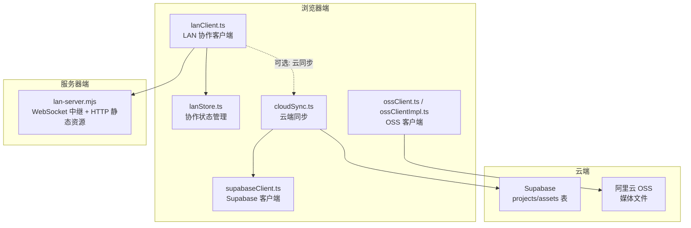
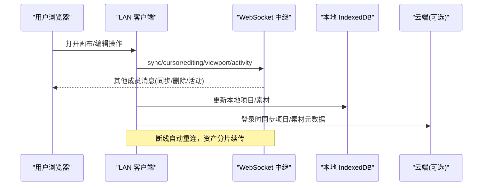
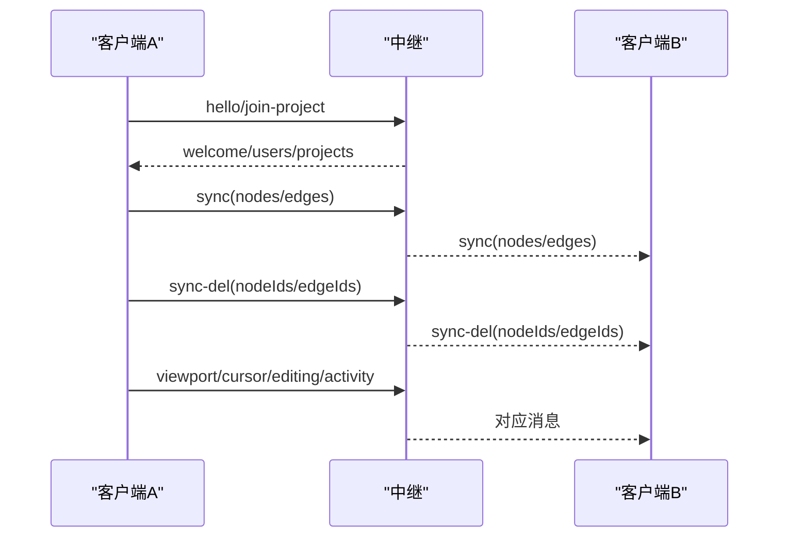
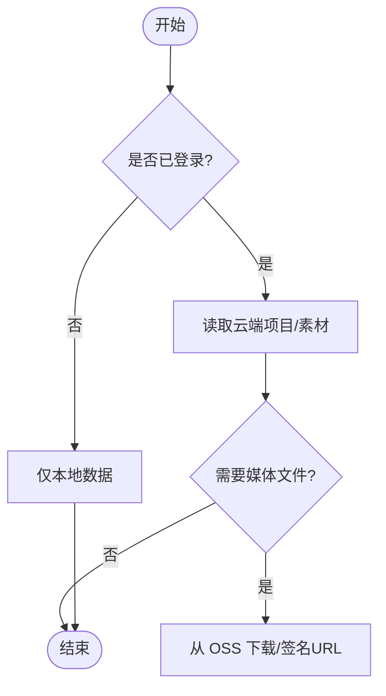
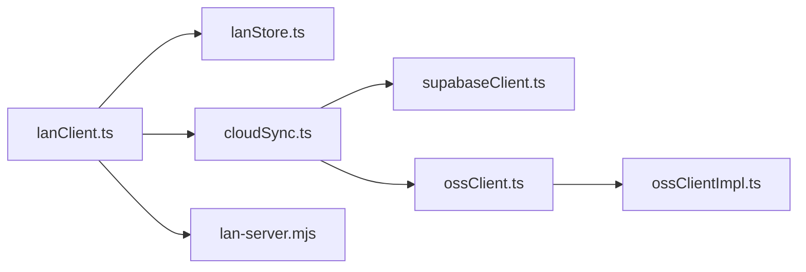

# 协作同步系统

<cite>
**本文引用的文件**
- [src/sync/lanClient.ts](file://src/sync/lanClient.ts)
- [server/lan-server.mjs](file://server/lan-server.mjs)
- [src/store/lanStore.ts](file://src/store/lanStore.ts)
- [src/sync/cloudSync.ts](file://src/sync/cloudSync.ts)
- [src/sync/supabaseClient.ts](file://src/sync/supabaseClient.ts)
- [src/sync/ossClient.ts](file://src/sync/ossClient.ts)
- [src/sync/ossClientImpl.ts](file://src/sync/ossClientImpl.ts)
- [src/sync/ossConfig.ts](file://src/sync/ossConfig.ts)
- [supabase/schema.sql](file://supabase/schema.sql)
- [README.md](file://README.md)
</cite>

## 目录
1. [简介](#简介)
2. [项目结构](#项目结构)
3. [核心组件](#核心组件)
4. [架构总览](#架构总览)
5. [详细组件分析](#详细组件分析)
6. [依赖关系分析](#依赖关系分析)
7. [性能与一致性](#性能与一致性)
8. [故障排除指南](#故障排除指南)
9. [结论](#结论)
10. [附录：配置与部署](#附录配置与部署)

## 简介
本文件为 SuQCanvas 的协作同步系统提供全面文档，覆盖局域网协作、云端同步、断线重连、数据一致性与状态管理等关键主题。重点说明：
- 局域网协作：WebSocket 通信协议、实时画布同步、冲突解决（墓碑机制与并集合并）、光标同步、视图同步、编辑活动广播、房间管理。
- 云端同步：Supabase 集成、对象存储上传（OSS）、项目与素材元数据同步、备份恢复。
- 可靠性：断线自动重连、资产分片传输、HTTP Range 流式拉取、维护任务清理。
- 状态管理：用户身份、房间与会话、消息广播、活动日志。
- 配置与部署：环境变量、Nginx 反向代理、本地包一键启动。

## 项目结构
协作相关代码主要分布在以下模块：
- 客户端 LAN 协作：src/sync/lanClient.ts
- 服务端中继：server/lan-server.mjs
- 协作状态管理：src/store/lanStore.ts
- 云端同步：src/sync/cloudSync.ts、src/sync/supabaseClient.ts
- 对象存储：src/sync/ossClient.ts、src/sync/ossClientImpl.ts、src/sync/ossConfig.ts
- 数据库模式：supabase/schema.sql
- 使用说明与部署指引：README.md

图表来源
- [src/sync/lanClient.ts:1-1254](file://src/sync/lanClient.ts#L1-L1254)
- [server/lan-server.mjs:1-917](file://server/lan-server.mjs#L1-L917)
- [src/store/lanStore.ts:1-160](file://src/store/lanStore.ts#L1-L160)
- [src/sync/cloudSync.ts:1-165](file://src/sync/cloudSync.ts#L1-L165)
- [src/sync/supabaseClient.ts:1-18](file://src/sync/supabaseClient.ts#L1-L18)
- [src/sync/ossClient.ts:1-63](file://src/sync/ossClient.ts#L1-L63)
- [src/sync/ossClientImpl.ts:1-135](file://src/sync/ossClientImpl.ts#L1-L135)

章节来源
- [README.md:28-123](file://README.md#L28-L123)

## 核心组件
- LAN 协作客户端：负责 WebSocket 连接、消息路由、画布同步、删除传播、视口广播、光标与编辑状态广播、素材分片传输、断线重连。
- 服务端中继：维护在线用户、房间（项目）成员、共享项目持久化、资产缓存与分发、HTTP Range 流式拉取、备份与回收。
- 协作状态管理：集中管理用户列表、当前项目、跟随状态、远端视口、光标位置、编辑中节点、活动日志等。
- 云端同步：登录态判断、项目与素材元数据的 Supabase 读写、按登录态选择数据源。
- 对象存储：根据构建目标动态加载 OSS 客户端，支持 STS 临时凭证、签名 URL、缩略图上传下载。

章节来源
- [src/sync/lanClient.ts:1-1254](file://src/sync/lanClient.ts#L1-L1254)
- [server/lan-server.mjs:1-917](file://server/lan-server.mjs#L1-L917)
- [src/store/lanStore.ts:1-160](file://src/store/lanStore.ts#L1-L160)
- [src/sync/cloudSync.ts:1-165](file://src/sync/cloudSync.ts#L1-L165)
- [src/sync/supabaseClient.ts:1-18](file://src/sync/supabaseClient.ts#L1-L18)
- [src/sync/ossClient.ts:1-63](file://src/sync/ossClient.ts#L1-L63)
- [src/sync/ossClientImpl.ts:1-135](file://src/sync/ossClientImpl.ts#L1-L135)

## 架构总览
协作系统由“客户端—中继—云端”三层组成：
- 客户端通过 WebSocket 加入房间（项目），广播画布变更、视口、光标与编辑活动；接收其他成员的消息并合并到本地状态。
- 中继维护房间成员、共享项目与资产缓存，支持大文件的分片传输与 HTTP Range 流式拉取，降低带宽压力。
- 云端通过 Supabase 存储项目与素材元数据，OSS 存储实际媒体文件；登录态下优先使用云端数据。

图表来源
- [src/sync/lanClient.ts:254-362](file://src/sync/lanClient.ts#L254-L362)
- [server/lan-server.mjs:661-764](file://server/lan-server.mjs#L661-L764)
- [src/sync/cloudSync.ts:101-165](file://src/sync/cloudSync.ts#L101-L165)

## 详细组件分析

### 局域网协作：WebSocket 协议与消息流
- 连接建立与握手
  - 客户端解析地址（ws/wss）、默认地址策略、保存上次连接信息、自动重连。
  - 服务端分配设备 ID、颜色、IP，返回欢迎消息与项目列表。
- 房间（项目）管理
  - join-project/leave-project：进入或离开项目房间，仅在该房间内广播消息。
  - project-list/project-data：刷新共享项目列表，拉取项目快照。
- 画布同步与冲突解决
  - sync：按 id 并集合并节点与边，保留本地选中状态；普通快照不再隐式删除。
  - sync-del：显式删除节点/边，配合墓碑机制避免晚到旧快照复活。
  - 墓碑窗口：TOMBSTONE_MS 内标记被删除 id，防止误复活。
- 视口与光标同步
  - viewport：跟随他人时不广播自身视口；跟随者接收远端视口。
  - cursor：广播鼠标坐标与更新时间，用于显示协作者光标。
- 编辑权限与活动广播
  - editing：广播当前编辑中的节点与标签，支持取消编辑。
  - activity：合并批量创建/删除动作，减少刷屏；记录移动、编辑、连线等操作。
- 素材传输
  - asset-meta/asset-chunk：分片传输，直接解码字节分片，避免拼接 base64 内存峰值。
  - asset-http：视频走 HTTP Range 流式拉取，减少 WebSocket 负载。
  - asset-thumb：封面随资产下发，避免重复解码抓帧。
  - asset-request：缺失素材时请求补充，带超时去重。

图表来源
- [src/sync/lanClient.ts:409-642](file://src/sync/lanClient.ts#L409-L642)
- [server/lan-server.mjs:661-764](file://server/lan-server.mjs#L661-L764)

章节来源
- [src/sync/lanClient.ts:1-1254](file://src/sync/lanClient.ts#L1-L1254)
- [server/lan-server.mjs:1-917](file://server/lan-server.mjs#L1-L917)

### 多人协作核心特性
- 光标同步：sendLanCursor 广播坐标与时间戳；接收端在 lanStore 中设置光标位置与颜色。
- 节点锁定：通过 editing 状态标识当前编辑中的节点；广播 active/inactive 控制编辑权。
- 视图同步：scheduleViewportBroadcast 防抖广播视口；跟随模式下停止广播自身视口。
- 编辑权限控制：editing 消息携带 nodeId 与 label；清除编辑时广播 active=false。

章节来源
- [src/sync/lanClient.ts:788-800](file://src/sync/lanClient.ts#L788-L800)
- [src/store/lanStore.ts:22-51](file://src/store/lanStore.ts#L22-L51)

### 云端同步：Supabase 与对象存储
- 登录态判断：isCloudAuthed 基于 supabase.auth.getUser。
- 项目与素材元数据：
  - upsertProjectToCloud/fetchCloudProjects/loadProjectBest：登录后从云端读取/写入项目。
  - upsertAssetMetaToCloud/fetchCloudAssets/deleteAssetFromCloud：素材元数据增删改查。
- 对象存储（OSS）：
  - 动态导入实现：ossClient.ts 根据构建目标决定是否引入 ossClientImpl。
  - STS 临时凭证：通过 VITE_OSS_STS_URL 获取短期访问令牌，自动刷新。
  - 签名 URL：私有桶生成可访问链接，默认 1 小时有效。
  - 缩略图：上传/下载视频缩略图，提升播放体验。

图表来源
- [src/sync/cloudSync.ts:18-165](file://src/sync/cloudSync.ts#L18-L165)
- [src/sync/ossClient.ts:1-63](file://src/sync/ossClient.ts#L1-L63)
- [src/sync/ossClientImpl.ts:20-72](file://src/sync/ossClientImpl.ts#L20-L72)

章节来源
- [src/sync/cloudSync.ts:1-165](file://src/sync/cloudSync.ts#L1-L165)
- [src/sync/supabaseClient.ts:1-18](file://src/sync/supabaseClient.ts#L1-L18)
- [src/sync/ossClient.ts:1-63](file://src/sync/ossClient.ts#L1-L63)
- [src/sync/ossClientImpl.ts:1-135](file://src/sync/ossClientImpl.ts#L1-L135)
- [supabase/schema.sql:12-36](file://supabase/schema.sql#L12-L36)

### 断线重连与数据一致性
- 自动重连：指数退避（RECONNECT_BASE_MS 至 RECONNECT_MAX_MS），首次失败提示，后续持续重试；保存上次连接配置，页面刷新后自动重连。
- 资产续传：中断时保留 pendingAssets 与 seen 索引，重连后可从断点续传；空闲超时判定失败，避免长时间阻塞。
- 一致性保证：
  - 并集合并：远端节点覆盖同名字段，本地独有节点保留，避免整幅抹除。
  - 墓碑机制：删除后 TOMBSTONE_MS 内标记 id，晚到旧快照不会复活。
  - 显式删除：sync-del 独立于普通快照，确保删除语义明确。
  - 服务器侧维护：定期清理过期备份与孤立资产，保障磁盘空间与数据健康。

章节来源
- [src/sync/lanClient.ts:119-179](file://src/sync/lanClient.ts#L119-L179)
- [src/sync/lanClient.ts:254-362](file://src/sync/lanClient.ts#L254-L362)
- [src/sync/lanClient.ts:527-598](file://src/sync/lanClient.ts#L527-L598)
- [server/lan-server.mjs:107-205](file://server/lan-server.mjs#L107-L205)

### 协作状态管理
- 用户身份：selfId、name、color、ip；设备 ID 用于项目所有权与删除权限校验。
- 房间管理：activeProjectId 表示当前房间；join/leave 切换房间并清理协作状态。
- 消息广播：roomSend 统一附加 projectId，确保消息仅在房间范围内广播。
- 活动日志：activities 记录最近 100 条活动，支持 create/delete/move/edit/connect/change。
- 跟随与视口：followId 控制跟随他人；remoteViewport 显示跟随目标视口。

章节来源
- [src/store/lanStore.ts:1-160](file://src/store/lanStore.ts#L1-L160)
- [src/sync/lanClient.ts:204-212](file://src/sync/lanClient.ts#L204-L212)
- [src/sync/lanClient.ts:718-756](file://src/sync/lanClient.ts#L718-L756)

## 依赖关系分析
- 客户端与服务端通过 WebSocket 协议耦合，消息类型 t 作为路由键。
- 客户端状态集中在 lanStore，解耦 UI 与业务逻辑。
- 云端与本地数据源通过 cloudSync 抽象，按登录态切换。
- OSS 客户端通过构建目标条件编译，局域网版不包含 OSS 依赖，减小产物体积。

图表来源
- [src/sync/lanClient.ts:1-1254](file://src/sync/lanClient.ts#L1-L1254)
- [src/store/lanStore.ts:1-160](file://src/store/lanStore.ts#L1-L160)
- [src/sync/cloudSync.ts:1-165](file://src/sync/cloudSync.ts#L1-L165)
- [src/sync/supabaseClient.ts:1-18](file://src/sync/supabaseClient.ts#L1-L18)
- [src/sync/ossClient.ts:1-63](file://src/sync/ossClient.ts#L1-L63)
- [src/sync/ossClientImpl.ts:1-135](file://src/sync/ossClientImpl.ts#L1-L135)
- [server/lan-server.mjs:1-917](file://server/lan-server.mjs#L1-L917)

章节来源
- [src/sync/lanClient.ts:1-1254](file://src/sync/lanClient.ts#L1-L1254)
- [src/sync/cloudSync.ts:1-165](file://src/sync/cloudSync.ts#L1-L165)
- [server/lan-server.mjs:1-917](file://server/lan-server.mjs#L1-L917)

## 性能与一致性
- 画布同步防抖：150ms 合并多次变更，减少网络开销。
- 活动广播合并：350ms 窗口内合并批量 create/delete，避免刷屏。
- 视口广播防抖：100ms 合并视口变化，跟随模式下停止广播自身。
- 资产分片传输：CHUNK_SIZE=262143，直接解码字节分片，避免内存峰值；并发乱序到达仍有序落盘。
- HTTP Range 流式拉取：视频默认走 HTTP Range，减少 WebSocket 负载，支持边下边播。
- 墓碑机制：TOMBSTONE_MS=60s，防止晚到旧快照复活，确保删除优先。
- 服务器维护：每小时扫描备份与孤立资产，超期清理，保持磁盘健康。

章节来源
- [src/sync/lanClient.ts:644-716](file://src/sync/lanClient.ts#L644-L716)
- [src/sync/lanClient.ts:10-12](file://src/sync/lanClient.ts#L10-L12)
- [server/lan-server.mjs:291-372](file://server/lan-server.mjs#L291-L372)
- [server/lan-server.mjs:107-205](file://server/lan-server.mjs#L107-L205)

## 故障排除指南
- 无法连接中继
  - 检查 ws/wss 地址是否正确，HTTPS 页面需 wss。
  - Nginx 反向代理需配置 Upgrade 与 Connection 头，超时设置足够长。
  - 防火墙放行端口（Windows 首次部署会弹窗）。
- 断线频繁
  - 确认网络稳定性；查看自动重连日志；检查中继服务是否运行。
  - 资产传输超时：大文件可能触发空闲超时，确认服务端维护任务正常。
- 素材加载失败
  - 视频优先走 HTTP Range，确认 /SuQCanvas/assets/ 反代正确。
  - 封面抓取失败：检查跨域头 Access-Control-Allow-Origin 与 CORS 配置。
- 项目删除权限
  - 只有创建者（首次保存盖章的设备 ID）可删除；若提示拒绝，确认 creatorId 与 requester 匹配。
- 云端同步异常
  - 检查 Supabase 配置（URL、Anon Key）与 RLS 策略；确认 user_id 归属。
  - OSS 签名 URL 失效：STS 令牌过期会自动刷新；检查 VITE_OSS_STS_URL。

章节来源
- [README.md:62-123](file://README.md#L62-L123)
- [server/lan-server.mjs:731-757](file://server/lan-server.mjs#L731-L757)
- [src/sync/cloudSync.ts:121-143](file://src/sync/cloudSync.ts#L121-L143)
- [src/sync/ossClientImpl.ts:20-72](file://src/sync/ossClientImpl.ts#L20-L72)

## 结论
SuQCanvas 的协作同步系统通过“客户端—中继—云端”的分层设计，实现了高效的局域网多人协作与可靠的云端同步。其核心优势包括：
- 明确的冲突解决策略（并集合并+墓碑机制）与显式删除传播。
- 高性能的资产传输（分片+HTTP Range）与维护任务保障。
- 灵活的状态管理与丰富的协作特性（光标、视图、编辑活动）。
- 云端与本地数据源的无缝切换，满足离线与在线场景。

## 附录：配置与部署
- 环境变量
  - VITE_LAN_WS_URL：覆盖默认局域网中继地址。
  - VITE_SUPABASE_URL/VITE_SUPABASE_ANON_KEY：Supabase 配置。
  - VITE_OSS_REGION/VITE_OSS_BUCKET/VITE_OSS_ACCESS_KEY_ID/VITE_OSS_ACCESS_KEY_SECRET/VITE_OSS_STS_URL：OSS 配置与 STS。
  - VITE_BUILD_TARGET：构建目标（lan/online），影响功能裁剪。
- 部署步骤
  - 构建局域网版：npm run build:lan，将 dist-lan 与 server 部署到服务器。
  - 启动中继：npm run lan 或 pm2 守护。
  - Nginx 反向代理：配置 /lan-ws 与 /SuQCanvas/assets/ 的反代。
  - 数据目录：LAN_DATA_DIR 可指定独立数据盘，定期备份 server/data。
- 常见问题
  - HTTPS 页面无法连接 ws://：改用 wss 或通过反向代理。
  - 视频封面无法抓取：确保 /SuQCanvas/assets/ 反代并返回 CORS 头。
  - 项目删除权限：确认 creatorId 与 requester 匹配，或重新初始化项目。

章节来源
- [README.md:40-123](file://README.md#L40-L123)
- [src/sync/supabaseClient.ts:4-13](file://src/sync/supabaseClient.ts#L4-L13)
- [src/sync/ossConfig.ts:1-20](file://src/sync/ossConfig.ts#L1-L20)
- [supabase/schema.sql:57-77](file://supabase/schema.sql#L57-L77)