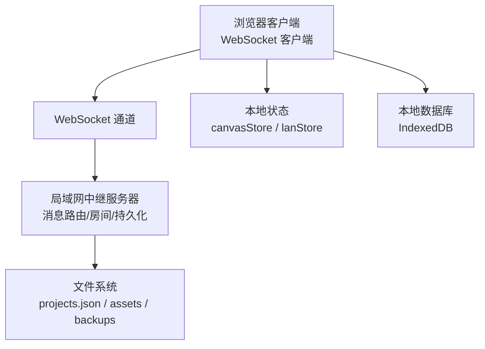
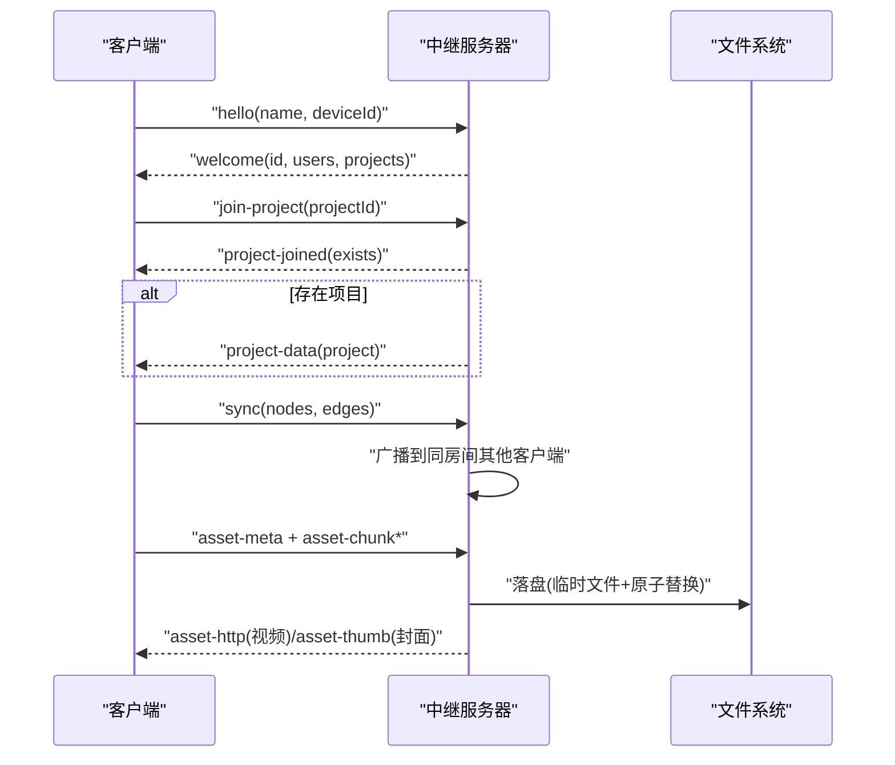
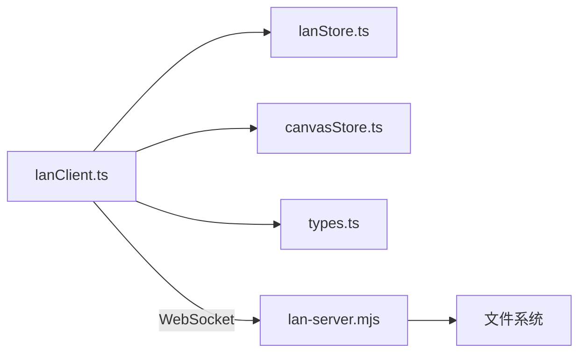

# 同步协议规范

<cite>
**本文引用的文件**
- [src/sync/lanClient.ts](file://src/sync/lanClient.ts)
- [server/lan-server.mjs](file://server/lan-server.mjs)
- [src/store/lanStore.ts](file://src/store/lanStore.ts)
- [src/types.ts](file://src/types.ts)
- [src/store/canvasStore.ts](file://src/store/canvasStore.ts)
- [src/sync/cloudSync.ts](file://src/sync/cloudSync.ts)
- [README.md](file://README.md)
- [src/sync/lanClient.test.ts](file://src/sync/lanClient.test.ts)
</cite>

## 目录
1. [简介](#简介)
2. [项目结构](#项目结构)
3. [核心组件](#核心组件)
4. [架构总览](#架构总览)
5. [详细组件分析](#详细组件分析)
6. [依赖关系分析](#依赖关系分析)
7. [性能考量](#性能考量)
8. [故障排查指南](#故障排查指南)
9. [结论](#结论)
10. [附录：协议扩展与测试用例](#附录协议扩展与测试用例)

## 简介
本规范定义 SuQCanvas 局域网协作的 WebSocket 同步协议，覆盖消息类型、字段含义、数据类型与校验规则；说明版本管理与向后兼容策略；详述协作状态管理（用户身份、房间成员、权限控制）；解释数据同步算法（并集合并、删除传播、时间戳比较）；提供实现参考与测试用例；并给出协议扩展指南与新消息类型的添加方法。

## 项目结构
- 客户端侧：浏览器端通过 WebSocket 连接中继服务器，负责画布状态变更广播、视口与光标同步、素材分片传输、项目加入/离开等。
- 服务端侧：Node.js 实现的 WebSocket 中继，负责房间隔离、消息路由、项目持久化、素材缓存与 HTTP 流式拉取、备份恢复与资源清理。
- 状态与类型：Zustand 状态管理存储协作会话信息；统一类型定义节点、边、视图与资产元数据。

图表来源
- [src/sync/lanClient.ts:254-362](file://src/sync/lanClient.ts#L254-L362)
- [server/lan-server.mjs:449-451](file://server/lan-server.mjs#L449-L451)
- [src/store/lanStore.ts:53-89](file://src/store/lanStore.ts#L53-L89)
- [src/store/canvasStore.ts:118-124](file://src/store/canvasStore.ts#L118-L124)

章节来源
- [README.md:28-96](file://README.md#L28-L96)
- [src/sync/lanClient.ts:1-120](file://src/sync/lanClient.ts#L1-L120)
- [server/lan-server.mjs:1-45](file://server/lan-server.mjs#L1-L45)

## 核心组件
- 连接与会话管理：建立 WebSocket、解析地址、自动重连、保存上次配置。
- 房间与项目：加入/离开项目房间，按 projectId 隔离消息广播。
- 画布同步：节点与边的增量/快照同步、显式删除传播、墓碑机制避免复活。
- 视口与光标：视口变化广播、跟随他人视口、光标位置广播。
- 活动日志：操作类型聚合与广播（新增/删除/移动/编辑/连线）。
- 素材传输：分片上传/下载、HTTP Range 流式拉取、封面优先下发、断点续传。
- 项目持久化：保存/删除/恢复项目，备份保留策略与孤儿素材清理。

章节来源
- [src/sync/lanClient.ts:19-57](file://src/sync/lanClient.ts#L19-L57)
- [src/sync/lanClient.ts:254-362](file://src/sync/lanClient.ts#L254-L362)
- [src/sync/lanClient.ts:409-642](file://src/sync/lanClient.ts#L409-L642)
- [server/lan-server.mjs:661-906](file://server/lan-server.mjs#L661-L906)

## 架构总览

图表来源
- [src/sync/lanClient.ts:302-319](file://src/sync/lanClient.ts#L302-L319)
- [server/lan-server.mjs:669-705](file://server/lan-server.mjs#L669-L705)
- [server/lan-server.mjs:828-852](file://server/lan-server.mjs#L828-L852)
- [server/lan-server.mjs:613-659](file://server/lan-server.mjs#L613-L659)

## 详细组件分析

### 1) 连接与握手
- 客户端发起 hello，携带 name 与 deviceId；服务器分配 id、颜色，返回 welcome（包含当前在线用户列表与共享项目列表）。
- 客户端可请求刷新项目列表或加入项目房间。

关键消息
- hello：name, deviceId
- welcome：id, users[], projects[]
- project-list-request：无
- project-list：projects[]

校验规则
- name 长度限制（服务端截断），deviceId 安全 ID 校验。
- 地址解析：HTTPS 页面禁止明文 ws，强制 wss。

章节来源
- [src/sync/lanClient.ts:302-319](file://src/sync/lanClient.ts#L302-L319)
- [server/lan-server.mjs:682-688](file://server/lan-server.mjs#L682-L688)
- [server/lan-server.mjs:669-670](file://server/lan-server.mjs#L669-L670)
- [src/sync/lanClient.ts:19-45](file://src/sync/lanClient.ts#L19-L45)

### 2) 房间与项目
- join-project：进入房间，若项目存在则推送 project-data；广播 peer-joined 给同房间其他成员。
- leave-project：离开房间，广播 leave。
- project-save：持久化项目，记录 creatorId（首次保存盖章），广播 project-saved 与更新后的项目列表。
- project-delete：仅创建者可删除，写入备份后广播 project-deleted。
- backup-list-request / backup-list：列出可恢复备份。
- backup-restore：从备份恢复项目，需满足过期时间与创建者权限。

校验规则
- projectId 必须为安全 ID。
- 删除/恢复权限由 creatorId 与 requester/deviceId 比对决定。

章节来源
- [server/lan-server.mjs:696-757](file://server/lan-server.mjs#L696-L757)
- [server/lan-server.mjs:759-824](file://server/lan-server.mjs#L759-L824)
- [src/sync/lanClient.ts:767-786](file://src/sync/lanClient.ts#L767-L786)

### 3) 画布同步与删除传播
- sync：按 id 并集合并节点与边，远端同名覆盖本地；selected 状态在合并时尽量保留。
- sync-del：显式删除节点/边，并在本地标记墓碑（TOMBSTONE_MS 内忽略晚到的旧快照）。
- 合并逻辑：先构建远端 Map，再遍历本地节点进行合并，最后追加远端独有项；边同理。
- 删除触发：当本地 nodes/edges 减少时，批量调度发送 sync-del，避免频繁广播。

复杂度
- 合并 O(N+E)，N 为节点数，E 为边数。
- 墓碑 Map 查询 O(1)。

章节来源
- [src/sync/lanClient.ts:527-598](file://src/sync/lanClient.ts#L527-L598)
- [src/sync/lanClient.ts:70-117](file://src/sync/lanClient.ts#L70-L117)
- [src/sync/lanClient.ts:718-756](file://src/sync/lanClient.ts#L718-L756)

### 4) 视口与光标
- viewport：非跟随模式下周期性广播当前视口；跟随模式下不广播自身。
- cursor：广播鼠标坐标与更新时间；接收端维护 cursors 映射。
- editing：广播当前编辑中的节点与标签；支持结束编辑。

防抖与节流
- 视口广播间隔约 100ms。
- 画布同步广播间隔约 150ms。

章节来源
- [src/sync/lanClient.ts:701-716](file://src/sync/lanClient.ts#L701-L716)
- [src/sync/lanClient.ts:788-800](file://src/sync/lanClient.ts#L788-L800)
- [src/sync/lanClient.ts:599-614](file://src/sync/lanClient.ts#L599-L614)

### 5) 活动日志
- activity：聚合 create/delete/move/edit/connect/change 等操作，批量合并计数，延迟广播。
- 接收端维护 activities 列表，限制最近 100 条。

章节来源
- [src/sync/lanClient.ts:674-699](file://src/sync/lanClient.ts#L674-L699)
- [src/sync/lanClient.ts:615-618](file://src/sync/lanClient.ts#L615-L618)
- [src/store/lanStore.ts:40-51](file://src/store/lanStore.ts#L40-L51)

### 6) 素材传输
- asset-meta：声明素材元数据与分片总数。
- asset-chunk：分片数据（base64 无填充），按 index 顺序到达，乱序也能正确落盘。
- asset-thumb：封面字节（base64），优先于分片下发，便于快速显示。
- asset-request：请求缺失素材；服务器对视频默认返回 asset-http 与 asset-meta，客户端走 HTTP Range 流式拉取；forceBlob=true 时整份下发分片。
- asset-http：告知 HTTP 流式拉取地址，客户端切换至 HTTP 获取。

分片大小
- CHUNK_SIZE = 262143（256KB - 1），确保 base64 对齐字节边界。

断点续传
- 重复 meta 不重置已收分片；临时文件原子替换，并发写串行化。

章节来源
- [server/lan-server.mjs:503-553](file://server/lan-server.mjs#L503-L553)
- [server/lan-server.mjs:613-659](file://server/lan-server.mjs#L613-L659)
- [server/lan-server.mjs:828-866](file://server/lan-server.mjs#L828-L866)
- [src/sync/lanClient.ts:154-182](file://src/sync/lanClient.ts#L154-L182)
- [src/sync/lanClient.ts:619-640](file://src/sync/lanClient.ts#L619-L640)

### 7) 权限与协作状态
- 用户身份：服务器分配 id、颜色；客户端使用 deviceId 作为设备标识。
- 房间成员：users 列表按房间过滤；peer-joined/leave 通知成员变化。
- 权限控制：项目删除/恢复仅限 creatorId 匹配者；未设置 creatorId 的旧项目允许任意删除。

章节来源
- [server/lan-server.mjs:661-667](file://server/lan-server.mjs#L661-L667)
- [server/lan-server.mjs:731-757](file://server/lan-server.mjs#L731-L757)
- [server/lan-server.mjs:773-824](file://server/lan-server.mjs#L773-L824)
- [src/store/lanStore.ts:4-20](file://src/store/lanStore.ts#L4-L20)

### 8) 数据同步算法
- 并集合并：以 id 为键，远端覆盖本地；本地独有保留；selected 状态尽量保持。
- 删除传播：通过 sync-del 显式删除；墓碑窗口内忽略晚到旧快照，防止复活。
- 时间戳比较：项目级以 updatedAt 比较决定是否整幅替换；本地有更新的离线编辑不被覆盖。

章节来源
- [src/sync/lanClient.ts:527-577](file://src/sync/lanClient.ts#L527-L577)
- [src/sync/lanClient.ts:454-492](file://src/sync/lanClient.ts#L454-L492)
- [src/sync/lanClient.ts:70-117](file://src/sync/lanClient.ts#L70-L117)

### 9) 协议版本与兼容性
- 当前协议未显式版本号字段；通过以下策略保证兼容：
  - 未知消息类型：客户端与服务端均忽略（switch 未命中或 JSON 解析失败直接丢弃）。
  - 可选字段：如 from/to/projectId/color 等，缺失时降级处理。
  - 向后兼容：新增字段不影响旧客户端；旧客户端不会因新字段导致错误。
- 建议未来引入 t=version 或消息头 v 字段，用于协商最小支持版本。

章节来源
- [src/sync/lanClient.ts:352-360](file://src/sync/lanClient.ts#L352-L360)
- [server/lan-server.mjs:672-681](file://server/lan-server.mjs#L672-L681)

## 依赖关系分析

图表来源
- [src/sync/lanClient.ts:1-9](file://src/sync/lanClient.ts#L1-L9)
- [server/lan-server.mjs:449-451](file://server/lan-server.mjs#L449-L451)

章节来源
- [src/sync/lanClient.ts:1-9](file://src/sync/lanClient.ts#L1-L9)
- [server/lan-server.mjs:449-451](file://server/lan-server.mjs#L449-L451)

## 性能考量
- 分片大小 262143 字节，避免 base64 填充导致的内存翻倍与拼接开销。
- 视频类素材默认走 HTTP Range 流式拉取，降低 WebSocket 带宽压力。
- 封面优先下发，提升首屏体验。
- 活动日志与画布同步采用防抖合并，减少网络抖动。
- 服务器侧并发写入通过 writeChain 串行化，避免临时文件竞争。
- 孤儿素材与过期备份定期清理，释放磁盘空间。

章节来源
- [src/sync/lanClient.ts:10-12](file://src/sync/lanClient.ts#L10-L12)
- [server/lan-server.mjs:613-659](file://server/lan-server.mjs#L613-L659)
- [server/lan-server.mjs:107-205](file://server/lan-server.mjs#L107-L205)

## 故障排查指南
- 连接失败：检查 HTTPS 页面是否误用 ws://；确认反向代理配置与端口开放。
- 项目不同步：确认 activeProjectId 一致；检查 project-data 的 updatedAt 比较逻辑。
- 素材不完整：查看 asset-meta 的 totalChunks 与实际收到的分片数量；检查 asset-chunk 的 index 是否重复或缺失。
- 视频无法播放：确认 asset-http 地址可达且支持 Range；检查 CORS 头。
- 删除后复活：检查墓碑窗口期；确认 sync-del 已广播且未被忽略。

章节来源
- [src/sync/lanClient.ts:19-45](file://src/sync/lanClient.ts#L19-L45)
- [src/sync/lanClient.ts:454-492](file://src/sync/lanClient.ts#L454-L492)
- [server/lan-server.mjs:291-372](file://server/lan-server.mjs#L291-L372)
- [src/sync/lanClient.ts:70-117](file://src/sync/lanClient.ts#L70-L117)

## 结论
本协议通过房间隔离、并集合并与显式删除传播，实现了高效稳定的多人协作；结合 HTTP Range 流式拉取与封面优先策略，优化了大媒体传输体验；权限控制与备份恢复保障了数据安全与可恢复性。建议在后续迭代中引入显式版本协商以增强长期兼容性。

## 附录：协议扩展与测试用例

### 协议消息清单与字段说明
- hello：name, deviceId
- welcome：id, users[], projects[]
- project-list-request：无
- project-list：projects[]
- join-project：projectId
- project-joined：projectId, exists
- project-data：project（含 graph.nodes/graph.edges/viewport）
- project-save：project, deviceId
- project-saved：projectId, updatedAt
- project-delete：projectId, deviceId
- project-deleted：projectId
- project-delete-denied：projectId
- backup-list-request：无
- backup-list：backups[]
- backup-restore：projectId, deletedAt, deviceId
- backup-restore-result：projectId, deletedAt, ok, error?
- sync：projectId, nodes[], edges[]
- sync-del：projectId, nodeIds[], edgeIds[]
- viewport：projectId, viewport
- cursor：projectId, x, y, name, color?, updatedAt
- editing：projectId, nodeId?, label?, name, active, updatedAt
- activity：projectId, id, userId, name, color, kind, message, nodeId?, createdAt
- asset-meta：to?, asset{id,name,mime,size,kind}, totalChunks
- asset-chunk：to?, assetId, index, total, data(base64)
- asset-thumb：to?, assetId, mime, data(base64)
- asset-request：assetId, forceBlob?
- asset-http：assetId, url
- asset-meta(forceBlob)：同上，但指示整份下发

验证规则
- 所有 ID 字段需为安全字符串（字母数字下划线短横线，长度限制）。
- 数值字段需为有限整数或浮点数。
- 布尔字段明确 true/false。
- 数组字段需为数组且元素类型匹配。

章节来源
- [server/lan-server.mjs:669-906](file://server/lan-server.mjs#L669-L906)
- [src/sync/lanClient.ts:409-642](file://src/sync/lanClient.ts#L409-L642)
- [src/types.ts:37-112](file://src/types.ts#L37-L112)

### 参考实现路径
- 客户端连接与消息分发：[src/sync/lanClient.ts:254-362](file://src/sync/lanClient.ts#L254-L362)
- 服务器消息路由与房间广播：[server/lan-server.mjs:661-906](file://server/lan-server.mjs#L661-L906)
- 状态管理：[src/store/lanStore.ts:53-89](file://src/store/lanStore.ts#L53-L89)
- 画布类型与节点/边结构：[src/types.ts:66-112](file://src/types.ts#L66-L112)

### 测试用例要点
- 基础64位分片往返一致性：验证编码/解码无损。
- 素材接收与续传：meta 重发保留已收分片，补齐后完整落库。
- 请求-响应链路：requestAssetFromLan 能取回素材。
- HTTP Range 流式拉取：服务器返回 206 与 Content-Range，客户端记录 URL。
- 封面同步：中继缓存封面后随 request 下发，本地无需重新抓帧。
- 房间隔离：不同项目房间不互相转发 sync。
- 并集合并与显式删除：本地与远端节点共存，删除后墓碑窗口内不复活。
- 断线自动重连：中继重启后客户端自动恢复。

章节来源
- [src/sync/lanClient.test.ts:115-130](file://src/sync/lanClient.test.ts#L115-L130)
- [src/sync/lanClient.test.ts:153-221](file://src/sync/lanClient.test.ts#L153-L221)
- [src/sync/lanClient.test.ts:223-326](file://src/sync/lanClient.test.ts#L223-L326)
- [src/sync/lanClient.test.ts:328-438](file://src/sync/lanClient.test.ts#L328-L438)
- [src/sync/lanClient.test.ts:440-497](file://src/sync/lanClient.test.ts#L440-L497)
- [src/sync/lanClient.test.ts:499-548](file://src/sync/lanClient.test.ts#L499-L548)
- [src/sync/lanClient.test.ts:559-592](file://src/sync/lanClient.test.ts#L559-L592)

### 协议扩展指南
- 新增消息类型步骤：
  1) 在客户端 handleMessage 中添加 case，解析 payload 并更新状态。
  2) 在服务端消息路由中添加 if 分支，校验字段并广播或单播。
  3) 在类型文件中补充相关接口（如需要）。
  4) 编写单元测试覆盖正常与异常路径。
- 兼容性建议：
  - 新增字段设为可选，旧客户端忽略。
  - 新增消息类型默认忽略（未知 t 值）。
  - 如需版本协商，可在 hello/welcome 中增加 v 字段，双方比较最小支持版本。

章节来源
- [src/sync/lanClient.ts:409-642](file://src/sync/lanClient.ts#L409-L642)
- [server/lan-server.mjs:672-888](file://server/lan-server.mjs#L672-L888)
- [src/types.ts:37-112](file://src/types.ts#L37-L112)