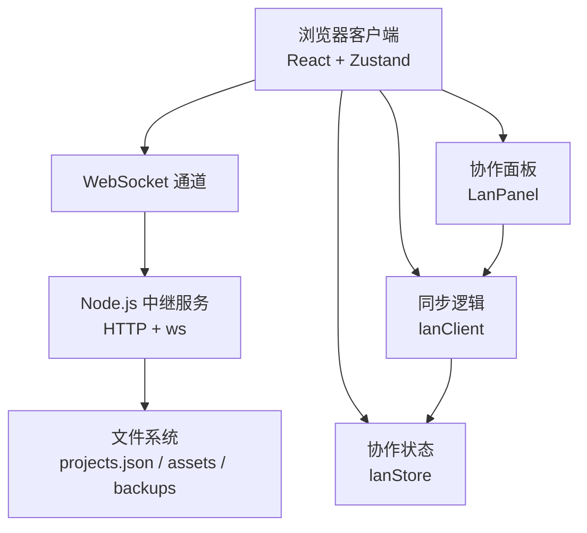
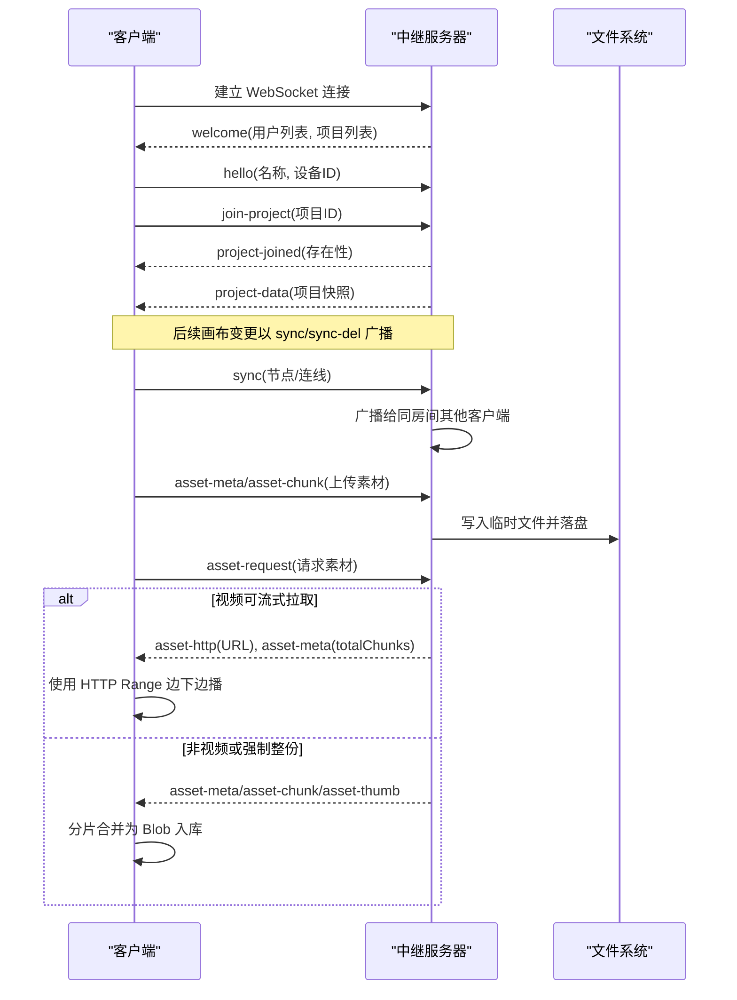
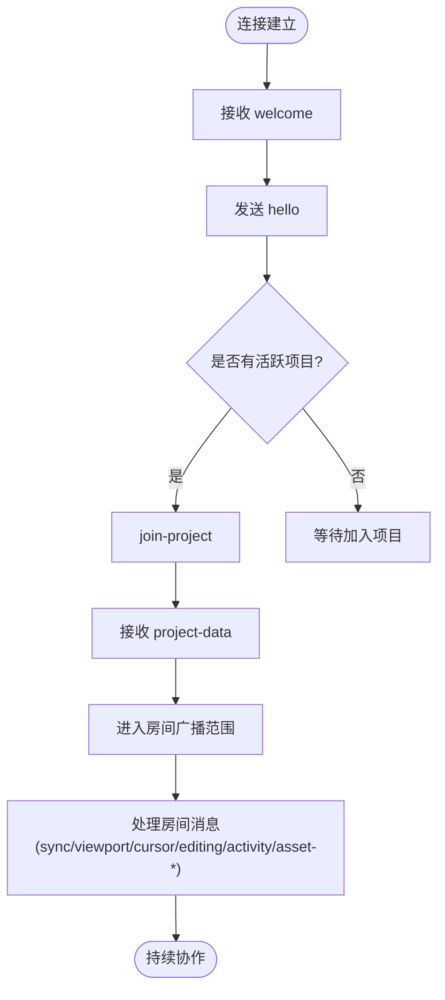
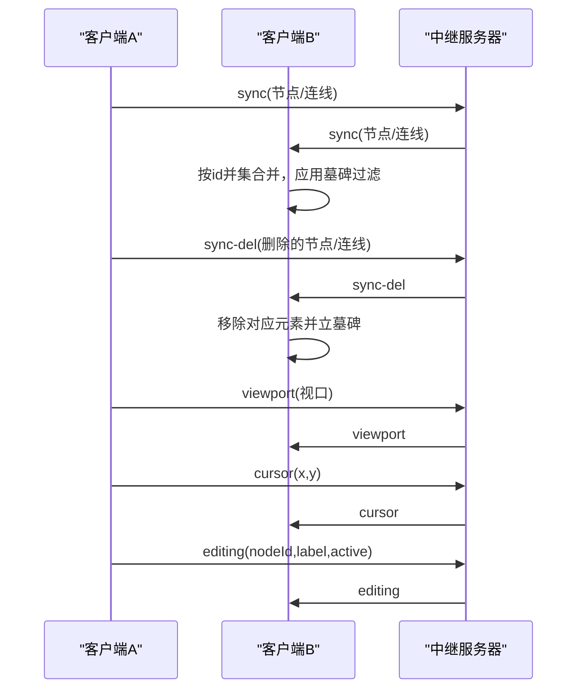
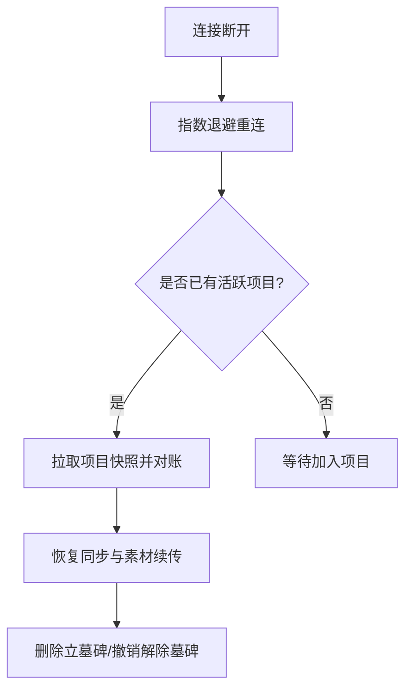
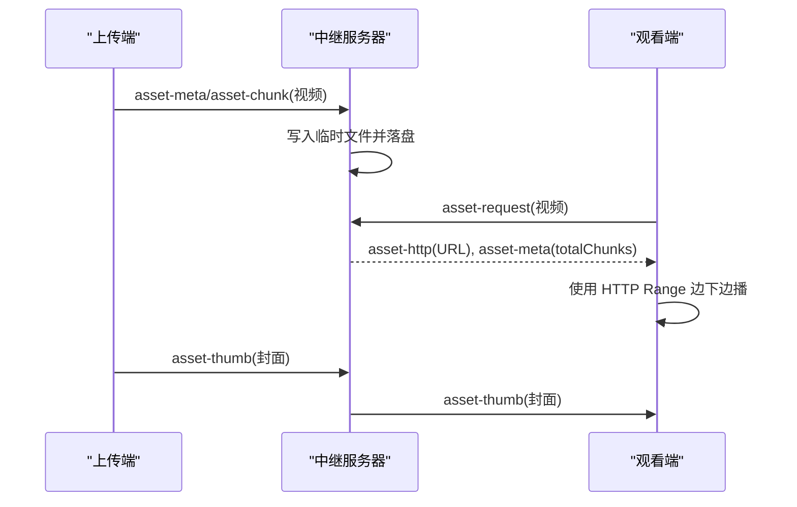
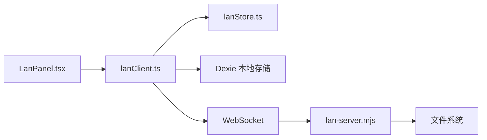

# 局域网协作

<cite>
**本文引用的文件**
- [server/lan-server.mjs](file://server/lan-server.mjs)
- [src/sync/lanClient.ts](file://src/sync/lanClient.ts)
- [src/store/lanStore.ts](file://src/store/lanStore.ts)
- [src/components/LanPanel.tsx](file://src/components/LanPanel.tsx)
- [scripts/start-lan.ps1](file://scripts/start-lan.ps1)
- [scripts/open-lan-firewall.ps1](file://scripts/open-lan-firewall.ps1)
- [README.md](file://README.md)
</cite>

## 目录
1. [简介](#简介)
2. [项目结构](#项目结构)
3. [核心组件](#核心组件)
4. [架构总览](#架构总览)
5. [详细组件分析](#详细组件分析)
6. [依赖关系分析](#依赖关系分析)
7. [性能考量](#性能考量)
8. [故障排除指南](#故障排除指南)
9. [结论](#结论)
10. [附录](#附录)

## 简介
本章节面向 SuQCanvas 的局域网协作能力，系统性说明 WebSocket 通信协议、房间机制、实时同步（画布数据、光标、编辑状态）、多人协作特性（用户管理、权限控制、冲突解决）、断线重连与数据一致性（墓碑机制）、素材传输优化（分片、HTTP Range 流式拉取、封面预加载），以及部署配置与排障建议。目标是帮助读者快速理解并稳定运行局域网协作场景。

## 项目结构
- 服务端：Node.js HTTP + WebSocket 中继服务，负责房间广播、项目持久化、资产缓存与 HTTP Range 流式拉取、维护任务（备份清理、孤儿资产回收）。
- 客户端：浏览器端通过 WebSocket 连接中继，实现房间加入、画布同步、视口/光标/编辑状态广播、素材分片传输与合并、断线自动重连。
- 状态层：Zustand 存储协作相关状态（用户列表、跟随目标、活动日志等）。
- 界面层：协作面板提供连接、断开、跟随、查看协作者与活动记录。

图表来源
- [server/lan-server.mjs:449-451](file://server/lan-server.mjs#L449-L451)
- [src/sync/lanClient.ts:254-362](file://src/sync/lanClient.ts#L254-L362)
- [src/store/lanStore.ts:91-159](file://src/store/lanStore.ts#L91-L159)
- [src/components/LanPanel.tsx:17-50](file://src/components/LanPanel.tsx#L17-L50)

章节来源
- [README.md:62-122](file://README.md#L62-L122)
- [scripts/start-lan.ps1:22-47](file://scripts/start-lan.ps1#L22-L47)

## 核心组件
- 中继服务器：处理连接、房间消息路由、项目保存/删除/恢复、资产上传缓存、HTTP Range 流式拉取、定时维护。
- 客户端同步器：封装 WebSocket 连接、消息分发、画布增量同步、删除传播、视口/光标/编辑状态广播、素材分片收发、断线重连。
- 协作状态：集中管理在线用户、跟随目标、活动日志、当前项目 ID、远程项目列表等。
- 协作面板：提供连接入口、设备昵称、跟随操作、活动与编辑状态展示。

章节来源
- [server/lan-server.mjs:449-906](file://server/lan-server.mjs#L449-L906)
- [src/sync/lanClient.ts:254-887](file://src/sync/lanClient.ts#L254-L887)
- [src/store/lanStore.ts:1-159](file://src/store/lanStore.ts#L1-L159)
- [src/components/LanPanel.tsx:17-199](file://src/components/LanPanel.tsx#L17-L199)

## 架构总览
下图展示了从客户端到服务器的完整协作流程，包括连接建立、房间加入、画布同步、素材传输与 HTTP Range 流式拉取。

图表来源
- [server/lan-server.mjs:661-728](file://server/lan-server.mjs#L661-L728)
- [server/lan-server.mjs:828-888](file://server/lan-server.mjs#L828-L888)
- [src/sync/lanClient.ts:254-362](file://src/sync/lanClient.ts#L254-L362)
- [src/sync/lanClient.ts:1023-1089](file://src/sync/lanClient.ts#L1023-L1089)

## 详细组件分析

### WebSocket 通信协议与房间机制
- 连接建立：客户端发起 WebSocket 连接，收到 welcome 消息后发送 hello，携带设备标识与昵称；随后根据是否已有活跃项目选择 join-project。
- 房间隔离：所有房间级消息（sync、viewport、cursor、editing、activity、asset-*）均携带 projectId，服务器仅在同房间内广播。
- 用户管理：welcome/users/peer-joined/leave 维护在线用户列表；颜色分配避免冲突；支持跟随他人视口。
- 项目生命周期：project-list/project-joined/project-data/project-saved/project-deleted/backup-list/backup-restore。

图表来源
- [server/lan-server.mjs:661-728](file://server/lan-server.mjs#L661-L728)
- [server/lan-server.mjs:828-888](file://server/lan-server.mjs#L828-L888)
- [src/sync/lanClient.ts:254-362](file://src/sync/lanClient.ts#L254-L362)

章节来源
- [server/lan-server.mjs:469-501](file://server/lan-server.mjs#L469-L501)
- [src/sync/lanClient.ts:409-642](file://src/sync/lanClient.ts#L409-L642)

### 实时同步机制
- 画布数据同步：
  - 客户端监听画布变化，防抖聚合后发送 sync（节点/连线），并移除选中标记减少冗余。
  - 接收端按 id 并集合并远端节点与连线，保留本地独有项，避免“整幅覆盖”导致的并发导入冲突。
  - 显式删除通过 sync-del 传播，配合墓碑机制防止晚到旧快照复活已删除元素。
- 视口同步：
  - 客户端周期性广播 viewport，若正在跟随他人则不广播自身视口。
- 光标位置同步：
  - 客户端发送 cursor，包含坐标与时间戳；接收端更新 lanStore 中的 cursors 映射。
- 编辑状态同步：
  - 进入节点编辑时发送 editing(active=true)，离开时 active=false；接收端在 lanStore 中记录当前编辑者及节点标签。

图表来源
- [src/sync/lanClient.ts:644-756](file://src/sync/lanClient.ts#L644-L756)
- [src/sync/lanClient.ts:527-598](file://src/sync/lanClient.ts#L527-L598)
- [server/lan-server.mjs:868-888](file://server/lan-server.mjs#L868-L888)

章节来源
- [src/sync/lanClient.ts:644-756](file://src/sync/lanClient.ts#L644-L756)
- [src/sync/lanClient.ts:527-598](file://src/sync/lanClient.ts#L527-L598)

### 多人协作核心特性
- 用户管理：
  - 颜色分配避免重复；显示 IP 与昵称；支持跟随他人视口。
- 权限控制：
  - 项目创建者（首次保存盖章）拥有删除权；删除拒绝时返回提示。
  - 恢复备份需校验 creatorId，防止误删恢复被滥用。
- 冲突解决策略：
  - 画布采用“并集合并 + 显式删除 + 墓碑窗口”的策略，避免并发导入互相抹除。
  - 项目数据以 updatedAt 比较决定替换时机，离线编辑不被远端早到快照覆盖。

章节来源
- [server/lan-server.mjs:716-757](file://server/lan-server.mjs#L716-L757)
- [server/lan-server.mjs:773-823](file://server/lan-server.mjs#L773-L823)
- [src/sync/lanClient.ts:527-598](file://src/sync/lanClient.ts#L527-L598)

### 断线重连与数据一致性（墓碑机制）
- 断线重连：
  - 客户端实现指数退避重连，保持上次连接地址与昵称；重连后重新加入项目并拉取项目快照进行对账。
  - 素材传输支持空闲超时与断点续传：断线唤醒等待者，重连后跳过已收分片继续。
- 墓碑机制：
  - 删除动作立即在本端与远端立墓碑（TOMBSTONE_MS 窗口），晚到的旧快照不会复活已删除元素。
  - 撤销删除会解除墓碑，允许该 id 再次参与同步。

图表来源
- [src/sync/lanClient.ts:119-152](file://src/sync/lanClient.ts#L119-L152)
- [src/sync/lanClient.ts:254-362](file://src/sync/lanClient.ts#L254-L362)
- [src/sync/lanClient.ts:70-117](file://src/sync/lanClient.ts#L70-L117)

章节来源
- [src/sync/lanClient.ts:119-152](file://src/sync/lanClient.ts#L119-L152)
- [src/sync/lanClient.ts:70-117](file://src/sync/lanClient.ts#L70-L117)
- [src/sync/lanClient.ts:937-945](file://src/sync/lanClient.ts#L937-L945)

### 素材传输优化
- 分片传输：
  - 客户端与服务端均以固定分片大小（CHUNK_SIZE）进行 base64 分片传输；接收端按 index 乱序到达也能正确落盘。
- HTTP Range 流式拉取：
  - 视频类资产优先返回 asset-http URL，客户端使用浏览器原生 Range 能力边下边播，避免整份下载打满局域网。
  - 服务器支持 Accept-Ranges、Content-Range 响应，适配播放器需求。
- 封面预加载：
  - 上传端抓帧生成封面，随资产先于分片下发；服务器缓存 .thumb 文件，观看端直接显示，无需解码视频。
  - 旧库缺失封面的情况下，本地有封面的设备可补推至服务器，实现自愈。

图表来源
- [server/lan-server.mjs:291-372](file://server/lan-server.mjs#L291-L372)
- [server/lan-server.mjs:613-659](file://server/lan-server.mjs#L613-L659)
- [src/sync/lanClient.ts:1023-1089](file://src/sync/lanClient.ts#L1023-L1089)
- [src/sync/lanClient.ts:1183-1230](file://src/sync/lanClient.ts#L1183-L1230)

章节来源
- [server/lan-server.mjs:291-372](file://server/lan-server.mjs#L291-L372)
- [server/lan-server.mjs:613-659](file://server/lan-server.mjs#L613-L659)
- [src/sync/lanClient.ts:1023-1089](file://src/sync/lanClient.ts#L1023-L1089)

### 协作场景最佳实践与性能优化建议
- 大视频优先走 HTTP Range 流式拉取，避免整份下载造成网络拥塞。
- 批量导入时注意分片间隔让出主线程，避免浏览器卡顿。
- 合理设置中继端口与反向代理，确保 HTTPS 页面使用 wss://。
- 定期备份 server/data/ 目录，利用 24 小时备份恢复误删项目。
- 使用跟随功能协助演示与教学，减少多设备视角切换成本。

[本节为通用指导，不直接分析具体文件]

## 依赖关系分析
- 客户端依赖：
  - lanClient 依赖 lanStore 管理协作状态，依赖 Dexie 本地数据库持久化素材与项目。
  - LanPanel 作为 UI 入口，调用 lanClient 的连接与断开方法。
- 服务端依赖：
  - ws 模块处理 WebSocket 连接；fs/promises 处理文件读写；crypto 用于资源路径哈希。
  - 维护任务依赖文件系统扫描与定时调度。

图表来源
- [src/components/LanPanel.tsx:1-199](file://src/components/LanPanel.tsx#L1-L199)
- [src/sync/lanClient.ts:1-1254](file://src/sync/lanClient.ts#L1-L1254)
- [src/store/lanStore.ts:1-160](file://src/store/lanStore.ts#L1-L160)
- [server/lan-server.mjs:1-917](file://server/lan-server.mjs#L1-L917)

章节来源
- [src/sync/lanClient.ts:1-1254](file://src/sync/lanClient.ts#L1-L1254)
- [server/lan-server.mjs:1-917](file://server/lan-server.mjs#L1-L917)

## 性能考量
- 分片大小与内存占用：
  - CHUNK_SIZE 设置为 262143 字节，base64 对齐避免填充问题；接收端按分片惰性引用构建 Blob，降低内存峰值。
- 主线程让出：
  - 大文件分片发送每 8 块让出一次主线程，避免浏览器判定无响应。
- 网络拥塞控制：
  - 视频优先 HTTP Range 流式拉取；同一素材 60s 内只广播一次请求，避免多台设备并发上传打满局域网。
- 维护任务：
  - 每小时执行资产 GC 与备份清理，释放磁盘空间。

章节来源
- [src/sync/lanClient.ts:10-12](file://src/sync/lanClient.ts#L10-L12)
- [src/sync/lanClient.ts:1049-1051](file://src/sync/lanClient.ts#L1049-L1051)
- [server/lan-server.mjs:107-205](file://server/lan-server.mjs#L107-L205)

## 故障排除指南
- 无法连接中继：
  - 检查防火墙是否放行 TCP 8790；Windows 首次启动会自动请求权限。
  - HTTPS 页面必须使用 wss://，可通过 Nginx 反向代理将 /lan-ws 转发到 127.0.0.1:8790。
- 素材无法播放或封面缺失：
  - 确认 /SuQCanvas/assets/ 已反向代理到中继，否则跨域读取封面失败。
  - 旧库缺失封面可由本地有封面的设备补推至服务器。
- 项目删除失败：
  - 只有创建者可删除；如提示 denied，请确认设备 ID 与创建者一致。
- 备份恢复失败：
  - 检查备份是否过期（24 小时）；恢复时需满足 creatorId 校验。

章节来源
- [scripts/open-lan-firewall.ps1:15-26](file://scripts/open-lan-firewall.ps1#L15-L26)
- [README.md:98-122](file://README.md#L98-L122)
- [server/lan-server.mjs:731-757](file://server/lan-server.mjs#L731-L757)
- [server/lan-server.mjs:773-823](file://server/lan-server.mjs#L773-L823)

## 结论
SuQCanvas 的局域网协作通过 WebSocket 房间机制实现了高效的多人实时协作，结合并集合并、显式删除与墓碑机制保障了数据一致性；素材传输采用分片与 HTTP Range 流式拉取，显著优化了大文件在网络中的传输效率与用户体验。完善的断线重连与维护任务确保了系统的稳定性与资源利用率。按照本文的部署与排障建议，可在局域网环境中快速搭建并稳定运行协作服务。

[本节为总结性内容，不直接分析具体文件]

## 附录
- 启动与部署：
  - Windows 一键启动脚本会自动打开防火墙规则并启动 Node 进程；生产环境建议使用 PM2 守护进程。
  - 环境变量 LAN_DATA_DIR 可自定义数据目录；PORT 默认 8790。
- 反向代理示例：
  - Nginx 将 /lan-ws 与 /SuQCanvas/assets/ 转发到本地 8790 端口，确保 WebSocket 升级与跨域头正确。

章节来源
- [scripts/start-lan.ps1:16-47](file://scripts/start-lan.ps1#L16-L47)
- [README.md:62-122](file://README.md#L62-L122)