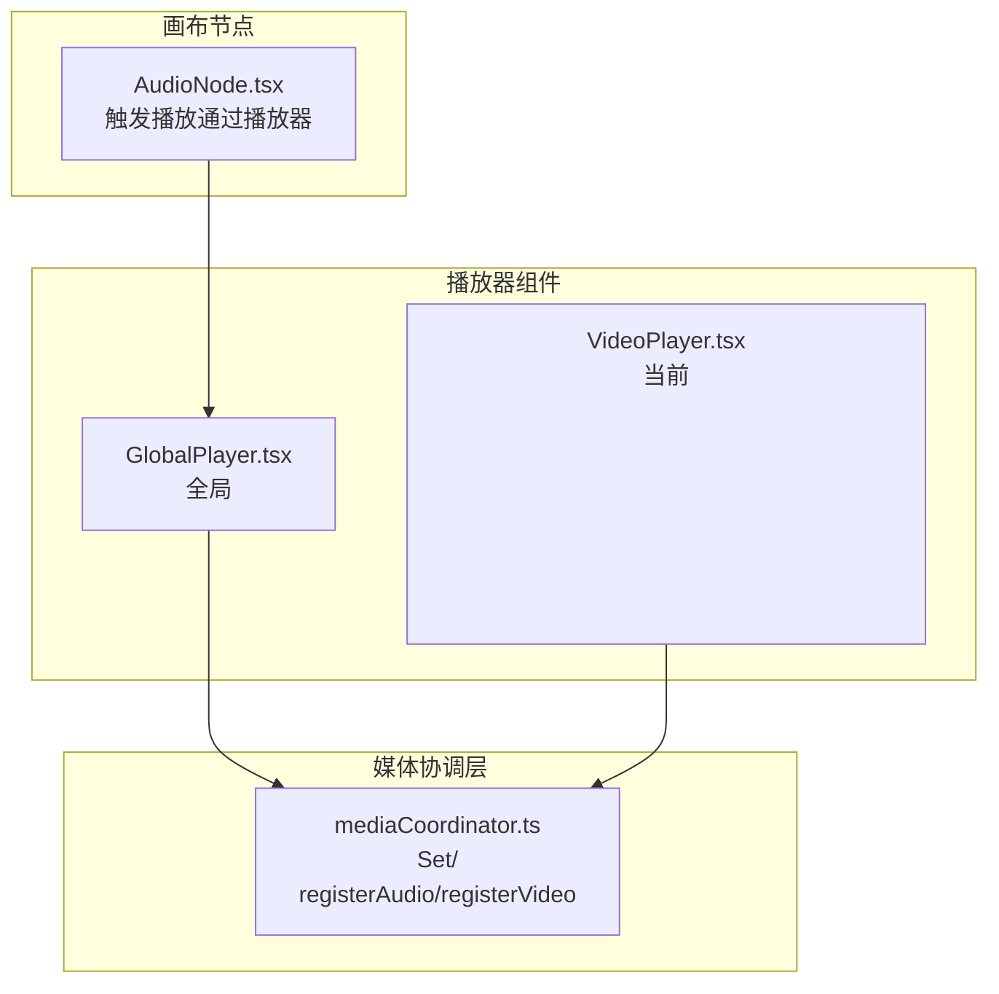
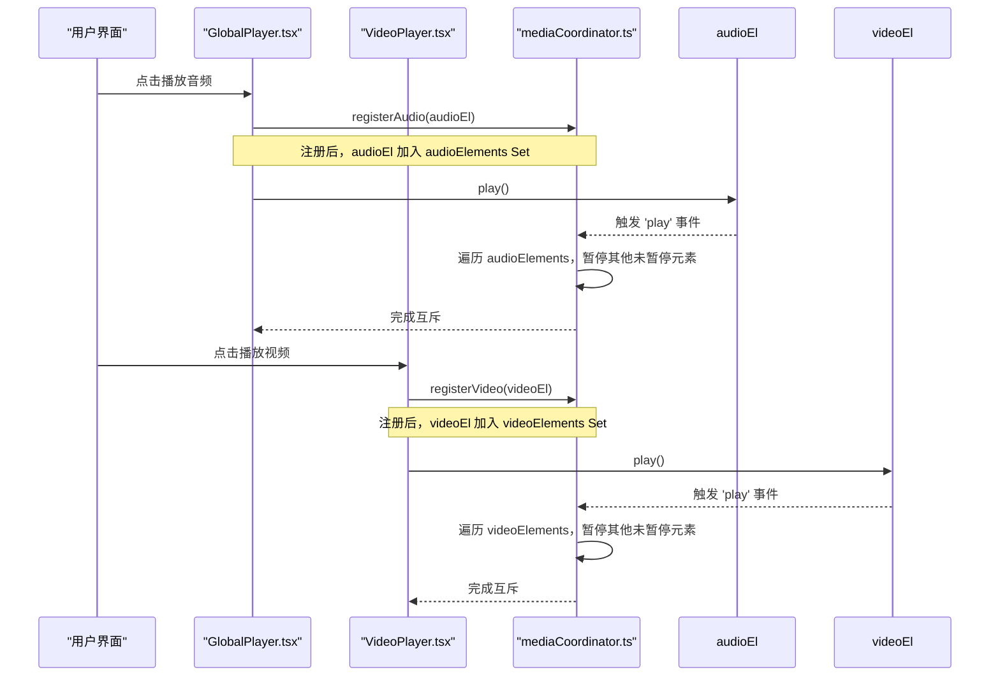
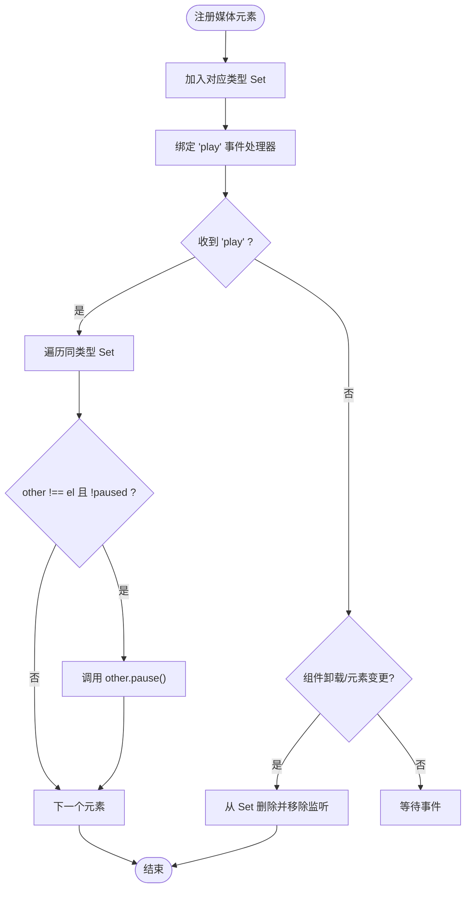
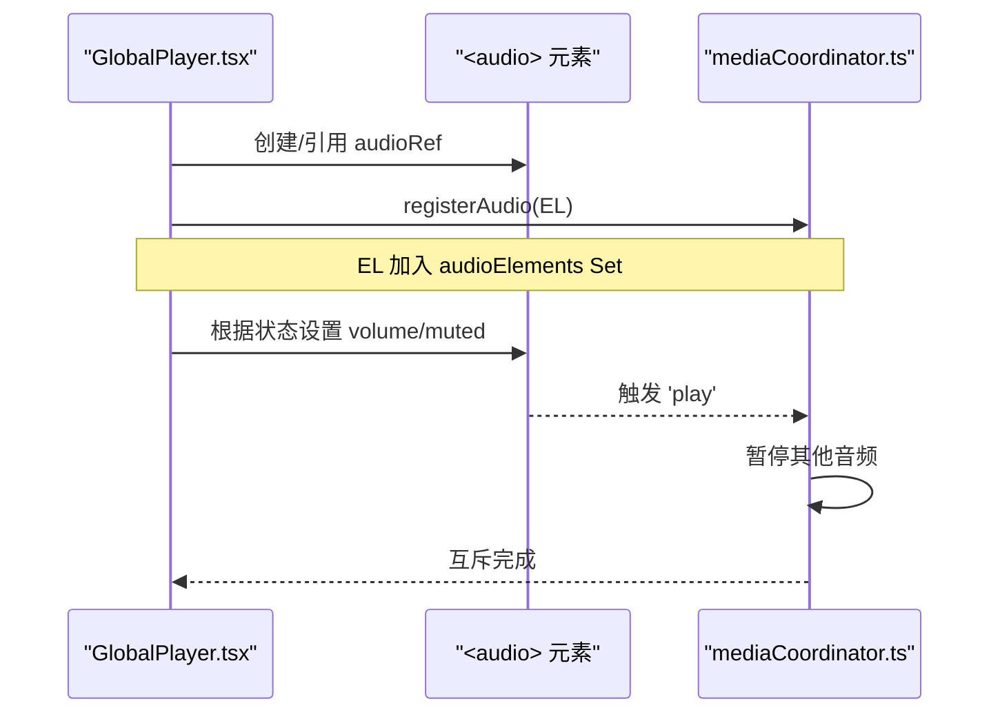
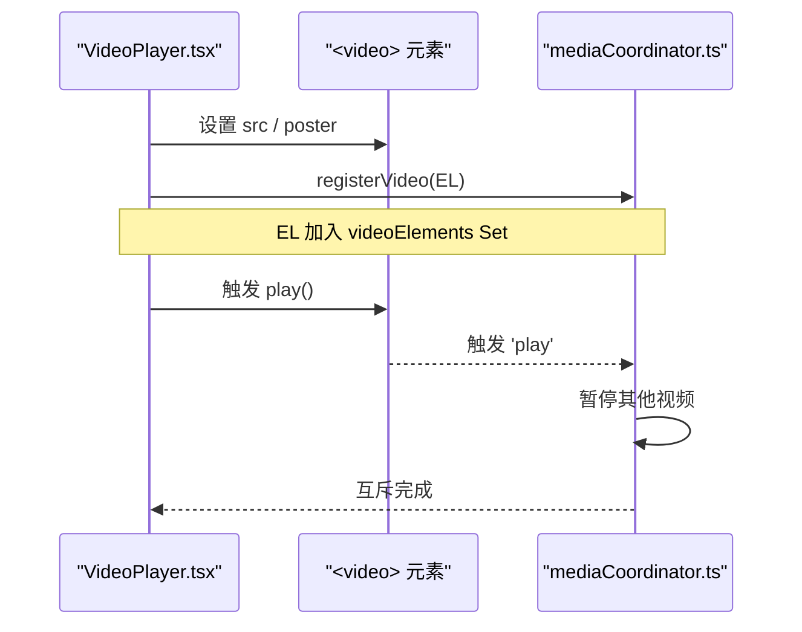
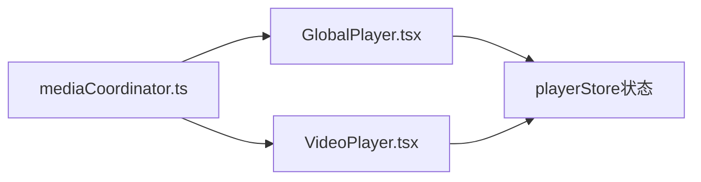

# 媒体协调器

<cite>
**本文引用的文件**
- [mediaCoordinator.ts](file://src/media/mediaCoordinator.ts)
- [GlobalPlayer.tsx](file://src/components/GlobalPlayer.tsx)
- [VideoPlayer.tsx](file://src/components/VideoPlayer.tsx)
- [AudioNode.tsx](file://src/canvas/nodes/AudioNode.tsx)
</cite>

## 目录
1. [简介](#简介)
2. [项目结构](#项目结构)
3. [核心组件](#核心组件)
4. [架构总览](#架构总览)
5. [详细组件分析](#详细组件分析)
6. [依赖关系分析](#依赖关系分析)
7. [性能考量](#性能考量)
8. [故障排查指南](#故障排查指南)
9. [结论](#结论)
10. [附录：使用示例与最佳实践](#附录使用示例与最佳实践)

## 简介
本模块实现全局媒体互斥机制，确保同一时刻最多一个音频和一个视频同时播放。当任意媒体元素触发播放时，会自动暂停同类型的其他正在播放的元素，避免多路媒体并发导致的体验冲突与资源浪费。该机制通过两个导出函数 registerAudio 与 registerVideo 暴露给播放器组件使用，并在组件生命周期内完成事件监听器的注册与清理。

## 项目结构
- 媒体协调器位于 src/media/mediaCoordinator.ts，提供全局的媒体互斥能力。
- 音频播放器入口 GlobalPlayer.tsx 在挂载时将全局 <audio> 元素注册到协调器。
- 视频播放器 VideoPlayer.tsx 在挂载时将当前 <video> 元素注册到协调器。
- 画布中的 AudioNode.tsx 通过播放器状态驱动播放，不直接持有媒体元素，因此无需自行处理互斥。

图表来源
- [mediaCoordinator.ts:1-24](file://src/media/mediaCoordinator.ts#L1-L24)
- [GlobalPlayer.tsx:86-97](file://src/components/GlobalPlayer.tsx#L86-L97)
- [VideoPlayer.tsx:325-330](file://src/components/VideoPlayer.tsx#L325-L330)
- [AudioNode.tsx:34-47](file://src/canvas/nodes/AudioNode.tsx#L34-L47)

章节来源
- [mediaCoordinator.ts:1-24](file://src/media/mediaCoordinator.ts#L1-L24)
- [GlobalPlayer.tsx:86-97](file://src/components/GlobalPlayer.tsx#L86-L97)
- [VideoPlayer.tsx:325-330](file://src/components/VideoPlayer.tsx#L325-L330)
- [AudioNode.tsx:34-47](file://src/canvas/nodes/AudioNode.tsx#L34-L47)

## 核心组件
- 媒体协调器（mediaCoordinator.ts）
  - 维护两个 Set：分别保存当前已注册的音频与视频元素。
  - 提供 makeRegistrar 工厂函数，为传入的媒体元素添加 play 事件监听；当元素开始播放时，遍历同类型集合，暂停所有非自身且未暂停的元素。
  - 返回清理函数，用于卸载元素、移除监听器，防止内存泄漏。
  - 导出 registerAudio 与 registerVideo，供各播放器组件调用。

- 全局音频播放器（GlobalPlayer.tsx）
  - 维护唯一的全局 <audio> 元素，作为整个应用的音频引擎。
  - 在组件挂载时将该元素注册到媒体协调器，并在卸载时调用清理函数。
  - 将音量、静音等状态同步到该元素，并与播放器状态保持同步。

- 视频播放器（VideoPlayer.tsx）
  - 维护当前视频的 <video> 元素引用。
  - 在组件挂载时将该元素注册到媒体协调器，并在 URL 变化或卸载时自动清理旧元素的监听。
  - 负责视频播放控制、列表切换、全屏/画中画等交互。

章节来源
- [mediaCoordinator.ts:1-24](file://src/media/mediaCoordinator.ts#L1-L24)
- [GlobalPlayer.tsx:86-97](file://src/components/GlobalPlayer.tsx#L86-L97)
- [VideoPlayer.tsx:325-330](file://src/components/VideoPlayer.tsx#L325-L330)

## 架构总览
媒体协调器采用“集中式互斥”策略：每个媒体类型维护一个元素集合，任何元素触发播放时，由协调器统一暂停同类型其他元素。播放器组件只需关注自身业务逻辑，无需关心跨元素互斥。

图表来源
- [mediaCoordinator.ts:7-20](file://src/media/mediaCoordinator.ts#L7-L20)
- [GlobalPlayer.tsx:86-97](file://src/components/GlobalPlayer.tsx#L86-L97)
- [VideoPlayer.tsx:325-330](file://src/components/VideoPlayer.tsx#L325-L330)

## 详细组件分析

### 媒体协调器（mediaCoordinator.ts）
- 设计要点
  - 使用 Set 管理同类型媒体元素，天然保证元素唯一性，便于 O(1) 增删。
  - 通过泛型工厂 makeRegistrar 复用注册逻辑，降低重复代码。
  - 在 play 事件中执行互斥：仅对“非自身且未暂停”的元素调用 pause，避免不必要的操作。
  - 返回清理函数，在组件卸载或元素变更时删除元素并移除监听，防止内存泄漏。

- 复杂度分析
  - 注册/注销：O(1)。
  - 互斥暂停：最坏 O(n)，n 为同类型已注册元素数量。实际场景中 n 通常很小。

- 错误处理
  - 若元素已被移除或不存在，Set.delete 会安全忽略。
  - 事件监听器移除前检查元素存在性，避免异常。

图表来源
- [mediaCoordinator.ts:7-20](file://src/media/mediaCoordinator.ts#L7-L20)

章节来源
- [mediaCoordinator.ts:1-24](file://src/media/mediaCoordinator.ts#L1-L24)

### 全局音频播放器（GlobalPlayer.tsx）
- 职责
  - 维护单一全局 <audio> 元素，作为应用音频引擎。
  - 在挂载时调用 registerAudio 完成互斥注册，并在卸载时调用返回的清理函数。
  - 将播放器状态（音量、静音、时间、时长、播放中）与 <audio> 元素双向同步。

- 与协调器的集成点
  - useEffect 中获取 audioRef.current，调用 bindPlayerAudio 绑定引擎，再调用 registerAudio(el) 注册互斥。
  - 清理阶段调用 unregister() 并解绑引擎。

图表来源
- [GlobalPlayer.tsx:86-97](file://src/components/GlobalPlayer.tsx#L86-L97)
- [mediaCoordinator.ts:7-20](file://src/media/mediaCoordinator.ts#L7-L20)

章节来源
- [GlobalPlayer.tsx:86-97](file://src/components/GlobalPlayer.tsx#L86-L97)

### 视频播放器（VideoPlayer.tsx）
- 职责
  - 维护当前 <video> 元素引用，处理加载、播放、结束、进度、缓冲等事件。
  - 在 URL 变化或组件卸载时，重新注册新的 <video> 元素到协调器，并清理旧的监听。

- 与协调器的集成点
  - useEffect 中获取 videoRef.current，调用 registerVideo(el) 注册互斥。
  - 依赖项包含 url，确保切换视频时重新注册新元素。

图表来源
- [VideoPlayer.tsx:325-330](file://src/components/VideoPlayer.tsx#L325-L330)
- [mediaCoordinator.ts:7-20](file://src/media/mediaCoordinator.ts#L7-L20)

章节来源
- [VideoPlayer.tsx:325-330](file://src/components/VideoPlayer.tsx#L325-L330)

### 画布音频节点（AudioNode.tsx）
- 职责
  - 展示音频封面、进度、时长，并提供播放按钮。
  - 点击播放时通过播放器状态切换播放或暂停；若当前不是目标曲目则切换到该曲目并自动播放。
  - 双击进入专用播放器页面，支持流式连播。

- 与协调器的关系
  - 不直接持有 <audio> 元素，也不直接调用协调器；所有互斥由全局音频播放器与协调器共同完成。

章节来源
- [AudioNode.tsx:34-47](file://src/canvas/nodes/AudioNode.tsx#L34-L47)

## 依赖关系分析
- mediaCoordinator.ts 被以下组件导入并使用：
  - GlobalPlayer.tsx：注册全局 <audio> 元素。
  - VideoPlayer.tsx：注册当前 <video> 元素。
- 这些组件在挂载时注册，在卸载或元素变更时清理，形成稳定的生命周期闭环。

图表来源
- [GlobalPlayer.tsx:86-97](file://src/components/GlobalPlayer.tsx#L86-L97)
- [VideoPlayer.tsx:325-330](file://src/components/VideoPlayer.tsx#L325-L330)
- [mediaCoordinator.ts:1-24](file://src/media/mediaCoordinator.ts#L1-L24)

章节来源
- [GlobalPlayer.tsx:86-97](file://src/components/GlobalPlayer.tsx#L86-L97)
- [VideoPlayer.tsx:325-330](file://src/components/VideoPlayer.tsx#L325-L330)
- [mediaCoordinator.ts:1-24](file://src/media/mediaCoordinator.ts#L1-L24)

## 性能考量
- 时间复杂度
  - 注册/注销为 O(1)，适合频繁挂载/卸载场景。
  - 互斥暂停为 O(n)，n 为同类型已注册元素数；实际应用中 n 通常很小，开销可忽略。
- 内存管理
  - 通过返回清理函数，确保在组件卸载或元素变更时移除监听并从 Set 删除元素，避免内存泄漏。
- 事件风暴防护
  - 仅在 'play' 事件上执行互斥，避免在 'timeupdate' 等高频率事件中进行昂贵操作。
- 浏览器兼容性
  - HTMLMediaElement 的 play/pause 行为在各平台基本一致；如遇自动播放限制，组件应捕获并降级处理（例如提示用户交互）。

[本节为通用性能建议，不直接分析具体文件]

## 故障排查指南
- 症状：多个音频/视频同时播放
  - 检查是否正确调用 registerAudio/registerVideo，并确保在组件卸载时调用返回的清理函数。
  - 确认 URL 变化时是否重新注册了新元素（如 VideoPlayer 中对 url 的依赖）。
- 症状：卸载后仍有监听导致报错
  - 检查清理函数是否在 useEffect 的 return 中正确执行。
  - 确认元素引用是否为 null 或已销毁，避免对无效元素进行操作。
- 症状：自动播放失败
  - 某些浏览器需要用户手势触发；可在用户交互后再调用 play，并捕获 Promise 拒绝进行降级处理。

章节来源
- [mediaCoordinator.ts:7-20](file://src/media/mediaCoordinator.ts#L7-L20)
- [GlobalPlayer.tsx:86-97](file://src/components/GlobalPlayer.tsx#L86-L97)
- [VideoPlayer.tsx:325-330](file://src/components/VideoPlayer.tsx#L325-L330)

## 结论
媒体协调器以极简的设计实现了全局媒体互斥：通过 Set 管理元素集合，在 play 事件上统一暂停同类型其他元素，配合组件生命周期的注册与清理，确保行为正确且无内存泄漏。该方案将互斥逻辑从各播放器中抽离，提升了可维护性与一致性。

[本节为总结性内容，不直接分析具体文件]

## 附录：使用示例与最佳实践
- 正确使用媒体协调器
  - 在组件挂载时获取媒体元素引用，调用 registerAudio/registerVideo 注册，并将返回的清理函数在卸载时执行。
  - 对于视频播放器，在 URL 变化时重新注册新元素，确保旧元素不再参与互斥。
  - 对于音频播放器，确保全局 <audio> 元素只注册一次，并在卸载时清理。
- 事件监听与清理
  - 始终使用协调器返回的清理函数，不要手动维护监听器，避免重复绑定或遗漏卸载。
- 媒体冲突解决最佳实践
  - 优先让协调器处理互斥，业务组件专注于播放控制与状态同步。
  - 在用户交互触发播放时再调用 play，避免自动播放被浏览器拦截。
- 性能优化建议
  - 避免在高频率事件中执行复杂逻辑；将计算与渲染分离。
  - 合理设置 preload 与缓冲策略，减少不必要的网络与解码开销。
  - 对大量媒体元素场景，考虑按需注册与懒加载。

章节来源
- [mediaCoordinator.ts:1-24](file://src/media/mediaCoordinator.ts#L1-L24)
- [GlobalPlayer.tsx:86-97](file://src/components/GlobalPlayer.tsx#L86-L97)
- [VideoPlayer.tsx:325-330](file://src/components/VideoPlayer.tsx#L325-L330)