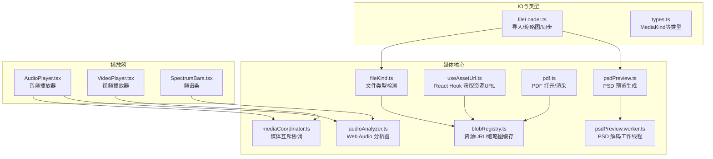
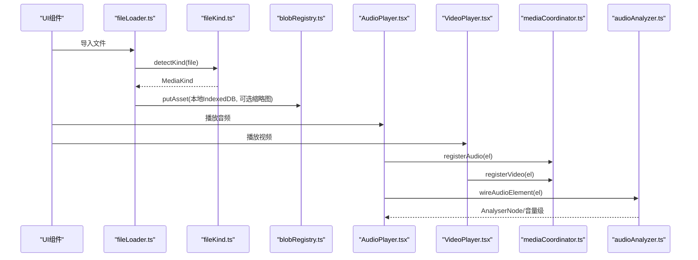
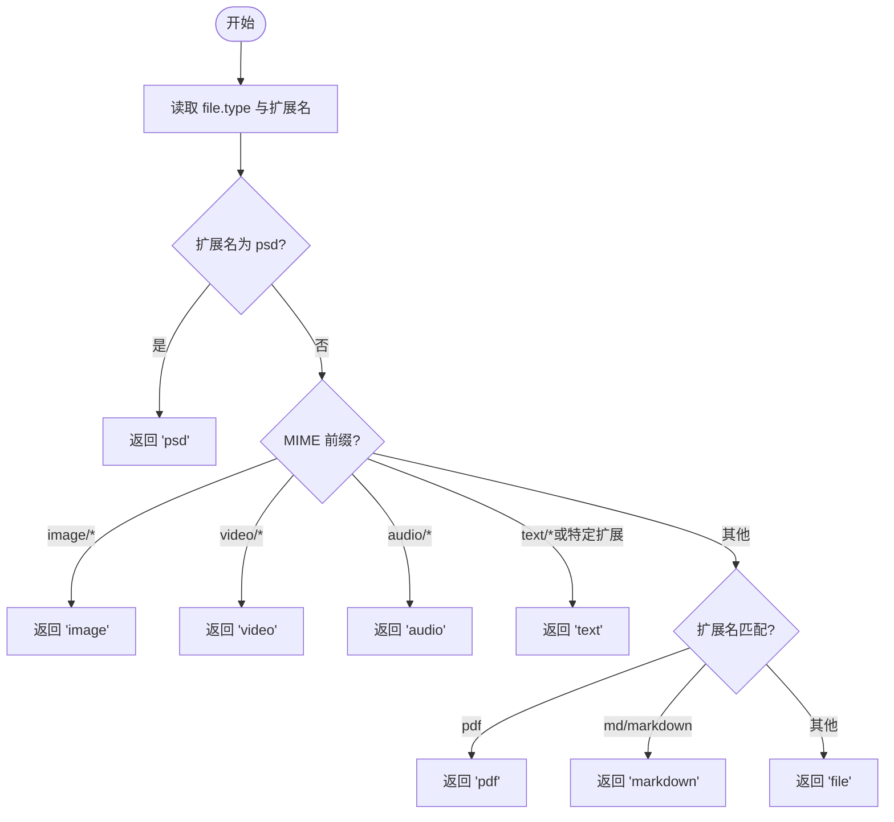
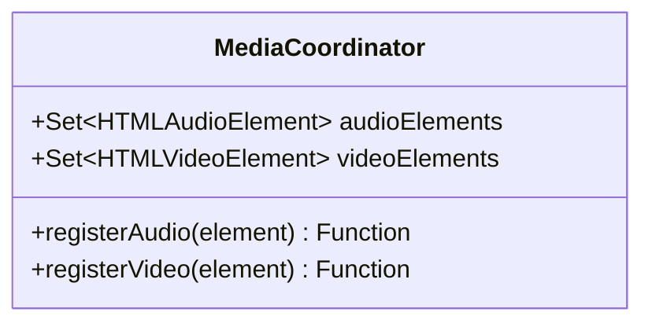
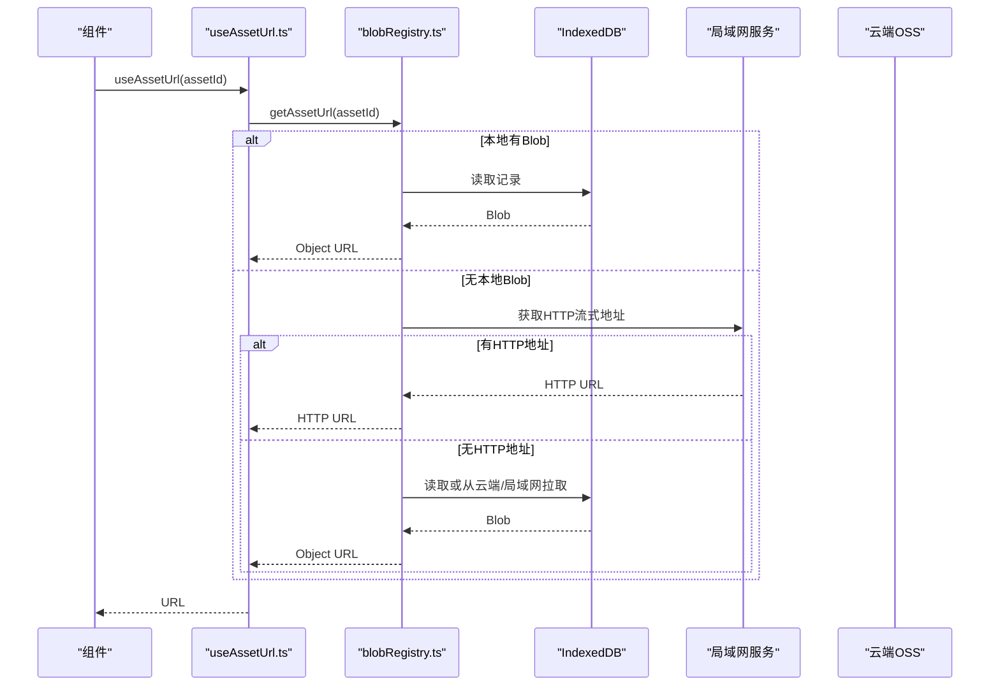
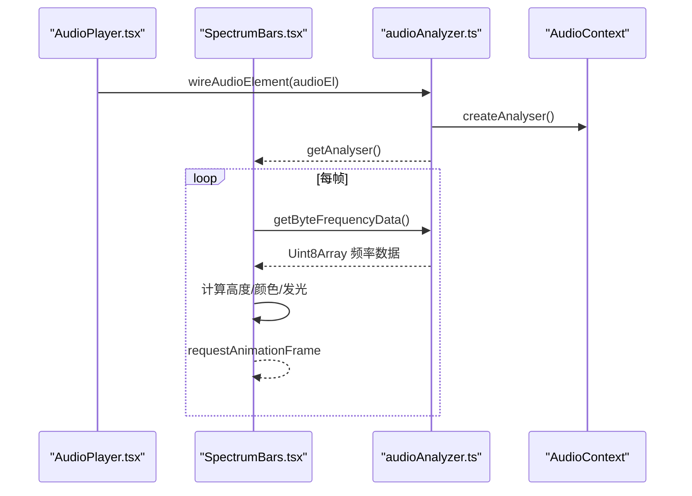
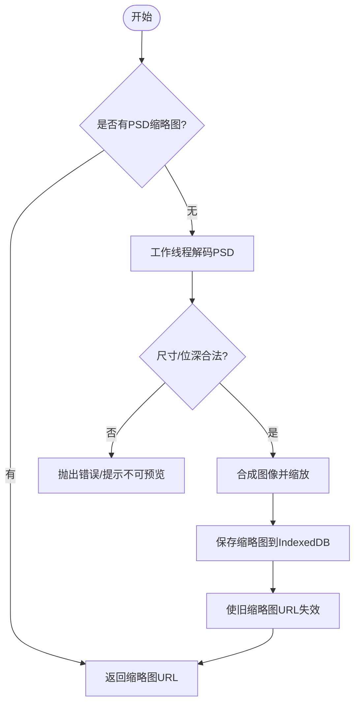
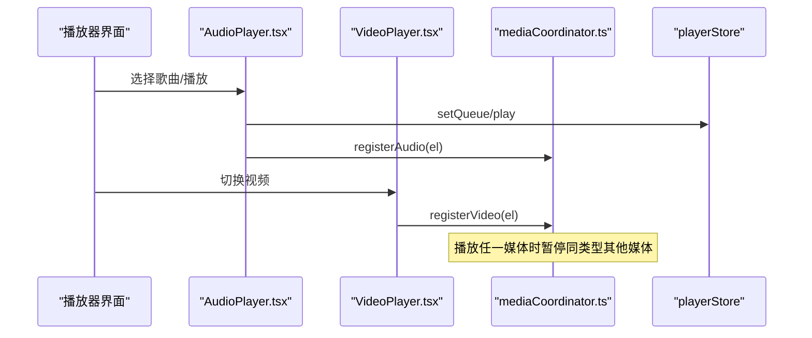
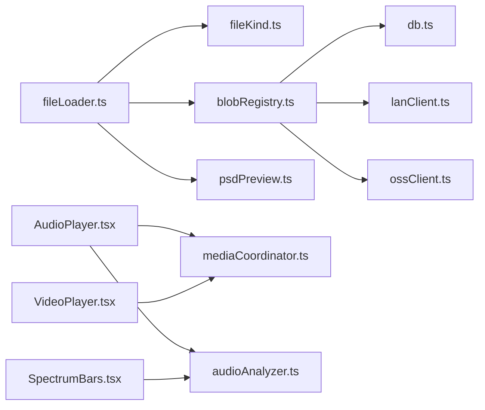

# 媒体处理系统

<cite>
**本文引用的文件**
- [mediaCoordinator.ts](file://src/media/mediaCoordinator.ts)
- [fileKind.ts](file://src/media/fileKind.ts)
- [audioAnalyzer.ts](file://src/media/audioAnalyzer.ts)
- [pdf.ts](file://src/media/pdf.ts)
- [psdPreview.ts](file://src/media/psdPreview.ts)
- [psdPreview.worker.ts](file://src/media/psdPreview.worker.ts)
- [blobRegistry.ts](file://src/media/blobRegistry.ts)
- [useAssetUrl.ts](file://src/media/useAssetUrl.ts)
- [managedFile.ts](file://src/media/managedFile.ts)
- [AudioPlayer.tsx](file://src/components/AudioPlayer.tsx)
- [VideoPlayer.tsx](file://src/components/VideoPlayer.tsx)
- [SpectrumBars.tsx](file://src/components/SpectrumBars.tsx)
- [fileLoader.ts](file://src/io/fileLoader.ts)
- [types.ts](file://src/types.ts)
</cite>

## 目录
1. [简介](#简介)
2. [项目结构](#项目结构)
3. [核心组件](#核心组件)
4. [架构总览](#架构总览)
5. [详细组件分析](#详细组件分析)
6. [依赖关系分析](#依赖关系分析)
7. [性能与内存管理](#性能与内存管理)
8. [故障排查指南](#故障排查指南)
9. [结论](#结论)

## 简介
本文件系统面向 SuQCanvas 的媒体处理能力，围绕“媒体协调器”展开，涵盖文件识别、格式检测、资源加载与缓存、音频分析（频谱可视化、波形幅度、播放进度）、PDF/PSD 特殊处理、以及跨端（本地 IndexedDB、局域网、云端 OSS）的资源管理与性能优化。目标是让开发者快速理解并扩展媒体子系统，同时为使用者提供清晰的加载机制与使用建议。

## 项目结构
媒体子系统主要位于 src/media，配合 UI 播放器组件与 IO 导入流程：
- 媒体协调与解析：mediaCoordinator.ts、fileKind.ts
- 资源定位与缓存：blobRegistry.ts、useAssetUrl.ts
- 音频分析：audioAnalyzer.ts、SpectrumBars.tsx
- 文档与设计文件：pdf.ts、psdPreview.ts、psdPreview.worker.ts
- 播放器集成：AudioPlayer.tsx、VideoPlayer.tsx
- 导入与节点创建：fileLoader.ts
- 类型定义：types.ts

图表来源
- [fileKind.ts:1-24](file://src/media/fileKind.ts#L1-L24)
- [mediaCoordinator.ts:1-25](file://src/media/mediaCoordinator.ts#L1-L25)
- [blobRegistry.ts:1-389](file://src/media/blobRegistry.ts#L1-L389)
- [useAssetUrl.ts:1-157](file://src/media/useAssetUrl.ts#L1-L157)
- [audioAnalyzer.ts:1-59](file://src/media/audioAnalyzer.ts#L1-L59)
- [pdf.ts:1-50](file://src/media/pdf.ts#L1-L50)
- [psdPreview.ts:1-62](file://src/media/psdPreview.ts#L1-L62)
- [psdPreview.worker.ts:1-82](file://src/media/psdPreview.worker.ts#L1-L82)
- [AudioPlayer.tsx:1-1144](file://src/components/AudioPlayer.tsx#L1-L1144)
- [VideoPlayer.tsx:1-900](file://src/components/VideoPlayer.tsx#L1-L900)
- [SpectrumBars.tsx:1-120](file://src/components/SpectrumBars.tsx#L1-L120)
- [fileLoader.ts:1-297](file://src/io/fileLoader.ts#L1-L297)
- [types.ts:1-112](file://src/types.ts#L1-L112)

章节来源
- [fileKind.ts:1-24](file://src/media/fileKind.ts#L1-L24)
- [mediaCoordinator.ts:1-25](file://src/media/mediaCoordinator.ts#L1-L25)
- [blobRegistry.ts:1-389](file://src/media/blobRegistry.ts#L1-L389)
- [useAssetUrl.ts:1-157](file://src/media/useAssetUrl.ts#L1-L157)
- [audioAnalyzer.ts:1-59](file://src/media/audioAnalyzer.ts#L1-L59)
- [pdf.ts:1-50](file://src/media/pdf.ts#L1-L50)
- [psdPreview.ts:1-62](file://src/media/psdPreview.ts#L1-L62)
- [psdPreview.worker.ts:1-82](file://src/media/psdPreview.worker.ts#L1-L82)
- [AudioPlayer.tsx:1-1144](file://src/components/AudioPlayer.tsx#L1-L1144)
- [VideoPlayer.tsx:1-900](file://src/components/VideoPlayer.tsx#L1-L900)
- [SpectrumBars.tsx:1-120](file://src/components/SpectrumBars.tsx#L1-L120)
- [fileLoader.ts:1-297](file://src/io/fileLoader.ts#L1-L297)
- [types.ts:1-112](file://src/types.ts#L1-L112)

## 核心组件
- 文件识别与格式检测：基于 MIME 与扩展名判断媒体种类，支持图片、视频、音频、PDF、Markdown、文本、PSD 等。
- 媒体协调器：全局维护音频/视频元素集合，同一时刻仅允许一个同类型媒体播放，避免冲突。
- 资源管理：统一通过 blobRegistry 获取资源 URL 与缩略图，优先本地 IndexedDB，其次局域网 HTTP 流式地址，最后回退到全量下载；含并发控制与重试策略。
- 音频分析：单例 Web Audio 分析器，将当前播放的 <audio> 接入 AnalyserNode，提供频谱数据与音量级，驱动频谱条与背景动画。
- PDF/PSD 特殊处理：PDF 通过 pdfjs 打开与渲染至 Canvas；PSD 在工作线程中解码合成图像并生成预览图，限制尺寸与内存。
- React Hook：useAssetUrl/useThumbnailUrl 封装资源加载与轮询重试，适配局域网异步传输场景。

章节来源
- [fileKind.ts:1-24](file://src/media/fileKind.ts#L1-L24)
- [mediaCoordinator.ts:1-25](file://src/media/mediaCoordinator.ts#L1-L25)
- [blobRegistry.ts:1-389](file://src/media/blobRegistry.ts#L1-L389)
- [audioAnalyzer.ts:1-59](file://src/media/audioAnalyzer.ts#L1-L59)
- [pdf.ts:1-50](file://src/media/pdf.ts#L1-L50)
- [psdPreview.ts:1-62](file://src/media/psdPreview.ts#L1-L62)
- [useAssetUrl.ts:1-157](file://src/media/useAssetUrl.ts#L1-L157)

## 架构总览
媒体子系统采用分层设计：
- 输入层：fileLoader 负责文件导入、缩略图生成、云/局域网同步。
- 识别层：fileKind 判定媒体类型，供上层分支处理。
- 资源层：blobRegistry 提供 getAssetUrl/getThumbnailUrl，统一管理本地/网络/流式资源与缓存。
- 播放层：AudioPlayer/VideoPlayer 消费资源 URL，注册到 mediaCoordinator 进行互斥控制。
- 分析层：audioAnalyzer 提供频谱/音量数据，SpectrumBars 渲染可视化。
- 文档层：pdf.ts 渲染 PDF 页面；psdPreview 在工作线程解码 PSD 生成预览。

图表来源
- [fileLoader.ts:77-117](file://src/io/fileLoader.ts#L77-L117)
- [fileKind.ts:3-16](file://src/media/fileKind.ts#L3-L16)
- [blobRegistry.ts:84-126](file://src/media/blobRegistry.ts#L84-L126)
- [AudioPlayer.tsx:325-330](file://src/components/AudioPlayer.tsx#L325-L330)
- [VideoPlayer.tsx:325-330](file://src/components/VideoPlayer.tsx#L325-L330)
- [mediaCoordinator.ts:7-24](file://src/media/mediaCoordinator.ts#L7-L24)
- [audioAnalyzer.ts:26-39](file://src/media/audioAnalyzer.ts#L26-L39)

## 详细组件分析

### 文件识别与格式检测
- 依据 file.type 与文件扩展名推断 MediaKind，优先级：psd > image/video/audio > pdf/markdown/text > file。
- 提供 formatBytes 用于显示文件大小。

图表来源
- [fileKind.ts:3-16](file://src/media/fileKind.ts#L3-L16)

章节来源
- [fileKind.ts:1-24](file://src/media/fileKind.ts#L1-L24)

### 媒体协调器（互斥播放）
- 维护 audioElements 与 videoElements 两个 Set，监听 play 事件，在任意媒体触发播放时暂停同类型的其他媒体。
- 提供 registerAudio/registerVideo 注册函数，组件挂载时注册，卸载时自动清理。

图表来源
- [mediaCoordinator.ts:4-24](file://src/media/mediaCoordinator.ts#L4-L24)

章节来源
- [mediaCoordinator.ts:1-25](file://src/media/mediaCoordinator.ts#L1-L25)

### 资源管理与缓存策略
- getAssetUrl：优先本地 Blob URL，若存在则直接返回；否则尝试局域网 HTTP 流式地址；最后回退到 IndexedDB Blob 并创建 Object URL。
- getThumbnailUrl：优先局域网已同步封面；若无，则对视频进行抓帧生成封面，包含黑帧检测与重试；HTTP 抓帧失败时一次性拉取全量作为兜底。
- 并发控制：缩略图抓取最多并发数，避免阻塞浏览器连接池。
- 失效与释放：invalidateAssetUrl/invalidateThumbnailUrl/revokeAllUrls 管理 URL 生命周期，防止内存泄漏。

图表来源
- [useAssetUrl.ts:10-44](file://src/media/useAssetUrl.ts#L10-L44)
- [blobRegistry.ts:84-126](file://src/media/blobRegistry.ts#L84-L126)

章节来源
- [blobRegistry.ts:1-389](file://src/media/blobRegistry.ts#L1-L389)
- [useAssetUrl.ts:1-157](file://src/media/useAssetUrl.ts#L1-L157)

### 音频分析与可视化
- 单例 AudioContext + AnalyserNode，首次使用时创建并配置 FFT 与平滑参数。
- wireAudioElement：将当前播放的 <audio> 接入分析器，WeakSet 保证每个元素只接一次。
- getAnalyser/getAudioLevel：提供频率数据与归一化音量级，供频谱条与背景动画使用。
- SpectrumBars：按封面主色绘制频谱条，具备感知曲线、缓动、基线保持等视觉优化。

图表来源
- [audioAnalyzer.ts:8-39](file://src/media/audioAnalyzer.ts#L8-L39)
- [SpectrumBars.tsx:28-112](file://src/components/SpectrumBars.tsx#L28-L112)

章节来源
- [audioAnalyzer.ts:1-59](file://src/media/audioAnalyzer.ts#L1-L59)
- [SpectrumBars.tsx:1-120](file://src/components/SpectrumBars.tsx#L1-L120)

### PDF 与 PSD 特殊处理
- PDF：
  - 初始化 pdfjs worker 与 cMap/标准字体/WASM 路径，确保 CJK 与标准字体正常显示。
  - openPdf/closePdf：打开/关闭文档任务，renderPageToCanvas：按设备像素比缩放渲染到 Canvas。
- PSD：
  - 在工作线程中使用 ag-psd 解码，限制最大边长、像素总数与位深，提取合成图像并缩放到预览尺寸，输出 JPEG Blob。
  - ensurePsdPreview：若本地无缩略图则生成并持久化，同时使缩略图 URL 失效以刷新视图。

图表来源
- [pdf.ts:1-50](file://src/media/pdf.ts#L1-L50)
- [psdPreview.ts:42-60](file://src/media/psdPreview.ts#L42-L60)
- [psdPreview.worker.ts:41-81](file://src/media/psdPreview.worker.ts#L41-L81)

章节来源
- [pdf.ts:1-50](file://src/media/pdf.ts#L1-L50)
- [psdPreview.ts:1-62](file://src/media/psdPreview.ts#L1-L62)
- [psdPreview.worker.ts:1-82](file://src/media/psdPreview.worker.ts#L1-L82)

### 播放器集成与播放进度跟踪
- 音频播放器：
  - 构建歌单与流式顺序，支持顺序/循环/随机/流式播放模式。
  - 歌词加载与对齐，专辑图收集与轮换，键盘快捷键操作。
  - 通过 mediaCoordinator 注册音频元素，实现互斥播放。
- 视频播放器：
  - 批量加载缩略图与时长探测，全屏/画中画控制，进度拖拽与缓冲显示。
  - 通过 mediaCoordinator 注册视频元素，实现互斥播放。

图表来源
- [AudioPlayer.tsx:123-132](file://src/components/AudioPlayer.tsx#L123-L132)
- [VideoPlayer.tsx:325-330](file://src/components/VideoPlayer.tsx#L325-L330)
- [mediaCoordinator.ts:7-24](file://src/media/mediaCoordinator.ts#L7-L24)

章节来源
- [AudioPlayer.tsx:1-1144](file://src/components/AudioPlayer.tsx#L1-L1144)
- [VideoPlayer.tsx:1-900](file://src/components/VideoPlayer.tsx#L1-L900)

## 依赖关系分析
- fileLoader 依赖 fileKind 进行类型识别，并在导入时生成缩略图（视频/PSD），随后写入 IndexedDB 并尝试同步到局域网与云端。
- blobRegistry 依赖 IndexedDB、局域网客户端与云端客户端，提供统一的资源访问接口。
- AudioPlayer/VideoPlayer 依赖 mediaCoordinator 进行互斥控制，依赖 useAssetUrl 获取资源 URL。
- audioAnalyzer 被 SpectrumBars 与音频播放器间接使用，提供实时分析能力。
- pdf.ts 与 psdPreview 分别处理文档与设计文件的渲染与预览。

图表来源
- [fileLoader.ts:77-117](file://src/io/fileLoader.ts#L77-L117)
- [blobRegistry.ts:1-389](file://src/media/blobRegistry.ts#L1-L389)
- [AudioPlayer.tsx:325-330](file://src/components/AudioPlayer.tsx#L325-L330)
- [VideoPlayer.tsx:325-330](file://src/components/VideoPlayer.tsx#L325-L330)
- [audioAnalyzer.ts:26-39](file://src/media/audioAnalyzer.ts#L26-L39)

章节来源
- [fileLoader.ts:1-297](file://src/io/fileLoader.ts#L1-L297)
- [blobRegistry.ts:1-389](file://src/media/blobRegistry.ts#L1-L389)
- [AudioPlayer.tsx:1-1144](file://src/components/AudioPlayer.tsx#L1-L1144)
- [VideoPlayer.tsx:1-900](file://src/components/VideoPlayer.tsx#L1-L900)
- [audioAnalyzer.ts:1-59](file://src/media/audioAnalyzer.ts#L1-L59)

## 性能与内存管理
- 资源 URL 缓存：urlCache/thumbCache 减少重复创建 Object URL，配合 invalidate/revoke 及时释放。
- 并发控制：缩略图抓取限制并发数量，避免阻塞视频播放与连接池。
- 流式播放：视频优先使用局域网 HTTP 流式地址，避免整份下载到本地造成内存/磁盘压力。
- 黑帧检测与重试：视频封面抓取时检测黑帧并 seek 到下一采样点重试，提升成功率。
- 工作线程隔离：PSD 解码在 Worker 中进行，限制最大尺寸与内存，防止主线程卡顿。
- 音频分析单例：避免重复创建 AudioContext，降低开销。
- 懒加载与重试：useAssetUrl/useThumbnailUrl 支持重试与轮询，适应局域网异步传输场景。

[本节为通用性能指导，不直接分析具体文件]

## 故障排查指南
- 资源加载失败：
  - 检查 useAssetUrl 的重试逻辑与 toast 提示，确认局域网/云端是否可用。
  - 查看 blobRegistry 中的 getAssetUrl/getAssetBlob 分支，确认本地 IndexedDB 是否存在记录。
- 视频封面生成失败：
  - 检查跨域设置（crossOrigin=anonymous）与服务器 CORS 响应头。
  - 关注黑帧检测与重试次数，必要时强制拉取全量 Blob 作为兜底。
- PSD 无法预览：
  - 检查工作线程错误回调与尺寸/位深限制，确认文件是否过大或位深不支持。
- 音频频谱无响应：
  - 确认 wireAudioElement 已成功接入当前播放的 <audio>，且 AnalyserNode 可用。
  - 检查浏览器是否阻止了 AudioContext 自动播放策略。

章节来源
- [blobRegistry.ts:128-239](file://src/media/blobRegistry.ts#L128-L239)
- [blobRegistry.ts:310-379](file://src/media/blobRegistry.ts#L310-L379)
- [psdPreview.worker.ts:29-39](file://src/media/psdPreview.worker.ts#L29-L39)
- [audioAnalyzer.ts:26-39](file://src/media/audioAnalyzer.ts#L26-L39)

## 结论
SuQCanvas 的媒体处理系统以“媒体协调器”为核心，结合文件识别、资源缓存、音频分析、文档与设计文件特殊处理，构建了高效、可扩展的媒体管线。通过本地/局域网/云端的多源资源管理、严格的并发与内存控制、以及完善的错误处理与重试机制，系统在复杂网络与多端环境下仍能提供稳定流畅的媒体体验。开发者可在此基础上继续扩展新的媒体格式与可视化能力。