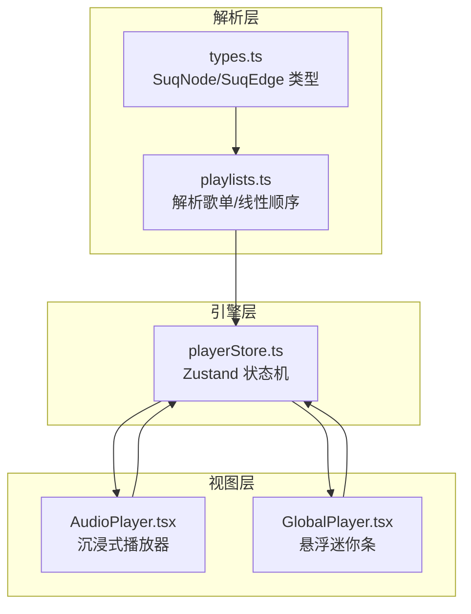
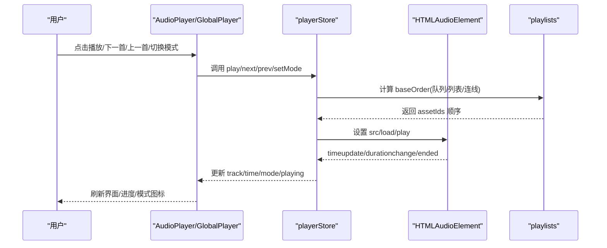
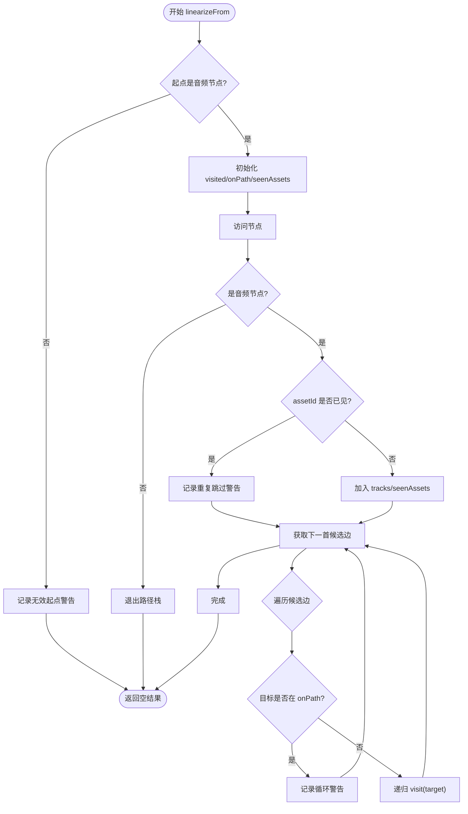
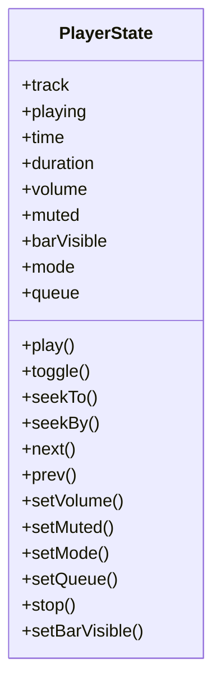
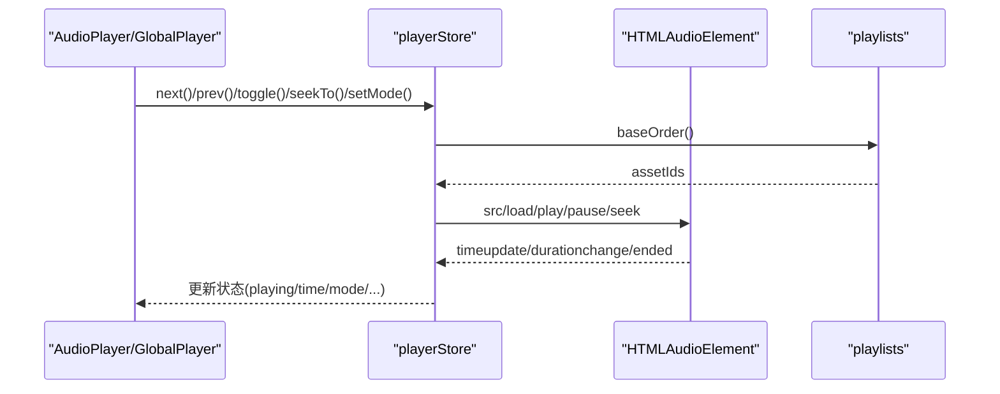
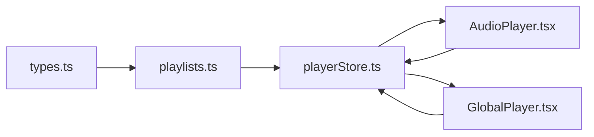

# 播放列表管理

<cite>
**本文引用的文件**
- [playlists.ts](file://src/media/playlists.ts)
- [playerStore.ts](file://src/store/playerStore.ts)
- [AudioPlayer.tsx](file://src/components/AudioPlayer.tsx)
- [GlobalPlayer.tsx](file://src/components/GlobalPlayer.tsx)
- [types.ts](file://src/types.ts)
- [playlists.test.ts](file://src/media/playlists.test.ts)
</cite>

## 目录
1. [简介](#简介)
2. [项目结构](#项目结构)
3. [核心组件](#核心组件)
4. [架构总览](#架构总览)
5. [详细组件分析](#详细组件分析)
6. [依赖关系分析](#依赖关系分析)
7. [性能考量](#性能考量)
8. [故障排查指南](#故障排查指南)
9. [结论](#结论)
10. [附录：使用示例与自定义逻辑](#附录使用示例与自定义逻辑)

## 简介
本模块实现“播放列表管理”，围绕画布图结构派生的歌单、引擎级播放状态与多模式导航（顺序、随机、列表循环、单曲循环、流式）展开。其目标包括：
- 数据结构：歌曲队列、播放顺序、重复模式、随机播放等。
- 播放状态：当前播放项、进度、音量控制、播放历史（通过上一首/下一首可回溯）。
- 持久化：本地存储（歌词偏移、喜欢标记、歌词显示模式），同步策略（云/局域网/对象存储由其他模块负责，本模块聚焦播放相关数据）。
- 控制接口：播放、暂停、下一首、上一首、跳转播放等。
- 交互设计：播放器界面、悬浮条、队列面板、歌单入口、键盘快捷键。
- 示例与扩展：基于现有接口的使用示例与自定义播放逻辑思路。

## 项目结构
播放列表管理涉及三层：
- 解析层：从画布节点和边中解析出歌单与线性播放顺序。
- 引擎层：单一全局音频元素 + Zustand 状态管理，维护播放状态与导航逻辑。
- 视图层：沉浸式播放器与悬浮迷你条，提供用户交互与状态展示。

图表来源
- [playlists.ts:1-179](file://src/media/playlists.ts#L1-L179)
- [playerStore.ts:1-298](file://src/store/playerStore.ts#L1-L298)
- [AudioPlayer.tsx:125-371](file://src/components/AudioPlayer.tsx#L125-L371)
- [GlobalPlayer.tsx:1-234](file://src/components/GlobalPlayer.tsx#L1-L234)
- [types.ts:100-107](file://src/types.ts#L100-L107)

章节来源
- [playlists.ts:1-179](file://src/media/playlists.ts#L1-L179)
- [playerStore.ts:1-298](file://src/store/playerStore.ts#L1-L298)
- [AudioPlayer.tsx:125-371](file://src/components/AudioPlayer.tsx#L125-L371)
- [GlobalPlayer.tsx:1-234](file://src/components/GlobalPlayer.tsx#L1-L234)
- [types.ts:100-107](file://src/types.ts#L100-L107)

## 核心组件
- 解析器 playlists.ts
  - 将画布的文本节点（命名）、音频节点与边组织为“歌单”，并按 DFS 先序与边 order 生成线性播放顺序。
  - 提供缓存机制避免重复解析。
- 播放器引擎 playerStore.ts
  - 单一 HTMLAudioElement 绑定，集中管理 track、playing、time、duration、volume、muted、mode、queue。
  - 提供 play/toggle/seek/next/prev/setMode/setQueue 等接口。
  - 根据 mode 决定自动续播行为（顺序/随机/列表循环/单曲循环/流式）。
- 视图 AudioPlayer.tsx
  - 沉浸式播放器：队列面板、歌单面板、搜索排序、歌词、专辑背景、键盘快捷键。
  - 注册歌曲列表顺序提供者给引擎，用于非流式模式的导航基准。
  - 支持从画布歌单入口设置队列并进入流式模式。
- 视图 GlobalPlayer.tsx
  - 常驻悬浮迷你条：拖拽、最小化、画中画、隐藏但继续播放。
  - 监听 audio 事件驱动 store 状态更新，并在 onEnded 时触发引擎续播。

章节来源
- [playlists.ts:1-179](file://src/media/playlists.ts#L1-L179)
- [playerStore.ts:1-298](file://src/store/playerStore.ts#L1-L298)
- [AudioPlayer.tsx:125-371](file://src/components/AudioPlayer.tsx#L125-L371)
- [GlobalPlayer.tsx:1-234](file://src/components/GlobalPlayer.tsx#L1-L234)

## 架构总览
播放列表的完整流程如下：
- 画布编辑：文本节点作为歌单名，指向首个音频节点；音频节点之间以边连接，边可设置 order。
- 解析阶段：按规则生成 Playlist 与 tracks，得到 assetIds 线性序列。
- 引擎阶段：根据当前模式与队列选择下一首；结束事件触发自动续播。
- 视图阶段：用户操作驱动引擎方法；引擎状态变化驱动 UI 更新。

图表来源
- [playerStore.ts:97-157](file://src/store/playerStore.ts#L97-L157)
- [playerStore.ts:163-297](file://src/store/playerStore.ts#L163-L297)
- [playlists.ts:71-112](file://src/media/playlists.ts#L71-L112)
- [AudioPlayer.tsx:240-249](file://src/components/AudioPlayer.tsx#L240-L249)
- [GlobalPlayer.tsx:160-179](file://src/components/GlobalPlayer.tsx#L160-L179)

## 详细组件分析

### 播放列表数据结构与解析
- 关键类型
  - SuqNode/SuqEdge：节点与边类型，边 data.order 控制分叉处的播放顺序。
  - Playlist/PlaylistTrack：歌单与曲目条目，包含 id/name/titleNodeId/rootNodeId/tracks/warnings。
  - LinearizeResult：线性化结果，包含 assetIds/tracks/warnings。
- 解析规则
  - 命名文本节点（无入边、恰好一条出边指向音频）作为歌单名，指向的首节点为根。
  - 从根出发沿“音频→音频”边做 DFS 先序遍历；分叉处按边 order 升序，未设置 order 的排在后面，再按创建顺序稳定排序。
  - 环/重复节点只遍历一次；同一 assetId 在歌单中仅保留第一次出现，其余跳过并告警。
  - 经由非音频节点的路径不穿透。
  - 多个文本指向同一首节点时，取第一个名字，其余忽略并告警。
- 缓存
  - resolvePlaylistsCached 对相同 nodes/edges 引用命中缓存，避免重复解析。

图表来源
- [playlists.ts:71-112](file://src/media/playlists.ts#L71-L112)
- [playlists.ts:56-69](file://src/media/playlists.ts#L56-L69)
- [types.ts:100-107](file://src/types.ts#L100-L107)

章节来源
- [playlists.ts:1-179](file://src/media/playlists.ts#L1-L179)
- [types.ts:100-107](file://src/types.ts#L100-L107)
- [playlists.test.ts:39-126](file://src/media/playlists.test.ts#L39-L126)

### 播放状态管理与导航
- 状态字段
  - track：当前曲目（含 assetId/name/url/nodeId）。
  - playing/time/duration/volume/muted/barVisible：播放状态与媒体信息。
  - mode：'sequential' | 'random' | 'loop' | 'single' | 'flow'。
  - queue：当前歌单队列（仅流式模式存在）。
- 导航基准
  - 优先级：队列 → 播放器列表（打开时注册的 orderProvider） → 画布连线顺序（flow 或默认）。
- 自动续播
  - ended 回调触发 handleEnded：单曲循环重播；其他模式按 baseOrder 选择下一首。
- 上一首/下一首
  - next：根据 mode 选择下一首（随机/顺序/循环），支持 wrap。
  - prev：返回列表前一首，若为首则回到末尾。
- 播放控制
  - play：加载并可选立即播放；同曲不重复加载。
  - seekTo/seekBy：跳转与快进快退。
  - setVolume/setMuted：音量与静音。
  - stop：停止并清空状态。

图表来源
- [playerStore.ts:25-50](file://src/store/playerStore.ts#L25-L50)
- [playerStore.ts:163-297](file://src/store/playerStore.ts#L163-L297)

章节来源
- [playerStore.ts:1-298](file://src/store/playerStore.ts#L1-L298)

### 播放控制接口与交互
- 接口清单
  - 播放：play({assetId,name,nodeId}, {autoplay})
  - 切换：toggle()
  - 跳转：seekTo(time), seekBy(delta)
  - 切歌：next({autoplay, wrap}), prev()
  - 音量：setVolume(value), setMuted(muted)
  - 模式：setMode(mode)
  - 队列：setQueue(queue)
  - 停止：stop()
  - 可见性：setBarVisible(visible)
- 视图交互
  - AudioPlayerView：队列面板、歌单面板、搜索排序、歌词、专辑背景、键盘快捷键（空格/方向键/L）。
  - GlobalPlayer：悬浮迷你条拖拽、画中画、隐藏继续播放。
  - 模式切换：顺序/随机/列表循环/单曲循环/流式。

图表来源
- [playerStore.ts:97-157](file://src/store/playerStore.ts#L97-L157)
- [playerStore.ts:163-297](file://src/store/playerStore.ts#L163-L297)
- [AudioPlayer.tsx:377-419](file://src/components/AudioPlayer.tsx#L377-L419)
- [GlobalPlayer.tsx:160-179](file://src/components/GlobalPlayer.tsx#L160-L179)

章节来源
- [playerStore.ts:1-298](file://src/store/playerStore.ts#L1-L298)
- [AudioPlayer.tsx:125-371](file://src/components/AudioPlayer.tsx#L125-L371)
- [GlobalPlayer.tsx:1-234](file://src/components/GlobalPlayer.tsx#L1-L234)

### 播放列表的持久化与同步
- 本地存储
  - 歌词偏移：localStorage 保存每首歌的 offsetMs，用于对齐歌词。
  - 喜欢标记：localStorage 保存 liked 映射。
  - 歌词文字模式：localStorage 保存 auto/light/dark。
- 同步策略
  - 播放列表本身由画布图结构派生，随项目持久化（画布节点/边）。
  - 云/局域网/对象存储由其他模块负责；本模块专注播放相关数据的本地持久化。
- 数据迁移
  - 播放列表解析规则变更时，可通过重新解析获得新顺序；无需额外迁移脚本。

章节来源
- [AudioPlayer.tsx:44-98](file://src/components/AudioPlayer.tsx#L44-L98)
- [playlists.ts:1-179](file://src/media/playlists.ts#L1-L179)

### 播放历史与回溯
- 通过 prev() 可回退到上一首；当处于列表首位时回到末尾，形成环形历史。
- 结合 mode=loop 可实现列表循环播放，提升连续体验。
- 注意：历史记录并非显式数组，而是通过 baseOrder 与当前位置推导。

章节来源
- [playerStore.ts:251-259](file://src/store/playerStore.ts#L251-L259)

## 依赖关系分析
- playlists.ts 依赖 types.ts 中的 SuqNode/SuqEdge 定义。
- playerStore.ts 依赖 playlists.ts 进行线性顺序计算，依赖 canvasStore 获取节点/边。
- AudioPlayer.tsx 依赖 playerStore.ts 与 playlists.ts，同时注册 orderProvider。
- GlobalPlayer.tsx 依赖 playerStore.ts 与 playlists.ts，负责音频事件与状态同步。

图表来源
- [types.ts:100-107](file://src/types.ts#L100-L107)
- [playlists.ts:17-18](file://src/media/playlists.ts#L17-L18)
- [playerStore.ts:5-7](file://src/store/playerStore.ts#L5-L7)
- [AudioPlayer.tsx:28-34](file://src/components/AudioPlayer.tsx#L28-L34)
- [GlobalPlayer.tsx:5-8](file://src/components/GlobalPlayer.tsx#L5-L8)

章节来源
- [types.ts:100-107](file://src/types.ts#L100-L107)
- [playlists.ts:17-18](file://src/media/playlists.ts#L17-L18)
- [playerStore.ts:5-7](file://src/store/playerStore.ts#L5-L7)
- [AudioPlayer.tsx:28-34](file://src/components/AudioPlayer.tsx#L28-L34)
- [GlobalPlayer.tsx:5-8](file://src/components/GlobalPlayer.tsx#L5-L8)

## 性能考量
- 解析缓存：resolvePlaylistsCached 对相同 nodes/edges 引用命中缓存，减少重复 DFS。
- 去重策略：按 assetId 去重，避免重复收录同一歌曲。
- 事件节流：audio 事件驱动 store 更新，避免频繁重渲染。
- 列表提供者：orderProvider 仅在播放器打开期间注册，关闭后释放，降低开销。
- 资源加载：同曲不重复加载，快速响应再次播放。

[本节为通用指导，不直接分析具体文件]

## 故障排查指南
- 无法播放
  - 检查 audio 元素是否绑定（bindPlayerAudio）。
  - 确认 URL 可用（getAssetUrl 成功）。
  - 浏览器策略可能阻止自动播放，需用户交互触发。
- 顺序异常
  - 检查边 order 设置是否正确。
  - 确认起点是否为有效音频节点。
  - 查看 warnings 是否提示循环或重复。
- 流式模式不生效
  - 确保设置了 nodeId，以便按画布连线解析顺序。
  - 检查 mode 是否为 'flow'。
- 歌词不同步
  - 调整歌词偏移并保存到 localStorage。
  - 确认歌词源正确加载。

章节来源
- [playerStore.ts:72-88](file://src/store/playerStore.ts#L72-L88)
- [playerStore.ts:97-116](file://src/store/playerStore.ts#L97-L116)
- [playlists.ts:71-112](file://src/media/playlists.ts#L71-L112)
- [AudioPlayer.tsx:429-439](file://src/components/AudioPlayer.tsx#L429-L439)

## 结论
本模块以画布图结构为核心，实现了高内聚的播放列表解析与统一的播放引擎。通过清晰的模式划分与状态管理，提供了流畅的用户体验与可扩展的自定义能力。配合本地持久化与丰富的交互设计，满足日常播放与高级场景需求。

[本节为总结，不直接分析具体文件]

## 附录：使用示例与自定义逻辑

### 基本使用示例
- 从画布歌单入口播放
  - 在 AudioPlayerView 中通过 initialPlaylistId 设置队列，并进入流式模式。
  - 参考路径：[openPlaylistAt:337-351](file://src/components/AudioPlayer.tsx#L337-L351)
- 手动选择歌曲
  - 调用 play({assetId,name,nodeId}, {autoplay:true})。
  - 参考路径：[selectTrack:322-335](file://src/components/AudioPlayer.tsx#L322-L335)
- 切换播放模式
  - 调用 setMode('sequential'|'random'|'loop'|'single'|'flow')。
  - 参考路径：[cycleMode:314-318](file://src/components/AudioPlayer.tsx#L314-L318)

### 自定义播放逻辑思路
- 自定义导航基准
  - 通过 setOrderProvider 提供自定义顺序（例如按收藏、评分排序）。
  - 参考路径：[setOrderProvider:67-70](file://src/store/playerStore.ts#L67-L70)
- 自定义续播策略
  - 在 handleEnded 基础上扩展逻辑（如按条件跳过、插入广告等）。
  - 参考路径：[handleEnded:132-157](file://src/store/playerStore.ts#L132-L157)
- 自定义队列管理
  - 通过 setQueue 动态设置队列，并结合 mode='flow' 使用。
  - 参考路径：[setQueue:274-276](file://src/store/playerStore.ts#L274-L276)

### 测试与验证
- 线性化规则验证
  - 单链顺序、分叉顺序、边序号覆盖、环检测、自环、重复 assetId、子歌单、非音频穿透、无效起点等。
  - 参考路径：[linearizeFrom 测试:39-126](file://src/media/playlists.test.ts#L39-L126)
- 歌单解析验证
  - 命名文本识别、注释文本、多出边文本、空文本、指向非音频、多文本同首节点、多独立歌单、无名歌单等。
  - 参考路径：[resolvePlaylists 测试:141-219](file://src/media/playlists.test.ts#L141-L219)
- 缓存与查找
  - 缓存命中与失效、findPlaylistByAsset 行为。
  - 参考路径：[缓存测试/查找测试:221-244](file://src/media/playlists.test.ts#L221-L244)

章节来源
- [AudioPlayer.tsx:314-351](file://src/components/AudioPlayer.tsx#L314-L351)
- [playerStore.ts:67-70](file://src/store/playerStore.ts#L67-L70)
- [playerStore.ts:132-157](file://src/store/playerStore.ts#L132-L157)
- [playlists.test.ts:39-244](file://src/media/playlists.test.ts#L39-L244)